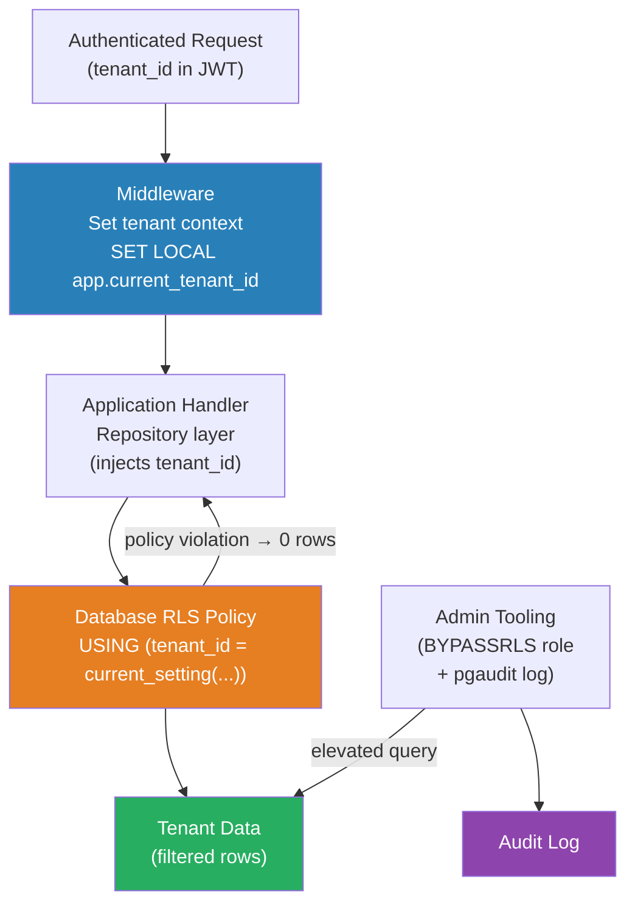

# [BEE-401] Tenant Isolation Strategies

:::info
Tenant isolation is the set of technical mechanisms that prevent one tenant's data, compute, or requests from affecting another — spanning database policies, infrastructure boundaries, and application-layer enforcement.
:::

## Context

BEE-400 describes the three deployment models (silo, pool, bridge) and when to choose each. This article covers how isolation is actually enforced within those models. Choosing a model is a design decision; enforcing isolation correctly is an implementation discipline.

The fundamental challenge is that isolation failures are silent. A missing WHERE clause or a misconfigured policy does not throw an exception — it returns data that should not be visible, or allows a write that should not succeed. Isolation bugs are among the most severe class of SaaS vulnerability because the customer impact is data exposure across tenant boundaries.

Isolation must be enforced at multiple layers independently. Application-layer enforcement alone is insufficient: a SQL injection, an ORM misconfiguration, or a developer writing a direct query in an admin tool bypasses it. Database-layer enforcement alone is insufficient for compute or network isolation. Defense-in-depth — enforcement at every layer that can enforce it — is the only robust approach.

## Database-Level Isolation

Three strategies exist, corresponding roughly to the three deployment models:

**Database-per-tenant**: Each tenant is provisioned a separate database instance. The isolation guarantee comes from the operating system: a connection to Tenant A's database cannot reach Tenant B's data regardless of what SQL is executed. This is the strongest isolation and the only option acceptable for tenants with data residency contractual requirements. The operational cost is proportional to tenant count — migrations must run against every tenant database, monitoring must aggregate across all instances, and connection pooling must be managed per-tenant.

**Schema-per-tenant** (PostgreSQL `CREATE SCHEMA`): All tenant schemas live within the same database instance but in separate namespaces. A connection's `search_path` determines which schema is active, and tables in one schema are invisible to queries that do not explicitly reference that schema. This is weaker than database-per-tenant — a DBA error or an excessively privileged role can cross schemas — but it enables simpler migration tooling (one connection, multiple schemas) and lower per-tenant infrastructure cost. Schema-level migrations are executed with `SET search_path TO tenant_schema` before running DDL.

**Shared table with discriminator column + Row-Level Security (RLS)**: All tenants share the same tables, distinguished by a `tenant_id` foreign key. RLS policies attached to each table restrict which rows each database session can see or modify. This is the pool model's enforcement mechanism.

PostgreSQL RLS works as follows: when `ENABLE ROW LEVEL SECURITY` is set on a table, every query is filtered by the active policy's `USING` expression before any rows are returned. The `USING` clause defines the visibility filter for SELECT/UPDATE/DELETE. The `WITH CHECK` clause defines the constraint for INSERT/UPDATE — it must return true for the row being written. If no row satisfies the policy, the query returns zero rows (not an error), which makes silent policy bypass the primary failure mode to guard against.

The session variable pattern is the standard way to bind tenant context to an RLS policy without creating one database user per tenant:

```sql
-- Application sets this at the start of every transaction
SET LOCAL app.current_tenant_id = '<uuid>';

-- RLS policy reads it
CREATE POLICY tenant_isolation ON orders
  AS PERMISSIVE
  FOR ALL
  TO application_role
  USING (tenant_id = current_setting('app.current_tenant_id')::uuid)
  WITH CHECK (tenant_id = current_setting('app.current_tenant_id')::uuid);
```

`SET LOCAL` scopes the variable to the current transaction only, which is correct for connection-pooled environments where a connection is reused by different requests. `SET` (without LOCAL) persists for the session and is dangerous in pools.

**RLS bypass**: PostgreSQL superusers and roles with the `BYPASSRLS` attribute bypass all RLS policies silently. Assign `BYPASSRLS` only to dedicated admin roles used exclusively in audited administrative tools, never to the application role.

## Compute Isolation

In containerized deployments, compute isolation is enforced through Kubernetes primitives:

- **Namespaces**: Each tenant (or tenant group) is assigned a Kubernetes Namespace. Namespaces scope RBAC bindings, ResourceQuotas, and NetworkPolicies. A `ServiceAccount` bound to one Namespace cannot list or access resources in another by default.
- **ResourceQuotas**: Define per-Namespace upper bounds on CPU requests, memory limits, pod count, and persistent volume claims. Without quotas, a single tenant's workload can consume all cluster resources, causing OOMKilled pods and scheduling starvation for other namespaces.
- **LimitRanges**: Set default resource requests and limits for pods that don't specify them, preventing unbounded containers that bypass quota enforcement.
- **NetworkPolicies**: Control which pods can communicate with each other and with external services. A default-deny NetworkPolicy for a namespace followed by explicit allow rules for required communication channels prevents lateral movement between tenant workloads.

Kubernetes namespace isolation has an important limitation: the kernel is shared. Namespaces and NetworkPolicies are Linux kernel constructs, not hardware boundaries. A container escape vulnerability (of which several have been documented in runc and containerd over the years) can break namespace isolation. For tenants requiring stronger compute isolation — particularly in regulated industries or when running untrusted workloads — use separate node pools per tenant tier or separate clusters.

## Application-Layer Enforcement

Database and infrastructure isolation are the enforcement ground truth, but application-layer enforcement is the first line of defense for the common case:

**Repository / data access layer pattern**: Wrap all data access in repository classes that inject `tenant_id` into every query. Direct database access outside these repositories is prohibited by code review policy. This ensures that even before RLS fires, the query is structurally correct.

**Middleware**: Authenticate tenant identity on every request (see BEE-10 and BEE-400). The middleware sets tenant context on the request object and on the database connection before handing off to the handler. No handler code should derive tenant identity from request parameters — only from the authenticated identity.

**Audit logging**: Log every cross-tenant access attempt — both successful (for authorized admin operations) and failed (for policy violations). Database-level audit logging (PostgreSQL `pgaudit`, SQL Server Audit) captures failed RLS checks and superuser bypasses that application logs would not see.

## Best Practices

Engineers MUST enable database-layer RLS or schema-level isolation in addition to application-layer filtering. Never rely solely on `WHERE tenant_id = ?` clauses in application code — a single missed clause or raw query bypasses the protection entirely.

Engineers MUST use `SET LOCAL` (not `SET`) to bind tenant context in connection-pooled environments. A `SET` that persists across pool reuse leaks one tenant's context to the next request routed to the same connection.

Engineers MUST grant the application's database role the minimum privilege necessary. The application role should not have `BYPASSRLS`, `SUPERUSER`, or schema-creation privileges. Reserve elevated privileges for dedicated, audited administrative tooling.

Engineers MUST set ResourceQuotas on every Kubernetes namespace that hosts tenant workloads. A namespace without a ResourceQuota provides no compute isolation — a misbehaving tenant can exhaust node resources.

Engineers SHOULD enforce a default-deny NetworkPolicy in every tenant namespace and add explicit allow rules only for required communication paths. Start with deny-all and open incrementally; do not start with allow-all and try to restrict reactively.

Engineers SHOULD run automated isolation tests as part of CI: authenticate as Tenant A and attempt to read, write, and delete Tenant B's resources at every data access layer (API, database, object storage). A failing isolation test is a critical severity finding regardless of environment.

Engineers MUST NOT assume that schema-per-tenant prevents all cross-tenant access. An application role with broad schema access can query any schema explicitly. Combine schema separation with RLS or with role-per-schema grants for defense in depth.

Engineers SHOULD treat admin and support tooling as a separate security domain. Queries run by support engineers to diagnose tenant issues carry the same data exposure risk as application bugs. Use dedicated admin database roles with BYPASSRLS logged via pgaudit, and require ticket or approval workflows before running cross-tenant queries.

## Visual



## Example

**Defense-in-depth: application repository + PostgreSQL RLS together:**

```sql
-- 1. Database layer: RLS policy on every tenant table
ALTER TABLE invoices ENABLE ROW LEVEL SECURITY;
CREATE POLICY tenant_isolation ON invoices
  FOR ALL TO app_role
  USING  (tenant_id = current_setting('app.current_tenant_id')::uuid)
  WITH CHECK (tenant_id = current_setting('app.current_tenant_id')::uuid);

-- Index required: without it, RLS causes a sequential scan on every query
CREATE INDEX idx_invoices_tenant_id ON invoices (tenant_id);
```

```
// 2. Application layer: repository enforces tenant_id structurally
// Even if RLS were misconfigured, the query would still filter correctly.

class InvoiceRepository:
    constructor(db, tenantId):
        this.db = db
        this.tenantId = tenantId

    findAll():
        // SET LOCAL so context doesn't leak across pool connections
        this.db.exec("SET LOCAL app.current_tenant_id = $1", this.tenantId)
        return this.db.query(
            "SELECT * FROM invoices WHERE tenant_id = $1",
            this.tenantId  // explicit filter in addition to RLS
        )

    findById(id):
        this.db.exec("SET LOCAL app.current_tenant_id = $1", this.tenantId)
        return this.db.queryOne(
            "SELECT * FROM invoices WHERE id = $1 AND tenant_id = $2",
            id, this.tenantId  // always include tenant_id in PK lookups
        )
```

**Kubernetes tenant namespace isolation:**

```yaml
# ResourceQuota: prevent noisy neighbor at compute layer
apiVersion: v1
kind: ResourceQuota
metadata:
  name: tenant-quota
  namespace: tenant-acme
spec:
  hard:
    requests.cpu: "4"
    requests.memory: 8Gi
    limits.cpu: "8"
    limits.memory: 16Gi
    pods: "20"
---
# NetworkPolicy: default deny, then allow only what is required
apiVersion: networking.k8s.io/v1
kind: NetworkPolicy
metadata:
  name: default-deny-all
  namespace: tenant-acme
spec:
  podSelector: {}      # applies to all pods in the namespace
  policyTypes: [Ingress, Egress]
  # No ingress/egress rules = deny all traffic
```

## Related BEEs

- [BEE-18001](multi-tenancy-models.md) -- Multi-Tenancy Models: silo/pool/bridge deployment patterns that these isolation techniques implement
- [BEE-1001](../auth/authentication-vs-authorization.md) -- Authentication vs Authorization: tenant identity must be established before isolation can be enforced
- [BEE-8002](../transactions/isolation-levels-and-their-anomalies.md) -- Isolation Levels and Their Anomalies: transaction isolation and row-level security interact; understand both
- [BEE-12007](../resilience/rate-limiting-and-throttling.md) -- Rate Limiting and Throttling: per-tenant rate limits are the compute-layer complement to data isolation

## References

- [Row Security Policies -- PostgreSQL Documentation](https://www.postgresql.org/docs/current/ddl-rowsecurity.html)
- [Multi-tenant data isolation with PostgreSQL Row Level Security -- AWS Database Blog](https://aws.amazon.com/blogs/database/multi-tenant-data-isolation-with-postgresql-row-level-security/)
- [SaaS Tenant Isolation Strategies -- AWS Whitepaper](https://d1.awsstatic.com/whitepapers/saas-tenant-isolation-strategies.pdf)
- [Multi-tenancy -- Kubernetes Documentation](https://kubernetes.io/docs/concepts/security/multi-tenancy/)
- [Row Level Security for Tenants in Postgres -- Crunchy Data](https://www.crunchydata.com/blog/row-level-security-for-tenants-in-postgres)
