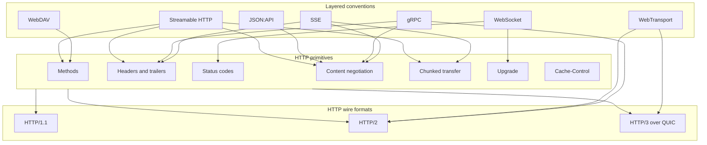

# [BEE-3008] HTTP as a Substrate for New Protocols

:::info
HTTP started as a document-fetch protocol and has become the default substrate that new application protocols layer on top of. RFC 9110 frames HTTP as a stateless, request/response family with extensible semantics and a registered field namespace, which is what makes layering tractable. This article inventories which HTTP primitives get reused by SSE, WebSocket, gRPC, WebDAV, JSON:API, WebTransport, and MCP's Streamable HTTP, walks three older conventions at the wire level, treats Streamable HTTP as a contemporary case study, and names workloads where layering on HTTP fails.
:::

## Context

RFC 9110 defines HTTP as "a family of stateless, application-level, request/response protocols that share a generic interface, extensible semantics, and self-descriptive messages." Each of those four properties — stateless, generic interface, extensible semantics, self-descriptive — is what allows another protocol to ride on top without the underlying substrate caring about the payload's meaning.

The extensibility lives in HTTP fields. RFC 9110 specifies that HTTP "uses 'fields' to provide data in the form of extensible name/value pairs with a registered key namespace. Fields are sent and received within the header and trailer sections." A new protocol can introduce custom request and response headers, and trailers if it runs on HTTP/2 or HTTP/3, without bumping a protocol version or asking intermediaries to learn anything new.

Long-lived response bodies are the third primitive that gets reused. RFC 9112 specifies that "the chunked transfer coding wraps content in order to transfer it as a series of chunks, each with its own size indicator." Chunked transfer is what makes Server-Sent Events, gRPC over HTTP/1.1 fallback paths, and MCP's Streamable HTTP able to keep a single response open and feed bytes as they arrive.

## Visual

RFC 9113 frames HTTP/2 as "an optimized transport for HTTP semantics. HTTP/2 supports all of the core features of HTTP but aims to be more efficient than HTTP/1.1." RFC 9114 carries the same separation forward: HTTP/3 is "a mapping of HTTP semantics over the QUIC transport protocol, drawing heavily on the design of HTTP/2." A protocol layered on HTTP semantics inherits whichever wire format the deployment picks.

## Example

### Server-Sent Events

The WHATWG HTML Living Standard defines SSE as "this event stream format's MIME type is `text/event-stream`." A server returns a normal HTTP response with `Content-Type: text/event-stream`, then writes UTF-8 lines as events arrive, leaning on chunked transfer to keep the body open.

Resume semantics also stay inside HTTP. The same spec specifies that "the `Last-Event-ID` HTTP request header reports an `EventSource` object's last event ID string to the server when the user agent is to reestablish the connection." A reconnecting client sends `Last-Event-ID: <id>` and the server uses it to replay missed events.

### WebSocket

RFC 6455 reuses HTTP only for the opening handshake: "The WebSocket client's handshake is an HTTP Upgrade request... The request MUST contain an `Upgrade` header field whose value MUST include the 'websocket' keyword." The server answers with `101 Switching Protocols`, after which the connection switches to WebSocket framing. HTTP supplies the entry door (methods, headers, status codes, the `Upgrade` mechanism) and steps out once the handshake completes.

### gRPC

The gRPC over HTTP/2 spec sets the wire format as `Content-Type: 'application/grpc' [('+proto' / '+json' / {custom})]`. Request metadata travels through standard HTTP/2 framing: "Request-Headers are delivered as HTTP2 headers in HEADERS + CONTINUATION frames." Responses follow `(Response-Headers *Length-Prefixed-Message Trailers) / Trailers-Only`, so the gRPC status code lives in HTTP/2 trailers. Every framing primitive gRPC needs already exists in HTTP/2.

## Best Practices

- **MUST** advertise a custom protocol's wire format via a registered media type. JSON:API illustrates the pattern: "Its media type designation is `application/vnd.api+json`." A registered `Content-Type` lets intermediaries treat the body correctly, and HTTP fields are an extensible name/value namespace per RFC 9110, so a new media type does not require a new HTTP version.
- **SHOULD** prefer a header-level extension over a new HTTP method when the operation maps to existing semantics. RFC 7240's `Prefer` header is the canonical case: "The Prefer request header field is used to indicate that particular server behaviors are preferred by the client but are not required for successful completion of the request." When the operation truly does not fit existing methods, RFC 5789 sets the precedent for a new one: "This proposal adds a new HTTP method, PATCH, to modify an existing HTTP resource."
- **MUST** set `Cache-Control` directives on streaming and long-lived responses. RFC 7234 specifies that "the 'Cache-Control' header field is used to specify directives for caches along the request/response chain." Without explicit directives, intermediaries follow default storage rules, which can store or replay a stream that was meant to be live.
- **SHOULD** treat HTTP status codes as transport-level signaling and carry application-level error semantics in the body or trailers. gRPC follows this pattern by placing its status code in HTTP/2 trailers (`(Response-Headers *Length-Prefixed-Message Trailers)`), keeping the application response distinct from HTTP-level transport outcomes.

## Convention Catalog

| Convention | HTTP primitives it leans on | Defining spec | Workload it fits |
| --- | --- | --- | --- |
| Server-Sent Events | `text/event-stream` media type, chunked transfer, `Last-Event-ID` header | WHATWG HTML Living Standard, "Server-sent events" | Server-to-client event streams over a single response |
| WebSocket | HTTP `Upgrade` request with `websocket` keyword, `101 Switching Protocols` | RFC 6455 | Bidirectional framed messaging after a one-shot HTTP handshake |
| gRPC | HTTP/2 HEADERS + CONTINUATION frames, `application/grpc` content type, HTTP/2 trailers for status | gRPC Authors, "gRPC over HTTP/2" | RPC with strong schemas riding HTTP/2 framing |
| WebDAV | New HTTP methods (PROPFIND, PROPPATCH, MKCOL, COPY, MOVE, LOCK, UNLOCK) | RFC 4918 | Distributed authoring with locking on top of HTTP resources |
| JSON:API | Single registered media type `application/vnd.api+json` over plain HTTP | jsonapi.org | API conventions where everything fits inside `Content-Type` |
| Streamable HTTP (MCP) | Single endpoint with POST and GET, content-negotiated `application/json` or `text/event-stream`, `Mcp-Session-Id` header, `Last-Event-ID` resume | Model Context Protocol, Transports (2025-03-26) | Agent-to-server messaging that may answer one-shot or stream |
| WebTransport | Session over an HTTP/3 or HTTP/2 connection, multiple streams, unidirectional streams, datagrams | W3C, "WebTransport" | Multi-stream and unreliable transport on top of HTTP transports |

## Case Study: Streamable HTTP

The Model Context Protocol's Streamable HTTP transport is a worked example of layering through composition rather than invention. Every primitive it uses was already defined elsewhere in HTTP; its contribution was choosing the combination.

A single endpoint is the first decision. The spec states: "The server **MUST** provide a single HTTP endpoint path (hereafter referred to as the **MCP endpoint**) that supports both POST and GET methods." Both verbs land on the same URL, so the entire protocol surface lives behind one path.

Body shape is selected by content negotiation. The spec specifies: "If the input contains any number of JSON-RPC *requests*, the server **MUST** either return `Content-Type: text/event-stream`, to initiate an SSE stream, or `Content-Type: application/json`, to return one JSON object." Standard `Accept` and `Content-Type` machinery is doing protocol selection: a request can be answered with one JSON object or a long-running SSE stream, depending on what fits.

Session affinity rides a single custom header. The spec specifies: "A server using the Streamable HTTP transport **MAY** assign a session ID at initialization time, by including it in an `Mcp-Session-Id` header on the HTTP response containing the `InitializeResult`." Sessions become a header convention on top of HTTP rather than a new connection-level concept.

Resume reuses the SSE mechanism wholesale. The spec specifies: "If the client wishes to resume after a broken connection, it **SHOULD** issue an HTTP GET to the MCP endpoint, and include the `Last-Event-ID` header to indicate the last event ID it received." The same `Last-Event-ID` header WHATWG defined for SSE handles MCP resume.

Single endpoint, content-negotiated body, custom session header, SSE resume: four primitives that already existed, composed into a transport.

## When NOT to Layer on HTTP

Three workloads land outside the envelope where HTTP earns its place.

**Constrained devices and lossy networks.** RFC 7252 introduces CoAP for environments where HTTP is too heavy: "The nodes often have 8-bit microcontrollers with small amounts of ROM and RAM, while constrained networks such as IPv6 over Low-Power Wireless Personal Area Networks (6LoWPANs) often have high packet error rates and a typical throughput of 10s of kbit/s... The goal of CoAP is not to blindly compress HTTP, but rather to realize a subset of REST common with HTTP but optimized for M2M applications." CoAP keeps a REST shape and drops HTTP itself.

**M2M and IoT where per-request overhead is prohibitive.** OASIS describes MQTT as "light weight, open, simple, and designed to be easy to implement... ideal for use in many situations, including constrained environments such as for communication in Machine to Machine (M2M) and Internet of Things (IoT) contexts where a small code footprint is required and/or network bandwidth is at a premium." A pub/sub broker over a long-lived TCP connection avoids HTTP's per-request framing cost entirely.

**Sub-millisecond bidirectional traffic.** When the workload needs raw stream semantics under HTTP's latency floor, applications drop down to QUIC. RFC 9000 specifies: "Endpoints communicate in QUIC by exchanging QUIC packets... QUIC packets are carried in UDP datagrams to better facilitate deployment in existing systems and networks. Streams in QUIC provide a lightweight, ordered byte-stream abstraction to an application." Going under HTTP rather than over it gives access to streams and datagrams without the request/response shape.

A class of older protocols sits even further down. SSH and IRC, for instance, run over raw sockets and were never layered on HTTP at all. They are routine reminders that "everything is HTTP now" is an overgeneralization.

## Related Topics

- [HTTP/1.1, HTTP/2, HTTP/3](/en/networking-fundamentals/http-versions) — the wire formats this article's substrate sits on
- [Proxies and Reverse Proxies](/en/networking-fundamentals/proxies-and-reverse-proxies) — the intermediaries that custom HTTP conventions have to survive
- [Long-Polling, SSE, and WebSocket Architecture](/en/distributed-systems/long-polling-sse-and-websocket-architecture) — deeper treatment of three conventions named in the Example
- [gRPC Streaming Patterns](/en/distributed-systems/grpc-streaming-patterns) — practitioner-facing guidance for the gRPC convention shown here
- [Model Context Protocol (MCP)](/en/ai-backend-patterns/model-context-protocol-mcp) — the protocol whose Streamable HTTP transport is this article's case study

## References

- IETF, "HTTP Semantics," RFC 9110 (2022). https://www.rfc-editor.org/rfc/rfc9110.html
- IETF, "HTTP/1.1," RFC 9112 (2022). https://www.rfc-editor.org/rfc/rfc9112.html
- IETF, "HTTP/2," RFC 9113 (2022). https://www.rfc-editor.org/rfc/rfc9113.html
- IETF, "HTTP/3," RFC 9114 (2022). https://www.rfc-editor.org/rfc/rfc9114.html
- IETF, "QUIC: A UDP-Based Multiplexed and Secure Transport," RFC 9000 (2021). https://www.rfc-editor.org/rfc/rfc9000.html
- IETF, "The WebSocket Protocol," RFC 6455 (2011). https://www.rfc-editor.org/rfc/rfc6455.html
- IETF, "HTTP Extensions for Web Distributed Authoring and Versioning (WebDAV)," RFC 4918 (2007). https://www.rfc-editor.org/rfc/rfc4918.html
- IETF, "HTTP/1.1: Caching," RFC 7234 (2014). https://www.rfc-editor.org/rfc/rfc7234.html
- IETF, "Prefer Header for HTTP," RFC 7240 (2014). https://www.rfc-editor.org/rfc/rfc7240.html
- IETF, "PATCH Method for HTTP," RFC 5789 (2010). https://www.rfc-editor.org/rfc/rfc5789.html
- IETF, "The Constrained Application Protocol (CoAP)," RFC 7252 (2014). https://www.rfc-editor.org/rfc/rfc7252.html
- WHATWG, "Server-sent events," HTML Living Standard. https://html.spec.whatwg.org/multipage/server-sent-events.html
- gRPC Authors, "gRPC over HTTP/2." https://github.com/grpc/grpc/blob/master/doc/PROTOCOL-HTTP2.md
- W3C, "WebTransport" (Editor's Draft / Working Draft). https://www.w3.org/TR/webtransport/
- Anthropic et al., "Model Context Protocol — Transports (2025-03-26)." https://modelcontextprotocol.io/specification/2025-03-26/basic/transports
- OASIS, "MQTT Version 5.0 OASIS Standard" (2019). https://docs.oasis-open.org/mqtt/mqtt/v5.0/os/mqtt-v5.0-os.html
- JSON:API Working Group, "JSON:API." https://jsonapi.org/
