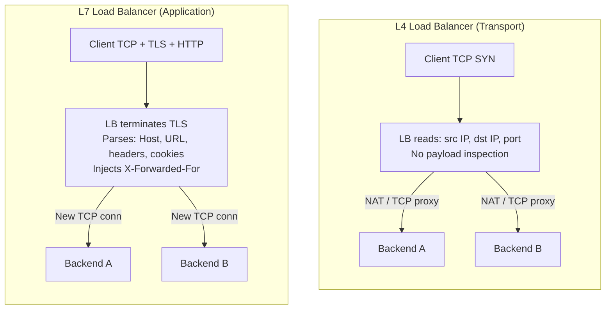

# [BEE-3005] Load Balancers

:::info
L4 vs L7 load balancing, algorithms, health checks, connection draining, and high availability.
:::

## Context

Every production service that handles more traffic than a single server can absorb needs a load balancer in front of it. But "load balancer" covers a wide design space: a packet-forwarding switch at Layer 4, a full HTTP proxy at Layer 7, a cloud-managed ALB, or a DNS-based round-robin scheme. Choosing the wrong tier — or misconfiguring the right one — leads to uneven traffic distribution, downed backends receiving requests, session data lost on every deploy, and a single load balancer that is itself the failure point it was supposed to prevent.

**References:**
- NGINX HTTP Load Balancing documentation: <https://docs.nginx.com/nginx/admin-guide/load-balancer/http-load-balancer/>
- NGINX HTTP Health Checks documentation: <https://docs.nginx.com/nginx/admin-guide/load-balancer/http-health-check/>
- HAProxy: Graceful web-server shutdowns: <https://engineering.classdojo.com/2021/07/13/haproxy-graceful-server-shutdowns/>
- Load Balancing Deep Dive — Calmops: <https://calmops.com/network/load-balancing-deep-dive/>

## Principle

**Deploy load balancers at the correct OSI layer for the job, configure health checks and connection draining before shipping, and eliminate single points of failure in the load-balancing tier itself.**

A load balancer is not just a traffic splitter. It is the first line of fault isolation, the owner of client-IP metadata, the place where TLS terminates, and often the enforcer of timeouts and retry budgets. Getting it right from the start is far cheaper than retrofitting HA or debugging why clients always land on the same backend.


## L4 vs L7 Load Balancing

The most fundamental choice is which OSI layer the load balancer operates at.

### Layer 4 — Transport Load Balancing

An L4 load balancer forwards TCP or UDP connections based on the 5-tuple: source IP, source port, destination IP, destination port, and protocol. It does **not** read the payload. Each TCP connection is proxied or NAT-translated to a backend without inspecting HTTP methods, URLs, or headers.

**Characteristics:**
- Latency: 50–100 µs per hop (packet-level forwarding)
- Throughput: 10–40 Gbps per node at line rate
- No TLS inspection unless combined with a separate TLS offload stage
- Routing decisions: IP address, port, protocol only
- Backends receive the original TCP stream; connection tracking is stateful at the network level

**When to use L4:**
- Raw throughput is the priority (databases, message queues, game servers)
- The protocol is not HTTP (SMTP, raw TCP, UDP-based protocols)
- You want minimal latency overhead and do not need content-aware routing

### Layer 7 — Application Load Balancing

An L7 load balancer terminates the TCP connection from the client, reads the application-layer request (HTTP, gRPC, WebSocket), and opens a new connection to a backend. Because it sees the full request, it can route on any request attribute.

**Characteristics:**
- Latency: 0.5–3 ms per hop (full request parsing required)
- Throughput: 1–5 Gbps per node
- Can terminate TLS, inspect HTTP headers, rewrite paths, inject headers (e.g., `X-Forwarded-For`)
- Routing decisions: URL path, Host header, HTTP method, cookie, gRPC service name, query parameters
- Enables per-request health checks, retries, and circuit breaking

**When to use L7:**
- HTTP/HTTPS traffic that benefits from path-based or header-based routing
- A/B testing, canary deployments, traffic splitting by percentage
- TLS termination before backends (see [BEE-3](../bee-overall/glossary.md)3)
- WebSocket upgrade and HTTP/2 multiplexing (see [BEE-3](../bee-overall/glossary.md)2)

### Mermaid Diagram: L4 vs L7 Inspection Points



### Comparison Table

| Dimension | L4 | L7 |
|---|---|---|
| OSI layer | Transport (TCP/UDP) | Application (HTTP, gRPC) |
| Latency overhead | ~50–100 µs | ~0.5–3 ms |
| Max throughput | Very high | Moderate |
| TLS termination | No (or separate stage) | Yes |
| Content-aware routing | No | Yes |
| Header injection | No | Yes (`X-Forwarded-For`, etc.) |
| Connection model | Pass-through or NAT | Terminate and re-originate |
| Health check granularity | TCP connect | HTTP status codes |


## Load Balancing Algorithms

### Round Robin

Each new request (L7) or connection (L4) is forwarded to the next backend in a fixed rotation.

```
Request 1 → Backend A
Request 2 → Backend B
Request 3 → Backend C
Request 4 → Backend A   (cycle repeats)
```

- Simple, zero state
- Works well when all backends have equal capacity and request cost is uniform
- Breaks down with heterogeneous servers or highly variable request durations

### Weighted Round Robin

Each backend is assigned a weight proportional to its capacity. A backend with `weight=3` receives three requests for every one request sent to a `weight=1` backend.

```nginx
upstream api_backends {
    server 10.0.0.1 weight=3;   # handles 3x the traffic
    server 10.0.0.2 weight=1;
}
```

Use when backends have different hardware specs or when gradually shifting traffic during a canary deploy.

### Least Connections

The next request is forwarded to the backend with the fewest active connections at that moment.

```
Active connections: A=10, B=2, C=7
Next request → Backend B
```

- Better than round robin for workloads with variable request duration (e.g., long-running streaming, database queries, WebSocket connections)
- Requires the load balancer to track connection counts per backend; adds a small amount of state

### IP Hash

The client's source IP address is hashed and consistently maps to the same backend as long as that backend is available.

```
hash(client_ip) % num_backends = backend_index
```

- Provides a simple form of session affinity: the same client always lands on the same backend
- Breaks down if the backend set changes (a new server changes `% num_backends` for many clients)
- Superseded by consistent hashing for most use cases where affinity is genuinely needed

### Consistent Hashing

A hash function maps both backends and request keys (client IP, session ID, user ID) onto a conceptual ring. Each request is routed to the nearest backend clockwise on the ring.

**Key property:** Adding or removing one backend only disrupts `1/N` of keys rather than remapping all keys. This makes it the standard algorithm for cache clusters and stateful services.

```
Ring positions (simplified):
  Backend A: 0–120
  Backend B: 121–240
  Backend C: 241–360

hash(client_ip) = 180 → Backend B
hash(client_ip) = 350 → Backend C
```

When Backend B is removed, keys 121–240 remap to Backend C. Keys served by A and C are unaffected.

### Algorithm Selection Guide

| Workload | Recommended Algorithm |
|---|---|
| Homogeneous servers, short requests | Round Robin |
| Mixed server capacity | Weighted Round Robin |
| Long-lived connections (WebSocket, streaming) | Least Connections |
| Cache clusters, stateful routing | Consistent Hashing |
| Need simple affinity, stable pool | IP Hash |


## Health Checks

### Why Health Checks Are Non-Negotiable

Without health checks, a load balancer has no way to know a backend has crashed or become unresponsive. Traffic continues to flow to a dead backend, and clients see errors. Health checks are the mechanism by which the load balancer removes unhealthy backends from rotation automatically.

### Passive Health Checks

Passive checks infer health from real traffic. If the load balancer receives a connection error, a timeout, or a 5xx response, it counts the failure. After `max_fails` consecutive failures within `fail_timeout` seconds, the backend is marked unhealthy.

```nginx
# NGINX passive health check configuration
upstream api_backends {
    server 10.0.0.1 max_fails=3 fail_timeout=30s;
    server 10.0.0.2 max_fails=3 fail_timeout=30s;
    server 10.0.0.3 max_fails=3 fail_timeout=30s;
}
```

- No additional traffic generated
- Detection lag: the first `max_fails` real requests to a dead backend will fail before it is removed
- Available in NGINX open-source

### Active Health Checks

Active checks send synthetic probe requests to each backend on a schedule, independent of real traffic.

```nginx
# NGINX Plus active health check
upstream api_backends {
    server 10.0.0.1;
    server 10.0.0.2;
    server 10.0.0.3;
}

server {
    location / {
        proxy_pass http://api_backends;
        health_check interval=10s fails=3 passes=2 uri=/healthz;
    }
}
```

Interpretation of this config:
- Probe `/healthz` on every backend every 10 seconds
- Mark unhealthy after 3 consecutive failures
- Require 2 consecutive passing checks before marking healthy again (avoids flapping)

**Active vs Passive Comparison:**

| Property | Passive | Active |
|---|---|---|
| Additional traffic | None | Yes (probe requests) |
| Detection speed | Slow (requires real failures) | Fast (probes run continuously) |
| Accuracy | Lower (lag before detection) | Higher |
| Availability | All load balancers | Often requires paid tier |

**Recommendation:** Use active health checks in production. The probe traffic overhead is negligible compared to the cost of routing real requests to a dead backend.

### Health Check Endpoint Design

The `/healthz` or `/health` endpoint on each backend should:
- Return `200 OK` only when the process is fully ready to serve requests
- Check dependencies (database connections, critical caches) if the service is meaningless without them
- Respond quickly (under 100 ms); slow health checks can themselves trigger false-positive unhealthy marks
- Distinguish liveness (process is alive) from readiness (process is ready to serve) — Kubernetes distinguishes these; load balancers typically use readiness


## Connection Draining

Connection draining (also called graceful shutdown) is the process of removing a backend from rotation without dropping in-flight requests.

### The Problem Without Draining

```
1. Deploy: Backend A needs to restart for a new release
2. LB removes Backend A from the pool instantly
3. 40 in-flight HTTP requests to Backend A receive TCP RST
4. Clients see 502 or connection errors
```

### The Correct Sequence

```
1. Signal: Backend A is marked "draining" (soft-remove from pool)
2. LB stops sending new requests to Backend A
3. In-flight requests on existing connections to Backend A continue normally
4. Backend A signals its application to stop accepting new connections
5. Wait: All in-flight requests complete (or a drain timeout expires)
6. Backend A is fully removed and shut down
```

In HAProxy, setting a backend's weight to `0` achieves step 1: the server participates in no new load-balancing decisions but existing persistent connections (keep-alive) are maintained until they close naturally.

```
# HAProxy: drain a backend via the stats socket
echo "set weight be_api/10.0.0.1 0%" | socat stdio /var/run/haproxy/admin.sock
```

In Kubernetes, the `preStop` lifecycle hook combined with a `terminationGracePeriodSeconds` achieves the same result: the pod stops receiving new traffic from the Service endpoint, waits for the hook duration, then exits.

### Drain Timeout

Always set a finite drain timeout. If in-flight requests do not complete within (e.g.) 30 seconds, forcibly terminate the connection. Long-running WebSocket or streaming connections may need a longer or separate drain budget.


## Session Affinity (Sticky Sessions)

### What It Is

Session affinity routes all requests from a given client to the same backend. Typically implemented by:
- **Cookie insertion**: The LB sets a cookie (e.g., `SERVERID=backend_A`); subsequent requests carry the cookie and are routed to `backend_A`
- **IP hash**: As described in the algorithms section

### Why to Avoid It When Possible

Sticky sessions are a symptom of server-side state that is not properly externalized. They introduce several problems:

1. **Uneven load distribution**: If one client generates 90% of the traffic, sticky sessions pin it to one backend regardless of other backends being idle
2. **State loss on failure**: If the pinned backend dies, all sessions on that backend are lost anyway — affinity did not protect against failure
3. **Deploy complexity**: Rolling deployments become harder because you need to drain sticky sessions before removing a backend, or accept session loss
4. **Defeats horizontal scaling**: The whole point of multiple backends is that any backend can handle any request

**Preferred alternative:** Store session state in a shared external store (Redis, a database) so that any backend can serve any request. This makes the application truly stateless behind the load balancer.

**When sticky sessions are acceptable:**
- Legacy applications where refactoring session storage is not feasible
- WebSocket connections where the protocol requires a persistent connection to the same backend (coordinate with connection draining for deploys)
- Very short-lived sessions where the cost of a session miss is low


## Client IP Preservation: X-Forwarded-For

When an L7 load balancer terminates the client connection and opens a new connection to the backend, the backend sees the load balancer's IP, not the real client IP. The standard mechanism to forward the original client IP is the `X-Forwarded-For` header (XFF).

```
Client (1.2.3.4) → LB (10.0.0.100) → Backend

HTTP request to backend:
  X-Forwarded-For: 1.2.3.4
  X-Real-IP: 1.2.3.4
```

In NGINX:
```nginx
proxy_set_header X-Forwarded-For $proxy_add_x_forwarded_for;
proxy_set_header X-Real-IP       $remote_addr;
```

### XFF Security Considerations

`X-Forwarded-For` can be spoofed by a client if the load balancer appends blindly without stripping untrusted values. A client that sends `X-Forwarded-For: 127.0.0.1` should not bypass IP-based access controls.

- Configure the load balancer to **replace** (not append) the XFF header, or to strip client-supplied values before appending the real source IP
- Trust XFF only from known trusted proxies (your own load balancers), not from arbitrary upstream hops
- In AWS, use `X-Forwarded-For` from the ALB; in Cloudflare, use `CF-Connecting-IP`


## High Availability: Eliminating the LB as a Single Point of Failure

A single load balancer is itself a single point of failure. If it goes down, all traffic stops regardless of how healthy the backends are.

### Active-Passive Pair

Two load balancers share a Virtual IP (VIP). The primary handles all traffic; the secondary monitors the primary. If the primary fails, the secondary promotes itself and announces the VIP via GARP (Gratuitous ARP) or BGP.

```
VIP: 203.0.113.10
  ├── LB-Primary (active, holds VIP)
  └── LB-Secondary (standby, monitors primary via heartbeat)

On primary failure:
  LB-Secondary claims VIP → traffic flows to secondary
```

Failover time: typically 1–5 seconds for GARP-based VIP failover. During this window, new TCP connections fail; existing TCP connections may or may not survive depending on whether connection state is shared (e.g., via `conntrack` sync in Linux).

Tooling: Keepalived (VRRP), Pacemaker/Corosync, cloud-provider HA options (AWS NLB is inherently HA; GCP forwarding rules route to managed instance groups).

### Active-Active Pair

Both load balancers simultaneously handle traffic, typically via:
- **DNS round-robin**: Two A records for the same hostname pointing to LB-1 and LB-2
- **Anycast**: Both nodes announce the same BGP prefix; clients route to the nearest node
- **ECMP (Equal-Cost Multipath)**: A router hash-distributes flows across both LBs

Active-active doubles throughput and provides redundancy, but requires that both LBs have a consistent view of backend state (health check results, connection counts for least-connections algorithms).

### Cloud-Managed Load Balancers

Cloud providers (AWS ALB/NLB, GCP Load Balancing, Azure Load Balancer) handle HA internally. The underlying fleet is multi-node and geographically distributed. The tradeoff is reduced control over low-level behavior in exchange for operational simplicity.


## Direct Server Return (DSR)

In standard L4 load balancing, both inbound and outbound traffic passes through the load balancer:

```
Client → LB → Backend → LB → Client   (symmetric path)
```

In Direct Server Return (DSR), the backend responds **directly** to the client, bypassing the load balancer on the return path:

```
Client → LB → Backend → Client   (asymmetric path; return bypasses LB)
```

DSR is implemented by the LB rewriting the destination MAC address (not the IP) so the backend receives the packet addressed to the VIP but responds with its own NIC directly to the client gateway.

**Benefits:** The return path — typically much larger than the request (e.g., a large file download) — does not pass through the LB, eliminating a bottleneck and reducing LB CPU load dramatically.

**Limitations:**
- Requires L2 adjacency (LB and backends on the same network segment) or tunneling (IP-in-IP, GRE)
- Complex to operate; L7 features (header injection, TLS termination) are not possible in DSR mode
- Used primarily in high-throughput, low-latency scenarios (CDN origin serving, gaming, financial trading)


## Common Mistakes

### 1. No Health Checks — Sending Traffic to Dead Backends

The most common and most damaging mistake. Without health checks, a backend crash is invisible to the load balancer. All subsequent requests to that backend fail until someone manually removes it from the pool.

**Fix:** Configure active health checks before going to production. Treat "health checks not configured" as a blocking issue in any production readiness review.

### 2. Sticky Sessions Defeating the Purpose of Load Balancing

Sticky sessions sound like a solution to statefulness but they merely defer the problem. When the pinned backend is removed (deploy, failure, scale-in), all sessions on it are lost anyway, and traffic distribution becomes uneven as sessions accumulate on one node.

**Fix:** Externalize session state. Use Redis or a database for sessions. Design for any backend being able to handle any request.

### 3. Missing X-Forwarded-For — Client IP Lost

Backends log `10.0.0.100` (the LB address) for every request. Rate limiting, geo-restriction, and audit logs all become useless.

**Fix:** Configure `proxy_set_header X-Forwarded-For $proxy_add_x_forwarded_for;` in NGINX (or equivalent). Verify that backends read from `X-Forwarded-For`, not `REMOTE_ADDR`, for client IP.

### 4. Single Load Balancer as SPOF

Adding load balancing to eliminate backend SPOFs while leaving a single load balancer as the new SPOF is a common architecture error.

**Fix:** Deploy an HA pair (active-passive with Keepalived/VRRP, or active-active with DNS/anycast). On cloud, use a managed LB product that provides HA by default.

### 5. Using L7 When L4 Suffices

L7 load balancing introduces full request parsing on every hop. For a non-HTTP protocol or a scenario where all routing is purely connection-based, this overhead is unnecessary.

**Fix:** Use L4 for TCP services that do not need content-aware routing (database proxies, message queues, raw TCP services). Reserve L7 for HTTP/gRPC workloads that benefit from header-based routing, TLS termination, or per-request retries.


## Related BEPs

- [BEE-3001](tcp-ip-and-the-network-stack.md) — TCP/IP and the Network Stack: L4 load balancers operate at the TCP layer; understanding TCP connection state (SYN, ESTABLISHED, TIME_WAIT) is necessary to reason about connection draining and health check behavior
- [BEE-3002](dns-resolution.md) — DNS Resolution: DNS-based load balancing (multiple A records, GeoDNS) is a complementary technique; see also why DNS TTLs affect how quickly clients detect a failed backend
- [BEE-3003](http-versions.md) — HTTP/2 and HTTP/3: HTTP/2 multiplexes multiple streams over one TCP connection; an L7 LB must understand multiplexing to distribute work across backends rather than pinning all streams of one connection to one backend
- [BEE-3004](tls-ssl-handshake.md) — TLS/SSL Handshake: L7 load balancers are the standard TLS termination point; see TLS termination topology (edge termination, re-encryption, pass-through) and how SNI enables routing before the TLS handshake completes
- [BEE-3006](proxies-and-reverse-proxies.md) — Reverse Proxies: A reverse proxy and an L7 load balancer share significant overlap; [BEE-3006](proxies-and-reverse-proxies.md) covers the proxy semantics, request buffering, and upstream connection pooling that underpin L7 load balancing behavior
