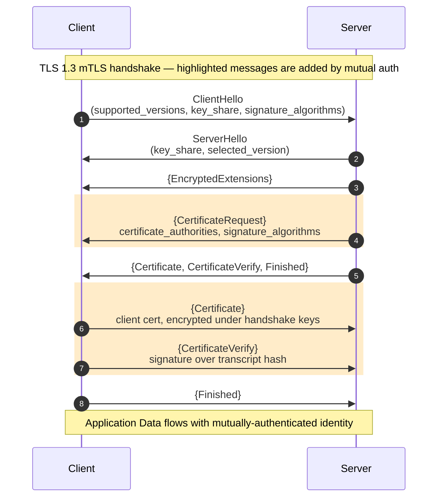

# [BEE-3007] Mutual TLS (mTLS) Handshake and Server Configuration

:::info
Mutual TLS extends the base TLS handshake with a server-sent `CertificateRequest` and a client-sent `Certificate` + `CertificateVerify`. Both peers prove possession of a private key bound to a certificate the counterpart trusts, so the connection itself carries authenticated identity.
:::

## Context

Standard TLS authenticates the server only. When a browser connects to `api.example.com`, it verifies the server's certificate against a trusted CA and confirms that the server holds the matching private key. The client is anonymous at this layer: the TLS session itself carries no verified identity for the caller. Every downstream authentication mechanism (session cookies, OAuth bearer tokens, API keys) runs on top of that anonymous transport. For a human user this is acceptable: the login flow establishes identity at the application layer, and the browser binds it to the session. For internal service-to-service traffic, where there is no interactive login and no human identity to authenticate, accepting anonymous callers at the transport layer is the implicit trust that zero-trust networking rejects.

mTLS sits one layer below application-level authentication and one layer above TCP. The connection itself carries verified peer identity: the server reads the client's certificate out of the TLS session state on every request, without a separate authentication round-trip. This collapses two concerns that would otherwise need independent plumbing: transport-level confidentiality and identity-level authentication are settled together by one handshake. An application that terminates mTLS does not issue its own challenge-response; it inspects the peer certificate that was already verified during the TLS handshake.

TLS 1.2 defined optional client authentication in RFC 5246 §7.4.4 (published August 2008), and it remains a common deployment in long-lived internal meshes. In that version, the client's `Certificate` message was sent in cleartext. A passive observer on the network could see which client cert was presented, a privacy leak for internal workload identities. TLS 1.3 (RFC 8446, published August 2018) restructured the handshake: everything after `EncryptedExtensions` is encrypted under handshake-traffic keys, so the client `Certificate` is no longer visible on the wire. TLS 1.3 also introduced the `post_handshake_auth` extension, allowing a server to request client authentication mid-connection. This fits a caller attempting to reach a more sensitive resource partway through an existing session.

For the architectural motivation behind turning mTLS on, see BEE-2007 (Zero-Trust Security Architecture); for the strategy comparison against JWT service tokens and cloud-IAM workload identity, see BEE-19048 (Service-to-Service Authentication). This article is about the handshake mechanics and practical server setup.

## Principle

Relative to one-way TLS, mTLS adds three handshake messages:

- **`CertificateRequest`** (RFC 8446 §4.3.2) — sent by the server, signals that it expects the client to authenticate and constrains which CAs and signature algorithms the client may use.
- **Client `Certificate`** (RFC 8446 §4.4.2) — sent by the client in response, carrying its certificate chain.
- **Client `CertificateVerify`** (RFC 8446 §4.4.3) — a signature over the handshake transcript with the client's private key.

`CertificateVerify` is the structurally necessary part. Certificates are public: a network attacker who has observed any prior mTLS handshake has a copy of the legitimate client's certificate. Without `CertificateVerify`, presenting that captured certificate alone would succeed. The signature over the transcript hash proves the presenter holds the private key matching the public key in the certificate, which is the actual authentication.

Identity binding is at the Subject Alternative Name (SAN) level, never the Common Name. URI SANs carry SPIFFE-style workload identities (`spiffe://trust-domain/service-name`); DNS SANs carry hostname-style identities. RFC 2818 deprecated CN-based hostname matching in 2000, and mainstream TLS implementations reject CN-only certificates outright. This article focuses on how identity is verified at the TLS layer; the issuance, rotation, and revocation of the underlying certificates belongs to BEE-2011 (TLS Certificate Lifecycle and PKI).

## Visual



Messages wrapped in `{...}` are sent under handshake encryption (TLS 1.3 property). The three highlighted messages are what mTLS adds relative to one-way TLS.

## Protocol Walkthrough — TLS 1.3

### CertificateRequest (RFC 8446 §4.3.2)

TLS 1.3 repositions `CertificateRequest` into the server's encrypted extensions flight. The server sends it after `EncryptedExtensions`, before its own `Certificate`, `CertificateVerify`, and `Finished`. Two extensions inside `CertificateRequest` constrain what the client may send back:

- `certificate_authorities` carries the Distinguished Names of CAs the server will accept. A client that owns certificates from multiple CAs uses this list to select which one to present. An empty or absent `certificate_authorities` extension means "any CA the client trusts is acceptable"; the server defers trust-anchor enforcement to its own verification step.
- `signature_algorithms` constrains which signature algorithms the client's later `CertificateVerify` may use. The client must pick a signature scheme from this list that is also backed by its private-key type.

### Client Certificate (RFC 8446 §4.4.2)

The client sends its `Certificate` message after the server's `Finished` has been received and verified. In TLS 1.3 this message travels under handshake encryption, so a passive observer on the wire cannot see which client certificate was presented. This is a privacy improvement over TLS 1.2, where the client cert was in cleartext.

A client with no certificate matching the server's `certificate_authorities` list is permitted to send a `Certificate` message with an empty `certificate_list`. The server then decides: fail the handshake with a `certificate_required` alert (if client auth is mandatory) or continue with no verified peer identity (if client auth was optional).

### Client CertificateVerify (RFC 8446 §4.4.3)

`CertificateVerify` is a signature over the handshake transcript, computed with the client's private key using one of the signature schemes advertised in the server's `signature_algorithms` extension. This is the proof-of-possession step. An attacker who has captured the legitimate client's certificate from a prior connection can replay that certificate. They cannot replay the signature, because the transcript hash differs on every connection and the matching private key is held only by the real owner.

If the client sent an empty `Certificate` in the previous step, `CertificateVerify` is omitted.

### Server-side verification

On receiving the client's `Certificate` and `CertificateVerify`, the server runs these checks before admitting the request:

1. **Chain construction** — build a chain from the presented leaf certificate to a trust anchor in the server's client-CA trust store.
2. **Validity window** — reject certificates where `notAfter` is in the past or `notBefore` is in the future.
3. **SAN match** — compare the URI SAN (for SPIFFE-style identity) or DNS SAN (for hostname-style identity) against the server's authorization policy.
4. **CertificateVerify signature** — verify the signature against the transcript hash using the public key from the presented certificate.
5. **Optional revocation** — check CRL, OCSP, or OCSP stapling if the deployment uses revocation. Short-lived certificates (hours, not months) sidestep revocation by expiring before a compromise becomes useful.

### Post-handshake client authentication (RFC 8446 §4.6.2)

TLS 1.3 introduces `post_handshake_auth`, an extension the client includes in its `ClientHello` to signal that it accepts post-handshake authentication. A server that received this extension may later send a `CertificateRequest` at any point on the established connection, and the client responds with `Certificate` + `CertificateVerify` bound to the new transcript. This fits deployments where the initial TLS handshake authenticates under a weaker identity and a stronger identity is required only when the caller reaches a sensitive resource. See RFC 8446 §4.6.2 for the full message flow.

## TLS 1.2 Delta

Most new internal environments should default to TLS 1.3; TLS 1.2 remains relevant for long-lived meshes and legacy clients that cannot move off it. The differences that matter for mTLS:

- **Client `Certificate` is in cleartext.** In TLS 1.2, `ChangeCipherSpec` is not sent until after the client's `Certificate`, so the certificate travels unencrypted on the wire. A passive observer learns which client identity connected to which server. TLS 1.3 fixed this privacy leak by moving the message under handshake encryption.
- **`CertificateRequest` flight position.** Sent by the server between `ServerKeyExchange` and `ServerHelloDone`, in the same flight that ends with `ServerHelloDone`. It travels in cleartext, since the record-layer encryption does not activate until after `ChangeCipherSpec`.
- **No post-handshake client auth.** TLS 1.2 has no equivalent of `post_handshake_auth`. Client authentication is negotiated during the initial handshake, or arranged via renegotiation. Renegotiation is widely disabled because of the TLS renegotiation attacks.
- **Different signature-algorithm enumeration.** RFC 5246 §7.4.1.4.1 defines the `SignatureAndHashAlgorithm` values used by TLS 1.2's `CertificateVerify`; TLS 1.3 replaced this with the `SignatureScheme` enumeration from RFC 8446 §4.2.3.

The operational setup of mTLS (nginx configuration, Go server configuration, `openssl s_client` flags) is the same for both versions unless otherwise noted.

## In Practice — Setting Up mTLS on a Server

Two real-world topologies dominate: (A) terminate mTLS at a reverse proxy and pass verified identity to the upstream over a private hop, or (B) terminate mTLS directly in the application. Both start from the same certificate material.

### 1. Generate the CA, server cert, and client cert

```bash
# Root CA (self-signed, kept offline in production)
openssl req -x509 -newkey ec -pkeyopt ec_paramgen_curve:P-256 \
  -keyout ca.key -out ca.crt -days 3650 -nodes \
  -subj "/CN=internal-root-ca"

# Server certificate (SAN = DNS name the client will connect to)
openssl req -new -newkey ec -pkeyopt ec_paramgen_curve:P-256 \
  -keyout server.key -out server.csr -nodes \
  -subj "/CN=api.internal"
openssl x509 -req -in server.csr -out server.crt -days 90 \
  -CA ca.crt -CAkey ca.key -CAcreateserial \
  -extfile <(printf "subjectAltName=DNS:api.internal")

# Client certificate (SAN = URI, SPIFFE-style identity)
openssl req -new -newkey ec -pkeyopt ec_paramgen_curve:P-256 \
  -keyout client.key -out client.csr -nodes \
  -subj "/CN=orders-service"
openssl x509 -req -in client.csr -out client.crt -days 90 \
  -CA ca.crt -CAkey ca.key -CAcreateserial \
  -extfile <(printf "subjectAltName=URI:spiffe://internal.example.com/orders-service")
```

This produces a three-entity setup: a root CA that signs both the server and the client cert, a server cert whose DNS SAN the client uses to validate the hostname, and a client cert whose URI SAN carries a SPIFFE-style workload identity. In production the root CA key stays offline (or in an HSM) and a short-lived intermediate does the actual issuance; see BEE-2011 for the full PKI pattern.

### 2. Topology A — mTLS at Nginx, cleartext upstream

```nginx
server {
    listen 443 ssl;
    server_name api.internal;
    ssl_certificate     /etc/nginx/server.crt;
    ssl_certificate_key /etc/nginx/server.key;

    ssl_client_certificate /etc/nginx/ca.crt;
    ssl_verify_client on;
    ssl_verify_depth 2;

    location / {
        # Fail closed: only forward when the TLS module verified the client cert
        if ($ssl_client_verify != SUCCESS) { return 403; }

        proxy_pass http://backend:8080;
        proxy_set_header X-SSL-Client-Verify $ssl_client_verify;
        proxy_set_header X-SSL-Client-S-DN   $ssl_client_s_dn;
        proxy_set_header X-SSL-Client-Cert   $ssl_client_escaped_cert;
    }
}
```

**Critical call-out — trusted-header spoofing risk.** Identity forwarded via `X-SSL-Client-*` headers is only safe if the upstream hop runs on a network the attacker cannot reach directly. If `backend:8080` is reachable from the public network, an attacker sends a plain HTTP request with a forged `X-SSL-Client-S-DN` header and bypasses Nginx entirely. Bind the upstream to `localhost` or a private subnet, enforce this at the firewall or security-group layer, and reject any inbound request on the upstream that did not originate from the proxy (for example via mTLS between proxy and upstream, or an IP allowlist).

`$ssl_client_escaped_cert` carries the URL-encoded PEM of the client certificate; the upstream is responsible for parsing the SAN out of it. Passing the DN is a common shortcut and is insufficient for SPIFFE-style identity; parse the full certificate when you need the URI SAN.

### 3. Topology B — mTLS all the way to the Go app

```go
package main

import (
    "crypto/tls"
    "crypto/x509"
    "net/http"
    "os"
    "strings"
)

func mustLoadCAPool(caPath string) *x509.CertPool {
    pem, err := os.ReadFile(caPath)
    if err != nil {
        panic(err)
    }
    pool := x509.NewCertPool()
    if ok := pool.AppendCertsFromPEM(pem); !ok {
        panic("failed to parse CA certificate")
    }
    return pool
}

func main() {
    tlsConfig := &tls.Config{
        ClientAuth: tls.RequireAndVerifyClientCert, // not RequireAnyClientCert — see Common Mistakes
        ClientCAs:  mustLoadCAPool("/etc/tls/ca.crt"),
        MinVersion: tls.VersionTLS13,
    }

    server := &http.Server{
        Addr:      ":8443",
        TLSConfig: tlsConfig,
        Handler:   http.HandlerFunc(handle),
    }
    _ = server.ListenAndServeTLS("/etc/tls/server.crt", "/etc/tls/server.key")
}

func handle(w http.ResponseWriter, r *http.Request) {
    if r.TLS == nil || len(r.TLS.PeerCertificates) == 0 {
        http.Error(w, "client certificate required", http.StatusUnauthorized)
        return
    }
    peer := r.TLS.PeerCertificates[0]

    // Validate the SPIFFE URI SAN
    for _, uri := range peer.URIs {
        if strings.HasPrefix(uri.String(), "spiffe://internal.example.com/") {
            // peer identity established — route to handler
            w.Write([]byte("authorized caller: " + uri.String()))
            return
        }
    }
    http.Error(w, "untrusted peer identity", http.StatusForbidden)
}
```

`RequireAndVerifyClientCert` chains the presented certificate against `ClientCAs` and validates the signature on the handshake transcript. Read the validated peer identity out of `r.TLS.PeerCertificates[0]` on every request; a connection-level cache of the verified identity hides the per-request audit trail zero-trust requires.

### 4. Testing and debugging

```bash
# Inspect the full mTLS handshake; -showcerts dumps the server's chain
openssl s_client -connect api.internal:443 \
  -cert client.crt -key client.key \
  -CAfile ca.crt -tls1_3 -showcerts </dev/null

# End-to-end request
curl --cert client.crt --key client.key --cacert ca.crt \
  https://api.internal/health
```

When the handshake fails, the peer's TLS alert identifies the failure class. The common ones (RFC 8446 §6, IANA TLS Alert Registry):

| Alert | Code | Typical cause |
|---|---|---|
| `bad_certificate` | 42 | Client certificate is malformed or its signature does not verify |
| `unsupported_certificate` | 43 | Client cert signature algorithm is not in the server's `signature_algorithms` extension |
| `certificate_expired` | 45 | `notAfter` is in the past, or `notBefore` is in the future |
| `unknown_ca` | 48 | Server cannot chain the presented client cert to any CA in its trust store |
| `certificate_required` | 116 | TLS 1.3 only — the server required a client certificate and the client sent an empty `Certificate` |

`openssl s_client` prints these by name. `curl` prints the SSL library's interpretation (e.g., `error:0A000415:SSL routines::sslv3 alert certificate required`). When debugging a production failure, run `s_client` against the same host from the same network as the failing caller; most mTLS failures are trust-store mismatches that reproduce immediately.

## Common Mistakes

1. **Forwarding trusted identity headers over an untrusted hop.** The Nginx-terminated topology only works if the upstream network is actually private. Bind the upstream to a private interface and enforce it at the firewall layer, or run mTLS between proxy and upstream too.

2. **Using `RequireAnyClientCert` instead of `RequireAndVerifyClientCert`.** `RequireAnyClientCert` accepts any syntactically valid certificate — including self-signed ones — without chaining to `ClientCAs`. An attacker presents any certificate and is admitted. The correct setting for authenticated mTLS is `RequireAndVerifyClientCert`.

3. **Matching identity on CN instead of SAN.** CN-based hostname matching was deprecated by RFC 2818 and is rejected by modern TLS libraries. Validate the URI SAN (for SPIFFE-style identities) or the DNS SAN (for hostname-style identities) via `peer.URIs` / `peer.DNSNames` in Go. In Nginx, `$ssl_client_s_dn` alone is insufficient because the DN does not carry the SAN; forward `$ssl_client_escaped_cert` and parse the full certificate upstream.

4. **No revocation strategy for long-lived client certs.** Long-lived client certificates are a smell in a zero-trust deployment; when they exist, CRL or OCSP is required. Short-lived SVIDs (for example 1-hour SPIRE-issued certs) sidestep the revocation problem by expiring before a compromise becomes useful.

5. **Trusting the OS default CA bundle for internal workloads.** The OS default trust store holds the 130+ public roots. Using it as the `ClientCAs` pool means any publicly trusted CA can impersonate an internal caller. Build a dedicated pool from the internal CA's PEM only, loaded via `x509.NewCertPool` + `AppendCertsFromPEM`.

## Related BEEs

- [BEE-2007](../security-fundamentals/zero-trust-security-architecture.md) -- Zero-Trust Security Architecture: mTLS is the east-west authentication primitive in a zero-trust network
- [BEE-2011](../security-fundamentals/tls-certificate-lifecycle-and-pki.md) -- TLS Certificate Lifecycle and PKI: how the certificates this article assumes you have are issued, rotated, and revoked
- [BEE-3004](tls-ssl-handshake.md) -- TLS/SSL Handshake: the base handshake mechanics that mTLS extends; prerequisite reading
- [BEE-5006](../architecture-patterns/sidecar-and-service-mesh-concepts.md) -- Sidecar and Service Mesh Concepts: how service meshes automate the in-practice patterns from this article (cert issuance, rotation, enforcement)
- [BEE-19048](../distributed-systems/service-to-service-authentication.md) -- Service-to-Service Authentication: mTLS as one of three service-auth strategies alongside JWT service tokens and cloud-IAM workload identity

## References

- [RFC 8446 — The Transport Layer Security (TLS) Protocol Version 1.3](https://www.rfc-editor.org/rfc/rfc8446) — §4.3.2 CertificateRequest, §4.4.2 Certificate, §4.4.3 CertificateVerify, §4.6.2 Post-Handshake Authentication, §6 Alert Protocol
- [RFC 5246 — The Transport Layer Security (TLS) Protocol Version 1.2](https://www.rfc-editor.org/rfc/rfc5246) — §7.4.4 Certificate Request
- [RFC 8705 — OAuth 2.0 Mutual-TLS Client Authentication and Certificate-Bound Access Tokens](https://www.rfc-editor.org/rfc/rfc8705)
- [RFC 5280 — Internet X.509 Public Key Infrastructure Certificate and CRL Profile](https://www.rfc-editor.org/rfc/rfc5280)
- [IANA TLS Alert Registry — tls-parameters](https://www.iana.org/assignments/tls-parameters/tls-parameters.xhtml)
- [Nginx HTTP SSL Module — ngx_http_ssl_module](https://nginx.org/en/docs/http/ngx_http_ssl_module.html)
- [Go crypto/tls — ClientAuthType](https://pkg.go.dev/crypto/tls#ClientAuthType)
