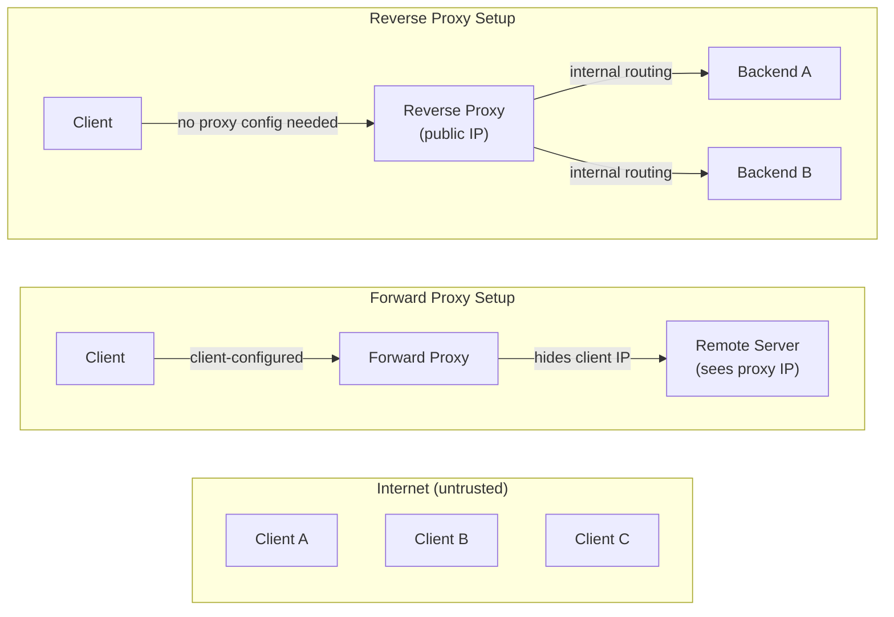
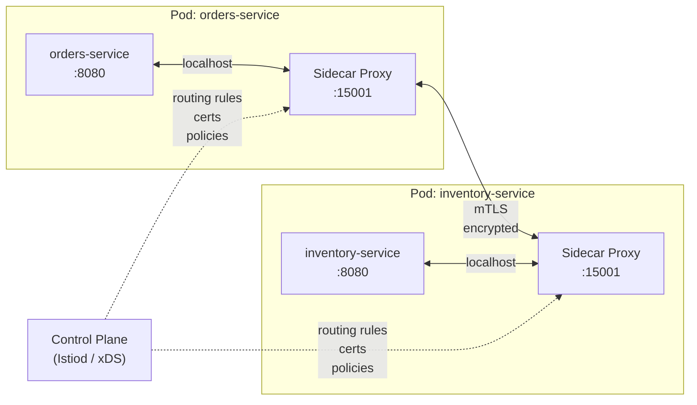

# [BEE-55] Proxies and Reverse Proxies

:::info
Forward proxy vs reverse proxy, use cases, SSL termination, request routing, sidecar proxy pattern, and common configuration pitfalls.
:::

## Context

The word "proxy" is overloaded. A corporate IT department deploys a forward proxy to control what employees can reach on the internet. A CDN operator puts a reverse proxy in front of every origin server to absorb traffic. A service mesh injects a sidecar proxy into every pod to observe and control east-west traffic. Each of these is a "proxy," but they serve fundamentally different principals, sit at different trust boundaries, and carry different failure modes.

Misidentifying which kind of proxy you are operating — or neglecting the failure modes unique to sitting between clients and servers — leads to lost client IP addresses in logs, proxy timeouts shorter than backend processing times, buffer overflows on large payloads, and a new single point of failure that did not exist before the proxy was added.

**References:**
- MDN Web Docs — Proxy servers and tunneling: <https://developer.mozilla.org/en-US/docs/Web/HTTP/Proxy_servers_and_tunneling>
- NGINX ngx_http_proxy_module documentation: <https://nginx.org/en/docs/http/ngx_http_proxy_module.html>
- Envoy Proxy — What is Envoy: <https://www.envoyproxy.io/docs/envoy/latest/intro/what_is_envoy>

## Principle

**Understand which principal a proxy serves — the client or the server — and configure it accordingly: forward client IP, align timeouts with backend reality, size buffers for your payload distribution, and treat the proxy as a failure domain that must be designed for HA from day one.**

---

## Forward Proxy vs Reverse Proxy

The defining question is: **whose identity does the proxy hide, and on whose behalf does it act?**

### Forward Proxy

A forward proxy acts on behalf of **clients**. Clients are explicitly configured to route requests through it. The proxy makes requests to the internet on the client's behalf, so the destination server sees the proxy's IP, not the client's.

Common forward proxy use cases:
- Corporate egress control (allowlist/blocklist of external URLs)
- Bandwidth reduction through shared caching of popular resources
- Anonymity (Tor routes through multiple forward proxies)
- Content filtering for compliance

The **client knows** it is talking to a proxy. The **server does not** know (or care) who the real client is.

### Reverse Proxy

A reverse proxy acts on behalf of **servers**. Clients do not configure it; they simply connect to a hostname that resolves to the proxy. The proxy forwards requests to one or more backend servers and returns the response. The client sees only the proxy, not the backends.

Common reverse proxy use cases:
- SSL termination (proxy decrypts HTTPS, forwards plain HTTP internally)
- Load distribution across multiple backends
- Request routing (path-based, host-based, header-based)
- Caching of static or expensive responses
- Rate limiting and DDoS mitigation at the edge
- Request/response modification (header injection, body rewriting)

The **server knows** it is behind a proxy (it sees the proxy's IP in the connection). The **client does not** know how many backend servers exist or which one handled the request.

### Trust Boundary Diagram



| Dimension | Forward Proxy | Reverse Proxy |
|---|---|---|
| Acts on behalf of | Clients | Servers |
| Client awareness | Client explicitly configures it | Client is unaware of backends |
| Hides | Client identity from servers | Backend topology from clients |
| Deployment location | Client network edge | Server network edge |
| Trust boundary | Separates client from internet | Separates internet from backend |

---

## Transparent vs Explicit Proxies

A proxy can be **explicit** (the client is configured to use it via browser settings, OS proxy config, or PAC file) or **transparent** (traffic is intercepted at the network layer — typically by a firewall or router — without any client configuration).

**Explicit proxy:** Clients send `CONNECT` or full-URL `GET` requests to the proxy address. The proxy is visible in the request path. Common in corporate egress control.

**Transparent proxy:** The network infrastructure redirects certain traffic (e.g., port 80/443) to the proxy without the client knowing. The proxy inspects or modifies traffic in flight. Common in CDN edge nodes and network-level content filters.

The CONNECT tunnel method enables clients behind an HTTP proxy to establish a TCP tunnel for HTTPS: the client sends `CONNECT target-host:443 HTTP/1.1`, and the proxy blindly forwards bytes in both directions without decrypting them.

---

## Reverse Proxy as API Gateway

A reverse proxy with routing and policy capabilities is commonly called an **API gateway**. The same proxy process that routes traffic can enforce:

- Authentication (JWT validation, API key checks)
- Authorization (scope-based access per route)
- Rate limiting (per client, per route, per tenant)
- Request/response transformation (header injection, schema validation)
- Observability (request logging, metrics, distributed tracing headers)

The key architectural consequence: **cross-cutting concerns are handled once at the gateway** instead of being reimplemented in every backend service. Backend services receive pre-authenticated, pre-validated requests and can focus on business logic.

---

## Request Routing

### Path-Based Routing

The proxy inspects the URL path and forwards to different upstreams based on a prefix or regex match.

```
Incoming request: POST /api/orders/123
  → route to: orders-service:8080

Incoming request: GET /auth/token
  → route to: auth-service:8081

Incoming request: GET /static/app.js
  → route to: cdn-bucket or static-file-server
```

Path-based routing is the most common pattern for microservice decomposition behind a single public hostname.

### Host-Based (Virtual Host) Routing

The proxy inspects the `Host` header and routes to different upstreams based on the hostname.

```
Host: api.example.com      → api-backend cluster
Host: admin.example.com    → admin-backend cluster
Host: app.example.com      → frontend-backend cluster
```

A single proxy instance can front many services, each with its own hostname, without requiring separate IP addresses or ports.

### Header-Based and Parameter-Based Routing

Advanced proxies can route on arbitrary HTTP headers or query parameters:

```
X-API-Version: v2    → v2-backend cluster
X-API-Version: v1    → v1-backend cluster (legacy)
?beta=true           → canary-backend (10% rollout)
```

### Routing Configuration Example (Generic Concept)

This pseudoconfig illustrates the three routing concerns most commonly configured together at a reverse proxy:

```
# Path-based routing
route /api/*     → upstream: api-service    (timeout: 30s)
route /auth/*    → upstream: auth-service   (timeout: 10s)
route /          → upstream: frontend       (timeout: 5s)

# Header injection for all upstream requests
inject-header X-Request-ID     = generate-uuid()
inject-header X-Forwarded-For  = client-ip
inject-header X-Forwarded-Proto = incoming-scheme

# Rate limiting per route
rate-limit /api/*   → 1000 req/min per client-ip
rate-limit /auth/*  → 20 req/min per client-ip
```

The principle: routing rules, header injection, and rate limiting are co-located at the proxy layer. Each upstream service receives a consistent set of context headers without having to generate them itself.

---

## SSL Termination at the Proxy

TLS termination at the reverse proxy means:
1. The proxy holds the TLS certificate and private key
2. The proxy decrypts incoming HTTPS traffic
3. The proxy forwards plain HTTP to backend servers over a trusted internal network (or re-encrypts with a separate internal certificate)

**Benefits:**
- Backends do not need to manage certificates or handle TLS handshake CPU cost
- Certificate rotation is a single operation at the proxy, not across all backends
- The proxy can inspect HTTP headers (required for routing and rate limiting) only after decryption

**Topologies (see also [BEE-3](../bee-overall/glossary.md)3):**

| Topology | Description | When to use |
|---|---|---|
| Edge termination | Proxy decrypts; backends receive plain HTTP | Trusted internal network, operational simplicity |
| Re-encryption | Proxy decrypts then re-encrypts to backends | Compliance requires encryption in transit throughout |
| TLS pass-through | Proxy forwards encrypted bytes; no inspection | mTLS required end-to-end; proxy cannot inspect payload |

---

## Caching at the Proxy Layer

A reverse proxy can cache responses and serve them directly without reaching the backend. This reduces backend load and latency for cacheable content.

Cache behavior is governed by HTTP cache-control headers on the response:
- `Cache-Control: public, max-age=300` — proxy may cache for 5 minutes
- `Cache-Control: private` — proxy must not cache; intended for one user only
- `Cache-Control: no-store` — proxy must not store the response at all

**What to cache at the proxy:**
- Static assets (JS, CSS, images) with long `max-age`
- Read-heavy API responses (product catalog, reference data) that are safe to serve slightly stale
- Compressed variants of HTML pages (Vary: Accept-Encoding)

**What must not be cached at the proxy:**
- Authenticated user-specific responses (personal data, account details)
- Session tokens and credentials
- Responses to POST, PUT, DELETE — these are not idempotent and must not be replayed

---

## Rate Limiting at the Proxy Layer

Enforcing rate limits at the proxy protects backends from traffic spikes, abuse, and credential-stuffing attacks. The proxy tracks request counts per key (client IP, API key, user ID) within a sliding window or token bucket and returns `429 Too Many Requests` when the limit is exceeded.

Common rate limiting keys:
- **Per IP address** — simplest; defeats obvious abuse but not shared NATs
- **Per API key / bearer token** — appropriate for authenticated APIs
- **Per user ID** — requires the proxy to extract the ID from the token, not just the header

Rate limiting at the proxy is more effective than in the application because:
- It fires before any backend work is done (no wasted CPU, DB connections, etc.)
- It applies consistently across all instances of a multi-replica backend
- It can shed load during a spike without any backend change

---

## Request and Response Modification

### Header Injection

The proxy adds or overwrites headers before forwarding to backends:

- `X-Request-ID: <uuid>` — correlation ID for distributed tracing; generated if not present
- `X-Forwarded-For: <client-ip>` — original client IP (backends must read this, not the TCP source IP)
- `X-Forwarded-Proto: https` — original scheme (backends can enforce HTTPS-only logic)
- `X-Real-IP: <client-ip>` — single-value alternative to `X-Forwarded-For`

The standardized header `Forwarded` (RFC 7239) combines all of these:
```
Forwarded: for=1.2.3.4;proto=https;host=api.example.com
```

### Header Stripping

The proxy should remove headers that clients should not be able to set and pass to backends:
- Strip any client-supplied `X-Forwarded-For` before appending the real IP (prevents IP spoofing)
- Strip internal debugging headers (`X-Internal-*`) before they escape to clients in responses

### Body Rewriting

Some proxy configurations rewrite response bodies: injecting analytics scripts into HTML, rewriting absolute URLs in redirects to use the public hostname rather than internal hostnames, or transforming API response format for backward compatibility. Body rewriting is expensive (the proxy must buffer and parse the full body) and should be avoided unless no alternative exists.

---

## Sidecar Proxy Pattern (Service Mesh)

In a microservices environment, each service instance can have a dedicated proxy process deployed alongside it — called a **sidecar proxy**. The sidecar intercepts all inbound and outbound network traffic for the service without requiring any change to the service's own code.



Each sidecar receives its configuration from a **control plane** (e.g., Istio's `istiod` via the xDS API). The control plane distributes:
- Routing rules (which service address maps to which endpoint)
- mTLS certificates (automatic rotation, no manual cert management per service)
- Policy (retry budgets, circuit breakers, rate limits)

**Sidecar advantages over a centralized reverse proxy:**
- No single point of failure in the data path between services
- Per-service observability (each sidecar emits metrics and traces)
- Fine-grained policy per service pair, not just at the edge

**Sidecar cost:**
- Each pod runs an additional process consuming CPU and memory
- Additional network hop for every request (service → sidecar → network → sidecar → service)
- Operational complexity of the control plane

See [BEE-5006](../architecture-patterns/sidecar-and-service-mesh-concepts.md) for the full service mesh treatment.

---

## Common Mistakes

### 1. Not Forwarding Client IP — Real IP Lost Behind the Proxy

When the proxy terminates the TCP connection and opens a new one to the backend, the backend sees the proxy's IP as the source of every request. Without `X-Forwarded-For` or `X-Real-IP` injection, rate limiting by IP is impossible, audit logs are useless, and geo-based routing breaks.

**Fix:** Configure the proxy to inject `X-Forwarded-For: <client-ip>` on every upstream request. Strip any client-supplied value of this header before appending the real IP to prevent spoofing. Verify that the application reads the header and not the raw TCP source address.

### 2. Proxy Timeout Shorter Than Backend Processing Time

A proxy has its own read timeout for the upstream connection. If a backend legitimately takes 45 seconds to process a large export or a slow query, but the proxy read timeout is 30 seconds, the proxy kills the connection and returns a `504 Gateway Timeout` to the client. The backend continues working and completes the job — but the client never receives the result.

**Fix:** Set proxy read timeouts based on measured p99 backend response times for each route, not on a single global default. For long-running operations, consider async job patterns (return `202 Accepted`, poll for result) rather than holding a synchronous connection open.

### 3. Large Request or Response Bodies Causing Proxy Buffer Overflow

Many reverse proxies buffer the full request body before forwarding to the backend (to handle slow clients cleanly). If `proxy_buffer_size` and `proxy_buffers` settings are sized for typical payloads (4–8 KB) but a file upload sends 100 MB, the proxy either rejects the request, spills to disk (latency spike), or passes through without buffering (losing slow-client protection).

**Fix:** Size proxy buffers for your actual payload distribution. For file upload routes, consider disabling request buffering at the proxy and streaming directly to the backend (accepting the trade-off of slow-client exposure). Set explicit body size limits per route to reject payloads that exceed business requirements.

### 4. Not Considering the Proxy as a Single Point of Failure

Adding a reverse proxy in front of three healthy backends while running only one proxy instance trades backend resilience for a new SPOF. If the proxy process crashes or the node goes down, all traffic stops.

**Fix:** Deploy the proxy in an HA configuration from the start (active-passive with a virtual IP, active-active with DNS or anycast, or a cloud-managed proxy service with built-in redundancy). Treat the proxy tier as a failure domain that requires its own monitoring, alerting, and runbooks.

### 5. Caching Sensitive Responses at the Proxy Layer

If a response containing personal data, session tokens, or authorization-specific content is cached at the proxy, subsequent clients — including different users — may receive that cached response. This is a data leakage vulnerability, not just a correctness bug.

**Fix:** Audit every route that touches user-specific data and verify that its responses include `Cache-Control: private` or `Cache-Control: no-store`. Treat caching as opt-in at the proxy: default to no-cache, enable it only for explicitly identified safe responses.

---

## Related BEPs

- [BEE-3001](tcp-ip-and-the-network-stack.md) — TCP/IP and the Network Stack: Every proxy connection is a TCP connection; connection pooling (keepalive) between proxy and backends reduces TCP handshake overhead per request
- [BEE-3003](http-versions.md) — HTTP/1.1, HTTP/2, HTTP/3: HTTP/2 multiplexing changes how requests flow through a proxy; a proxy must understand HTTP/2 framing to correctly forward streams to backends
- [BEE-3004](tls-ssl-handshake.md) — TLS/SSL Handshake: SSL termination at the proxy is the dominant deployment pattern; see termination topologies, certificate management, and the trade-offs of re-encryption vs pass-through
- [BEE-3005](load-balancers.md) — Load Balancers: A reverse proxy and an L7 load balancer overlap significantly; load balancers add upstream health checks, connection draining, and load-balancing algorithms on top of the core proxy machinery
- [BEE-5006](../architecture-patterns/sidecar-and-service-mesh-concepts.md) — Sidecar and Service Mesh: Sidecar proxies extend the reverse proxy concept to east-west (service-to-service) traffic; the control plane, xDS API, and mTLS certificate automation are covered in depth
