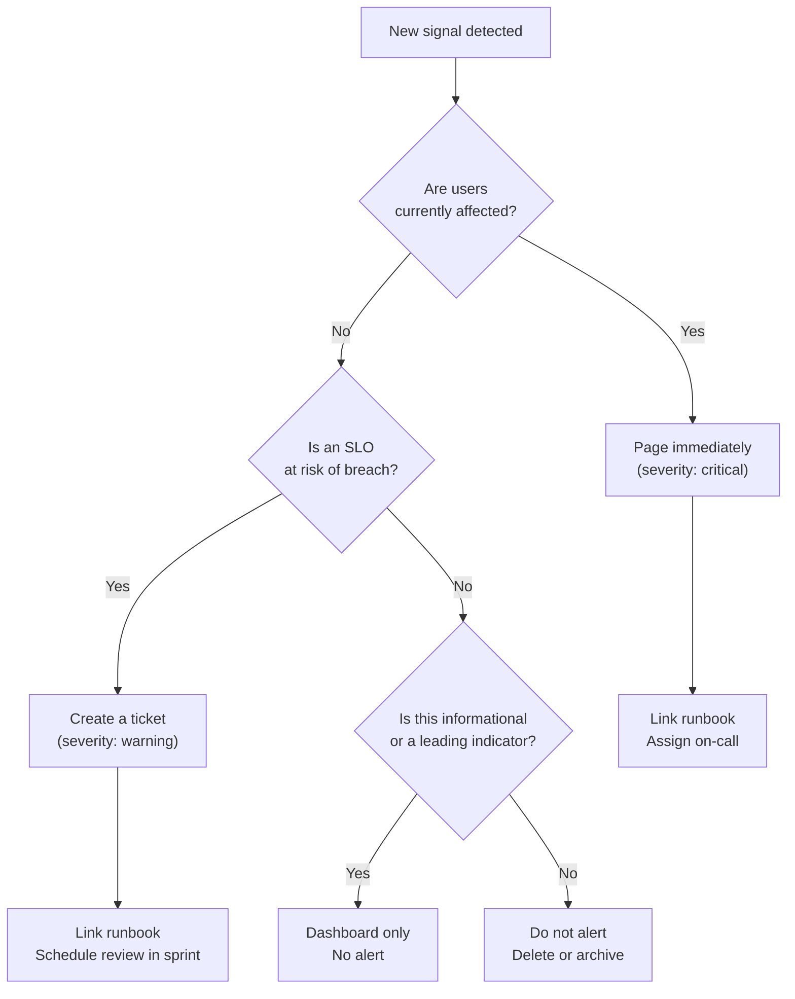

# [BEE-323] Alerting Philosophy

:::info
Symptom-based vs cause-based alerts, alert fatigue, SLO-driven burn rate alerting, and the discipline of keeping on-call rotations sane.
:::

## Context

In 2012, Rob Ewaschuk published "My Philosophy on Alerting" based on his experience as a Site Reliability Engineer at Google. The core argument is deceptively simple: every page should require human intelligence to handle, and every page should represent an ongoing or imminent user impact. Cause-based alerting — firing on internal system states like CPU, memory, or queue depth — violates both rules. It pages on conditions that may never affect users, and it requires no intelligence: the response is scripted.

The Google SRE book (Chapter 6: Monitoring Distributed Systems) distills this into four properties every alert should have: **urgent, important, actionable, and real**. The SRE Workbook (Chapter 5: Alerting on SLOs) extends the model by showing how to derive alerts directly from SLO burn rates using a multi-window, multi-burn-rate approach — a technique that is now the industry standard for production alerting.

**References:**
- [Rob Ewaschuk — My Philosophy on Alerting (Google Docs)](https://docs.google.com/document/d/199PqyG3UsyXlwieHaqbGiWVa8eMWi8zzAn0YfcApr8Q/preview)
- [Google SRE Book — Monitoring Distributed Systems](https://sre.google/sre-book/monitoring-distributed-systems/)
- [Google SRE Workbook — Alerting on SLOs (multi-window, multi-burn-rate)](https://sre.google/workbook/alerting-on-slos/)

## Principle

**Alert on symptoms — observable user impact — not on causes. Every alert must be urgent, actionable, and linked to a runbook. Derive production pages from SLO burn rate, not from crossing metric thresholds.**

## Symptom-Based vs Cause-Based Alerting

Your monitoring system has to answer two questions: *what is broken?* and *why?* The "what" is the symptom — what users experience. The "why" is the cause — an internal system condition that contributed to the symptom.

**Alert on symptoms. Put causes on dashboards.**

### Why cause-based alerts fail

A complex system has hundreds of failure modes. You cannot enumerate all of them in advance. Cause-based alerts have two failure modes:

1. **False positives**: CPU hits 80%, alert fires, but the service is handling requests normally. On-call investigates, finds nothing wrong, marks it noise. After enough repetitions, they ignore all similar alerts.
2. **False negatives**: A novel failure mode causes high error rates through a code path you never thought to instrument. No threshold was set; no alert fires; users are affected for 45 minutes before anyone notices.

Symptom-based alerts fix both. If users are not affected, no alert fires. If users are affected — by any cause — the alert fires.

### The contrast in practice

**Bad alert — cause-based:**
```
FIRING: High CPU usage
  host: host-17
  cpu_usage: 82%
  threshold: 80%
```

Why this fails:
- CPU at 82% may be normal for this host under this workload.
- It says nothing about whether users are affected.
- The "fix" is unclear — do you scale? restart? investigate? contact a DB team?
- No runbook exists because there is no clear action.

**Good alert — symptom-based:**
```
FIRING: order-service SLO burn rate critical
  error_rate_5m: 2.3%
  slo_target: 99.5% (0.5% error budget)
  burn_rate_1h: 10.2x
  burn_rate_5m: 12.8x
  runbook: https://wiki.internal/runbooks/order-service-error-rate
```

Why this works:
- It tells you users are being affected right now.
- Burn rate quantifies urgency: 10x means the monthly error budget depletes in 3 days at this rate.
- The runbook link gives an immediate starting point.
- It does not fire when error rates are elevated but still within SLO.

## Alerting Decision Tree



## SLO Burn Rate Alerting

Alerting directly on an SLO burn rate is the most reliable way to ensure pages reflect real user impact while minimizing noise. See [BEE-14002](structured-logging.md) for full SLO mechanics; the alerting application is summarized here.

### What is burn rate?

Burn rate is how fast your service consumes its error budget relative to the SLO compliance period. A burn rate of 1.0 means you are consuming the budget at exactly the rate that would exhaust it by the end of the month. A burn rate of 10x means the budget depletes in 1/10th the time — for a monthly budget, that is about 3 days.

### Multi-window, multi-burn-rate

A single-window burn rate alert has a fundamental problem: a short spike produces a momentarily high burn rate, pages the on-call engineer, and then self-resolves. The engineer wakes up to nothing.

The multi-window approach requires the burn rate to be elevated in **both** a long window and a short window simultaneously. The long window detects sustained problems; the short window confirms the problem is current and not historical.

Google recommends four alert rules for a 99.5% monthly SLO:

| Severity | Burn rate | Long window | Short window | Time to budget exhaustion |
|---|---|---|---|---|
| Critical (page) | 14.4x | 1 hour | 5 minutes | 2 days |
| Critical (page) | 6x | 6 hours | 30 minutes | 5 days |
| Warning (ticket) | 3x | 1 day | 2 hours | 10 days |
| Warning (ticket) | 1x | 3 days | 6 hours | 30 days |

The two critical rules page the on-call immediately. The two warning rules create tickets for the next working day. Nothing below these thresholds should ever page.

**Prometheus example (1-hour / 5-minute windows, 14.4x burn rate):**
```yaml
- alert: OrderServiceErrorBudgetCritical
  expr: |
    (
      rate(http_requests_total{service="order-service",status=~"5.."}[1h])
      / rate(http_requests_total{service="order-service"}[1h])
    ) > (14.4 * 0.005)
    and
    (
      rate(http_requests_total{service="order-service",status=~"5.."}[5m])
      / rate(http_requests_total{service="order-service"}[5m])
    ) > (14.4 * 0.005)
  for: 2m
  labels:
    severity: critical
  annotations:
    summary: "order-service error budget burning critically fast"
    runbook: "https://wiki.internal/runbooks/order-service-error-rate"
```

## Alert Severity Levels

Every alert must be assigned a severity that determines how it is routed and what response it demands.

| Severity | Routing | Definition | Response time |
|---|---|---|---|
| **Critical (page)** | PagerDuty / on-call | Users impacted now, SLO breach imminent | Immediate (24/7) |
| **Warning (ticket)** | Jira / Slack | SLO at risk, not yet breached | Next business day |
| **Info** | Dashboard only | Context for investigation | No response required |

**The most common mistake**: treating all alerts as pages. When everything pages, nothing matters. Engineers silence pagers, miss real incidents, and burn out.

The rule: if it does not require waking someone up at 2 AM, it is not a page.

## Alert Fatigue

Alert fatigue is the condition where the volume of alerts is high enough that engineers stop engaging with them. It is not a perception problem; it is a systemic safety hazard. Ignored alerts mean real incidents go undetected.

**Warning signs:**
- On-call engineers routinely acknowledge alerts without investigating.
- Alerts are silenced by default at certain hours.
- Mean time to acknowledge (MTTA) trends upward each quarter.
- Engineers describe on-call weeks as exhausting even during low-incident periods.

**How it happens:**
1. Teams add alerts for every metric threshold they can think of.
2. Each individual alert seems reasonable.
3. The aggregate volume is unsustainable.
4. Signal-to-noise ratio collapses.
5. Real incidents are missed.

**Fixing it:** Treat alert count as a metric. Track pages per on-call week. Any week with more than 5 pages that required no action is a week that needs alert review. Regularly prune alerts that have not triggered, or that triggered but required no response.

## Runbooks: Every Alert Must Have One

An alert without a runbook is an alert that will be mishandled under pressure.

A runbook is a document linked directly from the alert that tells the responder:

1. **What the alert means** — What user impact is occurring? What is the SLI being violated?
2. **Initial triage** — What are the first three checks to run? (Example: check error rate by endpoint, check recent deployments, check downstream dependencies.)
3. **Escalation path** — Who else to contact if the initial investigation is inconclusive.
4. **Known mitigations** — Rollback procedure, circuit breaker toggle, rate limit increase.
5. **Post-incident link** — Where to file the postmortem.

If writing a runbook for an alert is difficult, that is a signal the alert should not exist. Alerts that cannot be acted on should be removed.

## Alert Suppression and Grouping

Raw alerting tools fire one notification per alert rule per occurrence. In a real incident, a single root cause triggers dozens of alerts across many services. Each alert pages separately. The on-call engineer receives 40 pages in 90 seconds and cannot process any of them.

**Grouping** collapses related alerts into a single notification. Alertmanager (Prometheus) and PagerDuty both support grouping by labels such as `service`, `cluster`, or `team`. One incident, one notification.

**Suppression** (also called inhibition) prevents child alerts from firing when a parent alert is already active. If `database-primary-down` is firing, suppress all downstream `service-error-rate` alerts that are caused by it. The on-call focus stays on the root cause.

Configure both from the start. Retroactively adding grouping after an alert storm is harder than getting it right during initial setup.

## On-Call Burden

On-call is sustainable only when it is predictable and bounded. Google SRE's recommendation: no more than two pages per 12-hour on-call shift that require active intervention. More than that, and the rotation cannot sustain quality responses.

**Reducing on-call burden:**
- Audit alerts quarterly. Remove any alert that fired but did not require action in the past 90 days.
- Downgrade warnings that are consistently handled the same way to tickets or dashboards.
- Add automation for known runbook steps. If the runbook says "restart the pod," automate it.
- Rotate on-call between enough engineers that no individual is on-call more than once every 4–6 weeks.

## Alert Testing: Fire Drills

Alerts that have never fired in production cannot be trusted. The runbook may be wrong, the routing may be broken, or the alert condition may never actually trigger for the failure mode it was designed to catch.

**Fire drill protocol:**
1. Schedule a time outside peak traffic.
2. Inject a failure (e.g., increase synthetic error rate, degrade a dependency) to trigger the alert.
3. Verify the alert routes to the correct team via the correct channel.
4. Verify the runbook is accurate and leads to correct remediation steps.
5. Document gaps found and update the alert or runbook.

Run fire drills for critical alerts at minimum once per quarter, and after any significant infrastructure change.

## Common Mistakes

### 1. Alerting on every metric threshold

Adding a threshold alert for every metric in your system is the most direct path to alert fatigue. The right question is not "can I alert on this?" but "does this metric directly correspond to user impact?" If the answer is no, the metric belongs on a dashboard, not an alert rule.

### 2. Cause-based alerts without symptom correlation

Alerting on `disk_usage > 85%` without asking whether the disk filling will cause user impact (and on what timeline) creates pages that require investigation but rarely require immediate action. A disk at 85% with 10 days of headroom at current growth rate is a ticket, not a page.

### 3. No runbook linked

An alert fires at 2 AM. The on-call engineer clicks the alert, sees a threshold violation, and has no idea what to do. They either wake up a senior engineer to ask, or guess. Both outcomes are bad. Every alert must link a runbook before it goes to production.

### 4. Same severity for everything

If every alert is critical, none are. Severity inflation destroys the signal. Page only for confirmed user impact. Everything else is a ticket or a dashboard.

### 5. Never reviewing or pruning alerts

Alert libraries grow. Old services get replaced; their alerts remain. New microservices add their own. After 18 months, half the alert library is stale or duplicate. Stale alerts fire on conditions that no one understands, create noise, and erode trust in the alerting system. Schedule quarterly alert reviews as a team ritual.

## Related BEPs

- [BEE-14001](three-pillars-logs-metrics-traces.md) — The three pillars: logs, metrics, traces — the signal foundation alerting is built on
- [BEE-14002](structured-logging.md) — SLOs and error budgets: defining reliability targets and deriving burn rate alerts
- [BEE-14006](health-checks-and-readiness-probes.md) — Health checks and readiness probes: liveness/readiness as inputs to alerting
