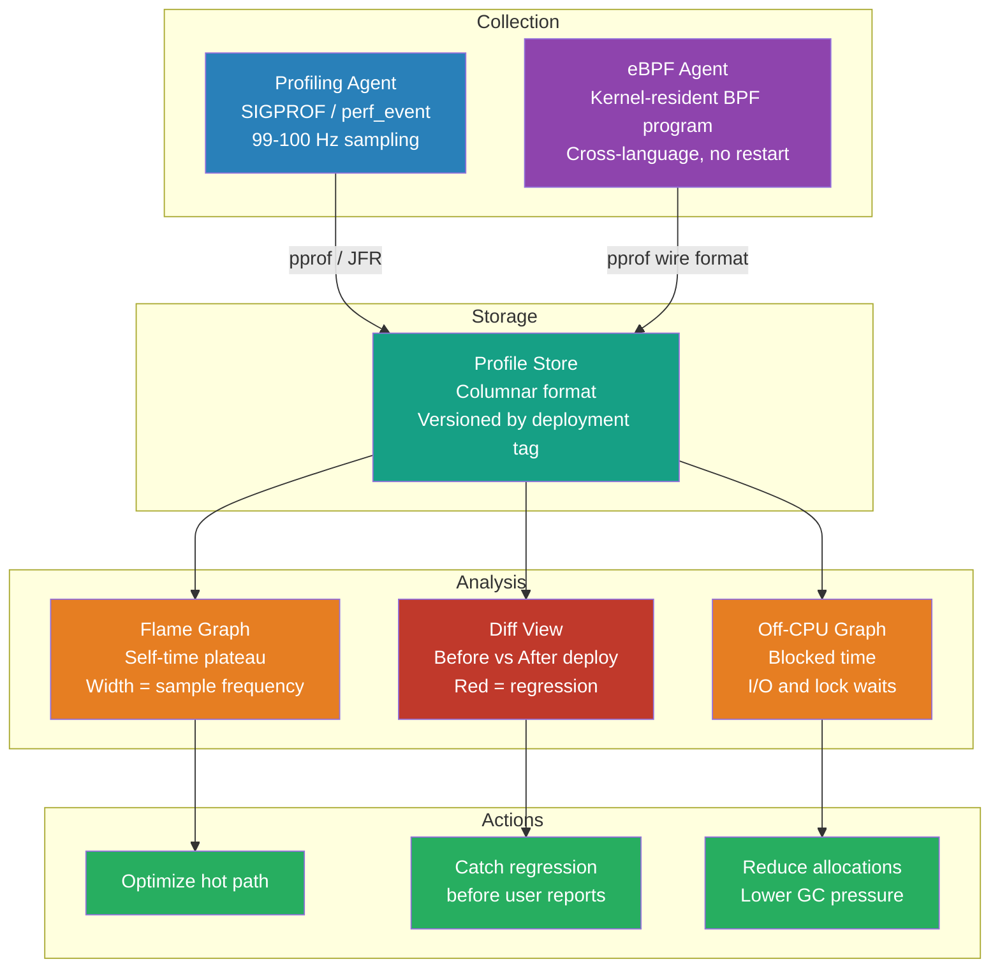

# [BEE-326] Continuous Profiling in Production

:::info
Continuous profiling runs always-on sampling across every service in a fleet, stores profiles with deployment metadata, and enables before/after diff analysis — answering not just "what is slow" but "which code change made it slow."
:::

## Context

The three-pillar observability model (BEE-320: logs, metrics, traces) answers "what happened," "how much," and "where in the request path." None of these answers "why is this function consuming 40% of CPU?" or "which line of code is generating GC pressure?" Profiling is the fourth pillar that fills this gap.

Traditional profiling is a manual, one-shot operation run against a single process in a staging environment. The fundamental problem is that production workloads are not reproducible: the data distribution, the JIT compilation state, the OS scheduler behavior, and the load shape all differ from staging. Profiling staging tells you about staging performance, not production performance.

The modern answer is continuous profiling: always-on, low-overhead sampling of all processes on all production hosts, with profiles stored persistently and tagged with deployment version, instance, and timestamp. The practice was established at scale by Google in 2010. Gang Ren, Eric Tune, Tipp Moseley, and colleagues published "Google-Wide Profiling: A Continuous Profiling Infrastructure for Data Centers" in *IEEE Micro* (2010), documenting a system that profiles thousands of applications on thousands of servers at negligible per-host overhead — achieved by profiling only a rotating subset of machines at any moment. The stored profiles revealed that "a large amount of CPU time is spent in functions unrelated to the business logic," including serialization, allocation, and string operations that accumulated across the fleet.

Netflix operationalized this at their scale, saving an estimated 13 million CPU-minutes per day (2016) through flame graph analysis of Java microservices. Meta's Strobelight fleet profiling system (2025) runs 42 simultaneous profiler types across all production hosts and has enabled capacity savings on the order of 15,000 servers per year from individual code optimizations. The tooling ecosystem has matured significantly: Pyroscope (Grafana), Parca (CNCF/Polar Signals), and Google Cloud Profiler are production-ready; the OpenTelemetry eBPF profiler provides cross-language zero-instrumentation profiling.

## Flame Graphs

All continuous profiling tools use flame graphs as the primary visualization. Understanding how to read them is prerequisite to using profiling data correctly.

Brendan Gregg invented flame graphs in December 2011 while investigating a MySQL performance regression at Sun/Oracle. The canonical publication is "The Flame Graph" in *ACM Queue* / *Communications of the ACM* (vol. 59, no. 6, June 2016).

**Reading a flame graph:**
- **Y-axis**: Stack depth, counting from zero at the bottom. The root frame is at the bottom; its callees stack upward.
- **X-axis**: The stack trace *population* sorted **alphabetically** — NOT the passage of time. Adjacent frames that share a call stack are merged. The sorting is purely to maximize merging and readability.
- **Width of a frame**: Proportional to the number of times that frame appeared in samples — i.e., the fraction of total profiling time where that frame was on the stack (inclusive of its callees). Wider = more total time.
- **Width of the plateau** (the exposed top of a frame above its children): The self-time — time spent in that function excluding callees. A wide base with a narrow plateau means most of the time is delegated to children.
- **Color**: In CPU flame graphs, color is typically random warm hues with no semantic meaning. Diff flame graphs (comparison views) use red for regressions and blue for improvements.

**The most common misreading**: treating the x-axis as time. A wide frame on the left does not mean it ran first or ran longest in a temporal sense — it means its call stack appeared frequently in the sample population. Gregg explicitly distinguishes flame graphs (alphabetically sorted, time-collapsed) from "flame charts" (time on x-axis, used in Chrome DevTools) in all his documentation.

**Off-CPU flame graphs**: The standard flame graph shows time spent actively running on CPU. Off-CPU flame graphs show where threads are *not* running — blocked on I/O, locks, network, or scheduler latency. For I/O-bound services, on-CPU profiling is often misleading (the hot frame is "read from socket," which looks cheap, but the wall-clock time is the wait). Off-CPU profiling reveals what blocked threads are waiting on.

## Profile Types

| Profile Type | What It Measures | Key Use Cases |
|---|---|---|
| On-CPU | Functions consuming CPU cycles | Compute-bound hot paths, algorithm inefficiency |
| Off-CPU / Wall-clock | Where threads are blocked | I/O waits, lock contention, scheduler latency |
| Heap / Allocation | Memory allocation call paths | GC pressure, memory leaks, object churn |
| Goroutine / Thread count | Snapshot of all live threads | Goroutine leaks, thread pool exhaustion |
| Lock contention | Time threads wait for locks | Concurrency bottlenecks, `synchronized` overhead |

**MUST choose the correct profile type for the hypothesis.** A service with high latency but low CPU utilization is an off-CPU problem — CPU profiling will show nothing interesting. A service with high GC pause rates is an allocation problem — CPU profiling may show GC time but not where the allocations originate.

## How Sampling Profilers Work

Modern production-safe profilers use statistical sampling rather than instrumentation:

1. A SIGPROF signal (or `perf_event` overflow interrupt for eBPF profilers) fires at a fixed rate — typically 99 or 100 Hz.
2. On each interrupt, the profiler walks the call stack and records the frame chain.
3. After many samples, the frequency histogram of call stacks approximates the distribution of where program time is spent.

At 100 samples/second, each sample adds approximately 1–2 microseconds of overhead. For a process running at 1 second of CPU time per second, this is roughly 0.1–0.2% overhead — in the same order of magnitude as garbage collection overhead.

**The safepoint bias problem (JVM):** JVMTI-based Java profilers must bring threads to a safepoint before reading stack frames. JIT-compiled code only reaches safepoints at specific compiled-in checkpoints, so profilers systematically miss frames between safepoints — producing a biased view that over-represents safepoint-heavy code. Nitsan Wakart's 2016 blog post "Why (Most) Sampling Java Profilers Are Fucking Terrible" documented this problem precisely. `async-profiler` eliminates it by using `AsyncGetCallTrace` — a HotSpot-internal API that captures stack traces at arbitrary interruption points — combined with `perf_events`.

## Best Practices

**MUST run a continuous profiler in production, not just staging.** Production workloads have different data distributions, different JIT compilation states, and different concurrency patterns than staging. Profiling staging gives you staging performance characteristics, not production ones.

**MUST instrument profiling with deployment metadata.** Profiles stored without version tags cannot be diff'ed across deployments. At minimum: deployment version, environment, host/pod label, and timestamp. This enables the canonical use case: "deploy v2.1, compare CPU profile vs. v2.0, identify the regression."

**SHOULD start with on-CPU profiling and only add off-CPU profiling when latency does not correlate with CPU usage.** For a service with high CPU utilization and high latency, on-CPU profiling is the right first tool. For a service with low CPU utilization and high latency (dominated by database queries, external I/O, or lock waits), off-CPU or wall-clock profiling is necessary.

**SHOULD sample at 99 Hz rather than 100 Hz.** Using a prime sampling rate avoids aliasing with periodic system activities (60 Hz screen refreshes, 100 Hz kernel timer interrupts, periodic GC cycles). Parca uses 19 Hz for the same reason. This is standard practice but the difference is small; 100 Hz is acceptable.

**MUST NOT add per-call instrumentation (function entry/exit hooks) to production code for profiling purposes.** Instrumentation adds fixed overhead to every function call. At production call rates (millions of calls per second), even a few nanoseconds per call adds up to measurable throughput degradation. Statistical sampling achieves the same insight at a fraction of the overhead.

**SHOULD configure the JVM with `-XX:+PreserveFramePointer`** when using eBPF-based profilers or Linux `perf`. Modern JIT compilers omit the frame pointer register (`rbp`) for performance; without it, native stack walkers cannot reconstruct the call chain from JIT-compiled code. The performance cost of preserving frame pointers is typically 1–3%.

**SHOULD store profiles for at least 30 days** to enable regression analysis across release cycles. Most continuous profiling products default to 7–30 day retention.

## Runtime-Specific Tooling

### JVM

**async-profiler**: The correct choice for production JVM profiling. Supports CPU, wall-clock (I/O-bound services), allocation (heap pressure), and lock contention modes. Eliminates safepoint bias via `AsyncGetCallTrace`. Integrates with Pyroscope, Parca, Datadog, and Grafana agents. Start with wall-clock mode for latency investigation; switch to allocation mode when GC pause rates are high.

**Java Flight Recorder (JFR)**: Built into OpenJDK (JEP 328, open-sourced in JDK 11). Uses an in-JVM ring-buffer for continuous recording. The "default" configuration targets <1% overhead. JFR captures method profiling (using safepoint sampling, unlike async-profiler), GC events, I/O events, thread park events, and monitor waits — all in one recording. Use JFR when you need event-driven data (GC duration, lock wait time) alongside profiling data.

```bash
# async-profiler: 30-second wall-clock profile, output as flamegraph HTML
java -agentpath:/path/to/libasyncProfiler.so=start,wall,interval=10ms,file=profile.html -jar app.jar

# Java Flight Recorder: always-on recording, default overhead target
java -XX:StartFlightRecording=maxage=1h,filename=/tmp/flight.jfr -jar app.jar

# JVM flag required for eBPF/perf native stack unwinding
-XX:+PreserveFramePointer
```

### Go

Go's standard library includes a full profiling framework. The `net/http/pprof` package registers handlers at `/debug/pprof/` that serve live profiles on demand. Enable it by importing the package:

```go
import _ "net/http/pprof" // side-effect: registers HTTP handlers

// Fetch profiles from a running service
go tool pprof http://localhost:6060/debug/pprof/heap      // live heap
go tool pprof http://localhost:6060/debug/pprof/allocs    // allocation hot paths
go tool pprof http://localhost:6060/debug/pprof/profile?seconds=30  // CPU, 30 sec

// Block and mutex profiles are off by default; enable at runtime:
// runtime.SetBlockProfileRate(1)      // every blocking event
// runtime.SetMutexProfileFraction(1)  // every mutex contention
```

The `allocs` profile shows allocation call stacks regardless of liveness — it is the correct tool for finding GC pressure hot paths, as distinct from the `heap` profile (which shows live allocations).

### Python

**py-spy**: A sampling profiler written in Rust that reads CPython interpreter state from `/proc` without injecting into the target process. Safe to attach to running production processes without restart or code changes. Works against Python 2.7, 3.x, PyPy.

```bash
# Attach to a running process and generate a flame graph SVG
py-spy record --pid <PID> --output profile.svg --format speedscope

# Live top-like view (terminal, no output file)
py-spy top --pid <PID>
```

### Node.js

```bash
# Built-in V8 profiler — generates tick file
node --prof app.js
node --prof-process isolate-*.log > processed.txt

# clinic.js (NearForm) — wraps profiling with automated diagnosis
npx clinic flame -- node app.js
```

## Continuous Profiling Products

**Pyroscope (Grafana)**: Open-source, single-binary or microservices architecture. Supports Java, Go, Python, Ruby, .NET, Rust, PHP, and eBPF agents. Stores profiles in a columnar format optimized for flame graph queries and diff views. Available as self-hosted or Grafana Cloud managed service. Integrates with Grafana dashboards alongside Loki, Tempo, and Mimir.

**Parca (CNCF / Polar Signals)**: eBPF-based agent sampling at 19 Hz. Aggregates call stacks in BPF maps in kernel; drains to userspace every 10 seconds. Stores profiles in Apache Arrow / Parquet columnar format. Symbolizes remotely against public `debuginfod` servers, so production binaries can remain stripped. Requires Linux 5.3+ with BTF (BPF Type Format / BPF CO-RE). Available as self-hosted or Polar Signals Cloud.

**OpenTelemetry eBPF Profiler**: Originally developed by Elastic, donated to OpenTelemetry. Supports 10+ runtimes including C/C++, Go, Rust, Python, Java, Node.js/V8, .NET, PHP, Ruby, Perl. Claims <1% CPU and <250 MB RAM overhead.

**Google Cloud Profiler**: Hosted service derived directly from GWP. Measured <0.5% CPU and ~4 MB RAM overhead per service. Rotates coverage so only one replica per deployment is profiled at a time.

**Datadog Continuous Profiler**: Integrates profiles with APM traces — allows navigating from a slow trace span directly to the profiling data for that service at that time. Supports diff views with regression highlighted in red.

## Visual



## Common Mistakes

**Profiling only in staging.** Production and staging differ in JIT compilation state, data size, thread count, and request concurrency. A Java service on cold JVM has a completely different CPU profile than after 5 minutes of traffic. Continuous production profiling is not optional — it is the only way to observe actual production behavior.

**Using CPU profiling for I/O-bound services.** A service that spends 90% of its time waiting for database responses will show an almost empty CPU profile — the database wait is not CPU time. Use wall-clock or off-CPU profiling. The diagnostic question is: "Is this service CPU-bound or wait-bound?"

**Misreading the x-axis as time.** The most common flame graph error. A wide frame on the left of the flame graph means its call stack was frequently sampled, not that it ran first. Time is not represented in the x-axis.

**Looking only at the widest frame, not the plateau.** The widest frame (by total width including children) is the highest-level caller — usually `main` or a request handler. The frame with the widest plateau (exposed top above its children) is where self-time is concentrated. Self-time is what you can actually optimize without refactoring callers.

**Not tagging profiles with deployment version.** Profiles are most valuable when compared before and after a deploy. A profiling system that stores only raw flame graphs without version metadata cannot answer "which change caused the regression."

**Forgetting to enable block/mutex profiles in Go.** The `block` and `mutex` profiles are disabled by default (they add overhead for every lock operation). In a service with latency issues that are not visible in CPU or heap profiles, enable them temporarily: `runtime.SetBlockProfileRate(1)` and `runtime.SetMutexProfileFraction(1)`.

## Related BEEs

- [BEE-13004](../performance-scalability/profiling-and-bottleneck-identification.md) -- Profiling and Bottleneck Identification: one-shot profiling tools and workflow for targeted performance investigations
- [BEE-14001](three-pillars-logs-metrics-traces.md) -- The Three Pillars: Logs, Metrics, Traces: the observability foundation that continuous profiling complements as a fourth pillar
- [BEE-14003](distributed-tracing.md) -- Distributed Tracing: linking trace span data with profiling data to find which function caused a slow span
- [BEE-13007](../performance-scalability/memory-management-and-garbage-collection.md) -- Memory Management and Garbage Collection: allocation profiling reveals GC-pressure hot paths; continuous profiling catches allocation regressions across deploys
- [BEE-13008](../performance-scalability/jvm-jit-compilation-and-application-warm-up.md) -- JVM JIT Compilation and Application Warm-Up: JIT warm-up produces different CPU profiles at startup vs. steady state; continuous profiling captures both

## References

- [Gang Ren et al. Google-Wide Profiling: A Continuous Profiling Infrastructure for Data Centers — IEEE Micro, 2010](https://research.google/pubs/google-wide-profiling-a-continuous-profiling-infrastructure-for-data-centers/)
- [Brendan Gregg. The Flame Graph — ACM Queue / Communications of the ACM, June 2016](https://queue.acm.org/detail.cfm?id=2927301)
- [Brendan Gregg. Off-CPU Flame Graphs — brendangregg.com](https://www.brendangregg.com/FlameGraphs/offcpuflamegraphs.html)
- [Meta Engineering. Strobelight: A Profiling Service Built on Open Source Technology — January 2025](https://engineering.fb.com/2025/01/21/production-engineering/strobelight-a-profiling-service-built-on-open-source-technology/)
- [Netflix TechBlog. Saving 13 Million Computational Minutes per Day with Flame Graphs — April 2016](https://netflixtechblog.com/saving-13-million-computational-minutes-per-day-with-flame-graphs-d95633b6d01f)
- [Netflix TechBlog (Martin Spier, Brendan Gregg). Netflix FlameScope — April 2018](https://netflixtechblog.com/netflix-flamescope-a57ca19d47bb)
- [async-profiler — GitHub](https://github.com/async-profiler/async-profiler)
- [Parca Agent Design — parca.dev](https://www.parca.dev/docs/parca-agent-design/)
- [Frederic Branczyk. Design Decisions of a Continuous Profiler — Polar Signals, December 2022](https://www.polarsignals.com/blog/posts/2022/12/14/design-of-continuous-profilers)
- [Go Diagnostics — go.dev](https://go.dev/doc/diagnostics)
- [JEP 328: Flight Recorder — OpenJDK](https://openjdk.org/jeps/328)
- [Nitsan Wakart. Why (Most) Sampling Java Profilers Are Fucking Terrible — 2016](http://psy-lob-saw.blogspot.com/2016/02/why-most-sampling-java-profilers-are.html)
