# [BEE-322] Distributed Tracing

:::info
Trace and span concepts, W3C trace context propagation, sampling strategies, and how to instrument services so traces remain intact across every service boundary.
:::

## Context

In 2010, Google published the Dapper paper describing how they built a tracing infrastructure for a system where a single search query could fan out across thousands of internal services. The problem they were solving is universal in distributed architectures: when a request is slow or fails, how do you know which service is responsible when no single service has the full picture?

Dapper established the foundational model — traces composed of spans, with unique identifiers propagated across service boundaries — that every modern tracing system uses. OpenTelemetry, now the CNCF standard for instrumentation, codifies that model into a vendor-neutral SDK. The W3C Trace Context specification (2021) standardized the wire format for context propagation, so traces can flow across services regardless of what vendor backend each team uses.

**References:**
- [Google Dapper — Large-Scale Distributed Systems Tracing Infrastructure (2010)](https://research.google/pubs/dapper-a-large-scale-distributed-systems-tracing-infrastructure/)
- [W3C Trace Context specification](https://www.w3.org/TR/trace-context/)
- [OpenTelemetry — Traces concepts](https://opentelemetry.io/docs/concepts/signals/traces/)
- [OpenTelemetry — Sampling strategies](https://opentelemetry.io/docs/concepts/sampling/)

## Principle

**Instrument every service to create spans, propagate the W3C `traceparent` header across every service boundary (including message queues), and sample to preserve traces that matter — errors, slow requests, and a statistical baseline of normal traffic.**

## Core Concepts

### Trace

A **trace** is the complete record of a single request's journey through your system. Every operation triggered by that request — across every service, database query, and external call — belongs to the same trace. A trace is identified by a globally unique 128-bit **trace ID**.

### Span

A **span** is a timed unit of work within a trace. A span records:

- A unique **span ID** (64-bit)
- The **trace ID** it belongs to
- The **parent span ID** (or nothing, if it is the root span)
- Start time and duration
- Status (OK, Error, Unset)
- **Attributes** — key-value pairs providing context (HTTP method, DB statement, user ID)
- **Events** — timestamped records of significant moments within the span's lifetime (e.g., a cache miss, a retry attempt)

A single trace for a checkout request might contain 15–20 spans: one root span at the API gateway, child spans for each downstream service call, grandchild spans for database queries and cache lookups.

### Parent-Child Relationships

Spans form a tree. When Service A calls Service B, Service A creates a child span for the outgoing call, and Service B creates a separate child span for its own processing — both linked to the same parent span in Service A. This parent-child structure is what allows a trace viewer to render a waterfall showing exactly where time was spent.

```
Trace: a3ce929d0e0e47364bf92f3577b34da6
│
├── [api-gateway] root span               0ms ──────────────── 310ms
│   ├── [order-service]                  12ms ──────────────── 305ms
│   │   ├── [inventory-service]          15ms ──── 60ms
│   │   ├── [payment-service]            15ms ──────────────── 300ms  ← slow
│   │   │   └── [stripe-api] ext. call   20ms ──────────────── 295ms  ← very slow
│   │   └── [db: INSERT orders]         301ms ─── 305ms
```

## Context Propagation

The mechanism that connects spans across services is **context propagation**: the trace ID, parent span ID, and sampling decision travel with the request in an HTTP header.

### The W3C traceparent Header

The W3C Trace Context specification defines a standard `traceparent` header format:

```
traceparent: 00-4bf92f3577b34da6a3ce929d0e0e4736-b7ad6b7169203331-01
              ^  ^                                ^                ^
              |  |                                |                |
           version  trace-id (128-bit hex)  parent-span-id   trace-flags
                                              (64-bit hex)   01=sampled
```

| Field | Length | Description |
|---|---|---|
| `version` | 2 hex chars | Always `00` in current spec |
| `trace-id` | 32 hex chars | Globally unique ID for the entire trace |
| `parent-id` | 16 hex chars | Span ID of the caller's current span |
| `trace-flags` | 2 hex chars | `01` = sampled, `00` = not sampled |

Every service that receives a request must:
1. Extract the `traceparent` header
2. Create a new child span using the received `trace-id` and `parent-id`
3. Forward the header (with its own span ID as the new `parent-id`) in all outbound calls

When no `traceparent` is present on an incoming request, the service becomes the root and generates a new `trace-id`.

### Async Operations: Message Queues

Context propagation must extend beyond HTTP. When a service publishes a message to Kafka, RabbitMQ, or any other queue, the `traceparent` value must be included in the message metadata/headers. The consumer reads it and creates a child span with a link to the producer's span. Without this, traces break at every async boundary — a common and painful gap in tracing coverage.

## Span Attributes and Events

A span with only timing data tells you *how long* something took. Attributes and events tell you *why*.

**Attributes** are key-value pairs set at span creation or during the span's lifetime:

```
http.method = "POST"
http.route = "/orders"
http.status_code = 200
db.system = "postgresql"
db.statement = "INSERT INTO orders ..."
order.id = "ORD-4492"
user.id = "8821"
```

OpenTelemetry defines semantic conventions for common attributes (HTTP, database, messaging) so backends can render meaningful UI without custom configuration.

**Events** are timestamped occurrences within a span — useful for recording retry attempts, cache misses, or significant intermediate states:

```
span.addEvent("cache_miss", { "cache.key": "cart:8821" })
span.addEvent("retry_attempt", { "retry.count": 2, "retry.reason": "timeout" })
```

## Sampling Strategies

Tracing every request at high throughput is prohibitively expensive. Sampling reduces data volume while preserving observability.

### Head Sampling (Probability Sampling)

The sampling decision is made at the **start** of the trace, before any span data is collected. A fixed percentage of traces are kept.

- **Pros:** Simple to implement, low overhead, consistent sampling rate.
- **Cons:** Cannot base the decision on trace outcome. A 1% sample rate will drop 99% of your slow and error traces along with the fast ones.

### Tail Sampling

The sampling decision is made **after** the trace is complete (or mostly complete), based on the actual trace data.

- Keep 100% of traces containing an error span
- Keep 100% of traces exceeding a latency threshold (e.g., p99 > 2 seconds)
- Keep a 1–5% sample of all other (successful, fast) traces

- **Pros:** Guarantees you never drop the traces that matter most.
- **Cons:** Requires a collector component (OpenTelemetry Collector) to buffer spans before making the keep/drop decision; higher infrastructure complexity.

### Recommended Strategy

Use **head sampling** during development and for low-traffic services. For production systems handling significant traffic, deploy **tail sampling** via the OpenTelemetry Collector. Always sample 100% of error traces regardless of strategy.

| Strategy | Keep rate | Best for |
|---|---|---|
| Head (always-on) | 100% | Dev/test, low-traffic services |
| Head (probabilistic) | 1–10% | High-traffic, uniform traffic |
| Tail (error-biased) | 100% errors + 1–5% success | Production systems that need cost control without blind spots |

## Trace Visualization

Trace backends (Jaeger, Zipkin, Grafana Tempo, Honeycomb, Datadog APM) render traces as a **waterfall chart**: spans are horizontal bars on a timeline, indented to show parent-child relationships. This makes it immediately visible which service consumed the most of a request's total duration.

```mermaid
gantt
    title Checkout Request — Trace Waterfall (total: 310ms)
    dateFormat  x
    axisFormat %Lms

    section api-gateway
    api-gateway (root span)   :0, 310

    section order-service
    order-service             :12, 293

    section parallel work
    inventory-service         :15, 45
    payment-service           :15, 285

    section payment details
    stripe-api (external)     :20, 275

    section db
    db INSERT orders          :301, 4
```



The waterfall immediately shows that `stripe-api` consumed 275ms of the total 310ms — without the trace, engineers would have to guess where the latency originates.

## Instrumentation

### Auto-Instrumentation

OpenTelemetry provides language-specific auto-instrumentation agents that hook into popular frameworks and libraries (Express, Spring, Django, Rails, gRPC, JDBC, Redis clients) without any code changes. Auto-instrumentation handles:

- Extracting `traceparent` from incoming requests
- Creating spans for inbound HTTP requests
- Creating child spans for outbound HTTP calls and database queries
- Injecting `traceparent` into outbound requests

Start here. Auto-instrumentation covers 80% of what you need with zero application code changes.

### Manual Instrumentation

Use manual instrumentation to add business-level context that auto-instrumentation cannot provide:

```python
from opentelemetry import trace

tracer = trace.get_tracer("order-service")

def process_checkout(order_id: str, user_id: str):
    with tracer.start_as_current_span("checkout.process") as span:
        span.set_attribute("order.id", order_id)
        span.set_attribute("user.id", user_id)

        items = fetch_cart(user_id)
        span.set_attribute("cart.item_count", len(items))

        span.add_event("inventory_check_start")
        check_inventory(items)
        span.add_event("inventory_check_complete")

        charge_result = charge_payment(order_id)
        if not charge_result.success:
            span.set_status(trace.StatusCode.ERROR, charge_result.error)
            span.set_attribute("payment.failure_reason", charge_result.error)
```

Without `order.id` and `user.id` on the span, you know the checkout was slow — but not for whom or which order.

## E-Commerce Checkout Example

A user submits a checkout. The request flows through four services.

**Step 1 — API Gateway receives the request. No `traceparent` present, so it generates a new trace:**

```
traceparent: 00-a3ce929d0e0e47364bf92f3577b34da6-c2b9e3d8f6a10421-01
```

**Step 2 — API Gateway calls Order Service, forwarding the header with its own span ID as the new parent:**

```
traceparent: 00-a3ce929d0e0e47364bf92f3577b34da6-f8a2c41b7e930562-01
```

**Step 3 — Order Service fans out to Inventory Service and Payment Service in parallel, creating a child span for each outbound call:**

```
# to Inventory Service
traceparent: 00-a3ce929d0e0e47364bf92f3577b34da6-3d91e7a042b8c650-01

# to Payment Service
traceparent: 00-a3ce929d0e0e47364bf92f3577b34da6-7a04b2f19c3e8d71-01
```

**Resulting waterfall:**

```
[api-gateway]       ├──────────────────────────────────────┤  0–310ms
  [order-service]     ├────────────────────────────────┤    12–305ms
    [inventory-svc]     ├──────┤                             15–60ms
    [payment-svc]       ├──────────────────────────────┤    15–300ms
      [stripe-api]        ├───────────────────────────┤     20–295ms
    [db:INSERT]                                    ├──┤     301–305ms
```

The trace reveals immediately: the checkout is slow because `stripe-api` took 275ms. Inventory resolved in 45ms. The database write was fast. No log grepping needed.

## Common Mistakes

### 1. Not propagating trace context

A trace that stops at the first service boundary is useless for distributed debugging. The most common failure point is a custom HTTP client wrapper that does not forward the `traceparent` header. Test this explicitly: run a request through your stack and verify the trace spans all services end-to-end in your tracing backend.

### 2. Head-only sampling in production

With 1% head sampling, 99% of your error and latency traces are discarded before you ever see them. A novel incident that affects 0.5% of requests will be nearly invisible. Use tail sampling in production so that errors and slow requests are always retained.

### 3. Too many spans

Instrumenting every function call or loop iteration produces thousands of spans per trace. The result is noise that makes traces hard to read and increases storage cost substantially. Create spans at meaningful boundaries: service calls, external API calls, database queries, cache operations, and significant business operations. Do not span individual utility functions.

### 4. No span attributes

A span with only a name and timing data answers "how long did this take?" — nothing else. Attach the attributes that answer the next question: `order.id`, `db.statement`, `http.status_code`, `payment.provider`. The investigation ends at the trace instead of requiring a follow-up log query.

### 5. Tracing only HTTP, not message queue hops

Many backends have async stages — Kafka consumers, SQS workers, Celery tasks. If the trace context is not propagated through the message metadata, the trace appears to end at the producer. The consumer's work is invisible. Always include `traceparent` in message headers and have consumers extract it to create child spans.

## Related BEPs

- [BEE-14001](three-pillars-logs-metrics-traces.md) — The three pillars: how traces relate to metrics and logs
- [BEE-14002](structured-logging.md) — Structured logging: embedding `trace_id` and `span_id` in log entries
- [BEE-5006](../architecture-patterns/sidecar-and-service-mesh-concepts.md) — Service mesh: how mesh-layer tracing complements application-level instrumentation
