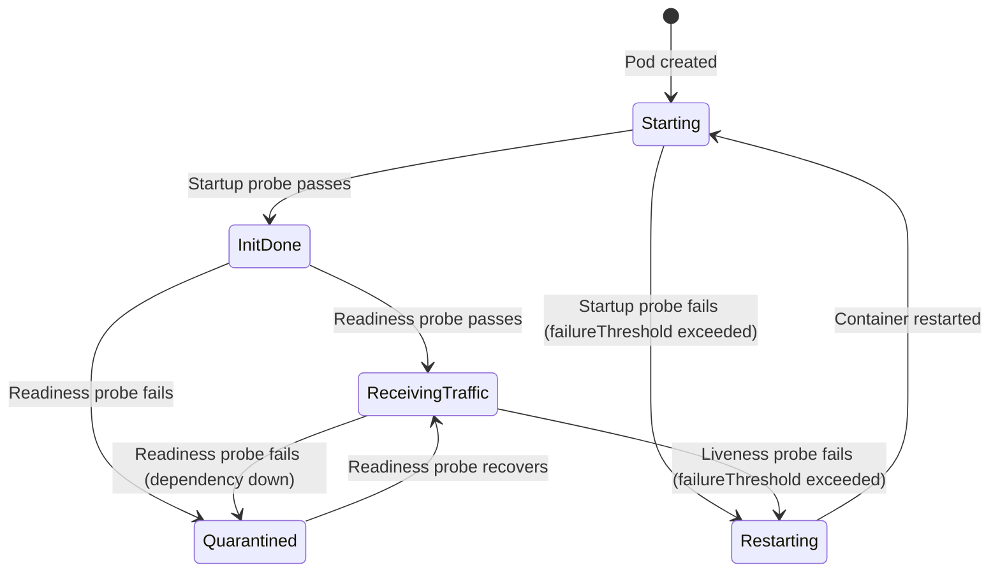

# [BEE-325] Health Checks and Readiness Probes

:::info
Liveness, readiness, and startup probes serve different purposes. Use the wrong probe for the wrong job and you get cascading restarts, dropped traffic, or undetected failures.
:::

## Context

A running process is not the same as a healthy process. A service can be alive — consuming CPU, holding open file descriptors — and still be completely unable to serve requests because its database connection pool is exhausted, its initialization routine never completed, or it has entered a deadlock.

Kubernetes and modern load balancers provide three probe types to distinguish these conditions. The canonical Kubernetes reference is [Liveness, Readiness, and Startup Probes](https://kubernetes.io/docs/concepts/configuration/liveness-readiness-startup-probes/). Google's [Kubernetes best practices: Setting up health checks](https://cloud.google.com/blog/products/containers-kubernetes/kubernetes-best-practices-setting-up-health-checks-with-readiness-and-liveness-probes) explains the intent of each probe type. Microsoft's [Health Endpoint Monitoring pattern](https://learn.microsoft.com/en-us/azure/architecture/patterns/health-endpoint-monitoring) formalizes the broader pattern of exposing functional health checks that external systems can query. The [microservices.io Health Check API pattern](https://microservices.io/patterns/observability/health-check-api.html) captures how this applies at the service level.

## Principle

**Use three separate health endpoints for three separate questions. Liveness checks whether the process is alive and should keep running. Readiness checks whether the process is ready to serve traffic right now. Startup checks whether initialization has completed. Never let liveness check external dependencies.**

## The Three Probe Types

### Liveness Probe

**Question:** Is the process alive and capable of making progress?

If the liveness probe fails, Kubernetes kills the container and starts a new one. Use this only to detect conditions from which the process cannot recover on its own — a deadlock, an infinite loop, an unrecoverable internal error.

The liveness probe must not depend on external systems. If your liveness probe queries a database and the database is down, every pod restarts simultaneously, turning a database outage into a complete service outage. The liveness probe checks the process, not its environment.

**Checks:** Is the process responsive? Is the event loop alive? Is there an internal deadlock?

**Endpoint:** `GET /live` — returns 200 if the process is alive.

### Readiness Probe

**Question:** Can this pod safely receive traffic right now?

If the readiness probe fails, Kubernetes removes the pod from the Service's endpoint list. Traffic stops flowing to that pod. The pod is not restarted — it is simply quarantined until it becomes ready again. This is the right place to check external dependencies: if the database is unreachable, mark the pod unready and stop sending it requests.

**Checks:** Are all required dependencies reachable? Is the connection pool healthy? Has the cache warmed up?

**Endpoint:** `GET /ready` — returns 200 only if all dependencies are reachable and the pod can serve requests.

### Startup Probe

**Question:** Has initialization completed?

Many services take significant time to start: loading configuration, running database migrations, warming caches, compiling routes. If liveness or readiness probes start running before initialization completes, they will fail and trigger unnecessary restarts or route failures.

The startup probe runs first. Until it passes, Kubernetes does not run the liveness or readiness probes. Once it passes, it is done — the startup probe does not run again after a successful check.

**Checks:** Is the application done with its initialization sequence?

**Endpoint:** `GET /health/started` or share `/ready` with a generous `failureThreshold`.

## Pod Lifecycle and Probe Transitions



The key distinction: a readiness failure quarantines the pod but keeps it alive; a liveness failure kills and restarts the container.

## Health Endpoint Design

Expose three endpoints with distinct responsibilities.

### /live — Shallow Check

Returns 200 if the process is alive and can respond to requests. This check should be nearly free — it must not query databases or external services.

```http
GET /live HTTP/1.1
```

```json
HTTP/1.1 200 OK
Content-Type: application/json

{
  "status": "ok"
}
```

Return `503 Service Unavailable` only for genuine process-level failures (unrecoverable internal state).

### /ready — Deep Check

Returns 200 only if all required dependencies are reachable. Returns 503 if any required dependency is down.

```http
GET /ready HTTP/1.1
```

```json
HTTP/1.1 200 OK
Content-Type: application/json

{
  "status": "ok",
  "components": {
    "database": { "status": "ok", "latency_ms": 3 },
    "cache":    { "status": "ok", "latency_ms": 1 }
  }
}
```

When a dependency is down:

```json
HTTP/1.1 503 Service Unavailable
Content-Type: application/json

{
  "status": "degraded",
  "components": {
    "database": { "status": "ok",   "latency_ms": 4 },
    "cache":    { "status": "error", "error": "connection refused" }
  }
}
```

### /health — Optional Aggregate

Some teams expose a single `/health` endpoint for human consumption and monitoring dashboards. This can aggregate both shallow and deep state and include additional diagnostics. It is not used by Kubernetes probes directly — those point at `/live` and `/ready`.

## Shallow vs. Deep Health Checks

| Type    | Scope                        | Used by            | Cost      |
|---------|------------------------------|--------------------|-----------|
| Shallow | Process only                 | Liveness probe     | Near-zero |
| Deep    | Process + all dependencies   | Readiness probe    | Low       |
| Aggregate | All components + metadata  | Dashboards, humans | Variable  |

Deep checks verify connectivity, not correctness. A readiness check for the database should open a connection and run a lightweight ping query (`SELECT 1`), not run a business-logic query. The goal is to detect unreachable dependencies in under 100ms.

## Circuit Breaker Interaction

Health checks and circuit breakers (see [BEE-26](26.md)0) share information about dependency health, but serve different consumers.

When a circuit breaker opens against a dependency, the readiness probe should reflect that state:

```
dependency unreachable
  → circuit breaker opens
  → /ready returns 503
  → pod removed from load balancer
  → no new requests arrive for that dependency
  → circuit breaker has time to recover
  → /ready returns 200 again
  → pod re-enters the load balancer
```

This is the correct loop. It prevents a degraded pod from continuing to receive — and fail — requests while its dependencies are recovering.

Do not couple the liveness probe to the circuit breaker. An open circuit breaker does not mean the process has failed; it means a dependency is down. Restarting the process will not fix the dependency.

## Graceful Shutdown Integration

When Kubernetes sends `SIGTERM`, the pod enters a termination sequence. The readiness probe should immediately begin failing at this point, so the load balancer stops routing new requests to the pod before it closes connections. See [BEE-12002](../resilience/retry-strategies-and-exponential-backoff.md) for the full graceful degradation sequence.

A minimal shutdown hook:

```
SIGTERM received
  → set readiness state to "shutting down"
  → /ready begins returning 503
  → wait for in-flight requests to complete (drain period)
  → close database connections and listeners
  → process exits
```

The `terminationGracePeriodSeconds` in the pod spec must be longer than the drain period. If the grace period expires before draining completes, Kubernetes sends `SIGKILL` and in-flight requests are dropped.

## Load Balancer Health Check Integration

Load balancers outside Kubernetes — ALB, NGINX, HAProxy — also require health check configuration. See [BEE-3002](../networking-fundamentals/dns-resolution.md) for load balancer health check specifics.

Key alignment points:
- The load balancer health check URL should hit `/ready`, not `/live`.
- The interval and timeout settings at the load balancer should be consistent with the Kubernetes probe settings for the same pod.
- The unhealthy threshold (number of consecutive failures before a backend is removed) should account for transient latency spikes to avoid removing healthy backends under load.

## Common Mistakes

**1. Liveness probe checks external dependencies**

This is the most dangerous mistake. If the database goes down, all pods' liveness probes fail, all pods restart simultaneously, and the restart storm may prevent the service from recovering even after the database comes back. Liveness checks the process only.

**2. Health endpoint is too expensive**

If `/ready` runs a complex query against the database on every probe call, it adds load exactly when the database is already struggling. Use a lightweight ping (`SELECT 1`). Consider caching the health result for a short interval (1–2 seconds) so that simultaneous probes from multiple Kubernetes nodes do not trigger simultaneous database round-trips.

**3. No readiness probe configured**

Without a readiness probe, Kubernetes sends traffic to pods immediately after the container starts. If the application takes 10 seconds to initialize, the first 10 seconds of traffic hit an unready process and fail. Always configure a readiness probe.

**4. Same endpoint for liveness and readiness**

Using `/health` for both means either: (a) the probe checks dependencies, which makes it dangerous as a liveness probe; or (b) the probe is shallow, which means readiness never detects dependency failures. They have different semantics and must be separate endpoints.

**5. Health check timeout too short**

Under load, even a healthy database may take 200ms to respond to a ping. If the probe `timeoutSeconds` is set to 1 second but your p99 latency for the health check is 800ms, you will see intermittent false negative failures. Set the timeout to at least 3x the expected p99 latency of the health check under normal load conditions.

**6. Missing startup probe for slow-starting services**

Without a startup probe, liveness probes begin running immediately. If the service takes 30 seconds to initialize, the liveness probe will fail and kill the container before it ever finishes starting. Use a startup probe with a high `failureThreshold` to give slow services the time they need.

## Kubernetes Probe Configuration Reference

```yaml
livenessProbe:
  httpGet:
    path: /live
    port: 8080
  initialDelaySeconds: 10
  periodSeconds: 10
  timeoutSeconds: 5
  failureThreshold: 3

readinessProbe:
  httpGet:
    path: /ready
    port: 8080
  initialDelaySeconds: 5
  periodSeconds: 5
  timeoutSeconds: 5
  failureThreshold: 3

startupProbe:
  httpGet:
    path: /ready
    port: 8080
  failureThreshold: 30   # 30 × 10s = 5 minutes to start
  periodSeconds: 10
```

`failureThreshold × periodSeconds` is the maximum time a probe is allowed to keep failing before action is taken. For startup probes, set this to the worst-case initialization time of the service.

## Related BEPs

- [BEE-3002](../networking-fundamentals/dns-resolution.md) — Load Balancer Health Checks: configuring health check intervals and thresholds at the load balancer level.
- [BEE-12001](../resilience/circuit-breaker-pattern.md) — Circuit Breaker: how open circuits should influence readiness state.
- [BEE-12002](../resilience/retry-strategies-and-exponential-backoff.md) — Graceful Degradation: coordinating SIGTERM handling with readiness probe state during shutdown.

## References

- [Kubernetes — Liveness, Readiness, and Startup Probes](https://kubernetes.io/docs/concepts/configuration/liveness-readiness-startup-probes/)
- [Google Cloud Blog — Kubernetes best practices: Setting up health checks](https://cloud.google.com/blog/products/containers-kubernetes/kubernetes-best-practices-setting-up-health-checks-with-readiness-and-liveness-probes)
- [Microsoft Azure Architecture Center — Health Endpoint Monitoring pattern](https://learn.microsoft.com/en-us/azure/architecture/patterns/health-endpoint-monitoring)
- [microservices.io — Health Check API pattern](https://microservices.io/patterns/observability/health-check-api.html)
- Colin Breck, [Kubernetes Liveness and Readiness Probes: How to Avoid Shooting Yourself in the Foot](https://blog.colinbreck.com/kubernetes-liveness-and-readiness-probes-how-to-avoid-shooting-yourself-in-the-foot/)
