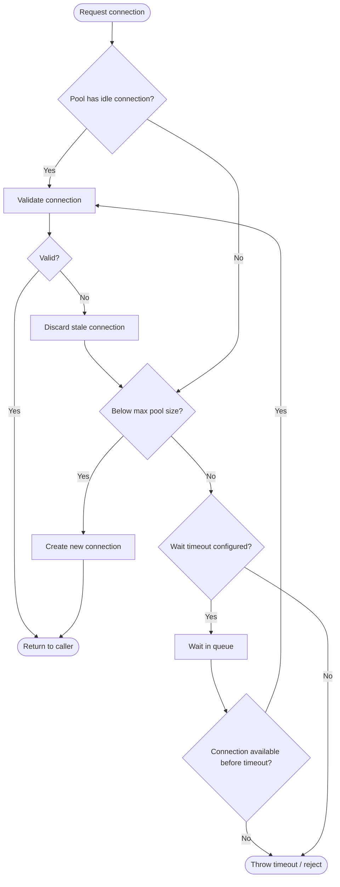

# [BEE-13003] Connection Pooling and Resource Management

:::info
Every connection is a resource. Pool them wisely, or your downstream systems will tell you when you did not.
:::

## Context

Opening a database or network connection is expensive: TCP handshake, TLS negotiation, authentication, and server-side state allocation can together cost tens to hundreds of milliseconds. Connection pools amortize that cost by keeping a set of ready connections and lending them to application threads on demand.

When pools are misconfigured — too large, too small, or leaking — the symptoms appear downstream: timeouts, connection-refused errors, OOM kills, or a cascade of failures across services. Understanding how to size, validate, and monitor pools is a core backend engineering competency.

## Principle

**Right-size every resource pool, account for all replicas, validate connections before use, and always return resources — even in error paths.**

## Connection Pool Lifecycle



The lifecycle has five phases for each connection:

| Phase | Description |
|-------|-------------|
| **Create** | Establish TCP, TLS, authenticate. Done once at pool startup or on demand. |
| **Validate** | Test-query or TCP keepalive check before lending to caller. |
| **Use** | Caller holds the connection and executes work. |
| **Return** | Caller returns connection to pool (in `finally` block or via `try-with-resources`). |
| **Evict** | Pool retires connections exceeding `maxLifetime` or idle too long. |

## Pool Sizing

### The HikariCP Formula

The [HikariCP pool-sizing guide](https://github.com/brettwooldridge/HikariCP/wiki/About-Pool-Sizing) — based on research from the PostgreSQL project and Oracle — gives a practical starting formula:

```
connections = (core_count × 2) + effective_spindle_count
```

For a 4-core server with data primarily on SSD (spindle count ≈ 0–1):

```
connections = (4 × 2) + 1 = 9
```

The key insight: once the thread count exceeds CPU core count, additional threads contend for CPU time. I/O waits (disk, network) create brief windows where another thread can run, which is why a small multiple above core count outperforms a naive "one connection per request thread" model. The Oracle Real-world Performance Group demonstrated that reducing a connection pool from hundreds of connections to ~96 dropped response time from ~100ms to ~2ms — a 50× improvement.

**Practical guidance:**
- Start with the formula result, then load-test and tune.
- Prefer a fixed-size pool (set `minimumIdle = maximumPoolSize` in HikariCP) to avoid the latency spike of connection creation under burst load.
- Always set `maxLifetime` a few seconds shorter than the database's or load balancer's connection timeout.

### The Multi-Replica Problem

Pool size must be calculated across all running replicas, not per pod:

```
Total DB connections = pods × pool_size_per_pod
```

**Example — the problem:**

```
20 pods × pool size 10 = 200 connections to the database
Database max_connections = 100
```

The database is oversubscribed by 2×. Under full load, every pod fights for the same 100 connections. The database starts refusing new connections; application pods see `FATAL: remaining connection slots are reserved` or timeout errors.

**The fix: calculate backwards from the DB limit.**

```
Headroom: keep 10% for admin/monitoring = 90 usable connections
Pool size per pod = floor(90 / 20) = 4
```

If that leaves individual pods starved (each query queues deeply), the answer is not a larger pool — it is an external connection pooler.

### External Poolers (PgBouncer)

When the pod count is high or variable (auto-scaling), sidecar or shared external poolers like [PgBouncer](https://www.pgbouncer.org/config.html) decouple application concurrency from database connection count:

```
20 pods × 50 client connections to PgBouncer
PgBouncer → 20 server connections to Postgres
```

PgBouncer in **transaction mode** multiplexes many client connections over a small server connection pool. The database sees only PgBouncer's `default_pool_size` connections. Key parameters:

| Parameter | Purpose |
|-----------|---------|
| `max_client_conn` | Maximum frontend (app-to-PgBouncer) connections |
| `default_pool_size` | Server connections per (user, database) pair |
| `reserve_pool_size` | Extra server connections for burst |

:::warning
PgBouncer transaction mode breaks prepared statements and advisory locks. Verify application compatibility before switching.
:::

## Thread Pools

Thread pools follow the same resource-bounding logic. The difference is that threads are purely CPU/memory resources, while connection pools gate access to external systems.

Sizing guidelines:

- **CPU-bound work**: pool size ≈ available CPU cores.
- **I/O-bound work** (most backend services): pool size ≈ `core_count × (1 + wait_time / compute_time)`. For a workload spending 90% of time waiting on I/O, pool size ≈ 10 × cores.
- Unbounded thread pools (`Executors.newCachedThreadPool()` in Java, default goroutine spawning) are dangerous for bursty workloads: they can create thousands of threads under load, causing OOM or scheduler thrashing.

See [BEE-11005](../concurrency/producer-consumer-and-worker-pool-patterns.md) for worker and thread pool design specifics.

## File Descriptor Limits

Every open socket, file, or pipe consumes a file descriptor (FD). High-connection services — proxies, API gateways, websocket servers — can exhaust the OS default limits quickly.

Linux defaults (commonly):
- Per-process soft limit (`ulimit -n`): **1024**
- Per-process hard limit: **4096** or **65536** (varies by distro)
- System-wide (`fs.file-max`): typically millions, rarely the bottleneck

For a service holding 10,000 concurrent connections, the default soft limit of 1024 is inadequate. Symptoms: `Too many open files` errors, new connections refused even when the pool has capacity.

**Configuration approaches:**

```bash
# Temporary (current session only)
ulimit -n 65535

# Permanent — /etc/security/limits.conf
* soft nofile 65535
* hard nofile 65535

# systemd service unit
[Service]
LimitNOFILE=65535
```

For containerized services, set the limit in the container spec:

```yaml
# Kubernetes pod spec
securityContext: {}
resources:
  limits:
    memory: "512Mi"
# File descriptor limits via securityContext or ulimits are set at the container runtime level
# (Docker: --ulimit nofile=65535:65535)
```

A practical formula for estimating the required FD count:

```
required_fds = max_connections + open_files + sockets_in_use + headroom
```

Where `headroom` is typically 20–25% above the calculated peak.

## Memory Budgeting

Each idle connection in a pool consumes memory on both the application side and the database server side:

- **PostgreSQL**: ~5–10 MB per backend process (depends on work_mem, shared buffers)
- **MySQL/MariaDB**: lower per-connection overhead, but still meaningful at scale
- **Application side**: HikariCP reserves a connection object + I/O buffers per slot

For 200 Postgres connections, expect 1–2 GB of database server memory just for the connection processes, before any query work memory is allocated.

**Budget rule of thumb**: `total_pool_memory = pool_size × per_connection_memory × replica_count`. Include this in capacity planning for both the database server and the application pods.

## Resource Exhaustion Symptoms

| Symptom | Likely Cause |
|---------|--------------|
| `Connection refused` | Pool exhausted, new connections rejected; or DB `max_connections` exceeded |
| `Connection timeout` / pool acquisition timeout | Pool exhausted, threads queuing longer than `connectionTimeout` |
| `OOM kill` | Pool too large (memory per connection × pool size exceeds container limit) |
| `Too many open files` | File descriptor limit hit |
| Slow queries despite idle DB | Stale/broken connections being used without validation |
| Connections climbing indefinitely | Connection leak — not returned in error paths |

## Connection Leak Detection

A connection leak occurs when application code acquires a connection from the pool and does not return it — typically in an error path that bypasses the `finally` block or `try-with-resources` cleanup.

**Detection mechanisms:**

1. **HikariCP `leakDetectionThreshold`**: log a warning when a connection is held longer than the threshold. Set to 2–5 seconds for most OLTP workloads.
2. **Pool metric: `active` connections increasing monotonically** while throughput is flat — a strong leak signal.
3. **Database-side**: `pg_stat_activity` showing connections in `idle in transaction` for extended periods.

**Prevention pattern (Java):**

```java
// Always use try-with-resources — connection is returned even on exception
try (Connection conn = dataSource.getConnection()) {
    // use conn
}
```

## Idle Connection Management

Idle connections hold resources on both sides. Strategies:

- Set `idleTimeout` (HikariCP default: 10 minutes) to evict connections idle beyond the threshold.
- Set `maxLifetime` (HikariCP default: 30 minutes) to recycle connections before the database or network proxy forces them closed. This prevents the "stale connection" failure mode where a mid-flight query hits an already-closed socket.
- Database-side: `tcp_keepalives_idle` / `tcp_keepalives_interval` can reclaim dead connections even if the pool does not.
- For HTTP and gRPC connection pools, configure `keepAliveTime` and idle eviction symmetrically with upstream proxy/load balancer timeouts.

## Resource Limits in Containerized Environments

Containers run within cgroups, which impose memory and CPU limits independent of the OS-level settings. Key interactions:

- **CPU throttling**: if a pod has a low CPU limit (e.g., 250m = 0.25 cores), the HikariCP formula result should be based on the cgroup CPU quota, not the node's physical core count.
- **Memory limits**: include per-connection memory overhead in the container memory request/limit. A pool of 20 connections each using 2 MB buffers adds 40 MB to the pod's baseline footprint.
- **Ephemeral connection exhaustion**: in Kubernetes with HPA, new pods start with empty pools. During scale-up, the momentary connection surge to the database can exceed `max_connections`. Mitigate with startup probes that delay readiness until the pool is initialized, and pre-warm with `minimumIdle`.

## Monitoring Resource Utilization

Key metrics to emit for every pool:

| Metric | Alert threshold |
|--------|----------------|
| `pool.active` (connections in use) | > 80% of `maximumPoolSize` |
| `pool.pending` (threads waiting for connection) | > 0 for sustained periods |
| `pool.acquisition_time_ms` | > configured `connectionTimeout` × 50% |
| `pool.creation_errors_total` | Any non-zero rate |
| `fd_open_count` | > 80% of `LimitNOFILE` |
| `db.max_connections_used` | > 80% of `max_connections` |

Use a dashboard that shows `pool.active / maximumPoolSize` per pod. A flat line at 100% means the pool is the bottleneck; a flat line near 0% with high latency means downstream is the bottleneck.

## Common Mistakes

1. **Pool too large**: More connections do not mean more throughput. They mean more contention at the database, more memory on both sides, and slower queries for everyone. Start small and measure.

2. **No connection validation**: Using stale connections without a `testQuery` or `keepaliveTime` check causes cryptic errors when a firewall or proxy silently closes idle connections.

3. **Connection leak in error paths**: Code that returns the connection only on the happy path leaks connections on every exception. Use `try-with-resources` or equivalents unconditionally.

4. **Not accounting for replicas**: A pool size that looks reasonable for one pod becomes catastrophic when multiplied by 50 auto-scaled replicas. Always calculate `total_connections = pool_size × max_replicas` before deploying.

5. **Default FD limit too low**: New services often run fine under light load and fail mysteriously at scale because nobody raised `LimitNOFILE`. Add it to the deployment manifest at service creation time.

## Related BEPs

- [BEE-6006](../data-storage/connection-pooling-and-query-optimization.md) — Database-specific pooling and query optimization
- [BEE-11005](../concurrency/producer-consumer-and-worker-pool-patterns.md) — Worker and thread pool design
- [BEE-12003](../resilience/timeouts-and-deadlines.md) — Timeout configuration, including pool acquisition timeouts

## References

- [HikariCP: About Pool Sizing](https://github.com/brettwooldridge/HikariCP/wiki/About-Pool-Sizing)
- [Vlad Mihalcea: The best way to determine the optimal connection pool size](https://vladmihalcea.com/optimal-connection-pool-size/)
- [PgBouncer Configuration Reference](https://www.pgbouncer.org/config.html)
- [Microsoft Azure: Connection pooling best practices for PostgreSQL](https://learn.microsoft.com/en-us/azure/postgresql/connectivity/concepts-connection-pooling-best-practices)
- [Linux file descriptor limits — nixCraft](https://www.cyberciti.biz/faq/linux-increase-the-maximum-number-of-open-files/)
- [Baeldung: Limits on the Number of Linux File Descriptors](https://www.baeldung.com/linux/limit-file-descriptors)
