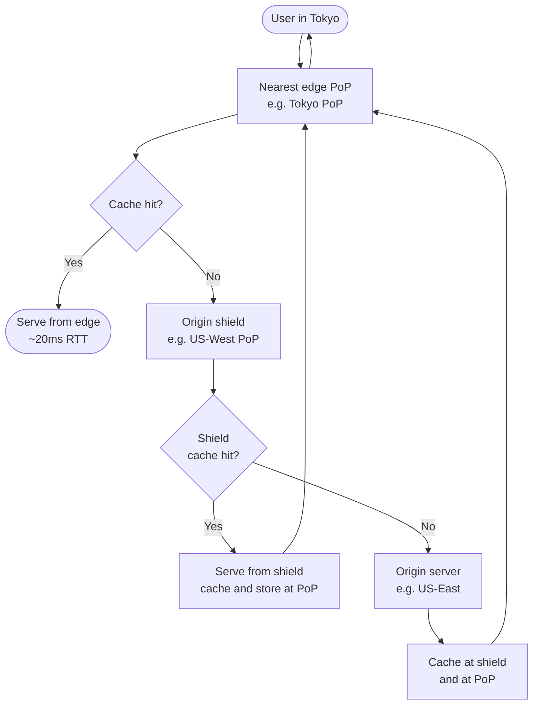

# [BEE-13005] Content Delivery and Edge Computing

:::info
Push content and computation to the edge. Reduce round-trip distance. Serve from cache wherever possible.
:::

## Context

A backend service running in a single region imposes a fixed latency floor on every user who is geographically distant from that region. A request from Tokyo to a US-East origin server crosses roughly 11,000 km. Even at the speed of light, that round trip takes at least 70 ms of pure propagation delay before a single byte of application logic runs. In practice, with TLS handshakes, queuing, and TCP slow start, a cold request from Asia to a US origin routinely takes 200–400 ms.

Content Delivery Networks (CDNs) exist to solve this problem for cacheable content. Edge computing extends the idea further: instead of merely caching responses, you can run application logic at the edge node closest to the user. Both techniques move work toward the user and away from a centralized origin.

This principle covers how CDNs work, when they help, where they fall short, and how edge compute extends their capabilities for dynamic workloads.

## Principle

**Serve content from the network location closest to the user. Cache aggressively at the edge, and run logic at the edge only when the round-trip cost to origin is prohibitive.**

## Key Concepts

### CDN Architecture: Origin → Edge PoP → User

A CDN is a geographically distributed network of caching servers. The fundamental components are:

| Component | Role |
|---|---|
| **Origin server** | The authoritative source of truth. All content originates here. |
| **Edge PoP (Point of Presence)** | A data center housing CDN edge servers, placed near end-user populations. A major CDN has hundreds of PoPs globally. |
| **Edge server** | A caching server inside a PoP. Handles user requests; serves from cache on a hit; fetches from origin (or origin shield) on a miss. |
| **Origin shield** | An optional intermediate caching tier between edge PoPs and the origin. Consolidates cache misses from many PoPs into a single upstream request. |

DNS-based routing directs each user's request to the geographically closest PoP. The edge server at that PoP either serves the cached response directly (cache hit) or forwards the request upstream to get a fresh copy (cache miss).

### Cache Hit and Cache Miss

**Cache hit**: The edge server has a valid cached copy of the requested resource. It is served immediately without touching the origin. Latency is dominated by the user–PoP distance, not the user–origin distance.

**Cache miss**: The edge server has no valid copy. It fetches from the origin shield (if configured) or directly from the origin, stores the response, and then serves it. The first request from any PoP is always a miss; subsequent requests from the same PoP are hits.

A well-configured CDN for static content achieves a **cache hit ratio of 95–99%**. This means fewer than 5% of requests reach the origin, dramatically reducing origin load and egress costs.

Cache lifetime is controlled by `Cache-Control` headers set on the origin response. A `max-age=86400` tells the CDN (and the user's browser) to treat the response as fresh for 24 hours.

### Origin Shielding

Without origin shielding, a cache miss at any PoP generates a direct request to the origin. If your CDN has 200 PoPs and a new piece of content is published, up to 200 separate cache-fill requests can hit the origin in a short window — the "thundering herd" at cache population time.

**Origin shielding** inserts a designated intermediate node between the PoP tier and the origin. Cache misses from all PoPs are routed through this single shield node. If the shield has the content, it serves it; otherwise only one request reaches the origin. This reduces origin load by a factor proportional to the number of PoPs.

Cloudflare calls this feature **Tiered Cache** and **Smart Shield**. AWS CloudFront calls it **Origin Shield**. The principle is the same across providers.

### CDN for Dynamic Content and API Acceleration

CDNs are most obviously useful for static assets (images, CSS, JS bundles, videos), but they also benefit dynamic content:

- **Short-lived caching**: An API response that is the same for all users for 5 seconds can be cached at the edge with `Cache-Control: public, max-age=5`. At 10,000 requests per second, this reduces origin calls by orders of magnitude.
- **Connection reuse**: CDNs maintain persistent, pre-warmed TCP and TLS connections to the origin. Users connect to the nearest PoP (low latency TLS handshake), and the CDN reuses its long-lived connection to the origin. This eliminates TLS setup cost from the user's perspective.
- **Protocol upgrade**: Many CDNs accept HTTP/1.1 from legacy clients and forward requests to the origin over HTTP/2 or HTTP/3, improving multiplexing and header compression on the origin leg.
- **Compression and image optimization**: Some CDN platforms apply Brotli compression or image format conversion (WebP, AVIF) at the edge, offloading that CPU work from the origin.

### CDN and TLS Termination

When a CDN is in front of your origin, TLS is terminated at the edge PoP. The user's TLS handshake completes with the nearest PoP (typically < 20 ms), not with the origin (potentially 200 ms+ away). The CDN then connects to the origin over a separate TLS session, often over a pre-established connection.

This means:
- Users always get a fast TLS handshake regardless of origin location.
- The CDN's TLS certificate is presented to users. Ensure the CDN-to-origin connection is also encrypted (do not terminate TLS at the PoP and forward plaintext to origin).
- Certificate rotation and cipher suite management happen at the CDN layer.

### Edge Computing: Logic at the Edge

Edge computing extends the CDN model from "store and serve" to "compute and respond." Instead of just returning a cached file, an edge compute platform lets you run code at the PoP.

| Capability | CDN (cache only) | Edge compute |
|---|---|---|
| Serve static files | Yes | Yes |
| Short-lived response caching | Yes | Yes |
| A/B testing / request routing | Limited | Yes (run routing logic at edge) |
| JWT validation / auth | No | Yes (validate token without origin round trip) |
| Personalized responses | No | Yes (generate at edge based on user attributes) |
| Real-time data aggregation | No | Yes (stateful edge workers) |

Examples: Cloudflare Workers, AWS Lambda@Edge, Fastly Compute@Edge. Cold start latency for edge workers is typically under 5 ms because the runtime (V8 isolates, Wasm) is already warm at every PoP.

### Cache Invalidation and Purging

Caching at the CDN introduces the problem of stale content. When you deploy a new version of a file, existing CDN caches may serve the old version until the `max-age` expires.

Strategies to handle this:

1. **Cache-busting via versioned URLs**: Embed a content hash or build version in the URL (e.g., `app.v3f2a.js`). The URL changes on every deploy, so the CDN treats it as new content. The old URL's cache expires naturally. This is the preferred approach for static assets.

2. **Short TTL for mutable resources**: For content that changes on a schedule (e.g., news feeds), set a TTL that matches the acceptable staleness window. `max-age=60` means at most 60 seconds of stale content.

3. **CDN purge API**: All major CDNs provide an API to explicitly invalidate cached objects by URL, prefix, or tag. Use this after a deployment for content that cannot use versioned URLs (e.g., HTML pages). Purge operations propagate to all PoPs within seconds.

4. **Surrogate keys / cache tags**: Tag groups of cached responses (e.g., all responses related to a product ID). When that product changes, issue a single purge by tag to invalidate all related cached responses across all PoPs simultaneously.

### Multi-CDN Strategy

Relying on a single CDN creates a vendor availability dependency. A CDN outage or degradation can take down your entire user-facing service. Multi-CDN addresses this:

- Maintain contracts with two or more CDN providers.
- Use DNS-based traffic management (e.g., Route 53 health checks, NS1) or a CDN orchestration layer to route traffic to the best-performing or most available CDN in real time.
- Monitor cache hit ratio, error rate, and TTFB (time to first byte) per CDN. Failover automatically when one degrades.

Multi-CDN adds operational complexity. It is most justified for services with global audiences and strict availability SLOs (> 99.99%).

## CDN Request Flow

## Worked Example: Static Site with Global Users

**Scenario:** A documentation site hosted on a single US-East origin server. Static assets (HTML, CSS, JS) are served globally.

### Without CDN

Every request travels to the US-East origin regardless of user location.

| User location | Round-trip latency | Notes |
|---|---|---|
| New York | ~30 ms | Close to origin |
| London | ~90 ms | Transatlantic |
| Tokyo | ~180–220 ms | Transpacific |
| Sydney | ~200–250 ms | Transpacific + routing |

At 10,000 daily unique visitors, 70% outside North America → roughly 7,000 requests/day with elevated latency. Each page load triggers 20–30 sub-resource requests. Total round trips to origin: 210,000+/day.

### With CDN (cache hit ratio 97%)

CDN PoPs in Tokyo, Sydney, Frankfurt, Singapore, etc. serve cached responses.

| User location | CDN PoP | Round-trip latency | Notes |
|---|---|---|---|
| New York | Newark PoP | ~8 ms | Served from edge |
| London | London PoP | ~10 ms | Served from edge |
| Tokyo | Tokyo PoP | ~12 ms | Served from edge |
| Sydney | Sydney PoP | ~15 ms | Served from edge |

**Latency math:**
- Tokyo without CDN: 200 ms × 30 sub-resources = 6,000 ms total blocking time per page
- Tokyo with CDN: 12 ms × 30 sub-resources = 360 ms total blocking time per page
- **Improvement: ~16× faster page load for Asian users**

**Origin load reduction:**
- 210,000 requests/day × 3% cache miss = 6,300 requests reach origin (down from 210,000)
- Origin egress cost drops proportionally

## Common Mistakes

1. **Caching personalized or private content at the CDN** — If a response contains user-specific data (account info, session tokens, payment details) and is cached without `Cache-Control: private`, the CDN may serve one user's private data to another user. Always set `Cache-Control: private, no-store` for authenticated or personalized responses, and `Vary: Cookie` or `Vary: Authorization` when the response differs per user.

2. **No cache invalidation strategy** — Deploying updated content without versioned URLs or a purge strategy means users receive stale files until TTL expiry. Static assets must use content-hashed filenames; HTML pages require purge-on-deploy.

3. **CDN for every endpoint regardless of cacheability** — Routing uncacheable, highly dynamic API calls through a CDN adds latency (an extra network hop) without any caching benefit and increases cost. Identify which endpoints produce cacheable responses and only route those through CDN caching. Pass-through (proxy) mode can still offer connection reuse and TLS acceleration benefits for dynamic endpoints, but do not pay for CDN cache storage on content with `Cache-Control: no-store`.

4. **Not setting proper Cache-Control headers** — Without explicit `Cache-Control` headers, CDN behavior is undefined. Some CDNs cache aggressively by default (treating the absence of `no-cache` as permission to cache). Others refuse to cache. Always set explicit `Cache-Control` headers on every response: `public, max-age=N` for cacheable content, `private, no-store` for sensitive content.

5. **Single CDN without failover** — A CDN is now a critical component of your infrastructure. A single-CDN architecture means a CDN outage takes down your site. Implement health monitoring, consider multi-CDN for high-availability requirements, and ensure your origin can handle full traffic load if the CDN is bypassed.

## Related BEPs

- [BEE-3006](../networking-fundamentals/proxies-and-reverse-proxies.md) — Reverse proxy patterns
- [BEE-9001](../caching/caching-fundamentals-and-cache-hierarchy.md) — Caching principles
- [BEE-9006](../caching/http-caching-and-conditional-requests.md) — HTTP caching headers
- [BEE-13002](horizontal-vs-vertical-scaling.md) — Horizontal and vertical scaling

## References

- Cloudflare, [Content Delivery Network (CDN) Reference Architecture](https://developers.cloudflare.com/reference-architecture/architectures/cdn/)
- Cloudflare, [What is a CDN edge server?](https://www.cloudflare.com/learning/cdn/glossary/edge-server/)
- Cloudflare, [Smart Shield — Origin shielding](https://www.cloudflare.com/application-services/products/smart-shield/)
- Bunny.net, [What Is CDN Caching and Cache HIT Ratio?](https://bunny.net/academy/cdn/what-is-cdn-caching-and-cache-hit-ratio/)
- Fastly, [Serving Dynamic Content with a Modern CDN](https://www.fastly.com/blog/serving-truly-dynamic-content-with-a-modern-cdn-and-edge-first-delivery)
- Gcore, [CDN Evolution: From Static Content to Edge Computing](https://gcore.com/blog/cdn-evolution)
- Wikipedia, [Content delivery network](https://en.wikipedia.org/wiki/Content_delivery_network)
