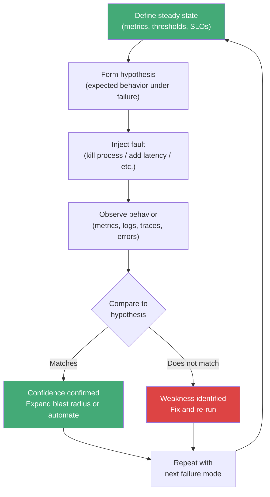

# [BEE-12006] Chaos Engineering Principles

:::info
Proactive fault injection to build confidence in system resilience. Define steady state, form a hypothesis, inject failure, observe the system, and act on what you learn.
:::

## Context

Distributed systems fail in ways that are difficult to anticipate. A network partition between two data centers, a slow database replica, a third-party dependency that starts returning 500s — none of these appear in unit tests, and most do not appear until the system is under production load with real users. Teams that discover these failure modes for the first time during a production incident are unprepared: they have not rehearsed the failure, they do not know the system's blast radius, and they have not verified that monitoring surfaces the right signals.

The traditional response is to write more tests and add more alerting. Both are necessary but insufficient. Tests verify behavior under known conditions; production fails under unknown ones. Alerting tells you when something has already gone wrong.

**Chaos engineering** is the discipline of proactively injecting controlled failures into a system to build empirical confidence in its resilience before a real incident occurs. Rather than hoping the system can survive a replica failure, a chaos experiment proves it can — or reveals that it cannot, in a controlled context where the blast radius is bounded and engineers are present to observe and respond.

The term was formalized by Netflix after they moved to AWS in 2010 and needed to validate that their system could survive the infrastructure failures that AWS routinely experiences at scale. Their tool, [Chaos Monkey](https://netflix.github.io/chaosmonkey/), randomly terminates EC2 instances in production to ensure that every service is designed to survive instance loss. Chaos Monkey became part of a larger suite called the Simian Army. The principles underlying this work were later codified at [principlesofchaos.org](https://principlesofchaos.org/).

Gremlin, a commercial chaos engineering platform, describes the discipline as "a disciplined approach of identifying potential failures before they become outages" through controlled fault injection and system observation. The vaccine analogy is apt: you introduce a weakened form of failure so the system — and the team operating it — develops immunity.

## Principle

**Before production tells you your system is fragile, chaos engineering tells you first. Define what normal looks like, hypothesize how the system should behave under failure, inject that failure deliberately, observe what actually happens, and fix the gap between hypothesis and reality.**

## The Four Core Principles

From [principlesofchaos.org](https://principlesofchaos.org/):

### 1. Build a Hypothesis Around Steady-State Behavior

The experiment starts with a definition of "normal." Steady state is not the absence of errors — it is a measurable, observable output that indicates the system is serving its purpose: request success rate above 99.9%, p99 latency under 200ms, order processing throughput above 500/minute. You are not measuring whether internal components are healthy; you are measuring whether the system is delivering value to users.

Without a steady-state definition, there is no experiment — there is only random destruction. You cannot tell whether injecting a fault caused a problem if you have not defined what "no problem" looks like.

### 2. Vary Real-World Events

Chaos experiments should simulate failures that actually happen in production. Not theoretically possible failures — statistically likely ones. Prioritize events by impact and frequency:

- Infrastructure: instance termination, availability zone failure, container OOM kill
- Network: latency injection (50ms, 200ms, 1000ms), packet loss, connection drop, DNS failure
- Application: process kill, thread exhaustion, dependency timeout, return of corrupt data
- Resource: CPU saturation, disk full, memory pressure, file descriptor exhaustion
- Time: clock skew between nodes (breaks distributed consensus and JWT validation)

Start with the failures you have actually experienced. If your post-mortem history shows three database failover incidents in the last year, that is the first experiment to design.

### 3. Run Experiments in Production

A chaos experiment run only in staging or QA has limited value. Staging traffic is synthetic; production traffic is real. Production has state that staging does not: hot caches, live connections, real user sessions, deployment configurations that diverged from staging last quarter. The failure modes that matter are the ones that emerge under real conditions.

This does not mean running chaos experiments recklessly. Start with a controlled blast radius. Identify which small percentage of production traffic or which non-critical environment (a single region, a canary deployment, a specific tenant) can absorb the experiment. Expand gradually as confidence grows.

### 4. Automate Experiments to Run Continuously

Manual chaos experiments degrade into quarterly game days that produce diminishing returns. Systems change — new services are added, dependencies change, configurations drift. An experiment that proved resilience in January may not reflect the system's current topology in July.

Automate experiments to run on a schedule. Netflix runs Chaos Monkey continuously in production. The discipline moves from "we ran a chaos day" to "the system is continuously validated." When an automated experiment fails, it surfaces a regression before it becomes a production incident.

## Steady-State Hypothesis

The steady-state hypothesis is the core artifact of a chaos experiment. It must be written before the experiment runs, not inferred after.

A well-formed hypothesis has three parts:

1. **The normal measurement**: "Under normal conditions, the p99 read latency to the user profile service is under 80ms and the success rate is above 99.95%."
2. **The injected condition**: "One of three database read replicas is terminated."
3. **The expected behavior**: "Read traffic redistributes to the remaining two replicas within 5 seconds. Latency spikes briefly but returns below 80ms within 30 seconds. No errors are surfaced to API callers during or after failover."

If the observed behavior matches the hypothesis, the experiment increases your confidence in the system. If it does not — if latency stays elevated, errors appear, or failover takes 90 seconds instead of 5 — the experiment reveals a real weakness that should be fixed before production fails for real.

## Blast Radius Control

Blast radius is the scope of impact a chaos experiment can have if things go worse than expected. Controlling it is the practice that makes chaos engineering safe enough to run in production.

| Stage | Blast radius | When to use |
|---|---|---|
| Sandbox | Isolated test environment, no real traffic | Learning the tool, first experiments |
| Canary | 1–5% of production traffic, single instance | First production experiments |
| Region | One availability zone or region | After canary experiments are stable |
| Full production | All traffic, all regions | Only for mature, automated experiments |

Start at the smallest blast radius that produces a meaningful signal. Expand only when:

- The experiment has run cleanly at the current scope multiple times
- Monitoring is confirmed to capture the failure mode being tested
- A rollback or abort mechanism is in place and tested

The abort mechanism is not optional. Every chaos experiment needs a stop condition: an observable signal (error rate exceeds 1%, p99 latency exceeds 500ms) that automatically halts the experiment before it becomes a real incident.

## Types of Fault Injection

### Process-Level

- **Kill process**: SIGKILL or SIGTERM sent to a service process or container
- **CPU stress**: Consume 80–100% of CPU on a node to simulate a runaway process
- **Memory pressure**: Allocate memory until OOM kill triggers or the host starts swapping

### Network-Level

- **Latency injection**: Add artificial delay to network calls (tc netem, Toxiproxy)
- **Packet loss**: Drop a percentage of packets on a network interface
- **Bandwidth throttling**: Limit throughput to simulate a saturated link
- **DNS failure**: Return NXDOMAIN for service discovery lookups

### Dependency-Level

- **Dependency timeout**: Cause a downstream service to respond slowly or not at all
- **Dependency error**: Cause a downstream service to return 500 responses
- **Corrupt data**: Return syntactically valid but semantically incorrect responses

### Infrastructure-Level

- **Disk full**: Fill available disk space to trigger log rotation failures, write errors
- **Clock skew**: Advance or retard system clock to break distributed locking, token expiry, or leader election
- **Instance termination**: Remove a VM or container from the pool without draining connections

## The Chaos Engineering Cycle

The loop is not a one-time exercise. Each iteration either confirms confidence or reveals a weakness. Either outcome is valuable.

## Game Days

A game day is a planned, facilitated chaos exercise where a cross-functional team — engineers, SREs, product managers — participates in injecting failures and observing the system together. Game days serve a different purpose than automated experiments:

- **Team learning**: On-call engineers rehearse failure scenarios they have never seen in production
- **Process validation**: Runbooks, escalation paths, and incident response procedures are tested under realistic conditions
- **Communication**: Product and engineering align on what degradation is acceptable and what constitutes an incident
- **Complex scenarios**: Multi-service failure scenarios that are difficult to automate (e.g., a cascading failure across three services) can be orchestrated with human coordination

Game days are not a substitute for automated experiments, and automated experiments are not a substitute for game days. Start with game days to build team familiarity, then automate the experiments that game days reveal are most valuable to run continuously.

## Chaos Engineering Maturity Model

| Level | Description | Characteristics |
|---|---|---|
| 0 — Ad-hoc | No structured chaos practice | Failures discovered in production incidents only |
| 1 — Manual | Occasional manual experiments | Game days, manual fault injection, limited documentation |
| 2 — Defined | Repeatable experiment process | Steady-state hypothesis documented, blast radius controlled, results recorded |
| 3 — Automated | Experiments run on schedule | CI/CD integration, automated steady-state monitoring, experiment library |
| 4 — Continuous | Chaos as part of normal operations | Production chaos always-on, regression detection, integrated with SLO monitoring |

Most teams begin at Level 1 and should target Level 3 within 12–18 months of starting. Level 4 is appropriate for mature platform teams with strong SLO practices (BEE-14002).

## Worked Example

**Hypothesis**: "If one of three PostgreSQL read replicas is terminated, read traffic shifts to the remaining replicas within 5 seconds. During failover, read latency increases but stays below 150ms p99. Error rate to API callers remains below 0.1%."

**Experiment setup**:
- Blast radius: one database replica in a non-production region serving 10% of read traffic
- Monitoring: Datadog dashboard open for p99 latency, error rate, replica connection count
- Stop condition: error rate > 1% triggers automatic experiment abort
- Participants: two engineers observing, one with access to abort

**Execution**: Terminate replica-3 via the cloud console at 14:02:00.

**Observations**:
- 14:02:01 — Replica-3 removed from connection pool by PgBouncer health check
- 14:02:03 — p99 read latency spikes to 210ms (above hypothesis threshold of 150ms)
- 14:02:08 — p99 latency returns to 65ms as connections redistribute
- 14:02:00 – 14:02:15 — Error rate: 0.04% (within hypothesis threshold)
- No errors surfaced to API callers

**Findings**: Failover completed within 8 seconds (hypothesis said 5 seconds). Latency spike exceeded the 150ms hypothesis threshold. The system recovered cleanly but the latency SLO was briefly violated. Action: investigate whether connection pool drain time can be reduced and update the hypothesis to reflect the observed 8-second failover window.

**Outcome**: System passed on error rate; failed on latency threshold. Weakness identified (connection pool drain speed), fix scheduled. Hypothesis updated and experiment promoted to automated weekly run.

## Common Mistakes

### 1. Production chaos without blast radius controls

Running experiments against all production traffic on the first attempt. Chaos engineering is safe when scope is controlled. Start with a single instance, a canary deployment, or a low-traffic time window. Establish stop conditions before running. Expand only with evidence.

### 2. No steady-state definition

Injecting failure without first defining what "healthy" means produces noise, not signal. If you cannot describe the expected behavior quantitatively before the experiment, you cannot evaluate the result objectively. Define steady state first, always.

### 3. Chaos without monitoring

Injecting faults when your monitoring cannot observe their effects is worse than no chaos engineering — it gives false confidence. Before running any experiment, verify that your dashboards, alerts, and tracing can capture the specific failure mode you are injecting. If a disk fills and no alert fires, that is a monitoring gap that needs to be fixed first.

### 4. Jumping to automated chaos before game days

Automated chaos without human understanding of failure modes produces outages, not learning. Run game days first. Build the team's intuition about how failures propagate. Document what you observe. Automate the experiments that the team understands well enough to evaluate automatically.

### 5. Not fixing what chaos reveals

Chaos experiments that identify weaknesses and produce no action items are theater. The value of chaos engineering is in the feedback loop: experiment reveals weakness, weakness is fixed, experiment re-run to confirm fix, experiment promoted to automated suite. If experiments are run and findings are not acted on, the practice loses credibility and the team loses motivation to continue.

## Related BEPs

- [BEE-12001](circuit-breaker-pattern.md) (Circuit Breaker Pattern) — circuit breakers are validated by chaos experiments that kill a downstream dependency; does the breaker open? Does traffic shift to the fallback?
- [BEE-12002](retry-strategies-and-exponential-backoff.md) (Graceful Degradation) — degradation fallbacks need to be tested; chaos experiments confirm that fallback paths activate correctly when a dependency fails
- [BEE-14002](../observability/structured-logging.md) (SLO-Based Alerting) — SLOs provide the quantitative steady-state definition that makes chaos hypotheses precise; error budgets define the acceptable cost of running experiments in production

## References

- Principles of Chaos Engineering, *principlesofchaos.org*, https://principlesofchaos.org/
- Netflix, *Chaos Monkey*, https://netflix.github.io/chaosmonkey/
- Gremlin, *Chaos Engineering Guide*, https://www.gremlin.com/chaos-engineering/
- Casey Rosenthal and Nora Jones, *Chaos Engineering: System Resiliency in Practice*, O'Reilly Media (2020)
- Netflix Technology Blog, *5 Lessons We've Learned Using AWS*, netflixtechblog.com/5-lessons-weve-learned-using-aws-1f2a28588e4c
