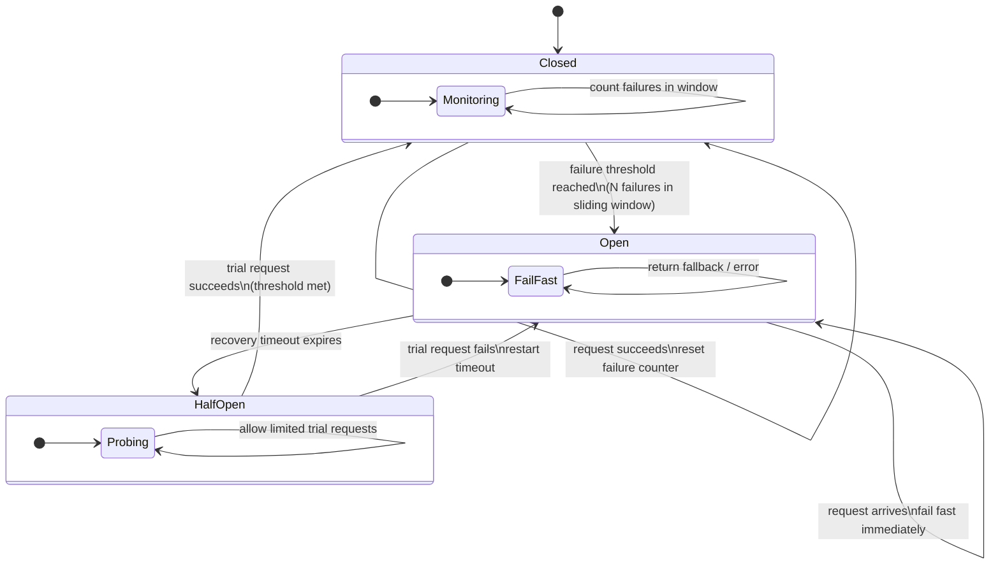

# [BEE-260] Circuit Breaker Pattern

:::info
Detect failures early, open the circuit to fail fast, and allow controlled recovery through the half-open state.
:::

## Context

Distributed systems depend on network calls to reach other services and resources. These remote calls can fail in many ways: timeouts, connection refused, HTTP 500 responses, or the downstream service simply crashing. Most of the time, failures are transient and a retry resolves them.

But some failures are not transient. A downstream service may be overloaded, stuck in a crash loop, or waiting on a database that is down. When callers keep sending requests into a service that cannot handle them, two bad things happen in parallel:

1. The downstream service never gets breathing room to recover.
2. The upstream service accumulates blocked threads and exhausted connection pools, eventually failing itself.

This is **cascading failure** — a problem in one service propagates outward until the entire call graph degrades.

The Circuit Breaker pattern, popularized by Michael Nygard in *Release It!* (Pragmatic Programmers, 2018) and described in detail by Martin Fowler ([martinfowler.com/bliki/CircuitBreaker.html](https://martinfowler.com/bliki/CircuitBreaker.html)), addresses this by wrapping remote calls in a state machine that detects sustained failures and stops making those calls until the downstream service shows signs of recovery.

## Principle

**Wrap every outbound remote call in a circuit breaker. When failures exceed a threshold, open the circuit and return a fallback immediately. After a recovery timeout, allow a small number of trial requests. Close the circuit only when trials succeed.**

The circuit breaker sits between the caller and the dependency. Under normal conditions it is transparent. When the dependency starts failing, the breaker accumulates evidence and eventually trips, protecting both sides of the call.

## The Three States

The circuit breaker operates as a state machine with three states.

### Closed (normal operation)

All requests pass through to the dependency. The breaker tracks the number (or rate) of failures within a rolling time window — the **sliding window**. If the failure count stays below the threshold, the breaker resets the counter periodically and remains closed.

When the failure count crosses the threshold, the breaker transitions to **Open**.

### Open (failing fast)

No requests reach the dependency. The breaker returns an error or fallback value immediately, without making a network call. This is "fail fast" — the caller gets a response in microseconds rather than waiting for a timeout.

A **recovery timer** starts when the circuit opens. The timer gives the downstream service time to recover without being bombarded by traffic.

### Half-Open (probing recovery)

When the recovery timer expires, the breaker enters Half-Open and allows a small number of **trial requests** to reach the dependency. The rest still fail fast.

- If the trial requests succeed, the breaker closes (normal operation resumes).
- If any trial request fails, the breaker opens again and the recovery timer restarts.

Half-Open prevents a recovering service from being immediately flooded. The service may be fragile after recovery; a sudden return to full traffic could knock it down again.

## What Counts as a Failure

Not every non-200 response is a failure from the circuit breaker's perspective.

| Response | Count as failure? | Reason |
|---|---|---|
| HTTP 5xx (500, 502, 503, 504) | Yes | Server-side problems |
| Connection timeout | Yes | Service unreachable or overloaded |
| Read timeout | Yes | Service too slow |
| Connection refused | Yes | Service down |
| HTTP 4xx (400, 401, 403, 404, 422) | **No** | Client error, not a server problem |
| HTTP 429 (Too Many Requests) | Context-dependent | May indicate overload; configure explicitly |

**4xx errors must not trip the circuit breaker.** A 404 means the resource does not exist; a 400 means the request was malformed. These are client-side bugs. Tripping the breaker on 4xx would mask application errors and create false availability signals.

The Microsoft Azure Architecture Center guidance ([learn.microsoft.com/en-us/azure/architecture/patterns/circuit-breaker](https://learn.microsoft.com/en-us/azure/architecture/patterns/circuit-breaker)) notes that circuit breakers should be sensitive to the *type* of exception, not just its presence. A larger number of timeout exceptions may be needed to trigger opening versus a smaller number of "connection refused" errors.

## Failure Threshold and Sliding Window

A **count-based threshold** opens the circuit after N failures regardless of time. This is simple but brittle: 5 failures spread over an hour should not open the circuit; 5 failures in 10 seconds should.

A **sliding window** fixes this. The breaker tracks failures within a fixed time window (e.g., 30 seconds). If 5 failures occur within that window, the circuit opens. Failures outside the window are forgotten.

Some implementations use a **rate-based threshold** instead: open the circuit when more than X% of requests in the window fail. Rate-based thresholds are more robust under varying traffic volume — 5 failures out of 5 requests (100% failure rate) is more alarming than 5 failures out of 500 (1% failure rate).

Typical starting values:

| Parameter | Reasonable default | Notes |
|---|---|---|
| Failure threshold | 5 failures or 50% failure rate | Tune per dependency SLA |
| Sliding window | 30–60 seconds | Match to expected burst duration |
| Recovery timeout | 30–60 seconds | Give the dependency time to recover |
| Half-open trial count | 1–3 requests | Conservative; increase only after closed |

## Fallback Behavior

An open circuit **must** return something. The two bad options are:

- Returning a generic 500 to the caller (no fallback) — this just propagates the failure.
- Silently returning null or empty — this hides the problem and may cause downstream NullPointerExceptions.

The right fallback depends on what the dependency provides:

| Dependency type | Fallback options |
|---|---|
| Product catalog / read-heavy data | Return stale cached data with a cache TTL |
| Personalization / recommendations | Return generic defaults ("top products") |
| Payment gateway | Return an error to the user with a retry prompt |
| Notification service | Queue the notification for later delivery |
| Fraud scoring | Fail open (allow the transaction, flag for review) or fail closed (reject) |
| Internal health-check dependency | Return a degraded response; continue serving other features |

The goal is **graceful degradation** (see [BEE-26](26.md)4). The system should continue providing reduced functionality rather than failing completely.

## Worked Example

**Scenario:** Service A (checkout) calls Service B (inventory) to verify stock before completing an order.

### Without a circuit breaker

Service B starts returning HTTP 503. Service A retries each call (per [BEE-26](26.md)1). Each request to Service A now holds a thread for several seconds, waiting for Service B timeouts plus retry backoff. Under normal load, 50 concurrent checkout requests tie up 50 threads. Connection pool exhausted. Service A starts rejecting all requests — including calls that have nothing to do with inventory. The failure has cascaded.

### With a circuit breaker

1. Service A wraps its inventory calls in a circuit breaker (threshold: 5 failures in 30 seconds, recovery timeout: 45 seconds).
2. Service B starts returning 503.
3. After 5 failures, the circuit opens.
4. Subsequent checkout requests immediately receive a fallback: "Inventory check unavailable — order placed, will confirm shortly." No threads are blocked waiting for Service B.
5. Service B is not bombarded; it recovers.
6. After 45 seconds, the circuit enters Half-Open. A trial request to Service B succeeds.
7. Circuit closes. Full inventory checks resume.

Service A degraded gracefully. Service B recovered without interference. No cascade.

## Circuit Breaker vs. Retry

These patterns are **complementary, not alternatives**.

| | Retry | Circuit Breaker |
|---|---|---|
| Purpose | Handle transient, short-lived failures | Handle sustained, systemic failures |
| Behavior | Repeat the call | Stop making calls |
| Scope | Single request | All requests to a dependency |
| Use when | Occasional blips | Dependency is down or overloaded |

Use both together: retry a few times for transient errors, but if the circuit is open, skip the retry and return the fallback immediately. The retry logic must respect the circuit breaker state — retrying through an open circuit defeats the purpose.

A common implementation: wrap the circuit breaker around the retry. If the circuit is open, the retry never fires.

## Monitoring and Alerting

Circuit breakers are instrumentation points. Every state transition should emit a log entry and a metric.

**Metrics to expose:**

- `circuit_breaker.state` (closed / open / half-open) — per dependency
- `circuit_breaker.failure_count` — failures in current window
- `circuit_breaker.open_total` — lifetime count of circuit opens
- `circuit_breaker.latency` — request latency (useful for detecting slow-burn issues before tripping)

**Alerts to configure:**

- Circuit opened (state transitions to Open) — page-worthy if it persists
- Circuit stuck open for > N minutes — escalate
- Elevated failure rate approaching threshold — early warning

As Martin Fowler writes: *"Any change in breaker state should be logged, and breakers should reveal details of their state for deeper monitoring."* A circuit breaker that opens silently provides no operational value.

## Common Mistakes

### 1. Threshold too high

Setting the failure threshold to 50 failures before opening means the service absorbs 50 failed calls, 50 blocked threads, and significant latency before the circuit trips. Start with a low threshold (5–10 failures or 50% rate) and tune upward only if false positives are a problem.

### 2. No fallback when the circuit is open

Returning a raw error when the circuit opens is better than blocking forever, but it still propagates the failure. Define a meaningful fallback for every circuit breaker.

### 3. Treating 4xx as failures

Client errors (400, 401, 404, 422) are not symptoms of dependency health. Counting them as failures will trip the circuit on bad requests, masking real client-side bugs and causing incorrect degradation.

### 4. No monitoring or alerting on state changes

A circuit breaker that opens and closes silently provides no operational visibility. Wire every state change to your observability stack.

### 5. One circuit breaker per service instance instead of per dependency

If each instance of Service A holds its own independent circuit breaker state, the system has inconsistent failure detection. Instance 1 may have an open circuit while Instance 2 still hammers the failing dependency. Use a shared state store (Redis, service mesh control plane) or accept that each instance tracks independently but with the understanding that individual thresholds need to be proportionally lower.

### 6. Using the same circuit breaker for different operations on the same host

A slow endpoint on Service B should not trip the circuit for a fast, healthy endpoint. Scope circuit breakers to the operation or route, not just the hostname.

## Implementation Libraries

| Language / Platform | Library |
|---|---|
| Java / JVM | Resilience4j, Hystrix (deprecated, maintenance only) |
| .NET | Polly |
| Go | `sony/gobreaker`, `cenkalti/backoff` |
| Python | `pybreaker` |
| Node.js | `opossum` |
| Service mesh | Envoy (Istio, Linkerd) — see [BEE-5006](../architecture-patterns/sidecar-and-service-mesh-concepts.md) |

Service meshes (BEE-105) can implement circuit breaking as a sidecar, removing it from application code entirely. This is the preferred approach in Kubernetes environments for consistent cross-service policy.

## Related BEPs

- [BEE-12002](retry-strategies-and-exponential-backoff.md) (Retry Strategies and Exponential Backoff) — complement circuit breakers with retry for transient faults
- [BEE-12003](timeouts-and-deadlines.md) (Timeouts and Deadlines) — always pair timeouts with circuit breakers; a long timeout delays circuit opening
- [BEE-12004](bulkhead-pattern.md) (Bulkhead Pattern) — isolate thread pools to contain failure blast radius
- [BEE-12005](graceful-degradation.md) (Graceful Degradation) — defines how to handle fallback behavior when the circuit is open
- [BEE-5006](../architecture-patterns/sidecar-and-service-mesh-concepts.md) (Service Mesh) — service mesh provides circuit breaking as infrastructure-level policy

## References

- Martin Fowler, *Circuit Breaker*, martinfowler.com/bliki/CircuitBreaker.html (2014)
- Microsoft Azure Architecture Center, *Circuit Breaker Pattern*, learn.microsoft.com/en-us/azure/architecture/patterns/circuit-breaker
- Michael Nygard, *Release It! Design and Deploy Production-Ready Software*, 2nd ed., Pragmatic Programmers (2018) — Chapter 5: Stability Patterns
- Resilience4j documentation: resilience4j.readme.io/docs/circuitbreaker
