# [BEE-12002] Retry Strategies and Exponential Backoff

:::info
Retry budgets, jitter, and when NOT to retry.
:::

## Context

Distributed systems fail. Networks drop packets, services restart, databases hiccup under load. Most of these failures are transient: they resolve on their own within milliseconds to seconds. A client that gives up after the first failure leaves reliability on the table; a client that retries naively can make an outage catastrophically worse.

Getting retries right requires understanding four tensions: retrying too eagerly amplifies load on a struggling system; retrying in lockstep causes thundering herds; retrying non-idempotent operations creates duplicate side effects; retrying across service hops multiplies load exponentially.

**References:**
- Marc Brooker, [Exponential Backoff And Jitter](https://aws.amazon.com/blogs/architecture/exponential-backoff-and-jitter/) — AWS Architecture Blog
- Marc Brooker, [Timeouts, Retries and Backoff with Jitter](https://aws.amazon.com/builders-library/timeouts-retries-and-backoff-with-jitter/) — Amazon Builders' Library
- Google Cloud, [Exponential Backoff — Memorystore for Redis](https://cloud.google.com/memorystore/docs/redis/exponential-backoff)

## Principle

**Use exponential backoff with full jitter, cap the total number of retries, and never retry non-idempotent operations or client errors.**


## Retry Strategies

### Immediate Retry

Retry without any delay. Appropriate only when the failure is known to be caused by a momentary condition (e.g., optimistic concurrency conflict on a write). Maximum one immediate retry before switching to a backoff strategy.

**Risk:** Hammers an already-struggling service.

### Fixed Interval

Retry after a constant delay (e.g., every 1 second). Simple to implement but creates synchronized retry waves when many clients fail at the same moment.

**Risk:** Thundering herd — all clients retry at the same tick.

### Exponential Backoff

Double the wait time after each failure:

```
attempt 1 → wait 1s
attempt 2 → wait 2s
attempt 3 → wait 4s
attempt 4 → wait 8s
...
```

Reduces load on the recovering service. But without jitter, all clients that started failing at the same time still retry in lockstep.

### Exponential Backoff with Full Jitter (recommended)

Add randomness to desynchronize retries across clients:

```
sleep = random(0, min(cap, base * 2^attempt))
```

Where:
- `base` = initial delay (e.g., 500ms)
- `cap` = maximum delay ceiling (e.g., 30s)
- `attempt` = zero-indexed attempt number

This is the strategy recommended by AWS, Google Cloud, and the original Marc Brooker research. It achieves near-constant aggregate request rate during recovery, even with thousands of clients retrying simultaneously.


## Jitter Is Not Optional

Without jitter, exponential backoff still produces synchronized retry bursts. All clients that encountered the same failure at time T will retry at T+1s, then T+3s, then T+7s. This is the thundering herd problem: the recovering service faces repeated spikes precisely when it is most vulnerable.

Full jitter randomizes each client's delay independently. The aggregate load across all clients becomes smooth and approximately constant, giving the service a realistic chance to recover.

Marc Brooker's simulation showed that without jitter, P99 latency was 2600ms with a 17% error rate. With full jitter, P99 dropped to 1400ms and errors fell to 6% under the same conditions.


## Exponential Backoff with Jitter: Visualized

```mermaid
gantt
    title Exponential Backoff with Full Jitter (3 clients, 4 attempts)
    dateFormat  s
    axisFormat  %Ss

    section Client A
    Attempt 1       :milestone, 0, 0
    Wait ~0.8s      :a1, 0, 0.8s
    Attempt 2       :milestone, after a1, 0
    Wait ~1.6s      :a2, after a1, 1.6s
    Attempt 3       :milestone, after a2, 0
    Wait ~3.2s      :a3, after a2, 3.2s
    Attempt 4 / give up :milestone, after a3, 0

    section Client B
    Attempt 1       :milestone, 0, 0
    Wait ~0.3s      :b1, 0, 0.3s
    Attempt 2       :milestone, after b1, 0
    Wait ~2.9s      :b2, after b1, 2.9s
    Attempt 3       :milestone, after b2, 0
    Wait ~1.1s      :b3, after b2, 1.1s
    Attempt 4 / give up :milestone, after b3, 0

    section Client C
    Attempt 1       :milestone, 0, 0
    Wait ~1.0s      :c1, 0, 1.0s
    Attempt 2       :milestone, after c1, 0
    Wait ~0.5s      :c2, after c1, 0.5s
    Attempt 3       :milestone, after c2, 0
    Wait ~3.8s      :c3, after c2, 3.8s
    Attempt 4 / give up :milestone, after c3, 0
```



Each client draws a different random delay from the same formula. Retry attempts are spread across time rather than synchronized.


## Pseudocode: HTTP Client with Exponential Backoff + Full Jitter

```python
MAX_RETRIES = 4
BASE_DELAY_MS = 500
CAP_MS = 30_000

def call_with_retry(request):
    for attempt in range(MAX_RETRIES):
        response = http.send(request)

        if response.status == 429 and response.headers.get("Retry-After"):
            # Honor the server's requested wait time
            sleep(parse_retry_after(response.headers["Retry-After"]))
            continue

        if response.status in RETRYABLE_STATUS_CODES:
            if attempt == MAX_RETRIES - 1:
                raise MaxRetriesExceeded(response)
            delay = random(0, min(CAP_MS, BASE_DELAY_MS * (2 ** attempt)))
            sleep(delay / 1000)
            continue

        # Non-retryable: 4xx (except 429), success, business errors
        return response

    raise MaxRetriesExceeded()

RETRYABLE_STATUS_CODES = {429, 500, 502, 503, 504}
```

Key points:
- `random(0, max_delay)` is full jitter — not partial jitter, not no jitter
- `Retry-After` header is respected when present
- 4xx errors (except 429) are not retried
- There is a hard cap on retry count


## What to Retry vs. What Not to Retry

### Retry these

| Condition | Rationale |
|---|---|
| 5xx status codes | Server-side transient failure |
| 429 Too Many Requests | Rate limit; wait and retry |
| Connection timeout | Network blip |
| Connection refused | Service restarting |
| DNS resolution failure (transient) | Infrastructure hiccup |

### Do NOT retry these

| Condition | Rationale |
|---|---|
| 400 Bad Request | Client sent invalid data; retrying changes nothing |
| 401 Unauthorized | Missing or invalid credentials; retrying doesn't fix auth |
| 403 Forbidden | Permission denied; retrying doesn't grant access |
| 404 Not Found | Resource does not exist; retrying won't create it |
| 422 Unprocessable Entity | Business validation failure |
| Non-idempotent operations without dedup | Would create duplicate side effects |

The general rule: **4xx errors are the client's fault** and will not be resolved by retrying. **5xx errors are the server's fault** and may resolve as the server recovers.


## Idempotency Is a Prerequisite

Retrying an operation that is not idempotent produces duplicate side effects. Examples:

- Retrying a payment charge creates two charges
- Retrying an email send sends the email twice
- Retrying an inventory decrement depletes twice as much stock

Before adding retry logic to any operation, confirm:
1. The operation is idempotent by design (GET, DELETE, PUT with full replacement), **or**
2. The operation accepts an idempotency key that the server uses to deduplicate (see [BEE-4002](../api-design/api-versioning-strategies.md) and [BEE-16](16.md)1)

If neither condition is met, do not retry. Log the failure, surface it to the caller, and let a human decide.


## Retry Budgets

Per-request retry limits (e.g., `MAX_RETRIES = 4`) are necessary but not sufficient. In a system under stress, every client retrying at its individual maximum creates a multiplicative load increase.

A **retry budget** enforces a ceiling on the fraction of total requests that can be retries across the entire client or service:

```
retry_ratio = retry_requests / total_requests
if retry_ratio > BUDGET_THRESHOLD:  # e.g., 10%
    reject_retry()  # fail fast instead
```

This prevents a localized failure from cascading into system-wide overload. The retry budget is a system-level control; the per-request cap is a local control. Both are needed.


## Retry Amplification in Microservices

In a layered architecture, each service independently deciding to retry multiplies the total number of attempts geometrically.

**Example:**

```
Service A → Service B → Service C
```

- Service A retries 3 times on failure
- Service B retries 3 times on each call from A
- Service C retries 3 times on each call from B

**Total attempts reaching Service C:**
```
1 original × 3 (A) × 3 (B) × 3 (C) = 27 attempts at Service C
```

A single user request that fails at Service C generates 27 attempts against it. If C is struggling, this retry amplification makes recovery impossible.

**Mitigation strategies:**

1. **Retry only at the outermost layer** — inner services propagate errors without retrying; only the edge service or API gateway retries
2. **Coordinate retry budgets** — pass retry context through headers so downstream services know a request is already a retry
3. **Use circuit breakers** (BEE-12001) — stop retrying entirely when a downstream service is confirmed down
4. **Fail fast with timeouts** (BEE-12002) — bounded timeouts prevent retries from accumulating latency


## Retry-After Header

When a server returns 429 or 503, it may include a `Retry-After` header indicating when the client should retry:

```http
HTTP/1.1 429 Too Many Requests
Retry-After: 30
```

Always honor `Retry-After` when present. Do not apply your own backoff calculation on top of it — the server has told you exactly when to retry.


## Common Mistakes

### 1. Retrying non-idempotent operations

Adding retry logic to a payment or order creation endpoint without an idempotency key results in duplicate transactions. Always confirm idempotency before retrying (BEE-4002, [BEE-16](16.md)1).

### 2. No jitter

```python
# Wrong: synchronized retries
delay = BASE_DELAY * (2 ** attempt)

# Right: full jitter
delay = random(0, min(CAP, BASE_DELAY * (2 ** attempt)))
```

Without jitter, thousands of clients that hit the same outage will retry in synchronized waves, repeatedly overwhelming the recovering service.

### 3. Retrying 4xx errors

4xx errors indicate a problem with the request itself. A retry sends the same broken request again. It will fail again. Retrying 4xx errors wastes capacity and hides bugs.

### 4. No maximum retry count

Without a hard cap, a retry loop under sustained failure becomes an infinite loop. Always define `MAX_RETRIES`. Always.

### 5. Retry amplification across service layers

Each service layer adding its own independent retry multiplies load geometrically. Coordinate retry strategy across the call graph, not just within a single service.


## Summary

| Strategy | Jitter | Recommended |
|---|---|---|
| Immediate retry | No | Only for OCC conflicts, max 1 |
| Fixed interval | No | Avoid in distributed systems |
| Exponential backoff | No | Better than fixed, but thundering herd risk |
| Exponential backoff + full jitter | Yes | Recommended default |

**The formula:**
```
sleep = random(0, min(cap, base * 2^attempt))
```

**Rules:**
- Retry: 5xx, 429, timeouts, connection errors
- Do not retry: 4xx (except 429), non-idempotent operations without dedup keys
- Cap retries: hard per-request limit + system-level retry budget
- Honor `Retry-After` when present
- In microservices: avoid retrying at every layer; use circuit breakers


## Related BEPs

- [BEE-4002](../api-design/api-versioning-strategies.md) — Idempotency keys for safe retries
- [BEE-8002](../transactions/isolation-levels-and-their-anomalies.md) — Exactly-once delivery via deduplication
- [BEE-12001](circuit-breaker-pattern.md) — Circuit breakers to stop retrying failed services
- [BEE-12002](retry-strategies-and-exponential-backoff.md) — Timeouts to bound retry latency
