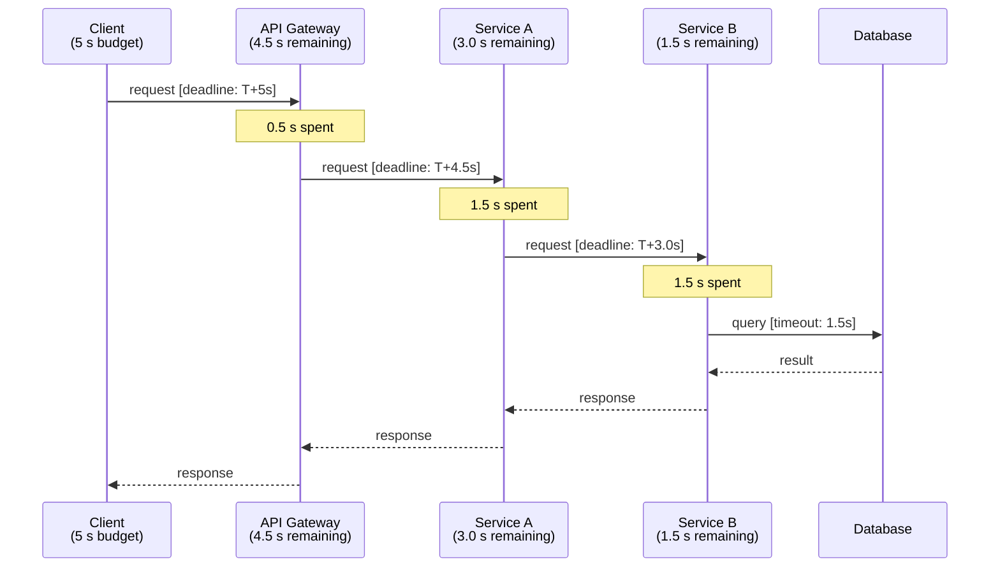

# [BEE-12003] Timeouts and Deadlines

:::info
Every integration point must have a timeout. Deadlines must propagate across service boundaries so downstream work is abandoned when the upstream caller has already given up.
:::

## Context

Distributed systems communicate over unreliable networks. A remote call can hang indefinitely: the network packet is lost, the remote host is under memory pressure, a database lock is held, or a GC pause froze the process. Without a timeout the calling thread or connection slot is occupied forever. At scale, a single slow dependency can exhaust a thread pool in seconds, blocking all requests including those that have nothing to do with the slow dependency — a textbook cascading failure.

This is not a theoretical concern. The Amazon Builders' Library documents that missing or overgenerous timeouts are among the most common root causes of availability incidents in large distributed systems ([Timeouts, retries and backoff with jitter](https://aws.amazon.com/builders-library/timeouts-retries-and-backoff-with-jitter/)).

## Principle

**Set a timeout at every integration point. Propagate the deadline to every downstream call. Never set a downstream timeout longer than the upstream caller's remaining budget.**

## Concepts

### Types of Timeout

| Type | What it guards | Typical setting |
|------|---------------|-----------------|
| **Connection timeout** | Time to establish the TCP/TLS handshake | 1–5 s |
| **Read timeout** | Time to receive the first (or next) byte after the connection is established | Based on P99 of the dependency |
| **Write timeout** | Time to finish sending the request body | Based on payload size and bandwidth |
| **Idle timeout** | Time a keep-alive connection may sit unused | 60–90 s for most HTTP servers |
| **Request timeout** | End-to-end time budget for the entire request/response cycle | Sum of expected processing + network RTT + margin |

Connection timeout and read timeout are the two settings developers most often misconfigure. Leaving either at the default — or at `0` (infinity) — creates a slow resource leak that becomes visible only under load.

### Why No Timeout Equals a Resource Leak

Every in-flight HTTP call, database query, or message-queue operation occupies at least one resource: a thread, a file descriptor, a connection-pool slot, or heap memory for the in-flight buffer. Without a timeout:

1. A slow or stuck remote endpoint holds the resource indefinitely.
2. Under concurrent load the pool fills up.
3. New requests queue, then fail or time out waiting for a slot.
4. The service appears unavailable to its callers — even though the root cause is one slow downstream.

### Deadline vs. Timeout

A **timeout** is a duration measured from when the current hop started. A **deadline** is an absolute point in time (or a relative duration measured from the original client request). Deadlines are preferable in multi-service chains because they express the total remaining budget, not the per-hop limit.

gRPC uses deadlines natively. The client sets a deadline; gRPC converts it to a `grpc-timeout` wire header representing the remaining duration; each server reconstructs the absolute deadline on receipt, subtracts the time already spent, and passes the remainder to any downstream call it makes ([gRPC Deadlines guide](https://grpc.io/docs/guides/deadlines/)). This guards against clock skew and eliminates the mental overhead of computing per-hop timeouts manually.

### Timeout Budget and Propagation

```
Total client budget = 5 s
  └─ API Gateway receives request, 0.5 s elapsed → passes 4.5 s remaining
      └─ Service A receives request, 1.5 s elapsed → passes 3.0 s remaining
          └─ Service B receives request, 1.5 s elapsed → passes 1.5 s remaining
              └─ Database query must complete within 1.5 s
```

The diagram below shows this shrinking budget:



Each hop checks the remaining budget before issuing the downstream call. If the budget is already exhausted, the service returns an error immediately rather than issuing a call it knows will be cancelled.

## Setting Appropriate Timeouts

**Measure first, then set.**

1. Collect P99 (and P999) latency for the dependency you are calling under normal load.
2. Add a safety margin — typically 50–100 % on top of P99 for non-critical paths, less for hot paths where you want to shed load quickly.
3. Verify the timeout is shorter than the upstream caller's remaining budget at that point in the call chain.
4. Revisit after capacity changes, major releases, or incident retrospectives.

A common mistake is to set a "safe" value like 30 s because it feels conservative. If P99 is 200 ms, a 30 s timeout provides no protection — it just delays the failure by 30 s and holds the thread the whole time.

## Misconfigured Timeout Example

**Before (broken):**

```
Client → API Gateway (timeout: 30 s)
             └─ Backend Service (timeout: 60 s)
                      └─ Database query (no timeout)
```

Scenario: the database is under lock contention. The query runs for 60 s.
- The API gateway's 30 s timeout fires. It returns `504 Gateway Timeout` to the client.
- The backend service thread is still blocked waiting for the database — for another 30 s.
- The database holds the lock and the connection slot for the full 60 s.
- Result: the client sees an error immediately; the backend wastes resources for 60 s on work whose result nobody will ever read.

**After (fixed):**

```
Client → API Gateway (timeout: 5 s)
             └─ Backend Service (timeout: 4 s)
                      └─ Database query (timeout: 3 s)
```

- The database query is cancelled after 3 s, releasing the lock and connection slot.
- The backend service has headroom (4 s budget) to handle the error and return a structured response.
- The API gateway has headroom (5 s budget) to receive the error response from the backend.
- The client receives a meaningful error within 5 s.

The key rule: **downstream timeout < upstream timeout at every hop**. A downstream timeout equal to or longer than the upstream timeout means the upstream cancels first, leaving the downstream doing wasted work with no one to receive the result.

## Timeouts at Every Integration Point

Apply timeouts to every external call, without exception:

| Integration point | Timeout type(s) to set |
|-------------------|----------------------|
| Outbound HTTP | Connection timeout + read timeout (+ write timeout for large uploads) |
| Database client | Query timeout + connection acquisition timeout |
| Cache (Redis, Memcached) | Command timeout + connection timeout |
| Message queue (Kafka, RabbitMQ, SQS) | Produce timeout, consume poll timeout |
| gRPC call | Deadline on every RPC |
| Internal job / goroutine / async task | Context deadline or `WithTimeout` |

Many HTTP client libraries default to no timeout (e.g., Go's `http.Client`, Python's `requests` without `timeout=`). Always set explicitly.

## Common Mistakes

### 1. No timeout set

The most dangerous mistake. Threads accumulate. The service dies silently under load. Fix: always set both connection timeout and read timeout, even for "fast" dependencies.

### 2. Timeout too generous

A 30 s timeout when P99 is 200 ms gives zero protection during an incident — it just delays failure. Fix: set timeouts based on measured latency percentiles, not intuition.

### 3. Not propagating the deadline downstream

The service sets a 5 s timeout on its own incoming request but makes an outbound call with no timeout, or with a fresh 10 s timeout. The upstream caller gives up after 5 s, but the downstream call runs for 10 s — wasted work and a leaked connection. Fix: derive the downstream timeout from the remaining budget of the incoming request's deadline.

### 4. Downstream timeout longer than upstream

```
API Gateway: 5 s
  └─ Service: 10 s   ← always wasted — the gateway already returned 504
```

Fix: enforce that each downstream timeout is strictly shorter than the upstream budget, with enough margin for the hop's own processing time.

### 5. Treating timeout errors as unknown errors

Timeouts are a known, expected failure mode. They are often retryable (with idempotency guards — see [BEE-12002](retry-strategies-and-exponential-backoff.md)) and should not be conflated with `500 Internal Server Error`. Distinguish `DEADLINE_EXCEEDED` / `408 Request Timeout` / `504 Gateway Timeout` in your error-handling logic so callers can make an informed retry decision.

## Cascading Timeout Failure

When a downstream service is slow, timeouts protect the upstream — but only if the timeouts are correctly configured. The failure mode to avoid is:

1. Service A sets a 10 s timeout on calls to Service B.
2. Service B sets a 15 s timeout on its database queries.
3. Under load, the database is slow. Service B's queries start taking 12 s.
4. Service A times out after 10 s, but Service B is still blocked for another 5 s per request.
5. Service B's thread pool fills up.
6. Service A retries (making the overload worse — see [BEE-12002](retry-strategies-and-exponential-backoff.md)).
7. Service B's circuit breaker (see [BEE-12001](circuit-breaker-pattern.md)) should open, but it does not because Service B never returns an error — it just hangs.

The fix is to set Service B's database timeout to less than Service A's timeout to Service B. Service B then returns a fast error, the circuit breaker can react, and Service A's retries hit a closed circuit rather than a hung server.

## Related BEPs

- [BEE-3001](../networking-fundamentals/tcp-ip-and-the-network-stack.md) — TCP keepalive and socket-level timeouts
- [BEE-12001](circuit-breaker-pattern.md) — Circuit breaker: automatic fallback when a dependency is timing out consistently
- [BEE-12002](retry-strategies-and-exponential-backoff.md) — Retry after timeout: idempotency, backoff, and retry budgets
- [BEE-13003](../performance-scalability/connection-pooling-and-resource-management.md) — Connection pooling: acquisition timeout and pool sizing

## References

- [Timeouts, retries and backoff with jitter — Amazon Builders' Library](https://aws.amazon.com/builders-library/timeouts-retries-and-backoff-with-jitter/)
- [gRPC Deadlines — grpc.io](https://grpc.io/docs/guides/deadlines/)
- [gRPC and Deadlines (blog) — grpc.io](https://grpc.io/blog/deadlines/)
- [Reliable gRPC services with deadlines and cancellation — Microsoft Learn](https://learn.microsoft.com/en-us/aspnet/core/grpc/deadlines-cancellation)
- [Timeout strategies in microservices architecture — GeeksforGeeks](https://www.geeksforgeeks.org/system-design/timeout-strategies-in-microservices-architecture/)
- [Connection Timeouts vs Read Timeouts: Why They Matter in Production — Medium](https://medium.com/@manojbarapatre13/connection-timeouts-vs-read-timeouts-why-they-matter-in-production-50b9261cd8ed)
