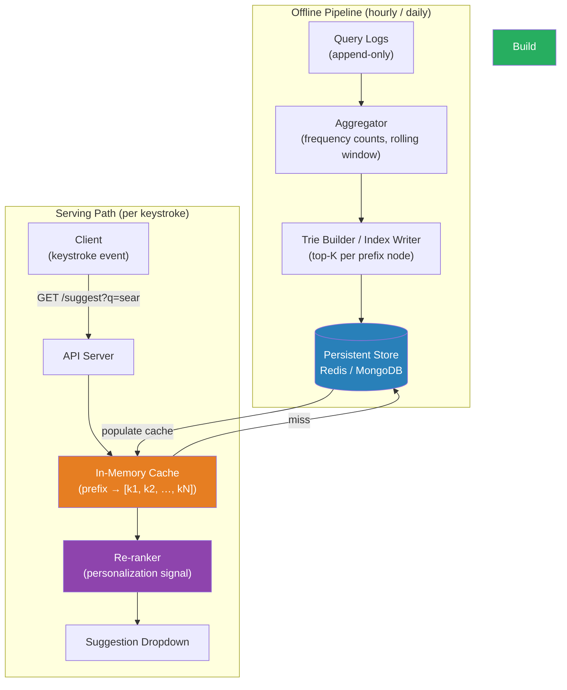

# [BEE-17006] Autocomplete and Typeahead Search

:::info
Autocomplete returns ranked prefix-matching suggestions in under 100ms — a latency budget so tight that runtime trie traversal alone cannot meet it, requiring pre-computed top-K results cached at each prefix node.
:::

## Context

Autocomplete (also called typeahead) is the feature that displays a dropdown of candidate completions as the user types each character. It appears in search boxes, address fields, command palettes, and anywhere that helps users formulate queries. Users see it as a convenience; to the backend engineer, it is one of the hardest latency problems in search infrastructure.

The challenge is the budget: suggestions must appear before the user notices a delay, which empirical UX research places at around 100ms from keystroke to rendered results. That budget covers the round-trip network time, server processing, and client rendering. The server has perhaps 30–50ms to respond.

At that budget, a naive approach — scan all documents for ones whose title starts with the typed prefix — fails immediately. Even an in-memory trie traversal that walks from the root to the prefix node and then iterates all leaf descendants can be too slow when the trie has millions of nodes and the top-K results must be sorted by score at query time.

The canonical solution, described in Alex Xu's *System Design Interview* (2020, Chapter 13) and implemented in systems like Prefixy, is to pre-compute and cache the top-K suggestions at every prefix node. A query for prefix "sear" does not trigger any traversal or sorting — it is a single key lookup returning a pre-ranked list. The entire complexity moves from query time to index-build time.

## Design Thinking

Autocomplete design has three separable concerns:

1. **Data collection**: How are candidate suggestions and their popularity scores derived? Typically from query logs: every search the user submits is recorded, aggregated in batch (hourly or daily), and used to update suggestion scores. Real-time scoring is possible but costly; batch aggregation is the standard approach.

2. **Index structure**: How are suggestions stored so that a prefix query is an O(1) lookup? Two dominant approaches:
   - *Trie with cached top-K per node*: Each node in the prefix tree stores a bounded list of the highest-scoring completions below it. The trie is rebuilt periodically from fresh aggregation data and loaded into memory.
   - *Prefix hash map*: A flat hash table mapping every prefix (up to a maximum length L) to a pre-sorted list of top-K completions. Trades space for guaranteed O(1) access and simpler implementation.

3. **Serving layer**: The index must be in memory for the latency budget to be met. A Redis sorted set or an in-process trie are the two common choices. A CDN or edge cache can serve suggestions for the globally most common prefixes without hitting the origin at all.

The choice of K (number of suggestions per prefix) and L (maximum prefix length indexed) are the two parameters that determine memory footprint. Prefixy's production experience found K=50 and L=20 to be a good balance: enough candidates for accurate ranking, and bounded so that total storage is proportional to vocabulary size rather than combinatorially exploding.

## Best Practices

Engineers MUST pre-compute top-K results per prefix node and store them in the index. Performing ranking at query time — sorting candidates by score in the hot path — will not meet the 100ms budget at scale.

Engineers MUST bound K (suggestions stored per prefix) and L (maximum indexed prefix length). Indexing every possible prefix of every possible query without bounds makes the index grow without limit. L=20–25 characters covers nearly all realistic user inputs; K=10–20 is sufficient for most UIs.

Engineers SHOULD decouple the suggestion index from the full-text search index (BEE-17001). The two have different update patterns and query shapes. Autocomplete is a read-heavy, latency-critical, eventually consistent system; full-text search requires near-real-time indexing and relevance scoring. Running them on separate infrastructure allows independent scaling and tuning.

Engineers SHOULD build the autocomplete index from aggregated query logs rather than from the document corpus directly. Popularity-ranked suggestions ("what did other users search for when they typed this prefix?") outperform alphabetically sorted document titles as suggestions. The aggregation pipeline computes frequency counts over a rolling window (24 hours, 7 days) and merges them into the suggestion scores.

Engineers MUST filter offensive and policy-violating content from the suggestion index. Autocomplete surfaces content proactively before the user commits to a query, which makes it a higher-profile moderation surface than the result set. Maintain a blocklist applied as a post-processing step when building or updating the index, so removals do not require a full rebuild.

Engineers SHOULD handle personalization as a re-ranking layer on top of the global top-K list, not as a separate per-user index. Computing a full per-user prefix index is prohibitively expensive. Instead, retrieve the global top-K, then apply a lightweight re-ranking signal (user's recent searches, language, location) to reorder the list before returning it.

Engineers SHOULD implement graceful degradation: if the in-memory suggestion cache is unavailable, fall back to a slower but still correct lookup against persistent storage rather than returning an empty dropdown.

Engineers MUST measure and alert on p99 latency for autocomplete endpoints separately from the main search latency. Users experience autocomplete on every keystroke; a latency regression here is immediately perceptible and disproportionately affects perception of overall search quality.

## Visual



## Example

**Trie node with cached top-K (language-neutral pseudocode):**

```
struct TrieNode:
    children: Map<char, TrieNode>
    topK: List<Suggestion>     // pre-sorted descending by score; max K entries

struct Suggestion:
    text:  string
    score: float               // aggregated query frequency

// --- BUILD (offline) ---

function buildTrie(aggregatedQueries: List<(text, score)>) -> TrieNode:
    root = new TrieNode()
    for (text, score) in aggregatedQueries:
        node = root
        for char in text[0..min(len(text), MAX_PREFIX_LEN)]:
            node = node.children.getOrCreate(char)
            // Insert into bounded top-K list at this prefix node
            node.topK = insertAndBound(node.topK, Suggestion(text, score), K)
    return root

function insertAndBound(list, item, K) -> List<Suggestion>:
    list.insertSorted(item)    // descending by score
    if len(list) > K:
        list.removeLast()      // evict lowest-scored entry
    return list

// --- QUERY (online, O(1) after cache hit) ---

function suggest(prefix: string, trie: TrieNode) -> List<Suggestion>:
    node = trie
    for char in prefix:
        if char not in node.children:
            return []          // no completions for this prefix
        node = node.children[char]
    return node.topK           // pre-computed — no sort needed
```

**Prefix hash map alternative (flat key-value store):**

```
// Build: for every prefix p of every query q (len(p) ≤ L):
for query in aggregatedQueries:
    for i in range(1, min(len(query.text), MAX_L) + 1):
        prefix = query.text[:i]
        sortedSets[prefix].add(query.text, score=query.score)
        sortedSets[prefix].keepTopK(K)

// Query: single key lookup — O(1)
suggestions = sortedSets.get(userInput) ?? []
```

## Related BEEs

- [BEE-9001](../caching/caching-fundamentals-and-cache-hierarchy.md) -- Caching Fundamentals: the in-memory suggestion cache is the critical path; cache miss handling and eviction policy directly affect autocomplete latency
- [BEE-9005](../caching/cache-stampede-and-thundering-herd.md) -- Cache Stampede and Thundering Herd: high-traffic autocomplete endpoints are vulnerable to stampedes when a popular prefix expires simultaneously
- [BEE-17001](full-text-search-fundamentals.md) -- Full-Text Search Fundamentals: the inverted index that powers the result set behind the autocomplete entry point
- [BEE-17002](search-relevance-tuning.md) -- Search Relevance Tuning: the same scoring signals used for result ranking inform the suggestion score at each prefix node

## References

- [Xu, A. (2020). System Design Interview: An Insider's Guide, Chapter 13: Design A Search Autocomplete System. ByteByteGo Press.](https://bytebytego.com/)
- [How We Built Prefixy: A Scalable Prefix Search Service for Powering Autocomplete -- Prefixy Team](https://medium.com/@prefixyteam/how-we-built-prefixy-a-scalable-prefix-search-service-for-powering-autocomplete-c20f98e2eff1)
- [Auto-complete Feature Using Trie -- GeeksforGeeks](https://www.geeksforgeeks.org/dsa/auto-complete-feature-using-trie/)
- [Design Typeahead (Autocomplete) System -- System Design School](https://systemdesignschool.io/problems/typeahead/solution)
- [Redis Sorted Sets -- Redis Documentation](https://redis.io/docs/data-types/sorted-sets/)
