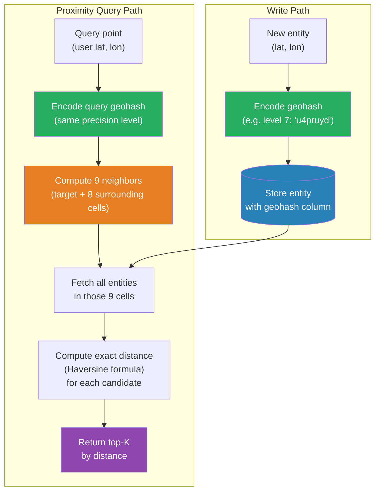

# [BEE-386] Geospatial Search and Proximity Queries

:::info
Geospatial search finds records near a point, within a shape, or along a route — problems that cannot be solved with a standard B-tree index and require spatial indexing structures that partition two-dimensional space.
:::

## Context

A standard relational index is one-dimensional: it sorts values on a line and performs fast prefix lookups. Latitude and longitude are two-dimensional: a point exists on a surface, and proximity means closeness in two directions simultaneously. Naively indexing latitude and longitude as separate columns and querying `WHERE lat BETWEEN ? AND ? AND lon BETWEEN ? AND ?` does work but produces a rectangular bounding box, not a circle, and requires the database to scan all rows inside that rectangle and compute exact distances at runtime — prohibitively expensive at millions of rows.

Spatial indexing solves this by converting two-dimensional coordinates into a form that one-dimensional index structures can handle. Three approaches dominate production systems:

**Geohash** was invented by Gustavo Niemeyer in 2008. It encodes a (latitude, longitude) pair into a short alphanumeric string by recursively bisecting the map into halves, interleaving the resulting latitude and longitude bits into a single binary sequence (a Morton curve / Z-order curve), and encoding the result in Base32. Strings that share a longer common prefix represent cells that are geographically close — most of the time. The edge problem: cells on opposite sides of a geohash boundary can be physically adjacent while having completely different hash strings. The standard workaround is to query the target cell plus its eight immediate neighbors, covering the edge cases.

**S2 Geometry**, open-sourced by Google in 2017 and used internally for Google Maps, addresses geohash's weaknesses with two improvements. It projects the Earth onto the six faces of a cube (reducing distortion compared to the equirectangular projection used by geohash), and it uses a Hilbert space-filling curve instead of a Z-order curve. The Hilbert curve provides better spatial locality: nearby cells remain nearby in the 1D index order more consistently, reducing the magnitude of the edge problem. Cells are identified by 64-bit integers rather than strings, making comparisons fast. S2 is used by Uber, Lyft, and other location-heavy systems.

**R-trees** are the classic spatial index for database engines. Instead of mapping coordinates to a 1D key, an R-tree groups nearby shapes into minimum bounding rectangles (MBRs) arranged in a tree, allowing the database to prune large portions of the dataset at each level of the tree. PostGIS (the PostgreSQL spatial extension) and most GIS databases use GiST-based R-tree indexes internally. R-trees handle arbitrary geometries (polygons, lines, circles) natively and are the right choice when your workload involves shape intersections, containment checks, or routing queries rather than simple point proximity.

Geospatial search appears across a wide class of applications: ride-hailing (find the nearest available driver), food delivery (find restaurants within delivery radius), real estate (find listings within a neighborhood boundary), social apps (find users within N kilometers), and logistics (find warehouses that can serve a zip code).

## Design Thinking

Choosing a spatial indexing strategy depends on three variables:

1. **Query type**: Point-to-point proximity ("find the 10 nearest restaurants to my location") favors geohash or S2 because prefix queries are fast in key-value stores and standard SQL databases. Shape containment ("is this point inside this delivery zone polygon?") favors R-trees and PostGIS.

2. **Scale and latency budget**: At millions of points with single-digit millisecond requirements, an in-memory spatial index (S2 cells, quadtree) or a Redis Geo index (which uses geohash internally) outperforms a disk-based R-tree. PostGIS with a GiST index handles hundreds of millions of rows with 50–200ms query times, appropriate for batch or analytical workloads.

3. **Existing infrastructure**: If you already operate PostgreSQL, PostGIS adds spatial capability without a new system. If you already operate Elasticsearch, its `geo_distance` query and `geo_point` type cover most proximity use cases. Introducing a dedicated spatial database for a feature that could be handled by an extension is usually not justified.

The rule of thumb: start with the spatial features of your existing database. Reach for a dedicated spatial system when query complexity or scale exceeds what your database's spatial extension handles well.

## Best Practices

Engineers MUST index geospatial data with a spatial index, not with individual numeric column indexes on latitude and longitude. A separate index on `lat` and a separate index on `lon` cannot be combined by the query planner to efficiently answer a proximity query.

Engineers SHOULD use geohash or S2 for key-value store proximity search (Redis, DynamoDB, Cassandra). Store the geohash string of each entity at an appropriate precision level (level 6 ≈ 4.9 km cells for city-scale proximity; level 8 ≈ 152 m for neighborhood-level). At query time, compute the target geohash, expand to the 9-cell neighborhood, and retrieve all entities in those cells. Filter the result set by exact distance using the Haversine formula to produce the final ranked list.

Engineers MUST query geohash cells in the target cell plus all 8 neighbors to avoid edge misses. Entities just across a cell boundary will be missed if only the target cell is queried. This is the single most common implementation error in geohash-based proximity search.

Engineers SHOULD use PostGIS with a GiST index for workloads requiring shape containment, polygon intersection, or routing. Standard SQL with ST_DWithin (finds points within a given distance) and ST_Distance is accurate, supports arbitrary geometries, and scales to hundreds of millions of rows with proper indexing.

Engineers MUST use the Haversine formula (or its more accurate successor, the Vincenty formula) to compute distances on a spherical Earth. Euclidean distance in latitude-longitude space is incorrect because a degree of longitude shrinks toward the poles: at 60° latitude, one degree of longitude is approximately half the distance it is at the equator. For short distances (under ~10 km), planar approximations are acceptable; for longer distances or poles-adjacent locations, use a proper spherical formula.

Engineers SHOULD pre-compute geohash or S2 cell values at write time, not at query time. Store the encoded cell identifier alongside the raw latitude and longitude. This makes proximity queries a simple prefix lookup rather than a per-row computation.

Engineers MUST handle the antimeridian (the 180°/-180° longitude boundary) and the poles as edge cases. A bounding box query that wraps around the antimeridian requires splitting it into two separate ranges. Most spatial libraries handle this automatically; hand-rolled implementations frequently do not.

## Visual



## Example

**Geohash-based proximity search (language-neutral pseudocode):**

```
// --- WRITE ---

entity.geohash = geohash.encode(entity.lat, entity.lon, precision=7)
// precision 7 ≈ 1.2 km cell; entities within ~2 km will share a level-6 prefix
db.store(entity)

// --- QUERY: find restaurants within 2 km of user ---

SEARCH_RADIUS_KM = 2.0
user_hash = geohash.encode(user.lat, user.lon, precision=6)   // level 6 ≈ 4.9 km covers 2 km radius
cells_to_query = [user_hash] + geohash.neighbors(user_hash)   // 9 cells total

// Step 1: Cheap prefix fetch (uses index)
candidates = db.query(
    "SELECT * FROM restaurants WHERE geohash LIKE ?",
    prefix=user_hash[:6]        // fetch all level-6 matching entities
).filter(c => cells_to_query.contains(c.geohash[:6]))

// Step 2: Exact distance filter (Haversine, runs on small candidate set)
function haversine(lat1, lon1, lat2, lon2):
    R = 6371                    // Earth radius in km
    dlat = radians(lat2 - lat1)
    dlon = radians(lon2 - lon1)
    a = sin(dlat/2)^2 + cos(radians(lat1)) * cos(radians(lat2)) * sin(dlon/2)^2
    return R * 2 * asin(sqrt(a))

results = candidates
    .map(c => { entity: c, distance: haversine(user.lat, user.lon, c.lat, c.lon) })
    .filter(r => r.distance <= SEARCH_RADIUS_KM)
    .sortBy(r => r.distance)
    .take(10)
```

**PostGIS equivalent (SQL):**

```sql
-- Create spatial index (run once)
CREATE INDEX restaurants_location_idx ON restaurants USING GIST (location);
-- location is a GEOGRAPHY column: CREATE TABLE ... (location GEOGRAPHY(POINT, 4326))

-- Find 10 nearest restaurants within 2km of user
SELECT
    id,
    name,
    ST_Distance(location, ST_MakePoint(-73.9857, 40.7484)::geography) AS distance_m
FROM restaurants
WHERE ST_DWithin(
    location,
    ST_MakePoint(-73.9857, 40.7484)::geography,  -- user lon, lat
    2000                                           -- radius in meters
)
ORDER BY distance_m
LIMIT 10;
-- ST_DWithin uses the GiST index; ST_Distance is computed only on the filtered set
```

## Implementation Notes

**Redis Geo commands** (`GEOADD`, `GEODIST`, `GEOSEARCH`) store points as geohash-encoded sorted set members. `GEOSEARCH` returns members within a radius or bounding box and sorts by distance. This is the fastest path to proximity search when entities fit in memory and are identified by a simple key. Redis uses geohash internally but exposes a clean proximity API that handles neighbor expansion automatically.

**PostgreSQL + PostGIS** is the most capable option for complex geometry: polygon containment, line buffer queries (find all entities within 100m of a road), and multi-shape intersections. Use `GEOGRAPHY` (not `GEOMETRY`) type for columns storing real-world coordinates to get automatic spherical distance calculations. A GiST index on a `GEOGRAPHY` column is created with `USING GIST`.

**Elasticsearch** supports `geo_distance` filters and `geo_bounding_box` queries on `geo_point` fields natively. It stores internally as geohash but handles neighbor expansion transparently. Best suited when the proximity query is combined with full-text filters ("restaurants near me that match 'pizza'") because it joins spatial and text indexes efficiently in a single query.

**DynamoDB + S2** is the pattern used by AWS's geo library and several large-scale mobile applications (WhatsApp location sharing, Tinder-style nearby matching). Store an S2 cell ID at the appropriate level as the sort key, partition on a coarser cell level, and query across the covering set of cells. This avoids hot-partition issues that arise when all nearby entities share the same partition key.

## Related BEEs

- [BEE-6002](../data-storage/indexing-deep-dive.md) -- Indexing Deep Dive: the B-tree and GiST index structures that underpin database-level spatial indexes
- [BEE-6004](../data-storage/partitioning-and-sharding.md) -- Partitioning and Sharding: spatial partitioning by geohash or S2 cell is a common strategy for sharding location-heavy datasets
- [BEE-9001](../caching/caching-fundamentals-and-cache-hierarchy.md) -- Caching Fundamentals: proximity query results for popular locations (city centers, landmarks) are strong cache candidates
- [BEE-17001](full-text-search-fundamentals.md) -- Full-Text Search Fundamentals: geospatial and text filters are frequently combined ("coffee shops near me")

## References

- [Geospatial Indexing Explained: Geohash, S2, and H3 -- Ben Feifke](https://benfeifke.com/posts/geospatial-indexing-explained/)
- [GeoHashing: How It Works and Real-World Applications -- AlgoMaster](https://blog.algomaster.io/p/geohashing)
- [Geo queries -- Elasticsearch Reference](https://www.elastic.co/docs/reference/query-languages/query-dsl/geo-queries)
- [PostGIS Reference: ST_DWithin](https://postgis.net/docs/ST_DWithin.html)
- [PostGIS Reference: ST_Distance](https://postgis.net/docs/ST_Distance.html)
- [Redis GEOSEARCH command -- Redis Documentation](https://redis.io/docs/latest/commands/geosearch/)
- [S2 Geometry Library -- Google](https://s2geometry.io/)
