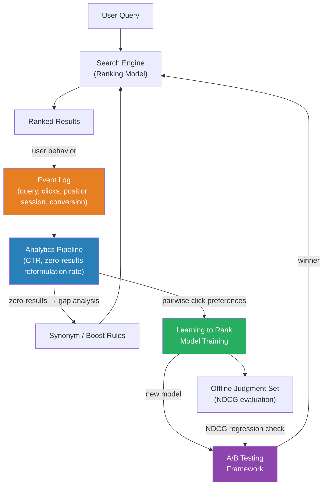

# [BEE-388] Search Analytics and Feedback Loops

:::info
Search analytics converts user behavior — clicks, reformulations, abandonments — into signals that continuously improve relevance. Without instrumentation, search is a black box; with it, every query becomes a data point for the next iteration.
:::

## Context

A search engine that ships once and never changes degrades relative to user expectations over time. Catalogs evolve, language shifts, and new usage patterns emerge. The discipline of search analytics closes the loop between what users do and how the ranking model responds.

The foundational insight comes from Joachims et al. in their 2005 SIGIR paper "Accurately Interpreting Clickthrough Data as Implicit Feedback." Their controlled eye-tracking study showed that clicks are biased — users are far more likely to click results at the top of a page regardless of their actual relevance — but the bias is consistent and predictable. Relative comparisons within a session (did the user click result A but not result B shown above it?) carry real signal about preference even when absolute clickthrough rates do not. This paper established that implicit feedback from production traffic is usable for training ranking models, launching the field of learning to rank from click data.

**Online metrics** measure what users do in production:

- **Clickthrough rate (CTR)**: Fraction of queries that result in at least one click. Position 1 in organic search results historically receives around 28–30% CTR; positions fall steeply (Sistrix, 2020). CTR alone is misleading because of position bias: a poor result at rank 1 gets more clicks than a good result at rank 5. Use CTR relative to expected CTR at that position.
- **Zero-results rate**: Fraction of queries returning no results. A zero-results query is a complete failure. Industry practice treats anything above 5–8% as a signal requiring investigation. Root causes include inventory gaps, aggressive filtering, or tokenization failures on rare terms.
- **Query reformulation rate**: Fraction of sessions where the user issues a second query immediately after the first. High reformulation indicates the first query failed. Distinguish between productive reformulations (user narrowing scope) and frustrated reformulations (user trying synonyms after zero results).
- **Search abandonment rate**: User leaves without clicking any result. Abandonment after zero results is expected; abandonment after results are shown suggests relevance failure.
- **Time-to-click / time-to-first-result-interaction**: How long from query submission until the user selects a result. Longer times may indicate scanning fatigue from poor ranking.

**Offline metrics** evaluate a ranking model against a held-out judgment set:

- **NDCG (Normalized Discounted Cumulative Gain)**: The standard academic and industry relevance metric. Results are graded (e.g., 0 = irrelevant, 1 = partial, 2 = relevant, 3 = highly relevant). Gains are discounted by log₂(position + 1) so lower-ranked results matter less. The score is normalized against the ideal ranking. NDCG@10 — measuring over the first 10 results — is the most common variant in web and e-commerce search.
- **MRR (Mean Reciprocal Rank)**: Average of 1/rank of the first relevant result across queries. Useful when only the first relevant result matters (navigational queries, answer retrieval). Simpler than NDCG but discards all signal after the first hit.
- **Recall@K**: Fraction of known relevant documents retrieved in the top K results. Important for retrieval recall evaluation, particularly in vector search where tuning HNSW parameters affects recall vs. latency.

**The feedback loop architecture** has three stages. Instrumentation captures raw events (query text, result IDs, positions, clicks, conversions) in a stream or event log. Analysis aggregates these events into metrics — zero-results dashboards, CTR-by-query reports, reformulation funnels. Learning converts analysis into model updates: synonym rules derived from reformulation pairs, boosting rules from click data, or gradient-boosted trees trained on pairwise preferences extracted from session logs.

**Learning to Rank (LTR)** is the end state of a mature feedback loop. Pointwise LTR (train a relevance classifier per result), pairwise LTR (RankNet, Burges et al. 2005 at Microsoft), and listwise LTR (LambdaRank, LambdaMART) all consume implicit feedback as training signal. LambdaMART in particular became the dominant production LTR algorithm in the 2010s; it is available in open source as part of XGBoost and LightGBM.

## Best Practices

Engineers MUST instrument every query with at minimum: query string, result IDs in rank order, position of each click, and session identifier. Without this baseline, no meaningful analytics or learning is possible.

Engineers MUST monitor zero-results rate as a first-class operational metric, not a quality afterthought. Alert when it crosses threshold (typically 5–8%). Zero-results queries are a direct signal of missing synonyms, catalog gaps, or broken tokenization.

Engineers SHOULD decompose CTR by position to separate ranking quality from position bias. A result at rank 3 that receives clicks at the same rate as rank 1 results is outperforming its position — a signal it should rank higher.

Engineers MUST NOT use raw CTR as a sole optimization target. Optimizing raw CTR drives results to populist content that gets clicks but does not serve user intent. Combine CTR with dwell time, conversion, and explicit negative signals (quick backs — user clicks, immediately returns, clicks next result).

Engineers SHOULD run A/B tests before deploying ranking changes to production. Split traffic at the query level (hash query ID to variant bucket). Measure CTR, reformulation rate, and conversion in both arms. Reject changes that improve CTR but increase reformulation — they may be gaming the metric.

Engineers SHOULD build a query clustering pipeline to aggregate signal across semantically similar queries. Individual rare queries accumulate too little signal for learning. Clustering via embedding similarity pools signal: clicks on results for "running shoes" inform ranking for "jogging footwear."

Engineers MUST separate logging from the query path. Writing analytics events synchronously in the request handler adds latency and introduces fragility. Use fire-and-forget to a local event buffer (Kafka producer, Kinesis client) and process asynchronously.

Engineers SHOULD maintain a relevance judgment set for offline evaluation. Curate a sample of high-volume queries with human-rated relevance labels. After any model change, compute NDCG@10 against this set before deployment. Offline metrics catch regressions that A/B tests might take days of traffic to detect.

## Visual



## Example

**Extracting pairwise preferences from click logs:**

```
// Given a session's ranked result list and which items were clicked,
// extract pairwise training examples for LTR.
// Rule: a clicked result at position i is preferred over any
// unclicked result shown above it at position j < i.
// (Joachims 2005: skipped-over results are likely less relevant.)

function extract_pairs(session):
    clicked = {r.id for r in session.results if r.clicked}
    not_clicked = {r.id for r in session.results if not r.clicked}
    pairs = []

    for result in session.results:
        if result.clicked:
            // Any unclicked result above this one is a negative pair
            for other in session.results:
                if other.position < result.position and other.id not in clicked:
                    pairs.append(Pair(preferred=result.id, rejected=other.id, query=session.query))

    return pairs

// These pairs feed into pairwise LTR training (RankNet, LambdaMART).
// Aggregate across millions of sessions to overcome per-session noise.
```

**NDCG@10 computation:**

```python
import math

def dcg(relevances, k=10):
    """Discounted Cumulative Gain at rank k."""
    return sum(
        (2**rel - 1) / math.log2(rank + 2)
        for rank, rel in enumerate(relevances[:k])
    )

def ndcg(predicted_order, ideal_order, k=10):
    """NDCG@k: DCG of predicted ranking normalized by ideal DCG."""
    ideal_dcg = dcg(sorted(ideal_order, reverse=True), k)
    if ideal_dcg == 0:
        return 0.0
    return dcg(predicted_order, k) / ideal_dcg

# Example:
# relevances in ranking model's order: [3, 2, 1, 0, 3]
# ideal order (sorted descending): [3, 3, 2, 1, 0]
print(ndcg([3, 2, 1, 0, 3], [3, 3, 2, 1, 0], k=5))  # → ~0.95
```

## Related BEEs

- [BEE-17001](full-text-search-fundamentals.md) -- Full-Text Search Fundamentals: the inverted index and BM25 scoring that analytics aims to improve
- [BEE-17002](search-relevance-tuning.md) -- Search Relevance Tuning: the manual tuning process that analytics data informs and eventually replaces
- [BEE-17004](vector-search-and-semantic-search.md) -- Vector Search and Semantic Search: offline Recall@K metrics apply directly to ANN index evaluation

## References

- [Accurately Interpreting Clickthrough Data as Implicit Feedback -- Joachims et al., SIGIR 2005](https://dl.acm.org/doi/10.1145/1076034.1076063)
- [From RankNet to LambdaRank to LambdaMART: An Overview -- Burges, Microsoft Research 2010 (PDF)](https://www.microsoft.com/en-us/research/wp-content/uploads/2016/02/MSR-TR-2010-82.pdf)
- [NDCG (Normalized Discounted Cumulative Gain) -- Evidently AI](https://www.evidentlyai.com/ranking-metrics/ndcg-metric)
- [Learning to Rank -- Wikipedia](https://en.wikipedia.org/wiki/Learning_to_rank)
- [Sistrix: Why (almost) everything you knew about Google CTR is no longer valid](https://www.sistrix.com/blog/why-almost-everything-you-knew-about-google-ctr-is-no-longer-valid/)
