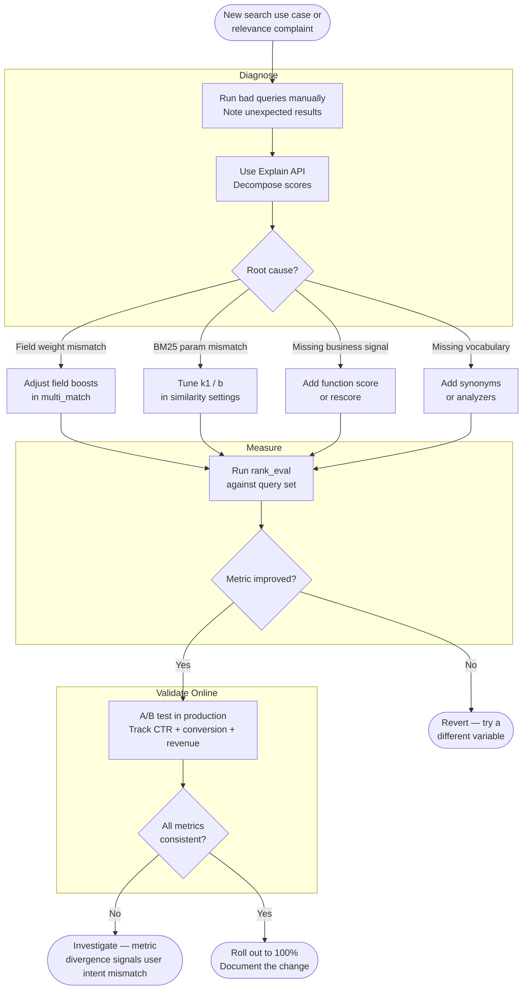

# [BEE-17002] Search Relevance Tuning

:::info
Relevance tuning is the discipline of measuring and improving why the right documents rank at the top — starting with BM25 parameters and field weights, validated by offline metrics before any change reaches production.
:::

## Context

A working search index and a *relevant* search index are different things. The index returns results; relevance tuning determines whether those results are the ones users actually wanted. Most teams ship the former and mistake it for the latter.

The default BM25 scoring — with k1 = 1.2 and b = 0.75 — is a reasonable starting point for a generic corpus. For a product catalog, a knowledge base, or a job listings site, "generic" is not good enough. A title match on a short product name should outrank a body mention in a 5,000-word review. A recently published document should rank above a stale one with slightly higher TF. A document that 10,000 users clicked should rank above an equally-scored document with no engagement signal. None of these improvements happen automatically.

Relevance tuning is also a discipline of measurement. Changing a boost without measuring the effect is superstition, not engineering. The tools exist — explain APIs, offline ranking evaluation, A/B testing — and teams that use them systematically ship better search experiences and can defend their decisions with data.

**References:**
- [Practical BM25 - Part 2: The BM25 Algorithm and its Variables](https://www.elastic.co/blog/practical-bm25-part-2-the-bm25-algorithm-and-its-variables)
- [Practical BM25 - Part 3: Considerations for Picking b and k1 in Elasticsearch](https://www.elastic.co/blog/practical-bm25-part-3-considerations-for-picking-b-and-k1-in-elasticsearch)
- [Function Score Query — Elasticsearch Reference](https://www.elastic.co/docs/reference/query-languages/query-dsl/query-dsl-function-score-query)
- [Elasticsearch Scoring and the Explain API](https://www.elastic.co/search-labs/blog/elasticsearch-scoring-and-explain-api)
- [Test-Driven Relevance Tuning Using the Ranking Evaluation API](https://www.elastic.co/blog/test-driven-relevance-tuning-of-elasticsearch-using-the-ranking-evaluation-api)
- [Evaluating the Best A/B Testing Metrics for Your Search](https://www.algolia.com/blog/engineering/a-b-testing-metrics-evaluating-the-best-metrics-for-your-search)

## Principles

### 1. Understand BM25 Before Tuning It

BM25 scores a document for a query term using three factors:

- **IDF (Inverse Document Frequency)**: how rare the term is across the corpus. A term appearing in 90% of documents contributes almost nothing; a term appearing in 0.1% of documents contributes heavily.
- **TF normalization**: how many times the term appears in this document, diminishing-returns-shaped so that the 50th occurrence contributes far less than the 1st.
- **Field-length normalization**: shorter documents are favored over longer ones, on the assumption that a document containing the query term and little else is more focused than a large document containing the same term buried in noise.

Two parameters control the shape of these curves:

| Parameter | Default | Effect |
|-----------|---------|--------|
| `k1` | 1.2 | Controls TF saturation. Lower = hits from repeated terms plateau faster. Range: 0–3; observed optimal 0.5–2.0. |
| `b` | 0.75 | Controls length normalization strength. `b = 0` disables it entirely; `b = 1` applies full normalization. Range: 0–1; observed optimal 0.3–0.9. |

Adjust `k1` and `b` as a last resort — after field weights, synonyms, and function scoring have been exhausted. Changing them without a test corpus and offline metrics is guessing.

**When to increase `k1`:** Documents are long and topically diverse (technical manuals, books). Repeated terms should keep contributing to the score because topic depth matters.

**When to decrease `k1`:** Documents are short and focused (news headlines, product titles). A few occurrences of a term already signal strong relevance; additional occurrences add noise.

**When to decrease `b`:** Documents are legitimately long for structural reasons (legal contracts, patents). Length normalization would unfairly penalize them relative to short documents on the same topic.

### 2. Apply Field Weights Before Touching BM25 Parameters

A query term appearing in the `title` field is a stronger relevance signal than the same term in `body`. Field boosting encodes this knowledge:

```json
{
  "query": {
    "multi_match": {
      "query": "database connection pooling",
      "fields": ["title^4", "tags^2", "body"],
      "type": "best_fields"
    }
  }
}
```

The `^N` multiplier scales the field's contribution to the final score. Title at `^4`, tags at `^2`, body at `^1` reflects a reasonable default for most knowledge-base content. Adjust based on your corpus:

- **Short title, dense body** (product catalog): `title^6`, `description^2`, `brand^3`
- **Structured content** (API docs): `title^5`, `summary^3`, `parameters^2`, `body^1`
- **Social content** (forum posts): `title^3`, `tags^4`, `body^1`

`type: best_fields` uses the score from the single best-matching field. Use `type: cross_fields` when the query terms are likely to be distributed across multiple fields (e.g., first name in `first_name`, last name in `last_name`).

### 3. Inject Business Signals with Function Scoring

Textual relevance alone does not capture all ranking signals. A product with 10,000 sales SHOULD rank above an equally-scored product with 5 sales, everything else equal. A recently published document SHOULD rank above a two-year-old document with the same term frequency. Function scoring layers numeric signals on top of BM25:

```json
{
  "query": {
    "function_score": {
      "query": { "multi_match": { "query": "hiking boots", "fields": ["title^4", "body"] } },
      "functions": [
        {
          "field_value_factor": {
            "field": "sales_count",
            "modifier": "log1p",
            "factor": 0.5,
            "missing": 0
          }
        },
        {
          "gauss": {
            "published_at": {
              "origin": "now",
              "scale": "30d",
              "decay": 0.5
            }
          }
        }
      ],
      "score_mode": "sum",
      "boost_mode": "sum"
    }
  }
}
```

Key decisions:

- **`modifier: log1p`** on numeric fields dampens extreme values. A document with 1,000,000 sales should not dominate completely over one with 10,000; `log1p` compresses the range.
- **`decay: 0.5`** on date fields means a document published exactly `scale` days ago scores 50% of what a same-age document would score. At 2× scale, it scores ~25%.
- **`boost_mode: sum`** adds the function result to the BM25 score additively. Use `multiply` when you want the signal to scale with text relevance (a popular but irrelevant document should not top results).

### 4. Use the Explain API to Debug Scores

Before tuning anything, understand why documents rank as they do. The Explain API decomposes a score into its contributing factors:

```bash
GET /products/_explain/doc-42
{
  "query": {
    "match": { "title": "hiking boots" }
  }
}
```

Response (simplified):

```json
{
  "matched": true,
  "explanation": {
    "value": 3.7,
    "description": "weight(title:hiking in doc-42)",
    "details": [
      {
        "value": 2.2,
        "description": "idf, computed for term 'hiking': docFreq=1200, docCount=50000"
      },
      {
        "value": 1.68,
        "description": "tfNorm, computed from: termFreq=2, k1=1.2, b=0.75, fieldLen=4, avgFieldLen=18"
      }
    ]
  }
}
```

Read the explanation tree to answer: Is this document ranking too high because of a short field length? Is IDF unusually low because the term is too common in your corpus? Is a function score contribution dominating text relevance?

For batch debugging across a search result set, add `?explain=true` to a `_search` request.

### 5. Measure Offline Before Changing Anything in Production

Relevance tuning MUST be driven by measurement. The workflow:

1. **Collect a query set**: 100–500 representative queries from production search logs.
2. **Judge relevance**: for each query, rate the top-N results as relevant (1) or not (0). Use domain experts or graded labels (0–3) for finer resolution.
3. **Establish a baseline**: run the query set against the current configuration using the Ranking Evaluation API and record Precision@5 or DCG.
4. **Make one change**: adjust a field weight, k1, or add a function score.
5. **Re-measure**: run the same query set.
6. **Accept or revert**: if the metric improves, accept. If it degrades or is neutral, revert and try a different change.

```bash
POST /products/_rank_eval
{
  "requests": [
    {
      "id": "hiking boots query",
      "request": { "query": { "match": { "title": "hiking boots" } } },
      "ratings": [
        { "_index": "products", "_id": "42", "rating": 1 },
        { "_index": "products", "_id": "17", "rating": 0 }
      ]
    }
  ],
  "metric": {
    "precision": { "k": 5, "relevant_rating_threshold": 1 }
  }
}
```

Quality scores range from 0 (no relevant results in top-k) to 1 (all top-k results relevant). A change that moves Precision@5 from 0.62 to 0.71 across the full query set is meaningful. A change that moves it from 0.62 to 0.63 is within noise.

### 6. Validate Online with A/B Testing

Offline metrics measure ranking quality; they do not measure user behavior. A change that improves Precision@5 might increase CTR, or it might not — user intent is complex. Online A/B testing is the final validation step before full rollout.

Track multiple metrics simultaneously:

| Metric | Sensitivity | Business signal |
|--------|-------------|-----------------|
| Click-Through Rate | High (detects changes with less traffic) | Measures perceived relevance |
| Conversion Rate | Medium | Measures downstream value |
| Revenue / Add-to-cart | Low (requires most traffic) | Strongest business signal |

A winning variant SHOULD show consistent direction across all three metrics. A variant that increases CTR but decreases conversion is not a win — it means users are clicking but not finding what they need. Never gate a relevance change on a single metric.

### 7. Rescore for Expensive Signals

Some ranking signals are too expensive to apply to every document in the index. Rescore applies a second-pass ranking only to the top-N documents retrieved by the primary query:

```json
{
  "query": { "match": { "body": "connection pooling" } },
  "rescore": {
    "window_size": 50,
    "query": {
      "rescore_query": {
        "slop": 3,
        "query": {
          "match_phrase": { "body": "connection pooling" }
        }
      },
      "query_weight": 0.7,
      "rescore_query_weight": 1.5
    }
  }
}
```

Here the primary query retrieves candidates quickly. The rescore query runs an expensive phrase match only on the top 50 candidates, boosting documents where the terms appear adjacent (slop ≤ 3). The final score combines both: `0.7 × primary + 1.5 × rescore`.

Use rescore for: phrase proximity boosts, script-based signals, vector similarity re-ranking (hybrid search).


## Relevance Tuning Workflow




## Worked Example: E-commerce Product Search

An e-commerce site has 2 million SKUs. Search is powered by Elasticsearch. The engineering team has received complaints: "searching for 'wool blanket' returns polyester fleece throws before actual wool blankets."

**Step 1 — Diagnose with Explain**

The Explain API reveals the top-ranked fleece throw has 3× mentions of "blanket" in a 900-word product description. The wool blanket result has 1 mention in a 60-word description. BM25 is rewarding term frequency in a long document over a focused match in a short, precise one.

Root cause: long product descriptions with repeated marketing language are dominating over concise, accurate titles.

**Step 2 — Adjust field weights**

The team changes the query from a single `match` on `body` to a `multi_match` across fields:

```json
"fields": ["title^6", "brand^4", "material_tags^5", "description^1"]
```

`title^6` and `material_tags^5` ensure that a product whose title or material tags contain "wool" ranks far above one where the word appears only in description prose.

**Step 3 — Measure offline**

The team has a query set of 300 representative queries, judged by 2 merchandisers. Baseline Precision@5: 0.58. After the field weight change: 0.71. Improvement of 13 percentage points.

**Step 4 — Add a popularity signal**

The team adds a `field_value_factor` on `purchase_count` with `modifier: log1p` and `factor: 0.3`. This lifts proven best-sellers without completely overriding textual relevance.

Re-measured Precision@5: 0.74. (Marginal improvement — the signal adds value without distorting relevance for low-traffic queries.)

**Step 5 — A/B test**

The combined change (field weights + popularity boost) runs as a 50/50 A/B test for 2 weeks:

- CTR: +8% (variant)
- Conversion rate: +5% (variant)
- Revenue per search: +6% (variant)

All three metrics move in the same direction. The team rolls out at 100%.


## Common Mistakes

**1. Tuning without a query set and baseline metric**

Changing a boost value by intuition, then checking "does this one query look better?" is not relevance tuning — it is anecdote-driven configuration. You need a query set (100+), relevance labels, and an offline metric before touching any parameter. Changes that improve one query often degrade ten others.

**2. Using `boost_mode: multiply` for additive business signals**

If a document with zero sales gets a function score of 0 and `boost_mode: multiply`, its final score is 0 regardless of text relevance. Unpopular-but-relevant documents vanish from results entirely. Use `boost_mode: sum` or apply a `missing` value so the signal adds to — rather than gates — text score.

**3. Applying length normalization to inherently long documents**

A legal contract corpus with `b = 0.75` will penalize every document the same way. Every document in the corpus is long for legitimate reasons. Setting `b = 0.2` or `b = 0` for such a corpus prevents the system from treating "long" as a proxy for "unfocused."

**4. Skipping online validation after offline improvement**

Offline metrics measure ranking quality on a fixed query-and-label set. They do not capture what users actually click. A relevance change that improves DCG by 15% can still decrease conversion if it pushes visually distinct results higher or disrupts a familiar ranking users had learned. Always follow offline improvement with a real A/B test.

**5. Boosting by raw counts without damping**

A product with 1,000,000 purchases getting a `field_value_factor` with `modifier: none` will receive a score contribution 1,000,000× higher than a product with 1 purchase. Apply `log1p` or `sqrt` to compress the range. Extreme values should have logarithmic — not linear — influence.

**6. Treating relevance tuning as a one-time task**

Corpus composition changes. User intent shifts. New document types are added. A relevance configuration tuned for the corpus of 18 months ago may be wrong for today's corpus. Revisit offline metrics quarterly, especially after major catalog or content changes.


## Related BEPs

- [BEE-17001](full-text-search-fundamentals.md) — Full-text search fundamentals: inverted index, BM25 scoring, and the analysis pipeline that underlies relevance
- [BEE-13004](../performance-scalability/profiling-and-bottleneck-identification.md) — Profiling and bottleneck identification: applies to search query latency alongside relevance quality
- [BEE-15006](../testing/testing-in-production.md) — Testing in production: A/B testing methodology applies directly to relevance experiments
