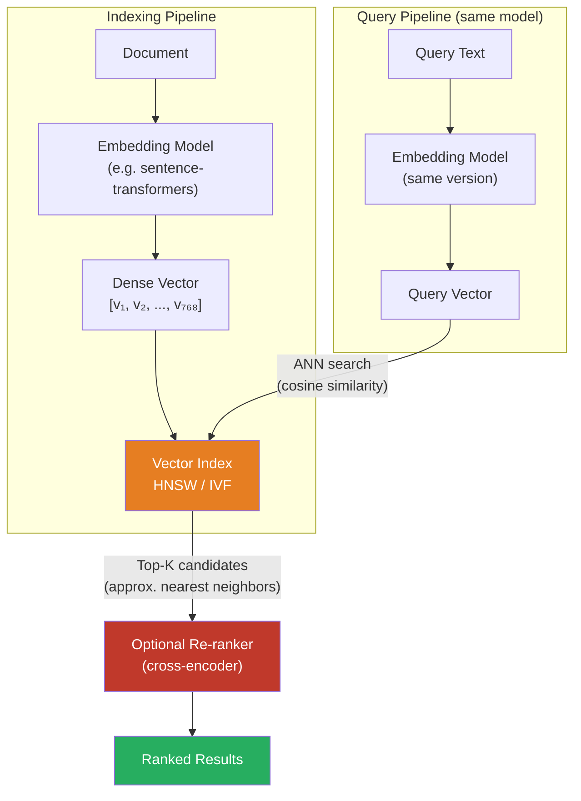

# [BEE-17004] Vector Search and Semantic Search

:::info
Vector search finds results by geometric proximity in a high-dimensional embedding space, enabling queries that match meaning rather than exact keywords.
:::

## Context

Traditional full-text search (BEE-17001) matches query terms against an inverted index. It excels when users know the exact words in the target document, but breaks down when they do not: a query for "heart attack" misses documents that say "myocardial infarction", and a query for "cheap" misses pages that say "affordable" or "low-cost". The underlying problem is that keyword search treats text as a bag of tokens, ignoring semantics.

Semantic search addresses this by working in a continuous vector space rather than a discrete token space. A machine learning model — typically a transformer-based encoder such as BERT, Sentence-BERT, or a model from the OpenAI or Cohere embedding APIs — maps each piece of text into a dense numerical vector (an *embedding*) of fixed dimensionality (commonly 384, 768, or 1536 dimensions). The model is trained so that semantically similar texts land near each other in this space, regardless of the specific words used.

The search problem then becomes: given a query embedding, find the stored document embeddings closest to it under some distance metric, typically cosine similarity or Euclidean distance. This is the *nearest neighbor search* problem.

Doing this exactly — comparing the query against every stored vector — is called *exact nearest neighbor search* (or brute-force search). At millions of vectors and sub-100ms latency budgets, exact search is too slow. The field of *approximate nearest neighbor* (ANN) search trades a small drop in recall for orders-of-magnitude speedup. The two dominant ANN index structures in production systems are **HNSW** and **IVF**.

HNSW (Hierarchical Navigable Small World) was introduced by Yury Malkov and Dmitry Yashunin in a 2020 IEEE TPAMI paper (arXiv:1603.09320), building on earlier work presented at SISAP 2012. It organizes vectors into a layered graph inspired by skip lists: upper layers contain sparse long-range links for coarse navigation, lower layers contain dense short-range links for precise local search. Queries traverse top-down, each layer narrowing the candidate set logarithmically. HNSW consistently achieves the highest recall at a given query speed among ANN algorithms, but its memory footprint grows substantially with the number of vectors and the `M` connectivity parameter.

IVF (Inverted File Index) partitions the vector space into `nlist` Voronoi cells using k-means clustering. At query time, the engine identifies the `nprobe` closest cell centroids and searches only those cells, dramatically reducing comparisons. IVF uses far less memory than HNSW and scales well to hundreds of millions of vectors, but recall depends on the quality of the initial clustering and the `nprobe` setting.

## Design Thinking

Semantic search and keyword search are complementary, not competing. Keyword search has high precision for exact terms — product SKUs, names, error codes, acronyms. Semantic search has better recall for conceptual queries. Production systems routinely combine both in a *hybrid search* architecture: run the query through a keyword index and a vector index independently, then fuse the ranked lists (commonly using Reciprocal Rank Fusion or a learned re-ranker).

The embedding model is the single largest quality lever. A generic off-the-shelf model may outperform BM25 on general knowledge queries, but a domain-specific fine-tuned model will outperform it significantly on specialized corpora (medical, legal, code). The embedding model and the vector index must be treated as a coupled system: reindexing is required whenever the model changes, because embeddings from different model versions are not comparable.

Vector search is also the retrieval layer in Retrieval-Augmented Generation (RAG) systems, where a language model is given retrieved context rather than relying on memorized knowledge. The quality of the retrieval step determines the ceiling of the generation step.

## Best Practices

Engineers MUST use the same embedding model at index time and query time. Switching models without reindexing all stored vectors produces silently wrong results because the geometric relationships between embeddings differ across models.

Engineers MUST choose a distance metric that matches the model's training objective. Sentence-BERT and most modern embedding models are trained with cosine similarity; using Euclidean distance on their output degrades recall. Normalize embeddings to unit length to make cosine similarity equivalent to dot product, enabling faster SIMD-optimized computation.

Engineers SHOULD start with HNSW when building a new vector store at a scale of fewer than 50 million vectors and when recall matters more than memory cost. HNSW's `efSearch` parameter can be tuned at query time to trade recall for speed without reindexing.

Engineers SHOULD prefer IVF (optionally with Product Quantization for compression) at scales of hundreds of millions of vectors or when memory cost is a hard constraint. IVF+PQ can reduce memory by 90%+ at a modest recall cost.

Engineers MUST NOT assume semantic search alone is sufficient. Semantic search is poor at exact matching: a query for "RFC 9110" should return documents about RFC 9110, not semantically related documents about HTTP in general. Combine keyword and vector retrieval for robust coverage.

Engineers SHOULD store the raw text alongside embeddings. Embeddings cannot be decoded back to text; the original content is needed for display, re-ranking, and debugging retrieval failures.

Engineers MUST version and pin embedding model artifacts. A model update changes all embedding geometries and requires full reindexing. Treat the model identifier as part of the index schema.

Engineers SHOULD evaluate retrieval quality with explicit metrics: Recall@K (fraction of relevant documents in the top-K results) and MRR (Mean Reciprocal Rank). Do not rely on end-to-end application quality to catch retrieval regressions.

Engineers MAY use a two-stage pipeline — cheap ANN for candidate retrieval, expensive cross-encoder for re-ranking the top-K — to balance throughput and quality. The cross-encoder sees the full (query, document) pair and scores it more accurately than the bi-encoder embedding similarity.

## Visual



## Example

The following pseudocode shows the full lifecycle: embedding generation, index construction, and query-time retrieval.

```
// --- INDEXING ---

model = load_embedding_model("sentence-transformers/all-MiniLM-L6-v2")
index = create_hnsw_index(dim=384, metric="cosine", M=16, efConstruction=200)

for each document in corpus:
    embedding = model.encode(document.text)   // returns float32[384]
    index.add(embedding, metadata=document.id)

// Persist to disk; must rebuild if model version changes.
index.save("search.index")

// --- QUERY ---

query_embedding = model.encode("affordable cloud storage options")

// Returns approximate nearest neighbors — fast but not guaranteed exact
results = index.search(
    vector   = query_embedding,
    top_k    = 20,
    ef_search = 100    // higher = more recall, more latency
)

// Optional: re-rank top-20 with a cross-encoder for higher precision
reranker = load_cross_encoder("cross-encoder/ms-marco-MiniLM-L-6-v2")
scored   = reranker.predict([(query_text, corpus[r.id].text) for r in results])
final    = sort_by_score(scored)[:5]
```

**Hybrid search with Reciprocal Rank Fusion:**

```
// Run both retrieval systems independently
keyword_results = bm25_search(query_text, top_k=20)   // BEE-17001
vector_results  = hnsw_search(query_embedding, top_k=20)

// RRF: score = Σ 1 / (rank + k), k=60 is standard
function rrf_score(rank):
    return 1.0 / (rank + 60)

scores = {}
for (rank, doc) in enumerate(keyword_results):
    scores[doc.id] += rrf_score(rank)

for (rank, doc) in enumerate(vector_results):
    scores[doc.id] += rrf_score(rank)

final = sort_by_score(scores)[:10]
```

## Implementation Notes

**Embedding APIs vs. self-hosted models:** Cloud embedding APIs (OpenAI `text-embedding-3-small`, Cohere `embed-v3`) require no infrastructure but introduce per-request latency and cost, and their model versions can be deprecated. Self-hosted models (sentence-transformers via Python, ONNX Runtime for cross-platform inference) have fixed overhead but give full control over versioning and throughput.

**Vector index integration options:**
- *Standalone vector databases* (Qdrant, Weaviate, Milvus): purpose-built, support hybrid search, metadata filtering, and horizontal scaling. Best for search-primary workloads.
- *Extension to existing databases*: `pgvector` adds HNSW and IVF support to PostgreSQL; Redis Stack adds vector search to Redis. Operationally simpler; suitable when the corpus is moderate and the team already operates the database.
- *Embedded libraries*: FAISS (Facebook AI Similarity Search) and HNSWlib are native libraries callable from Python, Go, Java, and Rust. No network hop; useful inside a service for in-process search over millions of vectors.

**Filtered vector search:** Applying metadata filters (e.g., "only search documents in category X") before ANN search is harder than it looks. Pre-filtering by metadata then doing ANN on the subset requires dynamic index slicing; post-filtering after ANN risks returning fewer than K results if many candidates are filtered out. Systems like Qdrant and Weaviate implement efficient filtered HNSW to handle this correctly. Understand your vector store's filter strategy before relying on it for correctness.

## Related BEEs

- [BEE-17001](full-text-search-fundamentals.md) -- Full-Text Search Fundamentals: inverted index, BM25, and the keyword retrieval layer that pairs with vector search in hybrid architectures
- [BEE-17002](search-relevance-tuning.md) -- Search Relevance Tuning: field boosting and scoring strategies applicable to both keyword and hybrid search pipelines
- [BEE-17003](faceted-search-and-filtering.md) -- Faceted Search and Filtering: metadata filtering, which intersects with the filtered ANN search problem

## References

- [Malkov, Y. A., & Yashunin, D. A. (2020). Efficient and robust approximate nearest neighbor search using Hierarchical Navigable Small World graphs. IEEE TPAMI. arXiv:1603.09320](https://arxiv.org/abs/1603.09320)
- [Hierarchical navigable small world -- Wikipedia](https://en.wikipedia.org/wiki/Hierarchical_navigable_small_world)
- [Nearest Neighbor Indexes for Similarity Search -- Pinecone](https://www.pinecone.io/learn/series/faiss/vector-indexes/)
- [Approximate Nearest Neighbor Search Explained: IVF vs HNSW vs PQ -- TiDB / PingCAP](https://www.pingcap.com/article/approximate-nearest-neighbor-ann-search-explained-ivf-vs-hnsw-vs-pq/)
- [Filtered Approximate Nearest Neighbor Search in Vector Databases: System Design and Performance Analysis -- arXiv:2602.11443](https://arxiv.org/abs/2602.11443)
- [pgvector: Open-source vector similarity search for PostgreSQL -- GitHub](https://github.com/pgvector/pgvector)
- [FAISS: A Library for Efficient Similarity Search -- GitHub](https://github.com/facebookresearch/faiss)
