# [BEE-494] Container Image Security and Supply Chain Integrity

:::info
Container images are immutable deployment units that embed the entire software stack — securing the image build pipeline, scanning for vulnerabilities, signing for provenance, and verifying at admission are the four controls that prevent supply chain attacks from reaching production.
:::

## Context

Container images have become the universal unit of software deployment. An image is not just an application binary — it is a complete, layered filesystem snapshot that includes the OS packages, language runtime, libraries, and application code the container needs. Every one of those components can carry vulnerabilities, and any of them can be replaced by an attacker who gains access to the build pipeline or the upstream registry.

NIST SP 800-190 ("Application Container Security Guide," Souppaya, Morello, Scarfone, September 2017) is the authoritative federal standard for container security. It identifies five primary image risk categories: image vulnerabilities (CVEs in embedded packages), image configuration defects (Dockerfile misconfigurations), embedded malware, embedded secrets in cleartext, and use of untrusted images. All five have caused production breaches.

The scale of the malicious image problem is documented. Palo Alto Networks' Unit 42 research identified 30 malicious Docker Hub images with over 20 million combined pulls, generating approximately $200,000 in stolen Monero cryptocurrency through embedded XMRig miners. Attackers used typosquatting (image names mimicking popular official images), multi-architecture tags for maximum victim reach, and hidden cron jobs that activated miners post-deployment. A separate Sysdig analysis of 250,000 Linux images on Docker Hub found 1,652 malicious images; 61% of all image pulls in their sample came from public registries with no signature verification.

The trust model problem is structural. A container image from a public registry carries an implicit claim: "this is what the publisher intended." Without signature verification, that claim is unverifiable. Without vulnerability scanning, embedded CVEs are invisible until exploitation. Without an admission controller enforcing policy at deployment, neither scanning nor signing provides any protection if images are pulled and run directly. BEE-364 (Container Fundamentals) covers how containers work; this article covers how to trust what is inside them.

## Design Thinking

Container image security is a supply chain problem. Every layer of a container image is a trust dependency: the base image from a public registry, the OS packages installed in that base, the language runtime, the application's third-party libraries, and the application code itself. An attacker who compromises any upstream link in this chain — the base image publisher, the package mirror, the CI system — can deliver malicious artifacts to all downstream consumers.

The defensive architecture has four checkpoints, each catching failures the others miss:

**Build-time scanning** catches known CVEs in the image as it is built. It misses CVEs disclosed after the build.

**Registry-time scanning** catches CVEs in images as they are pushed. It provides a clean gate for the stored image state at time of push.

**Continuous re-scanning** uses a stored SBOM to re-evaluate images against newly published CVEs without re-pulling the image. It catches the gap between build time and discovery of new vulnerabilities.

**Admission-time verification** enforces that only signed, scanned images from authorized registries enter a cluster. It is the last line of defense when all prior controls pass but a compromised image is somehow introduced.

## Best Practices

### Scan Images at Every Checkpoint

**MUST scan container images for vulnerabilities before deploying to production.** Build-time scanning should fail the pipeline on CRITICAL severity CVEs by default. Push-time scanning at the registry provides a second gate.

Two leading open-source scanners:

- **Trivy** (Aqua Security): all-in-one scanner covering OS packages, language runtime libraries, IaC files, secrets, and SBOM generation. Uses vendor-supplied CVSS severity over NVD scores for higher accuracy. Supports all major OCI registries and CI platforms.
- **Grype** (Anchore): focused container/artifact scanner. Each finding includes an **EPSS score** (probability of exploitation in the next 30 days, as a percentile) and a **KEV flag** (whether the CVE appears in CISA's Known Exploited Vulnerabilities catalog). These additional signals dramatically reduce alert fatigue from high-CVSS-but-never-exploited CVEs.

**SHOULD use CVSS + EPSS together for triage priority, not CVSS alone.** A CVSS 9.8 Critical CVE with 0.1% EPSS (almost never exploited in the wild) is less urgent than a CVSS 7.5 High CVE with 85% EPSS (actively and widely exploited). Teams that gate solely on CVSS score treat a large class of theoretical vulnerabilities as equally urgent as actively exploited ones — producing the alert fatigue that leads to scanner bypass.

**MUST scan both the base image layer AND the application layer.** Log4Shell (CVE-2021-44228) was discovered in December 2021 and affected Java applications that included log4j as a dependency — regardless of what base image they used. A scan that only inspects the OS layer would have reported these images as clean.

### Generate and Store an SBOM

**SHOULD generate a Software Bill of Materials at build time** and store it alongside the image in the registry. An SBOM is a structured manifest of every OS package, language library, and their versions embedded in the image.

SBOMs serve two purposes: they enable offline vulnerability re-evaluation as new CVEs are disclosed (without re-pulling the image), and they satisfy regulatory requirements. US Executive Order 14028 (May 2021, "Improving the Nation's Cybersecurity") mandates SBOMs for software sold to federal agencies. Two standard formats: **CycloneDX** (OWASP-governed) and **SPDX** (Linux Foundation ISO/IEC 5962:2021).

```bash
# Generate SBOM from a built image using Trivy (CycloneDX format)
trivy image --format cyclonedx --output image.sbom.json myimage:v1.2.3

# Push SBOM as an OCI artifact attached to the image digest
cosign attach sbom --sbom image.sbom.json --type cyclonedx myregistry.example.com/myimage@sha256:abc123

# Re-evaluate a stored SBOM against current CVE databases (no re-pull needed)
grype sbom:image.sbom.json
```

Note: a 2024 study of 2,313 Docker images found that changing only the SBOM generator tool (while keeping the container and vulnerability analyzer constant) altered results by up to **5,456 CVEs** — due to differences in package detection heuristics. Use a consistent toolchain and pin its version in CI.

### Use Minimal and Distroless Base Images

**SHOULD use distroless or scratch-based images** as the runtime base. Standard base images (ubuntu:22.04, debian:bookworm, python:3.12) include shells, package managers, and debugging utilities — none of which are needed at runtime and all of which expand the attack surface and CVE count.

Distroless images (originated by Google, also available from Chainguard) contain only the application runtime and its minimum required dependencies — no `/bin/sh`, no `apt`, no `curl`. Effect: dramatically fewer CVEs in the base layer; no shell for an attacker to execute post-exploitation.

**MUST use multi-stage builds** when using distroless runtime images:

```dockerfile
# Build stage — full image with compiler and build tools
FROM golang:1.22 AS builder
WORKDIR /src
COPY go.mod go.sum ./
RUN go mod download
COPY . .
RUN CGO_ENABLED=0 go build -o /app ./cmd/server

# Runtime stage — distroless with no shell, no package manager
FROM gcr.io/distroless/static-debian12:nonroot
# Copy only the compiled binary; build tools never appear in this layer
COPY --from=builder /app /app
ENTRYPOINT ["/app"]
```

**Pin base image tags to exact digest references**, not floating tags like `latest` or `3.12`:

```dockerfile
# UNSAFE: latest changes without notice; no reproducibility
FROM python:latest
FROM python:3.12

# SAFE: pinned to exact content-addressed digest
FROM python:3.12-slim@sha256:a3f4a5b9c2e1d6f8...
```

Floating tags mean the image built on Tuesday and the image built on Wednesday from the same Dockerfile may contain different packages with different vulnerabilities.

### Run Containers as Non-Root

**MUST NOT run application containers as root.** Containers run as root by default unless explicitly configured otherwise. A container running as root that is exploited via a vulnerability gives the attacker root inside the container — and, in unpatched kernel or runtime bugs (see CVE-2024-21626), potentially root on the host.

```dockerfile
# Add a non-root user and switch to it before the ENTRYPOINT
RUN adduser --disabled-password --no-create-home --uid 10001 appuser
USER appuser

# Or use a numeric UID directly (distroless nonroot images use UID 65532)
USER 65532
```

At the Kubernetes level, enforce non-root execution via the pod security context:

```yaml
securityContext:
  runAsNonRoot: true
  runAsUser: 10001
  allowPrivilegeEscalation: false
  readOnlyRootFilesystem: true
  capabilities:
    drop: ["ALL"]
```

**MUST NOT use the `--privileged` flag or add `SYS_ADMIN` capability** in production workloads. A privileged container has full access to host devices and can mount the host filesystem, effectively escaping the container boundary.

### Sign Images for Provenance and Integrity

**SHOULD sign all production container images** so that consumers can verify the image is unmodified and came from an authorized build pipeline. Unsigned images are unverifiable: a compromised registry, a man-in-the-middle attack, or a typosquatted image name can substitute a different image with no visible indication.

**Sigstore** (Linux Foundation, originally designed by Google; production adoption by Yahoo, Red Hat, Chainguard) provides a keyless signing model that eliminates long-lived private key management:

- **Cosign**: signs OCI images; stores signatures as OCI artifacts in the registry alongside the image
- **Fulcio**: a short-lived certificate authority issuing 15-minute code-signing certificates tied to an OIDC identity (a GitHub Actions token, a Google account, a Kubernetes service account)
- **Rekor**: an append-only transparency log recording every signing event; independently auditable

"Keyless" means the CI pipeline obtains an OIDC token from the CI platform, Fulcio issues a 15-minute certificate, Cosign signs the image, and Rekor records the event — all without a long-lived private key to store, rotate, or leak.

```bash
# In a GitHub Actions workflow — sign after push using workload identity
- name: Sign image with GitHub OIDC token
  env:
    COSIGN_EXPERIMENTAL: "true"    # enables keyless mode
  run: |
    cosign sign --yes \
      myregistry.example.com/myimage@${{ steps.build.outputs.digest }}
```

Yahoo's security team signs approximately 5,000 container images per day across 700 clusters and 100,000 pods using Sigstore with an internal Fulcio CA — demonstrating the pattern at enterprise scale.

### Never Store Secrets in Image Layers

**MUST NOT store secrets (API keys, passwords, private keys, tokens) in Dockerfile `ENV`, `ARG`, or `RUN` commands.** Every `RUN` command that writes to the filesystem creates a new image layer. Even if a subsequent `RUN rm secret.key` deletes the file, the secret remains accessible in the prior layer via `docker history` or by extracting the image tarball:

```dockerfile
# UNSAFE: secret baked into the image layer
RUN curl -H "Authorization: Bearer ${API_KEY}" https://config.example.com > /config.json
ENV DATABASE_PASSWORD=mysecretpassword

# SAFE: mount the secret at build time using BuildKit secret mounts
# (never written to any image layer)
RUN --mount=type=secret,id=api_key \
    curl -H "Authorization: Bearer $(cat /run/secrets/api_key)" \
         https://config.example.com > /config.json

# At runtime: inject secrets via environment variables from a secrets manager
# or via mounted secret volumes — never bake them into the image
```

Run secret scanning as part of CI to catch secrets inadvertently committed:

```bash
# Trivy secret scanning on the built image
trivy image --scanners secret myimage:v1.2.3
```

### Enforce Admission Policy in Kubernetes

**SHOULD configure admission controllers to enforce image provenance policy** at the cluster level. Admission controllers (OPA Gatekeeper, Kyverno, Connaisseur) intercept pod creation requests and can verify:

- The image is from an approved registry (not Docker Hub public or an unknown source)
- The image tag is a digest reference, not a mutable tag
- A valid Cosign signature is present from an authorized identity

```yaml
# Kyverno policy: require valid cosign signature from CI pipeline OIDC identity
apiVersion: kyverno.io/v1
kind: ClusterPolicy
metadata:
  name: require-signed-images
spec:
  validationFailureAction: Enforce
  rules:
    - name: check-image-signature
      match:
        resources:
          kinds: [Pod]
      verifyImages:
        - image: "myregistry.example.com/*"
          attestors:
            - entries:
                - keyless:
                    subject: "https://github.com/myorg/myrepo/.github/workflows/build.yml@refs/heads/main"
                    issuer: "https://token.actions.githubusercontent.com"
```

Without an admission controller, scanning and signing in CI provides no protection against a developer manually pulling and deploying an unscanned image from Docker Hub.

## Visual

```mermaid
flowchart LR
    subgraph "Build Phase"
        Code["Source Code"]:::src
        Build["Docker Build\nmulti-stage, nonroot USER"]:::build
        Scan["Vulnerability Scan\nTrivy / Grype\nCVSS + EPSS triage"]:::scan
        SBOM["SBOM Generation\nCycloneDX / SPDX"]:::scan
        Sign["Image Signing\nCosign + Sigstore\nkeyless OIDC"]:::sign
    end

    subgraph "Registry"
        Reg["Private Registry\n(not Docker Hub direct)"]:::reg
        SigStore["Signature + SBOM\nattached as OCI artifacts"]:::reg
    end

    subgraph "Deploy Phase"
        Admission["Admission Controller\nKyverno / OPA Gatekeeper\nverify signature + registry policy"]:::gate
        Pod["Pod Running\nreadonlyRootFilesystem\nallowPrivilegeEscalation: false\ncapabilities dropped"]:::run
    end

    Code --> Build --> Scan
    Scan -->|"fail on CRITICAL"| Gate_fail["Pipeline Blocked"]:::fail
    Scan -->|"pass"| SBOM --> Sign --> Reg
    Sign --> SigStore --> Reg
    Reg --> Admission
    Admission -->|"no valid signature or wrong registry"| Denied["Deployment Denied"]:::fail
    Admission -->|"policy satisfied"| Pod

    style Code fill:#7f8c8d,color:#fff
    style Build fill:#2980b9,color:#fff
    style Scan fill:#e67e22,color:#fff
    style SBOM fill:#e67e22,color:#fff
    style Sign fill:#8e44ad,color:#fff
    style Reg fill:#16a085,color:#fff
    style SigStore fill:#16a085,color:#fff
    style Admission fill:#c0392b,color:#fff
    style Pod fill:#27ae60,color:#fff
    style Gate_fail fill:#c0392b,color:#fff
    style Denied fill:#c0392b,color:#fff
```



## Common Mistakes

**Pulling and running images from public registries directly in production.** Docker Hub is a legitimate distribution channel, but images there are unverified by default. An attacker creating `tensorflow-gpu` vs. the legitimate `tensorflow/tensorflow:latest-gpu` has a non-zero probability of downloads due to typosquatting. Internal private registry + admission policy enforcing that registry is the correct pattern.

**Using mutable image tags (`latest`, `3.12`) in production.** A mutable tag means the image digest running on Monday may differ from the one running on Tuesday — with no record of what changed. Pin to digest references in all deployment manifests. If a mutable tag must be used (e.g., for base image reference), resolve it to a digest at CI time and pin the resolved digest.

**Treating base image scanning as sufficient.** Log4Shell affected thousands of distroless and minimal-base containers whose application JARs included log4j. MUST scan the full image including application layer packages and transitive dependencies.

**Storing secrets in Dockerfile ENV or ARG.** Even if the `ARG` value is not written to the final filesystem, it is recorded in the build history and visible to anyone who can pull the image. Use BuildKit secret mounts at build time; inject secrets at runtime via a secrets manager or mounted volumes.

**Skipping admission control because "we have CI scanning."** A developer who needs to debug urgently can always pull an image directly and apply it with `kubectl set image`. Admission control at the cluster level is the only enforcement that applies to all code paths, including emergency manual operations.

**Running containers as root because it is the default.** The default `USER` in most base images is root. Without an explicit `USER` directive or pod security context, every container in the cluster runs as root. This is the single most common container misconfiguration and the easiest to fix.

## Related BEEs

- [BEE-2006](dependency-security-and-supply-chain.md) -- Dependency Security and Supply Chain: application-layer software supply chain (npm/pip/Maven); this article covers the container image layer of the same problem
- [BEE-16005](../cicd-devops/container-fundamentals.md) -- Container Fundamentals: how containers and images work; this article covers how to secure them
- [BEE-2010](cryptographic-key-management-and-key-rotation.md) -- Cryptographic Key Management and Key Rotation: the private keys used for image signing are subject to all key management requirements
- [BEE-2011](tls-certificate-lifecycle-and-pki.md) -- TLS Certificate Lifecycle and PKI: Sigstore's Fulcio issues short-lived X.509 certificates; the PKI concepts apply directly

## References

- [NIST SP 800-190: Application Container Security Guide — NIST (2017)](https://csrc.nist.gov/pubs/sp/800/190/final)
- [Docker Security Cheat Sheet — OWASP](https://cheatsheetseries.owasp.org/cheatsheets/Docker_Security_Cheat_Sheet.html)
- [20 Million Miners: Finding Malicious Cryptojacking Images in Docker Hub — Unit 42, Palo Alto Networks](https://unit42.paloaltonetworks.com/malicious-cryptojacking-images/)
- [Analysis of Supply Chain Attacks Through Public Docker Images — Sysdig](https://www.sysdig.com/blog/analysis-of-supply-chain-attacks-through-public-docker-images)
- [Scaling Up Supply Chain Security: Implementing Sigstore — OpenSSF (2024)](https://openssf.org/blog/2024/02/16/scaling-up-supply-chain-security-implementing-sigstore-for-seamless-container-image-signing/)
- [CVE-2024-21626: runc Container Breakout (Leaky Vessels) — Snyk Labs](https://labs.snyk.io/resources/cve-2024-21626-runc-process-cwd-container-breakout/)
- [An Introduction to Hardening Docker Images — SEI/CMU](https://sei.cmu.edu/blog/an-introduction-to-hardening-docker-images/)
