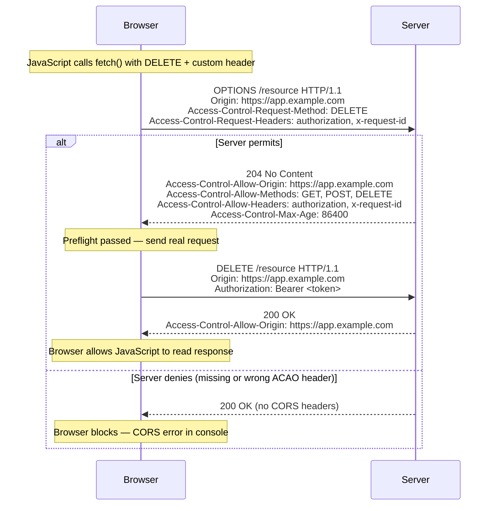

# [BEE-2004] CORS and Same-Origin Policy

:::info
Same-Origin Policy is the browser's primary defense against cross-site request attacks. CORS is the standardized mechanism for controlled relaxation of that policy — and misconfiguring it is one of the most common ways to accidentally reopen the door.
:::

## Context

Modern web applications routinely load resources from multiple origins: APIs on different subdomains, third-party analytics, CDN assets. Browsers enforce the **Same-Origin Policy (SOP)** to prevent malicious pages from reading sensitive responses. CORS — Cross-Origin Resource Sharing — provides a structured, header-based protocol for servers to declare which cross-origin requests they trust.

Reference specifications:
- MDN Web Docs — CORS: https://developer.mozilla.org/en-US/docs/Web/HTTP/CORS
- WHATWG Fetch Standard, CORS section: https://fetch.spec.whatwg.org/#http-cors-protocol
- RFC 6454 — The Web Origin Concept: https://datatracker.ietf.org/doc/html/rfc6454
- PortSwigger Web Security — CORS: https://portswigger.net/web-security/cors

## Principle

**Implement the narrowest CORS policy your application requires, validate every origin before reflecting it, and never mistake CORS for a server-side security control — it only constrains browser-side reads.**

---

## Same-Origin Policy

A browser enforces SOP on every HTTP request initiated by JavaScript. Two URLs are **same-origin** only when all three of the following match exactly:

| Component | Example |
|-----------|---------|
| Scheme    | `https` |
| Host      | `api.example.com` |
| Port      | `443` (default for HTTPS) |

Any deviation — `http` vs `https`, `example.com` vs `api.example.com`, port `3000` vs `443` — makes the request cross-origin, and the browser will block JavaScript from reading the response unless the server explicitly permits it via CORS headers.

What SOP protects against: a malicious page at `evil.com` cannot silently read the authenticated response from `bank.com/account` even if the user is logged in, because the browser blocks the read.

What SOP does **not** protect against: the browser still *sends* the request. SOP blocks the *read*, not the *send*. This distinction matters for state-changing endpoints (see preflight, below).

---

## CORS as a Controlled Relaxation

CORS adds a negotiation layer on top of SOP. The browser includes an `Origin` header on cross-origin requests; the server responds with `Access-Control-*` headers that declare what it permits. If the server's response does not grant permission, the browser blocks JavaScript from accessing the response body.

CORS is enforced by the **browser** on behalf of the user. A server cannot bypass a browser's enforcement, and a non-browser client (curl, server-to-server) is unaffected by CORS headers. CORS is **not** a server authentication mechanism.

---

## Simple vs. Preflighted Requests

### Simple Requests

A request is "simple" (no preflight) when it meets all of:
- Method: `GET`, `HEAD`, or `POST`
- Headers: only CORS-safelisted headers (`Accept`, `Accept-Language`, `Content-Language`, `Content-Type` with MIME limited to `application/x-www-form-urlencoded`, `multipart/form-data`, or `text/plain`)
- No `ReadableStream` body, no upload event listeners

Simple requests are sent immediately; the browser checks the response headers after receiving them.

### Preflighted Requests

Any request that falls outside the simple criteria triggers a preflight: an `OPTIONS` request that asks the server for permission **before** sending the real request. Triggers include:
- Methods other than GET/HEAD/POST (e.g., `PUT`, `DELETE`, `PATCH`)
- Custom request headers (e.g., `Authorization`, `X-Request-ID`)
- `Content-Type: application/json`

### Preflight Flow



The preflight response can be cached by the browser for `Access-Control-Max-Age` seconds (default: 5 seconds; Firefox caps at 86400s, Chrome at 7200s).

---

## Access-Control-* Headers Reference

### Response Headers (server → browser)

| Header | Purpose |
|--------|---------|
| `Access-Control-Allow-Origin` | Which origin(s) may read the response. Either `*` or an exact origin. |
| `Access-Control-Allow-Methods` | HTTP methods permitted for the actual request. |
| `Access-Control-Allow-Headers` | Request headers the browser is allowed to send. |
| `Access-Control-Allow-Credentials` | Set to `true` to permit cookies, `Authorization` headers, and TLS client certs. |
| `Access-Control-Expose-Headers` | Response headers that JavaScript is allowed to read (beyond the default safelisted set). |
| `Access-Control-Max-Age` | How many seconds the preflight response may be cached. |

### Request Headers (browser → server)

| Header | Purpose |
|--------|---------|
| `Origin` | The origin of the initiating page. Sent automatically by the browser. |
| `Access-Control-Request-Method` | (Preflight only) The method of the intended actual request. |
| `Access-Control-Request-Headers` | (Preflight only) The custom headers of the intended actual request. |

---

## Wildcard (`*`) Limitations

Using `Access-Control-Allow-Origin: *` means any origin can read the response. This is appropriate only for **truly public, unauthenticated** resources.

The wildcard `*` cannot be used in combination with credentials. When a request includes `credentials: 'include'` (cookies, `Authorization` headers), the browser **requires** an explicit origin in `Access-Control-Allow-Origin`, not `*`. Using `*` alongside `Access-Control-Allow-Credentials: true` causes the browser to reject the response.

The restriction extends to other wildcard values:
- `Access-Control-Allow-Headers: *` does not cover `Authorization` — that must be listed explicitly.
- `Access-Control-Allow-Methods: *` and `Access-Control-Expose-Headers: *` are similarly restricted for credentialed requests.

---

## The `Vary: Origin` Header

When a server dynamically selects which origin to reflect (rather than always returning `*`), the response must include:

```http
Vary: Origin
```

Without this, a CDN or shared cache may store the response for origin A and serve it to origin B, which either leaks data or breaks legitimate cross-origin access. `Vary: Origin` instructs caches to key responses by the value of the `Origin` request header.

---

## Configuration Examples

### Scenario 1 — Public API (wildcard, no credentials)

```http
# Request
GET /public/data HTTP/1.1
Host: api.example.com
Origin: https://third-party-app.com

# Response
HTTP/1.1 200 OK
Access-Control-Allow-Origin: *
Content-Type: application/json
```

Appropriate for: public data endpoints (weather, exchange rates, open datasets) that require no authentication and return no user-specific data.

### Scenario 2 — Credentialed Cross-Origin Request

```http
# Request
GET /user/profile HTTP/1.1
Host: api.example.com
Origin: https://app.example.com
Cookie: session=abc123

# Response
HTTP/1.1 200 OK
Access-Control-Allow-Origin: https://app.example.com
Access-Control-Allow-Credentials: true
Vary: Origin
Content-Type: application/json
```

The server must return the specific requesting origin, not `*`. `Vary: Origin` ensures the cache does not serve this response to other origins.

### Scenario 3 — Restricting to Known Origins

Server-side logic (pseudo-code):

```python
ALLOWED_ORIGINS = {
    "https://app.example.com",
    "https://admin.example.com",
}

def add_cors_headers(request, response):
    origin = request.headers.get("Origin", "")
    if origin in ALLOWED_ORIGINS:
        response.headers["Access-Control-Allow-Origin"] = origin
        response.headers["Vary"] = "Origin"
    # If origin not in allowlist: omit the header — browser will block
```

Corresponding preflight response headers:

```http
HTTP/1.1 204 No Content
Access-Control-Allow-Origin: https://app.example.com
Access-Control-Allow-Methods: GET, POST, PUT, DELETE, OPTIONS
Access-Control-Allow-Headers: content-type, authorization, x-request-id
Access-Control-Allow-Credentials: true
Access-Control-Max-Age: 3600
Vary: Origin
```

---

## Common Misconfigurations

### 1. Reflecting `Origin` Without Validation

```python
# Dangerous — do not do this
response.headers["Access-Control-Allow-Origin"] = request.headers.get("Origin")
```

An attacker at `evil.com` sends a request with `Origin: evil.com`. The server reflects it back, granting `evil.com` read access. If the endpoint also sets `Access-Control-Allow-Credentials: true`, the attacker can steal session cookies or tokens from logged-in users.

Always validate the origin against an explicit allowlist before reflecting it.

### 2. Wildcard with Credentials

```http
# Browser rejects this combination
Access-Control-Allow-Origin: *
Access-Control-Allow-Credentials: true
```

This is invalid per the CORS specification. Browsers will block the response and raise a CORS error. The fix is to specify the exact allowed origin.

### 3. Missing `Vary: Origin`

When the server conditionally reflects origins, omitting `Vary: Origin` creates caching hazards. A CDN may cache a response permitting `https://app.example.com` and then serve it to requests from `https://attacker.com` — either leaking data or blocking legitimate users depending on the cached value.

### 4. Only Handling Preflight on Some Methods

Some frameworks automatically handle `OPTIONS` for `GET`/`POST` but forget `PUT`, `PATCH`, `DELETE`. If the preflight for `DELETE /resource` receives a 405 or no CORS headers, the browser blocks the real request, even if the server would have accepted it.

Ensure the `OPTIONS` handler returns CORS headers for all methods your API supports.

### 5. Assuming CORS Prevents Server-Side Requests

CORS is enforced by the browser. Any server-to-server call, `curl` command, Postman request, or attacker-controlled script running outside a browser bypasses CORS entirely. CORS is **not** an authentication or authorization control. Protect sensitive endpoints with proper authentication (Bearer tokens, mTLS) regardless of CORS policy.

### 6. Whitelisting `null` Origin

Some configurations allowlist `null` to support local file development (`file://` origins send `Origin: null`). Sandboxed iframes and certain redirects also produce `null` origins, meaning an attacker can construct a page that generates a `null` origin request and receive the permissive response.

### 7. Overly Broad Domain Matching

Using regex or string matching like `endsWith("example.com")` can authorize unintended origins:
- `evil-example.com` matches `endsWith("example.com")`
- `notexample.com` matches `includes("example.com")`

Always use exact-match comparison against a set of known-good origins.

---

## Related BEPs

- [BEE-2001](owasp-top-10-for-backend.md) — OWASP Top 10 for Backend: CORS misconfiguration contributes to broken access control (A01) and security misconfiguration (A05).
- [BEE-3001](../networking-fundamentals/tcp-ip-and-the-network-stack.md) — Networking Fundamentals: TCP/IP and HTTP request routing context.
- [BEE-3002](../networking-fundamentals/dns-resolution.md) — HTTP Semantics: Request methods, status codes, and header conventions that underpin CORS behavior.
