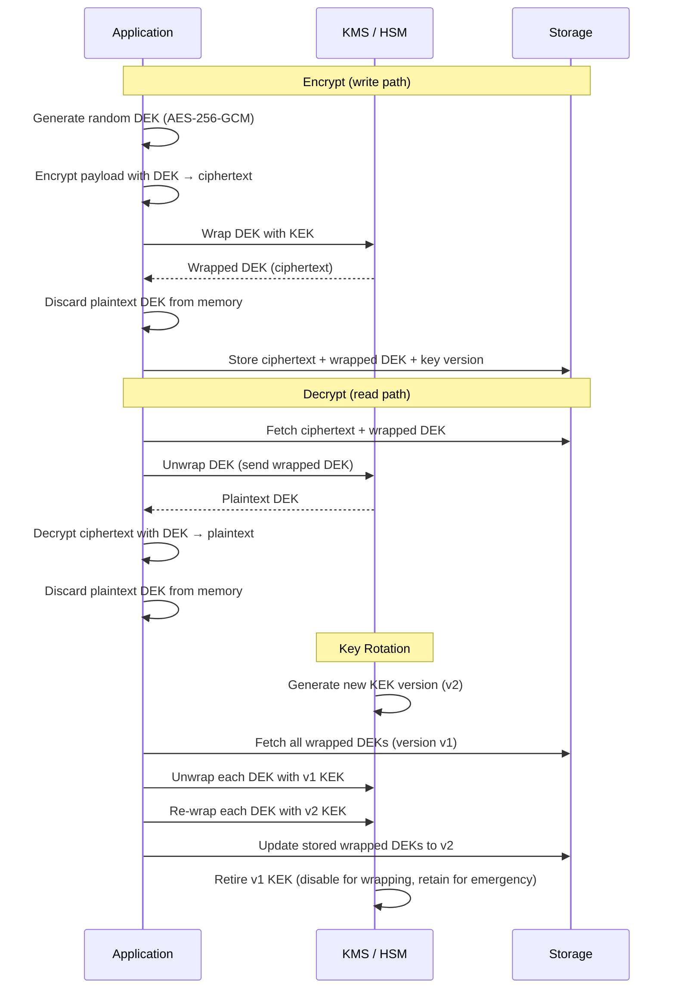

# [BEE-2010] Cryptographic Key Management and Key Rotation

:::info
Cryptographic key management is the discipline of generating, distributing, storing, using, rotating, and destroying encryption keys — the keys are as sensitive as the data they protect, and their lifecycle determines the real-world security of any encryption scheme.
:::

## Context

Encryption is only as strong as the protection of its keys. An attacker who obtains a plaintext encryption key can decrypt every byte of data ever protected by it, regardless of algorithm strength. The algorithm is rarely the failure mode in real-world breaches — the key management is.

NIST SP 800-57 Part 1 ("Recommendation for Key Management"), first published in 2006 and revised through Revision 5 (2020), is the authoritative standard for key management practices. It defines key lifecycle stages, cryptoperiods (how long each key type remains valid), key types, and requirements for the cryptographic modules that must generate and store them. Every major cloud KMS, HSM vendor, and enterprise security framework traces its key management requirements back to SP 800-57.

The practical failures are consistent. The 2022–2023 LastPass and GoTo breaches share the same root failure: an encryption key was stored in the same access scope as the data it protected. In the GoTo breach, attackers exfiltrated encrypted customer backup archives from a third-party cloud storage provider — along with the encryption key for those archives, which was accessible via the same compromised credential. The encryption provided zero protection because the key and the ciphertext were co-located. The LastPass incident followed a similar pattern across two stages of escalation, ultimately because production master keys were reachable from a personal device without HSM enforcement.

BEE-2005 (Cryptographic Basics for Engineers) covers algorithm selection — which cipher, which mode, which key size. This article covers what happens after the algorithm is chosen: how keys are generated, who holds them, how long they live, and how they change without disrupting the system.

## Design Thinking

The central insight of key management is that **the confidentiality of a secret is its own lifecycle problem**. A key exposed at generation (via a weak PRNG) is compromised before it is ever used. A key stored in plaintext on disk is compromised whenever the disk is accessible. A key that never rotates remains valid for any attacker who obtained it — months or years after the initial breach.

Two design decisions shape a key management architecture:

**1. Key hierarchy depth.** A flat architecture uses one key to encrypt all data — simple to implement, catastrophic blast radius on compromise. A two-level hierarchy (Data Encryption Key / Key Encryption Key, or DEK/KEK) separates the key that touches data from the key that is trusted to protect other keys. This allows rotating the root without re-encrypting data. A three-level hierarchy (root of trust → KEK → DEK) adds an HSM-backed root that never leaves hardware. Depth adds operational complexity; it also contains the blast radius.

**2. Key ownership.** Who controls the Key Encryption Key determines the blast radius of a breach and the compliance obligations of the service. A service-controlled KEK means the service operator can read any customer data. A customer-controlled KEK (BYOK — Bring Your Own Key) means the customer can revoke their KEK, permanently preventing the service from decrypting their data. BYOK satisfies GDPR right-to-erasure requirements without deleting records.

## Best Practices

### Generate Keys Inside Cryptographic Modules

**MUST generate keys inside a FIPS 140-2 Level 2 (or Level 3) validated module** — an HSM or cloud KMS hardware partition. The module's random number generator is validated; application-layer `rand()` calls are not. A key generated from a weak PRNG is compromised before it is ever used.

**MUST NOT hard-code cryptographic keys in source code, configuration files, or binary artifacts** (CWE-321). A hard-coded key is recovered by anyone who reads the source, decompiles the binary, or dumps the process image. The 2024 PKfail disclosure found that test AMI Secure Boot keys — explicitly labeled "DO NOT TRUST" — had been shipped in production firmware across an estimated 10% of devices. This is CWE-321 at firmware scale.

### Use Envelope Encryption (DEK/KEK Hierarchy)

For encrypting user data or database fields, **SHOULD use envelope encryption** rather than encrypting directly with the KMS:

1. Generate a random Data Encryption Key (DEK) — AES-256-GCM — locally or inside a trusted execution environment.
2. Encrypt the payload with the DEK.
3. Send the DEK to the KMS for wrapping (encryption under the Key Encryption Key). The KMS returns the wrapped DEK.
4. Store the encrypted payload alongside the wrapped DEK. Discard the plaintext DEK from memory.
5. At decryption: send the wrapped DEK to the KMS → receive plaintext DEK → decrypt payload → discard DEK immediately.

This pattern solves two problems. First, it removes the 64 KiB payload limit that AWS KMS, Google Cloud KMS, and most HSMs impose on direct encrypt/decrypt operations — the KMS only sees a 32-byte DEK, not the data. Second, it makes key rotation independent of the data: rotating the KEK requires re-wrapping DEKs, not re-encrypting data. The data remains encrypted under its DEK; only the DEK's wrapper changes.

**MUST NOT use the KMS for direct data encryption when payloads exceed a few kilobytes.** Besides the size limit, each direct KMS call adds 2–10 ms of latency and an API cost. A database with millions of rows cannot call the KMS per row on every query.

### Enforce Cryptoperiods

NIST SP 800-57 defines cryptoperiods — the maximum time interval a key may be used for a given purpose. These are not advisory; exceeding a cryptoperiod means the statistical probability of key material exposure has accumulated beyond the designed-for risk threshold.

| Key type | Max cryptoperiod (NIST SP 800-57 Rev. 5) |
|---|---|
| Symmetric data encryption key (originator use) | 2 years |
| Symmetric data encryption key (recipient use) | 5 years |
| Private key — digital signatures | 1–3 years |
| Private key — key agreement | 1–2 years |
| Symmetric authentication key (MAC) | 1 year |
| Ephemeral key agreement key | One transaction |

**MUST enforce automated rotation on cryptoperiod expiration.** Manual rotation is a process, not a control — it will be skipped under operational pressure. All major KMS platforms support automatic rotation schedules: AWS Customer Managed Keys rotate annually by default (configurable); AWS Managed Keys rotate on a mandatory annual schedule; HashiCorp Vault Transit supports `auto_rotate_period` down to 1 hour.

**SHOULD track key version metadata** alongside every piece of encrypted data — which key ID and which key version encrypted this ciphertext. Without this, rotation requires re-encrypting everything to know which ciphertext uses which version.

### Maintain Key Separation

**MUST use each key for only one purpose.** A key used for both encryption and signing simultaneously weakens both security properties — a cryptanalytic attack on the signing usage may reveal information about the encryption key material. Separate keys must exist for: data encryption, data signing, transport (TLS session keys), authentication tokens, and backup encryption. Cross-purpose keys also make blast radius assessment after compromise impossible.

**MUST use separate keys per data classification tier.** PII and non-PII should be encrypted under different DEKs. Highly regulated data (PHI, financial records) should be encrypted under a dedicated KEK with stricter access controls and audit logging than the general-purpose KEK.

### Store Keys Outside the Data They Protect

**MUST NOT store encryption keys in the same system, same bucket, or same credential scope as the data they protect.** This is the exact failure in the GoTo breach: backup archives and the key to decrypt those archives were accessible to the same attacker via the same compromised credential. The encryption was rendered completely ineffective.

Correct separation:
- Data in a relational database → KEK in the cloud KMS (not in the database, not in the database's credential scope)
- Data in cloud object storage → KEK in a separate KMS account or tenant
- Backup archive → backup encryption key stored in a separate key escrow system with separate access control, not in the same backup archive

### Use Encryption-as-a-Service for Applications

**SHOULD design applications to never hold raw key material at runtime.** Instead of fetching a key and encrypting locally, call a cryptographic service that performs the operation and returns ciphertext:

- HashiCorp Vault Transit Engine: application calls `POST /transit/encrypt/{key-name}` with plaintext, receives ciphertext. The key never leaves the Vault server.
- AWS KMS `GenerateDataKey` API: receive the plaintext DEK and the wrapped DEK. Encrypt data locally with the plaintext DEK, discard it, store the wrapped DEK. Applications touch a short-lived plaintext key but never the KEK.
- Google Cloud KMS symmetric encryption: same pattern as AWS.

This pattern constrains plaintext key exposure to a single decrypt operation in a process's memory — the key is never persisted.

### Plan for Rotation on Breach

**MUST define and document a key rotation procedure for compromise scenarios before a breach occurs.** Rotation-on-breach is different from scheduled rotation:

1. **Immediately disable** the compromised key version (not delete — existing ciphertext still needs to be decryptable during re-wrapping).
2. **Generate a new key version** and make it the active wrapping key.
3. **Re-wrap all DEKs** encrypted under the compromised version. This requires a background job that decrypts each wrapped DEK using the compromised key version (which is disabled but still usable for decryption) and re-wraps it under the new version.
4. **Retire the compromised version** once all DEKs have been re-wrapped and verified.
5. **Assess data exposure**: which records were encrypted under a DEK that the attacker may have unwrapped using the compromised KEK?

Without this procedure documented and tested, teams will improvise under pressure — and improvised key management produces additional vulnerabilities.

### Cryptographic Erasure

Key destruction is a compliance-grade data deletion mechanism. **MAY use per-record or per-tenant DEK destruction to implement GDPR right-to-erasure without physical deletion.**

When a DEK is destroyed, all data encrypted under that DEK becomes permanently inaccessible — it is cryptographically erased. The ciphertext records remain in the database, but they are computationally indistinguishable from random bytes. This approach satisfies erasure obligations for systems where physical deletion of records is operationally difficult (archived logs, backup tapes, eventually consistent distributed stores).

Preconditions: each user's or tenant's data must be encrypted under a dedicated DEK (not a shared DEK). If a DEK is shared across users, destroying it erases all of them simultaneously.

## Visual

## Common Mistakes

**Encrypting all data under one global DEK.** One key, one catastrophic failure mode. A single DEK compromise — or a single rotation event — affects every record in the system. Compartmentalize DEKs by record, by user, or at minimum by data classification tier.

**Setting a rotation schedule but never verifying rotation happened.** KMS rotation schedules can fail silently if automation breaks, if the KMS service has an outage during the rotation window, or if the configuration is changed. Rotation MUST be monitored: assert on key version metadata. Alert if any key exceeds its cryptoperiod.

**Deleting old key versions immediately after rotation.** Any ciphertext encrypted under the old version becomes permanently unreadable. DEKs re-wrapped under the new version are safe to have their old wrapped copies discarded, but the KEK version must remain available for decryption until every DEK has been re-wrapped and verified.

**Storing key material in environment variables in plaintext.** Environment variables are visible to every process running under the same user, to process listing tools, and are frequently logged in crash reports and orchestration platform logs. Use the KMS API at runtime, not environment variable injection, for key material.

**Using database-level encryption as a substitute for application-level key management.** Transparent Data Encryption (TDE) protects data at rest from storage-level attackers (stolen disks, backup tapes). It does not protect from attackers who have database access credentials — the database engine decrypts transparently. Application-level encryption under keys the database engine cannot access is required for database-level threat isolation.

## Related BEEs

- [BEE-2003](secrets-management.md) -- Secrets Management: runtime injection of secrets (passwords, tokens) into processes; this article covers cryptographic key lifecycle which goes beyond secrets injection
- [BEE-2005](cryptographic-basics-for-engineers.md) -- Cryptographic Basics for Engineers: algorithm and mode selection; this article covers what happens after the algorithm is chosen — key lifecycle management
- [BEE-2009](http-security-headers.md) -- HTTP Security Headers: TLS and HSTS protect transport keys; application-layer key management protects data keys
- [BEE-2007](zero-trust-security-architecture.md) -- Zero-Trust Security Architecture: key management is a component of zero-trust; identity-based access to KMS operations replaces network-perimeter trust

## References

- [NIST SP 800-57 Part 1 Rev. 5: Recommendation for Key Management — NIST (2020)](https://csrc.nist.gov/pubs/sp/800/57/pt1/r5/final)
- [OWASP Key Management Cheat Sheet — OWASP](https://cheatsheetseries.owasp.org/cheatsheets/Key_Management_Cheat_Sheet.html)
- [OWASP Cryptographic Storage Cheat Sheet — OWASP](https://cheatsheetseries.owasp.org/cheatsheets/Cryptographic_Storage_Cheat_Sheet.html)
- [Envelope Encryption — Google Cloud KMS](https://docs.cloud.google.com/kms/docs/envelope-encryption)
- [AWS KMS Concepts — AWS](https://docs.aws.amazon.com/kms/latest/developerguide/concepts.html)
- [Transit Secrets Engine — HashiCorp Vault](https://developer.hashicorp.com/vault/docs/secrets/transit)
- [CWE-321: Use of Hard-coded Cryptographic Key — MITRE](https://cwe.mitre.org/data/definitions/321.html)
- [GoTo says hackers stole customers' backups and encryption key — BleepingComputer (2023)](https://www.bleepingcomputer.com/news/security/goto-says-hackers-stole-customers-backups-and-encryption-key/)
