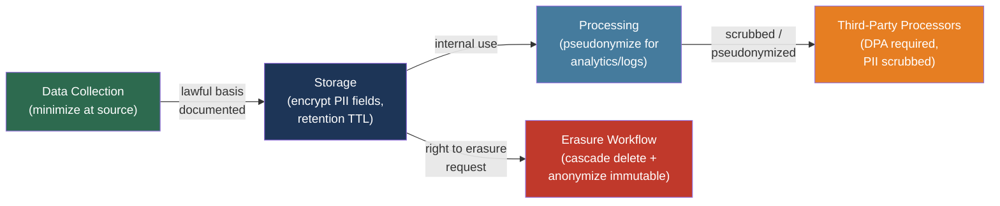

# [BEE-501] Data Privacy and PII Handling

:::info
Handling Personally Identifiable Information (PII) correctly means collecting only what you need, protecting it in transit and at rest, scrubbing it from logs, and deleting it on demand — not as an afterthought, but as an engineering constraint baked into every system that touches user data.
:::

## Context

Privacy regulation transformed from compliance paperwork into an engineering constraint when the European Union's General Data Protection Regulation came into force on 25 May 2018. GDPR applies to any organization processing personal data of EU residents, regardless of where the organization is headquartered. It introduced fines of up to 4% of global annual turnover and created a set of enforceable individual rights — including the right to erasure — that require explicit engineering implementation. The California Consumer Privacy Act (CCPA, effective January 2020) followed with similar rights for California residents, and the pattern has since spread: Brazil's LGPD, Canada's PIPEDA, and state-level laws across the United States establish that privacy obligations are now global for any product with meaningful user adoption.

The enforcement record is concrete. Meta's WhatsApp was fined €225 million in 2021 for inadequate transparency about how PII was processed and transferred. Meta received a record €1.2 billion fine in 2023 for unlawfully transferring EU user data to the United States without a valid legal mechanism. British Airways was fined £20 million (reduced from £183 million) for a breach that exposed 400,000 customers' payment card data due to inadequate security controls. TikTok was fined €345 million in 2023 for setting teen accounts to public by default. These are not edge-case legal disputes: they are engineering decisions — what to log, how to transmit data, what default settings to ship — resulting in nine-figure penalties.

NIST Special Publication 800-122 defines PII as "any information which can be used to distinguish or trace the identity of an individual, either alone or when combined with other personal or identifying information which is linked or linkable to a specific individual." This definition has a critical implication for backend engineers: PII is not just name and SSN. It includes any data that becomes identifying when combined with other data — the quasi-identifier problem.

## PII Classification

Understanding what qualifies as PII determines which engineering controls apply.

**Direct identifiers** are sufficient alone to identify a person: full name, email address, phone number, government-issued ID numbers (SSN, passport, driver's license), biometric data (fingerprints, facial recognition scans), and account identifiers that map to a specific individual.

**Indirect identifiers (quasi-identifiers)** cannot identify alone but enable re-identification when combined. A 1997 study by Latanya Sweeney demonstrated that 87% of Americans could be uniquely identified using only zip code, birth date, and sex — three fields that individually seem innocuous. IP addresses, device IDs, browser fingerprints, precise GPS coordinates, and behavioral event sequences all fall here. Treating indirect identifiers as non-PII is a common and consequential mistake.

GDPR Article 9 defines special categories of personal data requiring heightened protection and explicit consent: health data, genetic data, biometric data used for identification, racial or ethnic origin, political opinions, religious beliefs, trade union membership, and data concerning sexual orientation. These categories require additional controls — Data Protection Impact Assessments, explicit consent (not just legitimate interest), and stricter access controls — beyond what applies to ordinary PII.

## Design Thinking

Two distinctions shape every privacy engineering decision:

**Pseudonymization vs. anonymization.** GDPR Article 4(5) defines pseudonymization as processing personal data in such a manner that it can no longer be attributed to a specific individual without additional information — kept separately and subject to technical measures that prevent re-attribution. Pseudonymized data is *still* personal data under GDPR. If you replace a user's email with a UUID and keep the mapping in a separate table, the data is pseudonymized: it reduces exposure but all GDPR obligations remain. Anonymized data — from which re-identification is genuinely impossible, including from indirect identifier combinations — falls outside GDPR's scope. True anonymization is significantly harder than it appears; most "anonymized" datasets are pseudonymized.

**Controller vs. processor.** A data controller decides why and how personal data is processed and bears primary GDPR liability. A data processor handles data on behalf of and under instruction from a controller. When you integrate Datadog for log aggregation, Sentry for error tracking, or Mixpanel for analytics, you remain the controller and those vendors become processors. Every PII you send to a processor is subject to GDPR regardless of where the processor is located.

## Best Practices

### Know and Document Every PII Field

**MUST maintain a data inventory** — a record of every field that contains or can contain PII, which table or store holds it, what lawful basis justifies its collection, and what retention period applies. GDPR Article 30 requires controllers to maintain records of processing activities. Beyond compliance, the inventory is an engineering artifact: you cannot delete data you do not know you have, and you cannot scrub logs of fields you have not identified.

Classification schema to apply to every table:

| Field | PII Type | Lawful Basis | Retention | Encryption Required |
|-------|----------|--------------|-----------|---------------------|
| `email` | Direct identifier | Contract | Account lifetime | Yes |
| `ip_address` | Quasi-identifier | Legitimate interest | 90 days | No |
| `full_name` | Direct identifier | Contract | Account lifetime | Yes |
| `stripe_customer_id` | Pseudonym (external) | Contract | Account lifetime | No |
| `session_id` | Pseudonym | Contract | 30 days | No |

### Scrub PII from Logs

**MUST NOT write PII to application logs.** Logs are retained for 30–90 days, accessed by multiple teams (on-call engineers, security auditors, SRE), and frequently shipped to third-party log aggregators (Datadog, Splunk, Loggly) that become data processors. A structured log line with `user_email` in it is a data transfer to every downstream system that receives those logs.

The pattern: log internal identifiers (user ID, order ID, trace ID), never display names, email addresses, phone numbers, or payment details:

```python
import logging
import re

# BAD: PII in logs
logger.info("Processing order for user %s <%s>", user.name, user.email)

# GOOD: internal identifiers only
logger.info("Processing order", extra={
    "user_id": user.id,          # internal opaque identifier
    "order_id": order.id,
    "trace_id": request.trace_id,
})
```

For log pipelines that process existing logs, add a scrubbing middleware that matches known PII patterns before shipping to aggregators:

```python
EMAIL_PATTERN = re.compile(r'[a-zA-Z0-9._%+\-]+@[a-zA-Z0-9.\-]+\.[a-zA-Z]{2,}')

def scrub_pii(record: dict) -> dict:
    """Replace email patterns in log message with [REDACTED]."""
    record['message'] = EMAIL_PATTERN.sub('[REDACTED]', record.get('message', ''))
    return record
```

Error tracking services (Sentry, Rollbar) capture full stack traces and local variable values at the point of exception. Variable values frequently contain PII — a user object, a request body, a database row. Configure these services to scrub sensitive fields before transmission, or use a Data Processing Agreement and Sentry's data scrubbing rules.

### Apply Field-Level Encryption to Sensitive PII Columns

**SHOULD encrypt PII columns at the field level** for data classified as requiring high protection (health data, payment data, government IDs, biometrics). Disk-level encryption (Transparent Data Encryption) protects against storage media theft but not against a compromised database user or application. Field-level encryption means the ciphertext is stored in the database; an attacker who reads the column gets encrypted bytes, not plaintext:

```sql
-- PostgreSQL with pgcrypto: encrypt before insert
INSERT INTO users (id, email_encrypted, name_encrypted)
VALUES (
    gen_random_uuid(),
    pgp_sym_encrypt('user@example.com', current_setting('app.pii_key')),
    pgp_sym_encrypt('Alice Smith', current_setting('app.pii_key'))
);

-- Decrypt on read
SELECT
    id,
    pgp_sym_decrypt(email_encrypted::bytea, current_setting('app.pii_key')) AS email,
    pgp_sym_decrypt(name_encrypted::bytea, current_setting('app.pii_key')) AS name
FROM users
WHERE id = $1;
```

Manage encryption keys outside the database — in a dedicated secrets manager (AWS KMS, HashiCorp Vault, GCP Cloud KMS). Never store the key in the database alongside the data it encrypts; the key and the ciphertext together are equivalent to plaintext.

Field-level encryption has real costs: encrypted columns cannot be indexed for full-text search, range queries become impossible, and every read incurs decryption overhead. Design data access patterns around these constraints before adopting field-level encryption.

### Implement the Right to Erasure

**MUST implement a verifiable deletion workflow** that handles erasure requests under GDPR Article 17 or CCPA. The engineering challenge is that user data does not live in one place — it is scattered across transactional databases, event stores, search indexes, caches, audit logs, backup archives, and third-party processors.

The decision tree for each data store:

```
Is the data in a mutable store (RDBMS, document DB)?
  → Cascade delete the user record and all related records with foreign keys
  → Use ON DELETE CASCADE constraints to enforce referential integrity

Is the data in an immutable/append-only store (event log, audit log, data warehouse)?
  → Anonymize: replace PII fields with a deterministic hash or NULL
  → Never delete immutable records for legal/audit purposes; erasure = PII removal

Is the data in a derived store (search index, cache, materialized view)?
  → Rebuild or invalidate after the primary deletion completes

Is the data in a backup?
  → Document your backup retention policy in your privacy notice
  → Backups will contain the data until the backup expires and is purged
  → Typically acceptable: document the retention window (e.g., "deleted within 30 days of backup expiry")

Is the data at a third-party processor?
  → Trigger deletion via the processor's API or deletion workflow per the DPA
```

Tracking erasure requests requires its own audit record that survives the deletion:

```sql
-- Erasure request log (does NOT contain the deleted PII)
CREATE TABLE erasure_requests (
    id          UUID PRIMARY KEY DEFAULT gen_random_uuid(),
    subject_id  UUID NOT NULL,          -- the internal ID of the deleted subject
    requested_at TIMESTAMPTZ NOT NULL,
    completed_at TIMESTAMPTZ,
    status      TEXT NOT NULL DEFAULT 'pending', -- pending | completed | failed
    scope       TEXT[] NOT NULL         -- which stores were cleared
);
```

### Apply Data Minimization

**SHOULD NOT collect PII that serves no documented, current purpose.** Data minimization is GDPR Article 5(1)(c) — data must be "adequate, relevant, and limited to what is necessary." The engineering translation: before adding a field to a user record or event payload, answer: what feature uses this? If the answer is "might be useful later," do not collect it.

Attach TTL-based expiry to time-limited data at creation, not as a cleanup job added months later:

```sql
-- Session tokens: expire automatically
CREATE TABLE sessions (
    id          UUID PRIMARY KEY,
    user_id     UUID NOT NULL REFERENCES users(id) ON DELETE CASCADE,
    created_at  TIMESTAMPTZ NOT NULL DEFAULT now(),
    expires_at  TIMESTAMPTZ NOT NULL DEFAULT now() + INTERVAL '30 days'
);

-- Scheduled cleanup (pg_cron, cloud scheduler)
DELETE FROM sessions WHERE expires_at < now();
```

**SHOULD anonymize analytics data before warehousing.** If you ship raw user events to a data warehouse (BigQuery, Snowflake), pseudonymize the user identifier at the pipeline layer before the event lands. Replace `user_id` with a consistent HMAC of the user ID:

```python
import hmac, hashlib

def pseudonymize_user_id(user_id: str, secret_key: bytes) -> str:
    """Consistent pseudonym for analytics — not reversible without the key."""
    return hmac.new(secret_key, user_id.encode(), hashlib.sha256).hexdigest()
```

The pseudonym allows per-user analytics while separating the analytics store from the identity store.

### Require Data Processing Agreements Before Sending PII to Third Parties

**MUST NOT send PII to a third-party vendor without a signed Data Processing Agreement.** Every log line with an email address, every error report with a user ID, every analytics event with a device fingerprint is a transfer to a data processor. GDPR Article 28 requires that processors handle data only under the controller's instructions and with appropriate safeguards. A signed DPA is evidence of that contract.

The practical checklist before enabling a new vendor integration:

1. Map what PII the integration would receive (log fields, request context, event attributes)
2. Check whether the vendor offers a standard DPA (AWS, GCP, Datadog, Sentry all do)
3. Sign the DPA before enabling data flow
4. Document the vendor in your processing activities record (GDPR Article 30)
5. Verify the vendor has a lawful international transfer mechanism if they process data outside the EU (Standard Contractual Clauses or equivalent)

The engineering shortcut that eliminates many DPA complications: scrub PII before sending to third parties. Logs without email addresses, error reports without user names, and analytics without direct identifiers remove or substantially reduce the GDPR obligations on the receiving vendor.

## Visual



## Related BEEs

- [BEE-2003](secrets-management.md) -- Secrets Management: encryption keys for PII fields are secrets and must be managed accordingly — never stored alongside the data they protect
- [BEE-19041](../distributed-systems/soft-deletes-and-data-retention.md) -- Soft Deletes and Data Retention: soft deletes alone do not satisfy the right to erasure — a soft-deleted record still contains PII; the deletion workflow must remove or anonymize the PII fields
- [BEE-19043](../distributed-systems/audit-logging-architecture.md) -- Audit Logging Architecture: audit logs must record erasure requests without retaining the PII that was erased; design the audit schema to reference internal IDs, not personal data
- [BEE-18007](../multi-tenancy/database-row-level-security.md) -- Database Row-Level Security: RLS can enforce that application users can only read their own PII rows, reducing the blast radius of a BOLA vulnerability on PII data
- [BEE-7004](../data-modeling/encoding-and-serialization-formats.md) -- Encoding and Serialization Formats: serialization libraries that include all object fields by default can accidentally expose PII in API responses — use explicit field allow-lists

## References

- [GDPR Article 5 — Principles relating to processing of personal data — gdpr-info.eu](https://gdpr-info.eu/art-5-gdpr/)
- [GDPR Article 17 — Right to erasure ('right to be forgotten') — gdpr-info.eu](https://gdpr-info.eu/art-17-gdpr/)
- [ICO. Data minimisation — ico.org.uk](https://ico.org.uk/for-organisations/uk-gdpr-guidance-and-resources/data-protection-principles/a-guide-to-the-data-protection-principles/data-minimisation/)
- [ICO. Pseudonymisation — ico.org.uk](https://ico.org.uk/for-organisations/uk-gdpr-guidance-and-resources/data-sharing/anonymisation/pseudonymisation/)
- [ICO. Controllers and processors — ico.org.uk](https://ico.org.uk/for-organisations/uk-gdpr-guidance-and-resources/controllers-and-processors/controllers-and-processors/what-are-controllers-and-processors/)
- [ICO. Right to erasure — ico.org.uk](https://ico.org.uk/for-organisations/uk-gdpr-guidance-and-resources/individual-rights/individual-rights/right-to-erasure/)
- [California Attorney General. California Consumer Privacy Act — oag.ca.gov](https://oag.ca.gov/privacy/ccpa)
- [NIST. SP 800-122: Guide to Protecting the Confidentiality of Personally Identifiable Information — csrc.nist.gov](https://csrc.nist.gov/pubs/sp/800/122/final)
- [GDPR Enforcement Tracker — enforcementtracker.com](https://www.enforcementtracker.com/)
- [Latanya Sweeney. Simple Demographics Often Identify People Uniquely — Carnegie Mellon University, 2000](https://dataprivacylab.org/projects/identifiability/paper1.pdf)
- [Piiano. Why Spilling PII to Logs Is Dangerous — piiano.com](https://www.piiano.com/blog/spilling-pii)
