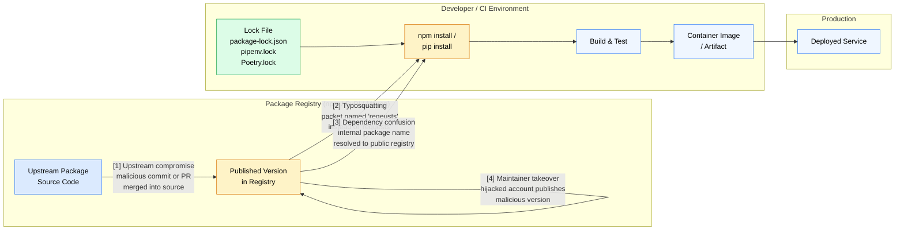

# [BEE-2006] Dependency Security and Supply Chain

:::info
Third-party dependencies extend your attack surface far beyond the code you write. Lock files, vulnerability scanning, Software Bill of Materials (SBOM), and a disciplined update strategy are the first-line controls against supply chain compromise.
:::

## Context

Modern backend services are not built from scratch. A typical Node.js or Python service may directly declare 30–80 dependencies, each of which pulls in its own transitive graph. The resulting dependency tree can contain hundreds or thousands of distinct packages, most written by authors the team has never met, hosted on registries the team does not control.

This is the supply chain. It is an attack surface.

Three real-world incidents illustrate the range of failure modes:

- **event-stream (2018)** — An attacker socially engineered the original maintainer of a heavily downloaded npm package into transferring ownership, then injected code that targeted cryptocurrency wallet credentials in applications using the `copay-dash` library. The malicious version went undetected for weeks. Reference: https://es-incident.github.io/paper.html
- **ua-parser-js (2021)** — An attacker hijacked the npm account of the `ua-parser-js` maintainer (7 million weekly downloads) and published three malicious versions that installed a crypto-miner and a credential stealer on developer machines and CI runners. Reference: https://www.truesec.com/hub/blog/uaparser-js-npm-package-supply-chain-attack-impact-and-response
- **colors.js (2022)** — The original maintainer deliberately introduced an infinite loop into version 1.4.44-liberty-2 as a political protest. This was not an external compromise; it demonstrated that even a legitimate, trusted maintainer is a single point of failure. Reference: https://www.rescana.com/post/in-depth-analysis-supply-chain-poisoning-of-popular-npm-packages-exploiting-event-stream-ua-parser

These incidents are not theoretical edge cases. They affect packages with tens of millions of weekly downloads.

Authoritative frameworks that address this threat:

- OWASP A06:2021 — Vulnerable and Outdated Components: https://owasp.org/Top10/A06_2021-Vulnerable_and_Outdated_Components/
- OWASP Component Analysis: https://owasp.org/www-community/Component_Analysis
- NIST SP 800-218 — Secure Software Development Framework (SSDF): https://csrc.nist.gov/projects/ssdf
- SLSA (Supply-chain Levels for Software Artifacts): https://slsa.dev/

## Principle

**Treat every dependency as untrusted code that you are choosing to execute in production. Maintain a complete inventory, scan continuously for known vulnerabilities, pin or lock versions for reproducibility, and apply the minimal dependency principle — add a package only when the cost of owning it forever is worth the benefit.**


## Attack Vectors

Supply chain attacks enter the pipeline at different stages. Understanding where each vector lands helps apply the right control.



**Vector 1 — Upstream compromise:** Malicious code is merged into the open-source repository itself (via a compromised contributor account, a malicious PR accepted by an inattentive maintainer, or a build system compromise). The package is published legitimately from a poisoned source.

**Vector 2 — Typosquatting:** An attacker publishes a package whose name closely resembles a popular package (`reqeusts`, `crypt0`, `lodahs`). A typo in a `requirements.txt` or a copy-paste error installs the attacker's package.

**Vector 3 — Dependency confusion:** A company uses an internal package registry with private package names. An attacker publishes a public package with the same name at a higher version number. Package managers that check public registries first resolve the public (malicious) version instead of the internal one.

**Vector 4 — Maintainer takeover:** An attacker compromises the credentials of a legitimate package maintainer and publishes a new version with malicious additions. The package name, publisher account, and version bump all appear normal.


## Lock Files and Reproducible Builds

A lock file records the exact resolved version and integrity hash of every dependency in the tree — direct and transitive — at the time `install` was last run. Without a lock file, re-running `install` a month later may resolve a different transitive version, silently changing the code that runs in production.

Lock files must be:

1. **Committed to the repository.** A lock file that lives only on one developer's machine provides no protection for CI or production.
2. **Treated as authoritative in CI.** Use `npm ci`, `pip install --require-hashes -r requirements.txt`, or `poetry install --no-root` — commands that install *exactly* what the lock file specifies and fail if it is missing or inconsistent.
3. **Reviewed on update.** A pull request that modifies `package-lock.json` or `poetry.lock` contains code changes (new or changed transitive dependencies). Review it as you would application code.

Integrity hashes in lock files (`integrity: sha512-...` in npm, `hash:` in pip-tools) allow the installer to verify that the package content matches what was recorded when the lock was created. If an attacker replaces the content of a published version on a registry, the hash check fails.


## Vulnerability Scanning (SCA)

Software Composition Analysis (SCA) tools compare your dependency inventory against databases of known vulnerabilities (CVE / NVD, GitHub Advisory Database, OSV). The goal is to know, within hours of a vulnerability being published, whether your service is affected.

Scanning must happen at multiple points:

| Stage | Tool examples | What it catches |
|---|---|---|
| Developer machine | `npm audit`, `pip-audit`, `trivy fs` | Known CVEs during development |
| Every CI build | `npm audit --audit-level=high`, Snyk, Dependabot | Regressions introduced by new PRs |
| Scheduled daily scan | Dependabot alerts, Renovate, Snyk monitor | New CVEs against unchanged code |
| Container image scan | Trivy, Grype, Snyk Container | CVEs in OS packages and language runtime layers |

A vulnerability scanner is only as good as the database it queries. Use tools that pull from multiple databases (NVD + GitHub Advisory + OSV) and keep the database updated automatically.

Scanning produces findings; acting on findings is the actual work. Establish a severity-driven SLA:

- **Critical / CVSS ≥ 9.0** — patch or mitigate within 24 hours
- **High / CVSS 7.0–8.9** — patch within 7 days
- **Medium / CVSS 4.0–6.9** — patch within 30 days
- **Low** — track and address in next planned maintenance cycle


## Software Bill of Materials (SBOM)

An SBOM is a formal, machine-readable inventory of all components in a software artifact — name, version, license, supplier, and known vulnerabilities. Common formats are SPDX and CycloneDX.

Why SBOMs matter:

- When a new critical CVE is published (e.g., another Log4Shell-class event), an SBOM lets you immediately query which services are affected rather than auditing each repo manually.
- SBOMs are becoming a compliance requirement. The US Executive Order 14028 (2021) mandates SBOMs for software sold to the federal government. Enterprise customers increasingly request them.
- SBOMs provide the inventory that OWASP A06 and the NIST SSDF both require.

Generate SBOMs as part of the build pipeline using tools such as `syft` (for container images and source trees) or `cdxgen` (for language-specific manifests). Attach the SBOM to the release artifact.


## Typosquatting and Dependency Confusion Prevention

**Typosquatting prevention:**
- Verify package names carefully before adding them to manifests.
- Use the `npm info <package>` or `pip show <package>` commands to confirm publisher identity before adding a new dependency.
- Enable registry audit tools that flag installs of packages with suspicious names relative to your existing manifest.
- Scope internal npm packages with an organization scope (`@mycompany/auth`) — scoped packages cannot be squatted on public registries without access to the scope.

**Dependency confusion prevention:**
- Declare all internal package names in your `.npmrc` or `pip.conf` with an explicit registry URL that points to your internal registry for those names.
- Use a private registry proxy (Artifactory, Nexus, AWS CodeArtifact) configured to block public resolution for names that match internal package patterns.
- Ensure internal package versions are always higher than any version that exists on the public registry. Some teams use an internal version prefix that is semantically higher than any public version (e.g., `1000.x.x`).


## Minimal Dependency Principle

Every dependency you add becomes your responsibility forever. Before adding a package, ask:

1. Could this be implemented with a small, well-understood utility function instead? (The "is-odd" / "left-pad" problem)
2. Is the package actively maintained? Check the last commit date, open issues, and whether the maintainer responds.
3. What is the transitive dependency cost? Run `npm ls --all` or `pipdeptree` to see what you are actually pulling in.
4. What is the license? Copyleft licenses (GPL) may conflict with your distribution model.
5. What is the download and adoption footprint? Packages with very few downloads are less scrutinized by the security community.

A dependency is not free. Its maintenance cost, vulnerability exposure, and license obligations are paid by your team for as long as it is in the tree.


## Update Strategy: Pinning vs. Ranges

**Version ranges** (`^1.2.0`, `~1.2.0`, `>=1.0.0`) allow automated resolution of newer patch or minor versions at install time. They reduce manual update work but introduce non-determinism without a lock file and can pull in breaking changes.

**Version pinning** (`==1.2.3`, exact versions in lock files) guarantees that every install resolves identically. Combined with a lock file, this achieves fully reproducible builds.

The practical recommendation:

- **Always use a lock file** — this provides pinning at the resolved level regardless of what ranges are declared in the manifest.
- In `package.json` / `pyproject.toml`, use ranges with a caret (`^`) for direct dependencies. The lock file pins the actual resolved version. The range tells automated tools (Dependabot, Renovate) what kind of updates to open PRs for.
- **Never use `*` or `>=` without an upper bound** for production dependencies. These ranges express "any version ever published," which includes future versions with breaking changes or injected malware.
- For infrastructure-critical packages (language runtime, web framework, ORM), consider tighter pinning (`~1.2.0` rather than `^1.0.0`) to reduce the blast radius of automated updates.

**Automated vs. manual updates:**

| Approach | Pros | Cons |
|---|---|---|
| Automated PRs (Dependabot / Renovate) | Continuous, low-friction, catches CVEs quickly | Requires CI discipline; high volume of PRs if not tuned |
| Manual scheduled updates | Full human review of each change | Easy to fall months behind; CVEs go unpatched |
| Recommended: automated PRs + CI required checks | Both speed and safety | Requires investment in test coverage |

Automated update tools open PRs; your CI pipeline is what validates them. The quality of your test suite directly determines how confidently you can merge dependency updates.


## Example: Audit Workflow and Dependency Confusion

### Audit Workflow

The following pseudocode describes a complete dependency audit cycle for a Node.js service:

```
# Step 1: Ensure the lock file is authoritative
npm ci                        # Install exactly what the lock file specifies
                              # Fails if package-lock.json is missing or out of sync

# Step 2: Scan for known CVEs
npm audit --json > audit.json
# or: npx better-npm-audit audit --level high

# Step 3: Review advisories
# For each finding in audit.json:
#   - Check CVSS score and affected version range
#   - Check whether your code exercises the vulnerable code path (reachability)
#   - Determine if a fixed version is available
#   - Check if the fix introduces breaking changes (semver major bump)

# Step 4: Update affected packages
npm update <package>          # Resolves to latest compatible version within declared range
npm install <package>@<safe>  # Pin to specific safe version if range is not enough

# Step 5: Verify tests pass
npm test
npm run integration-test      # SCA findings are not complete without regression validation

# Step 6: Commit the updated lock file
git add package-lock.json
git commit -m "chore(deps): patch CVE-2024-XXXX in <package>"

# Step 7: Re-run scan to confirm the advisory is resolved
npm audit --audit-level=high  # Should exit 0 (no findings at or above threshold)
```

### Dependency Confusion Attack and Prevention

**Scenario:** Your company uses an internal npm package named `@myco/config-loader`. An attacker discovers this name from a leaked `package.json` or a public GitHub repository and publishes a public package at `https://registry.npmjs.org/@myco/config-loader` at version `99.0.0` (higher than your internal `1.4.2`).

```
# VULNERABLE: .npmrc has no explicit scope registry for @myco
# npm resolves @myco/config-loader from the public registry
# because 99.0.0 > 1.4.2

# npm install output:
# + @myco/config-loader@99.0.0  <-- malicious public version installed

# PREVENTION: pin the scope to the internal registry in .npmrc
@myco:registry=https://npm.internal.mycompany.com/

# With this in .npmrc, npm will ONLY resolve @myco/* packages
# from the internal registry, ignoring the public registry entirely.
# Version 99.0.0 on npm.org is never consulted.
```

Additional defense: configure the internal registry to block incoming requests for names under your internal scopes. Even if `.npmrc` is misconfigured, the internal registry refuses to proxy-fetch names it owns.


## Common Mistakes

**1. Not committing the lock file.**

The lock file is not a generated artifact to be ignored in `.gitignore`. It is a security control. Without it, `npm install` in CI may resolve a different (potentially malicious or vulnerable) version than what the developer tested locally.

**2. Using `*` or overly broad version ranges.**

`"my-lib": "*"` or `"my-lib": ">=1.0.0"` installs whatever is newest at the time of install. A future malicious version or a version with a critical CVE will be pulled in automatically with no review.

**3. Never running an audit.**

Many teams add dependencies during development and never run `npm audit` or equivalent. Vulnerabilities accumulate. The first time the team runs a scan is often during a security incident or compliance audit, at which point the backlog is overwhelming.

**4. Trusting transitive dependencies without review.**

A direct dependency with a clean audit result can pull in a transitive dependency with critical CVEs. SCA tools scan the full tree. Review findings for all levels of the tree, not just direct dependencies.

**5. Not monitoring for new vulnerabilities after deployment.**

A dependency that was clean at deploy time may have a CVE published the following week. Vulnerability management is not a one-time gate at CI — it requires continuous monitoring against the deployed artifact's SBOM throughout its lifetime in production.


## Related BEPs

- [BEE-2001: OWASP Top 10 for Backend](owasp-top-10-for-backend.md) — A06 Vulnerable and Outdated Components in context of the full Top 10
- [BEE-2002: Secrets Management](input-validation-and-sanitization.md) — credential leaks via compromised dependencies
- [BEE-16006: Pipeline Design](../cicd-devops/pipeline-design.md) — CI/CD pipeline security controls and artifact signing

## References

- OWASP, "A06:2021 — Vulnerable and Outdated Components". https://owasp.org/Top10/A06_2021-Vulnerable_and_Outdated_Components/
- OWASP, "Component Analysis". https://owasp.org/www-community/Component_Analysis
- NIST, "Secure Software Development Framework (SSDF) — SP 800-218". https://csrc.nist.gov/projects/ssdf
- OpenSSF, "SLSA — Supply-chain Levels for Software Artifacts". https://slsa.dev/
- Truesec, "ua-parser-js npm Package Supply Chain Attack". https://www.truesec.com/hub/blog/uaparser-js-npm-package-supply-chain-attack-impact-and-response
- Rescana, "In-Depth Analysis: Supply Chain Poisoning of Popular npm Packages". https://www.rescana.com/post/in-depth-analysis-supply-chain-poisoning-of-popular-npm-packages-exploiting-event-stream-ua-parser
- GitHub, "A Systematic Analysis of the Event-Stream Incident". https://es-incident.github.io/paper.html
- Chainguard, "Implementing Secure Software Supply Chain Security Controls: Understanding NIST SSDF and SLSA Frameworks". https://blog.chainguard.dev/implementing-secure-software-supply-chain-security-controls-understanding-nist-ssdf-slsa-frameworks/
