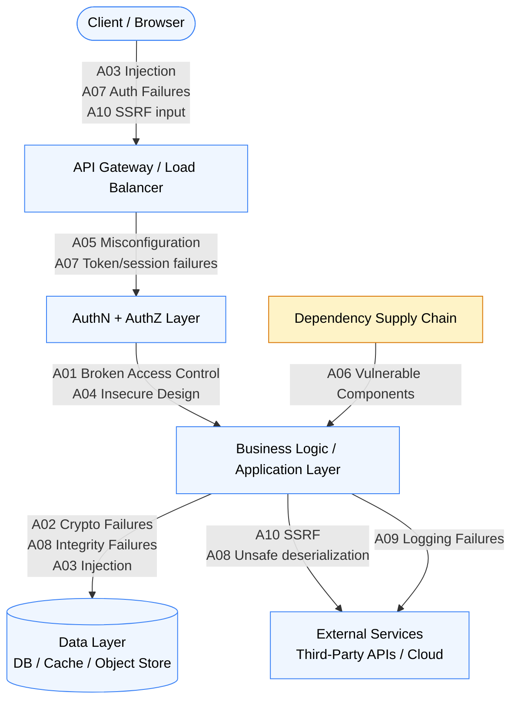

# [BEE-2001] OWASP Top 10 for Backend

:::info
The OWASP Top 10 is the industry-standard catalogue of the most critical web application security risks. Every backend engineer should understand each category, where it manifests in a typical system, and the first-line defense against it.
:::

## Context

Security vulnerabilities are not random accidents. The same classes of weaknesses have appeared in production systems for decades because they reflect predictable mistakes in design, implementation, and operations. OWASP (Open Web Application Security Project) periodically aggregates data from thousands of real-world assessments and publishes ranked lists of the highest-impact categories.

Three complementary lists form the practical foundation:

- **OWASP Top 10 (2021 edition)** — ranks the most critical web application vulnerabilities. https://owasp.org/Top10/
- **OWASP API Security Top 10 (2023 edition)** — focuses on API-specific risks that differ from, or extend, the web Top 10. https://owasp.org/API-Security/editions/2023/en/0x00-header/
- **CWE/SANS Top 25 (2023)** — enumerates the most dangerous software weaknesses at the code level, maintained by MITRE. https://cwe.mitre.org/top25/archive/2023/2023_top25_list.html

These lists are not checklists to tick once. They describe the *shape* of the attack surface. Understanding the shape enables teams to build layered defenses rather than patching individual symptoms.

## Principle

**Security is layers, not a gate.** No single control stops all attacks. The practice of defense-in-depth places independent security controls at every layer — input validation, authentication, authorization, encryption, dependency hygiene, logging — so that a failure at one layer does not automatically mean a breach.

Security is also a continuous process, not a one-time audit. Threat modeling, secure code review, automated scanning, and runtime monitoring must all be integrated into the normal development lifecycle.

## The OWASP Top 10 (2021): Backend Relevance

### A01 — Broken Access Control

Access control enforces that authenticated users can only perform operations and access data they are explicitly permitted to. Failures include:

- Accessing another user's data by manipulating an object ID in the URL (IDOR — Insecure Direct Object Reference)
- Accessing admin functions by changing a role claim in a JWT that is not server-side verified
- Bypassing access control by calling API endpoints directly (missing enforcement on the server)

Backend relevance: access control must be enforced server-side on every request. See [BEE-1001](../auth/authentication-vs-authorization.md).

### A02 — Cryptographic Failures

Sensitive data — passwords, tokens, PII, financial data — is exposed due to weak or missing cryptography. Common causes:

- Transmitting data over HTTP rather than HTTPS
- Storing passwords with weak or unsalted hashes (MD5, SHA-1)
- Using deprecated algorithms (3DES, RC4) or short key lengths
- Generating cryptographic material with a non-cryptographic PRNG

Backend relevance: every data-at-rest and data-in-transit decision involves cryptography. See [BEE-2005](cryptographic-basics-for-engineers.md).

### A03 — Injection

User-supplied input is interpreted as code or commands by a downstream interpreter (SQL, NoSQL, LDAP, OS shell, expression language). The interpreter cannot distinguish attacker-controlled data from trusted commands.

Classic forms: SQL injection, NoSQL injection, command injection, LDAP injection, template injection.

Backend relevance: injection attacks target the data layer and any system call that constructs commands from input. See [BEE-2002](input-validation-and-sanitization.md).

### A04 — Insecure Design

A category introduced in 2021 that captures architectural-level failures that no amount of hardened implementation can fix. Examples include:

- A password reset flow that allows an attacker to predict the reset token
- A business logic that allows infinite retries without rate limiting
- A design where all microservices share the same admin credential

Backend relevance: threat modeling during design — before code is written — is the only control for this category.

### A05 — Security Misconfiguration

Default credentials, overly permissive CORS policies, verbose error messages with stack traces, enabled debug endpoints, unnecessary features left on — all qualify. Misconfiguration is the most prevalent category across the web Top 10.

Backend relevance: configuration must be audited per environment. Production and development configs must differ. See [BEE-2004](cors-and-same-origin-policy.md) for CORS specifics.

### A06 — Vulnerable and Outdated Components

Applications pull in dozens of third-party libraries. A known vulnerability in any of them is an exploitable vulnerability in your application, even if your own code is perfect. Log4Shell (CVE-2021-44228) is the canonical example: a critical JNDI injection in a ubiquitous Java logging library.

Backend relevance: dependency inventory, automated vulnerability scanning, and timely patching are non-negotiable. See [BEE-2006](dependency-security-and-supply-chain.md).

### A07 — Identification and Authentication Failures

Weak authentication mechanisms allow attackers to compromise credentials or session tokens:

- Allowing brute-force attacks due to no rate limiting or account lockout
- Accepting weak or commonly-used passwords
- Using insecure session ID generation or storing tokens in insecure locations
- Not invalidating server-side sessions on logout

Backend relevance: authentication is the first security gate; failures here bypass all downstream controls.

### A08 — Software and Data Integrity Failures

New in 2021. Covers failure to verify the integrity of software updates, critical data, and CI/CD pipeline artifacts. Includes insecure deserialization — an application deserializes attacker-controlled data from an untrusted source, which can lead to remote code execution.

Backend relevance: sign and verify build artifacts; do not deserialize untrusted data into objects; protect the CI/CD pipeline.

### A09 — Security Logging and Monitoring Failures

Without adequate logging, security events are invisible. Without monitoring, even rich logs go unread. Failures include:

- Not logging authentication events (successes and failures)
- Not logging access control failures
- Storing logs only locally (attacker can delete them)
- Not alerting on detectable attack patterns

Backend relevance: logs are the raw material of incident response. If a breach is not discovered until weeks later — or not at all — insufficient logging is usually why.

### A10 — Server-Side Request Forgery (SSRF)

The application fetches a remote resource using a URL supplied or influenced by the user, without validating the destination. An attacker redirects the server's outbound request to:

- Internal services not exposed to the internet (e.g., `http://169.254.169.254/` for cloud metadata)
- Other backend microservices behind the firewall
- Local filesystem paths in some URL-handling libraries

SSRF is particularly dangerous in cloud environments where the metadata endpoint contains credentials.

## Visual: Attack Surface Map

The following diagram shows where each OWASP Top 10 category targets a typical backend architecture.



No vulnerability class targets a single layer. Broken access control, for example, can be exploited at the API gateway (missing auth), at the business logic layer (no ownership check), or directly at the data layer (insufficient row-level security).

## Example: Top 5 Critical Items

### A01 — Broken Access Control (IDOR)

**Attack scenario:** A user retrieves their invoice by calling `GET /invoices/1042`. By changing the ID to `1041`, they retrieve another user's invoice — the server does not check ownership.

```
# VULNERABLE
function get_invoice(request):
    invoice_id = request.params["id"]
    invoice = db.query("SELECT * FROM invoices WHERE id = ?", invoice_id)
    return invoice   # No ownership check

# DEFENSE: enforce ownership at query time
function get_invoice(request):
    principal = require_authenticated_principal(request)  # raises 401 if not authed
    invoice_id = request.params["id"]
    invoice = db.query(
        "SELECT * FROM invoices WHERE id = ? AND owner_id = ?",
        invoice_id,
        principal.user_id
    )
    if invoice is null:
        return response(404, "Not found")   # Same response for missing or unauthorized
    return invoice
```

The defense binds the resource query to the authenticated principal. 404 is returned for both "does not exist" and "belongs to someone else" to avoid leaking existence information.

### A02 — Cryptographic Failures (Plaintext Password Storage)

**Attack scenario:** The database is breached. Password hashes are stored as MD5, allowing the attacker to crack all common passwords within hours.

```
# VULNERABLE
function register(username, password):
    hash = md5(password)
    db.insert("INSERT INTO users (username, password_hash) VALUES (?, ?)", username, hash)

# DEFENSE: use a purpose-built password hashing algorithm
function register(username, password):
    # bcrypt / argon2id / scrypt — all are intentionally slow and include a salt
    hash = argon2id.hash(password, memory=65536, iterations=3, parallelism=4)
    db.insert("INSERT INTO users (username, password_hash) VALUES (?, ?)", username, hash)

function verify_password(username, candidate_password):
    row = db.query("SELECT password_hash FROM users WHERE username = ?", username)
    if row is null:
        argon2id.hash(candidate_password)  # Constant-time dummy work to prevent timing oracle
        return false
    return argon2id.verify(row.password_hash, candidate_password)
```

### A03 — Injection (SQL Injection)

**Attack scenario:** An attacker passes `' OR '1'='1` as the username field, causing the query to return all users.

```
# VULNERABLE
function find_user(username):
    query = "SELECT * FROM users WHERE username = '" + username + "'"
    return db.raw_query(query)

# DEFENSE: parameterized queries (prepared statements)
function find_user(username):
    return db.query("SELECT * FROM users WHERE username = ?", username)
    # The driver sends the query and data separately.
    # The DB treats the parameter as data, never as SQL syntax.
```

The same pattern applies to NoSQL injection, LDAP injection, and OS command injection — never concatenate user-supplied input into a command string.

### A05 — Security Misconfiguration (Verbose Error Leakage)

**Attack scenario:** An unhandled exception returns a full stack trace in the HTTP response body, revealing internal file paths, library versions, and database query structure to the attacker.

```
# VULNERABLE
function handle(request):
    try:
        result = process(request)
        return response(200, result)
    except Exception as e:
        return response(500, str(e))   # Stack trace sent to client

# DEFENSE: log internally, return generic message externally
function handle(request):
    try:
        result = process(request)
        return response(200, result)
    except Exception as e:
        error_id = generate_uuid()
        logger.error("Unhandled exception", error_id=error_id, exception=e, request=request)
        return response(500, {"error": "Internal error", "trace_id": error_id})
        # trace_id lets operators correlate logs; attacker gets nothing useful
```

### A10 — Server-Side Request Forgery (SSRF)

**Attack scenario:** An image proxy endpoint accepts a URL parameter and fetches the content server-side. An attacker passes `http://169.254.169.254/latest/meta-data/iam/security-credentials/` to retrieve cloud IAM credentials.

```
# VULNERABLE
function proxy_image(request):
    url = request.params["url"]
    content = http.get(url)
    return response(200, content, content_type="image/png")

# DEFENSE: allowlist scheme, host, and optionally path
ALLOWED_IMAGE_HOSTS = {"images.example.com", "cdn.partner.com"}

function proxy_image(request):
    raw_url = request.params["url"]
    parsed  = url.parse(raw_url)

    if parsed.scheme not in ("https",):
        return response(400, "Only HTTPS URLs are allowed")

    if parsed.hostname not in ALLOWLIST_IMAGE_HOSTS:
        return response(400, "Host not permitted")

    # Resolve the hostname here before connecting to prevent DNS rebinding
    ip = dns.resolve(parsed.hostname)
    if is_private_or_loopback(ip):
        return response(400, "Private addresses not permitted")

    content = http.get(raw_url, timeout=5)
    return response(200, content, content_type="image/png")
```

## Security as a Continuous Process

Defeating the OWASP Top 10 is not accomplished by a single sprint. The following practices must be integrated into normal engineering work:

| Practice | Frequency | Purpose |
|---|---|---|
| Threat modeling | Per significant design change | Identify A04-class design flaws before code is written |
| Secure code review | Every PR | Catch A01, A02, A03, A08 in the code |
| Static analysis (SAST) | Every CI build | Automated detection of injection, crypto, and deserialization patterns |
| Dependency audit (SCA) | Daily / every build | Catch A06 — known CVEs in dependencies |
| Dynamic analysis (DAST) | Per release candidate | Probe running application for A05, A01, A10 |
| Penetration testing | At least annually | Adversarial validation of all categories |
| Security monitoring + alerting | Continuous | Detect A09 failures and active exploitation |

## How the API Security Top 10 (2023) Complements the Web Top 10

The API Security Top 10 addresses risks that are specific to, or more pronounced in, API contexts:

- **API1 — Broken Object Level Authorization (BOLA)** — the API equivalent of IDOR (A01), but more common in APIs because every resource typically has a directly addressable ID
- **API2 — Broken Authentication** — overlaps with A07, but highlights token leakage and missing authentication on some API versions
- **API3 — Broken Object Property Level Authorization** — users can read or write individual object fields they should not access, even if they can legitimately access the parent object
- **API4 — Unrestricted Resource Consumption** — rate limiting and resource quotas are frequently absent from internal APIs; missing them enables denial-of-wallet and DoS
- **API5 — Broken Function Level Authorization** — administrative or privileged functions are exposed in the same API surface without separate authorization gates
- **API6 — Unrestricted Access to Sensitive Business Flows** — APIs expose business logic (e.g., "apply coupon", "reserve ticket") that can be abused at machine speed without per-flow rate limiting
- **API7 — Server Side Request Forgery** — same as A10, but more common in API integrations
- **API8 — Security Misconfiguration** — same as A05, highlighted because APIs often have more configuration surface (versioning, documentation endpoints, GraphQL introspection)
- **API9 — Improper Inventory Management** — outdated API versions and shadow APIs (undocumented endpoints) remain accessible long after they should be retired
- **API10 — Unsafe Consumption of APIs** — the application itself calls third-party APIs without input validation on the response, trusting external data unconditionally

The practical difference: the Web Top 10 focuses on web application endpoints consumed by browsers, while the API Security Top 10 focuses on machine-to-machine API endpoints where automation, scale, and direct object access create distinct risk profiles.

## Common Mistakes

**1. Treating security as a one-time checklist.**

Running a scanner before a release and calling the system "secure" ignores new vulnerabilities, configuration drift, and newly introduced code. Security controls must be continuously validated.

**2. Only defending against injection while ignoring access control.**

Many teams have strong input validation but weak authorization. A01 (Broken Access Control) has ranked first since 2021. A SQL-injection-free API that leaks other users' data through IDOR is still severely broken.

**3. Security through obscurity.**

Hiding an API endpoint (undocumented, unusual path, internal subdomain) is not an access control mechanism. Attackers discover endpoints through content discovery, source code leaks, and JavaScript analysis. Every endpoint must enforce authentication and authorization regardless of how "hidden" it appears.

**4. Not logging security events.**

An application that does not log authentication failures, access control denials, and input validation rejections cannot detect ongoing attacks. It also cannot support incident response after a breach — "we don't know what they accessed" is a compliance and liability problem, not just a technical one.

**5. Assuming internal services do not need security.**

Microservices on an internal network are not inherently trusted. A compromised service, a misconfigured container, or an SSRF vulnerability in any outward-facing service becomes a lateral movement path. Internal service-to-service calls MUST authenticate and SHOULD authorize.

## Related BEPs

- [BEE-1001: Authentication vs Authorization](../auth/authentication-vs-authorization.md) — foundational access control pipeline (A01, A07)
- [BEE-2002: Input Validation and Sanitization](input-validation-and-sanitization.md) — defending against injection (A03)
- [BEE-2003: Secrets Management](secrets-management.md) — protecting credentials and keys (A02)
- [BEE-2004: CORS and Same-Origin Policy](cors-and-same-origin-policy.md) — browser-side access control configuration (A05)
- [BEE-2005: Cryptographic Basics for Engineers](cryptographic-basics-for-engineers.md) — encryption and hashing fundamentals (A02)
- [BEE-2006: Dependency Security and Supply Chain](dependency-security-and-supply-chain.md) — managing third-party risk (A06)

## References

- OWASP, "Top 10 Web Application Security Risks — 2021 edition". https://owasp.org/Top10/
- OWASP, "API Security Top 10 — 2023 edition". https://owasp.org/API-Security/editions/2023/en/0x00-header/
- MITRE, "2023 CWE Top 25 Most Dangerous Software Weaknesses". https://cwe.mitre.org/top25/archive/2023/2023_top25_list.html
- CISA, "2023 CWE Top 25 Most Dangerous Software Weaknesses" (advisory). https://www.cisa.gov/news-events/alerts/2023/06/29/2023-cwe-top-25-most-dangerous-software-weaknesses
- OWASP, "OWASP Cheat Sheet Series — Authentication". https://cheatsheetseries.owasp.org/cheatsheets/Authentication_Cheat_Sheet.html
- OWASP, "OWASP Cheat Sheet Series — Injection Prevention". https://cheatsheetseries.owasp.org/cheatsheets/Injection_Prevention_Cheat_Sheet.html
