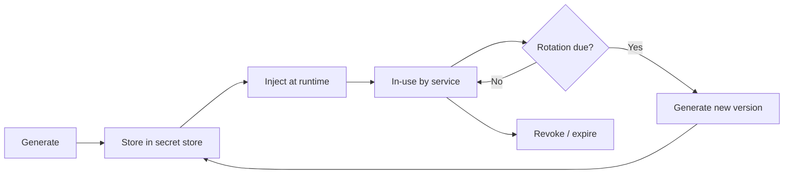

# [BEE-2003] Secrets Management

:::info
What counts as a secret, why hardcoded secrets are dangerous, vault concepts, rotation strategy, least privilege, audit logging, and preventing secret leaks from source control.
:::

## Context

Every backend system depends on credentials it must keep confidential: database passwords, API keys issued by third-party services, TLS private keys, signing keys for JWTs or cookies, encryption keys for data at rest, and service-to-service tokens. These are collectively called **secrets**.

Secrets differ from ordinary configuration values in one critical way: their exposure directly enables unauthorized access or data compromise. A misconfigured feature flag is a bug; a leaked database password is a breach.

Reference standards:

- [OWASP Secrets Management Cheat Sheet](https://cheatsheetseries.owasp.org/cheatsheets/Secrets_Management_Cheat_Sheet.html)
- [12-Factor App — III. Config](https://12factor.net/config)
- [NIST SP 800-57 Part 1 Rev. 5, Recommendation for Key Management](https://csrc.nist.gov/pubs/sp/800/57/pt1/r5/final)

## What Counts as a Secret

| Category | Examples |
|---|---|
| Credentials | Database passwords, LDAP bind passwords, OS service accounts |
| API keys | Third-party service keys, payment gateway tokens, SMS provider keys |
| Cryptographic material | TLS private keys, signing keys, encryption keys, HMAC secrets |
| Infrastructure tokens | Cloud provider access keys, container registry tokens, CI/CD deploy keys |
| Inter-service tokens | Service account JWTs, mTLS certificates, OAuth client secrets |

If its exposure would allow an attacker to access a system, read protected data, or impersonate a legitimate actor, it is a secret and must be treated accordingly.

## Principle

**Secrets must never be stored in source code or version control. They must be centrally managed, injected at runtime, rotated on a schedule, and access to them must be auditable.**

## Secret Lifecycle



Each stage has security obligations:

- **Generate**: Use a cryptographically secure random source. Use the minimum key length recommended by current standards (e.g., NIST SP 800-57).
- **Store**: Keep in a purpose-built secret store, not in application config files, environment files committed to git, or shared spreadsheets.
- **Inject**: Deliver to processes at startup via environment variables populated by the secret store, or via an in-process SDK that fetches and caches secrets. Never bake secrets into container images.
- **Rotate**: Replace secrets on a regular cadence and immediately after a suspected or confirmed compromise. Rotation must be automated to be reliable.
- **Revoke**: When a service is decommissioned, a developer leaves, or a key is suspected compromised, revoke immediately. A secret store with versioning lets you revoke one version while keeping the replacement active.

## Progression: Worst to Best

The following shows three approaches to storing a database password, ordered from highest to lowest risk.

### Approach 1 — Hardcoded (do not do this)

```python
# Risk: CRITICAL
# The secret is in source history forever. Anyone with repo access has it.
DB_PASSWORD = "s3cr3tP@ssw0rd"
conn = connect(password=DB_PASSWORD)
```

**Risk:** The password is committed to version control and visible to every person who has ever cloned the repository. Rotating it requires a code change and a new deployment.

### Approach 2 — Environment variable (better, but incomplete)

```python
# Risk: MEDIUM
# Better: not in source code.
# Remaining risk: .env file may be committed, secret visible in process list,
# no audit trail, no rotation automation.
import os
conn = connect(password=os.environ["DB_PASSWORD"])
```

**Risk:** Environment variables are a clear improvement over hardcoding — the 12-Factor App methodology endorses them as the baseline. However, they rely on operational discipline: the values must come from somewhere secure, `.env` files must never be committed, and there is no built-in rotation or auditing.

### Approach 3 — Secret store with automatic rotation (recommended)

```python
# Risk: LOW
# Secret is fetched at startup from a central store.
# Rotation happens automatically; no code change required.
# Access is gated by IAM policy; all reads are logged.
import secret_client  # abstracted secret store SDK

db_password = secret_client.get_secret("prod/db/password")
conn = connect(password=db_password)
```

**Risk:** The application never stores the secret in code or config files. The secret store handles generation, versioning, rotation, and access control. Every read is logged with the caller's identity.

## Vault / Secret Store Concepts

A secret store is a dedicated system designed around the following properties:

- **Centralized storage**: All secrets live in one auditable location instead of scattered across config files, CI/CD variables, and developer laptops.
- **Access control**: Fine-grained policies govern which service or human identity can read which secret. This enforces least privilege (see below).
- **Versioning**: Multiple versions of a secret can coexist, supporting zero-downtime rotation where the new version is written before the old one is revoked.
- **Automatic rotation**: The store can regenerate and update secrets on a schedule, updating the backing service (e.g., the database) and storing the new value atomically.
- **Audit log**: Every read, write, and delete is recorded with a timestamp and caller identity.
- **Encryption at rest and in transit**: Secrets are encrypted while stored and during delivery.

When evaluating or building such a system, these properties are the checklist, regardless of which product or implementation is used.

## Least Privilege for Secrets

Apply the principle of least privilege at the secret level:

- A payment service needs the payment gateway API key. It does not need the email service SMTP password.
- A read-only reporting service needs a read-only database credential. It does not need the write credential.
- A developer on the frontend team does not need production database credentials.

Implement this by assigning a unique identity (service account, IAM role) to each service and writing access policies that grant only the specific secrets that identity requires. When a service is compromised, blast radius is limited to the secrets it was permitted to read.

## Rotation Strategy

| Secret type | Recommended rotation cadence | Notes |
|---|---|---|
| Service API keys | 90 days or less | Automate via secret store |
| Database credentials | 90 days or less | Requires DB user management integration |
| TLS certificates | Before expiry (automate renewal) | Use short-lived certs (≤90 days) where possible |
| Signing keys (JWT, cookies) | 180 days or on key compromise | Overlap period needed for in-flight tokens |
| Encryption keys | Per policy; consider key versioning rather than rotation | Key rotation for encrypted data requires re-encryption |

Always rotate immediately after:
- A team member with access to the secret leaves the organization.
- A suspected or confirmed security incident.
- A credential is accidentally exposed (logged, committed to git, sent in chat).

## Audit Logging

Every access to a secret must be logged. The log entry must include:

- Timestamp (UTC)
- Caller identity (service name, user, role)
- Secret identifier (not the value)
- Operation (read, write, rotate, revoke)
- Result (success, denied)

This log is your evidence trail for incident response and compliance. Never log the secret value itself — a log entry containing a plaintext credential turns your log aggregation system into a secret store with no access controls.

## Never Log Secrets

Secrets leak into logs more often than developers expect:

```python
# BAD: logs the Authorization header, which may contain a Bearer token
logger.debug(f"Outgoing request headers: {headers}")

# BAD: logs the full request body, which may contain a password field
logger.info(f"Request body: {request.json()}")

# GOOD: log what you need, explicitly excluding sensitive fields
logger.debug("Outgoing request to %s method=%s", url, method)
```

Audit your logging statements for any place that serializes headers, request bodies, environment variables, or configuration dicts. Add a scrubbing layer at the log handler level as a defense-in-depth measure, but do not rely on it as the primary control.

## Preventing Leaks from Source Control

Git history is permanent. A secret committed to a repository remains in history even after it is deleted from the working tree, and must be considered compromised immediately.

### Pre-commit hooks

Use a pre-commit scanning tool to detect common secret patterns before a commit is made. Configure it as a mandatory hook in the repository:

```yaml
# .pre-commit-config.yaml (example structure)
repos:
  - repo: <secret-scanning-hook-source>
    hooks:
      - id: detect-secrets
        name: Detect secrets
        # Scans staged files for API key patterns, high-entropy strings, etc.
```

### .gitignore

Every repository must include entries that prevent common secret-carrying files from being staged:

```gitignore
# Environment files
.env
.env.*
!.env.example

# Credential files
*.pem
*.key
*.p12
*.pfx
credentials.json
secrets.yaml
```

### Provide safe examples

Commit a `.env.example` file that lists all required environment variable names with placeholder values. This documents the required configuration without exposing real secrets.

```bash
# .env.example
DB_HOST=localhost
DB_PORT=5432
DB_PASSWORD=REPLACE_ME
API_KEY=REPLACE_ME
```

### Repository scanning (CI)

Run secret-scanning in CI as a second gate. This catches secrets that were introduced before the pre-commit hook was installed, or that bypassed local hooks.

## Common Mistakes

1. **Hardcoding secrets in source code.** The secret is in every clone of the repository, in every CI artifact, and in version history forever. Rotate immediately if this has occurred.

2. **Committing `.env` files to git.** `.env` files often contain real credentials for development or production environments. Add them to `.gitignore` before the first `git add`.

3. **Sharing secrets via chat or email.** Messaging platforms and email are not access-controlled secret stores. They have logs, backups, and may be searchable by administrators. Use a secret store with a secure sharing mechanism.

4. **No rotation strategy.** Secrets that never rotate accumulate risk indefinitely. A secret in use for three years has had three years of potential exposure. Automate rotation so it actually happens.

5. **Logging request headers containing auth tokens.** `Authorization: Bearer <token>` is a secret. Any log line that captures full HTTP headers will capture credentials. Review debug logging statements carefully before merging.

## Related BEPs

- [BEE-1006: API Keys](../auth/api-key-management.md) — How to design and issue API keys for external consumers.
- [BEE-2005: Cryptography](cryptographic-basics-for-engineers.md) — Key lengths, algorithm selection, and encryption at rest.
- [BEE-2006: Dependency Security](dependency-security-and-supply-chain.md) — Supply chain risks that can expose secrets indirectly.
