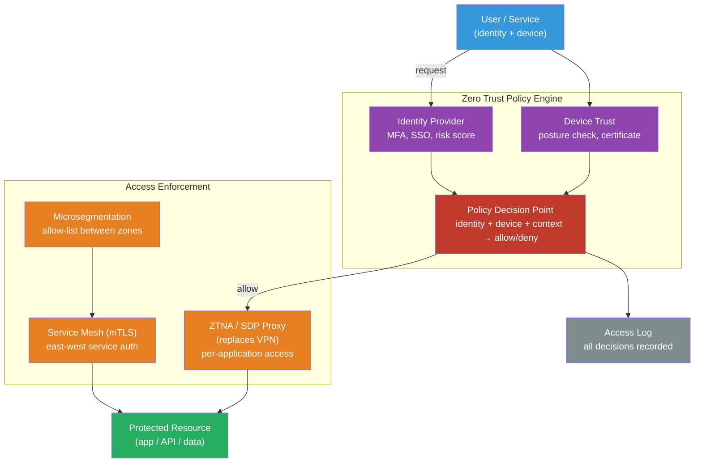

# [BEE-2007] Zero-Trust Security Architecture

:::info
Zero Trust replaces the perimeter security model — "trusted inside, untrusted outside" — with "never trust, always verify": every access request, whether from inside or outside the network, is authenticated, authorized, and continuously validated before access is granted.
:::

## Context

Traditional enterprise security relied on the network perimeter: a firewall separated the trusted internal network from the untrusted internet. Employees inside the perimeter were implicitly trusted. This model was designed for a world of office buildings, desktop workstations, and monolithic on-premises systems.

That world disappeared. Cloud services, remote work, mobile devices, and SaaS applications mean that the "inside" of a network no longer correlates with trustworthiness. A compromised laptop inside the firewall has the same internal access as the legitimate user who carried it in. An attacker who phishes credentials can move laterally across the internal network with minimal resistance.

John Kindervag (Forrester Research) coined the term Zero Trust in 2009, arguing that implicit trust based on network location was fundamentally flawed. The model gained operational proof in 2014 when Google published "BeyondCorp: A New Approach to Enterprise Security" (Rory Ward and Betsy Beyer, USENIX ;login:, December 2014), describing how Google had eliminated its corporate VPN and allowed engineers to work from untrusted networks — authenticated by device state and user identity rather than network position.

The US government formalized Zero Trust in **NIST SP 800-207 "Zero Trust Architecture"** (Scott Rose et al., August 2020), defining it as "an evolving set of cybersecurity paradigms that move defenses from static, network-based perimeters to focus on users, assets, and resources." Federal agencies were mandated to adopt Zero Trust principles by Executive Order 14028 (May 2021), driving adoption across the industry.

## Design Thinking

### The Two Core Principles

**Never trust, always verify**: No access request receives implicit trust based on network location. Every request — from an external user, an internal microservice, or an administrator — is authenticated and authorized against policy before access is granted. Trust is never assumed; it is earned per-request.

**Assume breach**: Design the system as if it has already been compromised. Segment access so that a breach of one component does not cascade. Instrument everything so that breaches are detected quickly. This shift from "prevent all breaches" to "minimize blast radius and detect fast" is the key architectural implication.

### The Five Pillars (CISA Zero Trust Maturity Model v2, 2023)

The CISA Zero Trust Maturity Model defines five pillars, each requiring progressive maturity:

| Pillar | What it secures | Key controls |
|---|---|---|
| **Identity** | Who is accessing | MFA, SSO, conditional access, identity risk scoring |
| **Devices** | What is accessing | Device posture (EDR, patch level, encryption), device certificates |
| **Networks** | How it connects | Microsegmentation, encrypted east-west traffic, ZTNA |
| **Applications & Workloads** | What is being accessed | mTLS between services, workload identity (SPIFFE/SPIRE), least-privilege API scopes |
| **Data** | What is being read/written | Classification, encryption at rest and in transit, DLP, access logging |

### Perimeter Model vs Zero Trust

| Aspect | Perimeter Model | Zero Trust |
|---|---|---|
| Trust basis | Network location | Identity + device posture + context |
| Internal traffic | Trusted by default | Verified per-request |
| Access scope | Network-wide (VPN) | Per-application (ZTNA) |
| Breach impact | Lateral movement unconstrained | Contained by microsegmentation |
| Visibility | Edge-only | Full observability (all access logged) |

## Best Practices

### Identity and Access

**MUST enforce multi-factor authentication for all human access, including internal tools and admin interfaces.** Single-factor passwords are the single most common initial access vector. Hardware security keys (FIDO2/WebAuthn) provide the strongest MFA; TOTP is the minimum acceptable.

**MUST implement least-privilege access as the default.** No user, service, or application should have more access than required to complete its task. Broad roles granted for convenience violate Zero Trust. Use attribute-based access control (ABAC) or fine-grained RBAC to scope permissions precisely.

**MUST require short-lived credentials for service identities.** Long-lived API keys and service account passwords are breach vectors. Use workload identity providers (SPIFFE/SPIRE, cloud IAM with instance metadata) to issue short-lived certificates or tokens that expire in hours, not months.

### Network and Service Communication

**MUST treat east-west (internal service-to-service) traffic as untrusted.** In a traditional perimeter model, traffic between internal services receives no scrutiny. In Zero Trust, every service-to-service call requires authentication. Implement mTLS between services — each side presents a certificate and verifies the other's. Service meshes (Istio, Linkerd) automate this at the infrastructure layer without requiring application code changes.

**SHOULD replace VPN with Zero Trust Network Access (ZTNA) for remote access.** VPN grants network-level access, making everything on the network reachable after authentication. ZTNA grants per-application access: after verifying identity and device posture, the user can reach the specific application they need — nothing more. Cloudflare Access, Zscaler Private Access, and similar ZTNA solutions implement this model.

**SHOULD implement microsegmentation to limit lateral movement.** Divide the network into small zones with explicit allow-lists between them. If service A has no reason to call service B, deny that traffic at the network layer — not just the application layer. A compromised service A then cannot reach service B, limiting the blast radius of the breach.

### Continuous Verification

**SHOULD evaluate device health as part of every access decision.** Device posture — OS patch level, disk encryption, EDR agent status, certificate validity — is a signal in the trust calculation. A user with valid credentials on an unmanaged or compromised device is not a trusted principal. Device trust should be re-evaluated continuously, not just at login.

**MUST log every access decision with sufficient context for forensic reconstruction.** Zero Trust's "assume breach" principle requires the ability to answer: what accessed what, when, from where, with what credentials? Centralized access logs with identity, resource, action, time, source IP, and device ID are non-negotiable. This is the detection capability that makes "assume breach" actionable.

**MAY use continuous access evaluation (CAE) to revoke sessions in near-real-time.** Traditional OAuth tokens remain valid until expiry. CAE allows resource servers to receive immediate revocation signals (account disabled, location change, risk signal) from the identity provider and terminate access within seconds. Microsoft Entra ID and Google Workspace support CAE for their ecosystems.

## Visual



## Example

**mTLS between microservices using SPIFFE/SPIRE workload identity:**

```yaml
# Kubernetes: SPIRE automatically issues SVIDs (SPIFFE Verifiable Identity Documents)
# to workloads, enabling mTLS without application code changes

# spire-server configuration excerpt
apiVersion: v1
kind: ConfigMap
metadata:
  name: spire-server
data:
  server.conf: |
    server {
      bind_address = "0.0.0.0"
      bind_port = "8081"
      trust_domain = "example.org"
      # SVIDs (x.509 certificates) expire in 1 hour
      default_svid_ttl = "1h"
    }

---
# Registration entry: authorize the orders-service workload
# spire-server entry create \
#   -spiffeID spiffe://example.org/orders-service \
#   -parentID spiffe://example.org/k8s-workload-registrar/node \
#   -selector k8s:namespace:production \
#   -selector k8s:sa:orders-service
```

```go
// orders_client.go — fetch SVID from SPIRE agent and use it for mTLS
// In practice, Istio or Linkerd sidecars handle this automatically

import (
    "github.com/spiffe/go-spiffe/v2/spiffetls"
    "github.com/spiffe/go-spiffe/v2/workloadapi"
)

func newMTLSClient(ctx context.Context) (*http.Client, error) {
    // SPIRE agent provides the workload's certificate and private key
    source, err := workloadapi.NewX509Source(ctx)
    if err != nil {
        return nil, err
    }

    // tlsConfig enforces mTLS: client presents its SVID, verifies server's SVID
    // The server must have a SPIFFE ID in the trust domain — IP/hostname not used
    tlsConfig := spiffetls.MTLSClientConfig(
        spiffetls.AuthorizeID(spiffeid.RequireIDFromString("spiffe://example.org/payments-service")),
        source,
    )
    return &http.Client{Transport: &http.Transport{TLSClientConfig: tlsConfig}}, nil
}
// Certificate rotation is automatic — no credential refresh code needed
```

**Istio authorization policy — allowlist between services (microsegmentation):**

```yaml
# Only allow orders-service to call payments-service on POST /charge
# All other callers are denied at the sidecar proxy level (no app code change)
apiVersion: security.istio.io/v1beta1
kind: AuthorizationPolicy
metadata:
  name: payments-service-policy
  namespace: production
spec:
  selector:
    matchLabels:
      app: payments-service
  action: ALLOW
  rules:
    - from:
        - source:
            principals:
              - "cluster.local/ns/production/sa/orders-service"
      to:
        - operation:
            methods: ["POST"]
            paths: ["/charge"]
```

**Conditional access policy (pseudo-code — policy decision point logic):**

```python
# policy_engine.py — evaluate access request against Zero Trust policy
from dataclasses import dataclass
from enum import Enum

class Decision(Enum):
    ALLOW = "allow"
    DENY = "deny"
    STEP_UP = "step_up"  # require additional MFA

@dataclass
class AccessRequest:
    user_id: str
    resource: str
    action: str
    device_posture: dict  # {encrypted: bool, os_patched: bool, edr_active: bool}
    risk_score: float     # 0.0–1.0 from identity provider
    mfa_satisfied: bool

def evaluate(req: AccessRequest) -> Decision:
    # Deny immediately if risk score is critical
    if req.risk_score > 0.8:
        return Decision.DENY

    # Require step-up MFA for sensitive resources on unmanaged devices
    is_managed = req.device_posture.get("edr_active") and req.device_posture.get("encrypted")
    is_sensitive = req.resource.startswith("/admin") or req.action in ("DELETE", "PATCH")

    if is_sensitive and not is_managed:
        return Decision.DENY  # unmanaged device cannot access sensitive resources

    if is_sensitive and not req.mfa_satisfied:
        return Decision.STEP_UP

    # Device must be patched for any access
    if not req.device_posture.get("os_patched"):
        return Decision.DENY

    return Decision.ALLOW
```

## Implementation Notes

**Incremental adoption**: Zero Trust is an architectural direction, not a binary state. NIST SP 800-207 and the CISA maturity model both define maturity levels. Most organizations begin with identity (enforce MFA everywhere, adopt SSO) before moving to network (ZTNA, microsegmentation) and then data (classification, DLP). Attempting to implement all pillars simultaneously is a common failure mode.

**Service mesh vs application-layer mTLS**: Service meshes (Istio, Linkerd) implement mTLS transparently at the sidecar level. Application code neither generates certificates nor verifies them — the sidecar proxy handles the TLS handshake. For teams not on Kubernetes, application-level mTLS using SPIFFE/SPIRE or cloud-native certificate managers (AWS ACM PCA, GCP Certificate Authority Service) achieves the same goal.

**ZTNA and developer experience**: Replacing VPN with ZTNA can improve developer experience: per-application access is faster than VPN tunneling, and split-tunneling eliminates routing all traffic through corporate proxies. However, CI/CD pipelines, infrastructure tooling, and developer machines all require ZTNA client configuration, which is a significant migration effort.

**Logging volume**: Zero Trust's "log everything" requirement generates significant log volume. Access logs for every service-to-service call in a high-traffic microservices system can reach billions of records per day. Implement tiered retention (hot storage for recent logs, cold storage for compliance), structured logging with consistent fields, and automated anomaly detection rather than expecting humans to review raw logs.

## Related BEEs

- [BEE-1001](../auth/authentication-vs-authorization.md) -- Authentication vs Authorization: Zero Trust requires both on every request; understand the distinction before designing Zero Trust policy
- [BEE-1005](../auth/rbac-vs-abac.md) -- RBAC vs ABAC Access Control Models: Zero Trust policies combine user attributes, device posture, and resource sensitivity — ABAC is the natural fit
- [BEE-2005](cryptographic-basics-for-engineers.md) -- Cryptographic Basics for Engineers: mTLS and certificate-based workload identity are the cryptographic foundation of Zero Trust networking
- [BEE-19048](../distributed-systems/service-to-service-authentication.md) -- Service-to-Service Authentication: covers the application-level patterns (JWT, API keys, mTLS) that implement Zero Trust between services
- [BEE-3004](../networking-fundamentals/tls-ssl-handshake.md) -- TLS/SSL Handshake: mTLS extends the standard TLS handshake to require client certificate verification
- [BEE-3007](../networking-fundamentals/mutual-tls-handshake-and-server-configuration.md) -- Mutual TLS Handshake and Server Configuration: deep mechanics of the mTLS handshake and practical server setup; the primitive that enforces east-west zero-trust between services

## References

- [BeyondCorp: A New Approach to Enterprise Security — USENIX (Ward & Beyer, 2014)](https://www.usenix.org/publications/login/dec14/ward)
- [Zero Trust Architecture — NIST SP 800-207 (Rose et al., August 2020)](https://csrc.nist.gov/pubs/sp/800/207/final)
- [Zero Trust Maturity Model v2.0 — CISA (April 2023)](https://www.cisa.gov/zero-trust-maturity-model)
- [What is Zero Trust? — Microsoft Learn](https://learn.microsoft.com/en-us/security/zero-trust/zero-trust-overview)
- [What is ZTNA? — Cloudflare Learning](https://www.cloudflare.com/learning/access-management/what-is-ztna/)
- [SPIFFE/SPIRE — CNCF Workload Identity](https://spiffe.io/)
