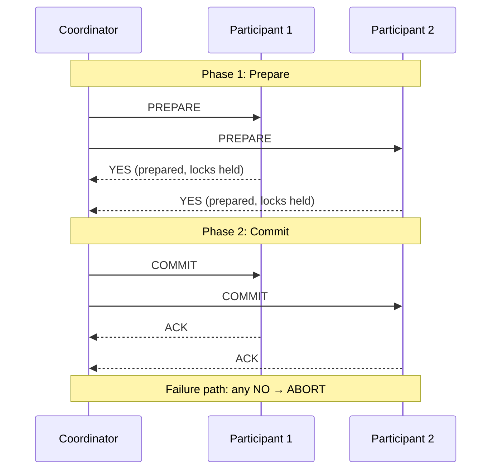
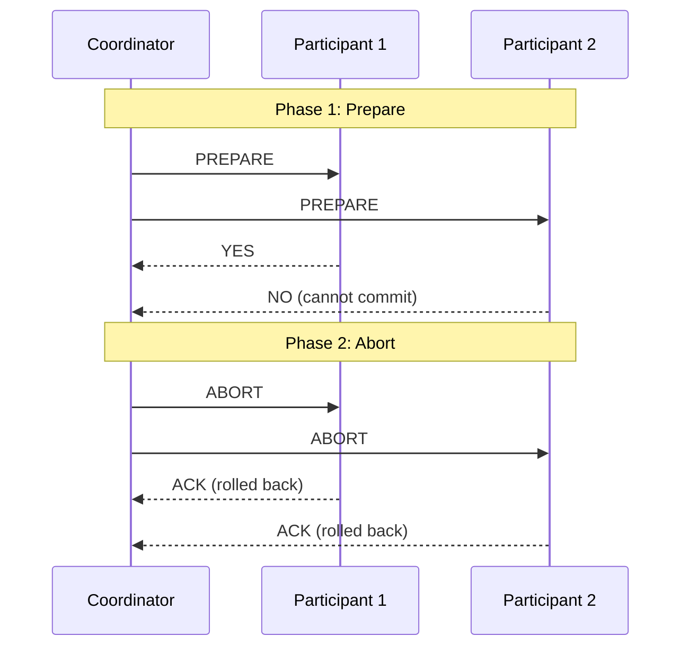

# [BEE-8003] Distributed Transactions and Two-Phase Commit

:::info
Distributed transactions are fundamentally harder than local transactions. Two-phase commit gives you atomicity across nodes -- but at the cost of availability, performance, and operational complexity. Understand the trade-offs before you reach for it.
:::

## Context

Within a single database, transactions are straightforward: the database engine manages locks, write-ahead logs, and rollback in one place under a consistent clock. The moment a transaction must span two databases, two services, or a database and a message broker, the rules change completely.

Three problems make distributed transactions qualitatively harder:

**No shared clock.** There is no global "now" in a distributed system. Each node has its own clock, and clocks drift. Determining the order of events across nodes requires explicit coordination, not timestamps alone.

**Network partitions.** Messages can be delayed, duplicated, or lost. A participant that stops responding may have crashed, or it may still be running and have committed -- you cannot tell from the outside.

**Partial failures.** In a local transaction, the database either commits or rolls back as a unit. Across nodes, Node A can commit while Node B is unreachable. The system ends up in a split state with no automatic resolution.

These are not implementation deficiencies -- they are fundamental properties of distributed systems described in the CAP theorem and the work of Fischer, Lynch, and Paterson (FLP impossibility). Any protocol that promises atomicity across nodes must make explicit choices about what happens when these failure modes occur.

## Two-Phase Commit (2PC)

Two-phase commit is the classic protocol for achieving atomic commitment across multiple participants. It introduces a **coordinator** that orchestrates the decision.

### The Protocol



**If any participant votes NO (or times out):**



### What Each Phase Does

**Phase 1 -- Prepare:**
The coordinator sends a `PREPARE` message to all participants. Each participant performs the work (writes data, acquires locks) and flushes everything to durable storage, but does not commit. It then replies `YES` (ready to commit) or `NO` (cannot commit). A `YES` vote is a promise: the participant will commit if instructed, and it will hold all necessary locks until it receives a final decision.

**Phase 2 -- Commit or Abort:**
If all participants voted `YES`, the coordinator writes a commit record to its own durable log and sends `COMMIT` to all participants. If any participant voted `NO`, the coordinator sends `ABORT`. Participants apply the decision and release their locks.

The coordinator's log write before sending `COMMIT` is the critical moment -- it is the point of no return.

### Why 2PC Is Blocking

2PC is called a **blocking protocol** because of what happens when the coordinator crashes after Phase 1 completes but before Phase 2 is sent.

Participants are now in the **in-doubt state**: they voted `YES`, they are holding locks, and they have no idea whether the coordinator decided to commit or abort. They cannot unilaterally commit (the coordinator may have aborted) and they cannot unilaterally abort (the coordinator may have committed and other participants may have already applied the commit). They must wait.

Until the coordinator recovers or a new coordinator is elected with access to the coordinator's log, the participants hold their locks indefinitely. Any other transaction that needs those rows is blocked. This is not a bug in a particular implementation -- it is a provable consequence of the 2PC protocol when the coordinator fails at the worst moment.

## XA Transactions

XA is the standard interface for 2PC defined by the X/Open standard (now The Open Group). It specifies how a transaction manager (coordinator) communicates with resource managers (databases, message brokers) using `xa_prepare`, `xa_commit`, and `xa_rollback` calls.

In the Java ecosystem, XA is exposed through the Java Transaction API (JTA). Application servers like JBoss and WebLogic historically used JTA/XA to coordinate transactions across multiple databases within a single deployment.

**Why XA is rarely used in modern microservices:**

- XA requires all participants to be accessible to the same transaction manager. In a distributed microservices architecture, services own their databases independently -- there is no shared transaction manager.
- XA drivers add latency and complexity. Not all databases support XA fully, and XA support in some drivers has known bugs around crash recovery.
- Performance costs are significant. XA transactions can be 10x slower than local transactions due to synchronous coordination and lock retention between phases.
- Microservices communicate over HTTP or gRPC, not through shared database connections. XA does not apply at the service boundary.

XA is most applicable within a single JVM or application server where multiple resources (e.g., two databases) must be updated atomically and are accessible to the same transaction manager. Even in that narrow case, the saga pattern or outbox pattern are often simpler.

## 2PC in Practice: Order + Payment

Consider an order service and a payment service. A customer places an order: inventory must be reserved and the payment must be charged. Both must succeed or neither should take effect.

### Naive approach (wrong)

```
// Order service
POST /orders          → creates order, status=pending
POST /payments/charge → charges the customer

// If charge fails: order is left in status=pending with no payment
// If network fails after charge: payment was taken, order creation is lost
// No rollback, no compensation
```

This fails because the two HTTP calls are independent. Any failure between them leaves the system inconsistent.

### 2PC approach

```
Coordinator (e.g., order service or dedicated coordinator):

1. PREPARE → Order Service:  "Reserve inventory for order #123"
   Order Service: writes reservation to DB, holds lock, replies YES

2. PREPARE → Payment Service: "Hold charge of $49.99 for order #123"
   Payment Service: validates card, reserves funds, replies YES

3. All YES → Coordinator logs COMMIT decision

4. COMMIT → Order Service:  confirms reservation, releases lock
5. COMMIT → Payment Service: executes charge, releases hold

If Payment Service replies NO at step 2:
   ABORT → Order Service: releases reservation, discards changes
```

This achieves atomicity but requires: a coordinator that survives crashes, XA-capable or 2PC-aware clients in both services, and lock retention across the network round trips between phases.

### Saga approach (usually preferred)

```
1. Order Service: create order (status=pending) → emit OrderCreated event
2. Payment Service: on OrderCreated → charge payment
   - Success: emit PaymentCharged → Order Service sets status=confirmed
   - Failure: emit PaymentFailed  → Order Service runs compensation:
              cancel order (status=cancelled), release inventory
```

The saga has no cross-service locks, no coordinator, and no blocking. Failures are handled by compensating transactions. The trade-off is that the system is briefly inconsistent (order is `pending` until payment confirms) and compensation logic must be written explicitly.

For the order/payment case, the brief inconsistency is acceptable and saga is the standard recommendation. See [BEE-8004](saga-pattern.md) for saga patterns in detail.

## Google Spanner's Approach (Conceptual)

Google Spanner demonstrates that 2PC can be implemented at global scale -- but only with purpose-built infrastructure that most teams will never have.

Spanner uses 2PC internally for distributed transactions but makes it practical through two mechanisms:

**TrueTime:** A globally synchronized clock API backed by GPS receivers and atomic clocks in Google data centers. TrueTime exposes a bounded uncertainty interval: `TT.now()` returns `[earliest, latest]` rather than a single timestamp. Spanner uses this to assign globally consistent commit timestamps -- if transaction T1 commits before T2 starts, T1's commit timestamp is guaranteed to be smaller than T2's.

**Paxos-based participant groups:** Each Spanner shard is a Paxos group, not a single node. This means a "participant" in 2PC is itself a replicated consensus group, so the blocking problem is bounded -- a participant failure does not make the participant unavailable, because the Paxos group elects a new leader.

The result is external consistency (strict serializability) at planetary scale. This is a genuine engineering achievement, but it required years of infrastructure investment and is not reproducible by adding a library to your application.

**The lesson:** 2PC can work at scale, but only if the participating nodes are themselves highly available (replicated, not single points) and clock synchronization is solved at the infrastructure level.

## When 2PC Is Acceptable

2PC has legitimate use cases. Avoid it by default, but reach for it when:

- **Single database with prepared transactions:** PostgreSQL and MySQL both support `PREPARE TRANSACTION` / `COMMIT PREPARED`. If you need to coordinate a database write with another operation (e.g., publishing to a local broker in the same infrastructure), a prepared transaction on the database side can be the commit point. This is much narrower than multi-database 2PC.
- **Short-lived, low-volume cross-DB operations within a single application:** Two databases managed by the same application server (not separate microservices), with XA-capable drivers, and operations that complete in milliseconds. The lock window is short enough that blocking risk is acceptable.
- **Infrastructure-level coordination:** ETL pipelines, batch jobs, or data migration tools that coordinate between two databases in a controlled environment where downtime for coordinator recovery is acceptable.

The pattern to avoid: 2PC across independently deployed microservices over HTTP. This combines all the costs of 2PC with none of the infrastructure support that makes it tolerable.

## Alternatives to 2PC

| Pattern | Consistency | Complexity | Best for |
|---|---|---|---|
| Saga | Eventual | Medium | Long workflows, microservices |
| Outbox pattern | Strong (within one DB) | Low | Service + message broker atomicity |
| Idempotent retry | Eventual | Low | Stateless, retriable operations |
| Single data store | Strong (ACID) | Low | When service boundaries can be reconsidered |

**Outbox pattern** is often the right answer when the problem is "write to DB and publish an event atomically." Write the event to an `outbox` table in the same local transaction as the state change. A separate process polls the outbox and publishes to the message broker. If the publisher fails, it retries -- the event is already durably written. See [BEE-8005](idempotency-and-exactly-once-semantics.md) for idempotency techniques that make the consumer safe to retry.

**Revisiting service boundaries** is underrated. The need for a distributed transaction often signals that two services are sharing ownership of a business invariant. If order reservation and payment are truly inseparable, ask whether they belong in the same service (or at least the same database).

## Common Mistakes

**1. Assuming database transactions work across services**

A `BEGIN` / `COMMIT` in Service A's database has no effect on Service B's database. Wrapping two HTTP calls in a `try/catch` is not a transaction. Failures between the calls leave the system in an inconsistent state with no automatic rollback.

**2. Using 2PC for long-running operations**

2PC holds locks in all participants from the end of Phase 1 until the coordinator sends Phase 2. If Phase 1 involves a payment authorization that takes 2 seconds and you have 100 concurrent transactions, you will hold 100 payment locks simultaneously. Lock contention will throttle throughput before your system reaches any meaningful scale.

**3. No timeout on 2PC participants**

A participant that votes `YES` and never receives a Phase 2 decision must wait forever under strict 2PC. In practice, every implementation needs a timeout after which the participant either aborts (if safe) or escalates to a human operator. If your 2PC implementation has no timeout and no in-doubt monitoring, coordinator crashes become silent outages.

**4. Ignoring the in-doubt state**

The in-doubt window -- after a participant votes `YES` but before the coordinator sends Phase 2 -- is when your data is most vulnerable. If the coordinator crashes here, participants hold locks and data is neither committed nor rolled back. Production systems using 2PC must have tooling to inspect and manually resolve in-doubt transactions. This operational burden is often underestimated.

**5. Not considering alternatives before reaching for 2PC**

2PC is often reached for because it feels like the "safe" choice for consistency. In most microservices contexts, the outbox pattern plus idempotency plus saga covers 95% of use cases with less operational risk. Evaluate those first.

## Principle

Two-phase commit provides atomic commitment across distributed participants but is a blocking protocol: coordinator failure leaves participants holding locks in an irresolvable in-doubt state. Use 2PC only within a single application server with XA-capable resources and short lock windows. For cross-service coordination in microservices, prefer the saga pattern for workflows and the outbox pattern for service-to-broker atomicity. Before adding any distributed transaction protocol, verify that the service boundaries themselves are not the root cause of the problem.

## Related BEPs

- [BEE-8001: ACID Properties](acid-properties.md) -- foundation of transaction semantics within a single database
- [BEE-8004: Saga Pattern](saga-pattern.md) -- compensating transactions as the practical alternative to 2PC
- [BEE-8005: Idempotency and Exactly-Once Semantics](idempotency-and-exactly-once-semantics.md) -- making distributed operations safe to retry
- [BEE-8006: Eventual Consistency Patterns](eventual-consistency-patterns.md) -- trading strong consistency for availability

## References

- [Two-Phase Commit Protocol](https://en.wikipedia.org/wiki/Two-phase_commit_protocol), Wikipedia
- Martin Fowler, ["Two-Phase Commit"](https://martinfowler.com/articles/patterns-of-distributed-systems/two-phase-commit.html), Patterns of Distributed Systems
- Martin Kleppmann, [*Designing Data-Intensive Applications*, Chapter 9: Consistency and Consensus](https://www.oreilly.com/library/view/designing-data-intensive-applications/9781491903063/), O'Reilly Media, 2017
- [Spanner: TrueTime and External Consistency](https://cloud.google.com/spanner/docs/true-time-external-consistency), Google Cloud Documentation
- Corbett et al., ["Spanner: Google's Globally Distributed Database"](https://research.google/pubs/archive/39966.pdf), OSDI 2012
- [Transactions Across Microservices](https://www.baeldung.com/transactions-across-microservices), Baeldung
