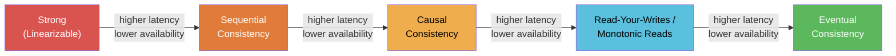

# [BEE-8006] Eventual Consistency Patterns

:::info
Eventual consistency is not the absence of consistency -- it is a precisely defined guarantee that replicas will converge to the same state, given sufficient time and no new updates. Understanding the consistency spectrum, conflict resolution strategies, and CRDT data structures lets you build correct, highly available systems.
:::

## Context

Distributed systems replicate data across nodes to achieve fault tolerance and low latency. The moment you have more than one replica, you face a fundamental question: how strongly do you guarantee that every replica shows the same value at every instant?

Strong consistency answers "always" -- at the cost of coordination overhead and availability. Eventual consistency answers "eventually" -- accepting temporary divergence in exchange for higher availability and lower write latency. This trade-off is not hypothetical. Werner Vogels, CTO of Amazon, formalized it in his landmark 2008 paper: *Eventually Consistent* ([ACM Queue](https://queue.acm.org/detail.cfm?id=1466448), [All Things Distributed](https://www.allthingsdistributed.com/2008/12/eventually_consistent.html)). Amazon's DynamoDB, Cassandra, Riak, and CouchDB all build on these ideas.

The critical insight -- explored thoroughly in Martin Kleppmann's *Designing Data-Intensive Applications* ([O'Reilly](https://www.oreilly.com/library/view/designing-data-intensive-applications/9781491903063/)) -- is that "eventual consistency" is not a single model. It is a family of models spanning a spectrum, each with different guarantees and trade-offs.

## Principle

**Design for convergence, not for perfect synchrony. Choose the weakest consistency model your application can tolerate, implement conflict resolution explicitly, and never assume stale reads cannot reach end users.**

## The Consistency Spectrum

Consistency models range from the strongest (highest coordination cost, lowest availability) to the weakest (lowest coordination cost, highest availability):



| Model | Guarantee | Typical Use Case |
|---|---|---|
| Linearizable | Every read sees the most recent write; operations appear instantaneous | Bank balance, leader election, distributed locks |
| Sequential Consistency | All nodes see operations in the same order, though not necessarily real-time | Shared memory models, some queues |
| Causal Consistency | Causally related writes are seen in order by all nodes | Collaborative editing, comment threads |
| Read-Your-Writes | A client always sees its own writes | User profile updates, session data |
| Monotonic Reads | Once a client sees a value, it never sees an older value | Pagination, activity feeds |
| Eventual Consistency | Replicas converge given no new writes (no ordering guarantee) | DNS, shopping carts, counters, caches |

Moving left increases coordination cost and reduces availability under partition. Moving right reduces latency and increases resilience, but requires your application to handle divergence.

## What "Eventual" Actually Guarantees

Eventual consistency has one hard guarantee: **if no new updates are made to a data item, all replicas will eventually return the last updated value.** It says nothing about:

- How long convergence takes (the "consistency window")
- What value a reader sees during divergence
- Which write wins when concurrent writes conflict

This means your application code is responsible for handling the cases that strong consistency would handle automatically.

## Conflict Resolution Strategies

When two replicas accept concurrent writes to the same key, they must reconcile. There are three main approaches:

### Last-Writer-Wins (LWW)

Each write carries a timestamp. During merge, the write with the higher timestamp survives; the other is discarded.

```
Node A receives: { cart: ["shoes"] }    @ t=100
Node B receives: { cart: ["jacket"] }   @ t=101

After sync: { cart: ["jacket"] }   ← "shoes" is permanently lost
```

LWW is simple and widely used (Cassandra defaults to it). The cost is **silent data loss**: the losing write disappears without any error being raised. This is acceptable when the last write truly represents user intent (e.g., updating a display name) and unacceptable when writes are additive (e.g., adding items to a cart).

### Application-Level Merge

The database stores all concurrent versions (siblings in Riak, conflicts in CouchDB). The application reads all versions and merges them according to domain logic.

```
Version A: { cart: ["shoes"] }
Version B: { cart: ["jacket"] }

Application merge: { cart: ["shoes", "jacket"] }  ← domain-specific union
```

This preserves all writes but pushes complexity to the application. The application must handle the case where multiple conflicting versions exist on every read.

### CRDTs (Conflict-Free Replicated Data Types)

CRDTs are data structures mathematically designed so that concurrent updates always merge deterministically without conflicts. No coordination is required at write time; merges are always correct by construction.

Martin Kleppmann's research on CRDTs ([crdt.tech](https://crdt.tech/resources), [CRDTs: The Hard Parts](https://martin.kleppmann.com/2020/07/06/crdt-hard-parts-hydra.html)) describes three foundational types:

| CRDT Type | Description | Example |
|---|---|---|
| G-Counter | Grow-only counter; each replica increments its own slot | View count, like count |
| G-Set | Grow-only set; elements can only be added, never removed | Tags, permissions |
| LWW-Register | Single value with LWW semantics (explicitly chosen) | Last-known location |
| OR-Set (Observed-Remove Set) | Set that supports add and remove with causal tracking | Shopping cart |
| PN-Counter | Positive-Negative counter; supports increment and decrement | Inventory delta |

The key property: a CRDT's merge function is **commutative, associative, and idempotent**. This means merging replicas in any order, any number of times, always produces the same result.

## Shopping Cart Example: LWW vs. CRDT

A user has two devices. They add "shoes" on their phone, then "jacket" on their laptop, and the two devices sync later.

**With Last-Writer-Wins:**

```
Phone  @ t=100:  PUT cart = ["shoes"]
Laptop @ t=101:  PUT cart = ["jacket"]

Sync result: cart = ["jacket"]   ← shoes is lost
```

The phone's write happened at t=100, the laptop's at t=101. LWW discards the earlier write entirely. The user sees only "jacket" and never understands why "shoes" disappeared.

**With G-Set CRDT:**

```
Phone  adds "shoes":   state_A = { "shoes" }
Laptop adds "jacket":  state_B = { "jacket" }

Merge(state_A, state_B) = union({ "shoes" }, { "jacket" })
                        = { "shoes", "jacket" }   ← both items preserved
```

Because set union is commutative and associative, the merge produces the same result regardless of which replica initiates the sync. No coordinator, no timestamp comparison, no data loss.

For a real cart supporting removes, use an OR-Set, which tags each add operation with a unique identifier and uses causal tracking to correctly handle concurrent add-and-remove of the same item.

## Session-Level Consistency Guarantees

Even when the underlying store is eventually consistent, you can provide stronger per-session guarantees to users:

**Read-Your-Writes:** After a client writes a value, subsequent reads from that client always return the written value or a newer one. Implementation: route the client's reads to the replica that accepted its write, or include a version vector in requests.

**Monotonic Reads:** Once a client has seen a value at version V, it never sees a value at version < V. Implementation: sticky sessions to a replica, or client-side version tracking with request headers.

**Causal Consistency:** If write B was causally caused by observing write A, then any replica that delivers B must have already delivered A. Implementation: vector clocks or logical timestamps propagated with each request.

These session guarantees can be layered on top of an eventually consistent store without requiring global coordination.

## Designing Applications for Eventual Consistency

### Use conflict-free operations where possible

Prefer operations that are naturally commutative: increment, union, append-to-log. Avoid operations that require reading-before-writing (read-modify-write) across replicas, as concurrent RMW cycles are the primary source of conflicts.

### Implement optimistic UI

In user-facing applications, apply changes locally (optimistically) before the write is confirmed by the server. If the server returns a conflict, reconcile and refresh. This eliminates the perceived latency of waiting for cross-replica consistency while keeping the UI correct.

### Communicate the consistency window

The gap between a write being committed and that write being visible to all replicas is called the **consistency window**. Monitor replication lag (see [BEE-1003](../auth/oauth-openid-connect.md)2). Alert if the window exceeds your SLA. Expose replication lag in your observability dashboards.

### Protect user-visible state with read-your-writes

Users expect to see their own actions immediately. Always provide read-your-writes consistency for any operation the user explicitly initiates (posting a comment, updating a profile, placing an order). Serve the user's own writes from the local replica or from a strongly consistent path.

### Document your conflict resolution policy

State explicitly in your data model documentation: "What happens when two clients write to this field concurrently?" If the answer is LWW, document which field carries the timestamp and acknowledge that concurrent updates will lose the earlier write.

## Common Mistakes

**1. Treating eventual consistency as "no consistency"**

Eventual consistency has a real guarantee: convergence. It does not mean arbitrary data can appear. A system that correctly implements eventual consistency will converge. A system that is merely broken will not. Distinguish between the two.

**2. Using LWW without understanding data loss**

LWW silently discards the losing write. This is acceptable for some use cases (single-valued fields where the user intent is replacement) and catastrophic for others (additive operations, financial records). Always audit your LWW usage and ask: "Is it correct to lose the earlier write here?"

**3. Not providing read-your-writes for user-facing features**

A user submits a form, is redirected to a list page, and does not see their new record. This is the consistency window in action. It is the single most common user-visible bug in eventually consistent systems. Fix it with sticky sessions, version tokens in responses, or a strongly consistent read for the redirect target.

**4. Ignoring the consistency window in testing**

Unit and integration tests often run against a single replica or with synchronous replication, masking eventual consistency bugs. Write tests that explicitly introduce replication delay and verify that your application handles stale reads correctly.

**5. Choosing eventual consistency when strong consistency is affordable**

Eventual consistency is a tool for when strong consistency is genuinely too expensive -- because of geographic distribution, high write volume, or availability requirements. For a single-region service with modest write throughput, the complexity of eventual consistency may cost more than the coordination overhead of strong consistency. Do not adopt eventual consistency for its own sake.

## Related BEPs

- [BEE-6003](../data-storage/replication-strategies.md) -- Replication Lag: measuring and alerting on the consistency window
- [BEE-8001](acid-properties.md) -- ACID Transactions: when to use strong consistency instead
- [BEE-8003](distributed-transactions-and-two-phase-commit.md) -- Distributed Transactions: coordinating writes across services
- [BEE-9004](../caching/distributed-caching.md) -- Distributed Caching: cache invalidation and staleness

## References

- Werner Vogels, *Eventually Consistent* -- [All Things Distributed (2008)](https://www.allthingsdistributed.com/2008/12/eventually_consistent.html) / [ACM Queue](https://queue.acm.org/detail.cfm?id=1466448)
- Martin Kleppmann, *Designing Data-Intensive Applications*, Chapter 9 -- [O'Reilly](https://www.oreilly.com/library/view/designing-data-intensive-applications/9781491903063/)
- Martin Kleppmann, *CRDTs: The Hard Parts* -- [martin.kleppmann.com (2020)](https://martin.kleppmann.com/2020/07/06/crdt-hard-parts-hydra.html)
- crdt.tech -- [CRDT Resources](https://crdt.tech/resources)
