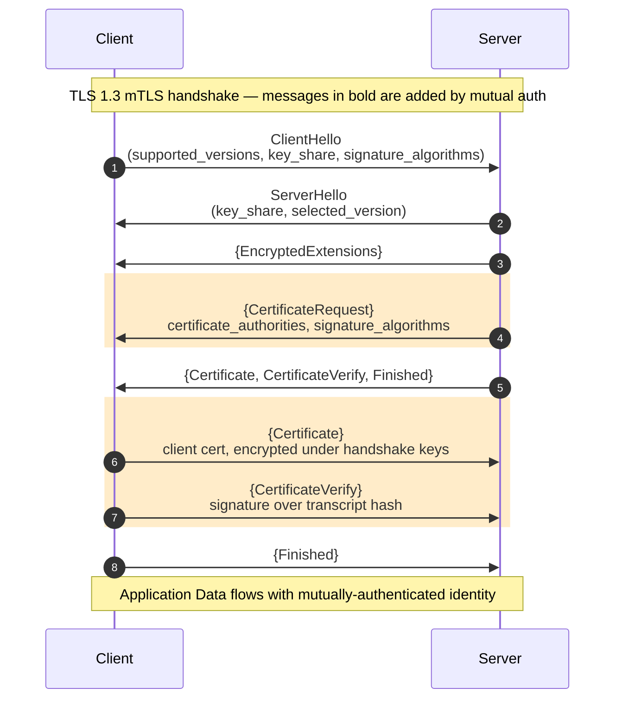

# BEE-3007 — Mutual TLS (mTLS) Handshake and Server Configuration — Implementation Plan

> **For agentic workers:** REQUIRED SUB-SKILL: Use superpowers:subagent-driven-development (recommended) or superpowers:executing-plans to implement this plan task-by-task. Steps use checkbox (`- [ ]`) syntax for tracking.

**Goal:** Ship BEE-3007 (Mutual TLS Handshake and Server Configuration) as a new `networking-fundamentals` article — EN + zh-TW — and add five reverse-link one-liners into the adjacent articles identified in the approved spec.

**Architecture:** Single new article file per language authored against the approved design spec (`docs/superpowers/specs/2026-04-19-bee-3007-mtls-article-design.md`). Reverse links are in-place single-entry additions to the `Related BEEs` (or `Related BEPs`) sections of five existing articles, in each language. Sidebar auto-generates from frontmatter, so `id: 3007` slots into `networking-fundamentals/` automatically with no sidebar config change.

**Tech Stack:** VitePress 1.3.x markdown, Mermaid `sequenceDiagram`, pnpm for local render validation, `polish-documents` skill for prose polish.

**Commit strategy:** Three separate commits.
1. **Commit 1** — flush the pending BEE-19048 → BEE-2007 reverse-link fix already in the working tree (clears the baseline).
2. **Commit 2** — new BEE-3007 article (EN + zh-TW) after polish.
3. **Commit 3** — five reverse-link additions into adjacent articles (both languages).

---

## File Structure

**Create (new article, both languages):**
- `docs/en/networking-fundamentals/mutual-tls-handshake-and-server-configuration.md`
- `docs/zh-tw/networking-fundamentals/mutual-tls-handshake-and-server-configuration.md`

**Modify (reverse-link additions, both languages for each):**
- `docs/{en,zh-tw}/networking-fundamentals/tls-ssl-handshake.md` (BEE-3004)
- `docs/{en,zh-tw}/security-fundamentals/tls-certificate-lifecycle-and-pki.md` (BEE-2011)
- `docs/{en,zh-tw}/security-fundamentals/zero-trust-security-architecture.md` (BEE-2007)
- `docs/{en,zh-tw}/architecture-patterns/sidecar-and-service-mesh-concepts.md` (BEE-5006)
- `docs/{en,zh-tw}/distributed-systems/service-to-service-authentication.md` (BEE-19048)

**Pre-existing uncommitted changes (folded into Commit 1):**
- `docs/en/distributed-systems/service-to-service-authentication.md` — already has a BEE-2007 line added
- `docs/zh-tw/distributed-systems/service-to-service-authentication.md` — same

---

## Task 1: Commit the pending BEE-19048 → BEE-2007 reverse-link fix

**Files:**
- Modify (already staged in working tree, just commit): `docs/en/distributed-systems/service-to-service-authentication.md`, `docs/zh-tw/distributed-systems/service-to-service-authentication.md`

**Why first:** The working tree currently has an uncommitted one-line addition in both languages. Shipping that as a standalone commit now gives every subsequent task a clean baseline and isolates the fix's git history (it's conceptually separate from the new-article work).

**Polish decision:** Do NOT run polish-documents for this commit. The changes are one-line Related-BEEs entries that follow the exact format of adjacent entries — no new prose to polish. Polish would reflow unrelated existing content, which is scope creep against the user's stated memory preference (the preference targets newly-authored article prose, not list additions).

- [ ] **Step 1: Verify the working tree state**

Run:
```bash
git status --short
git diff docs/en/distributed-systems/service-to-service-authentication.md docs/zh-tw/distributed-systems/service-to-service-authentication.md
```

Expected: two modified files, each with one added line in the `Related BEEs` / `相關 BEE` section pointing to BEE-2007.

- [ ] **Step 2: Commit**

Run:
```bash
git add docs/en/distributed-systems/service-to-service-authentication.md \
        docs/zh-tw/distributed-systems/service-to-service-authentication.md

git commit -m "$(cat <<'EOF'
fix: add BEE-2007 reverse link in BEE-19048 Related BEEs

BEE-2007 (Zero-Trust) already listed BEE-19048 in its Related BEEs,
but the reverse direction was missing. Add BEE-2007 to BEE-19048's
Related BEEs in both EN and zh-TW, slotted in BEE-id order between
2003 and 3004.
EOF
)"
```

- [ ] **Step 3: Verify commit landed and tree is clean**

Run:
```bash
git log --oneline -1
git status --short
```

Expected: the new commit shows at HEAD; `git status` reports a clean working tree.

---

## Task 2: Research verification against authoritative sources

**Files:** none modified. This is a read-only validation pass. Produce notes in the session (in chat) or a scratch file that will not be committed.

**Why:** CLAUDE.md mandates: "Every article MUST be researched against authoritative sources. AI internal knowledge alone is insufficient." The spec cites RFC sections and Nginx/Go behaviors; those claims must be verified before drafting so the article does not encode an error from the spec.

- [ ] **Step 1: Fetch RFC 8446 sections referenced in the spec**

Use WebFetch on <https://www.rfc-editor.org/rfc/rfc8446> with focused queries for each section:
- §4.3.2 `CertificateRequest` — verify the `certificate_authorities` and `signature_algorithms` extensions, confirm when it is sent in the handshake flight order
- §4.4.2 `Certificate` — verify the client `Certificate` is sent under handshake encryption
- §4.4.3 `CertificateVerify` — verify it is a signature over the transcript hash and that it is required when a `Certificate` is sent
- §4.6.2 Post-Handshake Authentication — verify `post_handshake_auth` extension semantics
- §6 Alert Protocol — verify numeric codes: `bad_certificate` 42, `unsupported_certificate` 43, `certificate_expired` 45, `unknown_ca` 48, `certificate_required` 116

- [ ] **Step 2: Fetch RFC 5246 §7.4.4**

Use WebFetch on <https://www.rfc-editor.org/rfc/rfc5246#section-7.4.4> to verify:
- TLS 1.2 `CertificateRequest` is sent alongside `ServerHelloDone` (not under handshake encryption)
- The client `Certificate` message is sent in cleartext in TLS 1.2
- The supported `ClientCertificateType` enum values

- [ ] **Step 3: Fetch Nginx SSL module docs**

Use WebFetch on <https://nginx.org/en/docs/http/ngx_http_ssl_module.html> to verify:
- `ssl_verify_client` directive accepts `on`, `off`, `optional`, `optional_no_ca`
- `ssl_client_certificate` directive specifies the trust-anchor file
- `ssl_verify_depth` default is 1
- Embedded variables: `$ssl_client_verify`, `$ssl_client_s_dn`, `$ssl_client_escaped_cert` (Nginx ≥ 1.11.6). Note: `$ssl_client_escaped_cert` returns the URL-encoded PEM of the client certificate — not just the SAN.

- [ ] **Step 4: Fetch Go `crypto/tls` ClientAuthType docs**

Use WebFetch on <https://pkg.go.dev/crypto/tls#ClientAuthType> to verify:
- `NoClientCert`, `RequestClientCert`, `RequireAnyClientCert`, `VerifyClientCertIfGiven`, `RequireAndVerifyClientCert` — five values
- `RequireAnyClientCert` accepts any cert (no verification), `RequireAndVerifyClientCert` verifies against `ClientCAs`

- [ ] **Step 5: Record any deviations from the spec**

If any verified fact contradicts the spec, note the correction. These corrections are authoritative over the spec for authoring tasks 3-14. If no deviations, proceed.

---

## Task 3: Create EN article — frontmatter and info-callout thesis

**Files:**
- Create: `docs/en/networking-fundamentals/mutual-tls-handshake-and-server-configuration.md`

- [ ] **Step 1: Create the file with frontmatter + info callout only**

Exact content:
```markdown
---
id: 3007
title: Mutual TLS (mTLS) Handshake and Server Configuration
state: draft
slug: mutual-tls-handshake-and-server-configuration
---

# [BEE-3007] Mutual TLS (mTLS) Handshake and Server Configuration

:::info
Mutual TLS extends the base TLS handshake with a server-sent `CertificateRequest` and a client-sent `Certificate` + `CertificateVerify`, so both peers prove possession of a private key bound to a certificate their counterpart trusts — turning the connection itself into authenticated identity.
:::
```

- [ ] **Step 2: Verify file opens correctly**

Run:
```bash
head -15 docs/en/networking-fundamentals/mutual-tls-handshake-and-server-configuration.md
```

Expected: the frontmatter + H1 + info block appear, total ~13 lines including blank lines. Do not commit yet.

---

## Task 4: Author EN Context section

**Files:**
- Modify: `docs/en/networking-fundamentals/mutual-tls-handshake-and-server-configuration.md` (append)

**Content budget:** three paragraphs, each 70–130 words. No prose placeholders.

- [ ] **Step 1: Append the Context section**

Append the following section. Use the bullets below as the prose spine for each paragraph — do not use the bullets verbatim; write them out as flowing paragraphs.

Heading: `## Context`

**Paragraph 1 — what's insufficient about one-way TLS.** Cover: standard TLS authenticates the server only; the client is anonymous at the TLS layer; identity comes from application-layer mechanisms (OAuth bearer tokens, session cookies); for internal service-to-service traffic where there is no human identity, the transport layer's anonymity is a zero-trust violation.

**Paragraph 2 — where mTLS sits in the stack.** Cover: mTLS sits below application-layer authentication and above TCP; the connection itself carries verified peer identity; servers read the peer certificate out of the TLS session state instead of running a separate authentication exchange; this collapses transport-level and identity-level concerns into one handshake.

**Paragraph 3 — brief history.** Cover: TLS 1.2 defined optional client authentication in RFC 5246 §7.4.4 (published 2008), but the client `Certificate` message was sent in cleartext; TLS 1.3 (RFC 8446, published August 2018) restructured the handshake so all messages after `EncryptedExtensions` are encrypted under handshake keys, including the client's `Certificate`; TLS 1.3 also introduced `post_handshake_auth` for requesting client authentication mid-connection.

**Explicit pointer at end of section:** one sentence — "For the architectural motivation, see BEE-2007 (Zero-Trust Security Architecture); for the strategy comparison against JWT service tokens and cloud-IAM workload identity, see BEE-19048 (Service-to-Service Authentication)." This keeps the article focused on mechanics.

- [ ] **Step 2: Word-count sanity check**

Run:
```bash
awk '/^## Context/,/^## [A-Z]/' docs/en/networking-fundamentals/mutual-tls-handshake-and-server-configuration.md | wc -w
```

Expected: 250–450 words.

---

## Task 5: Author EN Principle section

**Files:**
- Modify: `docs/en/networking-fundamentals/mutual-tls-handshake-and-server-configuration.md` (append)

**Content budget:** short — three to four short paragraphs or a tight mix of prose + bullet list. Total ~180–280 words.

- [ ] **Step 1: Append the Principle section**

Heading: `## Principle`

Cover exactly these three points. Structure: one opening sentence + a bulleted or bolded list, then one closing paragraph.

1. **Three extra messages.** Relative to one-way TLS, mTLS adds `CertificateRequest` (server → client), `Certificate` (client → server), and `CertificateVerify` (client → server). Name each one with the RFC 8446 section in parentheses: §4.3.2, §4.4.2, §4.4.3.

2. **Why `CertificateVerify` is structurally necessary.** Without a `CertificateVerify`, a client could present a certificate captured from someone else's handshake or network trace. `CertificateVerify` is a signature over the transcript hash with the client's private key — it proves possession of the private key matching the presented certificate, not just possession of the certificate.

3. **Identity binding is at the SAN level.** URI SANs for SPIFFE-style identities, DNS SANs for hostnames. CN is deprecated for hostname matching (RFC 2818, effective 2000; browsers enforced rejection of CN-only certificates starting ~2017). Deep PKI treatment — chain construction, trust-anchor management, cert rotation — is deferred to BEE-2011.

- [ ] **Step 2: Verify no forbidden prose patterns**

Scan the authored section for the prohibited writing patterns from `/Users/alive/.claude/CLAUDE.md`:
- No "不是 X 而是 Y" (N/A — English)
- No undefined vague adjectives ("very heavy", "super clear" without anchor)
- No "can X, can Y, can Z" stacked capability claims
- No self-praising precision phrases

If any appear, rewrite the offending sentence.

---

## Task 6: Author EN Visual section (Mermaid sequenceDiagram)

**Files:**
- Modify: `docs/en/networking-fundamentals/mutual-tls-handshake-and-server-configuration.md` (append)

- [ ] **Step 1: Append the Visual section with exact Mermaid source**

Append exactly:

````markdown
## Visual



Messages wrapped in `{...}` are sent under handshake encryption (TLS 1.3 property). The three highlighted messages are what mTLS adds relative to one-way TLS.
````

- [ ] **Step 2: Render-check the Mermaid block**

Run the dev server in a separate terminal if not already running:
```bash
pnpm docs:dev
```

Navigate to the article's path (VitePress URL will be `/en/networking-fundamentals/mutual-tls-handshake-and-server-configuration.html`). Confirm the sequence diagram renders with the three highlighted messages. If Mermaid errors, fix syntax before proceeding.

---

## Task 7: Author EN Protocol Walkthrough — TLS 1.3

**Files:**
- Modify: `docs/en/networking-fundamentals/mutual-tls-handshake-and-server-configuration.md` (append)

**Content budget:** 5 subsections, each 80–180 words.

- [ ] **Step 1: Append the Protocol Walkthrough section**

Heading: `## Protocol Walkthrough — TLS 1.3`

Then five `###` subsections with the content specified below. Authoritative source for every factual claim: RFC 8446 (verified in Task 2).

**Subsection `### CertificateRequest (RFC 8446 §4.3.2)`**
Cover: sent by the server inside the encrypted handshake, after `EncryptedExtensions`, before the server's own `Certificate`. The `certificate_authorities` extension carries DNs of CAs the server accepts — clients use this to select which of their available certificates (if they have more than one) to present. The `signature_algorithms` extension constrains which signature algorithms the client's `CertificateVerify` may use. An empty `certificate_authorities` is permitted and means "any CA".

**Subsection `### Client Certificate (RFC 8446 §4.4.2)`**
Cover: sent after the server's `Finished` has been received and verified. In TLS 1.3 this message is sent under handshake encryption — a privacy property TLS 1.2 lacks, because on TLS 1.2 a passive observer on the wire can see which client cert was presented. May be empty: the client signals "no matching cert" by sending a `Certificate` message with an empty `certificate_list`. The server then decides: fail the handshake with `certificate_required` alert (if client auth is mandatory) or continue with no identity (if optional).

**Subsection `### Client CertificateVerify (RFC 8446 §4.4.3)`**
Cover: a signature over the transcript hash, computed with the client's private key. This is the proof-of-possession step. Without `CertificateVerify`, a client could replay a certificate it captured somewhere else — since certificates are public, possession alone proves nothing. The signature algorithm must be one of those listed in the server's `signature_algorithms` extension from the `CertificateRequest`. If the client sent an empty `Certificate`, it does not send `CertificateVerify`.

**Subsection `### Server-side verification`**
Numbered list of the five checks the server runs on the client's presented identity:
1. **Chain construction** — builds a chain from the presented leaf certificate to a trust anchor in its `ClientCAs` trust store
2. **Validity window** — rejects expired certificates (`notAfter` < now) and not-yet-valid certificates (`notBefore` > now)
3. **SAN match** — compares the DNS or URI SAN against the server's authorization policy (e.g., SPIFFE ID allowlist)
4. **CertificateVerify signature** — verifies the signature against the transcript hash using the public key from the presented cert
5. **Optional revocation** — CRL / OCSP / OCSP stapling if the deployment uses revocation; often skipped for short-lived internal certs where rotation replaces revocation

**Subsection `### Post-handshake client authentication (RFC 8446 §4.6.2)`**
Short — brief note only. Cover: the `post_handshake_auth` extension, which a client signals in its `ClientHello`. A server that received this extension may later send a `CertificateRequest` on the same connection — useful when the client tries to access a more sensitive resource partway through a session. Point readers to §4.6.2 for the full message flow rather than walking through it.

---

## Task 8: Author EN TLS 1.2 Delta subsection

**Files:**
- Modify: `docs/en/networking-fundamentals/mutual-tls-handshake-and-server-configuration.md` (append)

**Content budget:** one compact subsection, 150–250 words total.

- [ ] **Step 1: Append the delta section**

Heading: `## TLS 1.2 Delta`

Open with one sentence setting the frame: most new internal environments should default to TLS 1.3; TLS 1.2 remains relevant for long-lived meshes and legacy clients.

Then cover only the differences that matter, as a compact bulleted list or short paragraphs:

- **Client `Certificate` is in cleartext** (privacy consideration — client identity visible to passive observers; TLS 1.3 fixed this by moving the message under handshake encryption).
- **`CertificateRequest` flight position** — sent together with `ServerHelloDone` in the same flight, not inside the encrypted handshake.
- **No post-handshake client auth** — TLS 1.2 does not have an equivalent of TLS 1.3 `post_handshake_auth`. Client authentication must be requested during the initial handshake or not at all.
- **Different signature-algorithm enumeration** — RFC 5246 §7.4.1.4.1 enumerates the `SignatureAndHashAlgorithm` values TLS 1.2 uses for client authentication; TLS 1.3 uses the `SignatureScheme` enumeration from RFC 8446 §4.2.3.

End with a pointer: the operational setup for mTLS (nginx config, Go server config, `openssl s_client` flags) is the same for both versions unless otherwise noted.

---

## Task 9: Author EN In Practice — Part 1: cert generation

**Files:**
- Modify: `docs/en/networking-fundamentals/mutual-tls-handshake-and-server-configuration.md` (append)

**Content budget:** one subsection, opening paragraph + one code block + 2-3 sentence explanation.

- [ ] **Step 1: Append the In Practice section header and first subsection**

Append:

````markdown
## In Practice — Setting Up mTLS on a Server

Two real-world topologies dominate: (A) terminate mTLS at a reverse proxy and pass verified identity to the upstream over a private hop, or (B) terminate mTLS directly in the application. Both start from the same certificate material.

### 1. Generate the CA, server cert, and client cert

```bash
# Root CA (self-signed, kept offline in production)
openssl req -x509 -newkey ec -pkeyopt ec_paramgen_curve:P-256 \
  -keyout ca.key -out ca.crt -days 3650 -nodes \
  -subj "/CN=internal-root-ca"

# Server certificate (SAN = DNS name the client will connect to)
openssl req -new -newkey ec -pkeyopt ec_paramgen_curve:P-256 \
  -keyout server.key -out server.csr -nodes \
  -subj "/CN=api.internal"
openssl x509 -req -in server.csr -out server.crt -days 90 \
  -CA ca.crt -CAkey ca.key -CAcreateserial \
  -extfile <(printf "subjectAltName=DNS:api.internal")

# Client certificate (SAN = URI, SPIFFE-style identity)
openssl req -new -newkey ec -pkeyopt ec_paramgen_curve:P-256 \
  -keyout client.key -out client.csr -nodes \
  -subj "/CN=orders-service"
openssl x509 -req -in client.csr -out client.crt -days 90 \
  -CA ca.crt -CAkey ca.key -CAcreateserial \
  -extfile <(printf "subjectAltName=URI:spiffe://internal.example.com/orders-service")
```
````

Follow the code block with 2-3 sentences on what was generated and why URI SANs are used for the client (binds a logical service identity, not a hostname).

---

## Task 10: Author EN In Practice — Part 2: Nginx topology

**Files:**
- Modify: `docs/en/networking-fundamentals/mutual-tls-handshake-and-server-configuration.md` (append)

- [ ] **Step 1: Append the Nginx subsection with exact config**

Append:

````markdown
### 2. Topology A — mTLS at Nginx, cleartext upstream

```nginx
server {
    listen 443 ssl;
    server_name api.internal;
    ssl_certificate     /etc/nginx/server.crt;
    ssl_certificate_key /etc/nginx/server.key;

    ssl_client_certificate /etc/nginx/ca.crt;
    ssl_verify_client on;
    ssl_verify_depth 2;

    location / {
        # Fail closed: only forward when the TLS module verified the client cert
        if ($ssl_client_verify != SUCCESS) { return 403; }

        proxy_pass http://backend:8080;
        proxy_set_header X-SSL-Client-Verify $ssl_client_verify;
        proxy_set_header X-SSL-Client-S-DN   $ssl_client_s_dn;
        proxy_set_header X-SSL-Client-Cert   $ssl_client_escaped_cert;
    }
}
```

**Critical call-out — trusted-header spoofing risk.** Identity forwarded via `X-SSL-Client-*` headers is only safe if the upstream hop runs on a network the attacker cannot reach directly. If the upstream (`backend:8080`) is reachable from the public network, an attacker sends the plain HTTP request with a forged `X-SSL-Client-S-DN` header and bypasses Nginx entirely. Bind the upstream to `localhost` or a private subnet, enforce this at firewall / security-group level, and reject any inbound request on the upstream that did not originate from the proxy (e.g., by mTLS between proxy and upstream, or an IP allowlist).

`$ssl_client_escaped_cert` carries the URL-encoded PEM of the client certificate — the upstream is responsible for parsing the SAN out of it. Passing the DN is a common shortcut but is not sufficient for SPIFFE-style identity; parse the cert if you need the URI SAN.
````

---

## Task 11: Author EN In Practice — Part 3: Go topology

**Files:**
- Modify: `docs/en/networking-fundamentals/mutual-tls-handshake-and-server-configuration.md` (append)

- [ ] **Step 1: Append the Go subsection with exact code**

Append:

````markdown
### 3. Topology B — mTLS all the way to the Go app

```go
package main

import (
    "crypto/tls"
    "crypto/x509"
    "net/http"
    "os"
    "strings"
)

func mustLoadCAPool(caPath string) *x509.CertPool {
    pem, err := os.ReadFile(caPath)
    if err != nil {
        panic(err)
    }
    pool := x509.NewCertPool()
    if ok := pool.AppendCertsFromPEM(pem); !ok {
        panic("failed to parse CA certificate")
    }
    return pool
}

func main() {
    tlsConfig := &tls.Config{
        ClientAuth: tls.RequireAndVerifyClientCert,       // not RequireAnyClientCert — see Common Mistakes
        ClientCAs:  mustLoadCAPool("/etc/tls/ca.crt"),
        MinVersion: tls.VersionTLS13,
    }

    server := &http.Server{
        Addr:      ":8443",
        TLSConfig: tlsConfig,
        Handler:   http.HandlerFunc(handle),
    }
    _ = server.ListenAndServeTLS("/etc/tls/server.crt", "/etc/tls/server.key")
}

func handle(w http.ResponseWriter, r *http.Request) {
    if r.TLS == nil || len(r.TLS.PeerCertificates) == 0 {
        http.Error(w, "client certificate required", http.StatusUnauthorized)
        return
    }
    peer := r.TLS.PeerCertificates[0]

    // Validate the SPIFFE URI SAN
    for _, uri := range peer.URIs {
        if strings.HasPrefix(uri.String(), "spiffe://internal.example.com/") {
            // peer identity established — route to handler
            w.Write([]byte("authorized caller: " + uri.String()))
            return
        }
    }
    http.Error(w, "untrusted peer identity", http.StatusForbidden)
}
```

`RequireAndVerifyClientCert` chains the presented certificate against `ClientCAs` and validates the signature on the handshake transcript. Read the validated peer identity out of `r.TLS.PeerCertificates[0]` on every request; do not cache the result per-connection, because a misused connection-level cache hides the per-request audit trail zero-trust requires.
````

---

## Task 12: Author EN In Practice — Part 4: testing and debugging

**Files:**
- Modify: `docs/en/networking-fundamentals/mutual-tls-handshake-and-server-configuration.md` (append)

- [ ] **Step 1: Append the testing & debugging subsection**

Append:

````markdown
### 4. Testing and debugging

```bash
# Inspect the full mTLS handshake; -showcerts dumps the server's chain
openssl s_client -connect api.internal:443 \
  -cert client.crt -key client.key \
  -CAfile ca.crt -tls1_3 -showcerts </dev/null

# End-to-end request
curl --cert client.crt --key client.key --cacert ca.crt \
  https://api.internal/health
```

When the handshake fails, the peer's TLS alert identifies the failure class. Decoding the common ones (RFC 8446 §6):

| Alert | Code | Typical cause |
|---|---|---|
| `bad_certificate` | 42 | Client certificate is malformed or its signature does not verify |
| `unsupported_certificate` | 43 | Client cert signature algorithm is not in the server's `signature_algorithms` extension |
| `certificate_expired` | 45 | `notAfter` is in the past, or `notBefore` is in the future |
| `unknown_ca` | 48 | Server cannot chain the presented client cert to any CA in its trust store |
| `certificate_required` | 116 | TLS 1.3 only — the server required a client certificate and the client sent an empty `Certificate` |

`openssl s_client` prints these by name. `curl` prints the SSL library's interpretation (e.g., `error:0A000415:SSL routines::sslv3 alert certificate required`). When debugging a production failure, run `s_client` against the same host from the same network as the failing caller; most mTLS failures are trust-store mismatches that reproduce immediately.
````

---

## Task 13: Author EN Common Mistakes section

**Files:**
- Modify: `docs/en/networking-fundamentals/mutual-tls-handshake-and-server-configuration.md` (append)

- [ ] **Step 1: Append the Common Mistakes section**

Heading: `## Common Mistakes`

Five numbered items. Each: one bolded sentence stating the mistake, then one-to-two sentences of explanation referring to the specific mechanism.

1. **Forwarding trusted identity headers over an untrusted hop.** The Nginx-terminated topology only works if the upstream network is actually private. Bind the upstream to a private interface and enforce it at the firewall layer, or run mTLS between proxy and upstream too.

2. **Using `RequireAnyClientCert` instead of `RequireAndVerifyClientCert`.** `RequireAnyClientCert` accepts any syntactically valid certificate — including self-signed ones — without chaining to `ClientCAs`. An attacker presents any cert and is admitted. The correct setting is `RequireAndVerifyClientCert`.

3. **Matching identity on CN instead of SAN.** CN-based hostname matching was deprecated by RFC 2818 and is rejected by modern TLS implementations. Validate the URI SAN (for SPIFFE-style identities) or the DNS SAN (for hostname-style identities) via `peer.URIs` / `peer.DNSNames` in Go, not `peer.Subject.CommonName`.

4. **No revocation strategy for long-lived client certs.** If client certificates are long-lived — which itself is a smell in a zero-trust deployment — you need a CRL or OCSP flow. Short-lived SVIDs (e.g., 1-hour SPIRE-issued certs) sidestep the revocation problem entirely by expiring before a compromise becomes useful.

5. **Trusting the OS default CA bundle for internal workloads.** The OS default trust store holds the 130+ public roots. Using it as the `ClientCAs` pool means any publicly trusted CA can impersonate an internal caller. Build a dedicated pool from the internal CA's PEM only, loaded via `x509.NewCertPool` + `AppendCertsFromPEM`.

---

## Task 14: Author EN Related BEEs + References

**Files:**
- Modify: `docs/en/networking-fundamentals/mutual-tls-handshake-and-server-configuration.md` (append)

- [ ] **Step 1: Append the Related BEEs section**

Heading: `## Related BEEs`

Exact list, ordered by BEE id:

```markdown
- [BEE-2007](../security-fundamentals/zero-trust-security-architecture.md) -- Zero-Trust Security Architecture: the "why" — mTLS is the east-west authentication primitive in a zero-trust network
- [BEE-2011](../security-fundamentals/tls-certificate-lifecycle-and-pki.md) -- TLS Certificate Lifecycle and PKI: how the certificates this article assumes you have are issued, rotated, and revoked
- [BEE-3004](tls-ssl-handshake.md) -- TLS/SSL Handshake: prerequisite — base handshake mechanics that mTLS extends
- [BEE-5006](../architecture-patterns/sidecar-and-service-mesh-concepts.md) -- Sidecar and Service Mesh Concepts: how service meshes automate the in-practice patterns from this article (cert issuance, rotation, enforcement)
- [BEE-19048](../distributed-systems/service-to-service-authentication.md) -- Service-to-Service Authentication: comparison context — mTLS as one of three service-auth strategies alongside JWT service tokens and cloud-IAM workload identity
```

- [ ] **Step 2: Append the References section**

Heading: `## References`

Exact list:

```markdown
- [RFC 8446 — The Transport Layer Security (TLS) Protocol Version 1.3](https://www.rfc-editor.org/rfc/rfc8446) — §4.3.2 CertificateRequest, §4.4.2 Certificate, §4.4.3 CertificateVerify, §4.6.2 Post-Handshake Authentication, §6 Alert Protocol
- [RFC 5246 — The Transport Layer Security (TLS) Protocol Version 1.2](https://www.rfc-editor.org/rfc/rfc5246) — §7.4.4 Certificate Request
- [RFC 8705 — OAuth 2.0 Mutual-TLS Client Authentication and Certificate-Bound Access Tokens](https://www.rfc-editor.org/rfc/rfc8705)
- [RFC 5280 — Internet X.509 Public Key Infrastructure Certificate and CRL Profile](https://www.rfc-editor.org/rfc/rfc5280)
- [Nginx HTTP SSL Module — ngx_http_ssl_module](https://nginx.org/en/docs/http/ngx_http_ssl_module.html)
- [Go crypto/tls — ClientAuthType](https://pkg.go.dev/crypto/tls#ClientAuthType)
```

---

## Task 15: Local render check for EN article

**Files:** none modified. Read-only validation.

- [ ] **Step 1: Ensure dev server is running**

```bash
pnpm docs:dev
```

If already running in another terminal, skip.

- [ ] **Step 2: Navigate to the article**

Open `http://localhost:5173/en/networking-fundamentals/mutual-tls-handshake-and-server-configuration.html` (VitePress dev port may differ — check terminal output for the actual URL).

- [ ] **Step 3: Verify visually**

Check:
- Title renders as "Mutual TLS (mTLS) Handshake and Server Configuration"
- Sidebar shows BEE-3007 entry in the `networking-fundamentals` section, ordered by id (between 3006 and 4xxx or whatever the next category is)
- `:::info` callout renders as a green/blue info box
- Mermaid sequenceDiagram draws without error
- All code blocks highlight correctly (nginx, Go, Bash, Markdown)
- Alert-code table renders as an actual HTML table
- All internal links in Related BEEs resolve when clicked (hover tooltips should appear; clicking should not 404)
- All external links in References are well-formed

If any check fails, fix the article before proceeding.

---

## Task 16: Translate EN article to zh-TW

**Files:**
- Create: `docs/zh-tw/networking-fundamentals/mutual-tls-handshake-and-server-configuration.md`

- [ ] **Step 1: Create the zh-TW file by translating section-by-section**

Rules for the translation:
- Preserve frontmatter identically (`id: 3007`, `title: Mutual TLS (mTLS) Handshake and Server Configuration`, `state: draft`, `slug: mutual-tls-handshake-and-server-configuration`). Title stays in English because the English acronym "mTLS" is standard technical terminology.
- Preserve H1 identically: `# [BEE-3007] Mutual TLS (mTLS) Handshake and Server Configuration`
- Translate the info callout to Traditional Chinese
- Translate all prose (Context, Principle, Protocol Walkthrough prose, TLS 1.2 Delta, In Practice prose, Common Mistakes, Related BEEs descriptions)
- Preserve every code block, config block, Mermaid block, and table byte-for-byte (the diagram labels stay English, the code comments stay English — matches the convention used in existing zh-tw files)
- Translate `## Related BEEs` heading to `## 相關 BEE` and `## References` to `## 參考資料` — matches convention used in other zh-tw files (verified in existing articles)
- Translate alert-code table column headers to `| 警報 | 代碼 | 常見原因 |`; body values stay verbatim (alert names, codes)
- Respect the user's writing-style rules from `/Users/alive/.claude/CLAUDE.md`:
  - No 「不是 X，而是 Y」 contrastive negation
  - No unanchored "說得很清楚" / "描述得很精確" self-praise
  - No em-dash fluff chains "——(廢話)——(更多廢話)"
  - No unanchored vague adjectives ("很重" — anchor or remove)
  - No "可以 X 可以 Y 可以 Z" capability-stack chains

- [ ] **Step 2: Verify structural parity with EN**

Run:
```bash
diff <(grep '^#' docs/en/networking-fundamentals/mutual-tls-handshake-and-server-configuration.md) \
     <(grep '^#' docs/zh-tw/networking-fundamentals/mutual-tls-handshake-and-server-configuration.md)
```

Expected: differences only in translated heading text. Structure (`#`, `##`, `###` levels) must match exactly.

---

## Task 17: Local render check for zh-TW article

**Files:** none modified.

- [ ] **Step 1: Navigate to zh-TW article**

Open `http://localhost:5173/zh-tw/networking-fundamentals/mutual-tls-handshake-and-server-configuration.html`.

- [ ] **Step 2: Verify visually**

Same checklist as Task 15, but for zh-tw:
- Traditional Chinese renders correctly (no mojibake)
- Mermaid still renders
- Internal links resolve (relative paths match EN)
- Sidebar shows zh-TW BEE-3007 in the correct slot
- Tables render
- Writing-style rules respected (no contrastive negation, no em-dash fluff, etc.)

---

## Task 18: Run polish-documents on both article files

**Files:**
- Modify (through polish skill): both newly-created article files

**Per user memory:** "For BEE article work, run polish-documents skill on EN+zh-TW files before the final commit." This is the trigger: both article files are full, newly-authored BEE article prose.

- [ ] **Step 1: Invoke polish-documents on the EN article**

Use the `Skill` tool:
```
Skill: polish-documents
args: docs/en/networking-fundamentals/mutual-tls-handshake-and-server-configuration.md
```

Review the skill's suggested changes. Accept edits that remove prohibited patterns (contrastive negation, em-dash chains, precision puffery, unanchored claims, capability stacks, importance announcements, rhetorical Q&A framing). Reject edits that change technical meaning.

- [ ] **Step 2: Invoke polish-documents on the zh-TW article**

```
Skill: polish-documents
args: docs/zh-tw/networking-fundamentals/mutual-tls-handshake-and-server-configuration.md
```

Same review rule. Pay particular attention to the writing-style rules from the user's global CLAUDE.md — the polish skill enforces them for Traditional Chinese.

- [ ] **Step 3: Re-render both articles**

Reload the dev-server URLs from Tasks 15 and 17. Verify content still parses (polish should not break structure, but Mermaid and tables are sensitive to whitespace around fence markers).

---

## Task 19: Commit the new article (Commit 2)

**Files:**
- Both newly-created article files

- [ ] **Step 1: Stage and commit**

Run:
```bash
git add docs/en/networking-fundamentals/mutual-tls-handshake-and-server-configuration.md \
        docs/zh-tw/networking-fundamentals/mutual-tls-handshake-and-server-configuration.md

git commit -m "$(cat <<'EOF'
feat(bee-3007): add Mutual TLS Handshake and Server Configuration

New networking-fundamentals article owning mTLS protocol mechanics
end-to-end. Covers the TLS 1.3 mTLS handshake in detail (CertificateRequest,
client Certificate, client CertificateVerify, server-side verification,
post-handshake auth), a compact TLS 1.2 delta subsection, and a practical
"In Practice" section with cert generation, Nginx-terminated topology,
Go application-terminated topology, and openssl/curl debugging flow.

Fills the gap between BEE-3004 (base TLS handshake) and BEE-19048
(service-auth strategy comparison). Bilingual: EN + zh-TW.

Reverse links into adjacent articles land separately.
EOF
)"
```

- [ ] **Step 2: Verify clean tree and log**

```bash
git status --short
git log --oneline -3
```

Expected: clean tree; two new commits visible (Task 1 + Task 19).

---

## Task 20: Add BEE-3007 reverse link to BEE-3004 (EN + zh-TW)

**Files:**
- Modify: `docs/en/networking-fundamentals/tls-ssl-handshake.md`
- Modify: `docs/zh-tw/networking-fundamentals/tls-ssl-handshake.md`

Both files end with a `## Related BEPs` section (historical heading, intentionally kept as-is to match surrounding file convention). Insert the new entry at the end of the list — BEE-3007 is the highest id among the entries.

- [ ] **Step 1: Edit EN file**

Use the `Edit` tool:
- `old_string`:
  ```
  - [BEE-3005](load-balancers.md) — Load Balancers: TLS termination strategies, SNI-based routing, and certificate management at scale
  ```
- `new_string`:
  ```
  - [BEE-3005](load-balancers.md) — Load Balancers: TLS termination strategies, SNI-based routing, and certificate management at scale
  - [BEE-3007](mutual-tls-handshake-and-server-configuration.md) — Mutual TLS (mTLS) Handshake and Server Configuration: the deep mechanics of client-cert mTLS, server verification, and practical setup — extends the base handshake covered here
  ```

- [ ] **Step 2: Edit zh-TW file**

Read `docs/zh-tw/networking-fundamentals/tls-ssl-handshake.md` and locate the corresponding `## 相關 BEP` (or `## Related BEPs`) section. Match the last bullet (BEE-3005 line) as `old_string`, append an analogous BEE-3007 line in Traditional Chinese with the same relative path. Example:
- new line to append: `- [BEE-3007](mutual-tls-handshake-and-server-configuration.md) — Mutual TLS (mTLS) 握手與伺服器設定：用戶端憑證 mTLS 的協定機制、伺服器端驗證與實務設定細節——延伸本文涵蓋的基礎握手`

Do not commit yet.

---

## Task 21: Add BEE-3007 reverse link to BEE-2011 (EN + zh-TW)

**Files:**
- Modify: `docs/en/security-fundamentals/tls-certificate-lifecycle-and-pki.md`
- Modify: `docs/zh-tw/security-fundamentals/tls-certificate-lifecycle-and-pki.md`

Insert the new entry right after the BEE-3004 entry (thematic: 3004 base TLS → 3007 mTLS mechanics → 19048 service-auth).

- [ ] **Step 1: Edit EN file**

- `old_string`:
  ```
  - [BEE-3004](../networking-fundamentals/tls-ssl-handshake.md) -- TLS/SSL Handshake: the protocol mechanics that use certificates — how certificates are presented and verified at connection time
  - [BEE-19048](../distributed-systems/service-to-service-authentication.md) -- Service-to-Service Authentication: mTLS as an authentication strategy; this article covers the PKI layer that makes mTLS work
  ```
- `new_string`:
  ```
  - [BEE-3004](../networking-fundamentals/tls-ssl-handshake.md) -- TLS/SSL Handshake: the protocol mechanics that use certificates — how certificates are presented and verified at connection time
  - [BEE-3007](../networking-fundamentals/mutual-tls-handshake-and-server-configuration.md) -- Mutual TLS Handshake and Server Configuration: mTLS protocol mechanics and practical server setup — consumes the PKI layer this article describes
  - [BEE-19048](../distributed-systems/service-to-service-authentication.md) -- Service-to-Service Authentication: mTLS as an authentication strategy; this article covers the PKI layer that makes mTLS work
  ```

- [ ] **Step 2: Edit zh-TW file**

Locate the corresponding zh-TW entries (around the Traditional Chinese translation of the BEE-3004 and BEE-19048 descriptions). Insert a BEE-3007 entry between them. Example:
- new line: `- [BEE-3007](../networking-fundamentals/mutual-tls-handshake-and-server-configuration.md) -- Mutual TLS 握手與伺服器設定：mTLS 協定機制與實務伺服器設定——消費本文所描述的 PKI 層`

---

## Task 22: Add BEE-3007 reverse link to BEE-2007 (EN + zh-TW)

**Files:**
- Modify: `docs/en/security-fundamentals/zero-trust-security-architecture.md`
- Modify: `docs/zh-tw/security-fundamentals/zero-trust-security-architecture.md`

Insert in BEE-id order (goes after BEE-3004, which is currently the last entry).

- [ ] **Step 1: Edit EN file**

- `old_string`:
  ```
  - [BEE-3004](../networking-fundamentals/tls-ssl-handshake.md) -- TLS/SSL Handshake: mTLS extends the standard TLS handshake to require client certificate verification
  ```
- `new_string`:
  ```
  - [BEE-3004](../networking-fundamentals/tls-ssl-handshake.md) -- TLS/SSL Handshake: mTLS extends the standard TLS handshake to require client certificate verification
  - [BEE-3007](../networking-fundamentals/mutual-tls-handshake-and-server-configuration.md) -- Mutual TLS Handshake and Server Configuration: the deep mechanics of the mTLS handshake and practical server setup — the primitive that enforces east-west zero-trust between services
  ```

- [ ] **Step 2: Edit zh-TW file**

Locate the zh-TW entry for BEE-3004 (around "TLS/SSL 握手：mTLS 將標準 TLS 握手擴展為需要客戶端憑證驗證"). Append a BEE-3007 line after it:
- new line: `- [BEE-3007](../networking-fundamentals/mutual-tls-handshake-and-server-configuration.md) -- Mutual TLS 握手與伺服器設定：mTLS 握手的深入機制與實務伺服器設定——執行服務間東西向零信任的原語`

---

## Task 23: Update BEE-5006 — inline mention + Related BEPs entry (EN + zh-TW)

**Files:**
- Modify: `docs/en/architecture-patterns/sidecar-and-service-mesh-concepts.md`
- Modify: `docs/zh-tw/architecture-patterns/sidecar-and-service-mesh-concepts.md`

**Scope note:** BEE-5006 has two places that reference mTLS. One is an inline link at line 219 that points to BEE-3004; the other is a Related BEPs entry at line 229 that mislabels BEE-3004 as "Mutual TLS (mTLS)" and uses a stale path (`53.md`). Both are touched in this task so BEE-5006 points to the actual mTLS-mechanics article. Other stale entries in the BEE-5006 Related BEPs list (BEE-3006/5001/12001/14002 with `.md` numeric paths) are **out of scope** — leave them untouched.

- [ ] **Step 1: Update the inline mention (EN)**

- `old_string`:
  ```
  mTLS proves that Service A is talking to Service B. It does not prove that the request is authorized. You still need application-level authorization (RBAC, JWT validation, business rules). [BEE-3004](../networking-fundamentals/tls-ssl-handshake.md) covers mTLS; do not conflate transport security with application security.
  ```
- `new_string`:
  ```
  mTLS proves that Service A is talking to Service B. It does not prove that the request is authorized. You still need application-level authorization (RBAC, JWT validation, business rules). [BEE-3007](../networking-fundamentals/mutual-tls-handshake-and-server-configuration.md) covers mTLS mechanics and server setup; do not conflate transport security with application security.
  ```

- [ ] **Step 2: Update the Related BEPs entry (EN)**

- `old_string`:
  ```
  - [BEE-3004 — Mutual TLS (mTLS)](53.md): The security foundation the sidecar enforces
  ```
- `new_string`:
  ```
  - [BEE-3007 — Mutual TLS (mTLS) Handshake and Server Configuration](../networking-fundamentals/mutual-tls-handshake-and-server-configuration.md): The security foundation the sidecar enforces
  ```

- [ ] **Step 3: Mirror both edits in zh-TW**

Read `docs/zh-tw/architecture-patterns/sidecar-and-service-mesh-concepts.md`. Find the two analogous locations:
1. The inline `[BEE-3004](...)` reference in the "mTLS 證明..." common-mistakes paragraph — change to `[BEE-3007](../networking-fundamentals/mutual-tls-handshake-and-server-configuration.md)` and update the surrounding prose label to reference "mTLS 機制與伺服器設定" (or similar zh-TW translation of "mTLS mechanics and server setup").
2. The Related BEPs entry labeled `BEE-3004 — Mutual TLS (mTLS)` with `53.md` path — replace entirely with `BEE-3007 — Mutual TLS (mTLS) Handshake and Server Configuration` (title stays English per site convention) and the correct relative path.

---

## Task 24: Add BEE-3007 reverse link to BEE-19048 (EN + zh-TW)

**Files:**
- Modify: `docs/en/distributed-systems/service-to-service-authentication.md`
- Modify: `docs/zh-tw/distributed-systems/service-to-service-authentication.md`

Baseline: BEE-19048's Related BEEs now contains (after Task 1 committed the earlier fix) — 1001, 1003, 2003, 2007, 3004, 19043. Insert BEE-3007 between 3004 and 19043 in id order.

- [ ] **Step 1: Edit EN file**

- `old_string`:
  ```
  - [BEE-3004](../networking-fundamentals/tls-ssl-handshake.md) -- TLS/SSL Handshake: mTLS extends the standard TLS handshake with client certificate presentation; understanding the base TLS handshake is prerequisite to understanding mTLS
  - [BEE-19043](audit-logging-architecture.md) -- Audit Logging Architecture: service identity must appear in audit log entries to enable cross-service forensic investigation
  ```
- `new_string`:
  ```
  - [BEE-3004](../networking-fundamentals/tls-ssl-handshake.md) -- TLS/SSL Handshake: mTLS extends the standard TLS handshake with client certificate presentation; understanding the base TLS handshake is prerequisite to understanding mTLS
  - [BEE-3007](../networking-fundamentals/mutual-tls-handshake-and-server-configuration.md) -- Mutual TLS Handshake and Server Configuration: deep mechanics of the mTLS strategy row in this article's comparison — handshake messages, server verification, and practical setup
  - [BEE-19043](audit-logging-architecture.md) -- Audit Logging Architecture: service identity must appear in audit log entries to enable cross-service forensic investigation
  ```

- [ ] **Step 2: Edit zh-TW file**

Find the analogous zh-TW entries (BEE-3004 + BEE-19043 adjacent lines) and insert a BEE-3007 line between them:
- new line: `- [BEE-3007](../networking-fundamentals/mutual-tls-handshake-and-server-configuration.md) -- Mutual TLS 握手與伺服器設定：本文策略比較中 mTLS 列的深入機制——握手訊息、伺服器端驗證與實務設定`

---

## Task 25: Render check all reverse-linked articles

**Files:** none modified.

- [ ] **Step 1: Open each modified article in the dev server**

For each of BEE-3004, BEE-2011, BEE-2007, BEE-5006, BEE-19048 (EN and zh-TW):
- Load the article URL in the browser
- Confirm the Related BEEs section shows the new BEE-3007 entry
- Click the BEE-3007 link — it must land on `/…/networking-fundamentals/mutual-tls-handshake-and-server-configuration` without a 404

For BEE-5006 specifically:
- Confirm the inline mention at the end of the mesh-as-silver-bullet common-mistakes paragraph now links to BEE-3007 and that its anchor prose reads correctly
- Confirm the Related BEPs section shows the corrected "BEE-3007 — Mutual TLS..." entry with a working path (other entries in that list are known-stale and out of scope)

- [ ] **Step 2: If any link is broken, fix relative path**

Relative paths are computed from the source article's directory:
- From `docs/en/networking-fundamentals/*.md` → `mutual-tls-handshake-and-server-configuration.md`
- From `docs/en/security-fundamentals/*.md` → `../networking-fundamentals/mutual-tls-handshake-and-server-configuration.md`
- From `docs/en/architecture-patterns/*.md` → `../networking-fundamentals/mutual-tls-handshake-and-server-configuration.md`
- From `docs/en/distributed-systems/*.md` → `../networking-fundamentals/mutual-tls-handshake-and-server-configuration.md`

zh-TW mirrors the same structure.

---

## Task 26: Commit reverse links (Commit 3)

**Files:**
- All 10 modified files from tasks 20-24

**Polish decision:** Do NOT run polish-documents on the reverse-link targets. Each target gets a single-line `Related BEEs` list addition (Tasks 20/21/22/24) or a minimal inline pointer update + Related BEPs entry replacement (Task 23). These are list edits and link-target corrections, not new prose. Polish-documents would reflow surrounding unchanged prose in each file, producing unrelated churn. This matches the scope-control reasoning from Task 1.

- [ ] **Step 1: Stage and commit**

Run:
```bash
git add \
  docs/en/networking-fundamentals/tls-ssl-handshake.md \
  docs/zh-tw/networking-fundamentals/tls-ssl-handshake.md \
  docs/en/security-fundamentals/tls-certificate-lifecycle-and-pki.md \
  docs/zh-tw/security-fundamentals/tls-certificate-lifecycle-and-pki.md \
  docs/en/security-fundamentals/zero-trust-security-architecture.md \
  docs/zh-tw/security-fundamentals/zero-trust-security-architecture.md \
  docs/en/architecture-patterns/sidecar-and-service-mesh-concepts.md \
  docs/zh-tw/architecture-patterns/sidecar-and-service-mesh-concepts.md \
  docs/en/distributed-systems/service-to-service-authentication.md \
  docs/zh-tw/distributed-systems/service-to-service-authentication.md

git commit -m "$(cat <<'EOF'
chore(bee-3007): wire reverse links from adjacent articles

Five adjacent articles now link to BEE-3007 (Mutual TLS Handshake and
Server Configuration) in both EN and zh-TW:

- BEE-3004 (TLS/SSL Handshake): extends the base handshake
- BEE-2011 (TLS Certificate Lifecycle and PKI): consumes the PKI layer
- BEE-2007 (Zero-Trust Security Architecture): mTLS as east-west primitive
- BEE-5006 (Sidecar and Service Mesh Concepts): corrects stale mTLS pointer
  in inline mention and Related BEPs entry (previously mislabeled BEE-3004
  as "Mutual TLS" with a broken 53.md path)
- BEE-19048 (Service-to-Service Authentication): deep mechanics for the
  mTLS strategy row

Other stale entries in BEE-5006 Related BEPs (BEE-3006/5001/12001/14002
with numeric paths) are out of scope and untouched.
EOF
)"
```

- [ ] **Step 2: Verify final state**

```bash
git log --oneline -5
git status --short
```

Expected:
- Three new commits at HEAD (Task 1 fix, Task 19 new article, Task 26 reverse links)
- Clean working tree

---

## Self-Review Notes (plan-author checklist)

Before executing, the plan was reviewed against the spec:

**Spec coverage:**
- ✅ EN article (Tasks 3–14) covers every spec section: Context, Principle, Visual, Protocol Walkthrough (TLS 1.3), TLS 1.2 Delta, In Practice (4 subsections), Common Mistakes, Related BEEs, References
- ✅ zh-TW translation (Task 16) mirrors EN structure
- ✅ All five reverse links scheduled (Tasks 20–24)
- ✅ Pre-existing uncommitted BEE-19048 → BEE-2007 fix handled (Task 1)
- ✅ Polish-documents invoked per user memory preference for the new article (Task 18); intentionally skipped for list-only edits with justification

**Placeholder scan:** no "TBD", "implement later", or "similar to task N" (prose-outlining tasks specify exact points to cover, not "appropriate prose").

**Type consistency:** file path for the new article is identical in every reference (`docs/{en,zh-tw}/networking-fundamentals/mutual-tls-handshake-and-server-configuration.md`); BEE id (3007), slug (`mutual-tls-handshake-and-server-configuration`), and title phrasing identical in frontmatter, H1, reverse-link entries, and commit messages.

**Ambiguity check:**
- Insertion order for each reverse-link target is specified (exact `old_string` / `new_string` pairs for EN; explicit guidance for zh-TW paired entries)
- Relative paths are spelled out per source directory in Task 25
- Polish-documents scope decisions are explicit for each commit
