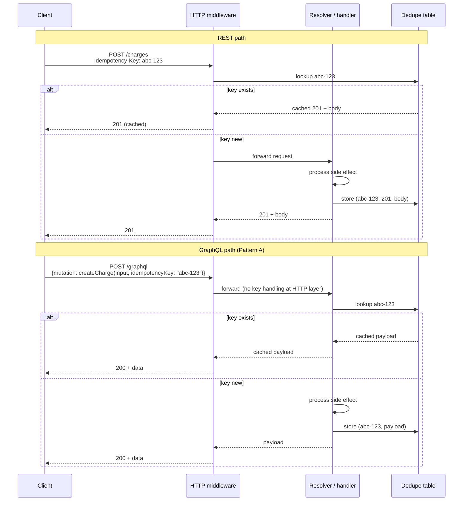
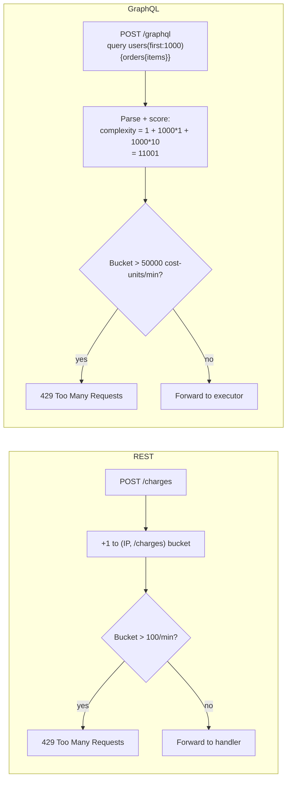

# BEE-597 GraphQL vs REST Request-Side HTTP Trade-offs Implementation Plan

> **For agentic workers:** REQUIRED SUB-SKILL: Use superpowers:subagent-driven-development (recommended) or superpowers:executing-plans to implement this plan task-by-task. Steps use checkbox (`- [ ]`) syntax for tracking.

**Goal:** Research, write, and publish BEE-597 "GraphQL vs REST: Request-Side HTTP Trade-offs" as a parallel EN + zh-TW article pair, per the design spec at `docs/superpowers/specs/2026-04-19-bee-597-graphql-rest-request-side-design.md` (commit `1947f52`).

**Architecture:** Documentation article. Two parallel markdown files following an adapted BEE template (Context → Principle → comparison table → 3 body sections with inline examples → Common Mistakes → Related BEPs → References). No separate `## Example` section per spec §3.8. Three Mermaid diagrams (one comparison table rendered as markdown table; one sequence diagram for idempotency; one cost-budget flow diagram for rate limiting). EN written first against verified primary sources, then zh-TW translated under personal style constraints. Render verification skipped per BEE-596 precedent. Single commit at the end matches project convention.

**Tech Stack:** VitePress 1.3.1, vitepress-plugin-mermaid 2.0.16, Mermaid 10.9.1, pnpm 8.15.5, Markdown.

---

## Reference Material

- **Spec:** `docs/superpowers/specs/2026-04-19-bee-597-graphql-rest-request-side-design.md` (commit `1947f52`). Read end-to-end before starting Task 1.
- **Sibling shipped article:** BEE-596 at `docs/en/API Design and Communication Protocols/596.md` and `docs/zh-tw/API Design and Communication Protocols/596.md` (commit `0bf8ea7`). This article references BEE-596 frequently; the engineer should know its content cold.
- **Sibling spec for tone reference:** `docs/superpowers/specs/2026-04-19-bee-596-graphql-http-caching-design.md`.
- **Project conventions:** `/Users/alive/Projects/backend-engineering-essentials/CLAUDE.md` (BEE template, vendor-neutrality, RFC 2119 voice, every reference URL must be verified).
- **Personal style constraints (zh-TW prose):** `~/.claude/CLAUDE.md`. Forbidden patterns:
  1. Contrastive negation (「不是 X，而是 Y」).
  2. Empty-contrast sentences where B is unrelated to A.
  3. Precision-puffery (「說得很清楚」, 「(動詞)得很精確」).
  4. Em-dash chains stringing filler clauses (「——」).
  5. Undefined adjectives (bare 「很重」 without scale).
  6. Undefined verbs without subject/range (bare 「可以跑」).
  7. `可以X可以Y可以Z` capability stacks.
- **Prior art for cross-reference patterns:**
  - `docs/en/Caching/205.md` — REST HTTP caching foundation
  - `docs/en/API Design and Communication Protocols/72.md` — REST idempotency canonical treatment (this article reuses its dedupe-table schema)
  - `docs/en/API Design and Communication Protocols/596.md` — GraphQL caching deep-dive

---

## File Structure

**Files to create:**
- `docs/en/API Design and Communication Protocols/597.md` — EN article (~2,800–3,400 words)
- `docs/zh-tw/API Design and Communication Protocols/597.md` — zh-TW translation, parallel structure

**Files to modify:**
- `docs/en/list.md` — append `- [597.GraphQL vs REST: Request-Side HTTP Trade-offs](597)` after the BEE-596 entry
- `docs/zh-tw/list.md` — append `- [597.GraphQL vs REST：請求端的 HTTP 取捨](597)` after the BEE-596 entry

**Files NOT to modify:**
- VitePress config — sidebar dynamic from frontmatter, no registration needed.
- Sibling BEE articles — out of scope for this plan.

---

## URL Reuse Notes (saves Task 2 work)

These URLs were verified live during BEE-596 research and the cited claims confirmed. Reuse without re-fetching unless drafting the article surfaces a claim not previously verified:

| URL | Verified claim |
|---|---|
| https://spec.graphql.org/October2021/ | Defines query/mutation operation types; mutations may have side effects; spec silent on HTTP transport |
| https://github.com/graphql/graphql-over-http | Stage-2 working draft; addresses GET method and `application/x-www-form-urlencoded` parameter encoding; silent on persisted documents |
| https://www.rfc-editor.org/rfc/rfc9111.html#name-overview-of-cache-operation | RFC 9111 §2 establishes that non-GET cacheable methods require both method-level allowance and a defined cache-key mechanism |
| https://developer.mozilla.org/en-US/docs/Web/HTTP/Guides/Caching | Documents `Cache-Control` directives |
| https://developer.mozilla.org/en-US/docs/Web/HTTP/Guides/Conditional_requests | Documents ETag + `If-None-Match` flow |

These were referenced in BEE-72 and remain stable:

| URL | Verified claim (from BEE-72) |
|---|---|
| https://httpwg.org/specs/rfc9110.html#idempotent.methods | RFC 9110 §9.2.2 defines idempotent methods (GET/HEAD/OPTIONS/PUT/DELETE) |
| https://docs.stripe.com/api/idempotent_requests | Stripe `Idempotency-Key` header pattern; 24h TTL; UUID v4 recommendation |
| https://brandur.org/idempotency-keys | Brandur Leach's deep-dive on Postgres-backed idempotency-key implementation |

All other URLs in spec §3.11 must be verified fresh in Task 2.

---

## Task 1: Pre-flight check

**Files:** none modified

- [ ] **Step 1: Read the spec end-to-end**

Read `docs/superpowers/specs/2026-04-19-bee-597-graphql-rest-request-side-design.md` in full. The plan below references spec section numbers (§3.4, §3.5, etc.); you must hold those in head, not look them up step-by-step.

- [ ] **Step 2: Read BEE-596 (the just-shipped sibling article)**

Read `docs/en/API Design and Communication Protocols/596.md` in full. This article is referenced from BEE-597's caching section and from cross-references throughout. Note: the caching section in BEE-597 is intentionally short (~600 words) because BEE-596 carries the full treatment — the engineer must not repeat 596's content here.

- [ ] **Step 3: Read BEE-72 (Idempotency in APIs)**

Read `docs/en/API Design and Communication Protocols/72.md` in full. The BEE-597 idempotency section assumes the BEE-72 dedupe-table schema and concurrent-duplicate handling; do not re-derive them. Reference `(user_id, key)` primary key, atomic insert with unique constraint, 24–72h TTL.

- [ ] **Step 4: Confirm clean working tree**

Run: `git status`
Expected: `nothing to commit, working tree clean` (or only the in-progress plan file). If anything else is dirty, stop and surface it before proceeding.

- [ ] **Step 5: Confirm node_modules present**

Run: `ls /Users/alive/Projects/backend-engineering-essentials/node_modules | head -3`
Expected: any output (confirms install is in place). If missing: `pnpm install`. No need to start the dev server — render verification is skipped per BEE-596 precedent.

---

## Task 2: Verify the new reference URLs

**Files:** none modified (research output captured in conversation context, used in Task 4)

Per project CLAUDE.md: "Every article MUST be researched against authoritative sources. AI internal knowledge alone is insufficient." For each URL: WebFetch the page, extract the specific quote/section that supports the cited claim, and record (URL, claim, supporting quote, accessed-date). Carry this evidence into Task 4's drafting.

URLs already verified in BEE-596 (see "URL Reuse Notes" above) do not need re-fetching.

- [ ] **Step 1: Verify IETF Idempotency-Key HTTP Header Field draft**

URL: `https://datatracker.ietf.org/doc/draft-ietf-httpapi-idempotency-key-header/`
Claim to confirm: An IETF httpapi WG draft exists standardizing the `Idempotency-Key` HTTP header field (originally a Stripe convention). Capture: current draft revision number, latest update date, IETF WG status (active vs expired). If the draft has been adopted as an RFC by research time, switch to the RFC URL.

- [ ] **Step 2: Verify Apollo Server query complexity / cost analysis docs**

Try first: `https://www.apollographql.com/docs/apollo-server/security/`
Fallback search: `site:apollographql.com query complexity cost analysis`
Claim to confirm: Apollo Server documents a query complexity / cost analysis pattern (either built-in or via a recommended plugin). Capture the canonical docs URL and a brief paraphrase of the directive or plugin signature. The Apollo documentation has reorganized in past years; verify the link is current.

- [ ] **Step 3: Verify graphql-armor (preferred) or graphql-cost-analysis**

Try first: `https://github.com/Escape-Technologies/graphql-armor`
Fallback: `https://github.com/slicknode/graphql-query-complexity`
Claim to confirm: At least one vendor-neutral library implements query complexity scoring outside Apollo. Capture the chosen project's name, license, last-commit date (proxy for active maintenance), and the directive/configuration pattern it uses. Pick whichever is more actively maintained at research time.

- [ ] **Step 4: Verify GraphQL Yoga / Envelop operation cost limits plugin**

Try first: `https://the-guild.dev/graphql/envelop/plugins/use-operation-cost-analyzer`
Fallback search: `site:the-guild.dev envelop cost analyzer` or `site:the-guild.dev yoga rate limit`
Claim to confirm: The Guild's Envelop or Yoga ecosystem provides an operation-cost or rate-limiting plugin that is independent of Apollo Server. Capture the plugin name and its configuration pattern.

- [ ] **Step 5: Find one neutral practitioner article on GraphQL rate limiting in production**

Search candidates (run a WebSearch first if needed):
- GitHub Engineering blog (they run a public GraphQL API; their public docs discuss rate limiting via cost units)
- Shopify, Netflix, Stripe engineering blogs

Acceptance criterion: an engineering blog post (not vendor product page) that discusses real-world cost-budget tuning, post-mortem of an under-protected GraphQL endpoint, or production lessons. Prefer one that names specific cost numbers from real systems. If no strong source can be found in 2–3 searches, drop it from the references list per the spec's contingency in §3.11 and note the omission in Task 5's self-review.

- [ ] **Step 6: Compile the final References block**

Produce the final References block for the article in the format `- [Source title](url) — one-sentence note on what claim it supports`. Include both the reused URLs (from "URL Reuse Notes" above) and the newly verified URLs from Steps 1–5. Format must match the existing convention in BEE-596 §References. Carry this block into Task 4 Step 9.

---

## Task 3: Create EN article skeleton

**Files:**
- Create: `docs/en/API Design and Communication Protocols/597.md`

- [ ] **Step 1: Create the file with frontmatter, H1, and section headers only**

Write the following into `docs/en/API Design and Communication Protocols/597.md`:

```markdown
---
id: 597
title: "GraphQL vs REST: Request-Side HTTP Trade-offs"
state: draft
---

# [BEE-597] GraphQL vs REST: Request-Side HTTP Trade-offs

:::info
REST inherits caching, idempotency, and rate limiting from HTTP itself. GraphQL gets none of them by default and must rebuild each at the schema or middleware layer. This article covers the three request-side gaps and the default mitigations.
:::

## Context

## Principle

## The three gaps at a glance

## Cacheability of reads

## Idempotency and retry semantics

## Rate limiting

## Common Mistakes

## Related BEPs

## References
```

Note the deliberate absence of a `## Example` section per spec §3.8.

- [ ] **Step 2: Verify file is well-formed**

Run: `head -10 "docs/en/API Design and Communication Protocols/597.md"`
Expected: frontmatter visible, `id: 597`, `title: "GraphQL vs REST: Request-Side HTTP Trade-offs"`, `state: draft`. Do not commit yet.

---

## Task 4: Write EN article body

**Files:**
- Modify: `docs/en/API Design and Communication Protocols/597.md`

For each step below, write the body of the corresponding section per the spec. The spec is the source of truth for content and word count targets. Render the spec into final prose that matches BEE-596's tone and density.

Style requirements throughout (apply to every step):
- RFC 2119 keywords (MUST, SHOULD, MAY, MUST NOT) used only in the Principle section and where guidance is normative — never as filler.
- Vendor-neutral. Apollo may be cited as one concrete implementation alongside named alternatives (graphql-armor, GraphQL Yoga / Envelop). No prose that recommends a specific vendor.
- No precision-puffery ("explains clearly", "exactly the right approach"). State things; do not editorialize about the clarity of the statement.
- No empty-contrast sentences ("not X but Y" where X and Y are unrelated).
- No undefined adjectives ("very fast" without a scale).

- [ ] **Step 1: Write the Context section** (per spec §3.1, ~250 words)

Recap BEE-596's framing in 2–3 sentences (do NOT re-explain caching). Enumerate the three things REST inherits from HTTP (cacheable URL, RFC 9110 idempotency semantics, per-route rate limiting). State the consequence: `POST /graphql` is opaque to intermediaries on all three axes. Close with the article's purpose: walk through each gap, show standard mitigations, recommend a default per gap. Frame explicitly that this is not a vendor comparison.

- [ ] **Step 2: Write the Principle section** (per spec §3.2, one paragraph)

Use the verbatim Principle paragraph from spec §3.2 as the basis. Adjust only if Task 2 reference verification surfaced a contradiction. Keep RFC 2119 voice.

- [ ] **Step 3: Write the "three gaps at a glance" section** (per spec §3.3, ~80 words + V1 table)

One short paragraph stating "the rest of the article expands each row of the table below," then the three-row comparison table from spec §3.3 verbatim:

| Concern | REST inherits from HTTP | GraphQL must build it |
|---|---|---|
| **Cacheable URL** | GET URL is the cache key; ETag/304 free at the edge | Persisted-query GET + `@cacheControl` + ETag (BEE-596) |
| **Idempotency** | RFC 9110 verbs + `Idempotency-Key` header | Idempotency key as schema argument or middleware-read header |
| **Rate limiting** | Per-IP × URL pattern at the gateway | Query depth limit + complexity scoring + per-resolver limits |

- [ ] **Step 4: Write the "Cacheability of reads" body section** (per spec §3.4, ~600 words)

Internal structure: REST baseline (~120 words) → GraphQL gap (~120 words) → Mitigation pattern (~250 words) → Recommendation (~110 words).

REST baseline: GET URL as cache key, intermediaries cache for free, ETag/304. Include one short wire example:

```http
GET /products/42 HTTP/1.1

HTTP/1.1 200 OK
Cache-Control: public, max-age=300
ETag: "v9-abc"
```

GraphQL gap: default `POST /graphql` defeats every CDN; cache fragmentation along query shapes. Reference BEE-596's three-blocker analysis (POST not cacheable, body-as-cache-key, response shape varies) without repeating the depth.

Mitigation pattern: persisted-query GET + `@cacheControl` + ETag (link to BEE-596 for full treatment); brief 4–5 sentence summary for readers who skipped 596. Alternative: accept that reads will hit origin (valid for low-traffic APIs).

Recommendation: default to persisted-query GET for reads served at scale (define "at scale" parenthetically as: read-traffic high enough that CDN hit rate would meaningfully reduce origin load). Low-traffic reads can accept POST. Never claim "we have caching" without measuring CDN hit rate per query.

- [ ] **Step 5: Write the "Idempotency and retry semantics" body section** (per spec §3.5, ~1,000 words)

Deepest section. Internal structure: REST baseline (~200 words) → GraphQL gap (~250 words) → Pattern A (~250 words including wire example) → Pattern B (~250 words including wire example) → V2 sequence diagram → Recommendation (~150 words).

REST baseline: RFC 9110 §9.2.2 defines GET/PUT/DELETE/HEAD as idempotent. POST/PATCH need explicit `Idempotency-Key` headers. Reference BEE-72 for the canonical Stripe pattern (UUID v4, `(user_id, key)` table, atomic insert, 24–72h TTL, concurrent-duplicate handling). Cite the IETF httpapi draft as the in-progress standardization (use the version captured in Task 2 Step 1).

GraphQL gap: four bullet points (queries SHOULD be side-effect-free by convention; mutations may have side effects; multi-mutation requests execute sequentially per spec; HTTP `Idempotency-Key` invisible to resolvers without explicit middleware). Frame the consequence: every team must engineer idempotency themselves.

Pattern A — schema argument:

```graphql
mutation CreateOrder($input: OrderInput!, $idempotencyKey: ID!) {
  createOrder(input: $input, idempotencyKey: $idempotencyKey) {
    id
    status
  }
}
```

Resolver checks dedupe table keyed on `idempotencyKey`. Pros: schema-explicit, transport-agnostic, contract visible in introspection. Cons: every mutation must carry the argument from day one; retrofitting changes every signature.

Pattern B — HTTP-header middleware:

```http
POST /graphql HTTP/1.1
Idempotency-Key: 550e8400-e29b-41d4-a716-446655440000
Content-Type: application/json

{"query":"mutation { createOrder(input: {...}) { id } }"}
```

Server middleware reads the header before executing the operation; on key miss, executes and writes through to the BEE-72 dedupe table. Pros: REST-compatible mental model, no schema change, uniform middleware across REST and GraphQL. Cons: invisible from schema, only works HTTP-fronted (not WebSocket subscriptions or SSE), per-request granularity (multi-mutation requests get one key for all mutations — silently breaks the contract).

Insert the V2 sequence diagram after the two patterns are described:



Recommendation: default to Pattern A for any non-idempotent mutation. Reserve Pattern B for retrofit. Either way, reuse the BEE-72 dedupe table; do not invent new storage. Multi-mutation requests need one key per mutation (Pattern A), not per request (Pattern B failure mode).

- [ ] **Step 6: Write the "Rate limiting" body section** (per spec §3.6, ~1,000 words)

Internal structure: REST baseline (~150 words) → GraphQL gap (~250 words + worst-case query) → Layer 1 (~80 words) → Layer 2 (~300 words including SDL example) → V3 cost-budget diagram → Layer 3 (~80 words) → Recommendation (~200 words).

REST baseline: per-IP × URL pattern, `429 Too Many Requests` with `Retry-After`, uniform cost-per-route maps to predictable origin envelope.

GraphQL gap: `POST /graphql` collapses per-route limiting; one query can do the work of thousands of requests. Worst-case query example:

```graphql
query {
  users(first: 1000) {
    orders(first: 100) {
      items(first: 50) {
        product {
          reviews(first: 100) {
            author {
              followers(first: 100) { name }
            }
          }
        }
      }
    }
  }
}
```

Layer 1 — query depth limit: reject queries deeper than N at parse time. Cheap, blunt. Default 10–15. Library plugins (Apollo, Yoga, graphql-armor — name those verified in Task 2).

Layer 2 — query complexity scoring: each field has a cost; parser sums; reject above budget. SDL example:

```graphql
type Query {
  users(first: Int!): [User!]! @cost(complexity: 1, multipliers: ["first"])
  product(id: ID!): Product @cost(complexity: 5)
}

type User {
  orders(first: Int!): [Order!]! @cost(complexity: 1, multipliers: ["first"])
}
```

Frame as the GraphQL analog of REST's per-IP requests-per-minute: unit is `cost units per minute per IP`. Cite the libraries verified in Task 2 (Apollo's plugin, graphql-armor or graphql-cost-analysis, Envelop/Yoga). Critical implementation point: set the budget by measuring the existing query catalog's cost distribution at the 99th percentile plus safety margin, not by guessing.

Insert V3 cost-budget diagram after Layer 2:



Layer 3 — per-resolver rate limiting: scalpel-targeted at known-expensive fields (search, ML inference, external API calls). Same backend (Redis token bucket) as REST, keyed by `(user, field)`.

Recommendation: all three layers stack. Per-IP request limit still useful as outer envelope; does not replace any of the above. Persisted-query allowlists (forward-reference to BEE-599) bound the worst case but only work with controlled client surface. Public APIs need layers 1–3 mandatorily; internal APIs with known clients can replace layers 1–2 with allowlists and keep layer 3.

- [ ] **Step 7: Write Common Mistakes section** (per spec §3.9, 5 items)

Write the five common mistakes from spec §3.9 in full prose. Each item:
1. Treating per-IP request rate limits as adequate protection for GraphQL.
2. Implementing GraphQL idempotency in a separate storage layer from REST.
3. Reading `Idempotency-Key` from HTTP headers without considering multi-mutation requests.
4. Setting a query complexity budget without measuring the existing query catalog.
5. Equating "we serve GraphQL over HTTP" with "we benefit from HTTP infrastructure."

Each mistake follows the BEE-596 §Common-Mistakes pattern: a one-sentence statement of the mistake, then 2–3 sentences explaining the failure mode and the fix.

- [ ] **Step 8: Write Related BEPs section** (per spec §3.10)

Three clusters plus two forward-references. Verify every referenced BEE file exists before listing it:

```bash
ls "docs/en/API Design and Communication Protocols/596.md" \
   "docs/en/API Design and Communication Protocols/74.md" \
   "docs/en/API Design and Communication Protocols/72.md" \
   "docs/en/Caching/205.md" \
   "docs/en/Distributed Systems/473.md" \
   "docs/en/Resilience and Reliability/261.md" \
   "docs/en/Resilience and Reliability/266.md" \
   "docs/en/Distributed Systems/449.md" \
   "docs/en/Multi-Tenancy/402.md"
```

If any file is missing, remove that line from the Related BEPs list and note it. Then write the Related BEPs section organized by cluster as described in spec §3.10. Use literal directory names with spaces in the link paths (per the BEE-485/596 convention), e.g. `[BEE-473](../Distributed Systems/473.md)`.

- [ ] **Step 9: Write References section**

Paste the verified References block compiled in Task 2 Step 6. Format must match BEE-596's References convention.

- [ ] **Step 10: Verify file is complete and reads end-to-end**

Run: `wc -w "docs/en/API Design and Communication Protocols/597.md"`
Expected: between 2,700 and 3,500 words (target 2,800–3,400 + frontmatter overhead).

Read the file end-to-end. Confirm: every section has substantive content (no empty headers); the comparison table is the orienting pivot; each body section follows REST-baseline → GraphQL-gap → mitigation → recommendation; no separate `## Example` section; no TODO/TBD/placeholder text.

---

## Task 5: EN self-review

**Files:** may modify `docs/en/API Design and Communication Protocols/597.md` for fixes

Run each check sequentially. If a check fails, fix the article inline and re-run.

- [ ] **Step 1: Vendor-neutrality check**

Run: `grep -in "apollo" "docs/en/API Design and Communication Protocols/597.md" | wc -l`
Inspect each match. Apollo references must appear only as: (a) one implementation among named alternatives (graphql-armor, GraphQL Yoga / Envelop), (b) verified-source citations in References. No prose that recommends Apollo as the right choice.

Run: `grep -inE "we recommend (apollo|relay|urql|yoga|hot chocolate)" "docs/en/API Design and Communication Protocols/597.md"`
Expected: zero matches.

- [ ] **Step 2: Precision-puffery check**

Run: `grep -inE "(clearly|precisely|exactly explains|explains exactly|says clearly)" "docs/en/API Design and Communication Protocols/597.md"`
Expected: zero matches in normal prose. The word "exactly" is permitted only for factual claims about protocol behavior (e.g., "the response is exactly the shape the client requested" is a factual claim about GraphQL, not self-praise).

- [ ] **Step 3: RFC 2119 voice check**

Run: `grep -nE "\b(MUST|SHOULD|MAY|MUST NOT|SHOULD NOT)\b" "docs/en/API Design and Communication Protocols/597.md"`
Inspect each match. The Principle section MUST contain at least one each of MUST, SHOULD, and one of MUST NOT or SHOULD NOT. Outside Principle, every keyword usage must be deliberate (e.g., quoting the GraphQL spec or RFC 9110).

- [ ] **Step 4: BEE template structural check (with deliberate departure)**

Confirm the article has, in order: frontmatter, H1, `:::info` tagline, `## Context`, `## Principle`, `## The three gaps at a glance`, `## Cacheability of reads`, `## Idempotency and retry semantics`, `## Rate limiting`, `## Common Mistakes`, `## Related BEPs`, `## References`. **There MUST NOT be a `## Example` section** — its absence is deliberate per spec §3.8.

Run: `grep -n "^## " "docs/en/API Design and Communication Protocols/597.md"`
Expected: 9 section headers in the order above. Specifically, no `## Example` header.

- [ ] **Step 5: Reference URL spot-check**

Pick three URLs at random from the References block. WebFetch each one. Confirm each is still live and the cited claim is still in the source. (Task 2 verified all of them, but URLs occasionally rot between tasks; this is a sanity check.)

- [ ] **Step 6: Cross-reference path check**

For each link in `## Related BEPs`, run `ls <resolved-path>` to confirm the target file exists. Adjust link paths if any 404. (The Task 4 Step 8 ls check should have caught these, but re-verify after final edits.)

- [ ] **Step 7: Mermaid block syntax check**

Run: `grep -c '^```mermaid' "docs/en/API Design and Communication Protocols/597.md"`
Expected: `2` (V2 sequence diagram in §Idempotency, V3 flowchart in §Rate limiting). V1 is a markdown table, not a mermaid block.

For each mermaid block, do a visual scan of the `participant`, `alt`, `else`, `end`, `subgraph`, `flowchart` keywords for typos. (Skipping live render verification per BEE-596 precedent; this static check is the substitute.)

---

## Task 6: Translate to zh-TW

**Files:**
- Create: `docs/zh-tw/API Design and Communication Protocols/597.md`

The zh-TW article is a parallel translation of the EN article. Same frontmatter (with translated title), same section structure, same Mermaid diagrams (verbatim — code is language-neutral), same code/HTTP snippets (verbatim). Only prose paragraphs translate.

- [ ] **Step 1: Read existing zh-TW articles to confirm house style**

Read `docs/zh-tw/API Design and Communication Protocols/596.md` (the just-shipped sibling). Match its conventions exactly: section headers in Chinese (`## 背景` not `## 背景 (Context)`), `state: draft` in English, technical terms inline in English, comparison-table cells with Chinese prose around English technical terms.

- [ ] **Step 2: Create the file with translated frontmatter, tagline, and section headers**

Write into `docs/zh-tw/API Design and Communication Protocols/597.md`:

```markdown
---
id: 597
title: "GraphQL vs REST：請求端的 HTTP 取捨"
state: draft
---

# [BEE-597] GraphQL vs REST：請求端的 HTTP 取捨

:::info
REST 從 HTTP 本身繼承快取、冪等性與速率限制三件事。GraphQL 預設一件也沒有，必須在 schema 層或 middleware 層自己重建。本文涵蓋三個請求端的缺口與預設緩解方案。
:::

## 背景

## 原則

## 三個缺口的鳥瞰

## 讀取的可快取性

## 冪等性與重試語意

## 速率限制

## 常見錯誤

## 相關 BEP

## 參考資料
```

The tagline above already avoids the forbidden patterns. Refine wording only if Step 1's house-style review reveals a tone mismatch.

- [ ] **Step 3: Translate each prose section**

For each EN section, write a parallel zh-TW version. Constraints:
- Technical terms stay in English: `Idempotency-Key`, `query complexity`, `429`, `Retry-After`, `RFC 9110`, `RFC 9111`, `persisted query`, `CDN`, `ETag`, `Cache-Control`, `POST`, `GET`, `GraphQL`, `REST`, `JSON`, field names, `__typename`, etc.
- Surrounding prose in Traditional Chinese (繁體中文).
- Forbidden patterns (from `~/.claude/CLAUDE.md`):
  - 「不是 X，而是 Y」 — rewrite as positive statement.
  - Empty contrasts where B is unrelated to A — rewrite both halves.
  - 「說得很清楚」, 「(動詞)得很精確」 — drop the puffery.
  - Em-dash chains stringing filler — replace with proper sentences or commas.
  - Bare 「很重」 / 「很大」 / 「很重要」 without scale — add scale or remove.
  - Bare 「可以跑」 without subject/range — name them.
  - 「可以 X 可以 Y 可以 Z」 排比句 — rewrite as concrete claims.
- Code blocks, HTTP snippets, GraphQL SDL, Mermaid diagrams: copy verbatim from EN.
- Tables: translate prose cells; keep technical terms in English.

- [ ] **Step 4: Verify file structure parity with EN**

Run:
```bash
grep -c "^## " "docs/zh-tw/API Design and Communication Protocols/597.md"
grep -c "^## " "docs/en/API Design and Communication Protocols/597.md"
```
Expected: identical counts (9 each).

Run:
```bash
grep -c '^```mermaid' "docs/zh-tw/API Design and Communication Protocols/597.md"
```
Expected: `2`.

- [ ] **Step 5: Style-rule scan**

Run: `grep -nE "不是.{1,30}而是" "docs/zh-tw/API Design and Communication Protocols/597.md"`
Expected: zero matches.

Run: `grep -nE "(說得很清楚|得很精確|寫得很精確)" "docs/zh-tw/API Design and Communication Protocols/597.md"`
Expected: zero matches.

Run: `grep -nE "可以.{1,15}可以.{1,15}可以" "docs/zh-tw/API Design and Communication Protocols/597.md"`
Expected: zero matches.

Run: `grep -n "——" "docs/zh-tw/API Design and Communication Protocols/597.md"`
Expected: zero matches (em-dash chain).

If any check fails, rewrite the offending sentence and re-run.

---

## Task 7: Update `list.md` in both locales

**Files:**
- Modify: `docs/en/list.md`
- Modify: `docs/zh-tw/list.md`

- [ ] **Step 1: Append entry to EN list.md**

Open `docs/en/list.md`. Find the line:
```
- [596.GraphQL HTTP-Layer Caching](596)
```
After it, add:
```
- [597.GraphQL vs REST: Request-Side HTTP Trade-offs](597)
```

- [ ] **Step 2: Append entry to zh-TW list.md**

Open `docs/zh-tw/list.md`. Find the line:
```
- [596.GraphQL 的 HTTP 層快取](596)
```
After it, add:
```
- [597.GraphQL vs REST：請求端的 HTTP 取捨](597)
```

- [ ] **Step 3: Verify both list.md files are well-formed**

Run: `tail -5 docs/en/list.md docs/zh-tw/list.md`
Expected: BEE-597 appears as the last entry in both, formatting consistent with the surrounding entries.

---

## Task 8: Final commit

**Files:** stages all of:
- `docs/en/API Design and Communication Protocols/597.md` (new)
- `docs/zh-tw/API Design and Communication Protocols/597.md` (new)
- `docs/en/list.md` (modified)
- `docs/zh-tw/list.md` (modified)

- [ ] **Step 1: Review the full diff**

Run: `git status`
Expected: 4 files (2 new, 2 modified). Nothing else.

Run: `git diff --stat`
Run: `git diff docs/en/list.md docs/zh-tw/list.md`
Expected: each list.md gets exactly one line added.

If any unrelated changes appear in the working tree, surface them before committing — do not bundle. (BEE-596 ran into a similar situation with an unrelated BEE-246 list.md change; the resolution was to commit the unrelated change separately.)

Read both new article files end-to-end one final time. Last opportunity to catch issues before they land on `main`.

- [ ] **Step 2: Stage and commit**

Run:
```bash
git add "docs/en/API Design and Communication Protocols/597.md" \
        "docs/zh-tw/API Design and Communication Protocols/597.md" \
        docs/en/list.md \
        docs/zh-tw/list.md
```

Run:
```bash
git commit -m "$(cat <<'EOF'
feat: add BEE-597 GraphQL vs REST Request-Side HTTP Trade-offs (EN + zh-TW)

Article B-1 of the planned four-article series on the HTTP-ecosystem
gap in GraphQL. Covers three request-side gaps where REST inherits
infrastructure from HTTP and GraphQL must rebuild: cacheability of
reads (linking to BEE-596), idempotency and retry semantics with two
mitigation patterns (schema argument vs HTTP-header middleware), and
rate limiting with three stacked layers (depth limit, complexity
scoring, per-resolver). Each section follows REST baseline → GraphQL
gap → mitigation patterns → recommendation.

Spec: docs/superpowers/specs/2026-04-19-bee-597-graphql-rest-request-side-design.md
Plan: docs/superpowers/plans/2026-04-19-bee-597-graphql-rest-request-side.md

Co-Authored-By: Claude Opus 4.7 (1M context) <noreply@anthropic.com>
EOF
)"
```

- [ ] **Step 3: Verify commit landed**

Run: `git log -1 --stat`
Expected: 4 files in the commit, message as above.

Run: `git status`
Expected: `nothing to commit, working tree clean`.

---

## Done

After Task 8, the article is on `main` with the verification chain complete:
1. Spec approved by user (commit `1947f52`)
2. New reference URLs verified, reused URLs trusted from BEE-596 (Task 2)
3. Article structurally matches the adapted BEE template (Task 5)
4. List.md updated in both locales (Task 7)
5. Single commit per project convention (Task 8)

Next steps in the series (separate brainstorm cycles, not part of this plan):
- **NEW-B-2 (BEE-598):** GraphQL vs REST — Response-Side HTTP Trade-offs (observability, authorization granularity, error semantics)
- **NEW-C (BEE-599):** GraphQL Operational Patterns (persisted-query allowlisting as DoS/security boundary, query complexity governance, schema versioning)
