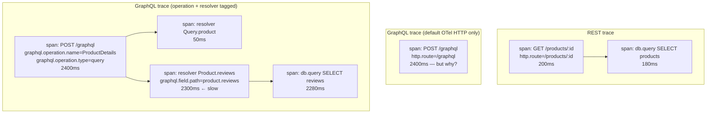
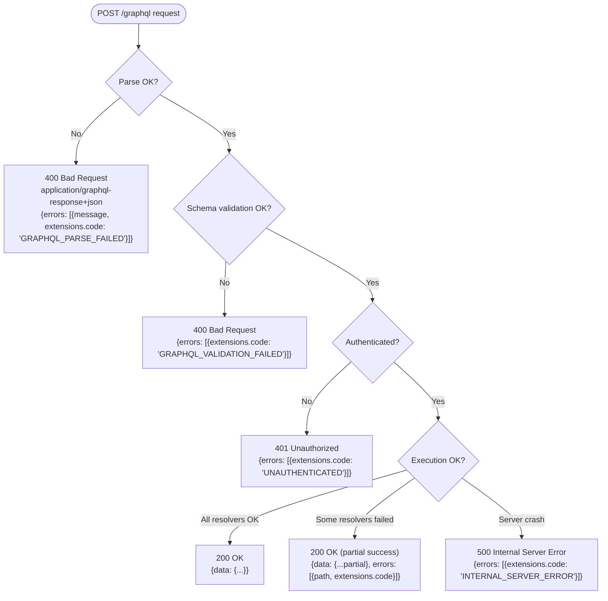

# BEE-598 GraphQL vs REST Response-Side HTTP Trade-offs Implementation Plan

> **For agentic workers:** REQUIRED SUB-SKILL: Use superpowers:subagent-driven-development (recommended) or superpowers:executing-plans to implement this plan task-by-task. Steps use checkbox (`- [ ]`) syntax for tracking.

**Goal:** Research, write, and publish BEE-598 "GraphQL vs REST: Response-Side HTTP Trade-offs" as a parallel EN + zh-TW article pair, per the design spec at `docs/superpowers/specs/2026-04-19-bee-598-graphql-rest-response-side-design.md` (commit `d754705`).

**Architecture:** Documentation article. Two parallel markdown files following an adapted BEE template (Context → Principle → comparison table → 3 body sections with inline examples → Common Mistakes → Related BEPs → References). No separate `## Example` section per spec §3.8. Three Mermaid diagrams (one comparison table; one span-tree diagram; one error-status decision tree). EN written first against verified primary sources, then polished, then translated to zh-TW, then polished again. Render verification skipped per BEE-596/597 precedent. Single commit at the end matches project convention.

**Tech Stack:** VitePress 1.3.1, vitepress-plugin-mermaid 2.0.16, Mermaid 10.9.1, pnpm 8.15.5, Markdown.

---

## Reference Material

- **Spec:** `docs/superpowers/specs/2026-04-19-bee-598-graphql-rest-response-side-design.md` (commit `d754705`). Read end-to-end before starting Task 1.
- **Sibling shipped articles:**
  - BEE-596 at `docs/en/API Design and Communication Protocols/596.md` (commit `0bf8ea7`) — caching deep-dive
  - BEE-597 at `docs/en/API Design and Communication Protocols/597.md` (commit `22d1f3e`) — sibling article B-1, request-side
- **Sibling specs/plans for tone reference:**
  - `docs/superpowers/specs/2026-04-19-bee-597-graphql-rest-request-side-design.md`
  - `docs/superpowers/plans/2026-04-19-bee-597-graphql-rest-request-side.md`
- **Project conventions:** `/Users/alive/Projects/backend-engineering-essentials/CLAUDE.md` (BEE template, vendor-neutrality, RFC 2119 voice, every reference URL must be verified).
- **Personal style constraints (zh-TW prose):** `~/.claude/CLAUDE.md`. Forbidden patterns:
  1. Contrastive negation (「不是 X，而是 Y」).
  2. Empty-contrast sentences where B is unrelated to A.
  3. Precision-puffery (「說得很清楚」, 「(動詞)得很精確」).
  4. Em-dash chains stringing filler clauses (「——」).
  5. Undefined adjectives (bare 「很重」 without scale).
  6. Undefined verbs without subject/range (bare 「可以跑」).
  7. `可以X可以Y可以Z` capability stacks.
- **Persistent memory feedback (NEW for this article):** `~/.claude/projects/-Users-alive-Projects-backend-engineering-essentials/memory/feedback_polish_documents_before_commit.md` — run polish-documents skill on EN+zh-TW article files before final commit.
- **Prior art for REST baselines this article references:**
  - `docs/en/API Design and Communication Protocols/75.md` — REST error handling, RFC 9457 Problem Details, anti-pattern enumeration this article calls back to
  - `docs/en/Observability/322.md` — distributed tracing fundamentals, W3C trace context, span model
  - `docs/en/Authentication and Authorization/{10,12,14}.md` — REST authorization baselines (AuthN vs AuthZ, OAuth/OIDC, RBAC vs ABAC)

---

## File Structure

**Files to create:**
- `docs/en/API Design and Communication Protocols/598.md` — EN article (~3,000–3,600 words)
- `docs/zh-tw/API Design and Communication Protocols/598.md` — zh-TW translation, parallel structure

**Files to modify:**
- `docs/en/list.md` — append `- [598.GraphQL vs REST: Response-Side HTTP Trade-offs](598)` after the BEE-597 entry
- `docs/zh-tw/list.md` — append `- [598.GraphQL vs REST：回應端的 HTTP 取捨](598)` after the BEE-597 entry

**Files NOT to modify:**
- VitePress config — sidebar dynamic from frontmatter, no registration needed.
- Sibling BEE articles — out of scope for this plan.

---

## URL Reuse Notes (saves Task 2 work)

These URLs were verified live during BEE-596 and BEE-597 research and the cited claims confirmed. Reuse without re-fetching unless drafting the article surfaces a claim not previously verified:

| URL | Verified claim | Source article |
|---|---|---|
| https://spec.graphql.org/October2021/ | Defines query/mutation operation types; mutations may have side effects; spec silent on HTTP transport | BEE-596 |
| https://github.com/graphql/graphql-over-http | Stage-2 working draft; addresses GET method and `application/x-www-form-urlencoded` parameter encoding | BEE-596 |
| https://www.rfc-editor.org/rfc/rfc9111.html#name-overview-of-cache-operation | RFC 9111 §2 establishes that non-GET cacheable methods require both method-level allowance and a defined cache-key mechanism | BEE-596 |
| https://developer.mozilla.org/en-US/docs/Web/HTTP/Guides/Caching | Documents `Cache-Control` directives | BEE-596 |
| https://developer.mozilla.org/en-US/docs/Web/HTTP/Guides/Conditional_requests | Documents ETag + `If-None-Match` flow | BEE-596 |
| https://httpwg.org/specs/rfc9110.html#idempotent.methods | RFC 9110 §9.2.2 defines idempotent methods (GET/HEAD/OPTIONS/PUT/DELETE) | BEE-72 / BEE-597 |
| https://docs.stripe.com/api/idempotent_requests | Stripe `Idempotency-Key` header pattern | BEE-72 / BEE-597 |
| https://datatracker.ietf.org/doc/draft-ietf-httpapi-idempotency-key-header/ | IETF httpapi WG draft -07, expired October 2025 | BEE-597 |
| https://www.apollographql.com/docs/graphos/routing/security/demand-control | Apollo Demand Control (query cost analysis) | BEE-597 |
| https://github.com/Escape-Technologies/graphql-armor | graphql-armor: MIT, active, multi-server middleware | BEE-597 |
| https://docs.github.com/en/graphql/overview/rate-limits-and-query-limits-for-the-graphql-api | GitHub GraphQL API points-based rate limit | BEE-597 |
| https://www.rfc-editor.org/rfc/rfc9457.html | RFC 9457 Problem Details for HTTP APIs | BEE-75 |
| https://httpwg.org/specs/rfc9110.html | RFC 9110 HTTP Semantics | BEE-75 |

This article will reuse RFC 9457, RFC 9110, the GraphQL spec, the GraphQL-over-HTTP draft, and graphql-armor (which also covers authorization). All other URLs in spec §3.11 must be verified fresh in Task 2.

---

## Task 1: Pre-flight check

**Files:** none modified

- [ ] **Step 1: Read the spec end-to-end**

Read `docs/superpowers/specs/2026-04-19-bee-598-graphql-rest-response-side-design.md` in full. The plan below references spec section numbers (§3.4, §3.5, §3.6, etc.); you must hold those in head, not look them up step-by-step.

- [ ] **Step 2: Read the two shipped sibling articles**

Read in order:
- `docs/en/API Design and Communication Protocols/597.md` (BEE-597, the immediate sibling) — match its tone, structure, and section density. The article structure of BEE-598 is intentionally identical except for one section (errors) running heavier.
- `docs/en/API Design and Communication Protocols/596.md` (BEE-596) — referenced in the observability section's persisted-query-opacity note.

- [ ] **Step 3: Read the three REST baseline articles BEE-598 references**

- `docs/en/API Design and Communication Protocols/75.md` (BEE-75) — REST error handling, RFC 9457 Problem Details, anti-patterns. The error-semantics section in BEE-598 explicitly calls back to this article's anti-pattern list. Note: BEE-75 cites RFC 9457 (current, replaces RFC 7807 from 2016).
- `docs/en/Observability/322.md` (BEE-322) — distributed tracing fundamentals, W3C `traceparent`, span/trace model. The observability section in BEE-598 builds on this foundation.
- `docs/en/Authentication and Authorization/14.md` (BEE-14) — RBAC vs ABAC. The authorization section in BEE-598 references this for REST baseline patterns.

- [ ] **Step 4: Confirm clean working tree**

Run: `git status`
Expected: `nothing to commit, working tree clean` (or only the in-progress plan file). If anything else is dirty, stop and surface it before proceeding.

- [ ] **Step 5: Confirm node_modules present and polish-documents skill available**

Run: `ls /Users/alive/Projects/backend-engineering-essentials/node_modules | head -3`
Expected: any output. If missing: `pnpm install`.

Confirm the polish-documents skill is available by checking the available-skills list in this session. Skill name: `polish-documents`. Description: "Use when refining an existing technical document at a given file path — tightens sentences, removes prohibited style patterns (contrastive negation, em-dash chains, precision puffery, unanchored claims, capability stacks), and applies Google Developer Style principles while preserving the author's voice. Handles English, Traditional Chinese, and mixed-language Markdown files."

If polish-documents is not in the available skills list, stop and surface — the plan depends on it.

---

## Task 2: Verify the new reference URLs

**Files:** none modified (research output captured in conversation context, used in Task 4)

Per project CLAUDE.md: "Every article MUST be researched against authoritative sources." For each URL: WebFetch the page, extract the specific quote/section that supports the cited claim, and record (URL, claim, supporting quote, accessed-date). Carry this evidence into Task 4's drafting.

URLs already verified (see "URL Reuse Notes" above) do not need re-fetching.

- [ ] **Step 1: Verify GraphQL-over-HTTP draft — status code section**

Try first: the rendered draft at `https://graphql.github.io/graphql-over-http/draft/` (if available; check during BEE-596 research, this URL was unconfirmed)
Fallback: the spec markdown at `https://github.com/graphql/graphql-over-http/blob/main/spec/GraphQLOverHTTP.md`
Claim to confirm: The draft specifies HTTP 4xx/5xx status codes for several failure categories (parse error, validation error, authentication required, unsupported media type, server execution failure). Capture the exact status mapping table the draft proposes. Confirm the content negotiation mechanism via `application/graphql-response+json` (new behavior) versus `application/json` (legacy all-200 behavior).

If the status code section in the draft has changed substantially from what spec §3.6 describes, revise the article's wording accordingly.

- [ ] **Step 2: Verify Apollo Server error handling and `extensions.code` defaults**

URL: `https://www.apollographql.com/docs/apollo-server/data/errors`
Claims to confirm:
  (a) Apollo Server documents an error handling system with default `extensions.code` values: `UNAUTHENTICATED`, `FORBIDDEN`, `BAD_USER_INPUT`, `INTERNAL_SERVER_ERROR`, `PERSISTED_QUERY_NOT_FOUND`, etc.
  (b) Apollo Server 4+ supports the `application/graphql-response+json` content negotiation for the new HTTP status code semantics (opt-in by client `Accept` header).
  (c) Custom application errors can extend the default code set.

Capture the exact list of default codes Apollo ships. If the URL has moved (Apollo docs reorganize periodically), search for current location.

- [ ] **Step 3: Verify OpenTelemetry Semantic Conventions for GraphQL**

URL: `https://opentelemetry.io/docs/specs/semconv/graphql/`
Claims to confirm:
  (a) The semantic conventions define `graphql.operation.name`, `graphql.operation.type`, and `graphql.document` as standard span attributes.
  (b) The conventions are formally specified, not just recommended (status: stable, experimental, etc. — capture status).

If the URL has moved or the section is in a different location under `opentelemetry.io/docs/specs/semconv/`, find the canonical current location.

- [ ] **Step 4: Verify GraphQL Yoga / Envelop useOpenTelemetry plugin**

URL: `https://the-guild.dev/graphql/envelop/plugins/use-open-telemetry`
Claim to confirm: The Envelop ecosystem (used by GraphQL Yoga) provides a `useOpenTelemetry` plugin that adds operation-name and per-resolver span instrumentation. Capture the plugin name, configuration pattern, and what spans it produces by default.

If the URL has moved, search `site:the-guild.dev envelop opentelemetry` for current location.

- [ ] **Step 5: Verify graphql-shield**

URL: `https://github.com/dimatill/graphql-shield`
Fallback if dimatill fork is stale: `https://github.com/maticzav/graphql-shield`
Claim to confirm: graphql-shield is a maintained npm library implementing schema-directive-style authorization rules for GraphQL. Capture: license, last commit date or recent activity (active maintenance), the rule API pattern (e.g., `rule()`, `and()`, `or()` combinators).

If neither repo is actively maintained, note the maintenance status and adjust the article's wording (e.g., describe it as "the early reference implementation, now less actively maintained — current alternatives include graphql-armor and Apollo's built-in directives").

- [ ] **Step 6: Verify Open Policy Agent (OPA) GraphQL integration**

Try first: `https://www.openpolicyagent.org/docs/latest/external-data/`
Fallback: search `site:openpolicyagent.org GraphQL` or look for community examples
Claim to confirm: OPA can serve as a centralized policy engine for GraphQL field-level authorization, with policies written in Rego and evaluated per-resolver (ideally with batch evaluation support).

If OPA does not have a first-party GraphQL doc page, cite a community-maintained example (e.g., a blog post by an OPA user or a GitHub repo with a working example) and note the lack of first-party documentation in the article. Drop OPA from references entirely if no credible source can be found.

- [ ] **Step 7 (optional): Verify Apollo Federation error model**

URL: `https://www.apollographql.com/docs/federation/errors`
Claim to confirm: Apollo Federation has a documented error propagation model where downstream subgraph errors become entries in the federated response's `errors[]` with paths pointing to the failed field. Cite if the article's partial-success section mentions Federation; drop if depth not warranted.

- [ ] **Step 8 (optional): Find one neutral practitioner article on GraphQL observability or authorization at scale**

Search candidates:
- GitHub Engineering blog
- Shopify Engineering blog
- Netflix TechBlog
- Stripe blog
- Honeycomb blog (since they do observability)
- The Guild's blog (since they ship the Envelop / GraphQL Yoga ecosystem)

Acceptance criterion: an engineering blog post (not a vendor product page) that discusses real-world GraphQL observability instrumentation, authorization at scale, or error model migration. If no strong source can be found in 2–3 searches, drop per the spec's contingency in §3.11 and note the omission in Task 5's self-review.

- [ ] **Step 9: Compile the final References block**

Produce the final References block for the article in the format `- [Source title](url) — one-sentence note on what claim it supports`. Include reused URLs (from "URL Reuse Notes" above where applicable) and newly verified URLs from Steps 1–8. Format must match the existing convention in BEE-596 §References. Carry this block into Task 4 Step 9.

---

## Task 3: Create EN article skeleton

**Files:**
- Create: `docs/en/API Design and Communication Protocols/598.md`

- [ ] **Step 1: Create the file with frontmatter, H1, and section headers only**

Write the following into `docs/en/API Design and Communication Protocols/598.md`:

```markdown
---
id: 598
title: "GraphQL vs REST: Response-Side HTTP Trade-offs"
state: draft
---

# [BEE-598] GraphQL vs REST: Response-Side HTTP Trade-offs

:::info
REST inherits status-code-driven errors, per-route observability, and URL-based authorization from HTTP itself. GraphQL collapses all three to a single endpoint and must rebuild each at the schema or middleware layer. This article covers the three response-side gaps and the default mitigations.
:::

## Context

## Principle

## The three gaps at a glance

## Observability

## Authorization granularity

## Error semantics

## Common Mistakes

## Related BEPs

## References
```

Note the deliberate absence of a `## Example` section per spec §3.8.

- [ ] **Step 2: Verify file is well-formed**

Run: `head -10 "docs/en/API Design and Communication Protocols/598.md"`
Expected: frontmatter visible, `id: 598`, `title: "GraphQL vs REST: Response-Side HTTP Trade-offs"`, `state: draft`.

---

## Task 4: Write EN article body

**Files:**
- Modify: `docs/en/API Design and Communication Protocols/598.md`

For each step below, write the body of the corresponding section per the spec. Render the spec into final prose that matches BEE-597's tone and density.

Style requirements throughout (apply to every step):
- RFC 2119 keywords (MUST, SHOULD, MAY, MUST NOT) used only in the Principle section and where guidance is normative — never as filler.
- Vendor-neutral. Apollo may be cited as one concrete implementation alongside named alternatives (graphql-shield, graphql-armor, GraphQL Yoga / Envelop, OPA). No prose that recommends a specific vendor.
- No precision-puffery ("explains clearly", "exactly the right approach"). State things; do not editorialize about the clarity of the statement.
- No empty-contrast sentences ("not X but Y" where X and Y are unrelated).
- No undefined adjectives ("very fast" without a scale).

- [ ] **Step 1: Write the Context section** (per spec §3.1, ~250 words)

Symmetric callback to BEE-597 in 2–3 sentences. Enumerate the three things HTTP gives REST for free on the response side (status-code errors, per-route observability, URL-based authorization). State the consequence: GraphQL collapses all three to a single endpoint. Close with the article's purpose. Frame explicitly: not a vendor comparison, not "REST is better."

- [ ] **Step 2: Write the Principle section** (per spec §3.2, one paragraph)

Use the verbatim Principle paragraph from spec §3.2. Adjust only if Task 2 reference verification surfaced a contradiction. Keep RFC 2119 voice.

- [ ] **Step 3: Write the "three gaps at a glance" section** (per spec §3.3, ~80 words + V1 table)

One short paragraph stating "the rest of the article expands each row of the table below," then the three-row comparison table from spec §3.3 verbatim:

| Concern | REST inherits from HTTP | GraphQL must build it |
|---|---|---|
| **Error semantics** | HTTP status code + RFC 9457 Problem Details (BEE-75) | HTTP-over-GraphQL status mapping + `errors[].extensions.code` + partial-success contract |
| **Observability** | Per-route metrics, traces, logs labeled by URL pattern | Operation-name tagging + per-resolver spans + schema-aware metrics |
| **Authorization** | URL/method ACLs at the gateway (RBAC/ABAC) | Schema directives + centralized policy engine + per-resolver enforcement |

- [ ] **Step 4: Write the "Observability" body section** (per spec §3.4, ~900 words)

Internal structure: REST baseline (~150) → GraphQL gap (~200) → Layer 1 (~100) → Layer 2 (~150) → V2 span tree comparison → Layer 3 (~100) → Recommendation (~150).

REST baseline: URL pattern as the natural label; `http.route="/products/:id"` standard span attribute; per-route latency dashboards as a default. Cross-link to BEE-322.

GraphQL gap: all traffic at one URL; default OTel HTTP instrumentation produces single span labeled `POST /graphql`; three derived problems (operation indistinguishability, resolver-level invisibility, persisted-query opacity).

Layer 1 (operation-name tagging): server middleware (Apollo Server, GraphQL Yoga via Envelop's `useOpenTelemetry`) reads operation name and adds it as `graphql.operation.name`, `graphql.operation.type` span attributes — per OpenTelemetry Semantic Conventions for GraphQL (cite the exact URL verified in Task 2 Step 3).

Layer 2 (per-resolver spans): GraphQL executor wraps each resolver in a child span. Apollo Server's traces produce one span per resolved field. Cost is non-trivial; production deployments sample at the operation level.

Insert V2 span tree comparison (see Step 4-V2 below).

Layer 3 (schema-aware metrics): counters/histograms keyed on `graphql.operation.name` rather than route. Plus per-resolver latency histogram keyed on `graphql.field.path`.

Recommendation: Layer 1 non-negotiable; Layer 2 sampled (1–10% full resolver tracing); Layer 3 replaces per-route with per-operation histograms. Persisted-query deployments need hash-to-operation-name lookup table.

V2 (insert after Layer 2):



- [ ] **Step 5: Write the "Authorization granularity" body section** (per spec §3.5, ~900 words)

Internal structure: REST baseline (~150) → GraphQL gap (~200) → Pattern A (~150 + SDL example) → Pattern B (~150) → Pattern C (~80) → Recommendation (~150).

REST baseline: URL/method-layer authorization. Gateway-level RBAC (BEE-14). ABAC policies (OPA, AWS Verified Permissions) at the gateway. Resource ownership in the handler. Two layers compose. Cross-link to BEE-10.

GraphQL gap: gateway-level URL/method ACLs collapse. Three derived problems (field-level visibility, per-argument access rules, N+1 on authorization checks).

Pattern A (schema directives) with SDL example:

```graphql
type Query {
  users: [User!]! @auth(requires: ROLE_ADMIN)
  publicProducts: [Product!]!
}

type User {
  id: ID!
  name: String!                                  # public
  email: String! @auth(requires: ROLE_SELF_OR_ADMIN)  # sensitive
}
```

Apollo Server, graphql-shield, graphql-armor implement this. Schema-explicit, introspection-visible. Limitation: directive arguments are static; dynamic policies need imperative resolver checks.

Pattern B (centralized policy engine): OPA, Cerbos, AWS Verified Permissions. Policies in Rego. Pros: consistency, audit-friendly, complex ABAC. Cons: more infrastructure, latency cost (mitigate via batch).

Pattern C (per-resolver imperative): each resolver embeds its own auth logic. Easiest to start, hardest to audit. Acceptable for small APIs.

Recommendation: default Pattern A for static role checks. Layer Pattern B for dynamic policies. Reserve Pattern C for one-offs. CRITICAL: any policy engine must support batch evaluation (one call with N pairs, not N calls).

- [ ] **Step 6: Write the "Error semantics" body section** (per spec §3.6, ~1,300 words — heavier section)

Internal structure: REST baseline (~200) → GraphQL gap (~250) → Mitigation A: status code mapping (~250) → V3 decision tree → Mitigation B: extensions.code (~200) → Mitigation C: partial-success (~250) → Recommendation (~150).

REST baseline: HTTP status as canonical signal; RFC 9457 Problem Details body; status drives every HTTP-aware tool. Cross-link to BEE-75.

GraphQL gap: default 200 OK regardless of failure; precisely the "200 with success flag in body" anti-pattern BEE-75 calls out. Three sub-problems (HTTP infrastructure cannot see failures; errors not standardized at schema level; partial-success uniquely GraphQL).

Mitigation A: GraphQL-over-HTTP status code mapping. Reverses the all-200 convention. 4xx/5xx for parse, validation, auth, unsupported-media, server-failure. Opt-in via `Accept: application/graphql-response+json` content negotiation; legacy `Accept: application/json` keeps all-200 behavior. Use the verified status mapping table from Task 2 Step 1.

Insert V3 decision tree (see Step 6-V3 below).

Mitigation B: `extensions.code` conventions. Apollo defaults: `UNAUTHENTICATED`, `FORBIDDEN`, `BAD_USER_INPUT`, `INTERNAL_SERVER_ERROR`, `PERSISTED_QUERY_NOT_FOUND`. Application errors add their own. Treat codes like API paths: stable, documented, never changed once published.

Mitigation C: partial-success handling. Return as much `data` as resolvable; null out failed fields. Each null in `data` corresponds to an entry in `errors[]` with a `path`. Clients MUST inspect `errors[]` even when `data` is non-null. Non-nullable fields propagate failure upward to nearest nullable ancestor. Federation: subgraph errors become entries in `errors[]` for that field's path.

Recommendation: adopt GraphQL-over-HTTP status code mapping for new APIs. Always emit `extensions.code`. Design schemas with deliberate non-null usage. Document the partial-success contract explicitly. Cross-link to BEE-75.

V3 (insert after Mitigation A):



- [ ] **Step 7: Write Common Mistakes section** (per spec §3.9, 5 items)

Write the five common mistakes from spec §3.9 in full prose:
1. Returning 200 OK from `POST /graphql` when the request fundamentally failed.
2. Treating `extensions.code` as optional or inventing per-error codes ad hoc.
3. Default OTel HTTP instrumentation as the entire observability story.
4. Field-level authorization implemented only in resolvers, with no batch evaluation.
5. Forgetting that partial-success responses still need clients to inspect `errors[]`.

Each follows the BEE-596/597 pattern: one-sentence statement of the mistake, then 2–3 sentences explaining the failure mode and the fix.

- [ ] **Step 8: Write Related BEPs section** (per spec §3.10)

Three clusters plus one forward-reference. Verify every referenced BEE file exists before listing it:

```bash
ls "docs/en/API Design and Communication Protocols/75.md" \
   "docs/en/API Design and Communication Protocols/72.md" \
   "docs/en/API Design and Communication Protocols/597.md" \
   "docs/en/Observability/322.md" \
   "docs/en/Observability/321.md" \
   "docs/en/Observability/320.md" \
   "docs/en/Authentication and Authorization/10.md" \
   "docs/en/Authentication and Authorization/14.md" \
   "docs/en/Authentication and Authorization/12.md" \
   "docs/en/Security Fundamentals/499.md"
```

If any file is missing, remove that line from the Related BEPs list and note it. Then write the Related BEPs section organized by cluster as described in spec §3.10. Use literal directory names with spaces in the link paths (per the BEE-485/596/597 convention), e.g. `[BEE-499](../Security Fundamentals/499.md)`.

- [ ] **Step 9: Write References section**

Paste the verified References block compiled in Task 2 Step 9. Format must match BEE-596/597 References convention.

- [ ] **Step 10: Verify file is complete and reads end-to-end**

Run: `wc -w "docs/en/API Design and Communication Protocols/598.md"`
Expected: between 2,900 and 3,800 words (target 3,000–3,600 + frontmatter overhead).

Read the file end-to-end. Confirm: every section has substantive content (no empty headers); the comparison table is the orienting pivot; each body section follows REST-baseline → GraphQL-gap → mitigation/pattern → recommendation; no separate `## Example` section; no TODO/TBD/placeholder text.

---

## Task 5: EN self-review

**Files:** may modify `docs/en/API Design and Communication Protocols/598.md` for fixes

Run each check sequentially. If a check fails, fix the article inline and re-run.

- [ ] **Step 1: Vendor-neutrality check**

Run: `grep -in "apollo" "docs/en/API Design and Communication Protocols/598.md" | wc -l`
Inspect each match. Apollo references must appear only as: (a) one implementation among named alternatives (graphql-shield, graphql-armor, GraphQL Yoga / Envelop, OPA), (b) verified-source citations in References. No prose that recommends Apollo as the right choice.

Run: `grep -inE "we recommend (apollo|relay|urql|yoga|hot chocolate|graphql-shield|graphql-armor)" "docs/en/API Design and Communication Protocols/598.md"`
Expected: zero matches.

- [ ] **Step 2: Precision-puffery check**

Run: `grep -inE "(clearly|precisely|exactly explains|explains exactly|says clearly)" "docs/en/API Design and Communication Protocols/598.md"`
Expected: zero matches in normal prose. The word "exactly" is permitted only for factual claims about protocol behavior.

- [ ] **Step 3: RFC 2119 voice check**

Run: `grep -nE "\b(MUST|SHOULD|MAY|MUST NOT|SHOULD NOT)\b" "docs/en/API Design and Communication Protocols/598.md"`
Inspect each match. The Principle section MUST contain at least one each of MUST and SHOULD, and one of MUST NOT or SHOULD NOT. Outside Principle, every keyword usage must be deliberate (e.g., quoting the GraphQL spec).

- [ ] **Step 4: BEE template structural check (with deliberate departure)**

Confirm the article has, in order: frontmatter, H1, `:::info` tagline, `## Context`, `## Principle`, `## The three gaps at a glance`, `## Observability`, `## Authorization granularity`, `## Error semantics`, `## Common Mistakes`, `## Related BEPs`, `## References`. **There MUST NOT be a `## Example` section** — its absence is deliberate per spec §3.8.

Run: `grep -n "^## " "docs/en/API Design and Communication Protocols/598.md"`
Expected: 9 section headers in the order above. Specifically, no `## Example` header.

- [ ] **Step 5: Reference URL spot-check**

Pick three URLs at random from the References block. WebFetch each one. Confirm each is still live and the cited claim is still in the source.

- [ ] **Step 6: Cross-reference path check**

For each link in `## Related BEPs`, run `ls <resolved-path>` to confirm the target file exists. Adjust link paths if any 404.

- [ ] **Step 7: Mermaid block syntax check**

Run: `grep -c '^```mermaid' "docs/en/API Design and Communication Protocols/598.md"`
Expected: `2` (V2 span tree in Observability, V3 decision tree in Error semantics). V1 is a markdown table, not a mermaid block.

For each mermaid block, do a visual scan of the `subgraph`, `flowchart`, `-->`, `--` keyword/syntax for typos.

---

## Task 6: Polish EN article with polish-documents skill

**Files:** may modify `docs/en/API Design and Communication Protocols/598.md`

Per persistent memory feedback, polish-documents runs AFTER self-review (Task 5) and BEFORE zh-TW translation (Task 7).

- [ ] **Step 1: Invoke polish-documents on the EN article**

Use the Skill tool with skill name `polish-documents` and pass the article file path as the argument: `docs/en/API Design and Communication Protocols/598.md`.

The polish-documents skill applies Google Developer Style principles and removes:
- Contrastive negation
- Em-dash chains
- Precision puffery
- Unanchored claims
- Capability stacks

While preserving the author's voice.

- [ ] **Step 2: Review polish output**

The skill returns a polished version of the file (or a diff). Review every change:
- Accept changes that fix forbidden patterns or tighten sentences without changing meaning.
- Reject changes that:
  - Remove deliberate technical precision (e.g., RFC 2119 keywords in the Principle).
  - Soften RFC 2119 normative voice into descriptive prose.
  - Replace verified terminology with generic synonyms (e.g., "Cache-Control header" → "HTTP cache header").
  - Restructure section flow set during brainstorm.

If the polish output makes substantive changes that would require re-running the self-review checks, run Task 5's checks again on the polished file.

- [ ] **Step 3: Confirm polish complete and file still well-formed**

Run: `wc -w "docs/en/API Design and Communication Protocols/598.md"`
Expected: still within 2,900–3,800 word range (polish should tighten, not expand).

Run: `grep -c "^## " "docs/en/API Design and Communication Protocols/598.md"`
Expected: still 9 section headers.

Run: `grep -c '^```mermaid' "docs/en/API Design and Communication Protocols/598.md"`
Expected: still 2.

---

## Task 7: Translate to zh-TW

**Files:**
- Create: `docs/zh-tw/API Design and Communication Protocols/598.md`

The zh-TW article is a parallel translation of the polished EN article. Same frontmatter (with translated title), same section structure, same Mermaid diagrams (verbatim — code is language-neutral), same code/HTTP snippets (verbatim). Only prose paragraphs translate.

- [ ] **Step 1: Read existing zh-TW articles to confirm house style**

Read `docs/zh-tw/API Design and Communication Protocols/597.md` (the immediate sibling). Match its conventions: section headers in Chinese (`## 背景` not `## 背景 (Context)`), `state: draft` in English, technical terms inline in English.

- [ ] **Step 2: Create the file with translated frontmatter, tagline, and section headers**

Write into `docs/zh-tw/API Design and Communication Protocols/598.md`:

```markdown
---
id: 598
title: "GraphQL vs REST：回應端的 HTTP 取捨"
state: draft
---

# [BEE-598] GraphQL vs REST：回應端的 HTTP 取捨

:::info
REST 從 HTTP 本身繼承狀態碼錯誤、每個路由的可觀測性、URL 為基礎的授權。GraphQL 把這三件事全壓縮到單一端點，必須在 schema 層或 middleware 層自己重建。本文涵蓋三個回應端的缺口與預設緩解方案。
:::

## 背景

## 原則

## 三個缺口的鳥瞰

## 可觀測性

## 授權粒度

## 錯誤語意

## 常見錯誤

## 相關 BEP

## 參考資料
```

The tagline above already avoids the forbidden patterns. Refine wording only if Step 1's house-style review reveals a tone mismatch.

- [ ] **Step 3: Translate each prose section**

For each EN section, write a parallel zh-TW version. Constraints:
- Technical terms stay in English: `errors[]`, `extensions.code`, `partial success`, `application/graphql-response+json`, `application/json`, `application/problem+json`, `Cache-Control`, `200 OK`, `4xx`, `5xx`, `traceparent`, `graphql.operation.name`, `graphql.operation.type`, `graphql.field.path`, `RBAC`, `ABAC`, `OPA`, `Rego`, `POST`, `GET`, `GraphQL`, `REST`, field names, `__typename`, etc.
- Surrounding prose in Traditional Chinese (繁體中文).
- Forbidden patterns (from `~/.claude/CLAUDE.md`):
  - 「不是 X，而是 Y」 — rewrite as positive statement.
  - Empty contrasts where B is unrelated to A — rewrite both halves.
  - 「說得很清楚」, 「(動詞)得很精確」 — drop the puffery.
  - Em-dash chains stringing filler — replace with proper sentences or commas. Single em-dash per sentence is also discouraged; prefer commas, periods, or parentheses.
  - Bare 「很重」 / 「很大」 / 「很重要」 without scale — add scale or remove.
  - Bare 「可以跑」 without subject/range — name them.
  - 「可以 X 可以 Y 可以 Z」 排比句 — rewrite as concrete claims.
- Code blocks, HTTP snippets, GraphQL SDL, Mermaid diagrams: copy verbatim from EN.
- Tables: translate prose cells; keep technical terms in English.

- [ ] **Step 4: Verify file structure parity with EN**

Run:
```bash
grep -c "^## " "docs/zh-tw/API Design and Communication Protocols/598.md"
grep -c "^## " "docs/en/API Design and Communication Protocols/598.md"
```
Expected: identical counts (9 each).

Run:
```bash
grep -c '^```mermaid' "docs/zh-tw/API Design and Communication Protocols/598.md"
```
Expected: `2`.

- [ ] **Step 5: Style-rule scan**

Run: `grep -nE "不是.{1,30}而是" "docs/zh-tw/API Design and Communication Protocols/598.md"`
Expected: zero matches.

Run: `grep -nE "(說得很清楚|得很精確|寫得很精確)" "docs/zh-tw/API Design and Communication Protocols/598.md"`
Expected: zero matches.

Run: `grep -nE "可以.{1,15}可以.{1,15}可以" "docs/zh-tw/API Design and Communication Protocols/598.md"`
Expected: zero matches.

Run: `grep -c "——" "docs/zh-tw/API Design and Communication Protocols/598.md"`
Expected: zero matches (em-dash). If any matches found, replace with comma, period, or parenthesis as appropriate.

If any check fails, rewrite the offending sentence and re-run.

---

## Task 8: Polish zh-TW article with polish-documents skill

**Files:** may modify `docs/zh-tw/API Design and Communication Protocols/598.md`

Per persistent memory feedback, polish-documents runs on the zh-TW file after the style-rule scan and before list.md updates.

- [ ] **Step 1: Invoke polish-documents on the zh-TW article**

Use the Skill tool with skill name `polish-documents` and pass: `docs/zh-tw/API Design and Communication Protocols/598.md`.

The polish-documents skill description states it handles English, Traditional Chinese, and mixed-language Markdown — it should apply the same forbidden-pattern rules to the zh-TW prose as to EN.

- [ ] **Step 2: Review polish output**

Same review criteria as EN (Task 6 Step 2):
- Accept changes that fix forbidden patterns or tighten Chinese prose without changing meaning.
- Reject changes that:
  - Translate technical terms that must remain in English (`Cache-Control`, `errors[]`, `extensions.code`, etc.).
  - Insert em-dashes or other forbidden patterns the polish should be removing.
  - Soften RFC 2119 normative voice (the Chinese rendering of MUST/SHOULD).

- [ ] **Step 3: Re-run style-rule scan after polish**

Run:
```bash
grep -nE "不是.{1,30}而是" "docs/zh-tw/API Design and Communication Protocols/598.md"
grep -nE "(說得很清楚|得很精確|寫得很精確)" "docs/zh-tw/API Design and Communication Protocols/598.md"
grep -nE "可以.{1,15}可以.{1,15}可以" "docs/zh-tw/API Design and Communication Protocols/598.md"
grep -c "——" "docs/zh-tw/API Design and Communication Protocols/598.md"
```
Expected: all zero. If polish-documents introduced any forbidden patterns (unlikely but possible), fix inline.

---

## Task 9: Update `list.md` in both locales

**Files:**
- Modify: `docs/en/list.md`
- Modify: `docs/zh-tw/list.md`

- [ ] **Step 1: Append entry to EN list.md**

Open `docs/en/list.md`. Find the line:
```
- [597.GraphQL vs REST: Request-Side HTTP Trade-offs](597)
```
After it, add:
```
- [598.GraphQL vs REST: Response-Side HTTP Trade-offs](598)
```

- [ ] **Step 2: Append entry to zh-TW list.md**

Open `docs/zh-tw/list.md`. Find the line:
```
- [597.GraphQL vs REST：請求端的 HTTP 取捨](597)
```
After it, add:
```
- [598.GraphQL vs REST：回應端的 HTTP 取捨](598)
```

- [ ] **Step 3: Verify both list.md files are well-formed**

Run: `tail -5 docs/en/list.md docs/zh-tw/list.md`
Expected: BEE-598 appears as the last entry in both, formatting consistent with the surrounding entries.

---

## Task 10: Final commit

**Files:** stages all of:
- `docs/en/API Design and Communication Protocols/598.md` (new)
- `docs/zh-tw/API Design and Communication Protocols/598.md` (new)
- `docs/en/list.md` (modified)
- `docs/zh-tw/list.md` (modified)

- [ ] **Step 1: Review the full diff**

Run: `git status`
Expected: 4 files (2 new, 2 modified). Nothing else.

Run: `git diff --stat`
Run: `git diff docs/en/list.md docs/zh-tw/list.md`
Expected: each list.md gets exactly one line added.

If any unrelated changes appear in the working tree, surface them before committing — do not bundle. (BEE-596 ran into a similar situation with an unrelated BEE-246 list.md change; the resolution was a separate commit.)

Read both new article files end-to-end one final time. Last opportunity to catch issues.

- [ ] **Step 2: Stage and commit**

Run:
```bash
git add "docs/en/API Design and Communication Protocols/598.md" \
        "docs/zh-tw/API Design and Communication Protocols/598.md" \
        docs/en/list.md \
        docs/zh-tw/list.md
```

Run:
```bash
git commit -m "$(cat <<'EOF'
feat: add BEE-598 GraphQL vs REST Response-Side HTTP Trade-offs (EN + zh-TW)

Article B-2 of the planned four-article series on the HTTP-ecosystem
gap in GraphQL. Covers three response-side gaps where REST inherits
infrastructure from HTTP and GraphQL must rebuild: observability
(operation-name tagging, per-resolver spans, schema-aware metrics),
authorization granularity (schema directives, centralized policy
engine, per-resolver imperative checks), and error semantics with
GraphQL-over-HTTP status code mapping, extensions.code conventions,
and partial-success contract. The error-semantics section runs
heavier to accommodate partial-success handling that has no REST
analog.

Drafts polished with the polish-documents skill before commit per
project preference.

Spec: docs/superpowers/specs/2026-04-19-bee-598-graphql-rest-response-side-design.md
Plan: docs/superpowers/plans/2026-04-19-bee-598-graphql-rest-response-side.md

Co-Authored-By: Claude Opus 4.7 (1M context) <noreply@anthropic.com>
EOF
)"
```

- [ ] **Step 3: Verify commit landed**

Run: `git log -1 --stat`
Expected: 4 files in the commit, message as above.

Run: `git status`
Expected: `nothing to commit, working tree clean`.

---

## Done

After Task 10, the article is on `main` with the verification chain complete:

1. Spec approved by user (commit `d754705`)
2. New reference URLs verified, reused URLs trusted from BEE-596/597 (Task 2)
3. EN article structurally matches the adapted BEE template (Task 5)
4. EN polished with polish-documents skill (Task 6)
5. zh-TW translated and style-checked (Task 7)
6. zh-TW polished with polish-documents skill (Task 8)
7. List.md updated in both locales (Task 9)
8. Single commit per project convention (Task 10)

Next step in the series (separate brainstorm cycle, not part of this plan):

- **NEW-C (BEE-599):** GraphQL Operational Patterns (persisted-query allowlisting as DoS/security boundary, query complexity governance, schema versioning)
