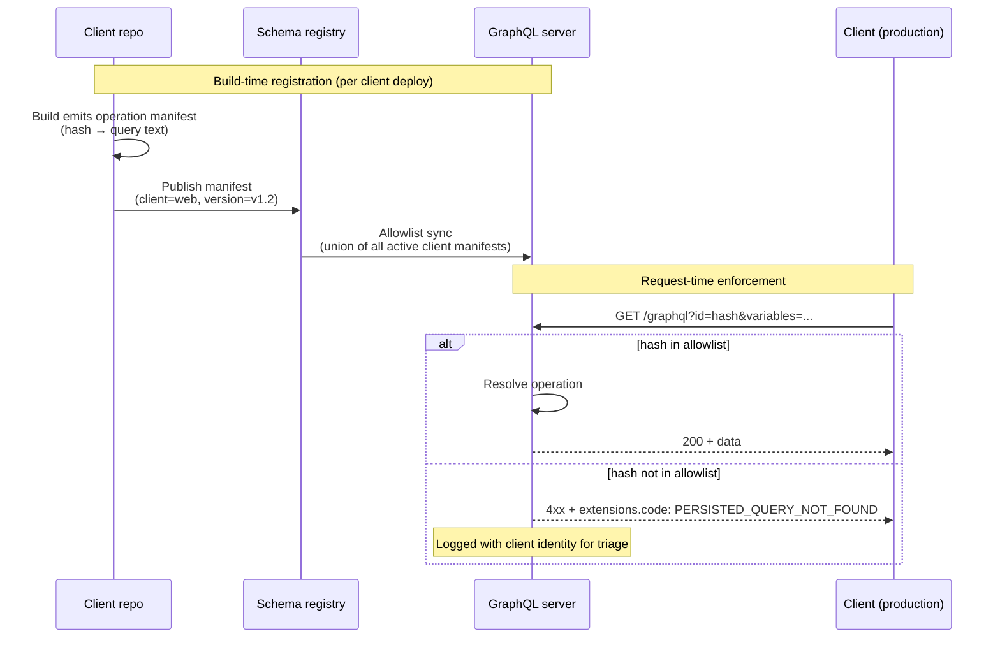
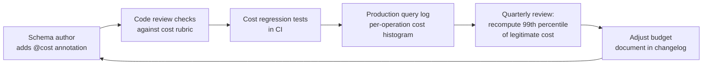
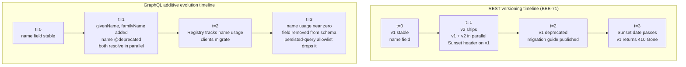

# BEE-599 GraphQL Operational Patterns Implementation Plan

> **For agentic workers:** REQUIRED SUB-SKILL: Use superpowers:subagent-driven-development (recommended) or superpowers:executing-plans to implement this plan task-by-task. Steps use checkbox (`- [ ]`) syntax for tracking.

**Goal:** Research, write, and publish BEE-599 "GraphQL Operational Patterns" as a parallel EN + zh-TW article pair, per the design spec at `docs/superpowers/specs/2026-04-19-bee-599-graphql-operational-patterns-design.md` (commit `78c1d96`). This is the closing article in the four-part GraphQL HTTP-ecosystem-gap series.

**Architecture:** Documentation article. Two parallel markdown files following an adapted BEE template. Section structure differs from B-1/B-2: pattern-statement → why-it-exists → implementation depth → production lessons (in place of REST-baseline → gap → mitigation → recommendation). Three Mermaid diagrams (one per body section). Schema-evolution section weighted heavier (~1,500 words) than the other two (~900 words each). EN written first against verified primary sources, then polished, then translated to zh-TW, then polished again. Render verification skipped per BEE-596/597/598 precedent. Single commit at the end.

**Tech Stack:** VitePress 1.3.1, vitepress-plugin-mermaid 2.0.16, Mermaid 10.9.1, pnpm 8.15.5, Markdown.

---

## Reference Material

- **Spec:** `docs/superpowers/specs/2026-04-19-bee-599-graphql-operational-patterns-design.md` (commit `78c1d96`). Read end-to-end before starting Task 1.
- **Sibling shipped articles (the entire series so far):**
  - BEE-596 `docs/en/API Design and Communication Protocols/596.md` (commit `0bf8ea7`) — caching deep-dive
  - BEE-597 `docs/en/API Design and Communication Protocols/597.md` (commit `22d1f3e`) — request-side comparison
  - BEE-598 `docs/en/API Design and Communication Protocols/598.md` (commit `0529036`) — response-side comparison
- **Sibling specs and plans for tone reference:**
  - `docs/superpowers/specs/2026-04-19-bee-598-graphql-rest-response-side-design.md`
  - `docs/superpowers/plans/2026-04-19-bee-598-graphql-rest-response-side.md`
- **Project conventions:** `/Users/alive/Projects/backend-engineering-essentials/CLAUDE.md` (BEE template, vendor-neutrality, RFC 2119 voice, every reference URL must be verified).
- **Personal style constraints (zh-TW prose):** `~/.claude/CLAUDE.md`. Forbidden patterns:
  1. Contrastive negation (「不是 X，而是 Y」).
  2. Empty-contrast sentences where B is unrelated to A.
  3. Precision-puffery (「說得很清楚」, 「(動詞)得很精確」).
  4. Em-dash chains stringing filler clauses (「——」).
  5. Undefined adjectives (bare 「很重」 without scale).
  6. Undefined verbs without subject/range (bare 「可以跑」).
  7. `可以X可以Y可以Z` capability stacks.
- **Persistent memory feedback:** `~/.claude/projects/-Users-alive-Projects-backend-engineering-essentials/memory/feedback_polish_documents_before_commit.md` — run polish-documents skill on EN+zh-TW article files before final commit.
- **Prior art for REST baselines BEE-599 references:**
  - `docs/en/API Design and Communication Protocols/71.md` — REST API Versioning Strategies (the section 3 explicit contrast)
  - `docs/en/API Design and Communication Protocols/485.md` — GraphQL Federation (federation contracts source)
  - `docs/en/Security Fundamentals/499.md` — BOLA (layered defense argument)
  - `docs/en/Security Fundamentals/488.md` — OWASP API Security Top 10

---

## File Structure

**Files to create:**
- `docs/en/API Design and Communication Protocols/599.md` — EN article (~3,400–4,000 words)
- `docs/zh-tw/API Design and Communication Protocols/599.md` — zh-TW translation, parallel structure

**Files to modify:**
- `docs/en/list.md` — append `- [599.GraphQL Operational Patterns](599)` after the BEE-598 entry
- `docs/zh-tw/list.md` — append `- [599.GraphQL 營運模式](599)` after the BEE-598 entry

**Files NOT to modify:**
- VitePress config — sidebar dynamic from frontmatter, no registration needed.
- Sibling BEE articles — out of scope for this plan.

---

## URL Reuse Notes (saves Task 2 work)

These URLs were verified live during BEE-596/597/598 research and the cited claims confirmed. Reuse without re-fetching unless drafting the article surfaces a claim not previously verified:

| URL | Verified claim | Source article |
|---|---|---|
| https://spec.graphql.org/October2021/ | Defines query/mutation/subscription operation types; spec is silent on HTTP transport | BEE-596 |
| https://github.com/graphql/graphql-over-http | Stage-2 working draft; defines per-failure-category status codes for `application/graphql-response+json` | BEE-596/598 |
| https://www.apollographql.com/docs/apollo-server/performance/apq | APQ protocol details: SHA-256 hash, GET URL shape, `PERSISTED_QUERY_NOT_FOUND` registration round-trip | BEE-596 |
| https://github.com/Escape-Technologies/graphql-armor | MIT-licensed multi-server middleware: query-cost, depth limit, rate limiting, introspection disable | BEE-597 |
| https://www.apollographql.com/docs/apollo-server/data/errors | Apollo default `extensions.code` set including `PERSISTED_QUERY_NOT_FOUND` | BEE-598 |
| https://docs.github.com/en/graphql/overview/rate-limits-and-query-limits-for-the-graphql-api | Public cost-budget reference (5,000 points/hour, public formula) | BEE-597 |

This article will reuse all six. All other URLs in spec §3.10 must be verified fresh in Task 2.

---

## Task 1: Pre-flight check

**Files:** none modified

- [ ] **Step 1: Read the spec end-to-end**

Read `docs/superpowers/specs/2026-04-19-bee-599-graphql-operational-patterns-design.md` in full. The plan below references spec section numbers (§3.3, §3.4, §3.5, etc.); you must hold those in head, not look them up step-by-step.

- [ ] **Step 2: Read the three shipped sibling articles**

Read in order:
- `docs/en/API Design and Communication Protocols/596.md` (BEE-596) — persisted query mechanism reference.
- `docs/en/API Design and Communication Protocols/597.md` (BEE-597) — Layer 1/2/3 rate-limiting reference; this article extends with the organizational layer.
- `docs/en/API Design and Communication Protocols/598.md` (BEE-598) — `extensions.code` conventions and observability pattern reference.

Note: BEE-599 references all three articles. The article must position itself as the closer that picks up forward-references; do not re-derive material from these articles.

- [ ] **Step 3: Read the four REST/Security baseline articles BEE-599 references**

- `docs/en/API Design and Communication Protocols/71.md` (BEE-71) — REST API Versioning Strategies. This is the explicit contrast in the schema-evolution section. Note: BEE-71 cites RFC 8594 Sunset header; BEE-599 will reference this contrast.
- `docs/en/API Design and Communication Protocols/485.md` (BEE-485) — GraphQL Federation. The federation contracts subsection in BEE-599 builds on this.
- `docs/en/Security Fundamentals/499.md` (BEE-499) — BOLA. The layered-defense argument in the persisted-query section.
- `docs/en/Security Fundamentals/488.md` (BEE-488) — OWASP API Security Top 10. Context for API-layer threats.

- [ ] **Step 4: Confirm clean working tree**

Run: `git status`
Expected: `nothing to commit, working tree clean` (or only the in-progress plan file). If anything else is dirty, stop and surface it before proceeding.

- [ ] **Step 5: Confirm node_modules present and polish-documents skill available**

Run: `ls /Users/alive/Projects/backend-engineering-essentials/node_modules | head -3`
Expected: any output. If missing: `pnpm install`.

Confirm the polish-documents skill is available by checking the available-skills list in this session. Skill name: `polish-documents`. If polish-documents is not in the available skills list, stop and surface — the plan depends on it.

---

## Task 2: Verify the new reference URLs

**Files:** none modified (research output captured in conversation context, used in Task 4)

Per project CLAUDE.md: "Every article MUST be researched against authoritative sources." For each URL: WebFetch the page, extract the specific quote/section that supports the cited claim, and record (URL, claim, supporting quote, accessed-date).

URLs already verified (see "URL Reuse Notes" above) do not need re-fetching.

- [ ] **Step 1: Verify GraphQL `@deprecated` directive specification**

Try first: `https://spec.graphql.org/October2021/#sec--deprecated`
Fallback: search the spec for `@deprecated` definition (likely under §3.13 Schema Definition or §3.5 Type System Directives)
Claim to confirm: The `@deprecated` directive applies to fields and enum values, requires (or supports) a `reason: String` argument, and surfaces in introspection (`isDeprecated: Boolean!`, `deprecationReason: String`). Capture the exact spec section identifier and the directive's grammar.

- [ ] **Step 2: Verify Apollo Server persisted queries `mode: only` configuration**

URL: `https://www.apollographql.com/docs/apollo-server/performance/apq`
Already verified during BEE-596 research for the protocol details. Re-confirm specifically: the modes available (`auto` register-on-miss vs `only` reject-unknown), and whether Apollo's docs explicitly recommend `mode: only` for production security. If the modes are documented elsewhere (e.g., a separate "Production hardening" page), capture that URL too.

- [ ] **Step 3: Verify GraphQL Code Generator persisted-documents preset**

Try first: `https://the-guild.dev/graphql/codegen/plugins/presets/preset-client` (the preset most commonly used; confirms persisted-documents config is part of it)
Fallback: search `site:the-guild.dev codegen persisted documents`
Claim to confirm: GraphQL Code Generator supports build-time hash manifest emission as a first-class workflow (the `persistedDocuments` config option). Capture the configuration snippet and the manifest output format.

- [ ] **Step 4: Verify federation contracts and `@tag` directive**

Try first: `https://www.apollographql.com/docs/graphos/platform/schema-management/delivery/contracts`
Fallback search: `site:apollographql.com federation contracts tag` or look for "Contracts" in Apollo Federation docs
Claim to confirm: Apollo's GraphOS platform supports schema contracts that filter the supergraph by `@tag` directive into consumer-specific variants. Each tagged schema variant is served at a separate router endpoint or under a separate variant name. Capture the canonical docs URL, the `@tag` directive grammar, and the contract-variant model.

- [ ] **Step 5: Verify WunderGraph Cosmo schema check OR Hive schema:check**

Try first (Cosmo): `https://cosmo-docs.wundergraph.com/cli/wgc/subgraph/check` or the Cosmo CLI docs
Try second (Hive): `https://the-guild.dev/graphql/hive/docs/schema-registry/schema-checks`
Claim to confirm: At least one non-Apollo schema-registry alternative performs breaking-change detection on schema PRs (the equivalent of `rover subgraph check`). Capture the CLI command and a brief description of what it checks. Pick whichever has more current/active documentation.

- [ ] **Step 6: Verify Apollo `rover subgraph check` documentation**

Try first: `https://www.apollographql.com/docs/rover/commands/subgraphs#subgraph-check`
Fallback: search `site:apollographql.com rover subgraph check`
Claim to confirm: `rover subgraph check` is the Apollo CLI command for detecting breaking changes in a federated subgraph against the published schema and recent client operations. Capture the canonical docs URL and the specific failure modes (composition error, client operation breaking, etc.).

- [ ] **Step 7: Verify GraphQL.org best-practices / versioning page**

URL: `https://graphql.org/learn/best-practices/`
Note: this URL returned 403 in BEE-596 research due to Cloudflare bot protection. The URL is live for browsers (verify with `curl -sI` + browser User-Agent header). Cite as canonical reference even if WebFetch cannot retrieve content.
Claim to capture: the GraphQL Foundation's stated position on versioning (typically: "GraphQL takes a strong opinion on avoiding versioning by providing the tools for the continuous evolution of a GraphQL schema"). If the page content cannot be retrieved, cite the section identifier and note the URL as canonical.

- [ ] **Step 8: Find one neutral practitioner article on GraphQL schema evolution at scale**

Search candidates (run a WebSearch first):
- GitHub Engineering — GitHub runs a public GraphQL API with documented evolution practices
- Shopify Engineering — Shopify has documented GraphQL schema governance
- Netflix DGS team posts — Netflix runs federated GraphQL at scale
- The Guild blog — schema-evolution-as-a-service is core to their business

Acceptance criterion: an engineering blog post (not a vendor product page) that discusses real-world GraphQL schema evolution: deprecation policy, registry-tracked usage, breaking-change CI gates, or removal disciplines. If no strong source can be found in 2–3 searches, drop per the spec's contingency in §3.10 and note the omission in Task 5's self-review.

- [ ] **Step 9: Verify Apollo introspection disable / production hardening guide**

Try first: `https://www.apollographql.com/docs/apollo-server/api/apollo-server` (configuration reference includes `introspection: false`)
Fallback: search `site:apollographql.com introspection production` or look for an Apollo "Production hardening" page
Claim to confirm: Apollo Server documents disabling introspection in production via the `introspection: false` configuration option. Capture the canonical docs URL and the configuration snippet.

- [ ] **Step 10: Compile the final References block**

Produce the final References block for the article in the format `- [Source title](url) — one-sentence note on what claim it supports`. Include reused URLs (from "URL Reuse Notes" above where applicable) and newly verified URLs from Steps 1–9. Format must match the existing convention in BEE-596/597/598 §References. Carry this block into Task 4 Step 9.

---

## Task 3: Create EN article skeleton

**Files:**
- Create: `docs/en/API Design and Communication Protocols/599.md`

- [ ] **Step 1: Create the file with frontmatter, H1, and section headers only**

Write the following into `docs/en/API Design and Communication Protocols/599.md`:

```markdown
---
id: 599
title: "GraphQL Operational Patterns"
state: draft
---

# [BEE-599] GraphQL Operational Patterns

:::info
Three operational patterns that determine whether a GraphQL deployment survives production: persisted-query allowlisting as a security boundary, query complexity governance as an organizational discipline, and additive schema evolution as the GraphQL alternative to REST-style versioning. The closing article in the four-part series on GraphQL's HTTP-ecosystem gap.
:::

## Context

## Principle

## Persisted-query allowlisting as a security boundary

## Query complexity governance

## Additive schema evolution

## Common Mistakes

## Related BEPs

## References
```

Note the deliberate absence of a `## Example` section per spec §3.7. Section count: 9.

- [ ] **Step 2: Verify file is well-formed**

Run: `head -10 "docs/en/API Design and Communication Protocols/599.md"`
Expected: frontmatter visible, `id: 599`, `title: "GraphQL Operational Patterns"`, `state: draft`.

---

## Task 4: Write EN article body

**Files:**
- Modify: `docs/en/API Design and Communication Protocols/599.md`

For each step below, write the body of the corresponding section per the spec. Render the spec into final prose that matches BEE-596/597/598's tone and density.

**IMPORTANT:** Section structure here is **pattern-statement → why-it-exists → implementation-depth → production-lessons** (per spec §3.3-§3.5). This differs from B-1/B-2's REST-baseline → gap → mitigation → recommendation shape. Each body section ends with V1/V2/V3 Mermaid diagrams placed at the natural reading break (between implementation and production lessons).

Style requirements throughout (apply to every step):
- RFC 2119 keywords (MUST, SHOULD, MAY, MUST NOT) used only in the Principle section and where guidance is normative — never as filler.
- Vendor-neutral. Apollo may be cited as one concrete implementation alongside named alternatives (graphql-armor, GraphQL Yoga / Envelop, WunderGraph Cosmo, Hive). No prose that recommends a specific vendor.
- No precision-puffery ("explains clearly", "exactly the right approach"). State things; do not editorialize about clarity.
- No empty-contrast sentences ("not X but Y" where X and Y are unrelated).
- No undefined adjectives ("very fast" without a scale).

- [ ] **Step 1: Write the Context section** (per spec §3.1, ~280 words)

Recap the series: BEE-596 caching, BEE-597/598 request-side and response-side comparisons. Each forward-referenced operational topics this article picks up.

Then enumerate the three operational patterns with the framing from spec §3.1:
1. Persisted-query allowlisting as security/DoS boundary (forward-referenced from BEE-596 and BEE-597).
2. Query complexity governance (extends BEE-597's technical layer with the organizational layer).
3. Additive schema evolution (sharp contrast with BEE-71's REST versioning model).

Close: this is the closing reference for GraphQL operational discipline in the repo.

- [ ] **Step 2: Write the Principle section** (per spec §3.2, one paragraph)

Use the verbatim Principle paragraph from spec §3.2. Adjust only if Task 2 reference verification surfaced a contradiction. Keep RFC 2119 voice (MUST/SHOULD/MUST NOT distributed across the three patterns).

- [ ] **Step 3: Write the "Persisted-query allowlisting as a security boundary" body section** (per spec §3.3, ~900 words)

Internal structure: Pattern statement (~80) → Why it exists (~200, two threats: arbitrary-query DoS + introspection recon) → Implementation depth (~400, six bullets: build-time registration, server enforcement, CI/CD integration, mode:only vs mode:auto, multi-client manifest union, introspection disable) → V1 sequence diagram (insert per Step 4 below) → Production lessons (~220, four bullets: first incident is unregistered query, exception process matters, manifest growth bounded by client diversity, observability tie-in).

Insert V1 sequence diagram after Implementation depth, before Production lessons:



Cross-link reminders: BEE-596 (caching mechanism), BEE-597 (rate limiting), BEE-598 (`extensions.code`), BEE-499 (BOLA layered-defense), BEE-488 (OWASP).

- [ ] **Step 4: Write the "Query complexity governance" body section** (per spec §3.4, ~900 words)

Internal structure: Pattern statement (~80) → Why it exists (~150, three failure modes: cost annotation drift, budget staleness, no exception process) → Implementation depth (~400, five bullets: cost-annotation review checklist, quarterly tuning, per-actor budget classes, exception process, alerts not silent rejections) → V2 feedback loop diagram (insert per below) → Production lessons (~270, four bullets: cost rubric > directives, CI cost regression, budget-class auth coupling, GitHub example).

Insert V2 feedback loop diagram after Implementation depth, before Production lessons:



Cross-link reminders: BEE-597 (Layer 2 cost analysis), BEE-598 (operation-name tagging makes triage possible), BEE-266 (rate-limiting algorithms), BEE-449 (distributed rate limiting).

- [ ] **Step 5: Write the "Additive schema evolution" body section** (per spec §3.5, ~1,500 words — heaviest)

Internal structure: Pattern statement (~100) → Why it exists (~250, three properties: clients select, server-side schema + client-side query enforcement, federation per-team independence; explicit BEE-71 contrast) → Implementation depth (~700, four sub-blocks: additive-evolution rules table, `@deprecated` directive, deprecation policy, federation contracts with `@tag`, unavoidable-breaking-change escape hatch) → V3 timeline comparison (insert per below) → Production lessons (~450, six bullets: registry as inverse of Sunset header, backward-compat tests in CI, contracts replace per-version maintenance, removal as the hard part, rename temptation, BEE-71 cross-link).

Use the additive-evolution rules table from spec §3.5 verbatim:

| Change | Status | Mechanism |
|---|---|---|
| Add a field | Non-breaking | Just add it |
| Add an enum value | Breaking-ish | Clients with exhaustive switches break; treat as breaking for strongly-typed clients |
| Add an optional argument | Non-breaking | Default value in resolver |
| Add a required argument | Breaking | Always — same problem as REST required-field-add |
| Remove a field | Breaking | Use deprecation cycle (below) |
| Rename a field | Breaking | Add new field, deprecate old, remove on cycle |
| Change a field's type | Breaking | Add new field with new type, deprecate old |
| Change nullability `T!` → `T` | Non-breaking on wire | Strongly-typed clients with non-null assumptions may NPE — treat as breaking for them |
| Change nullability `T` → `T!` | Breaking | Server now refuses to return null; partial-success behavior changes |

Use the `@deprecated` SDL example from spec §3.5 verbatim:

```graphql
type User {
  id: ID!
  name: String! @deprecated(reason: "Use `givenName` and `familyName` instead. Removal scheduled for 2026-12-31.")
  givenName: String!
  familyName: String!
}
```

Use the federation contracts SDL example from spec §3.5 verbatim:

```graphql
type User {
  id: ID! @tag(name: "mobile") @tag(name: "partner")
  name: String! @tag(name: "mobile") @tag(name: "partner")
  internalAuditNotes: String @tag(name: "internal")  # not in mobile or partner schemas
}
```

Insert V3 timeline comparison after Implementation depth, before Production lessons:



Cross-link reminders: BEE-71 (REST versioning), BEE-485 (federation), BEE-142 (general schema evolution), BEE-75 (error-contract evolution).

- [ ] **Step 6: Write Common Mistakes section** (per spec §3.8, 5 items)

Write the five common mistakes from spec §3.8 in full prose. Each follows the BEE-596/597/598 pattern: one-sentence statement of the mistake, then 2–3 sentences explaining the failure mode and the fix:

1. Treating persisted-query auto-register as a security mechanism.
2. Disabling introspection without disabling auto-register.
3. Setting a query complexity budget once and never re-measuring.
4. Adding `@deprecated` and never removing the field.
5. Renaming a field as "just one quick change" outside the deprecation cycle.

- [ ] **Step 7: Write Related BEPs section** (per spec §3.9)

Three pattern-clusters plus series closure. Verify every referenced BEE file exists before listing it:

```bash
ls "docs/en/API Design and Communication Protocols/596.md" \
   "docs/en/API Design and Communication Protocols/597.md" \
   "docs/en/API Design and Communication Protocols/598.md" \
   "docs/en/API Design and Communication Protocols/71.md" \
   "docs/en/API Design and Communication Protocols/485.md" \
   "docs/en/API Design and Communication Protocols/75.md" \
   "docs/en/Security Fundamentals/499.md" \
   "docs/en/Security Fundamentals/488.md" \
   "docs/en/Resilience and Reliability/266.md" \
   "docs/en/Distributed Systems/449.md" \
   "docs/en/Data Modeling and Schema Design/142.md"
```

If any file is missing, remove that line from the Related BEPs list and note it. Then write the Related BEPs section organized by cluster as described in spec §3.9. Use literal directory names with spaces in the link paths (per the BEE-485/596/597/598 convention), e.g. `[BEE-499](../Security Fundamentals/499.md)`.

- [ ] **Step 8: Write References section**

Paste the verified References block compiled in Task 2 Step 10. Format must match BEE-596/597/598 References convention.

- [ ] **Step 9: Verify file is complete and reads end-to-end**

Run: `wc -w "docs/en/API Design and Communication Protocols/599.md"`
Expected: between 3,300 and 4,200 words (target 3,400–4,000 + frontmatter overhead).

Read the file end-to-end. Confirm: every section has substantive content (no empty headers); pattern-statement → why → implementation → production-lessons structure visible in each body section; schema-evolution section is heaviest; no separate `## Example` section; no TODO/TBD/placeholder text.

---

## Task 5: EN self-review

**Files:** may modify `docs/en/API Design and Communication Protocols/599.md` for fixes

Run each check sequentially. If a check fails, fix the article inline and re-run.

- [ ] **Step 1: Vendor-neutrality check**

Run: `grep -in "apollo" "docs/en/API Design and Communication Protocols/599.md" | wc -l`
Inspect each match. Apollo references must appear only as: (a) one implementation among named alternatives (graphql-armor, GraphQL Yoga / Envelop, WunderGraph Cosmo, Hive), (b) verified-source citations in References. No prose that recommends Apollo as the right choice.

Run: `grep -inE "we recommend (apollo|relay|urql|yoga|hot chocolate|graphql-shield|graphql-armor|cosmo|hive)" "docs/en/API Design and Communication Protocols/599.md"`
Expected: zero matches.

- [ ] **Step 2: Precision-puffery check**

Run: `grep -inE "(clearly|precisely|exactly explains|explains exactly|says clearly)" "docs/en/API Design and Communication Protocols/599.md"`
Expected: zero matches in normal prose. The word "exactly" is permitted only for factual claims about protocol behavior.

- [ ] **Step 3: RFC 2119 voice check**

Run: `grep -nE "\b(MUST|SHOULD|MAY|MUST NOT|SHOULD NOT)\b" "docs/en/API Design and Communication Protocols/599.md"`
Inspect each match. The Principle section MUST contain at least one each of MUST, SHOULD, and one of MUST NOT or SHOULD NOT. Outside Principle, every keyword usage must be deliberate (e.g., quoting the GraphQL spec, restating the Principle's normative claims in body sections).

- [ ] **Step 4: BEE template structural check (with deliberate departure)**

Confirm the article has, in order: frontmatter, H1, `:::info` tagline, `## Context`, `## Principle`, `## Persisted-query allowlisting as a security boundary`, `## Query complexity governance`, `## Additive schema evolution`, `## Common Mistakes`, `## Related BEPs`, `## References`. **There MUST NOT be a `## Example` section** — its absence is deliberate per spec §3.7.

Run: `grep -n "^## " "docs/en/API Design and Communication Protocols/599.md"`
Expected: 9 section headers in the order above. Specifically, no `## Example` header.

- [ ] **Step 5: Reference URL spot-check**

Pick three URLs at random from the References block. WebFetch each one. Confirm each is still live and the cited claim is still in the source.

- [ ] **Step 6: Cross-reference path check**

For each link in `## Related BEPs`, run `ls <resolved-path>` to confirm the target file exists. Adjust link paths if any 404.

- [ ] **Step 7: Mermaid block syntax check**

Run: `grep -c '^```mermaid' "docs/en/API Design and Communication Protocols/599.md"`
Expected: `3` (V1 sequence in §Persisted-query, V2 flowchart in §Complexity governance, V3 flowchart in §Schema evolution). All three are mermaid blocks; this article has no markdown-only diagram (unlike BEE-597/598 which used a markdown table as their "comparison table" V1).

For each mermaid block, do a visual scan of the `subgraph`, `flowchart`, `sequenceDiagram`, `participant`, `alt`, `else`, `end`, `direction LR/TB`, `-->`, `--` keywords/syntax for typos.

---

## Task 6: Polish EN article with polish-documents skill

**Files:** may modify `docs/en/API Design and Communication Protocols/599.md`

Per persistent memory feedback, polish-documents runs AFTER self-review (Task 5) and BEFORE zh-TW translation (Task 7).

- [ ] **Step 1: Invoke polish-documents on the EN article**

Use the Skill tool with skill name `polish-documents` and pass the article file path as the argument: `docs/en/API Design and Communication Protocols/599.md`.

The polish-documents skill applies Google Developer Style principles and removes:
- Contrastive negation
- Em-dash chains
- Precision puffery
- Unanchored claims
- Capability stacks

While preserving the author's voice.

- [ ] **Step 2: Review polish output**

The skill returns a polished version of the file (or a diff). Review every change:
- Accept changes that fix forbidden patterns or tighten sentences without changing meaning.
- Reject changes that:
  - Remove deliberate technical precision (e.g., RFC 2119 keywords in the Principle).
  - Soften RFC 2119 normative voice into descriptive prose.
  - Replace verified terminology with generic synonyms (e.g., `@deprecated` → "deprecation directive").
  - Restructure section flow set during brainstorm.
  - Remove load-bearing technical contrasts (e.g., `T!` ↔ `T` nullability rule, REST vs GraphQL evolution comparison).

If the polish output makes substantive changes that would require re-running the self-review checks, run Task 5's checks again on the polished file.

- [ ] **Step 3: Confirm polish complete and file still well-formed**

Run: `wc -w "docs/en/API Design and Communication Protocols/599.md"`
Expected: still within 3,300–4,200 word range (polish should tighten, not expand).

Run: `grep -c "^## " "docs/en/API Design and Communication Protocols/599.md"`
Expected: still 9 section headers.

Run: `grep -c '^```mermaid' "docs/en/API Design and Communication Protocols/599.md"`
Expected: still 3.

---

## Task 7: Translate to zh-TW

**Files:**
- Create: `docs/zh-tw/API Design and Communication Protocols/599.md`

The zh-TW article is a parallel translation of the polished EN article. Same frontmatter (with translated title), same section structure, same Mermaid diagrams (verbatim — code is language-neutral), same code/HTTP snippets (verbatim). Only prose paragraphs translate.

**IMPORTANT:** Section structure here uses pattern-statement → why → implementation → production-lessons (per spec §3.3-§3.5). Translate the section structure, not just the prose — Chinese readers expect the same flow as EN.

- [ ] **Step 1: Read existing zh-TW articles to confirm house style**

Read `docs/zh-tw/API Design and Communication Protocols/598.md` (the immediate sibling). Match its conventions: section headers in Chinese (`## 背景` not `## 背景 (Context)`), `state: draft` in English, technical terms inline in English.

- [ ] **Step 2: Create the file with translated frontmatter, tagline, and section headers**

Write into `docs/zh-tw/API Design and Communication Protocols/599.md`:

```markdown
---
id: 599
title: "GraphQL 營運模式"
state: draft
---

# [BEE-599] GraphQL 營運模式

:::info
決定 GraphQL 部署能否在生產環境存活的三個營運模式：把 persisted-query 允許清單當成安全邊界、把 query complexity 治理當成組織紀律、用 additive schema 演進取代 REST 風格的版本控制。本系列共四篇文章，這是探討 GraphQL HTTP 生態缺口的最後一篇。
:::

## 背景

## 原則

## 把 Persisted Query 允許清單當成安全邊界

## Query Complexity 治理

## Additive Schema 演進

## 常見錯誤

## 相關 BEP

## 參考資料
```

The tagline above already avoids the forbidden patterns. Refine wording only if Step 1's house-style review reveals a tone mismatch.

- [ ] **Step 3: Translate each prose section**

For each EN section, write a parallel zh-TW version. Constraints:
- Technical terms stay in English: `@deprecated`, `@tag`, `@cost`, `@auth`, `PERSISTED_QUERY_NOT_FOUND`, `OPERATION_DEPRECATED`, `mode: only`, `mode: auto`, `Sunset`, `410 Gone`, `4xx`, `5xx`, `T!`, `T`, `rover`, `wgc`, `hive schema:check`, `__schema`, `__type`, persisted query, allowlist, supergraph, subgraph, etc.
- Surrounding prose in Traditional Chinese (繁體中文).
- Forbidden patterns (from `~/.claude/CLAUDE.md`):
  - 「不是 X，而是 Y」 — rewrite as positive statement.
  - Empty contrasts where B is unrelated to A — rewrite both halves.
  - 「說得很清楚」, 「(動詞)得很精確」 — drop the puffery.
  - Em-dash chains stringing filler — replace with proper sentences or commas. Single em-dash per sentence is also discouraged; prefer commas, periods, or parentheses.
  - Bare 「很重」 / 「很大」 / 「很重要」 without scale — add scale or remove.
  - Bare 「可以跑」 without subject/range — name them.
  - 「可以 X 可以 Y 可以 Z」 排比句 — rewrite as concrete claims.
- Code blocks, HTTP snippets, GraphQL SDL, Mermaid diagrams: copy verbatim from EN.
- Tables: translate prose cells; keep technical terms in English.

- [ ] **Step 4: Verify file structure parity with EN**

Run:
```bash
grep -c "^## " "docs/zh-tw/API Design and Communication Protocols/599.md"
grep -c "^## " "docs/en/API Design and Communication Protocols/599.md"
```
Expected: identical counts (9 each).

Run:
```bash
grep -c '^```mermaid' "docs/zh-tw/API Design and Communication Protocols/599.md"
```
Expected: `3`.

- [ ] **Step 5: Style-rule scan**

Run: `grep -nE "不是.{1,30}而是" "docs/zh-tw/API Design and Communication Protocols/599.md"`
Expected: zero matches.

Run: `grep -nE "(說得很清楚|得很精確|寫得很精確)" "docs/zh-tw/API Design and Communication Protocols/599.md"`
Expected: zero matches.

Run: `grep -nE "可以.{1,15}可以.{1,15}可以" "docs/zh-tw/API Design and Communication Protocols/599.md"`
Expected: zero matches.

Run: `grep -c "——" "docs/zh-tw/API Design and Communication Protocols/599.md"`
Expected: zero matches (em-dash). If any matches found, replace with comma, period, or parenthesis as appropriate.

If any check fails, rewrite the offending sentence and re-run.

---

## Task 8: Polish zh-TW article with polish-documents skill

**Files:** may modify `docs/zh-tw/API Design and Communication Protocols/599.md`

Per persistent memory feedback, polish-documents runs on the zh-TW file after the style-rule scan and before list.md updates.

- [ ] **Step 1: Invoke polish-documents on the zh-TW article**

Use the Skill tool with skill name `polish-documents` and pass: `docs/zh-tw/API Design and Communication Protocols/599.md`.

The polish-documents skill description states it handles English, Traditional Chinese, and mixed-language Markdown — it should apply the same forbidden-pattern rules to the zh-TW prose as to EN.

- [ ] **Step 2: Review polish output**

Same review criteria as EN (Task 6 Step 2):
- Accept changes that fix forbidden patterns or tighten Chinese prose without changing meaning.
- Reject changes that:
  - Translate technical terms that must remain in English (`@deprecated`, `@tag`, `extensions.code`, `mode: only`, etc.).
  - Insert em-dashes or other forbidden patterns the polish should be removing.
  - Soften RFC 2119 normative voice (the Chinese rendering of MUST/SHOULD).
  - Remove load-bearing technical contrasts (e.g., `T!` ↔ `T`, REST vs GraphQL evolution timeline).

- [ ] **Step 3: Re-run style-rule scan after polish**

Run:
```bash
grep -nE "不是.{1,30}而是" "docs/zh-tw/API Design and Communication Protocols/599.md"
grep -nE "(說得很清楚|得很精確|寫得很精確)" "docs/zh-tw/API Design and Communication Protocols/599.md"
grep -nE "可以.{1,15}可以.{1,15}可以" "docs/zh-tw/API Design and Communication Protocols/599.md"
grep -c "——" "docs/zh-tw/API Design and Communication Protocols/599.md"
```
Expected: all zero. If polish-documents introduced any forbidden patterns (unlikely but possible), fix inline.

---

## Task 9: Update `list.md` in both locales

**Files:**
- Modify: `docs/en/list.md`
- Modify: `docs/zh-tw/list.md`

- [ ] **Step 1: Append entry to EN list.md**

Open `docs/en/list.md`. Find the line:
```
- [598.GraphQL vs REST: Response-Side HTTP Trade-offs](598)
```
After it, add:
```
- [599.GraphQL Operational Patterns](599)
```

- [ ] **Step 2: Append entry to zh-TW list.md**

Open `docs/zh-tw/list.md`. Find the line:
```
- [598.GraphQL vs REST：回應端的 HTTP 取捨](598)
```
After it, add:
```
- [599.GraphQL 營運模式](599)
```

- [ ] **Step 3: Verify both list.md files are well-formed**

Run: `tail -5 docs/en/list.md docs/zh-tw/list.md`
Expected: BEE-599 appears as the last entry in both, formatting consistent with the surrounding entries.

---

## Task 10: Final commit

**Files:** stages all of:
- `docs/en/API Design and Communication Protocols/599.md` (new)
- `docs/zh-tw/API Design and Communication Protocols/599.md` (new)
- `docs/en/list.md` (modified)
- `docs/zh-tw/list.md` (modified)

- [ ] **Step 1: Review the full diff**

Run: `git status`
Expected: 4 files (2 new, 2 modified). Nothing else.

Run: `git diff --stat`
Run: `git diff docs/en/list.md docs/zh-tw/list.md`
Expected: each list.md gets exactly one line added.

If any unrelated changes appear in the working tree, surface them before committing — do not bundle. (BEE-596 ran into a similar situation with an unrelated BEE-246 list.md change; the resolution was a separate commit.)

Read both new article files end-to-end one final time. Last opportunity to catch issues before they land on `main`.

- [ ] **Step 2: Stage and commit**

Run:
```bash
git add "docs/en/API Design and Communication Protocols/599.md" \
        "docs/zh-tw/API Design and Communication Protocols/599.md" \
        docs/en/list.md \
        docs/zh-tw/list.md
```

Run:
```bash
git commit -m "$(cat <<'EOF'
feat: add BEE-599 GraphQL Operational Patterns (EN + zh-TW)

Article C (closing) of the four-article series on the HTTP-ecosystem
gap in GraphQL. Patterns deep-dive on three operational disciplines
forward-referenced from BEE-596/597/598: persisted-query allowlisting
as a security boundary (build-time registration mode rejecting unknown
hashes; introspection disabled in production), query complexity
governance as an organizational discipline (cost rubric, quarterly
budget tuning, per-actor budget classes, exception process), and
additive schema evolution as the GraphQL alternative to REST
versioning (additive rules, @deprecated directive, federation @tag
contracts, registry-tracked usage, BEE-71 contrast).

Section structure differs from B-1/B-2: pattern-statement → why →
implementation → production-lessons, in place of REST-baseline → gap
→ mitigation → recommendation. Schema evolution section weighted
heaviest because the contrast with BEE-71's REST model is genuinely
novel content.

Drafts polished with the polish-documents skill before commit.

This commit closes the four-article series.

Spec: docs/superpowers/specs/2026-04-19-bee-599-graphql-operational-patterns-design.md
Plan: docs/superpowers/plans/2026-04-19-bee-599-graphql-operational-patterns.md

Co-Authored-By: Claude Opus 4.7 (1M context) <noreply@anthropic.com>
EOF
)"
```

- [ ] **Step 3: Verify commit landed**

Run: `git log -1 --stat`
Expected: 4 files in the commit, message as above.

Run: `git status`
Expected: `nothing to commit, working tree clean`.

---

## Done

After Task 10, the article is on `main` with the verification chain complete:

1. Spec approved by user (commit `78c1d96`)
2. New reference URLs verified, reused URLs trusted from BEE-596/597/598 (Task 2)
3. EN article structurally matches the adapted BEE template with pattern-statement → why → implementation → production-lessons shape (Task 5)
4. EN polished with polish-documents skill (Task 6)
5. zh-TW translated and style-checked (Task 7)
6. zh-TW polished with polish-documents skill (Task 8)
7. List.md updated in both locales (Task 9)
8. Single commit per project convention (Task 10)

This is the final article in the planned four-part series:

- A (BEE-596) ✓ GraphQL HTTP-Layer Caching
- B-1 (BEE-597) ✓ GraphQL vs REST: Request-Side HTTP Trade-offs
- B-2 (BEE-598) ✓ GraphQL vs REST: Response-Side HTTP Trade-offs
- **C (BEE-599) ✓ GraphQL Operational Patterns** ← shipped after Task 10

No further forward-references; the series is closed.
