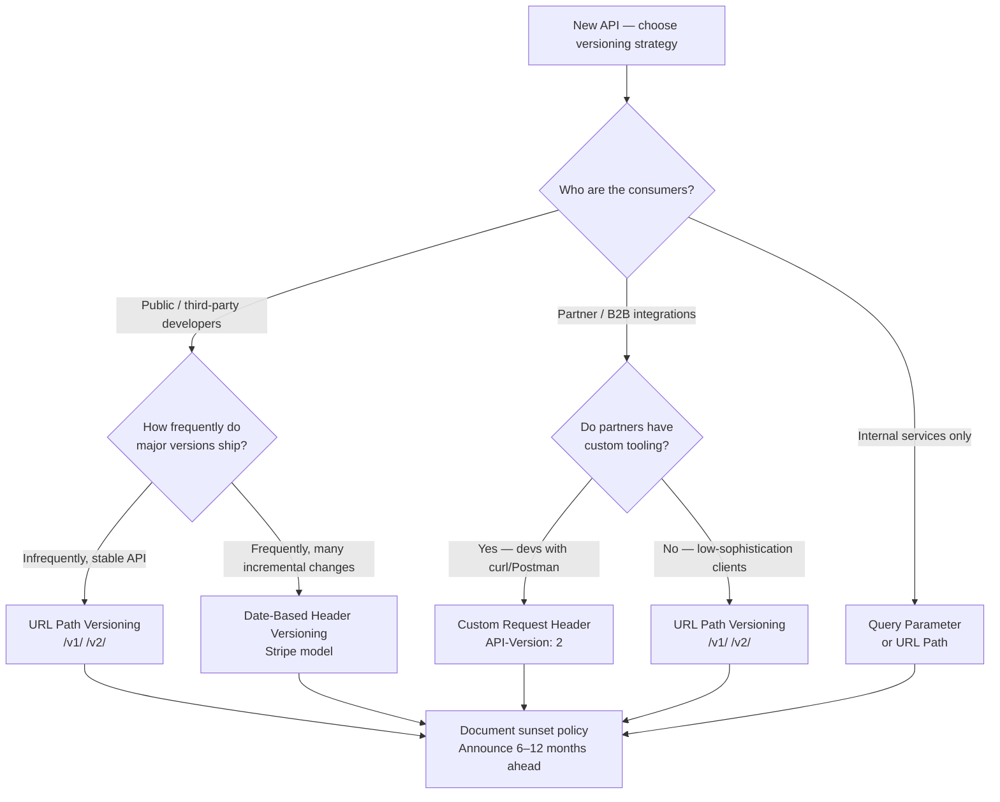
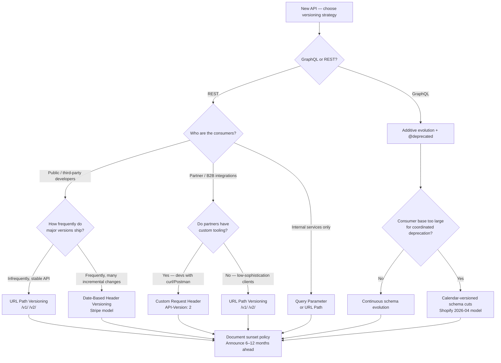
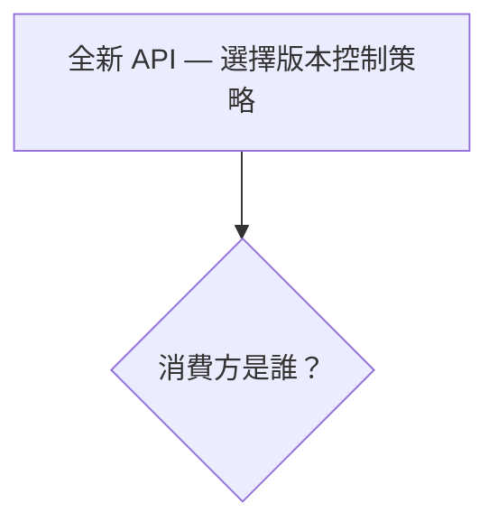

# REST vs GraphQL Versioning Implementation Plan

> **For agentic workers:** REQUIRED SUB-SKILL: Use superpowers:subagent-driven-development (recommended) or superpowers:executing-plans to implement this plan task-by-task. Steps use checkbox (`- [ ]`) syntax for tracking.

**Goal:** Add REST vs GraphQL versioning treatment to BEE-4002, BEE-4011, and BEE-4005 (EN + zh-TW) per the approved spec at `docs/superpowers/specs/2026-04-23-rest-vs-graphql-versioning-design.md`.

**Architecture:** Surgical edits to three existing VitePress articles. Each article gets content inserted at a specified location, plus cross-links in "Related BEPs" and new entries in "References". Bilingual lockstep: every EN edit is mirrored in `docs/zh-tw/` with matching structure. One commit per article (EN + zh-TW together). Polish pass via `polish-documents` skill before each commit.

**Tech Stack:** VitePress 1.3.x, Markdown with `:::info` / `:::tip` admonitions, Mermaid diagrams, Traditional Chinese + English content.

---

## Style constraints

These apply to ALL zh-TW prose written below. The user's global CLAUDE.md bans these patterns:

1. No 「不是 X，而是 Y」 contrastive negation.
2. No 「是 A，不是 B」 comparing unrelated concepts.
3. No 「說得很清楚」/「(動詞)得很精確」 self-congratulatory precision claims.
4. No 破折號 cliff-run: "(廢話)——(更多廢話)".
5. No unanchored 「很 X」 adjectives (define what makes something heavy/important).
6. No unqualified verbs like 「可以跑」 (specify what runs, where, under what conditions).
7. No 「可以 X 可以 Y 可以 Z」 capability stacks.

EN content MUST NOT use emojis. EN content should also avoid importance-announcement preambles like "The core insight:" or "Critically," — write the claim directly.

zh-TW equivalents the user wants dropped: 「核心」/「核心洞見」/「關鍵」 as importance-announcement prefixes.

---

## File structure

Files modified by this plan (six total, two per article):

- `docs/en/api-design/api-versioning-strategies.md` (BEE-4002) — 315 lines, adds ~120 lines.
- `docs/zh-tw/api-design/api-versioning-strategies.md` (BEE-4002 zh-TW) — 315 lines, adds ~120 lines.
- `docs/en/api-design/graphql-vs-rest-request-side-http-trade-offs.md` (BEE-4011) — 277 lines, adds ~70 lines.
- `docs/zh-tw/api-design/graphql-vs-rest-request-side-http-trade-offs.md` (BEE-4011 zh-TW) — 277 lines, adds ~70 lines.
- `docs/en/api-design/graphql-vs-rest-vs-grpc.md` (BEE-4005) — 355 lines, adds ~35 lines.
- `docs/zh-tw/api-design/graphql-vs-rest-vs-grpc.md` (BEE-4005 zh-TW) — 355 lines, adds ~35 lines.

No new files. No tests (VitePress docs project has no test suite — verification is `pnpm docs:build` plus human reading).

---

## Task 0: Pre-flight

**Files:** none (inspection only).

- [ ] **Step 1: Verify working-tree hygiene.**

Run: `git status --short | grep -v "^?? " | head -20`
Expected: the pending in-flight zh-TW "犧牲" edit on BEE-4011 may be present. Many unrelated modifications from other work may also be present. Do NOT commit those; only `git add` the exact files listed in each task.

- [ ] **Step 2: Verify every cited URL resolves (HTTP 200).**

Run:
```bash
for url in \
  https://graphql.org/learn/schema-design/ \
  https://spec.graphql.org/October2021/#sec--deprecated \
  https://spec.graphql.org/October2021/#sec-Field-Deprecation \
  https://principledgraphql.com/agility \
  https://www.apollographql.com/docs/graphos/schema-design/guides/deprecations \
  https://shopify.dev/docs/api/usage/versioning \
  https://docs.github.com/en/graphql/overview/breaking-changes \
  https://docs.github.com/en/graphql/overview/changelog \
  https://productionreadygraphql.com/blog/2019-11-06-how-should-we-version-graphql-apis/ \
  https://protobuf.dev/programming-guides/proto3/ \
  https://google.aip.dev/180 \
  https://google.aip.dev/181 \
  https://buf.build/docs/breaking/rules/; do
  status=$(curl -s -o /dev/null -w "%{http_code}" -L -A "Mozilla/5.0" "$url")
  echo "$status  $url"
done
```
Expected: every line shows `200  <url>`. If a URL returns 4xx/5xx, stop and update the spec reference to a live equivalent before continuing.

- [ ] **Step 3: Confirm `pnpm docs:build` is green before edits.**

Run: `pnpm docs:build 2>&1 | tail -20`
Expected: build succeeds. If it fails, stop — don't add content on top of a broken build.

---

## Task 1: BEE-4002 EN — add GraphQL schema evolution section

**Files:**
- Modify: `docs/en/api-design/api-versioning-strategies.md`

- [ ] **Step 1: Read current content around the insertion point.**

Run: `Read docs/en/api-design/api-versioning-strategies.md lines 145-165`
Expected: shows the end of "#### 4. Accept Header Versioning" (around line 148) and the start of "### Stripe's Date-Based Versioning Model" (around line 151). The new H3 goes between them.

- [ ] **Step 2: Insert the new `### GraphQL: schema evolution instead of version bumps` section.**

Edit: replace the blank line + `### Stripe's Date-Based Versioning Model` heading with the new section followed by Stripe's heading.

Exact `old_string` to match:
```

### Stripe's Date-Based Versioning Model
```

Exact `new_string`:
```

### GraphQL: schema evolution instead of version bumps

The four strategies above all assume a REST interface — a URL path, a set of verbs, a negotiable content type. GraphQL collapses that surface to a single endpoint, `POST /graphql`, so none of the four version carriers is available. The GraphQL Foundation's own guidance is that GraphQL APIs should evolve the schema in place rather than cut new versions: *"GraphQL takes a strong opinion on avoiding versioning by providing the tools for the continuous evolution of a GraphQL schema."* ([GraphQL — Schema Design](https://graphql.org/learn/schema-design/)). The schema is the contract; evolving the contract means evolving the schema.

**The additive-only rule.** Adding fields, types, enum values, and optional arguments is safe — old clients ignore new fields, and GraphQL's response shape is driven by the client's selection set. Removing a field, renaming a field, or tightening a field's type is breaking. Adding a new non-null field to an input type is also breaking, the GraphQL equivalent of making a previously optional REST field required. Apollo's Principled GraphQL frames this as a continuous operation rather than a release cycle: *"Updating the graph should be a continuous process. Rather than releasing a new 'version' of the graph periodically, such as every 6 or 12 months, it should be possible to change the graph many times a day if necessary."* ([Principled GraphQL — Agility](https://principledgraphql.com/agility)).

**The `@deprecated` directive.** When a field must be retired, mark it deprecated rather than removing it. The October 2021 edition of the GraphQL specification defines the built-in directive as:

```graphql
directive @deprecated(reason: String = "No longer supported")
  on FIELD_DEFINITION | ENUM_VALUE
```

Introspection exposes `__Field.isDeprecated` and `__Field.deprecationReason`, so IDEs (GraphiQL), code generators, and linters can surface the signal to consumers without release notes. Field deprecation is non-breaking on the wire — the spec's Field Deprecation section (§3.6.2) states that deprecated fields remain legally selectable, which is the whole point: consumers can migrate at their pace.

:::warning Spec-version caveat
The October 2021 published edition allows `@deprecated` only on `FIELD_DEFINITION | ENUM_VALUE`. Deprecation of arguments (`ARGUMENT_DEFINITION`) and input-object fields (`INPUT_FIELD_DEFINITION`) exists in the GraphQL working draft and in major implementations (Apollo Server, graphql-js). Confirm support before deprecating an argument in a published schema.
:::

Example:

```graphql
type User {
  id: ID!
  phone: String @deprecated(reason: "Use contact.phone instead. Removed 2026-10-01.")
  contact: Contact!
}
```

**When schema evolution is not enough — calendar-versioned schema cuts.** Some GraphQL deployments outgrow coordinated deprecation. When the consumer base is large enough that individual deprecation cycles cannot reach every integration, a calendar-versioned schema cut becomes the escape valve.

- **Shopify Admin GraphQL.** Quarterly releases named by release date (`2026-04`, `2026-07`). The version is a URL path segment: `/admin/api/{version}/graphql.json`. Each stable version is supported for a minimum of 12 months, with at least nine months of overlap between consecutive versions. After retirement, Shopify falls forward to the oldest supported stable version. ([Shopify — API versioning](https://shopify.dev/docs/api/usage/versioning)).
- **GitHub GraphQL.** Single continuously-evolving schema, but breaking changes are gated to calendar windows — January 1, April 1, July 1, or October 1 — and announced at least three months in advance via the public schema changelog. ([GitHub — Breaking changes](https://docs.github.com/en/graphql/overview/breaking-changes)).
- **Meta Graph API.** Versioned URL path (`v25.0`), with each version guaranteed to work for at least two years from its release date, then falling forward to the next available version.

**The rule in one line.** Default to additive changes plus `@deprecated`. Cut a calendar-named schema version only when the consumer base is too large for per-field coordination. Never rename a field in place without a deprecation cycle — the spec's insistence that deprecated fields remain selectable is the contract that makes continuous evolution safe.


### Stripe's Date-Based Versioning Model
```

- [ ] **Step 3: Update the Mermaid decision tree to add a GraphQL branch.**

Read: `docs/en/api-design/api-versioning-strategies.md` lines 195-220 (the Mermaid code block under `## Visual`).

Replace the existing Mermaid block. `old_string`:
```

```

`new_string`:
```

```

- [ ] **Step 4: Add a new entry to `## Common Mistakes`.**

Find the existing "**5. Versioning at the wrong granularity**" entry (around line 293). Insert a new mistake **after** it (becomes mistake #6). `old_string`:
```
**5. Versioning at the wrong granularity**

Per-endpoint versioning (`/users/v2/42`, `/orders/v3/99`) creates an explosion of version combinations and makes it impossible to reason about which "version" of the API a client is on. Version the API surface as a whole, not individual endpoints. The exception is minor additive changes (non-breaking), which do not need a version bump at all.


## Related BEPs
```

`new_string`:
```
**5. Versioning at the wrong granularity**

Per-endpoint versioning (`/users/v2/42`, `/orders/v3/99`) creates an explosion of version combinations and makes it impossible to reason about which "version" of the API a client is on. Version the API surface as a whole, not individual endpoints. The exception is minor additive changes (non-breaking), which do not need a version bump at all.

**6. Treating GraphQL as "versionless" and skipping deprecation discipline**

The "evolve the schema, not the version" model only works when deprecations are followed through: mark the field, communicate the retirement date, then remove it. Two failure modes are common. First, marking a field `@deprecated` and never removing it leaves a growing surface area of fields that consumers keep selecting because nothing stops them. Second, removing a field in place without a deprecation cycle breaks every client that still selects it — exactly the failure mode the directive exists to prevent. A GraphQL API without a removal policy is a REST API that pretends not to need one.


## Related BEPs
```

- [ ] **Step 5: Add two entries to `## Related BEPs`.**

`old_string`:
```
## Related BEPs

- [BEE-4001](rest-api-design-principles.md) REST API Design Principles
- [BEE-4002](api-versioning-strategies.md) Idempotency in APIs
- [BEE-4006](api-error-handling-and-problem-details.md) API Error Handling and Problem Details
- [BEE-7002](../data-modeling/normalization-and-denormalization.md) Schema Evolution
```

`new_string`:
```
## Related BEPs

- [BEE-4001](rest-api-design-principles.md) REST API Design Principles
- [BEE-4005](graphql-vs-rest-vs-grpc.md) GraphQL vs REST vs gRPC
- [BEE-4006](api-error-handling-and-problem-details.md) API Error Handling and Problem Details
- [BEE-4011](graphql-vs-rest-request-side-http-trade-offs.md) GraphQL vs REST: Request-Side HTTP Trade-offs
- [BEE-7002](../data-modeling/normalization-and-denormalization.md) Schema Evolution
```

Note: the existing `[BEE-4002](api-versioning-strategies.md) Idempotency in APIs` entry is a stale self-link mislabel; this step also removes it. It's a latent bug in the original file.

- [ ] **Step 6: Add references.**

`old_string` (matches the final block of references):
```
- Nottingham, M. 2021. "The Sunset HTTP Header Field". RFC 8594. https://www.rfc-editor.org/rfc/rfc8594
```

`new_string`:
```
- Nottingham, M. 2021. "The Sunset HTTP Header Field". RFC 8594. https://www.rfc-editor.org/rfc/rfc8594
- GraphQL Foundation. "Schema Design". https://graphql.org/learn/schema-design/
- GraphQL Foundation. "`@deprecated` directive". GraphQL Specification October 2021, §3.13.3. https://spec.graphql.org/October2021/#sec--deprecated
- GraphQL Foundation. "Field Deprecation". GraphQL Specification October 2021, §3.6.2. https://spec.graphql.org/October2021/#sec-Field-Deprecation
- Apollo. "Principled GraphQL — Agility". https://principledgraphql.com/agility
- Apollo. "Schema deprecations". Apollo GraphOS docs. https://www.apollographql.com/docs/graphos/schema-design/guides/deprecations
- Shopify. "About Shopify API versioning". https://shopify.dev/docs/api/usage/versioning
- GitHub. "Breaking changes". GitHub GraphQL API docs. https://docs.github.com/en/graphql/overview/breaking-changes
- GitHub. "Changelog". GitHub GraphQL API docs. https://docs.github.com/en/graphql/overview/changelog
- Giroux, M-A. "How Should We Version GraphQL APIs?". Production Ready GraphQL. https://productionreadygraphql.com/blog/2019-11-06-how-should-we-version-graphql-apis/
```

- [ ] **Step 7: Update the `:::info` banner to mention GraphQL.**

`old_string`:
```
:::info
URL path, header, query param, and content negotiation versioning — when each is appropriate, how to manage breaking changes, and how to retire old versions.
:::
```

`new_string`:
```
:::info
URL path, header, query param, and content negotiation versioning for REST; additive schema evolution with `@deprecated` and calendar-versioned schema cuts for GraphQL. When each is appropriate, how to manage breaking changes, and how to retire old versions.
:::
```

- [ ] **Step 8: Verify EN edits by building.**

Run: `pnpm docs:build 2>&1 | tail -30`
Expected: build succeeds. If Mermaid fails to parse the new tree, re-open the code fence and check node IDs (`Z`, `Y`, `YG`, `YGQ`, `YGA`, `YGB` must not collide with existing IDs `A` through `J`; they don't).

---

## Task 2: BEE-4002 zh-TW — add GraphQL schema evolution section

**Files:**
- Modify: `docs/zh-tw/api-design/api-versioning-strategies.md`

- [ ] **Step 1: Re-read the style constraints at the top of this plan.**

Before writing any zh-TW prose: do not use 「不是 X，而是 Y」, 「核心」/「核心洞見」, unqualified 「很」, 破折號 cliff-run of補述, or 「可以 X 可以 Y 可以 Z」 capability stacks. Write tightly. Prefer 「此外」「再者」 over 「而且」 chains. Technical terms (`@deprecated`, `POST /graphql`, field, type) stay in English.

- [ ] **Step 2: Insert the parallel zh-TW section.**

Find the existing heading `### Stripe 的日期版本控制模型` in `docs/zh-tw/api-design/api-versioning-strategies.md`. Insert the translated section BEFORE it. Use this prose:

```markdown

### GraphQL：以 schema 演進取代版本升級

上述四種策略都預設 REST 介面——URL 路徑、一組動詞、可協商的 content type。GraphQL 把介面收斂成單一端點 `POST /graphql`，四種版本載體一個也用不上。GraphQL Foundation 的官方立場是直接在原地演進 schema，不要切新版本：*"GraphQL takes a strong opinion on avoiding versioning by providing the tools for the continuous evolution of a GraphQL schema."* ([GraphQL — Schema Design](https://graphql.org/learn/schema-design/))。Schema 就是契約，演進契約就是在原地演進 schema。

**加性規則。** 新增欄位、型別、列舉值、可選參數都是安全的——舊客戶端看不到新欄位就忽略，GraphQL 的回應結構由客戶端的 selection set 驅動。移除欄位、更名欄位、或收緊型別則屬於破壞性變更。在 input type 新增一個 non-null 欄位同樣是破壞性變更，相當於 REST 把可選欄位改為必填。Apollo 的 Principled GraphQL 把這件事描述為持續性的流程，而非發布週期：*"Updating the graph should be a continuous process. Rather than releasing a new 'version' of the graph periodically, such as every 6 or 12 months, it should be possible to change the graph many times a day if necessary."* ([Principled GraphQL — Agility](https://principledgraphql.com/agility))。

**`@deprecated` 指示詞。** 當某個欄位必須退役時，標記為 deprecated 而不要直接移除。2021 年 10 月版的 GraphQL 規格定義的內建指示詞如下：

\`\`\`graphql
directive @deprecated(reason: String = "No longer supported")
  on FIELD_DEFINITION | ENUM_VALUE
\`\`\`

Introspection 會暴露 `__Field.isDeprecated` 與 `__Field.deprecationReason`，讓 IDE（GraphiQL）、程式碼產生器、linter 不需要 release notes 就能把訊號傳達給消費方。欄位 deprecation 在 wire 上是非破壞性的——規格 §3.6.2「Field Deprecation」明載 deprecated 欄位仍可被合法選取，這正是這套機制的重點：消費方可以按自己的節奏遷移。

:::warning 規格版本提醒
2021 年 10 月正式版只允許 `@deprecated` 標記在 `FIELD_DEFINITION | ENUM_VALUE` 上。參數（`ARGUMENT_DEFINITION`）與 input object 欄位（`INPUT_FIELD_DEFINITION`）的 deprecation 存在於 GraphQL working draft 與主要實作（Apollo Server、graphql-js），在已發布的 schema 裡使用前請先確認支援狀況。
:::

範例：

\`\`\`graphql
type User {
  id: ID!
  phone: String @deprecated(reason: "Use contact.phone instead. Removed 2026-10-01.")
  contact: Contact!
}
\`\`\`

**當 schema 演進不夠用——日曆式 schema 切版。** 部分 GraphQL 部署會超出協調式 deprecation 的承載能力。當消費方規模大到個別 deprecation 週期無法觸及所有整合時，日曆式 schema 切版就是釋壓閥。

- **Shopify Admin GraphQL。** 季度發布，版本以發布日期命名（`2026-04`、`2026-07`）。版本以 URL 路徑段表示：`/admin/api/{version}/graphql.json`。每個 stable 版本至少支援 12 個月，相鄰版本間至少有 9 個月重疊。版本退役後，Shopify 會 fall forward 到最舊的仍受支援 stable 版本。([Shopify — API versioning](https://shopify.dev/docs/api/usage/versioning))。
- **GitHub GraphQL。** 單一持續演進的 schema，但破壞性變更被限制在日曆窗口——1 月 1 日、4 月 1 日、7 月 1 日、10 月 1 日——且至少提前三個月透過公開的 schema changelog 公告。([GitHub — Breaking changes](https://docs.github.com/en/graphql/overview/breaking-changes))。
- **Meta Graph API。** 版本化 URL 路徑（`v25.0`），每個版本從發布日起保證至少可用兩年，之後 fall forward 到下一個可用版本。

**一句話的規則。** 預設採用加性變更加 `@deprecated`。只有在消費方規模大到無法進行逐欄位協調時，才切出日曆命名的 schema 版本。絕對不要在原地更名欄位而不走 deprecation 週期——規格堅持 deprecated 欄位仍可被選取的條款，是讓持續演進能夠安全進行的契約。


```

(Note: the triple-backticks inside the prose above are escaped in this plan with leading backslashes. When writing to the file, use real triple-backticks — `graphql` code blocks, not escaped ones.)

- [ ] **Step 3: Update the Mermaid decision tree in the zh-TW file.**

The zh-TW file has the same Mermaid structure. Mirror the EN change but with zh-TW labels:

`old_string`:
```

(read the full block first via Read; then replace by adding the same Z/Y/YG branches with zh-TW labels: "GraphQL 或 REST？", "加性演進 + @deprecated", "消費方規模過大\n無法協調 deprecation？", "持續 schema 演進", "日曆式 schema 切版\nShopify 2026-04 模型")

- [ ] **Step 4: Add the new Common Mistake in zh-TW.**

Find the final Common Mistake (should be "**5.**" in zh-TW too). Insert #6 after it:

```markdown
**6. 把 GraphQL 當作「無版本」而略過 deprecation 紀律**

「演進 schema 而非版本」的模型只在 deprecation 被確實執行時成立：標記欄位、公告退役日期、接著真的移除。常見失敗有兩種。第一，把欄位標為 `@deprecated` 卻從未移除，導致消費方持續選取的欄位表面積一路累積。第二，在原地移除欄位而不走 deprecation 週期，破壞所有仍在選取該欄位的客戶端——正是這個指示詞存在時要防堵的失敗模式。一個沒有移除政策的 GraphQL API，就是一個假裝自己不需要版本控制的 REST API。

```

- [ ] **Step 5: Add two entries to zh-TW `## Related BEPs`.**

Mirror the EN change: add `[BEE-4005](graphql-vs-rest-vs-grpc.md)` and `[BEE-4011](graphql-vs-rest-request-side-http-trade-offs.md)` with Chinese labels "GraphQL vs REST vs gRPC" and "GraphQL vs REST：請求端 HTTP 取捨".

- [ ] **Step 6: Add the same references block.**

Reference URLs stay in English; appended identically to the end of the zh-TW References section.

- [ ] **Step 7: Update the `:::info` banner.**

`old_string`:
```
:::info
URL 路徑、標頭、查詢參數與內容協商版本控制——各自的適用時機、如何管理破壞性變更，以及如何退役舊版本。
:::
```

`new_string`:
```
:::info
REST：URL 路徑、標頭、查詢參數與內容協商版本控制；GraphQL：加性 schema 演進加 `@deprecated`，以及日曆式 schema 切版。各自的適用時機、如何管理破壞性變更，以及如何退役舊版本。
:::
```

Note the zh-TW banner does NOT use 破折號 cliff-run; it uses 「；」 to split REST/GraphQL then resumes with 「各自的適用時機」.

- [ ] **Step 8: Verify zh-TW build.**

Run: `pnpm docs:build 2>&1 | tail -30`
Expected: build succeeds.

---

## Task 3: Polish and commit BEE-4002

**Files:** both BEE-4002 files staged together.

- [ ] **Step 1: Run polish-documents on the EN file.**

Invoke the `polish-documents` skill with path `docs/en/api-design/api-versioning-strategies.md`.
Expected: the skill reviews the full file (old + new content), tightens sentences, flags any banned patterns.
Review its changes; accept only those in the new content or structural improvements to adjacent old content that don't alter the existing meaning.

- [ ] **Step 2: Run polish-documents on the zh-TW file.**

Invoke `polish-documents` with path `docs/zh-tw/api-design/api-versioning-strategies.md`.
Expected: the skill specifically checks for 「不是 X，而是 Y」, 「核心」 prefixes, 破折號 cliff-runs, unanchored 「很」. Accept its tightening on the new section; leave the historical text alone unless it genuinely violates.

- [ ] **Step 3: Build one more time.**

Run: `pnpm docs:build 2>&1 | tail -20`
Expected: build succeeds.

- [ ] **Step 4: Stage only BEE-4002 files.**

Run:
```bash
git add docs/en/api-design/api-versioning-strategies.md docs/zh-tw/api-design/api-versioning-strategies.md
git status --short
```
Expected: only these two files are staged. Other modifications remain unstaged.

- [ ] **Step 5: Commit.**

Run:
```bash
git commit -m "$(cat <<'EOF'
docs(bee-4002): add GraphQL schema evolution as a versioning path

Extend the API versioning article to cover GraphQL schema evolution as
a peer to the four REST strategies. Additive-only rule, @deprecated
directive (with October 2021 spec-scope caveat), and calendar-versioned
schema cuts (Shopify, GitHub, Meta models). Decision tree gains a
GraphQL branch; common mistakes get an entry on deprecation discipline.
Cross-links to BEE-4005 and BEE-4011.
EOF
)"
```
Expected: commit succeeds.

---

## Task 4: BEE-4011 EN — extend three gaps to four

**Files:**
- Modify: `docs/en/api-design/graphql-vs-rest-request-side-http-trade-offs.md`

- [ ] **Step 1: Update the `:::info` banner — three → four.**

`old_string`:
```
REST inherits caching, idempotency, and rate limiting from HTTP itself. GraphQL gets none of them by default and must rebuild each at the schema or middleware layer. This article covers the three request-side gaps and the default mitigations.
```

`new_string`:
```
REST inherits caching, idempotency, rate limiting, and versioning affordances from HTTP itself. GraphQL gets none of them by default and must rebuild each at the schema or middleware layer. This article covers the four request-side gaps and the default mitigations.
```

- [ ] **Step 2: Extend the Context enumeration to four items.**

`old_string`:
```
1. A **cacheable URL for every read.** REST's GET URL is the cache key; HTTP intermediaries cache responses without any application code.
2. **Method-level idempotency semantics.** [RFC 9110 §9.2.2](https://httpwg.org/specs/rfc9110.html#idempotent.methods) declares GET, HEAD, OPTIONS, PUT, and DELETE idempotent by definition. Clients and proxies can reason about retry safety from the verb alone, without inspecting the request body.
3. **Per-route rate-limiting affordances.** Gateways limit per IP × URL pattern. The URL is the natural rate-limit key, and cost-per-request is uniform within a route.

A `POST /graphql` request is opaque to any HTTP intermediary on all three axes.
```

`new_string`:
```
1. A **cacheable URL for every read.** REST's GET URL is the cache key; HTTP intermediaries cache responses without any application code.
2. **Method-level idempotency semantics.** [RFC 9110 §9.2.2](https://httpwg.org/specs/rfc9110.html#idempotent.methods) declares GET, HEAD, OPTIONS, PUT, and DELETE idempotent by definition. Clients and proxies can reason about retry safety from the verb alone, without inspecting the request body.
3. **Per-route rate-limiting affordances.** Gateways limit per IP × URL pattern. The URL is the natural rate-limit key, and cost-per-request is uniform within a route.
4. **A URL-addressable version carrier.** REST's URL path, custom headers, and `Accept` media-type parameter are all reachable by HTTP intermediaries. A gateway can route `/v1/*` to one deployment and `/v2/*` to another; a CDN can key cache on `Accept: application/vnd.api.v2+json`; a rate limiter can apply different budgets per version. See [BEE-4002](api-versioning-strategies.md) for the four strategies.

A `POST /graphql` request is opaque to any HTTP intermediary on all four axes.
```

- [ ] **Step 3: Extend the closing paragraph of Context.**

`old_string`:
```
A `POST /graphql` request is opaque to any HTTP intermediary on all four axes. The verb tells you nothing about side effects (is this a query or a mutation?); the URL is identical for every operation, so per-route rate limiting collapses; and the cacheability story requires the persisted-query work covered in BEE-4010.
```

`new_string`:
```
A `POST /graphql` request is opaque to any HTTP intermediary on all four axes. The verb tells you nothing about side effects (is this a query or a mutation?); the URL is identical for every operation, so per-route rate limiting collapses; the cacheability story requires the persisted-query work covered in BEE-4010; and the version signal, if one exists, sits inside the JSON request body where gateways cannot route on it.
```

- [ ] **Step 4: Extend the Principle section.**

`old_string`:
```
Teams adopting GraphQL **MUST** implement idempotency, rate limiting, and cacheability as schema-level or middleware-level concerns; HTTP cannot do this work for them. Mutations **SHOULD** carry an idempotency identifier as a schema argument or a middleware-read header. Rate limits **SHOULD** be expressed in units that match the cost of the operation (query complexity points, not request count). Reads that benefit from CDN caching **SHOULD** follow the persisted-query pattern in [BEE-4010](graphql-http-caching.md). Treating these as transport-layer concerns rather than application-layer concerns leads to deployments that pass code review and fail under load.
```

`new_string`:
```
Teams adopting GraphQL **MUST** implement idempotency, rate limiting, cacheability, and schema evolution as schema-level or middleware-level concerns; HTTP cannot do this work for them. Mutations **SHOULD** carry an idempotency identifier as a schema argument or a middleware-read header. Rate limits **SHOULD** be expressed in units that match the cost of the operation (query complexity points, not request count). Reads that benefit from CDN caching **SHOULD** follow the persisted-query pattern in [BEE-4010](graphql-http-caching.md). Schema evolution **SHOULD** be additive with `@deprecated` for retirement; when the consumer base exceeds what coordinated deprecation can manage, a calendar-versioned schema cut ([BEE-4002](api-versioning-strategies.md)) is the escape valve. Treating these as transport-layer concerns rather than application-layer concerns leads to deployments that pass code review and fail under load.
```

- [ ] **Step 5: Rename the table heading and add a row.**

`old_string`:
```
## The three gaps at a glance

The rest of the article expands each row of the table below. The internal structure of each section is the same: REST baseline, GraphQL gap, mitigation pattern(s), recommendation.

| Concern | REST inherits from HTTP | GraphQL must build it |
|---|---|---|
| **Cacheable URL** | GET URL is the cache key; ETag/304 free at the edge | Persisted-query GET + `@cacheControl` + ETag (BEE-4010) |
| **Idempotency** | RFC 9110 verbs + `Idempotency-Key` header | Idempotency key as schema argument or middleware-read header |
| **Rate limiting** | Per-IP × URL pattern at the gateway | Query depth limit + complexity scoring + per-resolver limits |
```

`new_string`:
```
## The four gaps at a glance

The rest of the article expands each row of the table below. The internal structure of each section is the same: REST baseline, GraphQL gap, mitigation pattern(s), recommendation.

| Concern | REST inherits from HTTP | GraphQL must build it |
|---|---|---|
| **Cacheable URL** | GET URL is the cache key; ETag/304 free at the edge | Persisted-query GET + `@cacheControl` + ETag (BEE-4010) |
| **Idempotency** | RFC 9110 verbs + `Idempotency-Key` header | Idempotency key as schema argument or middleware-read header |
| **Rate limiting** | Per-IP × URL pattern at the gateway | Query depth limit + complexity scoring + per-resolver limits |
| **Versioning carrier** | URL path / header / `Accept` (BEE-4002) | Additive schema evolution + `@deprecated` + optional calendar-cut schema versions |
```

- [ ] **Step 6: Insert the new H2 `## Versioning and schema evolution` section.**

Insertion point: after the last existing gap section (Rate limiting), before `## Common Mistakes`. Read the file to find the exact boundary — the last `## ` section before Common Mistakes ends the rate-limiting coverage.

`old_string`: the blank line immediately before `## Common Mistakes`. Use enough surrounding context to make the match unique:
```

## Common Mistakes
```

`new_string`:
```

## Versioning and schema evolution

This is the fourth gap — the version signal that HTTP intermediaries can route on, cache on, and rate-limit on. The full treatment of versioning strategies lives in [BEE-4002](api-versioning-strategies.md); this section installs the gap and points to the mitigation.

**REST baseline.** Any of the four strategies (URL path, custom header, query parameter, `Accept` media type) makes the version visible to HTTP intermediaries. A gateway can route `/v1/*` and `/v2/*` to different deployments; a CDN can cache per-version without a collision; a rate limiter can apply different budgets per version. Deprecation rides on HTTP as well, through the `Sunset` and `Deprecation` response headers defined in [RFC 8594](https://www.rfc-editor.org/rfc/rfc8594). Every version carrier is a URL or header field, visible to every tool that speaks HTTP.

**GraphQL gap.** `POST /graphql` flattens every version of every operation to one URL. The GraphQL Foundation's guidance is to avoid URL versioning entirely: *"GraphQL takes a strong opinion on avoiding versioning by providing the tools for the continuous evolution of a GraphQL schema."* ([GraphQL — Schema Design](https://graphql.org/learn/schema-design/)). That moves evolution from the transport layer to the schema — which works until the consumer base outgrows what additive evolution can support.

**Mitigation pattern 1 — additive-only + `@deprecated`.** The GraphQL specification defines a built-in directive for field and enum-value retirement:

```graphql
directive @deprecated(reason: String = "No longer supported")
  on FIELD_DEFINITION | ENUM_VALUE
```

Introspection exposes `isDeprecated` and `deprecationReason` on `__Field` and `__EnumValue`, so GraphiQL, codegen, and linters surface the signal to consumers. Deprecated fields remain legally selectable per spec §3.6.2, which is the contract that lets consumers migrate at their own pace. Argument and input-field deprecation exist in the working draft and in Apollo Server / graphql-js but are NOT in the October 2021 published spec — check your server before deprecating an argument.

**Mitigation pattern 2 — calendar-versioned schema cuts.** When additive evolution isn't enough, cut a dated schema version.

- Shopify Admin exposes versions as a URL path segment: `/admin/api/2026-04/graphql.json`. Each stable version is supported for at least 12 months with at least 9 months of overlap. After retirement, requests fall forward to the oldest supported stable version. ([Shopify — API versioning](https://shopify.dev/docs/api/usage/versioning)).
- GitHub GraphQL runs a single schema but gates breaking changes to calendar windows — January 1, April 1, July 1, October 1 — announced at least three months in advance. ([GitHub — Breaking changes](https://docs.github.com/en/graphql/overview/breaking-changes)).

**Recommendation.** Default to additive evolution plus `@deprecated`. Lift to calendar-versioned schema cuts only when the consumer base is too large for coordinated deprecation to reach every integration. Never remove a field in place without a deprecation cycle — the spec's insistence that deprecated fields remain selectable is exactly the contract that makes continuous evolution safe. BEE-4002 has the full decision tree and cross-protocol comparison.


## Common Mistakes
```

- [ ] **Step 7: Add references.**

Find the final reference entry. `old_string`:
```
- [GitHub Docs — Rate limits and query limits for the GraphQL API](https://docs.github.com/en/graphql/overview/rate-limits-and-query-limits-for-the-graphql-api) — production reference: 5,000 points per hour per user, 2,000 points per minute secondary limit, public cost calculation formula.
```

`new_string`:
```
- [GitHub Docs — Rate limits and query limits for the GraphQL API](https://docs.github.com/en/graphql/overview/rate-limits-and-query-limits-for-the-graphql-api) — production reference: 5,000 points per hour per user, 2,000 points per minute secondary limit, public cost calculation formula.
- [GraphQL — Schema Design](https://graphql.org/learn/schema-design/) — GraphQL Foundation's guidance on versionless continuous schema evolution.
- [`@deprecated` directive — GraphQL Specification October 2021 §3.13.3](https://spec.graphql.org/October2021/#sec--deprecated) — canonical directive definition; locations limited to `FIELD_DEFINITION | ENUM_VALUE` in this edition.
- [Shopify — API versioning](https://shopify.dev/docs/api/usage/versioning) — calendar-versioned GraphQL schema cuts; quarterly releases, 12-month support window, 9-month overlap.
- [GitHub — Breaking changes](https://docs.github.com/en/graphql/overview/breaking-changes) — single-schema evolution with calendar-gated quarterly breaking-change windows announced ≥3 months ahead.
```

- [ ] **Step 8: Add BEE-4005 to Related BEPs caching cluster.**

The existing list already has `[BEE-4005](graphql-vs-rest-vs-grpc.md)` under the caching cluster. Leave it as-is (reverse-link already exists through the table reference). No edit needed here.

- [ ] **Step 9: Verify EN build.**

Run: `pnpm docs:build 2>&1 | tail -20`
Expected: build succeeds.

---

## Task 5: BEE-4011 zh-TW — mirror the four-gap extension

**Files:**
- Modify: `docs/zh-tw/api-design/graphql-vs-rest-request-side-http-trade-offs.md`

- [ ] **Step 1: Preserve any pending working-tree edit before starting.**

Run: `git diff docs/zh-tw/api-design/graphql-vs-rest-request-side-http-trade-offs.md | head -30`
Expected: shows the "犧牲" wording fix (the only pre-existing pending edit). Edit the file on top of that state — do NOT `git checkout` it.

- [ ] **Step 2: Update `:::info` banner.**

`old_string`:
```
REST 從 HTTP 本身繼承快取、冪等性與速率限制三件事。GraphQL 預設一件也沒有，必須在 schema 層或 middleware 層自己重建。本文涵蓋三個請求端的缺口與預設緩解方案。
```

`new_string`:
```
REST 從 HTTP 本身繼承快取、冪等性、速率限制、版本控制載體四件事。GraphQL 預設一件也沒有，必須在 schema 層或 middleware 層自己重建。本文涵蓋四個請求端的缺口與預設緩解方案。
```

- [ ] **Step 3: Extend the Context enumeration to four.**

`old_string`: the entire three-item list and the sentence following it:
```
1. **每個讀取都有可快取的 URL。** REST 的 GET URL 就是快取鍵，HTTP 中介伺服器無需任何應用程式碼就能快取回應。
2. **方法層級的冪等性語意。** [RFC 9110 §9.2.2](https://httpwg.org/specs/rfc9110.html#idempotent.methods) 定義 GET、HEAD、OPTIONS、PUT、DELETE 為冪等方法。客戶端與代理只看動詞就能判斷重試是否安全，無需檢視請求主體。
3. **每個路由的速率限制。** Gateway 以 IP × URL pattern 為單位限流，URL 是天然的速率限制鍵，且每個請求的成本在同一路由內大致一致。

`POST /graphql` 對任何 HTTP 中介伺服器在這三個維度上都是不透明的。
```

`new_string`:
```
1. **每個讀取都有可快取的 URL。** REST 的 GET URL 就是快取鍵，HTTP 中介伺服器無需任何應用程式碼就能快取回應。
2. **方法層級的冪等性語意。** [RFC 9110 §9.2.2](https://httpwg.org/specs/rfc9110.html#idempotent.methods) 定義 GET、HEAD、OPTIONS、PUT、DELETE 為冪等方法。客戶端與代理只看動詞就能判斷重試是否安全，無需檢視請求主體。
3. **每個路由的速率限制。** Gateway 以 IP × URL pattern 為單位限流，URL 是天然的速率限制鍵，且每個請求的成本在同一路由內大致一致。
4. **可透過 URL 定址的版本載體。** REST 的 URL 路徑、自訂 header、`Accept` media-type 參數全都是 HTTP 中介伺服器能觸及的位置。Gateway 可以把 `/v1/*` 路由到一組部署、`/v2/*` 到另一組；CDN 可以用 `Accept: application/vnd.api.v2+json` 作為快取鍵；速率限制器可以對不同版本套用不同的預算。四種策略的完整處理請見 [BEE-4002](api-versioning-strategies.md)。

`POST /graphql` 對任何 HTTP 中介伺服器在這四個維度上都是不透明的。
```

- [ ] **Step 4: Extend the closing paragraph of Context.**

`old_string`:
```
`POST /graphql` 對任何 HTTP 中介伺服器在這四個維度上都是不透明的。動詞無法告訴你是否有副作用（這是 query 還是 mutation？）；URL 對每個操作都相同，所以每路由速率限制完全失效；可快取性的故事則需要 BEE-4010 涵蓋的 persisted query 工作。
```

`new_string`:
```
`POST /graphql` 對任何 HTTP 中介伺服器在這四個維度上都是不透明的。動詞無法告訴你是否有副作用（這是 query 還是 mutation？）；URL 對每個操作都相同，所以每路由速率限制完全失效；可快取性的故事則需要 BEE-4010 涵蓋的 persisted query 工作；而版本訊號即便存在，也會埋在 JSON 請求主體裡，Gateway 無從據以路由。
```

- [ ] **Step 5: Extend the Principle section.**

`old_string`:
```
採用 GraphQL 的團隊**必須（MUST）**把冪等性、速率限制、可快取性當成 schema 層級或 middleware 層級的議題；HTTP 沒辦法替你完成這些工作。Mutation **應該（SHOULD）**以 schema 參數或 middleware 讀取的 header 攜帶冪等識別碼。速率限制**應該（SHOULD）**以與操作成本相符的單位表達（query complexity 點數，不是請求次數）。需要 CDN 快取的讀取**應該（SHOULD）**遵循 [BEE-4010](graphql-http-caching.md) 中的 persisted query 模式。把這些當成傳輸層議題而非應用層議題的部署，會通過程式碼審查、在負載下崩潰。
```

`new_string`:
```
採用 GraphQL 的團隊**必須（MUST）**把冪等性、速率限制、可快取性與 schema 演進當成 schema 層級或 middleware 層級的議題；HTTP 沒辦法替你完成這些工作。Mutation **應該（SHOULD）**以 schema 參數或 middleware 讀取的 header 攜帶冪等識別碼。速率限制**應該（SHOULD）**以與操作成本相符的單位表達（query complexity 點數，不是請求次數）。需要 CDN 快取的讀取**應該（SHOULD）**遵循 [BEE-4010](graphql-http-caching.md) 中的 persisted query 模式。Schema 演進**應該（SHOULD）**採用加性變更並以 `@deprecated` 處理退役；當消費方規模超出協調式 deprecation 能承載的範圍時，日曆式 schema 切版（[BEE-4002](api-versioning-strategies.md)）是釋壓閥。把這些當成傳輸層議題而非應用層議題的部署，會通過程式碼審查、在負載下崩潰。
```

- [ ] **Step 6: Rename heading and add row to the at-a-glance table.**

`old_string`:
```
## 三個缺口的鳥瞰

本文後續章節展開下表的每一列。每節的內部結構相同：REST 基線、GraphQL 缺口、緩解模式、建議。

| 議題 | REST 從 HTTP 繼承 | GraphQL 必須自己建構 |
|---|---|---|
| **可快取的 URL** | GET URL 就是快取鍵；ETag/304 在邊緣免費取得 | Persisted query GET + `@cacheControl` + ETag（BEE-4010） |
| **冪等性** | RFC 9110 動詞 + `Idempotency-Key` header | 冪等鍵作為 schema 參數，或由 middleware 讀取 header |
| **速率限制** | Gateway 上的 IP × URL pattern | Query 深度限制 + 複雜度評分 + 個別 resolver 限制 |
```

`new_string`:
```
## 四個缺口的鳥瞰

本文後續章節展開下表的每一列。每節的內部結構相同：REST 基線、GraphQL 缺口、緩解模式、建議。

| 議題 | REST 從 HTTP 繼承 | GraphQL 必須自己建構 |
|---|---|---|
| **可快取的 URL** | GET URL 就是快取鍵；ETag/304 在邊緣免費取得 | Persisted query GET + `@cacheControl` + ETag（BEE-4010） |
| **冪等性** | RFC 9110 動詞 + `Idempotency-Key` header | 冪等鍵作為 schema 參數，或由 middleware 讀取 header |
| **速率限制** | Gateway 上的 IP × URL pattern | Query 深度限制 + 複雜度評分 + 個別 resolver 限制 |
| **版本控制載體** | URL 路徑 / header / `Accept`（BEE-4002） | 加性 schema 演進 + `@deprecated` + 選擇性的日曆式 schema 切版 |
```

- [ ] **Step 7: Insert the zh-TW H2 `## 版本控制與 schema 演進` section.**

Before the zh-TW `## 常見錯誤` heading (Common Mistakes in Chinese), insert:

```markdown

## 版本控制與 schema 演進

這是第四個缺口——HTTP 中介伺服器能據以路由、快取、限流的版本訊號。版本控制策略的完整處理在 [BEE-4002](api-versioning-strategies.md)；本節的目的是把缺口種進讀者腦中，並指向緩解方案。

**REST 基線。** 四種策略中的任何一種（URL 路徑、自訂 header、查詢參數、`Accept` media type）都讓版本對 HTTP 中介伺服器可見。Gateway 可以把 `/v1/*` 與 `/v2/*` 路由到不同部署；CDN 可以按版本快取而不衝突；速率限制器可以對不同版本套用不同預算。Deprecation 也在 HTTP 上行走，透過 [RFC 8594](https://www.rfc-editor.org/rfc/rfc8594) 定義的 `Sunset` 與 `Deprecation` 回應 header。每一個版本載體都是 URL 或 header 欄位，對每個會講 HTTP 的工具可見。

**GraphQL 缺口。** `POST /graphql` 把所有版本的所有操作壓成同一個 URL。GraphQL Foundation 的官方立場是直接回避 URL 版本控制：*"GraphQL takes a strong opinion on avoiding versioning by providing the tools for the continuous evolution of a GraphQL schema."* ([GraphQL — Schema Design](https://graphql.org/learn/schema-design/))。這把演進從傳輸層搬到 schema 層——在消費方規模超出加性演進能承載的範圍以前，這套機制都夠用。

**緩解模式一——加性變更加 `@deprecated`。** GraphQL 規格為欄位與列舉值退役定義了內建指示詞：

\`\`\`graphql
directive @deprecated(reason: String = "No longer supported")
  on FIELD_DEFINITION | ENUM_VALUE
\`\`\`

Introspection 在 `__Field` 與 `__EnumValue` 上暴露 `isDeprecated` 與 `deprecationReason`，讓 GraphiQL、程式碼產生器與 linter 把訊號傳達給消費方。依規格 §3.6.2，deprecated 欄位仍可合法被選取，這正是讓消費方按自身節奏遷移的契約。2021 年 10 月正式版不支援 `ARGUMENT_DEFINITION` 與 `INPUT_FIELD_DEFINITION`，相關支援存在於 working draft 與 Apollo Server / graphql-js，在已發布的 schema 裡使用前請確認。

**緩解模式二——日曆式 schema 切版。** 當加性演進不夠用時，切出一個有日期命名的 schema 版本。

- Shopify Admin 把版本表達為 URL 路徑段：`/admin/api/2026-04/graphql.json`。每個 stable 版本至少支援 12 個月，相鄰版本間至少有 9 個月重疊。版本退役後，請求 fall forward 到最舊的仍受支援 stable 版本。([Shopify — API versioning](https://shopify.dev/docs/api/usage/versioning))。
- GitHub GraphQL 維護單一 schema，但把破壞性變更限制在日曆窗口——1 月 1 日、4 月 1 日、7 月 1 日、10 月 1 日——且至少提前三個月公告。([GitHub — Breaking changes](https://docs.github.com/en/graphql/overview/breaking-changes))。

**建議。** 預設採用加性演進加 `@deprecated`。只有在消費方規模大到協調式 deprecation 無法觸及所有整合時，才切出日曆式 schema 版本。絕對不要在原地移除欄位而不走 deprecation 週期——規格堅持 deprecated 欄位仍可被選取的條款，正是讓持續演進能夠安全進行的契約。完整的決策樹與跨協定比較在 BEE-4002。


```

(Triple-backticks shown escaped above; write real triple-backticks in the file.)

- [ ] **Step 8: Add references in zh-TW.**

Append after the last existing reference entry. The reference URLs stay in English. Same list as Task 4 Step 7.

- [ ] **Step 9: Verify zh-TW build.**

Run: `pnpm docs:build 2>&1 | tail -20`
Expected: build succeeds.

---

## Task 6: Polish and commit BEE-4011

- [ ] **Step 1: Run polish-documents on EN.**

Invoke `polish-documents` with `docs/en/api-design/graphql-vs-rest-request-side-http-trade-offs.md`.

- [ ] **Step 2: Run polish-documents on zh-TW.**

Invoke `polish-documents` with `docs/zh-tw/api-design/graphql-vs-rest-request-side-http-trade-offs.md`.

- [ ] **Step 3: Build.**

Run: `pnpm docs:build 2>&1 | tail -20`

- [ ] **Step 4: Stage only BEE-4011 files.**

Run:
```bash
git add docs/en/api-design/graphql-vs-rest-request-side-http-trade-offs.md docs/zh-tw/api-design/graphql-vs-rest-request-side-http-trade-offs.md
git status --short
```

- [ ] **Step 5: Commit.**

Run:
```bash
git commit -m "$(cat <<'EOF'
docs(bee-4011): extend request-side HTTP trade-offs to four gaps

Add versioning as the fourth HTTP affordance GraphQL forfeits,
parallel in shape to cache / idempotency / rate-limit sections.
Intro banner and at-a-glance table updated from three gaps to four.
New H2 covers REST baseline (URL/header/Accept carriers), GraphQL
gap (single endpoint collapses carriers), mitigation patterns
(additive + @deprecated, and calendar-versioned schema cuts for
Shopify / GitHub scale), and recommendation. Zh-TW mirrors the EN
structure and preserves the pending "犧牲" wording fix.
EOF
)"
```

---

## Task 7: BEE-4005 EN — add versioning comparison

**Files:**
- Modify: `docs/en/api-design/graphql-vs-rest-vs-grpc.md`

- [ ] **Step 1: Insert the new H3 between gRPC and WebSocket/SSE sections.**

Insertion point: directly before `### WebSocket and SSE (Real-Time Fourth Option)` (around line 172).

`old_string`:
```


### WebSocket and SSE (Real-Time Fourth Option)
```

`new_string`:
```


### Versioning across the three protocols

All three protocols converge on the same operational principle — evolve additively within a major version, break only at a named boundary — and diverge on where the version signal lives and how violations are caught.

| Protocol | Primary mechanism | Breaking-change discipline | Enforcement |
|---|---|---|---|
| REST | URL path / header / `Accept` / date header (see [BEE-4002](api-versioning-strategies.md)) | Per-version sunset window; `Sunset` + `Deprecation` headers ([RFC 8594](https://www.rfc-editor.org/rfc/rfc8594)) | Per-URL at the gateway |
| GraphQL | Additive schema evolution + `@deprecated` directive; calendar-versioned schema cuts when needed (Shopify model) | Deprecation appears in introspection; removal after an overlap window | In-schema + CI schema-diff ([GraphQL Inspector](https://the-guild.dev/graphql/inspector), Apollo `rover graph check`) |
| gRPC / protobuf | `v1alpha1` / `v1beta1` / `v1` package suffixes ([Google AIP-181](https://google.aip.dev/181)); field numbers are the identity | Protobuf update rules: never change field numbers, mark removed numbers `reserved`, never retype in place ([protobuf.dev](https://protobuf.dev/programming-guides/proto3/#updating)) | `buf breaking` (WIRE / WIRE_JSON / PACKAGE / FILE categories) |

REST leans on HTTP carriers; GraphQL rebuilds evolution inside the schema (see [BEE-4011](graphql-vs-rest-request-side-http-trade-offs.md) for the parallel with cache / idempotency / rate-limit gaps); gRPC/protobuf enforces field-number stability mechanically via tooling. The common failure mode across all three is the same: renaming, retyping, or removing an existing element without a deprecation cycle breaks consumers whose contracts still reference the old shape. The defenses differ in locus (URL vs schema vs `.proto` package) and in who notices first (gateway vs introspection diff vs `buf breaking`).


### WebSocket and SSE (Real-Time Fourth Option)
```

- [ ] **Step 2: Add `[BEE-4002]` to Related BEPs.**

`old_string`:
```
## Related BEPs

- [BEE-3003](../networking-fundamentals/http-versions.md) HTTP/2 and Transport Fundamentals (underpins gRPC)
- [BEE-4001](rest-api-design-principles.md) REST API Design Principles
- [BEE-4007](webhooks-and-callback-patterns.md) Webhooks and Callback Patterns (async communication)
```

`new_string`:
```
## Related BEPs

- [BEE-3003](../networking-fundamentals/http-versions.md) HTTP/2 and Transport Fundamentals (underpins gRPC)
- [BEE-4001](rest-api-design-principles.md) REST API Design Principles
- [BEE-4002](api-versioning-strategies.md) API Versioning Strategies
- [BEE-4007](webhooks-and-callback-patterns.md) Webhooks and Callback Patterns (async communication)
- [BEE-4011](graphql-vs-rest-request-side-http-trade-offs.md) GraphQL vs REST: Request-Side HTTP Trade-offs
```

- [ ] **Step 3: Add references.**

Find the final reference entry. `old_string`:
```
- Java Code Geeks. "GraphQL vs. REST vs. gRPC: The 2026 API Architecture Decision". https://www.javacodegeeks.com/2026/02/graphql-vs-rest-vs-grpc-the-2026-api-architecture-decision.html
```

`new_string`:
```
- Java Code Geeks. "GraphQL vs. REST vs. gRPC: The 2026 API Architecture Decision". https://www.javacodegeeks.com/2026/02/graphql-vs-rest-vs-grpc-the-2026-api-architecture-decision.html
- Google Protocol Buffers. "Updating A Message Type". https://protobuf.dev/programming-guides/proto3/#updating
- Google AIP-180. "Backwards compatibility". https://google.aip.dev/180
- Google AIP-181. "Stability levels". https://google.aip.dev/181
- Buf. "Breaking rules and categories". https://buf.build/docs/breaking/rules/
```

- [ ] **Step 4: Verify EN build.**

Run: `pnpm docs:build 2>&1 | tail -20`

---

## Task 8: BEE-4005 zh-TW — mirror the versioning subsection

**Files:**
- Modify: `docs/zh-tw/api-design/graphql-vs-rest-vs-grpc.md`

- [ ] **Step 1: Insert the zh-TW H3 before the WebSocket/SSE section.**

Find the zh-TW equivalent heading (`### WebSocket 與 SSE (即時通訊的第四選項)` or similar — read around line 170 first to confirm). Insert the new H3 before it.

`new_string` (zh-TW version):
```

### 三個協定的版本控制

三個協定在同一個運作原則上收斂——在主版本內加性演進，僅在具名的邊界處允許破壞——並在版本訊號的位置、違規被抓到的位置上出現分歧。

| 協定 | 主要機制 | 破壞性變更紀律 | 強制手段 |
|---|---|---|---|
| REST | URL 路徑 / header / `Accept` / 日期 header（詳見 [BEE-4002](api-versioning-strategies.md)） | 每版本的 sunset window；`Sunset` + `Deprecation` header（[RFC 8594](https://www.rfc-editor.org/rfc/rfc8594)） | Gateway 上以 URL 為單位 |
| GraphQL | 加性 schema 演進 + `@deprecated` 指示詞；必要時以日曆式 schema 切版（Shopify 模型） | Deprecation 出現在 introspection；度過 overlap window 後再移除 | Schema 內 + CI schema-diff（[GraphQL Inspector](https://the-guild.dev/graphql/inspector)、Apollo `rover graph check`） |
| gRPC / protobuf | `v1alpha1` / `v1beta1` / `v1` package 後綴（[Google AIP-181](https://google.aip.dev/181)）；field number 即身分 | Protobuf 更新規則：絕不變更 field number、移除的編號標記 `reserved`、不得原地換型別（[protobuf.dev](https://protobuf.dev/programming-guides/proto3/#updating)） | `buf breaking`（WIRE / WIRE_JSON / PACKAGE / FILE 等級） |

REST 靠 HTTP 載體；GraphQL 把演進搬進 schema（與快取 / 冪等性 / 速率限制缺口同構，詳見 [BEE-4011](graphql-vs-rest-request-side-http-trade-offs.md)）；gRPC/protobuf 透過工具機械式強制 field number 穩定。三者共同的失敗模式相同：在原地改名、換型、移除既有元素而不走 deprecation 週期，會破壞所有仍以舊形狀為契約的消費方。差異在於版本訊號的位置（URL vs schema vs `.proto` package）與最先察覺異常的角色（Gateway vs introspection diff vs `buf breaking`）。


```

- [ ] **Step 2: Add BEE-4002 and BEE-4011 links to zh-TW Related BEPs.**

Mirror the EN change with zh-TW labels "API 版本控制策略" and "GraphQL vs REST：請求端 HTTP 取捨".

- [ ] **Step 3: Add the same references block** (English-language reference URLs; descriptions stay in English).

- [ ] **Step 4: Verify build.**

Run: `pnpm docs:build 2>&1 | tail -20`

---

## Task 9: Polish and commit BEE-4005

- [ ] **Step 1: Run polish-documents on EN.**

Invoke with `docs/en/api-design/graphql-vs-rest-vs-grpc.md`.

- [ ] **Step 2: Run polish-documents on zh-TW.**

Invoke with `docs/zh-tw/api-design/graphql-vs-rest-vs-grpc.md`.

- [ ] **Step 3: Build.**

Run: `pnpm docs:build 2>&1 | tail -20`

- [ ] **Step 4: Stage only BEE-4005 files.**

Run:
```bash
git add docs/en/api-design/graphql-vs-rest-vs-grpc.md docs/zh-tw/api-design/graphql-vs-rest-vs-grpc.md
git status --short
```

- [ ] **Step 5: Commit.**

Run:
```bash
git commit -m "$(cat <<'EOF'
docs(bee-4005): add versioning comparison across REST / GraphQL / gRPC

Compact three-way table covering primary mechanism, breaking-change
discipline, and enforcement tool per protocol. REST leans on HTTP
carriers (BEE-4002), GraphQL rebuilds evolution inside the schema
(BEE-4011), gRPC/protobuf enforces field-number stability via tooling
(protobuf.dev update rules, AIP-180/181, buf breaking). Adds links to
BEE-4002 and BEE-4011 in Related BEPs; zh-TW mirrors the EN structure.
EOF
)"
```

---

## Task 10: Cross-link triangle verification

**Files:** none (grep-only).

- [ ] **Step 1: Verify BEE-4002 links to BEE-4005 and BEE-4011.**

Run:
```bash
grep -n "BEE-4005\|BEE-4011\|graphql-vs-rest-vs-grpc\|graphql-vs-rest-request-side" docs/en/api-design/api-versioning-strategies.md
```
Expected: at least one match for each of BEE-4005 and BEE-4011 inside Related BEPs.

- [ ] **Step 2: Verify BEE-4011 links to BEE-4002 and BEE-4005.**

Run:
```bash
grep -n "BEE-4002\|BEE-4005\|api-versioning-strategies\|graphql-vs-rest-vs-grpc" docs/en/api-design/graphql-vs-rest-request-side-http-trade-offs.md
```
Expected: matches for both.

- [ ] **Step 3: Verify BEE-4005 links to BEE-4002 and BEE-4011.**

Run:
```bash
grep -n "BEE-4002\|BEE-4011\|api-versioning-strategies\|graphql-vs-rest-request-side" docs/en/api-design/graphql-vs-rest-vs-grpc.md
```
Expected: matches for both.

- [ ] **Step 4: Repeat steps 1-3 for zh-TW files.**

Run the same greps against `docs/zh-tw/api-design/*.md` counterparts.

- [ ] **Step 5: If any link is missing, fix it as a targeted edit and commit with `docs(bee-XXXX): add missing cross-link`.**

---

## Task 11: Final full-site build

**Files:** none.

- [ ] **Step 1: Build.**

Run: `pnpm docs:build 2>&1 | tail -40`
Expected: build succeeds end-to-end. All Mermaid blocks render. No broken internal links.

- [ ] **Step 2: Spot-check rendered URLs.**

Run: `pnpm docs:preview` (in the background) and open the three EN + three zh-TW article URLs to visually confirm:
- BEE-4002 new GraphQL section renders.
- BEE-4011 table now has four rows; new H2 renders.
- BEE-4005 new H3 renders with three-row table.

Expected: all six pages render without visual regressions. Shut down the preview server when done.

- [ ] **Step 3: Verify git log shape.**

Run: `git log --oneline -5`
Expected: the three `docs(bee-*)` commits are on top, in order 4002 → 4011 → 4005.

---

## Self-review

**Spec coverage:**
- BEE-4002 full peer section → Task 1 (EN) + Task 2 (zh-TW) + Task 3 (polish + commit).
- BEE-4011 four-gap extension → Task 4 + Task 5 + Task 6.
- BEE-4005 three-way subsection → Task 7 + Task 8 + Task 9.
- Cross-link triangle → Task 10.
- Polish pass → Tasks 3, 6, 9.
- URL verification → Task 0 Step 2.
- Build verification → every task's verification step + Task 11.
- Preservation of the pending zh-TW "犧牲" edit → Task 5 Step 1.

**Placeholder scan:** No TBD/TODO. Every prose block is complete. Every command has a concrete invocation.

**Type / symbol consistency:** Cross-checked. Section heading names match the table-of-contents references: "GraphQL: schema evolution instead of version bumps" (H3), "Versioning and schema evolution" (H2), "Versioning across the three protocols" (H3). Mermaid node IDs (Z, Y, YG, YGQ, YGA, YGB) do not collide with existing IDs A–J. The `@deprecated` directive syntax and locations are quoted verbatim from the spec; the working-draft caveat is consistent across all three article treatments.

---

## Execution Handoff

Plan complete and saved to `docs/superpowers/plans/2026-04-24-rest-vs-graphql-versioning.md`. Two execution options:

**1. Subagent-Driven (recommended)** — dispatch a fresh subagent per task (1-11), review between tasks, fast iteration.

**2. Inline Execution** — execute tasks in this session using executing-plans, batch execution with checkpoints.

Which approach?
