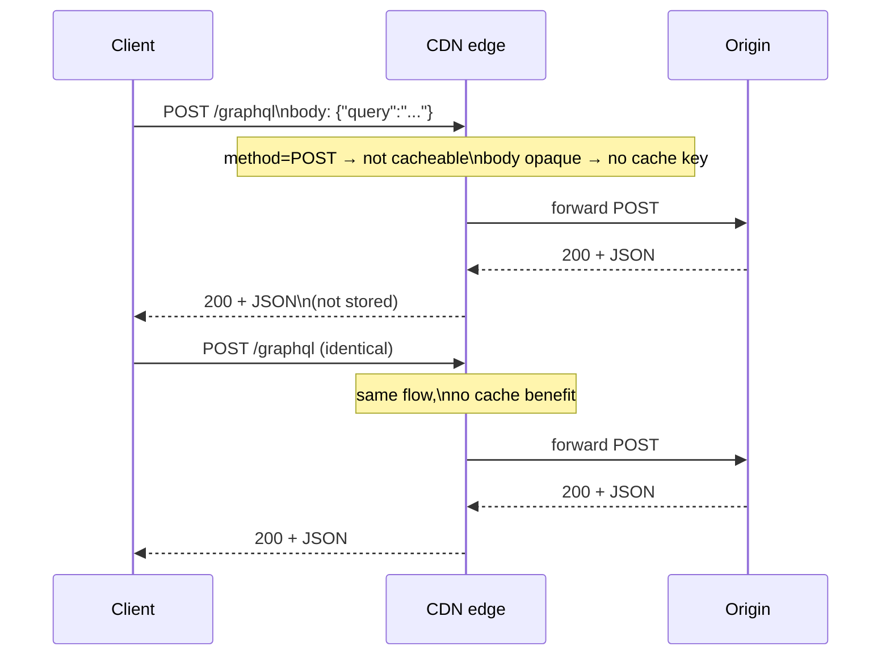
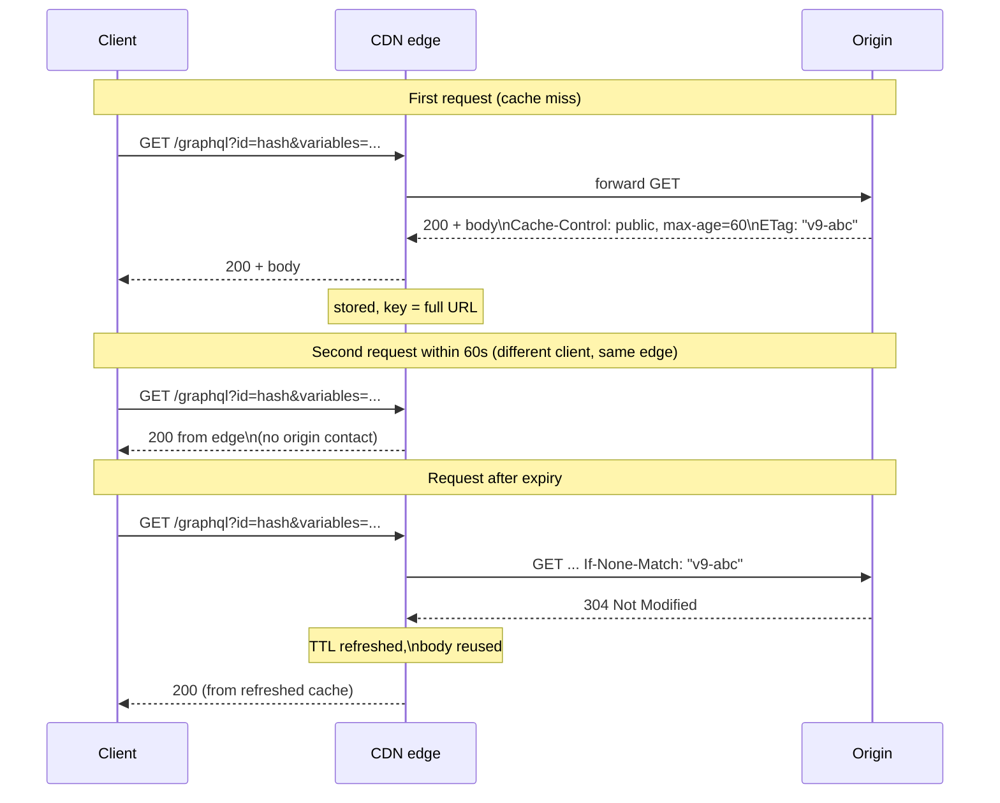
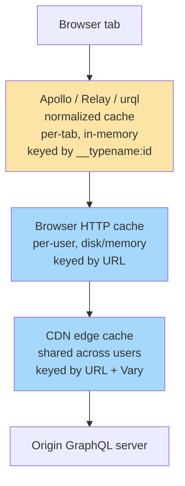

# Design Spec: BEE-596 — GraphQL HTTP-Layer Caching

**Status:** Approved for implementation planning
**Date:** 2026-04-19
**Author (brainstorm):** alegnadise@gmail.com + Claude
**Series context:** This is article **A** of a planned three-article series on the HTTP-ecosystem gap in GraphQL. Subsequent articles (B: GraphQL vs REST HTTP Infrastructure Trade-offs; C: GraphQL Operational Patterns) will be brainstormed in separate cycles. Topics deliberately deferred from this article are noted as "→ NEW-B" or "→ NEW-C".

---

## 1. Article Identity

| Field | Value |
|---|---|
| BEE number | 596 |
| Title (EN) | GraphQL HTTP-Layer Caching |
| Title (zh-TW) | GraphQL 的 HTTP 層快取 |
| Category | API Design and Communication Protocols |
| State | `draft` |
| EN file | `docs/en/API Design and Communication Protocols/596.md` |
| zh-TW file | `docs/zh-tw/API Design and Communication Protocols/596.md` |
| `:::info` tagline | "GraphQL was not designed around HTTP caching, but it can participate in it. The path runs through GET-via-persisted-queries, response cache directives, and ETag revalidation — and through understanding why naive `POST /graphql` defeats every CDN." |
| Estimated length | 2,400–2,800 words EN |

Frontmatter shape (matches existing BEE convention):

```yaml
---
id: 596
title: "GraphQL HTTP-Layer Caching"
state: draft
---
```

zh-TW file uses the same `id` and `state`; `title` is translated.

---

## 2. Thesis

GraphQL was designed to let clients ask for exactly the data they need from a single typed schema. The canonical transport — `POST /graphql` with the query in the request body — fights three core HTTP caching mechanisms simultaneously: POST is not generally cacheable by intermediaries, the cache key sits in the request body where CDNs cannot read it, and the response shape varies per query. A GraphQL deployment placed behind a CDN with no further work has an effective cache hit rate of zero.

The article shows how to make GraphQL participate in HTTP caching (persisted queries → URL-addressable GET → `Cache-Control` and `ETag` headers → conditional revalidation), and where the trade-offs honestly lie (cache fragmentation across query shapes, scope-downgrade rules in cache directives, the difference between HTTP cache and client-side normalized cache).

The article is **balanced, weighted toward practical**: ~40% why HTTP caching is awkward for GraphQL, ~60% concrete mechanisms to make it work.

---

## 3. Section-by-Section Content Plan

### 3.1 Context (~250 words)

Open by anchoring the reader in BEE-205: HTTP caching is the single highest-leverage performance improvement at the protocol layer, delivered through `Cache-Control`, conditional requests, and shared CDN caches. REST inherits all of that for free because GET is the default verb for reads and URLs are the natural cache key.

Then pivot: GraphQL was designed around a different goal. Its canonical transport is `POST /graphql` with the query in the request body. Three properties of that design fight the HTTP cache:

1. **POST is not generally cacheable** by HTTP intermediaries (RFC 9111 §4 — POST responses are cacheable only under narrow conditions essentially no GraphQL deployment satisfies in practice).
2. **The cache key lives in the request body, not the URL** — a CDN cannot key on `{user(id:1){name}}` vs `{user(id:1){email}}` because it does not parse request bodies.
3. **Response shape varies per request** — even for the same logical resource, two queries selecting different field subsets produce different responses, fragmenting cache utility even if the cache key problem is solved.

Close with the practical motivation: teams routinely deploy GraphQL behind a CDN, discover the cache hit rate is effectively zero, and either give up on edge caching or reach for the client-side normalized cache and conflate the two. The article exists to give a complete map of HTTP-layer caching options for GraphQL and where each one stops working.

### 3.2 Principle (one paragraph, RFC 2119 voice)

> To make GraphQL participate in HTTP caching, the request **MUST** be expressible as a stable, idempotent GET URL — which **SHOULD** be achieved through persisted queries that map a query hash to its registered text. Servers **SHOULD** emit `Cache-Control` and `ETag` headers per response, and clients **SHOULD** revalidate with `If-None-Match`. Teams **MUST NOT** conflate HTTP-layer caching (shared, network-edge, request-scoped) with GraphQL client-side normalized cache (per-client, in-memory, object-scoped) — they solve different problems and are not substitutes.

### 3.3 Body Section 1: Why default `POST /graphql` defeats the HTTP cache (~200 words)

Three blockers, each one paragraph:

**(a) POST cacheability rules.** RFC 9111 permits POST response caching only when the response includes explicit freshness information AND the request method is recognized by the cache as cacheable for that resource. In practice, neither browsers nor commodity CDNs cache POST responses. GraphQL's default transport hits the disabled path.

**(b) Cache key in the body.** CDNs build cache keys from the request URL (and optionally headers via `Vary`). They do not parse JSON request bodies. Two semantically distinct queries `{user(id:1){name}}` and `{user(id:1){email}}` arrive at the CDN as identical `POST /graphql` requests with different opaque payloads — there is no key to differentiate them on.

**(c) Response shape varies per query.** Even if the previous two blockers were solved, the same logical resource can produce different response bodies depending on which fields the client selected. This fragments cache entries and complicates invalidation (covered in §3.7).

Include one short illustrative request showing what a CDN sees:

```http
POST /graphql HTTP/1.1
Content-Type: application/json
Content-Length: 84

{"query":"query { user(id:1) { name } }"}
```

Annotate: "From the CDN's perspective: method=POST → not cacheable; URL=/graphql → identical for every query; cache key has no meaningful entropy."

### 3.4 Body Section 2: GET-via-persisted-queries (~300 words)

The mechanism that unblocks all three failures: register the query under a stable hash and address it by URL.

**Hash and registration.** The client computes `sha256(normalized_query_text)`. The server maintains a hash → query-text registry. Two registration strategies:

- **Build-time allowlist registration:** every query the client is allowed to send is registered at build/deploy time. Unknown hashes are rejected. Strongest security and predictability. (Allowlist-as-security boundary → NEW-C.)
- **Runtime auto-persist (round-trip-on-miss):** the client first sends the hash alone; if the server responds `PersistedQueryNotFound`, the client retries with the full query text and the server registers it. Lower friction; weaker security posture.

**Wire-level GET shape.** Once registered, the request becomes:

```http
GET /graphql?extensions={"persistedQuery":{"version":1,"sha256Hash":"abc..."}}&variables={"id":1} HTTP/1.1
```

The URL is now the full cache key — query identity (via hash) and arguments (via variables) are both URL-addressable. CDNs can store and retrieve responses keyed on this URL like any REST GET.

**Standards picture.** The GraphQL specification itself is silent on transport. The **GraphQL-over-HTTP working draft** (graphql/graphql-over-http on GitHub) is the active effort to standardize GET handling, persisted documents, and content negotiation. Apollo's APQ protocol is the de facto reference implementation predating the working draft; equivalents exist in GraphQL Yoga, Mercurius, Hot Chocolate, and graphql-go. This article describes the pattern generically and cites APQ as one concrete instance.

**What this unlocks at the edge.** Once requests are GET URLs, every standard CDN cache mechanism applies: browser cache, shared CDN cache, `Cache-Control`, `Vary`, conditional revalidation. The remaining sections build on this foundation.

### 3.5 Body Section 3: Per-response cache directives (~250 words)

Once requests are GET, the server can emit `Cache-Control` and the CDN will honor it. The question is *what value to emit*.

**Schema-level cache hints.** The dominant pattern (originated in Apollo, replicated in other servers and partially proposed for the GraphQL-over-HTTP draft) is a schema directive:

```graphql
type Product @cacheControl(maxAge: 300) {
  id: ID!
  name: String!
  price: Float! @cacheControl(maxAge: 30)
  inventory: Int! @cacheControl(maxAge: 5, scope: PRIVATE)
}

type Query {
  product(id: ID!): Product @cacheControl(maxAge: 60)
}
```

**The minimum-across-all-fields rule.** The server walks the resolved response and computes the *minimum* `maxAge` across all fields actually selected, plus the *strictest* scope. The query `{ product(id:1) { name } }` returns `Cache-Control: public, max-age=60` (Query.product hint, since name is unspecified and inherits the parent). The query `{ product(id:1) { name inventory } }` returns `Cache-Control: private, max-age=5` (the inventory field downgrades both axes).

**The scope-downgrade trap.** Any field marked `PRIVATE` (or unmarked, depending on server defaults) downgrades the entire response to `Cache-Control: private`, which prevents CDN storage entirely. This is the most common reason a "cached" GraphQL deployment shows zero CDN hit rate: a single sensitive field in a popular query path. Detection requires logging the emitted `Cache-Control` per query, not just hoping schema hints are configured correctly.

### 3.6 Body Section 4: ETag and conditional revalidation in GraphQL (~250 words)

Once responses carry `Cache-Control`, ETag enables free revalidation when entries expire — same mechanism as BEE-205, applied to a GraphQL URL.

**ETag generation strategies.**

- **Hash the JSON response body.** Cheap, always correct, no domain knowledge needed. The cost is that the ETag changes whenever any selected field changes, even fields the client doesn't care about for cache-validity purposes. Recommended default.
- **Derive from underlying entity versions.** Compose an ETag from the version vectors of every entity touched during resolution. More precise (a change to one field on one entity invalidates only the queries that touched that entity-field), but requires version tracking infrastructure and is complicated by query-shape variance. Worth it only at scale.

**The `If-None-Match` flow.** Once a cached entry expires (`max-age` exceeded), the cache (browser or CDN) sends:

```http
GET /graphql?extensions=...&variables=... HTTP/1.1
If-None-Match: "v9-abc123"
```

If the server's current ETag for that exact query+variables combination matches, it returns `304 Not Modified` with no body. The cache refreshes its TTL and serves the stored response.

**The honest caveat.** A GraphQL 304 means "the response *to this exact query shape* has not changed." It is coarser than REST's resource-level 304 in one direction (different queries on the same resource don't share revalidation benefit) and finer in another (a query selecting a stable subset of fields can return 304 even if other fields on the resource changed). Frame this trade-off plainly; do not pretend GraphQL ETag behavior maps 1:1 onto REST ETag behavior.

### 3.7 Body Section 5: Cache fragmentation (~200 words)

The cost of query-shape granularity: the CDN holds one cache entry per *(persisted-query-hash, variables)* tuple. The same logical resource can appear in many cache entries.

Concrete: if Alice's user record is queried in five distinct query shapes across the application — `{name}`, `{name,email}`, `{name,orders{id}}`, `{name,orders{id,total}}`, and `{name,orders{id,items{name,price}}}` — there are five cache entries representing one underlying resource. A change to Alice's name requires invalidating all five.

**Three honest approaches:**

1. **Tagged invalidation.** Stamp each cache entry with the set of underlying entities it touched (e.g., `surrogate-key: user-1, order-101, order-102`). On write, purge by tag. Requires CDN support for surrogate keys (some commodity CDNs support this; others don't). Solves the problem cleanly when available.
2. **TTL-only acceptance.** Set short `max-age` and accept that stale data persists for that window. Operationally simple; trades freshness for engineering effort.
3. **Restrict to a small allowlisted query set.** If the client only ever sends, say, ten registered queries, fragmentation is bounded by ten times the cardinality of variables. Combines well with build-time persisted-query allowlists.

This is a real trade-off without a single right answer. Article must frame it honestly.

### 3.8 Body Section 6: Brief contrast with client-side normalized cache (~150 words + table)

GraphQL clients (Apollo Client, Relay, urql) maintain a **normalized in-memory cache** in the browser tab. When a query response arrives, the client decomposes it into individual entities keyed by `__typename` + `id`, stores them in a flat map, and reconstitutes responses from that map for subsequent queries. Two different queries selecting overlapping fields on the same entity share storage and update each other.

This is a different cache layer from HTTP caching. It is not a substitute.

| Property | HTTP cache (browser + CDN) | Client normalized cache |
|---|---|---|
| Scope | Shared across users (CDN) or per-browser (browser cache) | Per browser tab; dies on reload |
| Cache key | URL (+ `Vary` headers) | Entity identity (`__typename:id`) |
| Storage location | Network edge / browser disk | Browser memory inside the GraphQL client |
| Invalidation | TTL (`max-age`), conditional revalidation (`ETag`), CDN purge | Explicit (`cache.evict`, `writeFragment`), or refetch |
| Protects against | Repeat network round-trips for the same URL | Repeat resolution work and prop-drilling within a session |
| Survives page reload | Yes | No |

Both layers can be wrong simultaneously. Both can be right simultaneously. They are complementary. Deep treatment of normalized client cache mechanics is out of scope for this article and warrants its own future BEE.

### 3.9 Visual

Three Mermaid diagrams:

**V1 — Sequence: `POST /graphql` defeats the CDN.**



**V2 — Sequence: Persisted-query GET with ETag revalidation.**



**V3 — Layer diagram: HTTP cache vs client normalized cache.**



Caption: "The two cache layers are stacked, not alternatives. Yellow = client-side, blue = HTTP-layer."

### 3.10 Example

One continuous narrative, three states of the same logical operation ("get user 1's name"):

**State A — naive POST (uncacheable):**

```http
POST /graphql HTTP/1.1
Content-Type: application/json

{"query":"query { user(id:1) { name } }"}
```

```http
HTTP/1.1 200 OK
Content-Type: application/json

{"data":{"user":{"name":"Alice"}}}
```

Annotation: no `Cache-Control`, no `ETag`. CDN cannot store this. Every repeat hits the origin.

**State B — same operation as APQ GET, first call (registration):**

First call sends the hash alone:

```http
GET /graphql?extensions=%7B%22persistedQuery%22%3A%7B%22version%22%3A1%2C%22sha256Hash%22%3A%22abc...%22%7D%7D&variables=%7B%22id%22%3A1%7D HTTP/1.1
```

Server response (hash not yet registered):

```http
HTTP/1.1 200 OK
Content-Type: application/json

{"errors":[{"message":"PersistedQueryNotFound","extensions":{"code":"PERSISTED_QUERY_NOT_FOUND"}}]}
```

Client retries with both hash and full query text; server registers the hash. Subsequent calls send the hash alone and succeed:

```http
HTTP/1.1 200 OK
Content-Type: application/json
Cache-Control: public, max-age=60
ETag: "v9-abc"

{"data":{"user":{"name":"Alice"}}}
```

**State C — revalidation 60s later:**

```http
GET /graphql?extensions=...&variables=... HTTP/1.1
If-None-Match: "v9-abc"
```

```http
HTTP/1.1 304 Not Modified
ETag: "v9-abc"
Cache-Control: public, max-age=60
```

Zero body bytes. Cache TTL refreshed. Reader leaves with the full mental model: not cacheable → cacheable → cacheable + revalidating cheaply.

### 3.11 Common Mistakes

1. **"We put GraphQL behind a CDN, so it's cached" — but every request is `POST /graphql`.** The CDN sees POST, refuses to cache, forwards to origin. Hit rate ≈ 0%. Fix: persisted queries via GET, or accept that the CDN is doing TLS termination only.

2. **Confusing client-side normalized cache with HTTP caching.** Apollo Client caching a response in one browser tab is not the same thing as a CDN edge serving it to thousands of users. Different layers, different lifecycles. They are complementary, not substitutes; a team relying on one when they need the other will be surprised.

3. **Schema hints downgraded by a single sensitive field.** A `@cacheControl(maxAge: 300)` on a public type is silently overridden when a query also selects a field with `PRIVATE` scope (or an unhinted field, depending on server defaults). The minimum-across-all-fields rule produces `Cache-Control: private` and prevents CDN storage entirely. Detection requires logging emitted headers per query.

4. **ETag from response body hash with REST-shaped expectations.** Two clients querying `{user(id:1){name}}` and `{user(id:1){name,email}}` get different responses → different ETags → no shared revalidation. This is correct behavior; teams accustomed to REST resource-level ETags are surprised. Frame the trade-off honestly in design discussions.

5. **Treating auto-persisted queries as a security mechanism.** APQ in auto-register mode accepts any query the client sends on the registration round-trip. It is a *caching* mechanism, not an *allowlist* mechanism. Persisted queries as a security boundary requires build-time registration and rejecting unknown hashes — covered in NEW-C.

### 3.12 Related BEPs

- [BEE-205](../Caching/205.md) HTTP Caching and Conditional Requests — foundation; assumed prior reading
- [BEE-74](74.md) GraphQL vs REST vs gRPC — high-level protocol comparison; this article deepens its single bullet on GraphQL caching
- [BEE-485](485.md) GraphQL Federation — adjacent GraphQL operational concern
- [BEE-200](../Caching/200.md) Caching Fundamentals and Cache Hierarchy — TTL/invalidation concepts
- [BEE-304](../Performance%20and%20Scalability/304.md) CDN Architecture — how edge nodes consume `Cache-Control`
- [BEE-72](72.md) Idempotency in APIs — referenced in connection with GraphQL's lack of HTTP-level idempotency semantics (deeper treatment → NEW-B)

### 3.13 References — research plan

Every URL must be verified live and confirmed to support the cited claim before the article is committed. Per CLAUDE.md: "AI internal knowledge alone is insufficient."

Required sources:

1. **GraphQL specification (latest)** — https://spec.graphql.org/ — confirm what the spec says (and does not say) about HTTP and caching. Cite the specific revision (e.g., October 2021) consulted.
2. **GraphQL-over-HTTP working draft** — https://github.com/graphql/graphql-over-http — current state of GET handling and persisted-document standardization. May still be in draft; flag the version/commit consulted.
3. **RFC 9111 (HTTP Caching)** — https://www.rfc-editor.org/rfc/rfc9111.html — for the POST cacheability claim. Cite §4 (Constructing Responses from Caches).
4. **MDN — HTTP caching** — https://developer.mozilla.org/en-US/docs/Web/HTTP/Guides/Caching — for `Cache-Control` directives reference.
5. **MDN — HTTP conditional requests** — https://developer.mozilla.org/en-US/docs/Web/HTTP/Guides/Conditional_requests — for the ETag / `If-None-Match` flow.
6. **Apollo Server — `@cacheControl` directive and response cache plugin** — https://www.apollographql.com/docs/apollo-server/performance/caching — semantics of schema hints, scope rules, header emission.
7. **Apollo APQ protocol** — https://www.apollographql.com/docs/apollo-server/performance/apq — for the persisted-query hash protocol details.
8. **At least one non-Apollo implementation** for vendor-neutrality — e.g., GraphQL Yoga response caching plugin (https://the-guild.dev/graphql/yoga-server/docs/features/response-caching) or Hot Chocolate query persistence docs.
9. **One neutral practitioner article** corroborating the cache-fragmentation framing — preferred: an infrastructure or architecture blog that is not a vendor product page.

Vendor-neutrality note (per CLAUDE.md): Apollo originated several of these patterns and is the canonical reference. Citing Apollo docs is acceptable when explicitly framed as "one implementation of the pattern" alongside at least one non-Apollo implementation. Avoid prose that promotes a specific vendor.

---

## 4. Bilingual Production Notes

- **EN written first**, then **zh-TW** as a parallel translation. Project convention: every EN file has a zh-TW counterpart at the same path under `docs/zh-tw/`.
- **Style constraints (zh-TW), per `~/.claude/CLAUDE.md`:**
  - No contrastive negation (「不是 X，而是 Y」).
  - No empty contrast where B is unrelated to A.
  - No precision-puffery (避免「說得很清楚」、「(動詞)得很精確」).
  - No em-dash chains stringing together filler clauses.
  - No undefined adjectives (e.g., bare 「很重」).
  - No undefined verbs without a subject/range (e.g., bare 「可以跑」).
  - No "可以 X 可以 Y 可以 Z" capability stacks.
- **Code-language policy:** GraphQL SDL, HTTP wire-format snippets, and Mermaid diagrams are identical between EN and zh-TW (code is language-neutral). Only the surrounding prose translates. Technical terms (ETag, Cache-Control, persisted query, CDN, scope, hash) stay in English; the surrounding Chinese prose carries the explanation.
- **Commit pattern:** match recent history. Single commit:

  ```
  feat: add BEE-596 GraphQL HTTP-Layer Caching (EN + zh-TW)
  ```

---

## 5. Out of Scope (Explicitly Deferred)

- **GraphQL idempotency, retry semantics, error model** — fits NEW-B (HTTP infrastructure trade-offs).
- **Observability differences (per-route metrics vs single-endpoint)** — fits NEW-B.
- **Rate limiting via query-complexity scoring** — partially mentioned in BEE-74 already; deeper treatment fits NEW-B or NEW-C.
- **Persisted-query allowlisting as a security boundary** — fits NEW-C (operational patterns).
- **Managed GraphQL CDN/router products** (vendor product comparisons) — out of scope for vendor-neutrality reasons; mentioned in passing as "tagged invalidation requires CDN support."
- **Deep treatment of client-side normalized cache mechanics** (entity normalization rules, cache writes, optimistic UI) — large enough for its own future BEE; this article includes only a contrast section.
- **GraphQL subscriptions caching** — subscriptions are long-lived event streams; HTTP caching does not apply.

---

## 6. Implementation Plan Hand-off

Because this is a documentation article (not code), the writing-plans skill should produce a **research-and-write plan**, not a code implementation plan. The plan should sequence:

1. **Reference verification:** every URL in §3.13 fetched, claims confirmed against actual content. Replace any dead links or revise any claims that the source does not support.
2. **EN draft** following the structure in §3 (Context → Principle → six body sections → Visual → Example → Common Mistakes → Related BEPs → References).
3. **EN self-review:** check against article template, RFC 2119 voice in Principle, no vendor promotion, no precision-puffery, no empty contrast.
4. **zh-TW translation:** parallel structure, same code blocks, prose translated under the zh-TW style constraints in §4.
5. **Mermaid render verification:** all three diagrams render in VitePress dev server.
6. **Single commit** with the message in §4.
