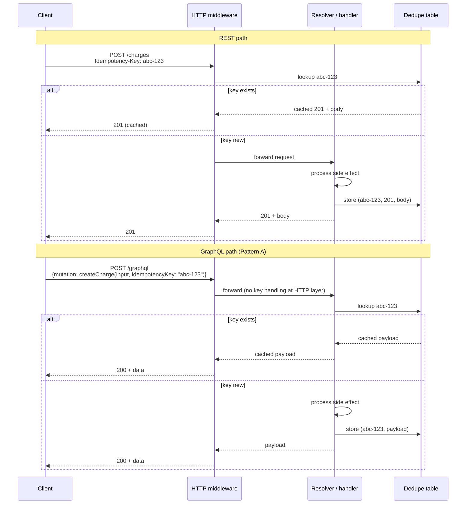
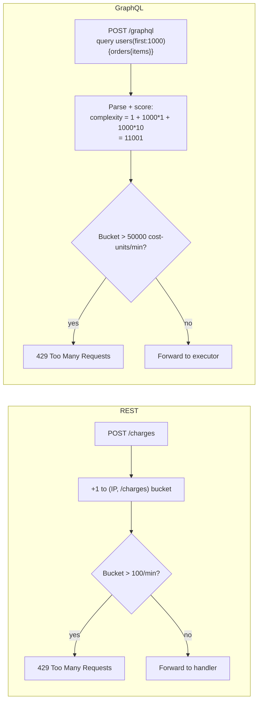

# Design Spec: BEE-597 — GraphQL vs REST: Request-Side HTTP Trade-offs

**Status:** Approved for implementation planning
**Date:** 2026-04-19
**Author (brainstorm):** alegnadise@gmail.com + Claude
**Series context:** Article **B-1** of a planned four-article series on the HTTP-ecosystem gap in GraphQL.

| | Article | Status |
|---|---|---|
| A | BEE-596 GraphQL HTTP-Layer Caching | Shipped (commit `0bf8ea7`) |
| **B-1** | **BEE-597 GraphQL vs REST: Request-Side HTTP Trade-offs** (this spec) | Brainstormed |
| B-2 | BEE-598 GraphQL vs REST: Response-side HTTP Trade-offs (observability, authorization, errors) | Future cycle |
| C | BEE-599 GraphQL Operational Patterns (persisted-query allowlisting, query complexity, schema versioning) | Future cycle |

Topics deliberately deferred from this article are noted as "→ NEW-B-2" or "→ NEW-C".

---

## 1. Article Identity

| Field | Value |
|---|---|
| BEE number | 597 |
| Title (EN) | GraphQL vs REST: Request-Side HTTP Trade-offs |
| Title (zh-TW) | GraphQL vs REST：請求端的 HTTP 取捨 |
| Category | API Design and Communication Protocols |
| State | `draft` |
| EN file | `docs/en/API Design and Communication Protocols/597.md` |
| zh-TW file | `docs/zh-tw/API Design and Communication Protocols/597.md` |
| `:::info` tagline | "REST inherits caching, idempotency, and rate limiting from HTTP itself. GraphQL gets none of them by default and must rebuild each at the schema or middleware layer. This article covers the three request-side gaps and the default mitigations." |
| Estimated length | 2,800–3,400 words EN |

Frontmatter shape:

```yaml
---
id: 597
title: "GraphQL vs REST: Request-Side HTTP Trade-offs"
state: draft
---
```

---

## 2. Thesis

GraphQL was not designed around HTTP. Its canonical transport is `POST /graphql` with the operation in the request body, served from a single endpoint regardless of which logical resource is being read or mutated. That design buys schema-driven flexibility but spends three things REST gets for free from HTTP itself: a cacheable URL for every read (covered in BEE-596), method-level idempotency semantics (RFC 9110 declares GET/PUT/DELETE idempotent by definition), and per-route rate-limiting affordances (gateways limit per IP × URL pattern).

The article walks through each of the three request-side gaps, shows what teams actually do to close them, and recommends a default per gap. It is not a vendor comparison and not an argument that REST is "better." It is a precise enumeration of what GraphQL must rebuild and the engineering shape of that rebuild.

Center of gravity: **comparison + recommendation**. Each section follows the same internal structure — REST baseline → GraphQL gap → mitigation pattern(s) → recommendation — so the reader sees the same shape three times and leaves with a defaulted decision per dimension.

---

## 3. Section-by-Section Content Plan

### 3.1 Context (~250 words)

Open by recapping BEE-596's framing: GraphQL was not designed around HTTP, and the canonical `POST /graphql` over a single endpoint is opaque to any HTTP intermediary.

Enumerate the three things REST inherits from HTTP:

1. **A cacheable URL for every read** (covered in BEE-596).
2. **Method-level idempotency semantics** — RFC 9110 declares GET/PUT/DELETE idempotent by definition; POST/PATCH are not. Clients and proxies can reason about retry safety from the verb alone.
3. **Per-route rate-limiting affordances** — gateways limit per IP × URL pattern. The URL is the natural rate-limit key.

State the consequence: a `POST /graphql` request tells an intermediary nothing about side-effects (is this a query or a mutation?), the URL is identical for every operation (per-route rate limiting collapses), and the cacheability story is already covered separately.

Close with the article's purpose: walk through each request-side gap, show standard mitigations, recommend a default per gap. Frame explicitly: this is not a vendor comparison, not an argument that REST wins.

### 3.2 Principle (one paragraph, RFC 2119 voice)

> Teams adopting GraphQL **MUST** implement idempotency, rate limiting, and cacheability as schema-level or middleware-level concerns; HTTP cannot do this work for them. Mutations **SHOULD** carry an idempotency identifier as a schema argument or a middleware-read header. Rate limits **SHOULD** be expressed in units that match the cost of the operation (query complexity points, not request count). Reads that benefit from CDN caching **SHOULD** follow the persisted-query pattern in [BEE-596](596.md). Treating these as transport-layer concerns rather than application-layer concerns leads to deployments that pass code review and fail under load.

### 3.3 The three gaps at a glance (~80 words + V1 table)

A short orienting section that sits between Principle and the body. One paragraph stating "the rest of this article expands each row of the table below." Then V1: a comparison table.

| Concern | REST inherits from HTTP | GraphQL must build it |
|---|---|---|
| **Cacheable URL** | GET URL is the cache key; ETag/304 free at the edge | Persisted-query GET + `@cacheControl` + ETag (BEE-596) |
| **Idempotency** | RFC 9110 verbs + `Idempotency-Key` header | Idempotency key as schema argument or middleware-read header |
| **Rate limiting** | Per-IP × URL pattern at the gateway | Query depth limit + complexity scoring + per-resolver limits |

### 3.4 Body Section 1: Cacheability of Reads (~600 words)

Lighter section because BEE-596 already exists. Internal structure:

**REST baseline (~120 words).** GET URL is the cache key, HTTP intermediaries cache for free, ETag/conditional revalidation works out of the box. One short wire example showing GET + Cache-Control + ETag.

**GraphQL gap (~120 words).** Default `POST /graphql` defeats every CDN. Cache fragmentation along query shapes when GET is restored via persisted queries. Reference BEE-596's three-blocker analysis without repeating it.

**Mitigation pattern (~250 words).** Two paragraphs:
- Persisted-query GET + `@cacheControl` + ETag (full treatment in BEE-596). Brief description of the mechanism in 4–5 sentences for readers who skipped 596.
- Or accept that reads will hit origin and skip CDN integration entirely. Valid for low-traffic APIs where the engineering effort isn't worth the saved round trips.

**Recommendation (~110 words).** Default to persisted-query GET for any read served at scale (define "at scale" as: read-traffic high enough that CDN hit rate would meaningfully reduce origin load). For low-traffic reads, accept POST and put the engineering effort elsewhere. Never claim "we have caching" without measuring CDN hit rate per query — instrumentation matters more than configuration.

### 3.5 Body Section 2: Idempotency and Retry Semantics (~1,000 words)

Deepest section. BEE-72 covers the REST canonical pattern but does not cover GraphQL.

**REST baseline (~200 words).** RFC 9110 §9.2.2 declares GET/PUT/DELETE/HEAD idempotent by definition. POST/PATCH need explicit `Idempotency-Key` headers. The Stripe pattern (BEE-72) is the canonical implementation: client-generated UUID v4, server-side dedupe table keyed on `(user_id, key)`, 24–72 hour TTL, atomic insert with unique constraint to handle concurrent duplicates. The header is invisible to application code in many frameworks because middleware handles it. Note the IETF working group draft `draft-ietf-httpapi-idempotency-key-header` is standardizing the header field; cite its current state as confirmed during reference verification.

**GraphQL gap (~250 words).** Four facts:
- The GraphQL specification says queries SHOULD be side-effect-free — convention only, not enforcement.
- Mutations may have side effects. Spec is silent on idempotency, retry semantics, deduplication.
- Multiple mutations in one request execute *sequentially* (spec-mandated), giving partial atomicity *within* a single request but no guarantees across requests or retries.
- HTTP `Idempotency-Key` header is invisible to GraphQL resolvers in most server libraries unless the team specifically wires it through middleware.

Frame the consequence: every team adopting GraphQL must engineer idempotency themselves. There is no spec-level or framework-level default.

**Pattern A: Idempotency key as a mutation argument (~250 words including wire example).**

Wire example:

```graphql
mutation CreateOrder($input: OrderInput!, $idempotencyKey: ID!) {
  createOrder(input: $input, idempotencyKey: $idempotencyKey) {
    id
    status
  }
}
```

Resolver checks an in-storage dedupe table keyed on `idempotencyKey`. On hit, returns the cached payload. On miss, executes the side effect and stores the payload.

Pros: schema-explicit, transport-agnostic (works over WebSocket subscriptions and any future transport), every consumer sees the contract in introspection. Cons: every mutation must be designed with the argument from day one; retrofitting is invasive because every client and every mutation signature changes.

**Pattern B: HTTP `Idempotency-Key` header read by middleware (~250 words including wire example).**

Wire example:

```http
POST /graphql HTTP/1.1
Idempotency-Key: 550e8400-e29b-41d4-a716-446655440000
Content-Type: application/json

{"query":"mutation { createOrder(input: {...}) { id } }"}
```

Server middleware reads the header before executing the operation; on a key miss, it executes the mutation and writes through to the BEE-72 dedupe table. On a hit, it returns the cached HTTP response without invoking the resolver.

Pros: REST-compatible mental model, requires no schema change, lets a team adopt idempotency uniformly across REST and GraphQL endpoints with one middleware. Cons: invisible from the schema (a developer reading the SDL has no signal that idempotency is wired up), only works when the server is HTTP-fronted (not over WebSocket subscriptions or Server-Sent Events), and the dedupe granularity is per-request not per-mutation — a single GraphQL request carrying multiple sequential mutations gets one key for all of them, which silently breaks the contract.

**V2: side-by-side sequence diagram comparing both flows.** (See Visual section §3.7 below.)

**Recommendation (~150 words).** Default to Pattern A (schema argument) for any mutation that creates non-idempotent side effects — the schema-explicit contract pays for itself in code review and onboarding clarity. Reserve Pattern B for retrofit scenarios where amending every mutation signature is cost-prohibitive (e.g., a large existing GraphQL surface migrating from "we don't have idempotency" to "we do" without breaking clients). Either way: re-use the BEE-72 dedupe table; do not invent a new storage layer for GraphQL idempotency. Multiple mutations in one request need one key per mutation argument (Pattern A handles this naturally), not one key per request (Pattern B's failure mode).

### 3.6 Body Section 3: Rate Limiting (~1,000 words)

The dimension where the GraphQL gap most often produces production incidents.

**REST baseline (~150 words).** Per-IP × URL pattern at the gateway. `429 Too Many Requests` with `Retry-After`. Cost-per-request is uniform within a route — a `GET /products/:id` does roughly the same work each time — so a rate limit of "100 requests per minute per IP" maps to a predictable origin-load envelope. The unit (requests-per-window) and the cost-per-unit (one route's worth of work) align.

**GraphQL gap (~250 words).** Every request is `POST /graphql`, so per-route limiting collapses to "per-IP requests per minute" with no further granularity. A per-IP rate limit of "100 requests per minute" does not protect the origin because one expensive query can do the work of a thousand requests. Concrete worst-case query example:

```graphql
query {
  users(first: 1000) {
    orders(first: 100) {
      items(first: 50) {
        product {
          reviews(first: 100) {
            author {
              followers(first: 100) { name }
            }
          }
        }
      }
    }
  }
}
```

One HTTP request, potentially billions of resolver invocations. The request-counting rate limiter says "fine, you've used 1 of 100." The database falls over.

**Layer 1: Query depth limit (~80 words).** Reject queries deeper than N levels at parse time. Cheap, blunt, catches obvious abuse (the example above has depth 7). Default: 10–15 depending on schema shape. Server libraries (Apollo, Yoga, graphql-armor) ship parser plugins for this.

**Layer 2: Query complexity scoring (~300 words including SDL example).**

Each field has a cost; the parser sums across the resolved query and rejects above a budget. SDL example:

```graphql
type Query {
  users(first: Int!): [User!]! @cost(complexity: 1, multipliers: ["first"])
  product(id: ID!): Product @cost(complexity: 5)
}

type User {
  orders(first: Int!): [Order!]! @cost(complexity: 1, multipliers: ["first"])
}
```

The query above scores `1*1000 + 1*100 + ...` and gets rejected.

Frame this as the GraphQL analog of REST's per-IP requests per minute: the unit is *cost units per minute per IP*, not requests. Most server libraries have plugins (Apollo's response cache plugin includes cost analysis; standalone libraries like graphql-cost-analysis and graphql-armor cover non-Apollo servers). Confirm current canonical references during research.

Critical implementation point: set the budget by *measuring your existing query catalog's cost distribution*, not by guessing. Run the cost analyzer over production query logs; pick a budget at the 99th percentile of legitimate cost-per-window plus a safety margin.

**V3: cost-budget diagram comparing REST and GraphQL.** (See Visual section §3.7 below.)

**Layer 3: Per-resolver rate limiting (~80 words).** Specific expensive fields (search, ML inference, anything that calls an external API) get their own limits independent of overall query cost. Use the same backend (Redis token bucket) as your REST rate limiter; just key by `(user, field)` instead of `(user, route)`.

**Recommendation (~200 words).** All three layers stack. Depth limit catches accidental cycles (cheap default: 10–15). Complexity scoring is the load-bearing layer (budget set by measurement). Per-resolver limits are scalpel-targeted at known-expensive fields. A per-IP request rate limit is still useful as a coarse outer envelope, but it does not replace any of the above. Persisted-query allowlists (deferred to BEE-599) bound the worst case but only work when the client surface is fully under your control. For public APIs accepting arbitrary client queries, layers 1–3 are mandatory; for internal APIs with a known client set, persisted-query allowlists can replace layers 1 and 2 and leave only layer 3 for expensive fields.

### 3.7 Visual

Three diagrams. V1 is the comparison table in §3.3 above. V2 and V3:

**V2 — Side-by-side sequence diagram comparing REST and GraphQL idempotency flows.**



**V3 — Cost-budget diagram for rate limiting.**



### 3.8 No separate `## Example` section

Deliberate departure from the BEE template. Reasoning: BEE-596 had one progression (uncacheable → cacheable → revalidating cheaply) so a continuous example made sense. NEW-B-1 has three independent comparisons; forcing a single continuous example would be artificial. Inline wire-level snippets in each body section (§3.4–§3.6) carry the example load.

### 3.9 Common Mistakes (5 items)

1. **Treating per-IP request rate limits as adequate protection for GraphQL.** A `100 requests/minute/IP` limit lets one bad actor send 100 maximum-complexity queries per minute. Each can do the work of a thousand REST requests. Throughput dashboards look fine; CPU and database connection pools alarm.

2. **Implementing GraphQL idempotency in a separate storage layer from REST.** Teams running both protocols often build a second dedupe table for GraphQL mutations, splitting operations on the same logical entity (e.g., "create charge") across two storage paths. Use one table (BEE-72), keyed on whatever identifier the client sends, regardless of transport.

3. **Reading `Idempotency-Key` from HTTP headers without considering multi-mutation requests.** Pattern B treats one HTTP request as one idempotent unit. A single GraphQL request can carry multiple sequential mutations. Replay-protecting only the outer request leaves inner mutations re-executable on retry. Either reject multi-mutation requests at the middleware boundary, or fall back to Pattern A.

4. **Setting a query complexity budget without measuring the existing query catalog.** Picking a budget out of the air either rejects legitimate dashboards or admits abusive queries. Run the cost analyzer over your existing client queries first; set the budget at the 99th percentile of legitimate cost-per-window plus a safety margin. Adjust as the catalog evolves.

5. **Equating "we serve GraphQL over HTTP" with "we benefit from HTTP infrastructure."** The CDN does not cache POST. The WAF can rate-limit per IP but cannot score query cost. HTTP infrastructure is necessary, not sufficient. Plan the schema-layer and middleware-layer work explicitly.

### 3.10 Related BEPs

Organized into three clusters plus two forward-references:

**Caching cluster:**
- [BEE-596](596.md) GraphQL HTTP-Layer Caching — full treatment of the caching gap; this article references it.
- [BEE-205](../Caching/205.md) HTTP Caching and Conditional Requests — REST baseline.
- [BEE-74](74.md) GraphQL vs REST vs gRPC — high-level decision tree.

**Idempotency cluster:**
- [BEE-72](72.md) Idempotency in APIs — REST canonical treatment; this article reuses its dedupe-table schema and concurrent-duplicate handling.
- [BEE-473](../Distributed Systems/473.md) Idempotency Key Implementation Patterns — practical patterns.
- [BEE-261](../Resilience and Reliability/261.md) Retry Strategies and Exponential Backoff — client-side complement.

**Rate limiting cluster:**
- [BEE-266](../Resilience and Reliability/266.md) Rate Limiting and Throttling — algorithm reference (token bucket, sliding window).
- [BEE-449](../Distributed Systems/449.md) Distributed Rate Limiting Algorithms — distributed implementation concerns.
- [BEE-402](../Multi-Tenancy/402.md) Tenant-Aware Rate Limiting and Quotas — multi-tenant analog.

**Forward-references in series:**
- (future) BEE-598 Response-side HTTP trade-offs (observability, authorization, error semantics).
- (future) BEE-599 GraphQL Operational Patterns (persisted-query allowlisting as a security boundary, query complexity, schema versioning).

### 3.11 References — research plan

Each URL must be fetched and the cited claim confirmed live before commit. Same standard as BEE-596. Apollo cited only as one implementation among several.

1. **GraphQL Specification (October 2021)** — https://spec.graphql.org/October2021/ — confirm: defines query/mutation operation types; mutations execute serially within one request; spec is silent on idempotency, rate limiting, and retry semantics. Already cited in BEE-596; reuse.
2. **GraphQL over HTTP working draft** — https://github.com/graphql/graphql-over-http — confirm: silent on idempotency and rate limiting beyond transport conventions. Already cited in BEE-596; reuse.
3. **RFC 9110 §9.2.2 Idempotent Methods** — https://httpwg.org/specs/rfc9110.html#idempotent.methods — already cited in BEE-72; reuse.
4. **IETF draft — The Idempotency-Key HTTP Header Field** — https://datatracker.ietf.org/doc/draft-ietf-httpapi-idempotency-key-header/ — current standardization status of the header (was Stripe convention, now an IETF httpapi WG draft). Confirm draft state and key field semantics.
5. **Stripe — Idempotent Requests** — https://docs.stripe.com/api/idempotent_requests — pattern reference, already cited in BEE-72.
6. **Apollo Server — query complexity / rate limiting** — find current canonical docs URL (likely under apollographql.com/docs/apollo-server/security/ or .../performance/). May have moved; verify during research. Confirm: schema directive or plugin-based cost annotation, sum-across-query enforcement.
7. **graphql-cost-analysis or graphql-armor** — https://github.com/slicknode/graphql-query-complexity OR https://github.com/Escape-Technologies/graphql-armor — vendor-neutral library implementing complexity scoring outside Apollo. Pick whichever is most actively maintained at research time.
8. **GraphQL Yoga — operation cost limits** — non-Apollo implementation reference. Find current docs URL; likely at https://the-guild.dev/graphql/envelop/plugins/use-operation-cost-analyzer or similar Envelop plugin.
9. **One neutral practitioner article on GraphQL rate limiting in production** — search criterion: engineering blog (not vendor product page) discussing real-world cost-budget tuning. Acceptable: GitHub Engineering, Shopify, Netflix, Stripe blogs. Drop if no strong source found rather than padding.

Vendor-neutrality note (per project CLAUDE.md): Apollo cited as one implementation alongside at least one alternative; never as a recommendation in prose. Same standard as BEE-596.

---

## 4. Bilingual Production Notes

- EN written first, then zh-TW as parallel translation. Project convention: every EN file has a zh-TW counterpart at the same path under `docs/zh-tw/`.
- **Style constraints (zh-TW), per `~/.claude/CLAUDE.md`:** no contrastive negation (「不是 X，而是 Y」), no empty contrast, no precision-puffery (「說得很清楚」, 「(動詞)得很精確」), no em-dash chains stringing filler clauses, no undefined adjectives, no undefined verbs without subject/range, no `可以X可以Y可以Z` capability stacks.
- Code blocks (GraphQL SDL, HTTP wire format, Mermaid diagrams) copied verbatim between locales; only prose translates.
- Technical terms stay in English: `Idempotency-Key`, `query complexity`, `429`, `Retry-After`, `RFC 9110`, `RFC 9111`, `persisted query`, `CDN`, `ETag`, `Cache-Control`, field names, etc.
- Single commit per project convention:

  ```
  feat: add BEE-597 GraphQL vs REST Request-Side HTTP Trade-offs (EN + zh-TW)
  ```

---

## 5. Out of Scope (Explicitly Deferred)

- **Response-side gaps** (observability, authorization granularity, error semantics) — fits NEW-B-2 (BEE-598).
- **Persisted-query allowlisting as a security/DoS boundary** — fits NEW-C (BEE-599). This article references it as a Layer-4-like option for rate limiting but does not deep-dive.
- **Query complexity directive standardization** — there is no GraphQL Foundation spec for `@cost`; each library defines its own. This article describes the pattern generically and notes the lack of standardization.
- **Subscription rate limiting** — long-lived WebSocket subscriptions have a different model than request-response rate limits. Subscriptions are out of scope; the article focuses on request-response query/mutation traffic.
- **Schema-level authorization rules driving idempotency or rate limiting** — interesting but tangential; fits NEW-B-2's authorization-granularity discussion.

---

## 6. Implementation Plan Hand-off

Documentation article. Same plan template as BEE-596 (`docs/superpowers/plans/2026-04-19-bee-596-graphql-http-caching.md`), adapted for this article:

1. **Reference verification:** every URL in §3.11 fetched, claims confirmed against actual content. Replace dead links or revise unsupported claims. URLs already verified in BEE-596 (GraphQL spec, GraphQL-over-HTTP, MDN, RFC 9111) can be reused without re-fetching.
2. **EN draft** following the structure in §3 (Context → Principle → comparison table → 3 body sections → Common Mistakes → Related BEPs → References). No separate `## Example`; inline examples per body section.
3. **EN self-review:** check against article template, RFC 2119 voice in Principle, no vendor promotion, no precision-puffery, no empty contrast.
4. **zh-TW translation:** parallel structure, same code blocks, prose translated under the zh-TW style constraints in §4.
5. **Render verification:** optional (skipped for BEE-596 by user choice; same precedent applies here).
6. **Update list.md** in both locales: append `- [597.GraphQL vs REST: Request-Side HTTP Trade-offs](597)` (EN) and `- [597.GraphQL vs REST：請求端的 HTTP 取捨](597)` (zh-TW) after the BEE-596 entry.
7. **Single commit** with the message in §4.
