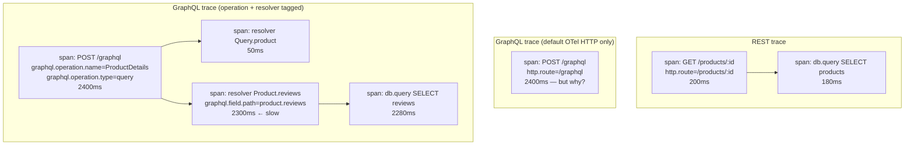
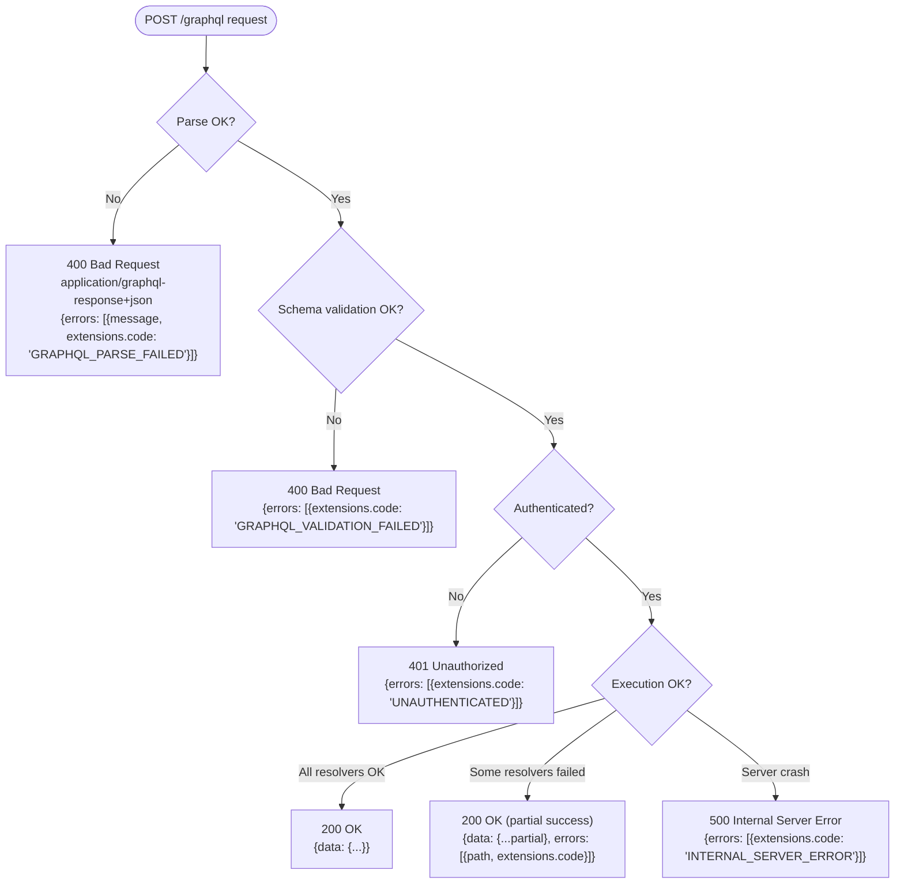

# Design Spec: BEE-598 — GraphQL vs REST: Response-Side HTTP Trade-offs

**Status:** Approved for implementation planning
**Date:** 2026-04-19
**Author (brainstorm):** alegnadise@gmail.com + Claude
**Series context:** Article **B-2** of a planned four-article series on the HTTP-ecosystem gap in GraphQL.

| | Article | Status |
|---|---|---|
| A | BEE-596 GraphQL HTTP-Layer Caching | Shipped (commit `0bf8ea7`) |
| B-1 | BEE-597 GraphQL vs REST: Request-Side HTTP Trade-offs | Shipped (commit `22d1f3e`) |
| **B-2** | **BEE-598 GraphQL vs REST: Response-Side HTTP Trade-offs** (this spec) | Brainstormed |
| C | BEE-599 GraphQL Operational Patterns (persisted-query allowlisting, query complexity governance, schema versioning) | Future cycle |

Topics deliberately deferred from this article are noted as "→ NEW-C".

---

## 1. Article Identity

| Field | Value |
|---|---|
| BEE number | 598 |
| Title (EN) | GraphQL vs REST: Response-Side HTTP Trade-offs |
| Title (zh-TW) | GraphQL vs REST：回應端的 HTTP 取捨 |
| Category | API Design and Communication Protocols |
| State | `draft` |
| EN file | `docs/en/API Design and Communication Protocols/598.md` |
| zh-TW file | `docs/zh-tw/API Design and Communication Protocols/598.md` |
| `:::info` tagline | "REST inherits status-code-driven errors, per-route observability, and URL-based authorization from HTTP itself. GraphQL collapses all three to a single endpoint and must rebuild each at the schema or middleware layer. This article covers the three response-side gaps and the default mitigations." |
| Estimated length | 3,000–3,600 words EN |

Frontmatter shape:

```yaml
---
id: 598
title: "GraphQL vs REST: Response-Side HTTP Trade-offs"
state: draft
---
```

---

## 2. Thesis

[BEE-597](597.md) covered the three request-side gaps where REST inherits HTTP infrastructure and GraphQL must rebuild it. This article covers the response-side counterpart. The same thesis applies: a single `POST /graphql` endpoint collapses three things HTTP delivers to REST for free — status-code-driven error semantics, per-route observability, and URL-based authorization — and GraphQL must rebuild each at the schema or middleware layer.

Center of gravity: **comparison + recommendation**, same shape as B-1. Each section follows REST baseline → GraphQL gap → mitigation patterns → recommendation, with the error-semantics section running heavier (~1,300 words) to accommodate the partial-success treatment that has no REST analog.

---

## 3. Section-by-Section Content Plan

### 3.1 Context (~250 words)

Symmetric callback to BEE-597: that article covered request-side gaps; this one covers the response-side counterpart. Enumerate the three things REST inherits from HTTP on the response side:

1. **Status-code-driven error semantics.** Every HTTP-aware tool relies on status codes (load balancers, monitoring, CDN logs, retry libraries). GraphQL's default `200 OK` regardless of failure mode breaks this signal.
2. **Per-route observability.** REST's URL pattern is the natural label for metrics, traces, and logs. GraphQL traffic appears at one URL, so per-operation insight requires schema-aware instrumentation.
3. **URL-based authorization.** REST gateways enforce ACLs and RBAC per URL pattern, often without invoking application code. GraphQL has one URL, so authorization moves into the schema with field-level enforcement.

Close with the article's purpose: walk each gap, show standard mitigations, recommend a default per gap. Frame explicitly: this is not a vendor comparison.

### 3.2 Principle (one paragraph, RFC 2119 voice)

> Teams adopting GraphQL **MUST** implement error signaling, observability, and authorization as schema-level or middleware-level concerns. HTTP intermediaries cannot do this work for them. Error responses **SHOULD** map application-level failure categories to HTTP status codes per the GraphQL-over-HTTP draft, and **SHOULD** carry machine-readable error codes in the `errors[].extensions.code` field analogous to REST's [Problem Details](https://www.rfc-editor.org/rfc/rfc9457.html) (BEE-75). Observability **MUST** tag every span and metric with the GraphQL operation name; the URL `/graphql` carries no information. Authorization **SHOULD** be enforced at the resolver layer using a declarative directive or a centralized policy engine — never at the URL layer alone.

### 3.3 The three gaps at a glance (~80 words + V1 table)

A short orienting paragraph: "the rest of this article expands each row of the table below." Then V1.

| Concern | REST inherits from HTTP | GraphQL must build it |
|---|---|---|
| **Error semantics** | HTTP status code + RFC 9457 Problem Details (BEE-75) | HTTP-over-GraphQL status mapping + `errors[].extensions.code` + partial-success contract |
| **Observability** | Per-route metrics, traces, logs labeled by URL pattern | Operation-name tagging + per-resolver spans + schema-aware metrics |
| **Authorization** | URL/method ACLs at the gateway (RBAC/ABAC) | Schema directives + centralized policy engine + per-resolver enforcement |

### 3.4 Body Section 1: Observability (~900 words)

Internal structure: REST baseline (~150) → GraphQL gap (~200) → Layer 1 (~100) → Layer 2 (~150) → V2 span tree comparison → Layer 3 (~100) → Recommendation (~150).

**REST baseline (~150 words).** URL pattern as the natural label. `http.route="/products/:id"` is the standard span attribute (W3C HTTP semantic conventions; OpenTelemetry HTTP instrumentation). One label scopes metrics, traces, and logs simultaneously. Per-route latency dashboards are a default, not a project. Cross-link to BEE-322.

**GraphQL gap (~200 words).** All traffic at one URL. Default OTel HTTP instrumentation produces a single span labeled `POST /graphql` for every request. Latency dashboards show "GraphQL is slow today" with no further granularity. Three derived problems:

1. **Operation indistinguishability.** Without operation-name tagging, `mutation CreateOrder` and `query DashboardData` appear identical in metrics.
2. **Resolver-level invisibility.** Per-route latency does not reveal that 90% of the time was spent in one nested resolver fanning out to a slow downstream service.
3. **Persisted-query opacity.** Persisted-query GETs (BEE-596) make the URL even less useful — `/graphql?id=hash` is a label for one query, but only if the observability stack maps hashes back to operation names.

**Layer 1: Operation-name tagging (~100 words).** Server middleware (Apollo Server, GraphQL Yoga via Envelop's `useOpenTelemetry`) reads the GraphQL operation name from the request and adds it as a span attribute (`graphql.operation.name`, `graphql.operation.type`). This is the OpenTelemetry Semantic Conventions for GraphQL pattern.

**Layer 2: Per-resolver spans (~150 words).** The GraphQL executor wraps each resolver invocation in its own child span. Apollo Server's traces produce one span per resolved field with attributes for type, field, and arguments. The cost is non-trivial (per-field overhead is not free), so production deployments typically sample at the operation level — full per-resolver spans on N% of requests.

V2 span tree comparison (see §3.7).

**Layer 3: Schema-aware metrics (~100 words).** Counters and histograms keyed on `graphql.operation.name` rather than route. Plus a separate "slow resolver" alert: histogram of per-resolver latency keyed on `graphql.field.path`.

**Recommendation (~150 words).** Layer 1 (operation-name tagging) is non-negotiable; without it, GraphQL observability is roughly useless. Layer 2 (per-resolver spans) ships sampled — 1–10% of operations get full resolver tracing; the rest get operation-level spans only. Layer 3 (schema-aware metrics) replaces per-route histograms with per-operation histograms; the dashboard layout that worked for REST mostly translates if the label dimension is `operation.name`. Persisted-query deployments need a hash-to-operation-name lookup table maintained by the build pipeline; without it, observability dashboards show opaque hashes.

### 3.5 Body Section 2: Authorization Granularity (~900 words)

Internal structure: REST baseline (~150) → GraphQL gap (~200) → Pattern A (~150 + SDL example) → Pattern B (~150) → Pattern C (~80) → Recommendation (~150).

**REST baseline (~150 words).** Authorization at the URL/method layer. Gateway-level RBAC (BEE-14) maps `(role, URL pattern, method)` to allow/deny — often without invoking application code. ABAC policies (Open Policy Agent, AWS Verified Permissions) evaluate `(subject, resource, action)` at the gateway. Resource ownership checks happen in the handler. The two layers compose: gateway gates by role; application gates by ownership. Cross-link to BEE-10.

**GraphQL gap (~200 words).** All traffic at one URL means gateway-level URL/method ACLs collapse. The only meaningful gateway gate is "is the user authenticated for the GraphQL endpoint at all?" Everything finer must be enforced inside the schema. Three derived problems:

1. **Field-level visibility.** A `User` type with both `email` (sensitive) and `name` (public) cannot be controlled by a URL ACL — both arrive through the same `POST /graphql`.
2. **Per-argument access rules.** `query { users(filter: {role: "admin"}) }` may be allowed for some users but not others, depending on filter arguments. URL patterns cannot express this.
3. **N+1 on authorization checks.** A query selecting 100 entities, each with 10 protected fields, naively performs 1,000 authorization checks per request unless the policy engine is batched.

**Pattern A: Schema directives (~150 words + SDL example).** Declarative `@auth(requires: ROLE_ADMIN)` directives on fields. Apollo Server, GraphQL Shield (graphql-shield npm), graphql-armor all implement this. The directive is enforced by middleware before the resolver runs.

```graphql
type Query {
  users: [User!]! @auth(requires: ROLE_ADMIN)
  publicProducts: [Product!]!
}

type User {
  id: ID!
  name: String!                                  # public
  email: String! @auth(requires: ROLE_SELF_OR_ADMIN)  # sensitive
}
```

Schema-explicit, introspection-visible. Limitation: directive arguments are static; dynamic policies (e.g., "only the resource owner") still need imperative checks in the resolver.

**Pattern B: Centralized policy engine (~150 words).** A resolver wrapper or middleware delegates every field access to a policy engine (Open Policy Agent's GraphQL integration, Cerbos, AWS Verified Permissions). Policies live outside the schema in a dedicated language (Rego for OPA). Pros: consistent across REST and GraphQL surfaces, audit-friendly, supports complex ABAC. Cons: more infrastructure, latency cost per resolver call (mitigated by batch evaluation).

**Pattern C: Per-resolver imperative checks (~80 words).** Each resolver embeds its own auth logic. Easiest to start, hardest to audit. Acceptable for small APIs; becomes unmaintainable past ~50 mutations.

**Recommendation (~150 words).** Default to Pattern A (schema directives) for static role checks — the visibility win in introspection and code review is significant. Layer Pattern B (centralized policy engine) on top for any dynamic policy that depends on resource attributes. Reserve Pattern C (per-resolver imperative) for genuinely one-off cases. Critical implementation detail: any policy engine must support batch evaluation (one call with N field-resource pairs, not N calls). Without batching, the N+1 authorization problem will be the article's first production incident.

### 3.6 Body Section 3: Error Semantics (~1,300 words — heavier per Q1's b)

Internal structure: REST baseline (~200) → GraphQL gap (~250) → Mitigation A: status code mapping (~250) → V3 decision tree → Mitigation B: extensions.code (~200) → Mitigation C: partial-success (~250) → Recommendation (~150).

**REST baseline (~200 words).** HTTP status code is the canonical failure signal — 4xx for client errors, 5xx for server errors, with [RFC 9457 Problem Details](https://www.rfc-editor.org/rfc/rfc9457.html) (BEE-75) providing the machine-readable error body. The status code drives every HTTP-aware tool: load balancer health checks, retry libraries, monitoring dashboards, CDN logs. The body provides field-level detail and a correlation ID. The two channels — status code for category, body for detail — are the contract HTTP infrastructure depends on.

**GraphQL gap (~250 words).** Default behavior is `200 OK` regardless of failure mode, with errors in `data.errors[]`. This is precisely the "200 with success flag in body" anti-pattern BEE-75 calls out as the most damaging error-handling mistake — it breaks every HTTP-aware tool simultaneously.

Three sub-problems compound:

1. **HTTP infrastructure cannot see failures.** Load balancers see all-200 traffic; monitoring sees all-200 traffic; client retry libraries don't trigger. The CDN cheerfully caches the error response (if it's cacheable) and serves it as the success path.
2. **Errors are not standardized at the schema level.** GraphQL spec defines `message` and `path`; everything else is server-defined `extensions`. Apollo's `extensions.code` convention (`UNAUTHENTICATED`, `FORBIDDEN`, `BAD_USER_INPUT`) is widely adopted but not specified.
3. **Partial-success is uniquely GraphQL.** A query selecting 10 fields can succeed for 7 and fail for 3. The response carries both `data` (with 7 populated, 3 null) and `errors[]` (3 entries pointing to the failed paths). REST has no analog except HTTP 207 Multi-Status, which is rarely used.

**Mitigation A: GraphQL-over-HTTP status code mapping (~250 words).** The [GraphQL-over-HTTP working draft](https://github.com/graphql/graphql-over-http) reverses the all-200 convention. The draft specifies HTTP 4xx/5xx for several failure categories: malformed request, parse error, validation error, unsupported media type, etc. Apollo Server 4+, GraphQL Yoga, and Mercurius have adopted parts of this. The behavior is opt-in via content negotiation: clients sending `Accept: application/graphql-response+json` get the new status-code semantics; clients sending `Accept: application/json` get the legacy all-200 behavior for backward compatibility.

Concrete mapping (verify exact wording during reference verification):

- 200: Operation executed (may have partial errors)
- 400: Malformed request (parse error, validation error)
- 401: Authentication required
- 415: Unsupported media type
- 5xx: Server-side execution failure

V3 decision tree (see §3.7).

**Mitigation B: extensions.code conventions (~200 words).** Independent of HTTP status, every error in `errors[]` should carry a stable machine-readable code in `extensions.code`. This is the GraphQL analog of [RFC 9457's `type` URI and `errors[].code`](75.md). Apollo Server ships defaults: `UNAUTHENTICATED`, `FORBIDDEN`, `BAD_USER_INPUT`, `INTERNAL_SERVER_ERROR`, `PERSISTED_QUERY_NOT_FOUND`, etc. Application errors should add their own (`INSUFFICIENT_FUNDS`, `ORDER_ALREADY_SHIPPED`). Treat codes like API paths: stable, documented, not changed once published.

**Mitigation C: Partial-success handling (~250 words).** GraphQL's distinctive feature, with no clean REST analog. Best practice:

- Return as much `data` as resolvable; null out failed fields.
- Each null in `data` MUST correspond to an entry in `errors[]` with a `path` array pointing to the null location.
- Clients MUST check `errors[]` even when `data` is non-null and looks complete.
- Critical fields should be marked non-nullable in the schema (`String!` not `String`); a non-nullable field's failure propagates upward to the nearest nullable ancestor and nulls the whole subtree, communicating "this part of the response is unusable."
- Federation introduces its own complication: a downstream subgraph error becomes an entry in `errors[]` for that field's path; the rest of the federated response continues.

**Recommendation (~150 words).** Adopt the GraphQL-over-HTTP status code mapping for new APIs and during major version bumps. Always emit `extensions.code` on every error — make it a server-middleware default that no resolver can bypass. Design schemas with deliberate non-null usage: critical, must-have fields are non-null; partial-success-friendly fields are nullable. For partial-success responses, document the contract explicitly: clients must inspect `errors[]` regardless of `data` shape. Cross-link to BEE-75 for the REST treatment of error design — the principles transfer, only the wire format differs.

### 3.7 Visual

Three diagrams. V1 is the comparison table in §3.3 above. V2 and V3:

**V2 — Span tree comparison (REST vs default-OTel-GraphQL vs instrumented-GraphQL).**



**V3 — Error-response decision tree.**



### 3.8 No separate `## Example` section

Same deliberate departure from the BEE template as B-1. Inline wire-level snippets in each body section carry the example load:

- Observability section: OpenTelemetry span attribute snippet showing `graphql.operation.name`, `graphql.operation.type`, `graphql.field.path` on a resolver span.
- Authorization section: SDL snippet with `@auth(requires: ROLE_ADMIN)` directive (already in §3.5).
- Error semantics section: three response examples — (1) 400 with `extensions.code: 'GRAPHQL_VALIDATION_FAILED'`, (2) 200 with partial success showing `data` + `errors[]`, (3) 500 with `extensions.code: 'INTERNAL_SERVER_ERROR'` and a correlation ID. The partial-success example gets the most space.

### 3.9 Common Mistakes (5 items)

1. **Returning `200 OK` from `POST /graphql` when the request fundamentally failed.** Parse errors, schema validation errors, authentication failures — all return 200 with an `errors[]` body in the legacy convention. Every HTTP-aware tool sees success. Adopt the GraphQL-over-HTTP status code mapping and serve `application/graphql-response+json` to opt-in clients.

2. **Treating `extensions.code` as optional or inventing per-error codes ad hoc.** A non-standardized error code surface is unparseable by client retry logic. Adopt a closed vocabulary at the server level (the Apollo defaults plus your application-specific extensions), document it like API paths, and never change codes once published.

3. **Default OTel HTTP instrumentation as the entire observability story.** With only HTTP-level instrumentation, every span is labeled `POST /graphql`. Latency dashboards show the 99th percentile of "GraphQL" with no further dimension. The GraphQL operation name MUST be added as a span attribute (`graphql.operation.name`) at the server boundary.

4. **Field-level authorization implemented only in resolvers, with no batch evaluation.** A query selecting 100 entities, each with 10 protected fields, performs 1,000 sequential authorization checks per request. Latency goes up linearly with response size. Either use a directive-based scheme (Pattern A) that runs at parse time before resolution, or wire the policy engine for batch evaluation.

5. **Forgetting that partial-success responses still need clients to inspect `errors[]`.** A non-null `data` field plus a non-empty `errors[]` is GraphQL's standard success-with-degradation signal. Clients that only check `data != null` silently render incorrect or partial information. Document the contract at the API level.

### 3.10 Related BEPs

**Error semantics cluster:**

- [BEE-75](75.md) API Error Handling and Problem Details — REST canonical treatment; this article references its anti-pattern enumeration directly.
- [BEE-72](72.md) Idempotency in APIs — RFC 9110 verb semantics underlie REST status codes.
- [BEE-597](597.md) GraphQL vs REST: Request-Side HTTP Trade-offs — sibling article.

**Observability cluster:**

- [BEE-322](../Observability/322.md) Distributed Tracing — W3C trace context, span model, sampling.
- [BEE-321](../Observability/321.md) Structured Logging — correlation IDs, JSON log format.
- [BEE-320](../Observability/320.md) The Three Pillars: Logs, Metrics, Traces — framework foundation.

**Authorization cluster:**

- [BEE-10](../Authentication and Authorization/10.md) Authentication vs Authorization — definitional baseline.
- [BEE-14](../Authentication and Authorization/14.md) RBAC vs ABAC Access Control Models — REST authorization patterns.
- [BEE-12](../Authentication and Authorization/12.md) OAuth 2.0 and OpenID Connect — token-based auth context.
- [BEE-499](../Security Fundamentals/499.md) Broken Object Level Authorization (BOLA) — adjacent security concern.

**Series forward-reference:**

- (future) BEE-599 GraphQL Operational Patterns — persisted-query allowlisting, query complexity governance, schema versioning.

### 3.11 References — research plan

Reused from BEE-596/597 research (no re-fetch needed):

| URL | Source for |
|---|---|
| https://spec.graphql.org/October2021/ | Spec silent on HTTP transport; defines `errors[]` with `message`/`path`/`extensions` |
| https://github.com/graphql/graphql-over-http | Status code mapping draft (specific section to be located) |
| https://www.rfc-editor.org/rfc/rfc9457.html | Problem Details for HTTP APIs (REST baseline error format) |
| https://httpwg.org/specs/rfc9110.html | HTTP semantics for status code categories |

Newly required URLs (verify in Task 2 of the implementation plan):

1. **GraphQL-over-HTTP draft — status code section.** Locate the part of the draft that specifies HTTP status codes per failure category (parse error → 400, validation → 400, etc.) and content negotiation via `application/graphql-response+json`. Capture the exact status mapping table the draft proposes.
2. **Apollo Server — error handling and `extensions.code` defaults.** https://www.apollographql.com/docs/apollo-server/data/errors — confirm the default codes (`UNAUTHENTICATED`, `FORBIDDEN`, `BAD_USER_INPUT`, `INTERNAL_SERVER_ERROR`, `PERSISTED_QUERY_NOT_FOUND`) and the `application/graphql-response+json` opt-in.
3. **OpenTelemetry — Semantic Conventions for GraphQL.** https://opentelemetry.io/docs/specs/semconv/graphql/ — confirm the `graphql.operation.name`, `graphql.operation.type`, `graphql.document` attribute names.
4. **GraphQL Yoga / Envelop — useOpenTelemetry plugin.** https://the-guild.dev/graphql/envelop/plugins/use-open-telemetry — non-Apollo implementation reference.
5. **graphql-shield (npm).** https://github.com/dimatill/graphql-shield — schema-directive-style authorization alternative alongside Apollo's `@auth` and graphql-armor.
6. **Open Policy Agent — GraphQL integration.** Find a canonical OPA-GraphQL doc URL or fall back to the broader OPA Rego model. If no first-party doc, cite a community-maintained example.
7. **Apollo Federation error model (optional).** https://www.apollographql.com/docs/federation/errors — cite if the article mentions Federation in the partial-success discussion. Drop if depth not warranted.
8. **One neutral practitioner article on GraphQL observability or authorization at scale.** GitHub Engineering, Shopify, Netflix, or similar. Drop if no strong source found.

Vendor-neutrality note: Apollo cited as one implementation alongside graphql-shield, graphql-armor, GraphQL Yoga / Envelop, and (for authorization) OPA. Same standard as BEE-596 and BEE-597.

---

## 4. Bilingual Production Notes

- EN written first, then zh-TW as a parallel translation.
- **Style constraints (zh-TW), per `~/.claude/CLAUDE.md`:** no contrastive negation (「不是 X，而是 Y」), no empty contrast, no precision-puffery (「說得很清楚」, 「(動詞)得很精確」), no em-dash chains stringing filler clauses (「——」), no undefined adjectives, no undefined verbs without subject/range, no `可以X可以Y可以Z` capability stacks.
- Code blocks (GraphQL SDL, HTTP wire format, Mermaid diagrams) copied verbatim between locales; only prose translates.
- Technical terms stay in English: `errors[]`, `extensions.code`, `partial success`, `application/graphql-response+json`, `application/json`, `application/problem+json`, `Cache-Control`, `200 OK`, `4xx`, `5xx`, `traceparent`, `graphql.operation.name`, `graphql.operation.type`, `graphql.field.path`, `RBAC`, `ABAC`, `OPA`, `Rego`, etc.
- **Polish step (per persistent memory feedback):** After EN passes self-review and after zh-TW passes its style-rule scan, run the **polish-documents** skill on each file path. Review polish output, accept changes that don't undo deliberate stylistic choices, then commit.
- Single commit per project convention:

  ```
  feat: add BEE-598 GraphQL vs REST Response-Side HTTP Trade-offs (EN + zh-TW)
  ```

---

## 5. Out of Scope (Explicitly Deferred)

- **Persisted-query allowlisting as a security boundary** — fits NEW-C (BEE-599). Mentioned in passing in the observability section's persisted-query opacity note, but not deep-dived.
- **Subscription error semantics and observability** — long-lived WebSocket subscriptions have a different model. Out of scope; article focuses on request-response query/mutation traffic.
- **Federation deep-dive on error propagation** — touched lightly in the partial-success section; full treatment belongs to BEE-485 (GraphQL Federation) or a future follow-up.
- **Audit logging** — BEE-462 (Audit Logging Architecture) covers the general topic; this article does not duplicate it.
- **Compliance-driven authorization (PII tagging, GDPR scope)** — orthogonal concern; if needed, a separate article on GraphQL compliance patterns would fit better than expanding this one.

---

## 6. Implementation Plan Hand-off

Documentation article. Same plan template as BEE-597 (`docs/superpowers/plans/2026-04-19-bee-597-graphql-rest-request-side.md`), with two adjustments:

1. **URL reuse table includes BEE-597's verified URLs as well** (Apollo APQ, IETF Idempotency-Key, GitHub GraphQL rate limits, etc. — not all of which apply to this article, but the verified-URL set is now larger). Only the 8 URLs listed in §3.11 above need fresh fetching.
2. **Polish-documents step inserted before final commit.** After EN self-review and zh-TW style-rule scan, run `polish-documents` on each file path. Review and accept polish output before the commit task. This is a new requirement per persistent memory feedback set during the brainstorm.

Plan sequence:

1. **Reference verification:** every URL in §3.11 fetched, claims confirmed against actual content.
2. **EN draft** following the structure in §3 (Context → Principle → comparison table → 3 body sections → Common Mistakes → Related BEPs → References). No separate `## Example`; inline examples per body section.
3. **EN self-review:** check against article template, RFC 2119 voice in Principle, no vendor promotion, no precision-puffery.
4. **EN polish:** run `polish-documents` on EN file; review and accept output.
5. **zh-TW translation:** parallel structure, same code blocks, prose translated under the zh-TW style constraints.
6. **zh-TW self-review:** style-rule grep scans (no contrastive negation, no em-dash chain, etc.).
7. **zh-TW polish:** run `polish-documents` on zh-TW file; review and accept output.
8. **Update list.md** in both locales: append `- [598.GraphQL vs REST: Response-Side HTTP Trade-offs](598)` (EN) and `- [598.GraphQL vs REST：回應端的 HTTP 取捨](598)` (zh-TW) after the BEE-597 entry.
9. **Single commit** with the message in §4.
