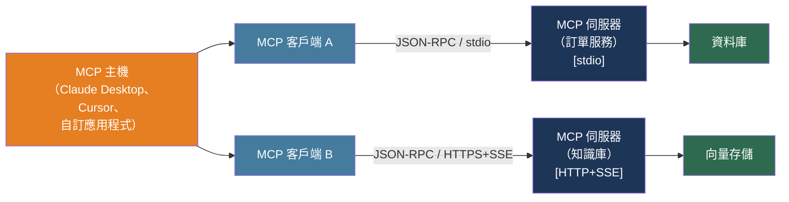

# [BEE-505] 模型上下文協定（MCP）

:::info
模型上下文協定是一個用於連接 AI 模型與外部工具和資料來源的開放標準——將 N×M 自訂整合問題（N 個模型 × M 個資料來源）替換為單一、可重用的伺服器-客戶端介面。
:::

## 背景

在 2024 年 11 月之前，將 LLM 應用程式連接到外部工具意味著為每個（模型、工具）配對撰寫自訂整合。一個使用三個模型和十個資料來源的應用程式可能需要多達三十個獨立的連接器——每個都使用不同的函式呼叫方言，每個都與一個提供商的 SDK 緊密耦合，每個都在所有需要相同功能的團隊中重複。

Anthropic 於 2024 年 11 月 25 日宣布了模型上下文協定（由 David Soria Parra 和 Justin Spahr-Summers 創建）。MCP 現在由 Linux 基金會作為供應商中立的開放標準管理。該協定已被 Claude Desktop、Claude Code、Cursor、Zed、VS Code Copilot 以及數十個其他 AI 工具採用。OpenAI 和 Google 都宣布支援 MCP。

該協定將整合面從 N×M 減少到 N+M：任何相容 MCP 的客戶端都可以發現並呼叫任何 MCP 伺服器，無需自訂膠合程式碼。企業工具團隊撰寫一個 MCP 伺服器；組織中的每個 AI 應用程式都可以立即使用它。

MCP 在結構上類似於語言伺服器協定（LSP），後者於 2016 年解決了 IDE 功能的相同組合問題。在 LSP 之前，每個 IDE 都需要每種語言的自訂外掛程式。LSP 之後，一次撰寫的語言伺服器可以在每個實作該協定的編輯器中執行。MCP 將相同的模式應用於 AI 工具整合。

## 協定架構

MCP 有三個角色：

**MCP 主機（Host）**：管理用戶會話的 AI 應用程式——Claude Desktop、Cursor、自訂應用程式。主機啟動或連接多個 MCP 伺服器，並協調 LLM 使用它們。

**MCP 客戶端（Client）**：主機內部的元件，維護與一個 MCP 伺服器的確切一個連接。連接了十個伺服器的主機執行十個客戶端。

**MCP 伺服器（Server）**：透過 MCP 協定公開工具、資源和提示的程式。伺服器可以是本地子進程（stdio 傳輸）或遠端服務（HTTP 傳輸）。

訊息格式是 JSON-RPC 2.0。訊息是請求（帶有 `id`，期望回應）、回應（攜帶先前請求的結果或錯誤）或通知（單向，不期望回應）。

```
客戶端                          伺服器
  |                               |
  |-- initialize（功能）--------->|
  |<-- initialized ---------------|
  |                               |
  |-- tools/list ---------------->|
  |<-- [工具定義] ----------------|
  |                               |
  |-- tools/call（name, args）--->|
  |<-- {content: [...]} ----------|
```

**傳輸選項**：

| 傳輸 | 使用時機 | 備注 |
|------|---------|------|
| **stdio** | 本地進程，同一台機器 | 伺服器作為子進程啟動；最快；無需網路配置 |
| **HTTP + SSE** | 遠端伺服器，多租戶 | 伺服器透過 SSE 串流回應；支援 OAuth 2.0 |

Stdio 是開發者工具和 Claude Desktop 的預設選擇。HTTP 是供多個主機或用戶存取的共享企業伺服器的正確選擇。

## MCP 原語

MCP 伺服器公開最多三種原語類型：

**工具（Tools）**——LLM 可以自主呼叫的函式。模型看到工具的名稱、描述和參數的 JSON Schema，並決定何時呼叫它。工具是模型控制的：LLM 發起呼叫。

**資源（Resources）**——由 URI 標識的只讀資料（例如，`file:///path/to/file`、`postgres://table/customers`）。資源是應用程式控制的：主機決定將哪些資源拉入上下文，而非模型。

**提示（Prompts）**——指導互動的可重用訊息範本。提示是用戶控制的：人類明確選擇提示工作流程。

大多數後端整合圍繞工具展開。資源和提示是補充性的。

## 最佳實踐

### 以最小範圍實作伺服器

**MUST（必須）** 只定義特定使用情境所需的工具。每個新增到 MCP 伺服器的工具都是額外的攻擊面：LLM 可以呼叫它知道的任何工具，而提示注入攻擊可以將範圍內的任何工具武器化。

**MUST（必須）** 為每個工具撰寫精確、準確的描述。LLM 讀取描述來決定是否以及何時呼叫工具。模糊的描述會導致不正確的呼叫；揭露敏感實作細節的描述是資訊洩露風險。

```python
from mcp.server.fastmcp import FastMCP

mcp = FastMCP("訂單服務")

@mcp.tool()
def get_order_status(order_id: str) -> dict:
    """
    返回訂單的當前狀態。

    Args:
        order_id: 訂單的 UUID（格式：xxxxxxxx-xxxx-xxxx-xxxx-xxxxxxxxxxxx）。

    返回包含鍵的字典：order_id、status、updated_at。
    狀態是以下之一：pending、processing、shipped、delivered、cancelled。
    """
    order = db.get_order(order_id)
    if order is None:
        return {"error": "order_not_found"}
    # 只返回 LLM 需要的欄位——而非完整的資料庫行
    return {"order_id": order.id, "status": order.status, "updated_at": order.updated_at.isoformat()}

if __name__ == "__main__":
    mcp.run(transport="stdio")
```

### 驗證並授權每個工具呼叫

**MUST（必須）驗證**所有工具參數再採取行動。LLM 根據其對 Schema 的理解構建工具參數——它可以幻覺出通過 JSON Schema 驗證但語義上錯誤的參數值（一個看起來像有效 UUID 但屬於不同用戶的 `order_id`）。

**MUST（必須）在工具執行層執行授權。** 由多用戶主機呼叫的 MCP 伺服器必須知道哪個用戶發起了請求，並驗證用戶是否有權存取所請求的資源。針對遠端 HTTP 伺服器，每個用戶發放的 OAuth 2.0 範圍或短期不記名令牌是標準機制。

**MUST NOT（不得）** 假設因為請求透過 MCP 到達就是已授權的。協定驗證客戶端，而非最終用戶。授權是伺服器的責任。

```python
@mcp.tool()
def cancel_order(order_id: str, user_token: str) -> dict:
    """取消訂單。需要已驗證用戶的會話令牌。"""
    user = auth.verify_token(user_token)            # 驗證身份
    order = db.get_order(order_id)
    if order is None or order.owner_id != user.id:  # 執行授權
        return {"error": "not_found_or_forbidden"}
    if order.status not in ("pending", "processing"):
        return {"error": "cannot_cancel", "current_status": order.status}
    db.cancel_order(order_id)
    return {"order_id": order_id, "status": "cancelled"}
```

### 將工具輸出視為不受信任的內容

**MUST（必須）清理或驗證**從外部來源透過 MCP 工具回饋給 LLM 的資料。如果工具獲取網頁、讀取文件或查詢外部 API 並逐字返回原始結果，控制該內容的攻擊者可以將指令注入 LLM 的上下文——這是一種由 MCP 伺服器介導的間接提示注入形式。

原則：MCP 伺服器是信任邊界。來自伺服器外部的資料在傳遞給模型之前必須視為不受信任，就像用戶輸入在傳遞給資料庫之前被驗證一樣。

**SHOULD（應該）** 從工具返回結構化、Schema 驗證的回應，而非原始字串。返回 `{"status": "shipped", "carrier": "FedEx"}` 的工具給模型乾淨的資料；返回整個原始 HTML 頁面的工具給模型一個注入載體。

### 稽核所有工具呼叫

**MUST（必須）記錄**每次工具呼叫：時間戳、用戶身份（如可用）、工具名稱、參數和結果。MCP 伺服器可以由多個 AI 客戶端呼叫；沒有集中稽核記錄，就無法了解 AI 系統在做什麼。

**SHOULD（應該）為每個工具呼叫發出 OpenTelemetry span。** 分散式追蹤將工具呼叫與上游 LLM 請求、用戶會話和任何下游操作聯繫起來，實現代理工作流程的端對端除錯。

### 保護遠端伺服器

**SHOULD（應該）對任何服務多個用戶或客戶端的 HTTP MCP 伺服器使用 OAuth 2.0。** MCP 規範包含授權碼流程、令牌範圍和受眾限制令牌的 OAuth 2.0 指南。

**SHOULD（應該）在 HTTP 傳輸層按客戶端或按用戶執行速率限制。** 循環中的 LLM 代理每分鐘可以生成數百個工具呼叫；速率限制可防止失控的代理耗盡下游資源。

**MUST（必須）對所有遠端 MCP 連接使用 TLS**（HTTPS）。MCP 訊息攜帶可能包含敏感資料的工具參數和結果；明文傳輸是不可接受的。

### 有意識地選擇 stdio 與 HTTP

在以下情況使用 **stdio**：
- MCP 伺服器與主機在同一台機器上執行（開發工具、Claude Desktop）
- 不需要多租戶
- 不希望有啟動延遲和網路配置

在以下情況使用 **HTTP**：
- 伺服器在多個主機或用戶之間共享
- 伺服器需要在雲端或不同的網路段執行
- 需要每用戶驗證和授權
- 您希望將伺服器作為具有獨立擴展能力的受管理服務執行

## 視覺化



一個主機執行多個客戶端——每個伺服器一個客戶端。伺服器是獨立的服務：它們可以在本地（stdio）或遠端（HTTP+SSE）部署，而不改變主機的整合邏輯。

## 與替代方案的比較

| | OpenAI 函式呼叫 | LangChain 工具 | MCP |
|--|----------------|----------------|-----|
| **標準** | 特定於提供商 | 特定於框架 | 開放協定（Linux 基金會） |
| **工具發現** | 靜態（建構時定義） | 靜態 | 動態（透過 `tools/list` 在執行時發現） |
| **模型可攜性** | 僅限 OpenAI | LangChain 生態系 | 任何相容 MCP 的主機 |
| **部署** | 在應用程式程式碼內 | 在應用程式程式碼內 | 獨立的伺服器進程 |
| **多用戶驗證** | 應用程式責任 | 應用程式責任 | 協定中指定了 OAuth 2.0 |
| **類比** | 資料庫驅動程式 | ORM | ODBC |

MCP 的關鍵架構差異在於工具定義存在於應用程式之外。部署新工具意味著啟動新的 MCP 伺服器——無需應用程式重新部署，無需 SDK 升級。

## 相關 BEE

- [BEE-503](503.md) -- LLM API 整合模式：MCP 伺服器透過 LLM 的工具使用機制呼叫；相同的令牌管理、重試和可觀測性模式適用
- [BEE-504](504.md) -- AI 代理架構模式：使用 MCP 伺服器的代理仍必須應用步驟限制、循環偵測和工具授權——MCP 是傳輸層，而非安全層
- [BEE-467](467.md) -- 服務對服務驗證：遠端 MCP 伺服器需要已驗證的連接；用於服務對服務驗證的相同不記名令牌和 OAuth 2.0 模式適用
- [BEE-75](75.md) -- API 錯誤處理和問題詳情：MCP 工具錯誤回應遵循結構化格式；伺服器應返回機器可讀的錯誤代碼，而非原始異常訊息

## 參考資料

- [Anthropic. Introducing the Model Context Protocol — anthropic.com, November 2024](https://www.anthropic.com/news/model-context-protocol)
- [Model Context Protocol. Official Specification — modelcontextprotocol.io](https://modelcontextprotocol.io/specification/2025-11-25)
- [Model Context Protocol. Architecture Overview — modelcontextprotocol.io](https://modelcontextprotocol.io/docs/learn/architecture)
- [Model Context Protocol. Python SDK — github.com/modelcontextprotocol/python-sdk](https://github.com/modelcontextprotocol/python-sdk)
- [Model Context Protocol. TypeScript SDK — github.com/modelcontextprotocol/typescript-sdk](https://github.com/modelcontextprotocol/typescript-sdk)
- [OWASP. MCP Top 10 — owasp.org](https://owasp.org/www-project-mcp-top-10/)
- [OWASP. A Practical Guide for Secure MCP Server Development — genai.owasp.org](https://genai.owasp.org/resource/a-practical-guide-for-secure-mcp-server-development/)
- [OWASP. MCP Security Cheat Sheet — cheatsheetseries.owasp.org](https://cheatsheetseries.owasp.org/cheatsheets/MCP_Security_Cheat_Sheet.html)
- [Model Context Protocol. Security Best Practices — modelcontextprotocol.io](https://modelcontextprotocol.io/docs/tutorials/security/security_best_practices)
- [Model Context Protocol. Official Server Registry — registry.modelcontextprotocol.io](https://registry.modelcontextprotocol.io/)
