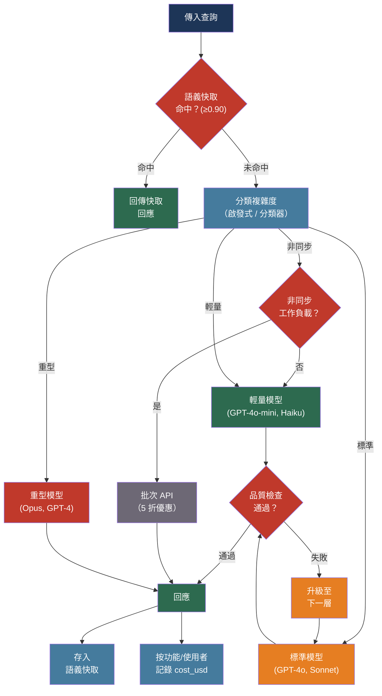

# [BEE-513] AI 成本優化與模型路由

:::info
LLM API 費用隨 Token 量增長而擴大，輸出 Token 的費用是輸入 Token 的 4–5 倍，且大多數查詢並不需要最強大的模型 —— 路由、快取與批次處理合在一起，可在不明顯損失品質的前提下將費用降低 50–98%。
:::

## 背景

Token 定價的不對稱性往往讓第一次接觸的工程師感到意外。輸入 Token 便宜，因為在 prefill 階段它們能在 GPU 核心間高效平行處理。輸出 Token 昂貴，因為生成是循序的：每個 Token 依賴所有前序 Token，無法平行化。大多數供應商的實際比例約為 4–5 倍。對於每次輸入產生兩個輸出 Token 的聊天機器人，每筆請求的實際費用並非廣告所示的輸入定價，而是考量輸出倍數後約九倍的費用。

在大規模場景下，這個不對稱性舉足輕重。一個每天處理一百萬筆請求、每筆 2,000 個 Token 的聊天機器人，每天產生二十億個 Token。為該工作負載選擇費用低十倍的模型，每年可節省數十萬美元。但模型費用與能力正相關，將所有查詢都路由到最便宜的模型，會讓需要更強模型的查詢品質下降。

研究證明路由可以彌合這個差距：Chen et al. 的 FrugalGPT（arXiv:2305.05176，2023）證明 LLM 串聯策略 —— 先嘗試較便宜的模型，必要時才升級到昂貴模型 —— 可以在費用降低最多 98% 的情況下，達到與 GPT-4 相當的效能。LMSYS 的 RouteLLM（arXiv:2406.18665，2024）則顯示，以人類偏好資料訓練的輕量路由器，在 MT Bench 上能將 GPT-4 等級的 API 呼叫減少 85%，同時維持品質。

實務意涵是：「用哪個模型？」不是在上線時做一次的部署決策，而是依據查詢特性、品質需求與費用預算，為每筆請求動態決定的路由決策。

## 設計思維

三個槓桿可降低 LLM 費用，且可組合使用：

**模型路由**（最高槓桿）：將查詢路由到與其難度相符的模型。一個只需 200 個 Token 的分類任務不需要 GPT-4o。一個跨長文件的多步推理任務可能需要。正確路由可在最便宜模型的平均費用下，達到最強模型的品質。

**請求優化**（中等槓桿）：透過快取、Prompt 壓縮與批次處理減少每筆請求的 Token 數。這些技術獨立於模型選擇運作，並疊加在路由節省之上。

**基礎設施**（門檻槓桿）：自架開源模型完全消除每 Token 費用，代價是固定的運算成本。只有當請求量持續高到足以攤銷基礎設施投資時，才適合這個選擇。

決策順序：先窮盡路由與請求優化，因為它們不需要基礎設施承諾。只有在月度 API 費用大到損益兩平分析傾向自架時，才評估自架（通常在 API 費用超過每月 5,000–10,000 美元以上）。

## 最佳實踐

### 將請求路由到適合的模型

**SHOULD**（應該）實作路由層，根據查詢複雜度的估計，將請求分派到不同模型。FrugalGPT 串聯模式 —— 先嘗試能處理該查詢類別的最便宜模型，若回應未通過品質檢查則升級 —— 是最實用的生產起點。

三層模型階層可涵蓋大多數工作負載：

| 層級 | 模型範例 | 費用範圍 | 適用場景 |
|------|---------|---------|---------|
| 輕量 | GPT-4o-mini、Claude Haiku、Gemini Flash | $0.15–1.00 / M 輸入 Token | 分類、擷取、短問答、摘要 |
| 標準 | GPT-4o、Claude Sonnet、Gemini Pro | $1.25–3.00 / M 輸入 Token | 一般生成、RAG 回應、程式碼輔助 |
| 重型 | Claude Opus、GPT-4 | $5.00+ / M 輸入 Token | 複雜多步推理、長文合成、大型程式碼庫的程式碼生成 |

**SHOULD** 建立一個在路由前估計查詢複雜度的分類器。對大多數應用而言，基於規則的分類器已足夠，且不需要額外的 API 呼叫：

```python
def classify_query(query: str, context_tokens: int) -> str:
    # 短事實性查詢 → 輕量模型
    if len(query.split()) < 20 and context_tokens < 500:
        return "light"
    # 帶有多步推理信號的查詢 → 重型模型
    reasoning_signals = ["explain why", "compare", "design", "analyze", "implement"]
    if any(s in query.lower() for s in reasoning_signals) or context_tokens > 10_000:
        return "heavy"
    return "standard"

def route(query: str, context: str, client) -> str:
    tier = classify_query(query, count_tokens(context))
    models = {"light": "gpt-4o-mini", "standard": "gpt-4o", "heavy": "claude-opus-4-6"}
    return client.complete(model=models[tier], query=query, context=context)
```

**SHOULD** 透過對抽樣流量比較路由模型輸出與參考重型模型，驗證分類器的準確性。可接受的退化閾值視使用情境而定；對事實擷取而言，1–2% 的準確率差異通常可接受。

**MAY**（可以）在有偏好資料時使用 RouteLLM 訓練路由器。RouteLLM 以人類偏好比較訓練二元路由器，預測何時需要強模型，在 MT Bench 基準上達到 85% 的費用降低。其路由器無需重新訓練即可在不同模型對之間遷移。

**SHOULD** 使用 LiteLLM 進行多供應商模型管理。它統一了 OpenAI、Anthropic、Google 及自架模型的 API 介面，並實作備援順序，使得當某模型回傳速率限制錯誤或超過上下文視窗時，下一個設定的模型會自動接手：

```python
import litellm

response = litellm.completion(
    model="gpt-4o-mini",
    messages=messages,
    fallbacks=["gpt-4o", "claude-sonnet-4-6"],  # 失敗時升級
    context_window_fallbacks=[
        {"gpt-4o-mini": ["gpt-4o"]},  # gpt-4o-mini 視窗較小
    ],
)
```

### 對語義相似查詢進行快取

對於使用者常問類似問題的應用 —— 客服、文件問答、內部知識庫 —— 許多 API 呼叫是重複的。「如何重設密碼？」和「重設密碼的步驟是什麼？」應該回傳相同的答案。語義快取利用了這一點：對傳入查詢進行嵌入，與已快取的查詢嵌入比較，當相似度超過閾值時回傳快取的回應。

**SHOULD** 對任何查詢分布集中在常見主題的應用實作語義快取。對具有穩定知識庫的客戶服務助理而言，30–70% 的快取命中率相當典型。

**SHOULD** 使用 GPTCache 或同等的語義快取，相似度閾值設在 0.88 到 0.95 之間：

```python
from gptcache import cache
from gptcache.adapter.openai import openai

# 以嵌入模型和相似度閾值初始化快取
cache.init(
    embedding_func=text_embedding_3_small,
    similarity_threshold=0.90,  # 若餘弦相似度 ≥ 0.90 則回傳快取回應
)

# 所有透過快取客戶端的呼叫會自動被攔截
response = openai.ChatCompletion.create(
    model="gpt-4o",
    messages=messages,
)
```

**MUST NOT**（不得）快取正確性依賴時間（當前價格、即時狀態、今日新聞）或用戶特定狀態（帳戶餘額、訂單歷史）的查詢回應。對這些查詢類別將 TTL 設為零。

**SHOULD** 監控快取命中率及快取回應的品質。0.90 的相似度閾值有時會回傳相對新查詢而言準確但不完整的快取命中。定期抽樣快取命中並評分其相關性。

### 對非同步工作負載使用批次 API

OpenAI 和 Anthropic 都提供批次處理 API，對能容忍 24 小時延遲的工作負載，以同步定價的 50% 計費。對非互動應用而言，這是最便宜的高量 LLM 處理路徑。

**SHOULD** 對以下情境使用批次處理：文件分類管線、每晚報告生成、大量資料擷取、評估資料集評分，以及任何其他回應時間不面向使用者的離線工作流程。

```python
# OpenAI Batch API：每批次最多提交 50,000 筆請求
import json
from openai import OpenAI

client = OpenAI()

# 建立批次檔案（JSONL 格式）
requests = [
    {
        "custom_id": f"doc-{i}",
        "method": "POST",
        "url": "/v1/chat/completions",
        "body": {
            "model": "gpt-4o-mini",
            "messages": [{"role": "user", "content": f"Classify: {doc}"}],
        },
    }
    for i, doc in enumerate(documents)
]

batch_file = client.files.create(
    file=("\n".join(json.dumps(r) for r in requests)).encode(),
    purpose="batch",
)
batch = client.batches.create(
    input_file_id=batch_file.id,
    endpoint="/v1/chat/completions",
    completion_window="24h",
)
# batch.id 用於輪詢完成狀態
```

**MUST NOT** 對面向使用者的請求使用批次 API。24 小時的完成時限是軟性目標；實際吞吐量隨平台負載而變。

### 控制輸出 Token 數量

輸出 Token 的費用是輸入 Token 的 4–5 倍。對需要生成長文的應用而言，未受控制的輸出長度是主要費用驅動因素。

**MUST** 在每次 API 呼叫中設定 `max_tokens`。省略此參數允許模型為任何請求生成最多輸出長度（通常 4K–16K Token），包括只需要一句話的簡單請求。

**SHOULD** 在使用情境不需要長回應時，明確指示模型產生簡潔輸出：「請用一段話以內回答。」「只回答最相關的單一值，不需要解釋。」輸出指令比單獨使用 `max_tokens` 更可靠地減少 Token 生成，因為它引導模型遠離填充內容。

**SHOULD** 對擷取和分類任務偏好結構化輸出（帶特定欄位的 JSON）而非散文。JSON 回應 `{"category": "billing", "confidence": 0.94}` 只需 8 個 Token。等效的散文回應「Based on the content, this appears to be a billing inquiry with high confidence」需要 18 個 Token —— 超過兩倍，且沒有額外資訊。

**SHOULD** 使用停止序列在自然邊界終止生成，而非讓模型自行決定何時結束。對結構化輸出，閉合括號 `}` 即已足夠。對散文，雙換行 `\n\n` 可防止對簡單問題產生多段落回應。

### 對高流量端點壓縮 Prompt

對以大型系統 Prompt 或大量上下文注入、高頻率呼叫的端點，Prompt 壓縮可直接降低輸入 Token 費用。在每月一千萬次請求的規模下，將平均 Prompt 大小減少 30% 即可按比例節省 API 費用。

**SHOULD** 使用 LLMLingua-2（arXiv:2403.12968）壓縮大型系統 Prompt 和背景文件：

```python
from llmlingua import PromptCompressor

compressor = PromptCompressor(
    model_name="microsoft/llmlingua-2-bert-base-multilingual-cased-meetingbank",
    use_llmlingua2=True,
)

# 壓縮背景上下文；保持指令和查詢的完整性
compressed_context = compressor.compress_prompt(
    background_document,
    rate=0.5,  # 目標 50% Token 減少
    force_tokens=["IMPORTANT", "WARNING", "\n"],  # 始終保留這些
)
```

**MUST NOT** 壓縮使用者的查詢或最近的對話輪次。壓縮會引入資訊損失，這在背景材料中可接受，但在主要任務描述中不可接受。

**MAY** 使用 DSPy（Stanford NLP，dspy.ai）進行系統性 Prompt 優化。DSPy 的優化器能自動找到在保留任務效能的前提下，在留存評估集上維持準確率的簡潔 Prompt 表述，降低 Prompt Token 數。

### 設定費用預算並按功能監控支出

**MUST** 從生產第一天起就將 API 費用歸因到業務維度 —— 功能、使用者、租戶、實驗。未被歸因的費用沒有負責人，會靜默地增長，直到出現在雲端帳單上。

**SHOULD** 為每筆請求計算並記錄 `cost_usd` 作為指標（詳見 BEE-511）。按 `feature` 彙總以識別應用的哪些部分驅動支出；按 `user_id` 彙總以偵測每用戶異常。

**SHOULD** 設定軟性預算警報和硬性限制：
- 當某功能的每日費用超過基準的 2 倍時發送警報
- 在供應商儀表板層級設定每日支出硬性限制（OpenAI、Anthropic 都支援）
- 對多租戶 SaaS，在 LLM 呼叫前於中介軟體中強制執行每租戶的 Token 配額

**SHOULD** 每月審視模型配置。隨著更便宜的模型改進，目前路由到標準層的查詢，在輕量層上可能也有可接受的效能。在每次重大模型發布後，對路由分類器執行品質基準測試，找出降級機會。

## 比較表

目前定價供參考（預算前請至供應商處確認；價格會變動）：

| 模型 | 輸入 $/M | 輸出 $/M | 上下文 | 最適用於 |
|------|---------|---------|------|---------|
| GPT-4o-mini | $0.15 | $0.60 | 128K | 分類、擷取、短問答 |
| GPT-4o | $2.50 | $10.00 | 128K | 一般生成、程式碼、多模態 |
| Claude Haiku | ~$1.00 | ~$5.00 | 200K | 快速路由、簡單任務 |
| Claude Sonnet | $3.00 | $15.00 | 200K | 生產生成、RAG |
| Claude Opus | $5.00 | $25.00 | 200K | 複雜推理 |
| Gemini 2.5 Flash | $0.30 | $2.50 | 1M | 長上下文、費用敏感 |
| Gemini 2.5 Pro | $1.25 | $10.00 | 200K | 中等費用下的強推理 |
| 批次 API（任意） | 5 折 | 5 折 | — | 非同步離線工作負載 |

## 視覺圖



## 相關 BEE

- [BEE-503](503.md) -- LLM API 整合模式：串流、指數退避重試，以及費用優化所建立在其上的供應商客戶端設定
- [BEE-511](511.md) -- LLM 可觀測性與監控：按功能/使用者/租戶的費用歸因與 `cost_usd` 指標，是判斷首先應用哪種優化的先決條件
- [BEE-512](512.md) -- LLM 上下文視窗管理：Prompt 壓縮與上下文修剪減少輸入 Token 數，直接降低高頻端點的費用
- [BEE-509](509.md) -- RAG 管線架構：查詢層級的語義快取和檢索層級的嵌入快取，都是 RAG 系統中的費用槓桿
- [BEE-200](../Caching/200.md) -- 快取基礎：語義快取是應用層快取的一個變體；驅逐策略、TTL 和失效模式在此同樣適用

## 參考資料

- [Lingjiao Chen et al. FrugalGPT: How to Use Large Language Models While Reducing Cost and Improving Performance — arXiv:2305.05176, 2023](https://arxiv.org/abs/2305.05176)
- [Wei-Lin Chiang et al. RouteLLM: Learning to Route LLMs with Preference Data — arXiv:2406.18665, LMSYS 2024](https://arxiv.org/abs/2406.18665)
- [LMSYS. RouteLLM blog post and GitHub — lm-sys/RouteLLM](https://github.com/lm-sys/RouteLLM)
- [Huiqiang Jiang et al. LLMLingua-2: Data Distillation for Efficient and Faithful Task-Agnostic Prompt Compression — arXiv:2403.12968, ACL 2024](https://arxiv.org/abs/2403.12968)
- [Omar Khattab et al. DSPy: Compiling Declarative Language Model Calls into State-of-the-Art Pipelines — Stanford NLP — dspy.ai](https://dspy.ai/)
- [Zilliz. GPTCache: Semantic Cache for LLMs — github.com/zilliztech/GPTCache](https://github.com/zilliztech/GPTCache)
- [BerriAI. LiteLLM: Call 100+ LLMs with unified API — docs.litellm.ai](https://docs.litellm.ai/docs/routing-load-balancing)
- [OpenAI. Batch API — developers.openai.com](https://developers.openai.com/api/docs/guides/batch)
- [Anthropic. Message Batches API — platform.claude.com](https://platform.claude.com/docs/en/build-with-claude/batch-processing)
- [LMSYS. Chatbot Arena Leaderboard — lmarena.ai](https://lmarena.ai)
