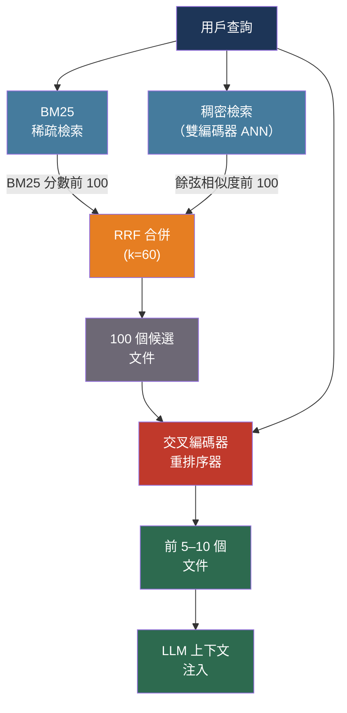

# [BEE-517] 檢索重排序與混合搜尋

:::info
單階段稠密檢索會錯過精確的關鍵字匹配；BM25 會錯過改寫後的查詢；在兩階段管線中結合兩者（使用 Reciprocal Rank Fusion）並搭配交叉編碼器重排序器，相比單一方法通常能減少 30–50% 的檢索失敗。
:::

## 背景

標準 RAG 檢索流程 —— 嵌入查詢、找 k 個最近向量、注入上下文 —— 在精確率上仍有大幅提升空間。BEIR 基準（Thakur et al.，arXiv:2104.08663，NeurIPS 2021）在 18 個多元資料集上的零樣本評估清楚揭示了這一點：稠密檢索器在關鍵字密集的查詢上失敗，而 BM25 在詞彙不同但意思相同的改寫查詢上失敗。兩種方法都無法在所有領域獨占鰲頭。

BM25（Robertson 和 Zaragoza，"The Probabilistic Relevance Framework: BM25 and Beyond"，2009）是一個概率排名函數，按查詢詞出現的頻率對文件評分，並以這些詞在語料庫中的稀有程度加權。儘管是前神經網路時代的演算法，BM25 在精確術語很重要的領域仍是強大基準 —— 法律文字、醫學文獻、程式碼搜尋、帶有精確識別符的產品目錄。相較之下，稠密檢索將語義嵌入連續空間，即使文件與查詢沒有共同用詞，也能檢索到概念相關的文件。

混合檢索融合了兩種信號。Reciprocal Rank Fusion（RRF，Cormack、Clarke、Buettcher，SIGIR 2009）是標準的合併演算法：它以每個文件在所有檢索器中的倒數排名之和來評分，使用平滑常數 k=60。這種基於排名的聚合對 BM25 和嵌入相似度的不相容分數尺度具有魯棒性 —— BM25 分數是基於詞頻的整數，而餘弦相似度是 0 到 1 之間的浮點數。

兩階段管線 —— 先檢索廣泛的候選集，再用更準確但更慢的模型重排序 —— 彌合了剩餘的差距。交叉編碼器重排序器通過完整的 Transformer 注意力機制，同時編碼查詢和每個候選文件，使模型能夠直接比較查詢 Token 和文件 Token。這對於在數百萬文件上進行第一階段檢索來說太慢，但應用於 50–200 個候選者時是可行的。

## 設計思維

檢索品質有三個槓桿，在不同的延遲和費用點上運作：

**第一階段召回率**：最大化候選集中相關文件的數量。混合檢索（稠密 + BM25 + RRF）在 BEIR 上持續優於任一單一方法，在域外設置中改進最為顯著。

**重排序精確率**：從候選集中選出最與特定查詢相關的文件。交叉編碼器是最準確的工具；ColBERT 是雙編碼器速度和交叉編碼器精確率之間的中間地帶。

**候選集大小的權衡**：檢索更多候選者（k=200 vs. k=50）為重排序器提供更多選擇，但重排序延遲線性增加。實際甜蜜點是 CPU 上 k=100 個候選者，GPU 上容忍延遲的工作負載為 k=200。

## 最佳實踐

### 建立混合第一階段檢索

**SHOULD**（應該）並行執行稀疏（BM25）和稠密（雙編碼器）檢索，並用 RRF 合併結果。兩種方法在互補的查詢類別上失敗；混合檢索對兩種失敗模式都提供了對沖：

```python
from rank_bm25 import BM25Okapi
import numpy as np

def rrf_merge(rankings: list[list[str]], k: int = 60) -> list[tuple[str, float]]:
    """
    Reciprocal Rank Fusion：跨多個排名列表對每個文件評分。
    k=60 是 Cormack et al. 2009 的實證預設值。
    """
    scores: dict[str, float] = {}
    for ranked_list in rankings:
        for rank, doc_id in enumerate(ranked_list, start=1):
            scores[doc_id] = scores.get(doc_id, 0.0) + 1.0 / (k + rank)
    return sorted(scores.items(), key=lambda x: x[1], reverse=True)

def hybrid_retrieve(query: str, bm25_index, vector_index, embed_fn,
                    top_k: int = 100) -> list[str]:
    # BM25：Token 重疊
    tokens = query.lower().split()
    bm25_scores = bm25_index.get_scores(tokens)
    bm25_top = [str(i) for i in np.argsort(bm25_scores)[::-1][:top_k]]

    # 稠密：語義相似度
    q_vec = embed_fn(query)
    dense_top = vector_index.search(q_vec, top_k)  # 回傳文件 ID

    # RRF 合併
    merged = rrf_merge([bm25_top, dense_top], k=60)
    return [doc_id for doc_id, _ in merged[:top_k]]
```

**SHOULD** 在混合階段至少檢索 k=100 個候選者。重排序器需要足夠大的候選集才能找出最佳文件；用混合檢索只取 10–20 個候選者再重排序，失去了這樣做的意義。

**MAY**（可以）為 BM25 表現持續差於 RRF 合併的領域，將第三個 SPLADE 檢索器加入合併。SPLADE（arXiv:2107.05720）使用神經模型用語義相關術語擴展查詢和文件，然後使用標準倒排索引 —— 它為 BM25 會錯過的近義詞增加召回率，同時保留詞彙匹配精確率。

### 應用交叉編碼器重排序器進行最終排序

**MUST**（必須）對任何檢索品質直接影響答案品質的 RAG 應用，在混合檢索後應用重排序器。交叉編碼器同時看到完整的查詢和文件，產生比餘弦相似度準確得多的相關性分數：

```python
from sentence_transformers import CrossEncoder

# 輕量級生產重排序器（80MB，在 CPU 上速度快）
reranker = CrossEncoder("cross-encoder/ms-marco-MiniLM-L6-v2")

def rerank(query: str, candidate_docs: list[dict], top_n: int = 10) -> list[dict]:
    pairs = [(query, doc["text"]) for doc in candidate_docs]
    scores = reranker.predict(pairs)  # 每對一次前向傳遞
    ranked = sorted(zip(candidate_docs, scores), key=lambda x: x[1], reverse=True)
    return [doc for doc, _ in ranked[:top_n]]
```

**SHOULD** 根據部署限制選擇重排序器：

| 重排序器 | 類型 | 最適用於 |
|---------|-----|---------|
| Cohere Rerank v3.5 | API | 託管；無需 GPU；多語言 |
| BAAI/bge-reranker-v2-m3 | 自架 | 開源；多語言；競爭性品質 |
| cross-encoder/ms-marco-MiniLM-L6-v2 | 自架 | CPU 快速推論；英文；低記憶體 |
| Jina Reranker v2 | API + 自架 | 100+ 語言；支援函式呼叫 |

**SHOULD** 將前 5–10 個文件重排序後注入 LLM 上下文視窗。注入超過 10 個檢索到的塊，會因 BEE-512 中描述的 U 形召回曲線而降低 LLM 效能。

**MAY** 在投資自架基礎設施之前，透過 API 使用 Cohere Rerank 進行快速原型驗證。API 增加一次網路往返（約 50–100ms），但不需要 GPU：

```python
import cohere

co = cohere.Client(api_key=COHERE_API_KEY)

def cohere_rerank(query: str, docs: list[str], top_n: int = 5) -> list[dict]:
    response = co.rerank(
        model="rerank-v3.5",
        query=query,
        documents=docs,
        top_n=top_n,
    )
    return [
        {"index": r.index, "score": r.relevance_score, "text": docs[r.index]}
        for r in response.results
    ]
```

### 考慮 ColBERT 用於高吞吐量或領域轉移

**MAY** 在需要比雙編碼器更好的精確率，但又沒有交叉編碼器延遲的情況下，使用 ColBERT（arXiv:2112.01488）作為單階段檢索器。ColBERT 為每個文件的每個 Token 存儲一個向量，並在查詢時計算 MaxSim —— 對每個查詢 Token，找出與任何文件 Token 的最高相似度：

```
score(Q, D) = Σ_qi max_dj sim(qi_vec, dj_vec)
```

這種後期交互捕捉了細粒度的 Token 層級匹配，相比雙編碼器在新領域的泛化能力顯著更好。RAGatouille 提供了實用的生產介面：

```python
from ragatouille import RAGPretrainedModel

RAG = RAGPretrainedModel.from_pretrained("colbert-ir/colbertv2.0")
RAG.index(collection=documents, index_name="my-index")

results = RAG.search(query="微服務的熔斷器模式", k=10)
# 回傳帶有後期交互相關性分數的前 10 個塊
```

**SHOULD** 在以下情況考慮 ColBERT：在數據稀少的領域，雙編碼器微調不可行；處理頻繁的領域轉移；或者候選池太大無法使用交叉編碼器重排序，但雙編碼器精確率又不足時。

### 設置兩階段管線

標準生產管線整合所有三個元件，並設有明確的延遲預算：

```python
class TwoStageRetriever:
    def __init__(self, bm25_index, vector_index, embed_fn, reranker):
        self.bm25 = bm25_index
        self.vectors = vector_index
        self.embed = embed_fn
        self.reranker = reranker

    def retrieve(self, query: str, final_k: int = 5) -> list[dict]:
        # 第一階段：廣泛候選檢索（約 50–150ms）
        candidates = hybrid_retrieve(
            query, self.bm25, self.vectors, self.embed,
            top_k=100,   # 檢索 100 個，重排序到 final_k
        )
        candidate_docs = self.load_docs(candidates)

        # 第二階段：精確重排序（100 個候選者約 50–200ms）
        return rerank(query, candidate_docs, top_n=final_k)
```

**SHOULD** 為面向用戶的應用分配如下的檢索延遲預算：

| 階段 | 目標延遲 | 超出時的處置 |
|-----|---------|-----------|
| 混合檢索（ANN + BM25） | < 100ms | 減少候選 k；使用近似 BM25 |
| RRF 合併 | < 5ms | 已可忽略不計 |
| 重排序器（100 個候選者） | < 150ms | 切換到較輕的重排序器；減少候選 k |
| 檢索總計 | < 250ms | 為重排序器增加 GPU；使用 Cohere API |

**SHOULD** 監控檢索品質，而不僅僅是延遲。在留存的查詢基準上追蹤 Mean Reciprocal Rank（MRR@5）和 NDCG@10。檢索品質直接決定下游答案品質的上限；快速但返回錯誤文件的檢索器，會產生帶有自信的錯誤答案。

### 謹慎選擇候選集大小

**SHOULD** 根據預期的 k 召回率校準第一階段候選數量：

```python
# 衡量 recall@k：相關文件有多少比例出現在前 k 個候選中？
def recall_at_k(query_benchmark: list[dict], retriever, k: int) -> float:
    hits = 0
    for item in query_benchmark:
        candidates = retriever.retrieve(item["query"], top_k=k)
        if item["relevant_doc_id"] in candidates:
            hits += 1
    return hits / len(query_benchmark)

# 對 k in [10, 25, 50, 100, 200] 執行，找出曲線的膝點
```

典型的召回曲線初始斜率陡峭，然後進入邊際遞減的平台期。如果 recall@50 = 0.82，而 recall@100 = 0.86，那麼額外的 50 個候選者只帶來 4 個百分點的召回率提升，但重排序費用增加 2 倍。根據此測量值調整 k，而非猜測。

## 視覺圖



## 相關 BEE

- [BEE-509](509.md) -- RAG 管線架構：此處描述的兩階段檢索管線是 RAG 系統的生產級檢索元件
- [BEE-516](516.md) -- 嵌入模型與向量表示：雙編碼器嵌入模型驅動稠密檢索階段；模型選擇和量化決策直接適用
- [BEE-383](../Search/383.md) -- 向量搜尋與語義搜尋：ANN 索引結構（HNSW、IVF）和近似搜尋是稠密檢索階段的底層機制
- [BEE-512](512.md) -- LLM 上下文視窗管理：重排序器的前 k 輸出必須符合分配的 RAG 上下文預算

## 參考資料

- [Nandan Thakur et al. BEIR: A Heterogeneous Benchmark for Zero-shot Evaluation of Information Retrieval Models — arXiv:2104.08663, NeurIPS 2021](https://arxiv.org/abs/2104.08663)
- [Gordon V. Cormack, Charles L.A. Clarke, Stefan Buettcher. Reciprocal Rank Fusion Outperforms Condorcet and Individual Rank Learning Methods — SIGIR 2009](https://dl.acm.org/doi/10.1145/1571941.1572114)
- [Omar Khattab, Matei Zaharia. ColBERTv2: Effective and Efficient Retrieval via Lightweight Late Interaction — arXiv:2112.01488, ACL 2022](https://arxiv.org/abs/2112.01488)
- [Thibault Formal et al. SPLADE: Sparse Lexical and Expansion Model for First Stage Ranking — arXiv:2107.05720, SIGIR 2021](https://arxiv.org/abs/2107.05720)
- [Stephen Robertson, Hugo Zaragoza. The Probabilistic Relevance Framework: BM25 and Beyond — Foundations and Trends in Information Retrieval, Vol. 3, No. 4, 2009](https://dl.acm.org/doi/abs/10.1561/1500000019)
- [Cohere. Rerank Documentation — docs.cohere.com](https://docs.cohere.com/docs/rerank)
- [BAAI. bge-reranker-v2-m3 Model Card — huggingface.co/BAAI/bge-reranker-v2-m3](https://huggingface.co/BAAI/bge-reranker-v2-m3)
- [Sentence Transformers. Cross-Encoders — sbert.net](https://sbert.net/docs/cross_encoder/pretrained_models.html)
- [RAGatouille. ColBERT for RAG — github.com/AnswerDotAI/RAGatouille](https://github.com/AnswerDotAI/RAGatouille)
- [Pinecone. Rerankers and Two-Stage Retrieval — pinecone.io/learn](https://www.pinecone.io/learn/series/rag/rerankers/)
