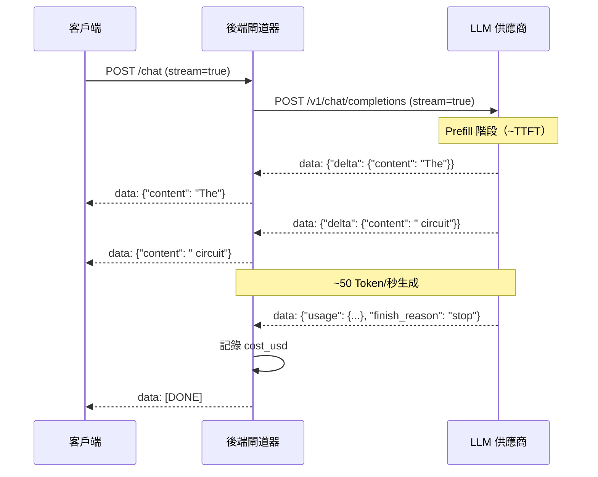

# [BEE-518] LLM 串流模式

:::info
LLM 串流在幾百毫秒內就能將第一個 Token 傳遞給使用者，而不需等待幾秒鐘才取得完整回應，從根本上改變了 AI 功能的感知回應速度 —— 但同時引入了批次完成所沒有的架構問題：SSE 傳輸、背壓、串流中途的錯誤處理，以及 Token 計數。
:::

## 背景

非串流的 LLM 呼叫會封鎖 HTTP 連線，直到模型完成整個回應的生成。以 50 Token/秒的速度生成 500 個 Token 的回應，使用者需要等待 10 秒才能看到任何內容。串流改變了這個合約：伺服器在 Token 生成時就開始逐一發送，使用者在提交請求的幾百毫秒內就能看到文字出現在螢幕上。

這不僅僅是原始延遲的問題。人類對電腦系統回應的感知研究區分了三個區域：100ms 以下感覺即時，100ms–1s 感覺像自然的系統回應，超過 1 秒則需要明確的進度反饋。串流將可感知的等待，從總生成時間（通常 3–30 秒）轉移到首 Token 時間（TTFT，在設定良好的推論端點上通常為 100–500ms）。這是使用者能感受到的指標。

傳輸機制是 Server-Sent Events（SSE），定義於 WHATWG HTML Living Standard（§9.2）。SSE 是一種單向 HTTP 通道，發送 `text/event-stream` 資料：伺服器寫入以 `data:` 為前綴並以 `\n\n` 分隔的行，客戶端作為串流讀取它們。OpenAI 和 Anthropic 都透過 SSE 實作串流 API，以獨立事件的形式發送 JSON 編碼的 Token 增量，並以 `data: [DONE]` 哨兵結束。HTTP 層使用分塊傳輸編碼（RFC 7230 §4.1），在不知道 Content-Length 的情況下發送可變長度的塊。

## 設計思維

串流引入了批次完成所沒有的兩個架構維度：

**傳輸可見性**：應用程式必須決定串流在哪裡開始和結束。如果後端同步呼叫 LLM 然後串流給客戶端，後端在客戶端看到任何內容之前承擔了完整的 TTFT 成本。如果後端直接將 LLM 的 SSE 串流代理給客戶端，客戶端在 LLM 生成第一個 Token 時就能看到 —— 但後端必須為每個進行中的請求處理一個長連線。

**部分狀態管理**：對於批次完成，回應完整到達，解析很直觀。對於串流，應用程式接收並必須處理不完整的資料：部分文字、不完整的 JSON 工具呼叫參數，以及只在最後一個塊中出現的使用量中繼資料。每個接觸串流的元件都必須明確處理部分狀態。

## 最佳實踐

### 設定 `stream=True` 並逐步消耗增量

**MUST**（必須）為任何生成時間超過一秒的面向使用者 LLM 功能啟用串流。長生成的批次完成會產生「等待轉儲」的使用者體驗，而串流消除了這一點。

**SHOULD**（應該）在 Token 增量到達時逐步累積成完整的回應字串，而不是收集塊後再合併：

```python
from openai import AsyncOpenAI

client = AsyncOpenAI()

async def stream_response(messages: list[dict]) -> str:
    full_text = ""
    async with client.chat.completions.stream(
        model="gpt-4o",
        messages=messages,
        stream_options={"include_usage": True},  # 最後一個塊中的使用量
    ) as stream:
        async for event in stream:
            if event.type == "content.delta":
                delta = event.delta          # 字串片段，可能為空
                full_text += delta
                yield delta                  # 立即發送給客戶端
            elif event.type == "chunk":
                if event.chunk.usage:        # 帶有 Token 計數的最後塊
                    log_cost(event.chunk.usage.total_tokens)
    return full_text
```

**SHOULD** 在最後的串流塊中請求使用量統計。OpenAI 需要 `stream_options={"include_usage": True}`；Anthropic 在 `message_delta` 事件中自動包含使用量：

```python
# Anthropic：事件類型更細粒度
import anthropic

client = anthropic.AsyncAnthropic()

async def stream_anthropic(messages: list[dict]):
    async with client.messages.stream(
        model="claude-sonnet-4-6",
        max_tokens=2048,
        messages=messages,
    ) as stream:
        async for text in stream.text_stream:
            yield text   # 產生字串片段

    # 串流完成後可取得使用量
    msg = await stream.get_final_message()
    # msg.usage.input_tokens, msg.usage.output_tokens
```

### 無緩衝代理串流

對於位於 LLM 供應商和客戶端之間的後端服務，直接代理 SSE 串流 —— 而非緩衝完整回應 —— 可保留延遲優勢：

**MUST** 在整個代理路徑中使用非阻塞 I/O。同步代理在讀取 LLM 和寫入客戶端時，會在整個生成時間內阻塞伺服器執行緒：

```python
from fastapi import FastAPI
from fastapi.responses import StreamingResponse
import httpx

app = FastAPI()

@app.post("/v1/chat/completions")
async def proxy_stream(request_body: dict):
    async def event_generator():
        async with httpx.AsyncClient() as client:
            async with client.stream(
                "POST",
                "https://api.openai.com/v1/chat/completions",
                json={**request_body, "stream": True},
                headers={"Authorization": f"Bearer {OPENAI_API_KEY}"},
                timeout=120.0,
            ) as response:
                async for line in response.aiter_lines():
                    if line:
                        yield f"{line}\n\n"  # 重新發出 SSE 行

    return StreamingResponse(
        event_generator(),
        media_type="text/event-stream",
        headers={
            "Cache-Control": "no-cache",
            "X-Accel-Buffering": "no",   # 停用 nginx/代理緩衝
        },
    )
```

**MUST NOT** 在沒有設定 `X-Accel-Buffering: no`（對於 nginx）或等效代理標頭的情況下，讓中間代理緩衝 SSE 串流。緩衝的反向代理會完全破壞串流效果。

**SHOULD** 在上游 LLM 連線上設定明確的逾時（長生成為 120–300 秒），並乾淨地將連線關閉傳播給下游客戶端。

### 以 SSE 格式處理串流中途的錯誤

**MUST NOT** 在串流開始後嘗試設定非 200 的 HTTP 狀態碼 —— 狀態行已經發送了。而是以 SSE 資料事件的形式發送錯誤：

```python
async def safe_stream(messages: list[dict]):
    try:
        async with client.chat.completions.stream(...) as stream:
            async for event in stream:
                if event.type == "content.delta":
                    yield f"data: {json.dumps({'content': event.delta})}\n\n"
            yield "data: [DONE]\n\n"
    except openai.APIStatusError as e:
        # 串流開始後的錯誤：以串流格式發送錯誤
        error_event = {"error": {"message": str(e), "type": "provider_error"}}
        yield f"data: {json.dumps(error_event)}\n\n"
        yield "data: [DONE]\n\n"
    except Exception as e:
        error_event = {"error": {"message": "Internal error", "type": "internal"}}
        yield f"data: {json.dumps(error_event)}\n\n"
        yield "data: [DONE]\n\n"
```

**SHOULD** 區分在第一個 Token 之前發生的錯誤（此時仍可回傳正常 HTTP 錯誤回應）和在 Token 已發送後發生的錯誤（此時串流中的錯誤事件是唯一的選擇）：

```python
first_token_sent = False

async def stream_with_early_error_handling(messages):
    try:
        # 預檢：在打開串流之前驗證
        stream = await client.chat.completions.create(..., stream=True)
    except openai.APIStatusError as e:
        # 狀態尚未發送：正常拋出以獲得 HTTP 錯誤回應
        raise HTTPException(status_code=e.status_code, detail=str(e))

    async for chunk in stream:
        first_token_sent = True
        yield chunk
        # 此處的任何例外必須在串流中發送
```

### 在解析前累積工具呼叫參數

串流工具呼叫以字元串流的形式傳遞參數。直到 `finish_reason="tool_calls"` 時 JSON 才完整：

**MUST NOT** 嘗試從單個串流塊解析工具呼叫參數 JSON。只在累積完成後才解析：

```python
async def stream_with_tool_calls(messages: list[dict]):
    tool_call_accumulator: dict[int, dict] = {}  # index → 部分呼叫

    async with client.chat.completions.stream(
        model="gpt-4o",
        messages=messages,
        tools=tools,
    ) as stream:
        async for event in stream:
            if event.type == "chunk":
                chunk = event.chunk
                choice = chunk.choices[0] if chunk.choices else None
                if not choice:
                    continue

                delta = choice.delta
                if delta.tool_calls:
                    for tc in delta.tool_calls:
                        idx = tc.index
                        if idx not in tool_call_accumulator:
                            tool_call_accumulator[idx] = {
                                "id": tc.id or "",
                                "name": tc.function.name or "",
                                "arguments": "",
                            }
                        if tc.function.arguments:
                            tool_call_accumulator[idx]["arguments"] += tc.function.arguments

                if choice.finish_reason == "tool_calls":
                    # 現在安全解析：參數已完整
                    for idx, tc in tool_call_accumulator.items():
                        tc["arguments_parsed"] = json.loads(tc["arguments"])
                    yield {"tool_calls": list(tool_call_accumulator.values())}
```

**SHOULD** 在 UI 中為工具呼叫顯示串流進度，即使參數在串流中途無法解析。在工具名稱到達後立即顯示，然後在呼叫準備好執行之前顯示進度指示器。

### 在串流管線中追蹤 Token 計數和費用

**MUST** 為每個串流請求追蹤 Token 計數 —— 沒有完整的回應物件不能免除串流請求的費用歸因：

```python
import tiktoken

def count_tokens_from_stream(model: str, chunks: list[str]) -> int:
    """備選方案：從累積的文字計算輸出 Token。"""
    enc = tiktoken.encoding_for_model(model)
    full_text = "".join(chunks)
    return len(enc.encode(full_text))

async def tracked_stream(messages: list[dict], feature: str):
    output_chunks = []
    usage = None

    async with client.chat.completions.stream(
        model="gpt-4o",
        messages=messages,
        stream_options={"include_usage": True},
    ) as stream:
        async for event in stream:
            if event.type == "content.delta":
                output_chunks.append(event.delta)
                yield event.delta
            elif event.type == "chunk" and event.chunk.usage:
                usage = event.chunk.usage

    # 串流完成後的費用歸因
    total_tokens = (
        usage.total_tokens
        if usage
        else count_tokens_from_stream("gpt-4o", output_chunks)
    )
    record_cost(feature=feature, total_tokens=total_tokens, model="gpt-4o")
```

**SHOULD** 優先使用供應商在最後一個塊中提供的 `usage` 欄位，而非使用 tiktoken 進行客戶端計數。供應商計數對帳單是權威的；tiktoken 計數是近似值，對於多模態或工具使用請求可能有所不同。

### 處理慢速客戶端的背壓

**SHOULD** 在整個串流路徑中使用非同步生成器。慢速客戶端導致生成器在 `yield` 處暫停，而不阻塞執行緒：

```python
# 正確：非同步生成器 yield；客戶端緩慢讀取時不阻塞執行緒
async def sse_generator(messages):
    async for chunk in llm_stream(messages):
        yield f"data: {json.dumps({'content': chunk})}\n\n"
        # 若客戶端緩慢，此 `yield` 暫停直到客戶端讀取；
        # 等待期間不消耗作業系統執行緒。
```

**MUST NOT** 為了轉換目的而將完整串流累積到記憶體中再發送，即便是為了轉換目的。這會破壞延遲優勢，並引入與回應長度乘以並行請求數成比例的無界記憶體增長。

## 視覺圖



## 相關 BEE

- [BEE-503](503.md) -- LLM API 整合模式：串流是 LLM 回應的主要傳遞模式；客戶端設定中的重試和逾時設定適用於串流連線
- [BEE-511](511.md) -- LLM 可觀測性與監控：TTFT 是串流端點的主要延遲指標；最後一個串流塊的 Token 計數用於 cost_usd 歸因
- [BEE-456](456.md) -- 長輪詢、SSE 與 WebSocket 架構：SSE 協議基礎、連線生命週期和代理設定直接適用於 LLM 串流端點
- [BEE-515](515.md) -- AI 閘道器模式：閘道器層的串流代理、防緩衝標頭，以及串流上下文中的每請求 Token 計費

## 參考資料

- [WHATWG. Server-Sent Events — html.spec.whatwg.org §9.2](https://html.spec.whatwg.org/multipage/server-sent-events.html)
- [IETF RFC 6202. Known Issues and Best Practices for the Use of Long Polling and Streaming in Bidirectional HTTP — rfc-editor.org](https://www.rfc-editor.org/rfc/rfc6202)
- [OpenAI. Streaming Responses — developers.openai.com](https://developers.openai.com/api/docs/guides/streaming-responses)
- [Anthropic. Streaming Messages — docs.anthropic.com](https://docs.anthropic.com/en/api/streaming)
- [OpenAI. How to Stream Completions — github.com/openai/openai-cookbook](https://github.com/openai/openai-cookbook/blob/main/examples/How_to_stream_completions.ipynb)
- [Vercel AI SDK. Stream Protocol — ai-sdk.dev](https://ai-sdk.dev/docs/ai-sdk-ui/stream-protocol)
- [IBM. Time to First Token (TTFT) — ibm.com/think](https://www.ibm.com/think/topics/time-to-first-token)
