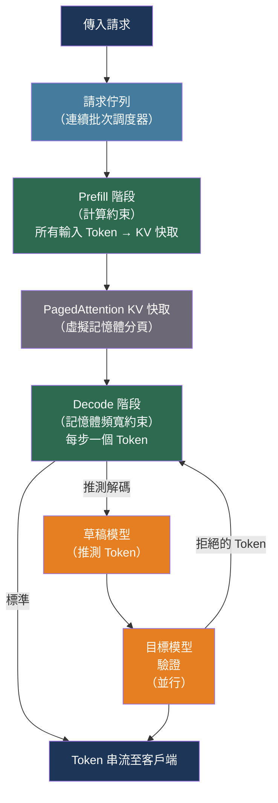

# [BEE-523] LLM 推論優化與自架部署

:::info
自架開放權重 LLM 需要理解將原始模型權重轉化為低延遲、高吞吐量服務的演算法——連續批次處理、推測解碼、量化，以及決定模型是否能夠放入的 VRAM 運算。
:::

## 背景

GPT-3 之後，LLM 部署的格局分成兩條路徑：呼叫供應商 API，或自行運行模型。API 路徑的基礎設施開銷為零，但帶來成本、延遲、資料駐留和可用性風險，使其對某些工作負載而言難以接受。自架路徑需要理解服務層——決定一個 700 億參數模型能服務 100 個並發使用者還是在 10 個後崩潰的軟硬體決策。

三項演算法發展使自架服務切實可行。首先，Kwon 等人（arXiv:2309.06180，SOSP 2023）引入了 PagedAttention：像虛擬記憶體一樣管理 KV 快取，消除碎片化並允許連續批次處理——在單次 GPU 傳遞中交錯來自多個請求的 Token 的技術。結果，vLLM 在相同延遲下實現了比靜態批次處理高 2-4 倍的吞吐量。其次，Leviathan 等人（arXiv:2211.17192，ICML 2023）展示，推測解碼——使用小型草稿模型提議 Token，大型模型並行驗證——在長輸出上減少延遲 2-3 倍，而無需更改模型或其輸出。第三，Frantar 等人（arXiv:2210.17323）（GPTQ）和 Lin 等人（arXiv:2306.00978）（AWQ）展示，訓練後量化至 4 位元可將模型大小減少 4 倍，同時幾乎不損失品質，使以前需要 4 個 GPU 的模型能夠在 1 個 GPU 上運行。

Dao 等人（arXiv:2205.14135，2022）貢獻了 FlashAttention，通過將 softmax 和矩陣乘法融合成單個 kernel，減少了注意力運算的記憶體頻寬成本，實現了支撐所有現代服務框架的高效長上下文處理。

## 設計思維

LLM 生成有兩個計算上截然不同的階段，瓶頸各異：

**Prefill** 在單次前向傳遞中處理整個輸入提示。它受計算約束——GPU 必須對所有輸入 Token 一次性執行矩陣乘法。Prefill 延遲主導首 Token 時間（TTFT）。

**Decode** 每次生成一個 Token，每個 Token 都需要完整的前向傳遞。它受記憶體頻寬約束——GPU 在每一步都必須從 HBM 載入所有模型權重。Decode 吞吐量決定每秒 Token 數。

這些階段需要不同的優化。減少 TTFT 意味著減少 prefill 時間：更短的提示、前綴快取（為共享前綴重用 KV 激活），或推測解碼。增加吞吐量意味著一起批次處理更多 decode 步驟：連續批次處理最大化 decode 期間的 GPU 佔用率。

一個常見的錯誤是為錯誤的指標優化。面向客戶的聊天機器人需要低 TTFT。批次文件處理管道需要高吞吐量。兩者都受益於連續批次處理，但需要不同的批次大小調整。

## 最佳實踐

### 在選擇硬體前估算部署規模

**MUST**（必須）在嘗試部署前估算 VRAM 需求。計算有兩個部分：模型權重和 KV 快取開銷。

模型權重記憶體（位元組）= 參數數量 × 每參數位元組數：

| 模型 | FP16（2B） | INT8（1B） | INT4（0.5B） |
|------|-----------|-----------|------------|
| 7B | ~14 GB | ~7 GB | ~3.5 GB |
| 13B | ~26 GB | ~13 GB | ~6.5 GB |
| 34B | ~68 GB | ~34 GB | ~17 GB |
| 70B | ~140 GB | ~70 GB | ~35 GB |

**SHOULD**（應該）在權重大小之上增加約 20% 的開銷用於激活、中間張量和框架本身。KV 快取隨批次大小和上下文長度增長；對於 128K 上下文、批次大小為 1 的 70B 模型，快取本身可達約 40 GB。

**SHOULD** 應用此硬體選擇啟發式：
- 模型適合單個 GPU：單 GPU，無需並行處理
- 模型適合單個節點（多個 GPU）：節點內張量並行
- 模型需要多個節點：每個節點內張量並行 + 節點間管道並行

### 根據部署目標選擇量化

**SHOULD** 為基於 GPU 的生產服務使用 AWQ 或 GPTQ。兩者都將權重量化至 4 位元，幾乎不損失困惑度，並提供 3-4 倍的記憶體縮減：

```bash
# AWQ 量化（推薦用於品質/速度平衡）
pip install autoawq
python -c "
from awq import AutoAWQForCausalLM
from transformers import AutoTokenizer

model = AutoAWQForCausalLM.from_pretrained('meta-llama/Llama-3-8B')
tokenizer = AutoTokenizer.from_pretrained('meta-llama/Llama-3-8B')
quant_config = {'zero_point': True, 'q_group_size': 128, 'w_bit': 4, 'version': 'GEMM'}
model.quantize(tokenizer, quant_config=quant_config)
model.save_quantized('./llama3-8b-awq')
"

# GPTQ 量化（大批次更高吞吐量）
pip install auto-gptq
python -c "
from transformers import AutoTokenizer
from auto_gptq import AutoGPTQForCausalLM, BaseQuantizeConfig

tokenizer = AutoTokenizer.from_pretrained('meta-llama/Llama-3-8B')
quant_config = BaseQuantizeConfig(bits=4, group_size=128, desc_act=False)
model = AutoGPTQForCausalLM.from_pretrained('meta-llama/Llama-3-8B', quant_config)
# GPTQ 需要校準資料集
model.quantize(calibration_dataset)
model.save_quantized('./llama3-8b-gptq')
"
```

**SHOULD** 為僅 CPU 的部署使用 GGUF 格式。llama.cpp 的 GGUF 格式將量化權重打包成可攜帶的單個文件，在 CPU 上比基於 Python 的框架快 3-8 倍：

```bash
# 轉換為 GGUF 並量化（通過 llama.cpp CLI 運行）
python llama.cpp/convert_hf_to_gguf.py meta-llama/Llama-3-8B --outfile llama3-8b.gguf
./llama.cpp/llama-quantize llama3-8b.gguf llama3-8b-q4_k_m.gguf Q4_K_M  # 最佳品質/大小權衡

# 使用 llama-server 服務（OpenAI 相容 API）
./llama.cpp/llama-server -m llama3-8b-q4_k_m.gguf --port 8080 --ctx-size 8192
```

量化選擇指南：

| 場景 | 推薦 | 原因 |
|------|------|------|
| GPU，高吞吐量 | AWQ W4A16 | 最佳品質/速度平衡，強泛化能力 |
| GPU，最大吞吐量，H100+ | FP8（TensorRT-LLM） | 原生硬體支援，比 FP16 高 2 倍吞吐量 |
| CPU 推論 | GGUF Q4_K_M | 優化的 SIMD kernel，可攜帶 |
| 記憶體受限 GPU | INT4（BitsAndBytes） | 易於應用，品質良好 |

### 為生產 GPU 服務運行 vLLM

**SHOULD** 將 vLLM 部署為生產 GPU 工作負載的主要服務層。vLLM 提供開箱即用的 OpenAI 相容 API、連續批次處理和 PagedAttention：

```python
# 啟動 vLLM 伺服器（OpenAI 相容 API）
# vllm serve meta-llama/Llama-3.1-8B-Instruct \
#   --quantization awq \
#   --tensor-parallel-size 2 \        # 2 個 GPU
#   --max-model-len 32768 \
#   --gpu-memory-utilization 0.90 \   # 留 10% 用於開銷
#   --enable-prefix-caching           # 為共享前綴重用 KV 快取

from openai import OpenAI

# OpenAI API 呼叫的直接替代
client = OpenAI(
    base_url="http://localhost:8000/v1",
    api_key="not-required",  # vLLM 預設忽略金鑰
)

response = client.chat.completions.create(
    model="meta-llama/Llama-3.1-8B-Instruct",
    messages=[{"role": "user", "content": "解釋 PagedAttention。"}],
    max_tokens=512,
)
```

**MUST** 將 `--gpu-memory-utilization` 設為最多 0.90。剩餘的 10% 防止突發負載下 KV 快取增長導致的 OOM 錯誤。

**SHOULD** 為在請求間共享長系統提示的工作負載啟用 `--enable-prefix-caching`。前綴快取為共享部分重用 KV 激活，將快取前綴的 TTFT 降至接近零。這是聊天機器人和 RAG 工作負載中最高效益的 TTFT 優化。

### 為延遲敏感的工作負載啟用推測解碼

**SHOULD** 當 p50 延遲比最大吞吐量更重要，且輸出通常為 50 個以上 Token 時，使用推測解碼。推測解碼使用小型草稿模型提議 Token；大型目標模型並行驗證它們並接受最長的一致前綴：

```bash
# vLLM 推測解碼（使用小型草稿模型）
vllm serve meta-llama/Llama-3.1-70B-Instruct \
  --speculative-model meta-llama/Llama-3.2-1B-Instruct \
  --num-speculative-tokens 5 \   # 草稿每步生成 5 個 Token
  --tensor-parallel-size 4
```

理論加速受接受率限制：如果草稿模型的提議有 80% 的接受率，每步 5 個草稿 Token，則每個目標模型呼叫的平均 Token 數接近 4.5 而非 1——目標模型調用次數減少 4.5 倍。

對於沒有合適小型模型的工作負載，vLLM 的 n-gram 推測解碼使用提示本身中的匹配作為草稿提議，不需要額外的模型權重：

```bash
vllm serve meta-llama/Llama-3.1-70B-Instruct \
  --speculative-model "[ngram]" \
  --ngram-prompt-lookup-min 4 \
  --num-speculative-tokens 4
```

### 實施生產健康檢查和預熱

**MUST** 為 Kubernetes 部署配置三層探針策略。模型伺服器有兩個不同的緩慢階段：初始模型載入（分鐘）和預熱（秒）。標準存活探針在模型準備好之前觸發，使容器陷入重啟循環：

```yaml
# vLLM 的 Kubernetes 部署規格
containers:
  - name: vllm
    image: vllm/vllm-openai:latest
    startupProbe:
      httpGet:
        path: /health          # 模型載入後返回 200
        port: 8000
      initialDelaySeconds: 30
      periodSeconds: 10
      failureThreshold: 120    # 大型模型載入允許 20 分鐘
    livenessProbe:
      httpGet:
        path: /health
        port: 8000
      periodSeconds: 10
      failureThreshold: 3
    readinessProbe:
      httpGet:
        path: /v1/models       # 準備好服務時返回模型列表
        port: 8000
      periodSeconds: 5
      failureThreshold: 3
```

**SHOULD** 在模型載入後、就緒探針將 Pod 標記為可用之前發送預熱請求。冷推論比穩態推論慢，因為 GPU 快取未填充：

```python
import httpx
import asyncio

async def warm_up_server(base_url: str, num_warmup_requests: int = 5):
    """在接受生產流量前發送合成請求以預熱 GPU 快取。"""
    client = httpx.AsyncClient(base_url=base_url, timeout=60.0)
    warmup_payload = {
        "model": "meta-llama/Llama-3.1-8B-Instruct",
        "messages": [{"role": "user", "content": "你好"}],
        "max_tokens": 32,
    }
    tasks = [
        client.post("/v1/chat/completions", json=warmup_payload)
        for _ in range(num_warmup_requests)
    ]
    await asyncio.gather(*tasks)
    await client.aclose()
```

### 監控正確的指標

**MUST** 分別追蹤 TTFT 和 TPOT——它們衡量服務管道的不同部分，在不同的負載模式下降級：

| 指標 | 什麼使其降級 | 如何改善 |
|------|------------|---------|
| TTFT（首 Token 時間） | 長提示、高 prefill 並發、冷快取 | 前綴快取、更短提示、專用 prefill 實例 |
| TPOT（每 Token 時間） | 高 decode 批次大小、記憶體頻寬飽和 | 減少批次大小、使用更快的記憶體（HBM3）、量化 KV 快取 |
| 吞吐量（tok/s） | 小批次大小、GPU 利用率低 | 增加批次大小、連續批次處理、更大的請求 |
| P99 延遲 | 負載下的請求排隊 | 水平擴展、請求優先級 |

## 視覺圖



## 相關 BEE

- [BEE-503](503.md) -- LLM API 整合模式：API 整合模式無論是呼叫託管供應商還是自架 vLLM 端點都適用；OpenAI 相容 API 介面是相同的
- [BEE-513](513.md) -- AI 成本優化與模型路由：自架是一種成本優化策略；在自架模型和雲端供應商之間路由時，相同的模型路由邏輯適用
- [BEE-518](518.md) -- LLM 串流模式：vLLM 和 TGI 都支援 SSE 串流；TTFT 是串流端點的主要延遲指標
- [BEE-322](322.md) -- 分散式追蹤：TTFT、TPOT 和佇列時間是自架推論追蹤中要儀器化的三個 Span

## 參考資料

- [Kwon et al. 使用 PagedAttention 的大型語言模型服務的高效記憶體管理 — arXiv:2309.06180, SOSP 2023](https://arxiv.org/abs/2309.06180)
- [Leviathan et al. 通過推測解碼的 Transformer 快速推論 — arXiv:2211.17192, ICML 2023](https://arxiv.org/abs/2211.17192)
- [Frantar et al. GPTQ：生成式預訓練 Transformer 的精確訓練後量化 — arXiv:2210.17323, 2022](https://arxiv.org/abs/2210.17323)
- [Lin et al. AWQ：用於 LLM 壓縮和加速的激活感知權重量化 — arXiv:2306.00978, 2023](https://arxiv.org/abs/2306.00978)
- [Dao et al. FlashAttention：具有 IO 感知的快速且記憶體高效的精確注意力 — arXiv:2205.14135, NeurIPS 2022](https://arxiv.org/abs/2205.14135)
- [vLLM. 簡單、快速且低成本的 LLM 服務 — docs.vllm.ai](https://docs.vllm.ai/)
- [NVIDIA. TensorRT-LLM 文件 — nvidia.github.io](https://nvidia.github.io/TensorRT-LLM/)
- [llama.cpp. 本地 LLM 推論 — github.com/ggml-org/llama.cpp](https://github.com/ggml-org/llama.cpp)
- [Hugging Face. Text Generation Inference — github.com/huggingface/text-generation-inference](https://github.com/huggingface/text-generation-inference)
- [Hugging Face. 輔助生成 — huggingface.co](https://huggingface.co/docs/transformers/main/assisted_decoding)
