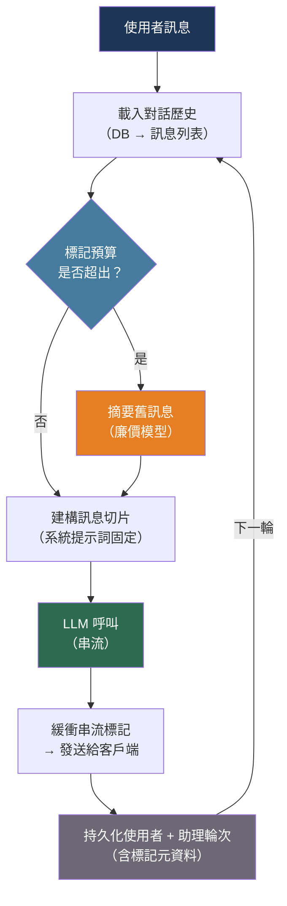

# [BEE-533] 對話式 AI 與多輪對話架構

:::info
對話式 AI 後端是一個有狀態的分散式系統：每次使用者輸入都必須載入先前的上下文、將累積的歷史記錄發送給 LLM，並持久化新的交換——同時管理隨著每則訊息增長直至必須剪裁的上下文視窗。
:::

## 背景

單輪 LLM 呼叫是無狀態的 HTTP 請求。對話則不然。多輪對話中的每一輪都依賴整個交換歷史：使用者的意圖在演進，引用需要對應到先前的訊息，而助理必須與兩分鐘前說過的話保持一致。

天真的實作方式是將訊息儲存在客戶端，並在每次請求時重播。這在對話超過模型上下文視窗之前都能正常運作。超過後，應用程式會靜默截斷歷史記錄，模型失去上下文，品質隨之下降。若不主動管理，擁有 200k 標記上下文的模型在單次長對話中就可能溢出。

研究量化了這個問題。一項針對 15 個 LLM、超過 20 萬次模擬對話的實證研究（arXiv:2505.06120，2025）發現，從單輪到多輪互動，平均性能下降 39%。主要原因是「迷失中段」效應：LLM 對長輸入開頭和結尾的注意力更強，導致中間的關鍵上下文被遺漏。

工程上的應對措施是建立持久化會話層，將儲存中的訊息歷史與每輪發送給模型的訊息切片分離。會話層負責三項職責：完整對話的持久化儲存、為每次請求選擇相關切片，以及在切片將超出上下文預算時壓縮歷史記錄。

## 設計思維

對話有兩條必須分開管理的時間軸：

- **儲存時間軸**：對話中每則訊息、工具呼叫和系統事件的完整、只增不減的記錄。這永遠不丟失資訊，是分析、稽核和分支的事實來源。
- **模型時間軸**：在特定輪次發送給模型的訊息切片。這必須符合上下文視窗，並且應包含對產生正確回應最相關的訊息。

這兩條時間軸之間的差距由**上下文選擇策略**管理。四種策略在實踐中可以組合使用：

1. **滑動視窗**：發送最後 N 則訊息。簡單、可預測，但會丟失早期上下文（如果系統提示詞未固定，也可能被丟棄）。
2. **摘要壓縮**：當視窗超過標記閾值時，將舊訊息壓縮為摘要並替換。Wang 等人（arXiv:2308.15022，2023）展示了遞迴摘要——將 `舊摘要 + 新片段 → 新摘要`——可在超長會話中維持連貫性。
3. **選擇性注入**：以語意相似度對每條歷史訊息評分，僅包含高分的訊息。高效但每輪需要嵌入呼叫。
4. **混合策略**：固定系統提示詞 + 第一則使用者訊息，對近期訊息應用滑動視窗，並對中間部分進行摘要。

大多數生產系統從滑動視窗開始，當會話超過幾千個標記時再添加摘要機制。

## 最佳實踐

### 以 Thread ID 為鍵將對話儲存於資料庫

**MUST**（必須）在伺服器端持久化對話歷史，以 `thread_id` 為鍵。僅在客戶端儲存歷史（瀏覽器 localStorage、行動裝置狀態）會在跨裝置和跨會話時丟失上下文，使分析變得不可能，也無法進行伺服器端上下文管理：

```python
import uuid
from datetime import datetime
from dataclasses import dataclass, field

@dataclass
class Message:
    role: str          # "user" | "assistant" | "system" | "tool"
    content: str
    created_at: datetime = field(default_factory=datetime.utcnow)
    metadata: dict = field(default_factory=dict)

# 最小 Schema（PostgreSQL）：
# CREATE TABLE conversation_threads (
#     thread_id UUID PRIMARY KEY DEFAULT gen_random_uuid(),
#     user_id   TEXT NOT NULL,
#     created_at TIMESTAMPTZ DEFAULT now(),
#     updated_at TIMESTAMPTZ DEFAULT now()
# );
#
# CREATE TABLE conversation_messages (
#     id         BIGSERIAL PRIMARY KEY,
#     thread_id  UUID REFERENCES conversation_threads(thread_id),
#     role       TEXT NOT NULL,
#     content    TEXT NOT NULL,
#     created_at TIMESTAMPTZ DEFAULT now(),
#     metadata   JSONB DEFAULT '{}'
# );
# CREATE INDEX ON conversation_messages (thread_id, created_at);

class ConversationStore:
    def __init__(self, db):
        self.db = db

    def create_thread(self, user_id: str) -> str:
        thread_id = str(uuid.uuid4())
        self.db.execute(
            "INSERT INTO conversation_threads (thread_id, user_id) VALUES ($1, $2)",
            thread_id, user_id,
        )
        return thread_id

    def append(self, thread_id: str, role: str, content: str, metadata: dict = None):
        self.db.execute(
            "INSERT INTO conversation_messages (thread_id, role, content, metadata) "
            "VALUES ($1, $2, $3, $4)",
            thread_id, role, content, metadata or {},
        )

    def load(self, thread_id: str, limit: int = 200) -> list[Message]:
        rows = self.db.fetch(
            "SELECT role, content, created_at, metadata FROM conversation_messages "
            "WHERE thread_id = $1 ORDER BY created_at ASC LIMIT $2",
            thread_id, limit,
        )
        return [Message(**r) for r in rows]
```

**SHOULD** 在每則助理訊息中儲存原始 LLM 使用元資料（輸入標記數、輸出標記數、模型名稱）。這可以實現對話層級的成本計算，也是偵測失控會話的數據來源。

### 固定系統提示詞並應用滑動視窗

**SHOULD** 將系統提示詞與對話歷史分開，並始終包含它，無論選擇了哪個訊息視窗。如果系統提示詞被視為普通訊息，滑動視窗在丟棄早期訊息時可能意外丟棄系統提示詞：

```python
import anthropic
from anthropic import Anthropic

client = Anthropic()

def build_messages_for_turn(
    thread_id: str,
    new_user_message: str,
    store: ConversationStore,
    system_prompt: str,
    max_history_messages: int = 20,
) -> tuple[str, list[dict]]:
    """
    返回 (system_prompt, messages_list) 供 Anthropic API 呼叫使用。
    系統提示詞單獨固定；歷史記錄使用視窗截取。
    """
    history = store.load(thread_id, limit=max_history_messages)

    # 建構訊息陣列：歷史 + 當前輪次
    messages = []
    for msg in history:
        if msg.role in ("user", "assistant"):
            messages.append({"role": msg.role, "content": msg.content})

    messages.append({"role": "user", "content": new_user_message})

    # 系統提示詞作為頂層參數傳遞，而非放入 messages[]
    return system_prompt, messages

def chat_turn(
    thread_id: str,
    user_input: str,
    store: ConversationStore,
    system_prompt: str,
) -> str:
    # 在呼叫模型前持久化使用者輪次
    store.append(thread_id, "user", user_input)

    system, messages = build_messages_for_turn(
        thread_id, user_input, store, system_prompt
    )

    response = client.messages.create(
        model="claude-sonnet-4-6",
        max_tokens=1024,
        system=system,
        messages=messages,
    )
    assistant_content = response.content[0].text

    # 模型回應後持久化助理輪次
    store.append(
        thread_id, "assistant", assistant_content,
        metadata={
            "input_tokens": response.usage.input_tokens,
            "output_tokens": response.usage.output_tokens,
            "model": response.model,
        },
    )
    return assistant_content
```

**MUST NOT** 將系統提示詞作為 `conversation_messages` 表中的一行儲存並包含在滑動視窗中。當視窗填滿時它會被驅逐，悄悄移除角色設定和行為約束。

### 在視窗溢出前以摘要壓縮歷史記錄

**SHOULD** 監控所選訊息切片的標記計數，當它接近模型的上下文限制時觸發摘要。Wang 等人（arXiv:2308.15022，2023）證明遞迴摘要——將逐漸老舊的片段壓縮為滾動摘要——可在遠超模型原生上下文的會話中維持連貫性：

```python
def estimate_tokens(messages: list[dict]) -> int:
    """粗略估算：1 個標記 ≈ 4 個字元。"""
    return sum(len(m["content"]) // 4 for m in messages)

def summarize_older_messages(
    messages_to_summarize: list[dict],
    existing_summary: str | None,
) -> str:
    """
    將早期對話訊息壓縮為摘要。
    如果存在先前摘要，將其折疊進來（遞迴摘要）。
    """
    prior = f"Prior summary:\n{existing_summary}\n\n" if existing_summary else ""
    transcript = "\n".join(
        f"{m['role'].upper()}: {m['content']}" for m in messages_to_summarize
    )
    response = client.messages.create(
        model="claude-haiku-4-5-20251001",  # 使用廉價模型進行摘要
        max_tokens=512,
        messages=[{
            "role": "user",
            "content": (
                f"{prior}Summarize the following conversation segment concisely, "
                f"preserving key facts, decisions, and user preferences:\n\n{transcript}"
            ),
        }],
    )
    return response.content[0].text

def build_messages_with_summarization(
    thread_id: str,
    store: ConversationStore,
    system_prompt: str,
    token_budget: int = 60_000,
    summary_threshold: int = 40_000,
) -> tuple[str, list[dict]]:
    """
    載入完整歷史。如果標記計數超過閾值，摘要較舊的一半
    並以摘要注入替換。
    """
    all_messages = store.load(thread_id, limit=500)
    messages = [{"role": m.role, "content": m.content}
                for m in all_messages if m.role in ("user", "assistant")]

    if estimate_tokens(messages) <= summary_threshold:
        return system_prompt, messages

    # 分割：對較舊的一半進行摘要，保留近期的一半原文
    split = len(messages) // 2
    older, recent = messages[:split], messages[split:]

    summary = summarize_older_messages(older, existing_summary=None)

    # 在近期視窗頂部以系統注釋形式注入摘要
    compressed_messages = [
        {
            "role": "user",
            "content": f"[Conversation summary so far: {summary}]",
        },
        {"role": "assistant", "content": "Understood, I'll keep that context in mind."},
    ] + recent

    return system_prompt, compressed_messages
```

**SHOULD** 使用較小、較廉價的模型（如 `claude-haiku-4-5-20251001`）進行摘要。摘要任務不需要前沿模型的能力，而且摘要呼叫在長會話中會頻繁執行。

### 在持久化前緩衝完整的串流回應

**MUST** 在將助理訊息寫入對話儲存之前，緩衝完整的串流回應。如果在每個串流分塊上儲存部分內容，當串流中斷時會在儲存中建立不一致的歷史記錄：

```python
import anthropic

def streaming_chat_turn(
    thread_id: str,
    user_input: str,
    store: ConversationStore,
    system_prompt: str,
) -> str:
    store.append(thread_id, "user", user_input)

    system, messages = build_messages_for_turn(
        thread_id, user_input, store, system_prompt
    )

    full_response = ""
    input_tokens = 0
    output_tokens = 0

    with client.messages.stream(
        model="claude-sonnet-4-6",
        max_tokens=1024,
        system=system,
        messages=messages,
    ) as stream:
        for text in stream.text_stream:
            full_response += text
            yield text  # 串流給呼叫者（例如 SSE 或 WebSocket）

        # 最終訊息包含使用元資料
        final = stream.get_final_message()
        input_tokens = final.usage.input_tokens
        output_tokens = final.usage.output_tokens

    # 僅在完整回應組裝後才持久化
    store.append(
        thread_id, "assistant", full_response,
        metadata={"input_tokens": input_tokens, "output_tokens": output_tokens},
    )
```

**SHOULD** 將中斷的串流（網路中斷、客戶端斷線）視為不完整的助理輪次。以 `status: "interrupted"` 元資料標記儲存部分輪次，而非靜默丟棄，讓下一輪有關於已傳遞和未傳遞內容的準確上下文。

## 視覺圖



## 上下文策略比較

| 策略 | 實作成本 | 資訊損失 | 最適合 |
|---|---|---|---|
| 滑動視窗（最後 N 則訊息） | 低 | 高（丟失早期上下文） | 短對話、窄域任務 |
| 摘要壓縮（滾動摘要） | 中 | 低（摘要保留事實） | 長對話、多主題 |
| 選擇性注入（語意評分） | 高（每輪 +嵌入呼叫） | 無（按相關性評分） | 密集知識、重 RAG |
| 混合策略（固定 + 視窗 + 摘要） | 中 | 低 | 生產通用聊天機器人 |

## 相關 BEE

- [BEE-512](512.md) -- LLM 上下文視窗管理：標記預算和內容打包策略，支撐本文的剪裁決策
- [BEE-519](519.md) -- 長期運行代理的 AI 記憶系統：將對話記憶擴展至上下文視窗之外的情節記憶和語意記憶儲存
- [BEE-518](518.md) -- LLM 串流模式：本文串流緩衝寫入的伺服器推送事件和 WebSocket 傳遞層
- [BEE-529](529.md) -- AI 工作流協作編排：管理每輪對話由哪個代理處理的多代理路由和 LangGraph 狀態機

## 參考資料

- [Hu et al. Recursively Summarizing Enables Long-Term Dialogue Memory in Large Language Models — arXiv:2308.15022, 2023](https://arxiv.org/abs/2308.15022)
- [Zhong et al. LLMs Get Lost In Multi-Turn Conversation — arXiv:2505.06120, 2025](https://arxiv.org/abs/2505.06120)
- [Li et al. Context Branching for LLM Conversations — arXiv:2512.13914, 2024](https://arxiv.org/abs/2512.13914)
- [Anthropic. Using the Messages API — platform.claude.com](https://platform.claude.com/docs/en/build-with-claude/working-with-messages)
- [LangChain. Add message history (RunnableWithMessageHistory) — python.langchain.com](https://python.langchain.com/v0.1/docs/expression_language/how_to/message_history/)
- [Pinecone. Conversational Memory for LLMs with Langchain — pinecone.io](https://www.pinecone.io/learn/series/langchain/langchain-conversational-memory/)
- [Redis. Context Window Management for LLM Applications — redis.io](https://redis.io/blog/context-window-management-llm-apps-developer-guide/)
