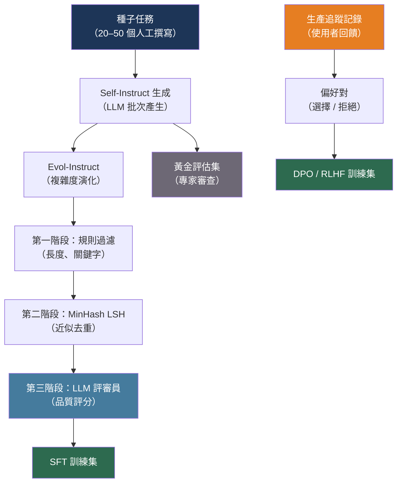

# [BEE-534] AI 系統的合成資料生成

:::info
合成資料生成使用 LLM 大規模產生帶標籤的訓練樣本、評估資料集和多樣化測試輸入——打破了對每個新任務或領域都需要昂貴人工標注的依賴。
:::

## 背景

監督式微調、偏好最佳化和評估都需要帶標籤的資料。歷史上，帶標籤的資料需要人工標注員：昂貴、緩慢，且受限於領域專家的可用性。品質上限由團隊能負擔標注的樣本數量決定。

Wang 等人引入了 Self-Instruct（arXiv:2212.10560，ACL 2023），證明 LLM 可以從少量種子集生成自己的指令遵循訓練資料。從 175 個人工撰寫的種子任務出發，該流程生成了 52,000 個指令-輸入-輸出三元組，並用來微調基礎模型，在 SuperNaturalInstructions 上縮小了未調整基礎模型與 InstructGPT 之間 85% 的差距。核心洞察是：能力足夠的模型可以作為嘈雜但可擴展的標注者，用於它能執行的任務。

Xu 等人以 Evol-Instruct（arXiv:2304.12244，2023）進一步推進了這個想法，不僅僅是生成指令，而是以迭代方式將其演化至更高的複雜度。LLM 使用五種操作之一改寫每條種子指令——添加約束、加深、具體化、增加推理步驟、使輸入複雜化——直到資料集覆蓋廣泛的難度範圍。在 70,000 條演化指令上訓練的 WizardLM 模型，在指令遵循基準測試上勝過了在更大人工策劃資料集上訓練的模型。

工程挑戰不在於生成——任何 LLM 都能生成文字——而在於大規模的品質控制。原始 LLM 輸出包含重複項、矛盾、幻覺事實和低難度樣本，這些都會增加噪音而非信號。生產合成資料流程在過濾上投入的工程精力與生成一樣多。

## 設計思維

合成資料在 AI 系統中服務於三個不同的目的，每個目的都需要不同的流程：

1. **微調資料**：用於監督式微調（SFT）的指令-輸入-輸出三元組，或用於 DPO/RLHF 的偏好對（選擇/拒絕）。數量重要；品質把關防止噪音。
2. **評估黃金資料集**：一小組高精度的樣本，帶有已驗證的預期輸出，用於基準測試模型品質。品質重要；數量次之。
3. **測試輸入**：用於整合測試的多樣化、覆蓋邊緣案例的輸入。覆蓋率重要；確切的輸出比引發特定行為更不重要。

這三種用途具有不同的生成策略和不同的品質閾值。微調流程可以容忍 5–10% 的嘈雜樣本；黃金評估資料集則完全不能容忍。

## 最佳實踐

### 以 Self-Instruct 生成指令

**SHOULD**（應該）在帶標籤資料不可用或成本高昂時，使用 Self-Instruct 模式從少量人工撰寫的種子引導指令資料集：

```python
import random
import anthropic

client = anthropic.Anthropic()

SEED_TASKS = [
    {"instruction": "Summarize the following article in two sentences.", "input": "<article>", "output": "<summary>"},
    {"instruction": "Classify the sentiment of this review as positive, negative, or neutral.", "input": "<review>", "output": "<label>"},
    # ... 20–50 個涵蓋目標領域的種子任務
]

GENERATION_PROMPT = """\
You are generating diverse task instructions for training a language model.

Here are {n_shots} example tasks:
{examples}

Generate {n_new} new task instructions that are:
- Different from the examples above
- Diverse in format and domain
- Solvable by a language model without external tools
- Between one sentence and one paragraph in length

For each task, provide:
1. A clear instruction
2. An optional input (or "<noinput>" if not needed)
3. A correct output

Format: JSON array with fields "instruction", "input", "output"."""

def generate_instruction_batch(n_new: int = 20) -> list[dict]:
    n_shots = min(8, len(SEED_TASKS))
    examples = random.sample(SEED_TASKS, n_shots)
    formatted = "\n\n".join(
        f"Instruction: {t['instruction']}\nInput: {t['input']}\nOutput: {t['output']}"
        for t in examples
    )
    response = client.messages.create(
        model="claude-sonnet-4-6",
        max_tokens=4096,
        messages=[{
            "role": "user",
            "content": GENERATION_PROMPT.format(
                n_shots=n_shots, examples=formatted, n_new=n_new
            ),
        }],
    )
    import json
    return json.loads(response.content[0].text)
```

**SHOULD** 從種子中使用少樣本抽樣（8–16 個樣本）而非在每次生成呼叫中包含所有種子。隨機抽樣強制多樣性，減少模型聚集在相同任務類型的傾向。

### 以 Evol-Instruct 演化複雜度

**SHOULD** 在初始資料集缺乏困難樣本時應用 Evol-Instruct。僅在簡單指令上微調的模型無法處理複雜的真實世界查詢。演化現有資料集在不需要人工的情況下填補了難度範圍：

```python
EVOLUTION_OPERATIONS = {
    "add_constraints": (
        "Rewrite the following instruction to be more specific by adding "
        "2–3 explicit constraints or requirements:\n\n{instruction}"
    ),
    "deepen": (
        "Rewrite the following instruction to require deeper domain knowledge "
        "or multi-step reasoning to answer:\n\n{instruction}"
    ),
    "concretize": (
        "Rewrite the following instruction by replacing vague terms with "
        "specific, concrete details:\n\n{instruction}"
    ),
    "increase_reasoning": (
        "Rewrite the following instruction so that answering it requires "
        "explicit reasoning steps or logical deduction:\n\n{instruction}"
    ),
}

def evolve_instruction(instruction: str, operation: str) -> str | None:
    prompt = EVOLUTION_OPERATIONS[operation].format(instruction=instruction)
    response = client.messages.create(
        model="claude-sonnet-4-6",
        max_tokens=512,
        messages=[{"role": "user", "content": prompt}],
    )
    evolved = response.content[0].text.strip()
    # 如果演化後的指令與原始指令幾乎相同，則拒絕
    if rouge_l_similarity(evolved, instruction) > 0.7:
        return None
    return evolved

def rouge_l_similarity(a: str, b: str) -> float:
    """簡化的 ROUGE-L：以詞序列計算 LCS 長度 / max(len(a), len(b))。"""
    a_words, b_words = a.lower().split(), b.lower().split()
    if not a_words or not b_words:
        return 0.0
    m, n = len(a_words), len(b_words)
    dp = [[0] * (n + 1) for _ in range(m + 1)]
    for i in range(1, m + 1):
        for j in range(1, n + 1):
            dp[i][j] = dp[i-1][j-1] + 1 if a_words[i-1] == b_words[j-1] else max(dp[i-1][j], dp[i][j-1])
    return dp[m][n] / max(m, n)
```

### 應用三階段品質過濾器

**MUST** 在將合成資料用於微調之前進行過濾。原始 LLM 輸出包含重複項、低品質樣本和與目標行為矛盾的樣本。三階段過濾器以遞增的成本捕捉主要失敗模式：

```python
# 第一階段：基於規則的過濾器（快速、免費）
def rule_based_filter(example: dict) -> bool:
    instruction = example.get("instruction", "")
    output = example.get("output", "")
    # 拒絕過短的指令（可能是格式錯誤）
    if len(instruction.split()) < 3:
        return False
    # 拒絕空輸出
    if len(output.strip()) < 10:
        return False
    # 拒絕要求有害內容的指令（關鍵字列表）
    BANNED_PHRASES = ["how to hack", "illegal", "kill"]
    if any(p in instruction.lower() for p in BANNED_PHRASES):
        return False
    return True

# 第二階段：使用 MinHash 進行近似去重（廉價）
from datasketch import MinHash, MinHashLSH

def build_dedup_index(examples: list[dict], threshold: float = 0.8) -> list[dict]:
    """使用 MinHash LSH 移除近似重複。"""
    lsh = MinHashLSH(threshold=threshold, num_perm=128)
    kept = []
    for i, ex in enumerate(examples):
        m = MinHash(num_perm=128)
        for word in ex["instruction"].lower().split():
            m.update(word.encode())
        key = f"ex_{i}"
        if not lsh.query(m):  # 未找到近似重複
            lsh.insert(key, m)
            kept.append(ex)
    return kept

# 第三階段：LLM 作為評審員品質評分（昂貴——在樣本上運行或在預算允許時全量運行）
JUDGE_PROMPT = """\
Rate the quality of this instruction-output pair on a scale of 1–5.

Instruction: {instruction}
Input: {input}
Output: {output}

Score criteria:
5 - Clear instruction, factually correct, detailed output
4 - Good instruction, mostly correct output with minor issues
3 - Acceptable but vague instruction or incomplete output
2 - Confusing instruction or incorrect output
1 - Unusable: incoherent, harmful, or completely wrong

Respond with only a single digit (1–5)."""

def llm_quality_score(example: dict) -> int:
    response = client.messages.create(
        model="claude-haiku-4-5-20251001",  # 使用廉價模型評分
        max_tokens=5,
        messages=[{
            "role": "user",
            "content": JUDGE_PROMPT.format(**example),
        }],
    )
    try:
        return int(response.content[0].text.strip()[0])
    except (ValueError, IndexError):
        return 1  # 解析失敗時預設為低分

def filter_pipeline(raw_examples: list[dict], judge_threshold: int = 3) -> list[dict]:
    # 第一階段：基於規則
    after_rules = [ex for ex in raw_examples if rule_based_filter(ex)]
    # 第二階段：近似去重
    after_dedup = build_dedup_index(after_rules)
    # 第三階段：LLM 評審員
    after_judge = [ex for ex in after_dedup if llm_quality_score(ex) >= judge_threshold]
    return after_judge
```

**SHOULD** 先對 Stage 3（LLM 評審員）在樣本上運行以校準分數閾值。閾值為 3 時通常保留 60–80% 的樣本；根據目標領域的觀察品質進行調整。

### 以多樣化 Persona 生成黃金評估集

**SHOULD** 使用多樣化的 Persona 提示生成覆蓋廣泛使用者意圖、專業水平和表達方式的評估黃金資料集。Cui 等人（arXiv:2406.20094，2024）證明，以來自網路文字的 10 億個 Persona 作為種子生成，比通用提示產生更多樣化的輸出：

```python
PERSONAS = [
    "a junior software engineer encountering this for the first time",
    "an experienced site reliability engineer debugging a production incident",
    "a product manager trying to understand technical tradeoffs without coding",
    "a security researcher looking for edge cases and attack vectors",
    "a data scientist optimizing for performance with large datasets",
]

def generate_golden_set(
    topic: str,
    n_examples_per_persona: int = 5,
) -> list[dict]:
    """
    透過從多個使用者 Persona 取樣來生成多樣化的黃金評估集。
    每個 Persona 產生不同的表達方式和意圖。
    """
    golden_examples = []
    for persona in PERSONAS:
        response = client.messages.create(
            model="claude-sonnet-4-6",
            max_tokens=2048,
            messages=[{
                "role": "user",
                "content": (
                    f"You are acting as {persona}.\n"
                    f"Generate {n_examples_per_persona} realistic questions you would ask "
                    f"about the following topic: {topic}\n\n"
                    f"For each question, also provide the ideal answer.\n"
                    f"Format: JSON array with 'question' and 'ideal_answer' fields."
                ),
            }],
        )
        import json
        examples = json.loads(response.content[0].text)
        for ex in examples:
            ex["persona"] = persona
        golden_examples.extend(examples)
    return golden_examples
```

**MUST** 讓領域專家在將生成的黃金資料集用作評估基準之前進行審查。黃金資料集中的錯誤預期答案比嘈雜的訓練樣本危害更大——它會誤導整個評估流程。

### 實作資料飛輪

**SHOULD** 對生產 LLM 呼叫進行儀器化，以捕捉將成為訓練資料的輸入和輸出。資料飛輪將生產流量轉化為持續改進的訓練語料庫：

```python
import hashlib
import time

def log_production_trace(
    thread_id: str,
    user_input: str,
    assistant_output: str,
    feedback_signal: str | None,  # "thumbs_up"、"thumbs_down"、None
    latency_ms: int,
    token_count: int,
):
    """
    將每次生產 LLM 互動寫入追蹤儲存庫。
    回饋信號（如有）能夠構建偏好對。
    """
    trace = {
        "trace_id": hashlib.sha256(f"{thread_id}:{time.time()}".encode()).hexdigest()[:16],
        "thread_id": thread_id,
        "input": user_input,
        "output": assistant_output,
        "feedback": feedback_signal,
        "latency_ms": latency_ms,
        "token_count": token_count,
        "timestamp": time.time(),
    }
    trace_store.insert(trace)

def build_preference_pairs_from_traces() -> list[dict]:
    """
    從追蹤記錄構建 DPO 偏好對，其中：
    - "thumbs_up" 回應成為 "chosen"（選擇）
    - "thumbs_down" 回應成為 "rejected"（拒絕）
    通過相似輸入匹配構建 (提示, chosen, rejected) 三元組。
    """
    positive = trace_store.query(feedback="thumbs_up", limit=10_000)
    negative = trace_store.query(feedback="thumbs_down", limit=10_000)

    pairs = []
    for pos in positive:
        # 找到具有相似輸入的負面追蹤（嵌入相似度或關鍵字重疊）
        match = find_similar_trace(pos["input"], negative)
        if match:
            pairs.append({
                "prompt": pos["input"],
                "chosen": pos["output"],
                "rejected": match["output"],
            })
    return pairs
```

## 視覺圖



## 過濾階段比較

| 階段 | 技術 | 成本 | 移除內容 |
|---|---|---|---|
| 基於規則 | 長度、關鍵字、格式檢查 | 接近零 | 格式錯誤、明顯有害 |
| 近似去重 | MinHash LSH（128 次排列） | 低（CPU） | 重複和近似重複指令 |
| 困惑度 | 參考模型 PPL 評分 | 高（GPU） | 低品質或離分布的文字 |
| LLM 評審員 | 輔助模型評分 | 中（API） | 規則無法偵測的低品質內容 |

## 相關 BEE

- [BEE-506](506.md) -- 評估和測試 LLM 應用：此流程產生的黃金評估集直接饋入其中描述的 LLM 作為評審員評估模式
- [BEE-514](514.md) -- 微調與 PEFT 模式：消費此處產生的 SFT 和偏好資料集的微調流程
- [BEE-527](527.md) -- LLM 批次處理模式：大規模合成資料生成以批次作業方式運行；OpenAI 和 Anthropic 的批次 API 是生成數百萬樣本的高效路徑

## 參考資料

- [Wang et al. Self-Instruct: Aligning Language Models with Self-Generated Instructions — arXiv:2212.10560, ACL 2023](https://arxiv.org/abs/2212.10560)
- [Xu et al. WizardLM: Empowering Large Pre-Trained Language Models to Follow Complex Instructions — arXiv:2304.12244, 2023](https://arxiv.org/abs/2304.12244)
- [Cui et al. Scaling Synthetic Data Creation with 1,000,000,000 Personas — arXiv:2406.20094, 2024](https://arxiv.org/abs/2406.20094)
- [Rafailov et al. Direct Preference Optimization: Your Language Model is Secretly a Reward Model — arXiv:2305.18290, NeurIPS 2023](https://arxiv.org/abs/2305.18290)
- [Cui et al. UltraFeedback: Boosting Language Models with Scaled AI Feedback — arXiv:2310.01377, ICML 2024](https://arxiv.org/abs/2310.01377)
- [Argilla. distilabel: Synthetic data and AI feedback framework — github.com/argilla-io/distilabel](https://github.com/argilla-io/distilabel)
