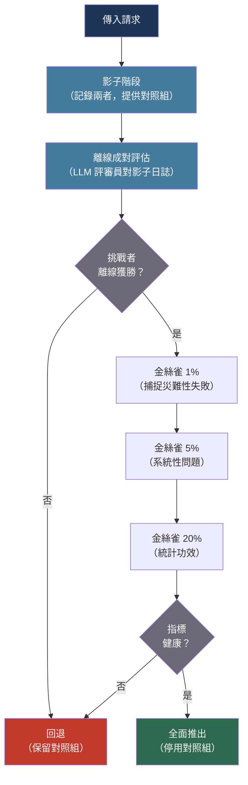

# [BEE-536] AI 實驗與模型 A/B 測試

:::info
在生產環境中測試一個 LLM 對比另一個，需要的不只是流量分割——還需要選擇正確的評估信號、考慮主觀文字輸出的高變異性，以及在離線比較、影子部署、即時 A/B 和自適應老虎機策略之間做出選擇。
:::

## 背景

傳統軟體 A/B 測試測量確定性結果：按鈕點擊率、轉換率、延遲。使用相同輸入的兩個請求產生相同的輸出。統計工具是成熟的：選擇指標、估計樣本量、運行至顯著性、發布獲勝者。

LLM 實驗打破了每個假設。由於溫度取樣，使用相同輸入的兩個請求可能產生不同的輸出。品質是主觀的——一個人類評估者給回應打 4/5 分，另一個人打 2/5 分。效果量很小：`claude-sonnet-4-6` 和 `claude-opus-4-6` 在支援問題上的差異對一半的使用者來說可能是無法察覺的。這些特性大幅增加了所需的樣本量，使天真的「運行兩週然後檢查 p 值」方法不可靠。

研究界開發了補償技術。Chapelle 等人（ACM TOIS，2012）表明，交替評估——在同一使用者會話中呈現兩個模型的結果並觀察使用者的偏好——對於排序系統比跨會話 A/B 測試在統計上靈敏 10–100 倍，正是因為它消除了使用者間的變異。Agrawal 和 Goyal（PMLR，2012）證明 Thompson 取樣對多臂老虎機問題實現了接近最優的累積遺憾，使其成為固定持續時間 A/B 測試的有原則替代方案，特別是在實驗運行期間希望最小化對劣等模型暴露的情況下。

實際的工程挑戰是建立基礎設施來捕捉正確的信號：隱性行為線索（使用者在得到糟糕答案後重新表述、會話放棄、重試率）比顯性評分（讚/踩）成本更低、數量更多，但噪音也更大。大多數生產系統將兩者結合使用。

## 設計思維

選擇實驗策略是三個變數的函數：

**效果量**：如果你預期模型 B 會顯著更好（切換模型系列、重大提示詞改寫），小樣本離線評估可以快速捕捉信號。如果變化是微妙的（措辭調整、溫度調整），你需要大量的線上樣本或更靈敏的方法。

**風險容忍度**：影子模式讓新模型靜默失敗，而舊模型服務所有流量。即時 A/B 測試將一定比例的真實使用者暴露在挑戰者模型中，如果挑戰者更差則可能引入品質回歸。金絲雀（1% → 5% → 25% → 100%）限制了爆炸半徑。

**反饋延遲**：一些品質信號是即時的（模型是否成功完成任務？）。其他的則滯後數小時或數天（使用者是否返回產品？）。實驗設計必須與反饋延遲匹配，以避免過早決策。

## 最佳實踐

### 在任何即時流量分割之前運行影子部署

**SHOULD**（應該）在將挑戰者模型暴露給即時流量之前，先以影子模式部署。影子模式將每個傳入請求同時發送給生產模型和挑戰者；生產回應返回給使用者，兩個回應都被記錄以供離線比較：

```python
import asyncio
import anthropic
import logging

logger = logging.getLogger(__name__)
client = anthropic.Anthropic()

async def shadow_generate(
    messages: list[dict],
    production_model: str,
    shadow_model: str,
    system: str = "",
    request_id: str = "",
) -> str:
    """
    同時運行生產模型和影子模型。
    返回生產回應；記錄兩者以供離線比較。
    """
    async def call_model(model: str) -> tuple[str, dict]:
        response = client.messages.create(
            model=model,
            max_tokens=1024,
            system=system,
            messages=messages,
        )
        text = response.content[0].text
        usage = {"input": response.usage.input_tokens, "output": response.usage.output_tokens}
        return text, usage

    # 並發運行兩個模型；生產延遲不受影子影響
    (prod_text, prod_usage), (shadow_text, shadow_usage) = await asyncio.gather(
        asyncio.to_thread(call_model, production_model),
        asyncio.to_thread(call_model, shadow_model),
    )

    # 記錄以供離線分析（絕不返回影子回應給使用者）
    logger.info("shadow_comparison", extra={
        "request_id": request_id,
        "production_model": production_model,
        "shadow_model": shadow_model,
        "production_response": prod_text[:200],
        "shadow_response": shadow_text[:200],
        "production_input_tokens": prod_usage["input"],
        "shadow_input_tokens": shadow_usage["input"],
        "production_output_tokens": prod_usage["output"],
        "shadow_output_tokens": shadow_usage["output"],
    })

    return prod_text  # 始終向使用者返回生產回應
```

**MUST NOT**（不得）向使用者提供影子模型回應，即使是部分提供。影子模式的價值在於無風險的數據收集；混入影子回應會破壞目的，並可能引入品質回歸。

### 以穩定雜湊將使用者分配到實驗變體

**MUST** 使用使用者 ID 的確定性雜湊而非每請求隨機取樣，將使用者分配到實驗變體。每請求隨機化意味著同一使用者在跨請求時看到不同的模型行為，造成使用體驗不一致，並損壞使用者內部行為信號：

```python
import hashlib

def get_experiment_variant(
    user_id: str,
    experiment_id: str,
    traffic_percent_challenger: float = 0.10,
) -> str:
    """
    穩定分配：對於給定的實驗，同一使用者始終獲得相同的變體。
    使用 SHA-256 取模分桶。

    traffic_percent_challenger：路由到挑戰者的使用者比例（0.0–1.0）
    """
    key = f"{experiment_id}:{user_id}"
    bucket = int(hashlib.sha256(key.encode()).hexdigest(), 16) % 10_000
    threshold = int(traffic_percent_challenger * 10_000)

    return "challenger" if bucket < threshold else "control"

def generate_with_experiment(
    user_id: str,
    messages: list[dict],
    system: str,
    experiment_id: str = "model-upgrade-2026-04",
    control_model: str = "claude-haiku-4-5-20251001",
    challenger_model: str = "claude-sonnet-4-6",
    traffic_pct: float = 0.10,
) -> tuple[str, str]:
    """返回 (response_text, variant_name) 以供記錄。"""
    variant = get_experiment_variant(user_id, experiment_id, traffic_pct)
    model = challenger_model if variant == "challenger" else control_model

    response = client.messages.create(
        model=model, max_tokens=1024, system=system, messages=messages,
    )
    return response.content[0].text, variant
```

**SHOULD** 在記錄模型互動的每個日誌條目中包含實驗 ID 和變體名稱。沒有這些，你就無法在事後將生產指標（會話放棄、回訪率）與實驗分配關聯起來。

### 捕捉隱性反饋信號

**SHOULD** 對應用程式進行儀器化以捕捉不需要使用者採取任何行動（超出自然行為）的隱性品質信號。顯性評分（讚/踩）品質高但稀疏——通常只有 1–5% 的互動。隱性信號對每次互動都可用：

```python
from dataclasses import dataclass
from datetime import datetime
from enum import Enum

class ImplicitSignal(str, Enum):
    REPHRASED_QUERY = "rephrased_query"       # 使用者在回應後立即重新表述問題
    IMMEDIATE_RETRY = "immediate_retry"         # 使用者在回應後 10 秒內點擊重新生成
    SESSION_ABANDONED = "session_abandoned"     # 回應後 N 分鐘內無後續操作
    FOLLOW_UP_QUESTION = "follow_up_question"  # 使用者提出澄清問題（中性信號）
    TASK_COMPLETED = "task_completed"           # 使用者繼續工作流程的下一步

@dataclass
class InteractionEvent:
    session_id: str
    turn_id: str
    experiment_id: str
    variant: str
    model: str
    signal: ImplicitSignal
    timestamp: datetime
    metadata: dict

def log_implicit_signal(
    session_id: str,
    turn_id: str,
    variant: str,
    model: str,
    signal: ImplicitSignal,
    metadata: dict = None,
):
    event = InteractionEvent(
        session_id=session_id,
        turn_id=turn_id,
        experiment_id="model-upgrade-2026-04",
        variant=variant,
        model=model,
        signal=signal,
        timestamp=datetime.utcnow(),
        metadata=metadata or {},
    )
    event_store.append(event)

# 聚合為每個實驗的品質分數
def compute_experiment_metrics(experiment_id: str) -> dict:
    events = event_store.query(experiment_id=experiment_id)
    for variant in ("control", "challenger"):
        v_events = [e for e in events if e.variant == variant]
        total = len(v_events)
        if total == 0:
            continue
        retry_rate = sum(1 for e in v_events if e.signal == ImplicitSignal.IMMEDIATE_RETRY) / total
        abandon_rate = sum(1 for e in v_events if e.signal == ImplicitSignal.SESSION_ABANDONED) / total
        completion_rate = sum(1 for e in v_events if e.signal == ImplicitSignal.TASK_COMPLETED) / total
        print(f"{variant}: retry={retry_rate:.2%} abandon={abandon_rate:.2%} complete={completion_rate:.2%}")
```

### 以 LLM 作為評審員擴展品質評估

**SHOULD** 在手動審查在實驗規模下不可行時，使用 LLM 評審員自動化成對品質比較。評審員比較對照組和挑戰者對同一提示詞的回應並宣布獲勝者：

```python
def pairwise_judge(
    prompt: str,
    response_a: str,
    response_b: str,
    judge_model: str = "claude-opus-4-6",  # 使用不同的模型系列作為評審員
) -> str:
    """
    返回 "A"、"B" 或 "tie"。
    使用更強或不同系列的模型作為評審員以減少自我偏好偏差。
    跨呼叫隨機化哪個回應標記為 A 與 B 以控制位置偏差。
    """
    judgment = client.messages.create(
        model=judge_model,
        max_tokens=10,
        messages=[{
            "role": "user",
            "content": (
                f"Compare these two responses to the same user prompt. "
                f"Which is better: more accurate, more helpful, and more concise?\n\n"
                f"User prompt: {prompt}\n\n"
                f"Response A:\n{response_a}\n\n"
                f"Response B:\n{response_b}\n\n"
                f"Answer with only: A, B, or tie"
            ),
        }],
    ).content[0].text.strip().upper()
    return judgment if judgment in ("A", "B", "TIE") else "tie"

def run_offline_pairwise_eval(
    shadow_log: list[dict],
    sample_size: int = 500,
) -> dict:
    """
    隨機抽樣影子日誌條目並運行成對評審員。
    返回對照組與挑戰者的勝率。
    """
    import random
    sample = random.sample(shadow_log, min(sample_size, len(shadow_log)))

    wins = {"control": 0, "challenger": 0, "tie": 0}
    for entry in sample:
        # 隨機化 A/B 分配以控制位置偏差
        if random.random() < 0.5:
            a, b = entry["production_response"], entry["shadow_response"]
            a_label, b_label = "control", "challenger"
        else:
            a, b = entry["shadow_response"], entry["production_response"]
            a_label, b_label = "challenger", "control"

        winner = pairwise_judge(entry["prompt"], a, b)
        if winner == "A":
            wins[a_label] += 1
        elif winner == "B":
            wins[b_label] += 1
        else:
            wins["tie"] += 1

    total = sum(wins.values())
    return {k: v / total for k, v in wins.items()}
```

**MUST** 在可能的情況下使用不同的模型系列作為 LLM 評審員。評審自己輸出的模型會表現出自我偏好偏差——Claude 模型給 Claude 輸出更高評分，GPT 模型給 GPT 輸出更高評分。跨系列評審（使用 GPT-4o 評審 Claude 輸出）可以減少這種偽影。

### 使用金絲雀漸進，而非二元切換

**SHOULD** 通過逐漸增加的流量比例推進挑戰者模型，而非在單一步驟中從 0% 切換到 50%。每個階段提供一個安全檢查點：

```python
CANARY_STAGES = [
    {"pct": 0.01, "min_hours": 2,  "max_retry_rate": 0.15},  # 1%：捕捉災難性失敗
    {"pct": 0.05, "min_hours": 6,  "max_retry_rate": 0.12},  # 5%：驗證無系統性問題
    {"pct": 0.20, "min_hours": 24, "max_retry_rate": 0.10},  # 20%：統計功效積累
    {"pct": 0.50, "min_hours": 48, "max_retry_rate": 0.10},  # 50%：接近平等的比較
    {"pct": 1.00, "min_hours": 0,  "max_retry_rate": None},  # 全面推出
]

def check_canary_health(experiment_id: str, current_pct: float) -> bool:
    """
    檢查當前金絲雀階段是否健康到足以推進。
    返回 True 表示可以安全推進，False 表示應該暫停或回退。
    """
    stage = next((s for s in CANARY_STAGES if s["pct"] == current_pct), None)
    if not stage:
        return False

    metrics = compute_experiment_metrics(experiment_id)
    challenger = metrics.get("challenger", {})

    retry_rate = challenger.get("retry_rate", 1.0)
    if stage["max_retry_rate"] and retry_rate > stage["max_retry_rate"]:
        logger.warning(f"Canary unhealthy: retry_rate={retry_rate:.2%} > threshold={stage['max_retry_rate']:.2%}")
        return False

    return True
```

## 視覺圖



## 實驗策略比較

| 策略 | 使用者暴露 | 統計靈敏度 | 最適合 |
|---|---|---|---|
| 僅離線評估 | 無 | 低（靜態資料集） | 粗略模型比較、提示詞草稿 |
| 影子部署 | 無 | 中（真實輸入，無行為信號） | 重大變更的上線前驗證 |
| 即時 A/B（穩定分配） | 部分 | 高 | 有隱性行為信號的品質變更 |
| 交替比較 | 全部（混合） | 非常高（比 A/B 高 10–100 倍） | 排序/檢索系統、搜尋 |
| 多臂老虎機 | 部分，自適應 | 高，最小化遺憾 | 快速適應比乾淨的因果估計更重要時 |

## 相關 BEE

- [BEE-506](506.md) -- 評估和測試 LLM 應用：饋入影子部署比較階段的離線黃金資料集評估
- [BEE-363](363.md) -- 功能標誌：將使用者路由到對照組與挑戰者的流量分割和使用者分配基礎設施
- [BEE-511](511.md) -- LLM 可觀察性與監控：在金絲雀漸進期間顯示重試率、延遲和成本的指標收集層
- [BEE-530](530.md) -- 提示詞管理與版本控制：提示詞金絲雀推出遵循此處描述的相同漸進模式

## 參考資料

- [Chapelle et al. Large-Scale Validation and Analysis of Interleaved Search Evaluation — ACM TOIS / Cornell, 2012](https://www.cs.cornell.edu/people/tj/publications/chapelle_etal_12a.pdf)
- [Agrawal & Goyal. Analysis of Thompson Sampling for the Multi-armed Bandit Problem — PMLR, 2012](http://proceedings.mlr.press/v23/agrawal12/agrawal12.pdf)
- [Spotify Research. Model Selection for Production System via Automated Online Experiments — research.atspotify.com, 2021](https://research.atspotify.com/2021/07/model-selection-for-production-system-via-automated-online-experiments)
- [Braintrust. A/B testing for LLM prompts: A practical guide — braintrust.dev](https://www.braintrust.dev/articles/ab-testing-llm-prompts)
- [Langfuse. LLM-as-Judge — langfuse.com](https://langfuse.com/docs/evaluation/evaluation-methods/llm-as-a-judge)
- [AWS. Testing models with shadow variants in Amazon SageMaker — docs.aws.amazon.com](https://docs.aws.amazon.com/sagemaker/latest/dg/model-shadow-deployment.html)
