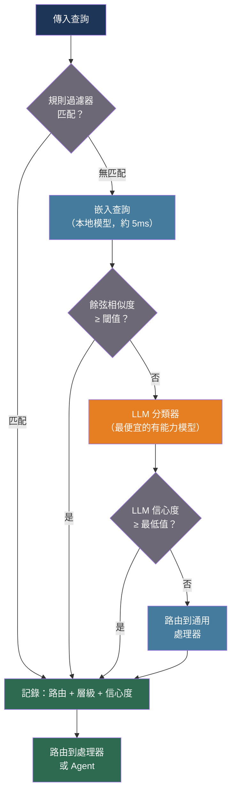

# [BEE-539] 基於 LLM 的分類與語義路由

:::info
語義路由以嵌入空間分類取代關鍵字和正則表達式調度——傳入查詢被編碼為向量，並與預編碼的路由範例進行比較，在單位數毫秒內以零 LLM API 成本產生路由決策。混合分層（規則 → 嵌入路由器 → LLM 後備）可達到 90% 以上的路由精度，同時將高成本模型呼叫減少多達 85%。
:::

## 背景

後端系統中的傳統請求路由使用字串謂詞：精確匹配、前綴檢查、正則表達式模式，或關鍵字測試的決策樹。這些方法在自然語言變體下脆弱易折——同一個支援問題以四種不同方式表達，除非每個變體都被明確列舉，否則會分叉到四個不同的程式碼路徑。詞彙不匹配問題在資訊檢索中早有記載；在路由中同樣有害。

Yin 等人（arXiv:1909.00161，2019 年）證明，自然語言推理（NLI）模型可以通過將每個候選標籤構建為假設並評分推理概率來執行零樣本文本分類——模型詢問「此文本是否蘊含它關於 {標籤} 的主張？」無需微調；標籤是在推理時定義的任意字串。這使得語義分類在路由定義頻繁變化的情況下變得實用。

RouteLLM 論文（Ong 等人，ICLR 2025，arXiv:2406.18665）正式確立了路由與偏好預測之間的聯繫：給定一個查詢，哪個模型層級——強且昂貴或弱且便宜——會產生使用者偏好的答案？其矩陣分解路由器，在 Chatbot Arena 人類偏好數據上訓練，在 MT Bench 上將 LLM 成本降低多達 85%，同時保持 GPT-4 品質的 95%。該路由器學習查詢複雜度信號，而非模型特定特徵，並遷移到未訓練過的模型對。

2025 年調查（arXiv:2502.00409）將路由策略分為四個系列：基於相似度（嵌入空間中的餘弦）、有監督分類（BERT 系列）、強化學習（情境多臂賭博機）和生成/LLM 系（提示評分）。關鍵發現：生成前路由——在任何昂貴的模型呼叫之前決定目標——在成本方面始終優於生成後級聯方案。最佳的生成前系統在 24% 的成本下達到 GPT-4 準確度的 97%。

BTZSC 基準測試（2026 年，arXiv:2603.11991）在 22 個數據集上提供了最新的零樣本條件下跨系列比較。嵌入模型（GTE-large-en-v1.5）佔據了實際的生產最優點：約 0.62 的宏 F1，延遲最低。重排器（Qwen3-Reranker-8B）以適中的延遲代價達到最高準確度（約 0.72 F1）。基於 LLM 的分類器（Mistral-Nemo 12B）達到 0.67 F1，但對於高請求量的即時路由來說速度太慢。

## 設計思考

每個路由系統都在三個變數之間取得平衡：

**延遲預算**：嵌入最近鄰查找在 CPU 上運行約 5 毫秒。NLI 交叉編碼器運行約 50–200 毫秒。LLM API 呼叫增加 500 毫秒至 2 秒。適當的分類器層級取決於哪個延遲預算可以接受，以及有多大比例的流量命中該層級。

**標籤穩定性**：如果路由是靜態且定義明確的（具有 20 個固定意圖類別的支援機器人），訓練好的基於嵌入的路由器是最優的。如果路由被頻繁新增、重命名或重新定義，NLI 零樣本分類（無需重訓練）或基於提示的 LLM 分類（提示中的標籤）更易於維護。

**信心分布**：真實流量並非整齊可分。一部分查詢會落在決策邊界附近，被任何單一分類器錯誤分類。正確的回應是級聯——不是回退到原始錯誤，而是升級到更有能力（且更昂貴）的分類器層級。嵌入層的良好校準信心閾值可以將 LLM 後備呼叫減少到流量的 10% 以下。

主導的生產模式是**混合分層**：

1. 規則過濾器以接近零的成本優先處理最高信心的已知情況（關鍵字匹配、使用者層級、明確標誌）。
2. 嵌入相似度路由器在毫秒內處理大部分流量。
3. LLM 分類器處理嵌入層無法置信解決的真正模糊情況。

## 最佳實踐

### 將路由定義為語義叢集，而非關鍵字列表

**應該（SHOULD）** 將每條路由定義為一組代表性的示例話語，而非關鍵字列表。示例話語在啟動時一次性編碼並儲存為質心（嵌入的均值）或完整向量集。在運行時，傳入查詢嵌入與所有路由質心進行比較：

```python
from dataclasses import dataclass, field
from anthropic import Anthropic

client = Anthropic()

@dataclass
class Route:
    name: str
    examples: list[str]
    description: str = ""
    _centroid: list[float] = field(default=None, init=False, repr=False)

    def encode(self, embed_fn) -> None:
        """預編碼示例；儲存均值作為質心。"""
        vecs = [embed_fn(ex) for ex in self.examples]
        n = len(vecs[0])
        self._centroid = [sum(v[i] for v in vecs) / len(vecs) for i in range(n)]

    @property
    def centroid(self) -> list[float]:
        if self._centroid is None:
            raise RuntimeError(f"路由 '{self.name}' 尚未編碼——請先呼叫 encode()")
        return self._centroid

# 使用自然語言示例定義路由，而非關鍵字列表
ROUTES = [
    Route(
        name="billing",
        description="關於發票、付款、退款或訂閱的問題",
        examples=[
            "我這個月被收費兩次",
            "如何更新我的付款方式？",
            "我可以退款上個月的費用嗎？",
            "我在哪裡可以查看我的發票？",
            "取消我的訂閱",
        ],
    ),
    Route(
        name="technical_support",
        description="產品問題、錯誤、故障或操作方法問題",
        examples=[
            "上傳文件時應用程式不斷崩潰",
            "我收到 500 錯誤",
            "如何配置 webhook URL？",
            "我的 API 金鑰無法使用",
            "儀表板中出現錯誤：連線逾時",
        ],
    ),
    Route(
        name="account",
        description="帳戶設置、存取、登入和團隊管理",
        examples=[
            "我無法登入我的帳戶",
            "如何重置我的密碼？",
            "將團隊成員加入我的工作空間",
            "更改我的電子郵件地址",
            "雙因素驗證設置",
        ],
    ),
]
```

**必須不（MUST NOT）** 對多個路由使用相同的示例話語。重疊的示例會降低質心分離度，並在決策邊界附近增加錯誤分類率。

### 使用嵌入相似度處理大部分流量

**應該（SHOULD）** 將主要路由層實現為對預計算路由質心的餘弦相似度比較。這不需要 LLM API 呼叫，在單位數毫秒內運行：

```python
import math

def cosine_similarity(a: list[float], b: list[float]) -> float:
    dot = sum(x * y for x, y in zip(a, b))
    mag_a = math.sqrt(sum(x * x for x in a))
    mag_b = math.sqrt(sum(x * x for x in b))
    if mag_a == 0 or mag_b == 0:
        return 0.0
    return dot / (mag_a * mag_b)

@dataclass
class RoutingResult:
    route_name: str | None      # None = 沒有路由達到閾值
    confidence: float           # 0.0–1.0 餘弦相似度
    second_best: str | None     # 用於監控模糊性
    second_confidence: float

def route_query(
    query: str,
    routes: list[Route],
    threshold: float = 0.75,
) -> RoutingResult:
    """
    嵌入查詢並找到相似度最高的路由。
    如果相似度低於閾值，回傳 None 路由名稱。
    """
    query_vec = embed_text(query)
    scores = [
        (route.name, cosine_similarity(query_vec, route.centroid))
        for route in routes
    ]
    scores.sort(key=lambda x: x[1], reverse=True)

    best_name, best_score = scores[0]
    second_name, second_score = scores[1] if len(scores) > 1 else (None, 0.0)

    return RoutingResult(
        route_name=best_name if best_score >= threshold else None,
        confidence=best_score,
        second_best=second_name,
        second_confidence=second_score,
    )
```

**應該（SHOULD）** 通過針對標記驗證集的離線校準來選擇相似度閾值——而非選擇任意的整數。適用於帳單與技術二元情況的閾值對於 20 個意圖的支援機器人（路由語義上更接近）可能過低。

### 以級聯方式分層規則、嵌入和 LLM

**必須（MUST）** 將路由實現為級聯，而非單一分類器。級聯首先應用更便宜的分類器，並僅對更便宜層級無法置信解決的查詢升級到更昂貴的分類器：

```python
import logging
from dataclasses import dataclass

logger = logging.getLogger(__name__)

@dataclass
class CascadeConfig:
    embedding_threshold: float = 0.75
    lm_fallback_model: str = "claude-haiku-4-5-20251001"

def rule_filter(query: str, metadata: dict) -> str | None:
    """
    第 0 層：最高信心情況的確定性規則。
    如果匹配則回傳路由名稱，否則回傳 None 傳遞到嵌入層。
    """
    user_tier = metadata.get("user_tier", "")
    if user_tier == "enterprise" and "dedicated" in query.lower():
        return "enterprise_support"
    if query.strip().startswith("/"):
        return "command"
    return None

def llm_classify(query: str, routes: list[Route], model: str) -> RoutingResult:
    """
    第 2 層：LLM 分類用於模糊查詢。
    使用結構化輸出提取路由名稱和信心度。
    """
    route_descriptions = "\n".join(
        f"- {r.name}: {r.description}" for r in routes
    )
    response = client.messages.create(
        model=model,
        max_tokens=64,
        messages=[{
            "role": "user",
            "content": (
                f"將此查詢分類為以下類別之一：\n"
                f"{route_descriptions}\n\n"
                f"查詢：{query}\n\n"
                f"回覆 JSON："
                f'{"{"}"route": "<名稱>", "confidence": <0.0-1.0>{"}"}'
            ),
        }],
    )
    import json
    data = json.loads(response.content[0].text)
    return RoutingResult(
        route_name=data.get("route"),
        confidence=float(data.get("confidence", 0.5)),
        second_best=None,
        second_confidence=0.0,
    )

def cascade_route(
    query: str,
    routes: list[Route],
    metadata: dict,
    config: CascadeConfig = CascadeConfig(),
) -> tuple[str | None, str, float]:
    """
    三層級聯：規則 → 嵌入 → LLM。
    回傳 (route_name, tier_used, confidence)。
    """
    # 第 0 層：規則過濾器
    rule_result = rule_filter(query, metadata)
    if rule_result:
        logger.info("route_via_rule", extra={"route": rule_result})
        return rule_result, "rule", 1.0

    # 第 1 層：嵌入相似度
    embedding_result = route_query(query, routes, threshold=config.embedding_threshold)
    if embedding_result.route_name:
        logger.info(
            "route_via_embedding",
            extra={
                "route": embedding_result.route_name,
                "confidence": round(embedding_result.confidence, 3),
                "second_best": embedding_result.second_best,
            },
        )
        return embedding_result.route_name, "embedding", embedding_result.confidence

    # 第 2 層：LLM 後備用於真正模糊的查詢
    logger.info(
        "route_via_llm_fallback",
        extra={"embedding_confidence": round(embedding_result.confidence, 3)},
    )
    llm_result = llm_classify(query, routes, config.lm_fallback_model)
    return llm_result.route_name, "llm", llm_result.confidence
```

**必須（MUST）** 記錄每個路由決策的 `tier_used` 和 `confidence`。沒有這些數據，您無法監控有多少流量命中昂貴的 LLM 層、檢測信心分布漂移，或使用數據調整閾值。

### 以標記驗證集校準閾值

**應該（SHOULD）** 在將閾值部署到生產之前，針對手動標記的驗證集測量路由準確度和層級分布。閾值調整是一個實證問題，而非分析問題：

```python
def evaluate_thresholds(
    validation_set: list[dict],
    routes: list[Route],
    thresholds: list[float] = None,
) -> list[dict]:
    """
    跨閾值值評估路由準確度和 LLM 後備率。
    使用此方法在成本限制內選擇最大化準確度的閾值。
    """
    if thresholds is None:
        thresholds = [round(t, 2) for t in [x / 100 for x in range(60, 96, 5)]]

    results = []
    for threshold in thresholds:
        correct = 0
        llm_escalations = 0

        for item in validation_set:
            result = route_query(item["query"], routes, threshold=threshold)
            if result.route_name is None:
                llm_escalations += 1
            elif result.route_name == item["expected_route"]:
                correct += 1

        total = len(validation_set)
        results.append({
            "threshold": threshold,
            "accuracy": correct / total,
            "llm_escalation_rate": llm_escalations / total,
        })

    return results
```

**應該（SHOULD）** 每季度或在流量分布發生重大變化後重新執行校準。嵌入模型是凍結的，但隨著產品演進和新使用者意圖出現，查詢分布會發生變化。

### 監控路由分布和信心漂移

**應該（SHOULD）** 追蹤路由意圖的分布以及每條路由的 P50/P95 信心分數作為運營指標。某條路由的平均信心持續下降，表明傳入查詢已偏離示例話語，需要更新路由定義：

```python
from collections import defaultdict

class RoutingMetrics:
    def __init__(self):
        self.route_counts: dict[str, int] = defaultdict(int)
        self.route_confidences: dict[str, list[float]] = defaultdict(list)
        self.tier_counts: dict[str, int] = defaultdict(int)

    def record(self, route: str | None, tier: str, confidence: float) -> None:
        label = route or "__unrouted__"
        self.route_counts[label] += 1
        self.route_confidences[label].append(confidence)
        self.tier_counts[tier] += 1

    def llm_tier_fraction(self) -> float:
        total = sum(self.tier_counts.values())
        return self.tier_counts.get("llm", 0) / total if total > 0 else 0.0
```

**應該（SHOULD）** 當 LLM 層比例超過定義的閾值（例如 15% 的流量）時發出警告。這表明嵌入路由器的覆蓋率正在下降——查詢分布已漂移，或出現了沒有匹配路由的新意圖。

## 視覺化



## 分類器方法比較

| 方法 | 延遲 | 每次請求成本 | 準確度（零樣本） | 標籤靈活性 | 最適用於 |
|---|---|---|---|---|---|
| 嵌入餘弦（質心） | 約 5ms（本地） | 接近零 | 良好分離路由約 90% | 需要示例 | 高流量、穩定意圖集 |
| NLI 零樣本（BART-MNLI） | 50–200ms（本地） | 接近零 | 約 0.58 宏 F1 | 標籤為自然語言 | 稀疏/變化標籤，無示例 |
| 嵌入（最佳，GTE-large） | 約 15ms | 接近零 | 約 0.62 宏 F1 | 需要示例 | 零樣本的生產最優點 |
| 重排器（Qwen3-Reranker-8B） | 約 200ms（GPU） | 接近零 | 約 0.72 宏 F1 | 需要示例或描述 | 最高準確度，中等延遲 |
| LLM 基於提示 | 500ms–2s | 每次請求 API 成本 | 約 0.67 宏 F1 | 任意（在提示中） | 模糊、低流量、動態標籤 |
| RouteLLM 學習路由器 | 約 10ms（推理） | 接近零（訓練後） | GPT-4 品質的 95% 成本 24% | 二元：強 vs 弱模型 | 最優成本的模型層級選擇 |

## 相關 BEE

- [BEE-513](513.md) -- AI 成本最佳化與模型路由：使用路由根據查詢複雜度選擇更便宜的模型層級
- [BEE-516](516.md) -- 嵌入模型與向量表示：相似度路由基礎的嵌入模型選擇
- [BEE-504](504.md) -- AI Agent 架構模式：路由到不同的專業 Agent 而非模型層級
- [BEE-517](517.md) -- 檢索重排與混合搜尋：重排器作為高準確度零樣本分類器的重新利用

## 參考資料

- [Ong et al. RouteLLM: Learning to Route LLMs with Preference Data — arXiv:2406.18665, ICLR 2025](https://arxiv.org/abs/2406.18665)
- [Survey: Routing Strategies for Resource Optimisation in LLM-Based Systems — arXiv:2502.00409, 2025](https://arxiv.org/html/2502.00409)
- [BTZSC Benchmark: Zero-Shot Text Classification Across Encoders, Embeddings, Rerankers and LLMs — arXiv:2603.11991, 2026](https://arxiv.org/html/2603.11991)
- [Yin et al. Benchmarking Zero-shot Text Classification — arXiv:1909.00161, 2019](https://arxiv.org/abs/1909.00161)
- [Aurelio AI. Semantic Router — github.com/aurelio-labs/semantic-router](https://github.com/aurelio-labs/semantic-router)
- [Red Hat. LLM Semantic Router: Intelligent Request Routing — developers.redhat.com, 2025](https://developers.redhat.com/articles/2025/05/20/llm-semantic-router-intelligent-request-routing)
