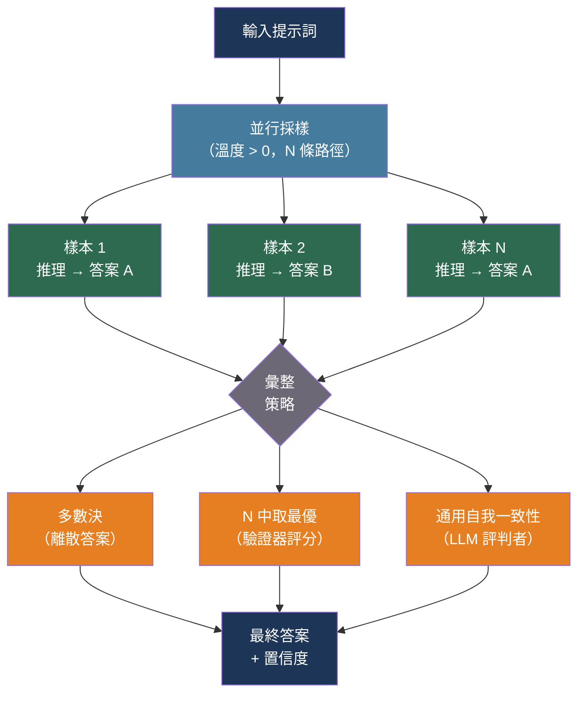

# [BEE-543] LLM 自我一致性與集成採樣

:::info
對同一提示詞多次採樣並彙整結果——透過多數決、驗證器模型或多樣化 LLM 集成——以 N 倍的 Token 消耗和延遲換取準確率，在推理任務上比單次貪婪解碼提升 6–18%。
:::

## 背景

語言模型在推理時是隨機的：對於相同輸入，從輸出分佈中不同的隨機採樣會產生不同的推理鏈，有時得出不同的答案。大多數生產系統透過將溫度設為 0（貪婪解碼）並將第一個答案視為權威結果來消除這種變異性。這種方式快速且廉價——但在需要多步驟推理的任務上往往出錯。

Wang 等人（2022 年）在 ICLR 2023 引入了自我一致性：不依賴單一推理鏈，而是在溫度 > 0 時採樣多條多樣化的推理鏈，然後對其最終答案進行多數決投票。在 GSM8K（小學數學）上，自我一致性採樣 40 個樣本比貪婪解碼的思維鏈提升了 +17.9%；在常識推理基準測試上的提升為 +3.9% 至 +12.2%。核心洞察在於：正確的推理路徑具有內部一致性——它們從不同角度收斂到相同答案——而錯誤路徑更容易發散。

N 中取最優（Best-of-N，BoN）採樣是相關但不同的技術：生成 N 個候選輸出，用獨立的驗證器或獎勵模型對每個輸出評分，返回得分最高的輸出。自我一致性透過多數決在 N 個 LLM 輸出中選擇，而 BoN 則依靠訓練好的品質信號進行選擇。BoN 是許多從人類回饋強化學習（RLHF）管道在測試時計算擴展（test-time compute scaling）中採用的方法。

Chen 等人（2023 年）將自我一致性擴展到開放式任務（程式碼生成、摘要），其中答案提取和精確匹配投票並不實用。他們的通用自我一致性（USC）讓 LLM 自身評估 N 個輸出中哪個與其他輸出最一致——以 LLM 為評判者的彙整步驟取代精確匹配投票。

Wang 等人（2024 年，Together AI）引入了混合代理（MoA）：不是對同一模型採樣 N 次，而是將提示詞路由到多樣化的 LLM 集合，收集所有輸出，然後由彙整器模型合成最終答案。MoA 在 AlpacaEval 2.0 上達到 65.1%，超越 GPT-4o 的 57.5%，透過利用不同模型家族的互補優勢實現了這一成績。

## 最佳實踐

### 在答案可提取的推理任務中使用自我一致性

當任務產生離散、可提取的答案（數字、類別標籤、是否、可執行測試的程式碼）時，**SHOULD**（應該）應用自我一致性。多數決投票僅在答案可進行等值比較時才有意義：

```python
import asyncio
import anthropic
from collections import Counter

async def self_consistent_answer(
    prompt: str,
    *,
    n: int = 9,
    temperature: float = 0.7,
    model: str = "claude-sonnet-4-20250514",
    max_tokens: int = 1024,
    extract_answer,  # Callable[[str], str | None]——從補全中提取最終答案
) -> tuple[str | None, float]:
    """
    採樣 `n` 個補全並返回多數決答案及其投票比例。

    extract_answer 必須從完整補全文字中解析答案。
    返回 (answer, confidence)，confidence = 勝出者票數 / n。
    若無可提取答案出現在多數中，則返回 (None, 0.0)。
    """
    client = anthropic.AsyncAnthropic()

    async def sample_once() -> str:
        response = await client.messages.create(
            model=model,
            max_tokens=max_tokens,
            temperature=temperature,
            messages=[{"role": "user", "content": prompt}],
        )
        return response.content[0].text

    completions = await asyncio.gather(*[sample_once() for _ in range(n)])

    # 從每個補全中提取最終答案
    answers = [extract_answer(c) for c in completions]
    valid_answers = [a for a in answers if a is not None]

    if not valid_answers:
        return None, 0.0

    counter = Counter(valid_answers)
    majority_answer, majority_count = counter.most_common(1)[0]
    confidence = majority_count / n

    return majority_answer, confidence
```

採樣自我一致性時，**MUST**（必須）將溫度設為高於 0。貪婪解碼（temperature=0）會產生相同輸出——你將付出 N 倍成本換取相同答案 N 次。溫度 0.5–0.8 可在不犧牲連貫性的前提下產生足夠的多樣性。

**SHOULD**（應該）使用奇數 N（7、9、11）以防止多數決票數相同。對於二元結果的分類任務，N=5 已足夠；對於複雜推理，N=9–11 提供可靠的信號並保持可控的成本。

### 提示模型在最終答案前展示推理過程

自我一致性有賴於每個樣本在推理鏈後產生可提取的最終答案。推理路徑本身不是信號——答案才是。建構提示詞以引發思維鏈推理，隨後給出清晰標記的答案：

```python
MATH_COT_PROMPT = """逐步解決以下問題。在你的推理過程後，
用以下格式在獨立一行寫出最終答案：
ANSWER: <數字>

問題：{problem}"""

import re

def extract_numeric_answer(completion: str) -> str | None:
    """從思維鏈補全中提取 'ANSWER:' 後的數字。"""
    match = re.search(r"ANSWER:\s*(-?\d+(?:\.\d+)?)", completion, re.IGNORECASE)
    return match.group(1) if match else None
```

### 有品質信號時採用 Best-of-N

有驗證器、測試套件或獎勵模型可對輸出評分時，**SHOULD**（應該）使用 Best-of-N。程式碼生成是最清晰的案例：對 N 個生成的程式各自執行測試套件，返回第一個通過所有測試的程式。這是 Codex 論文（Chen 等人，2021 年）正式化的「pass@k」評估模式：

```python
async def best_of_n_with_tests(
    code_prompt: str,
    test_cases: list[str],
    *,
    n: int = 5,
    temperature: float = 0.8,
    model: str = "claude-sonnet-4-20250514",
) -> str | None:
    """
    生成 N 個程式碼補全並返回第一個通過所有測試案例的結果。
    一旦找到通過的解答就提前終止。
    """
    client = anthropic.AsyncAnthropic()

    async def generate_one() -> str:
        response = await client.messages.create(
            model=model,
            max_tokens=2048,
            temperature=temperature,
            messages=[{"role": "user", "content": code_prompt}],
        )
        return response.content[0].text

    candidates = await asyncio.gather(*[generate_one() for _ in range(n)])

    for candidate in candidates:
        code = extract_code_block(candidate)
        if code and passes_all_tests(code, test_cases):
            return code

    return None  # 無候選通過；呼叫方可回退或返回最佳部分結果
```

輸出為開放式散文時，**MUST NOT**（絕對不能）在 Best-of-N 中使用多數決。對自由文字的多數決是未定義的。對於散文任務，使用獎勵模型評分器或通用自我一致性。

### 對開放式任務使用通用自我一致性

對於沒有可提取離散答案的任務（摘要、翻譯品質、開放式問答），**SHOULD**（應該）使用 LLM 本身作為彙整器。通用自我一致性採樣 N 個輸出，然後指示獨立的 LLM 呼叫識別哪個輸出與所有樣本的共識最為一致：

```python
USC_AGGREGATION_PROMPT = """以下是對同一問題的 {n} 個候選回應。
識別哪個回應與多數最為一致，並逐字返回它。

問題：
{question}

候選回應：
{candidates}

僅返回選定的回應，不加任何額外評論。"""

async def universal_self_consistency(
    question: str,
    *,
    n: int = 7,
    temperature: float = 0.7,
    model: str = "claude-sonnet-4-20250514",
    aggregator_model: str = "claude-haiku-4-5-20251001",  # 使用更廉價的模型進行彙整
) -> str:
    """
    採樣 n 個回應，然後使用 LLM 彙整器選擇最一致的那個。
    彙整步驟使用更廉價的模型以控制成本。
    """
    client = anthropic.AsyncAnthropic()

    async def sample_once() -> str:
        r = await client.messages.create(
            model=model, max_tokens=1024, temperature=temperature,
            messages=[{"role": "user", "content": question}],
        )
        return r.content[0].text

    candidates = await asyncio.gather(*[sample_once() for _ in range(n)])
    candidates_block = "\n\n".join(
        f"[回應 {i+1}]\n{c}" for i, c in enumerate(candidates)
    )

    agg_response = await client.messages.create(
        model=aggregator_model,
        max_tokens=1024,
        temperature=0,   # 確定性彙整
        messages=[{"role": "user", "content": USC_AGGREGATION_PROMPT.format(
            n=n, question=question, candidates=candidates_block,
        )}],
    )
    return agg_response.content[0].text
```

### 置信度足夠時提前停止

**SHOULD**（應該）實作自適應採樣：從小批次開始，檢查領先答案是否已具主導多數，並在達到最大 N 之前停止。自適應自我一致性的研究顯示，在準確率下降不到 0.1% 的情況下，可減少最多 7.9 倍的採樣數：

```python
async def adaptive_self_consistent_answer(
    prompt: str,
    *,
    min_samples: int = 3,
    max_samples: int = 15,
    confidence_threshold: float = 0.70,
    temperature: float = 0.7,
    model: str = "claude-sonnet-4-20250514",
    extract_answer,
) -> tuple[str | None, float, int]:
    """
    採樣直到置信度 >= 閾值或達到 max_samples。
    返回 (answer, confidence, samples_used)。
    """
    client = anthropic.AsyncAnthropic()
    answers: list[str] = []

    async def sample_once() -> str:
        r = await client.messages.create(
            model=model, max_tokens=1024, temperature=temperature,
            messages=[{"role": "user", "content": prompt}],
        )
        return r.content[0].text

    # 第一批：並行採樣 min_samples 個
    first_batch = await asyncio.gather(*[sample_once() for _ in range(min_samples)])
    answers = [extract_answer(c) for c in first_batch]
    answers = [a for a in answers if a is not None]

    for _ in range(max_samples - min_samples):
        if answers:
            counter = Counter(answers)
            leader, leader_count = counter.most_common(1)[0]
            confidence = leader_count / len(answers)
            if confidence >= confidence_threshold:
                return leader, confidence, len(answers)

        # 再採樣一個並再次檢查
        completion = await sample_once()
        answer = extract_answer(completion)
        if answer:
            answers.append(answer)

    if not answers:
        return None, 0.0, max_samples

    counter = Counter(answers)
    leader, leader_count = counter.most_common(1)[0]
    return leader, leader_count / len(answers), len(answers)
```

### 知道何時不使用集成採樣

**MUST NOT**（絕對不能）將自我一致性應用於事實查找任務（答案在檢索文件中的 RAG 問答，或直接事實回溯）。隨機採樣會引入幻覺變異性；多數決無法糾正跨樣本共享的系統性幻覺。

**MUST NOT**（絕對不能）在串流 UX 情境中應用自我一致性。在顯示任何輸出之前生成 N 個完整回應會增加使用者可感知且具干擾性的延遲。自我一致性適用於後台處理、非同步作業佇列和批次管道。

**SHOULD NOT**（不應）將自我一致性應用於 N 倍成本無法被準確率提升所合理化的任務。置信度分類、意圖偵測和路由決策通常在各樣本間相當穩定——貪婪解碼已足夠。

## 流程圖



## 採樣策略比較

| 策略 | 彙整方式 | 最適用於 | 成本 | 延遲 |
|---|---|---|---|---|
| 自我一致性 | 多數決 | 數學、分類、結構化提取 | N 倍輸入 + N 倍輸出 | N 次並行呼叫 |
| N 中取最優 | 驗證器/測試套件 | 程式碼生成、可驗證任務 | N 倍生成 + 驗證器 | N 次呼叫 + 驗證 |
| 通用自我一致性 | LLM 評判者 | 開放式散文、摘要 | N 倍生成 + 1 次彙整呼叫 | N 次呼叫 + 1 次串行步驟 |
| 混合代理 | LLM 合成 | 受益於模型多樣性的任務 | N 次不同模型呼叫 + 1 次合成 | N 次呼叫 + 1 次串行步驟 |

## 混合代理

混合代理（MoA，Wang 等人 2024 年）將集成採樣跨模型多樣性而非隨機重複擴展。第 1 層的每個代理獨立處理提示詞；第 2 層的彙整器接收所有輸出作為上下文並合成最終答案。性能提升源於不同模型家族具有互補的優勢和盲點：

```python
async def mixture_of_agents(
    prompt: str,
    *,
    proposer_models: list[str],
    aggregator_model: str,
) -> str:
    """
    第 1 層：所有提案模型獨立生成。
    第 2 層：彙整器合成最佳最終答案。
    """
    client = anthropic.AsyncAnthropic()

    async def call_model(model: str) -> str:
        r = await client.messages.create(
            model=model, max_tokens=1024, temperature=0.7,
            messages=[{"role": "user", "content": prompt}],
        )
        return r.content[0].text

    # 第 1 層：並行扇出到多樣化模型
    proposals = await asyncio.gather(*[call_model(m) for m in proposer_models])

    proposals_block = "\n\n".join(
        f"[模型 {i+1} 回應]\n{p}" for i, p in enumerate(proposals)
    )
    synthesis_prompt = (
        f"以下是多個模型的回應集合。\n"
        f"將這些回應合成為一個高品質的單一回應：\n\n"
        f"{proposals_block}\n\n"
        f"原始問題：{prompt}"
    )

    # 第 2 層：彙整器合成
    r = await client.messages.create(
        model=aggregator_model, max_tokens=2048, temperature=0,
        messages=[{"role": "user", "content": synthesis_prompt}],
    )
    return r.content[0].text
```

## 相關 BEE

- [BEE-525](525.md) -- 思維鏈與延伸思考模式：自我一致性建立在思維鏈提示之上；延伸思考是改善推理的替代路徑
- [BEE-527](527.md) -- LLM 批次處理模式：跨大型文件集的自我一致性是批次工作負載；批次 API 降低 N 個樣本的每次呼叫成本
- [BEE-541](541.md) -- LLM 供應商速率限制：N 樣本扇出會成倍增加 Token 消耗，需要足夠的配額餘量
- [BEE-513](513.md) -- AI 成本最佳化與模型路由：當任務允許時，將 N 個樣本路由到較廉價的模型，保留昂貴模型用於彙整步驟

## 參考資料

- [Wang et al. Self-Consistency Improves Chain of Thought Reasoning in Language Models — arXiv:2203.11171, ICLR 2023](https://arxiv.org/abs/2203.11171)
- [Chen et al. Universal Self-Consistency for Large Language Model Generation — arXiv:2311.17311, 2023](https://arxiv.org/abs/2311.17311)
- [Wang et al. Mixture-of-Agents Enhances Large Language Model Capabilities — arXiv:2406.04692, 2024](https://arxiv.org/abs/2406.04692)
- [AWS. Enhance Performance of Generative Language Models with Self-Consistency Prompting on Amazon Bedrock — aws.amazon.com](https://aws.amazon.com/blogs/machine-learning/enhance-performance-of-generative-language-models-with-self-consistency-prompting-on-amazon-bedrock/)
- [Chen et al. Evaluating Large Language Models Trained on Code (Codex / pass@k) — arXiv:2107.03374, 2021](https://arxiv.org/abs/2107.03374)
- [Prompt Engineering Guide. Self-Consistency — promptingguide.ai](https://www.promptingguide.ai/techniques/consistency)
