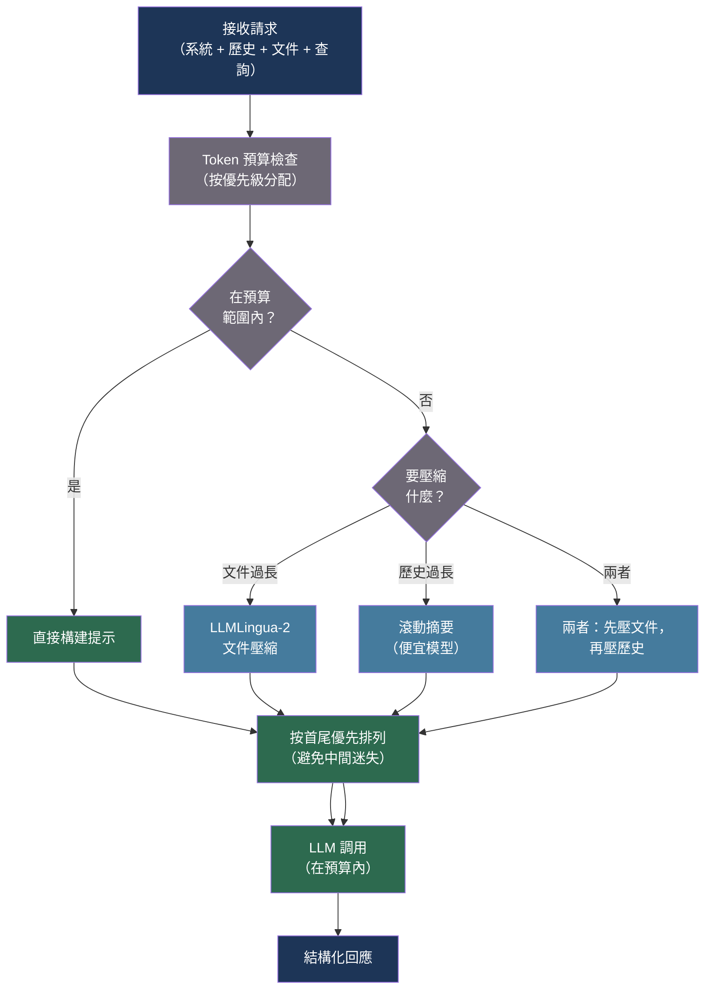

# [BEE-549] LLM 提示壓縮與 Token 效率

:::info
上下文視窗有限、昂貴，且注意力在各位置分佈不均——提示壓縮在保留模型所需語義內容的前提下，減少 token 數量。技術從困惑度引導的 token 選擇到學習壓縮嵌入，壓縮比因可接受的準確率取捨而異，範圍從 2× 到 20×。
:::

## 背景

語言模型對上下文視窗中的每個 token 收費——包括每次請求的輸入 token，如系統提示、檢索文件，以及在多輪之間不會改變的對話歷史。隨著應用從原型擴展到生產環境，token 費用比功能列表增長得更快：一個檢索五份 500-token 文件的 RAG 系統，加上 800-token 的系統提示和 1,200-token 的對話歷史，在使用者輸入任何內容之前，每輪已耗費 4,500 個輸入 token。

除了成本，上下文長度還影響延遲（預填充時間與輸入長度線性增長）以及——出乎意料地——品質。Liu et al.（2023）記錄了「中間迷失（lost-in-the-middle）」效應：當相關資訊位於長上下文的中間時，模型表現顯著變差，即使答案存在，從 1 份到 20 份文件的設定下，檢索準確率下降了 20 個百分點。更長並不總是更好。

Jiang et al.（2023）在 Microsoft Research 提出了 LLMLingua（EMNLP 2023），一個粗到細的壓縮管道。一個小型語言模型（GPT-2 級別）為原始提示中的每個 token 分配困惑度分數；困惑度低的 token（模型認為可預測的）是可刪除的候選項。預算控制器在提示的結構組件（指令、示範、查詢）之間分配整體壓縮比，迭代式 token 級壓縮器在保留語法有效性的同時刪除資訊量最低的 token。該方法在上下文學習基準上實現高達 20× 的壓縮，大多數任務的準確率損失不超過 5%。

LLMLingua-2（Jiang et al.，ACL 2024 Findings，arXiv:2403.12968）將壓縮重新定義為透過 GPT-4 資料蒸餾的 token 分類任務：訓練一個小型雙向編碼器，根據蒸餾標注將每個 token 標記為「保留」或「丟棄」，然後在推理時應用分類器，而無需迭代精煉步驟。這在相近壓縮比（2–5×）下比 LLMLingua 快 3–6 倍，使其適用於延遲敏感的管道。

Mu et al.（2023，NeurIPS 2023，arXiv:2304.08467）提出了 Gist tokens：透過修改注意力遮罩訓練的特殊可學習嵌入，充當提示的壓縮表示。對於任務特定部署，可實現 26× 的壓縮比和 40% 的 FLOPs 減少，但需要微調——這一限制使其僅適用於擁有自託管模型和訓練基礎設施的團隊。

## 最佳實踐

### 在調用模型前強制執行 Token 預算

**MUST**（必須）在構建請求前，跨所有上下文組件——系統提示、檢索上下文、對話歷史和輸出保留——追蹤 token 消耗。不受控的上下文增長是成本失控和靜默品質降級的根本原因：

```python
import tiktoken
from dataclasses import dataclass, field

MODEL_CONTEXT_LIMITS = {
    "claude-sonnet-4-20250514": 200_000,
    "claude-haiku-4-5-20251001": 200_000,
    "gpt-4o": 128_000,
}

OUTPUT_RESERVE = {
    "default": 2_048,
    "long_generation": 8_192,
}

@dataclass
class TokenBudget:
    model: str
    output_reserve: int = 2_048
    _components: dict[str, int] = field(default_factory=dict)

    @property
    def context_limit(self) -> int:
        return MODEL_CONTEXT_LIMITS.get(self.model, 128_000)

    @property
    def input_budget(self) -> int:
        return self.context_limit - self.output_reserve

    @property
    def used(self) -> int:
        return sum(self._components.values())

    @property
    def remaining(self) -> int:
        return self.input_budget - self.used

    def count(self, text: str) -> int:
        enc = tiktoken.get_encoding("cl100k_base")
        return len(enc.encode(text))

    def allocate(self, name: str, text: str) -> bool:
        """
        嘗試為具名組件分配 token。
        若超出輸入預算則返回 False。
        """
        tokens = self.count(text)
        if self.used + tokens > self.input_budget:
            return False
        self._components[name] = tokens
        return True

    def summary(self) -> dict:
        return {
            "model": self.model,
            "context_limit": self.context_limit,
            "output_reserve": self.output_reserve,
            "input_budget": self.input_budget,
            "used": self.used,
            "remaining": self.remaining,
            "components": dict(self._components),
        }

def build_prompt_with_budget(
    system: str,
    history: list[dict],
    documents: list[str],
    query: str,
    model: str = "claude-sonnet-4-20250514",
) -> tuple[str, list[dict]]:
    """
    按優先順序組裝提示組件。
    當預算耗盡時，丟棄低優先級組件（較舊的歷史、多餘的文件），
    而非靜默地在內容中途截斷。
    """
    budget = TokenBudget(model=model)

    # 優先級 1：系統提示（必須始終容納）
    if not budget.allocate("system", system):
        raise ValueError("System prompt exceeds input budget — reduce system prompt")

    # 優先級 2：當前查詢（必須始終容納）
    if not budget.allocate("query", query):
        raise ValueError("Query exceeds remaining budget")

    # 優先級 3：文件（最相關的優先，超出預算則丟棄末尾）
    included_docs = []
    for i, doc in enumerate(documents):
        if budget.allocate(f"doc_{i}", doc):
            included_docs.append(doc)
        # 否則：靜默丟棄此文件並記錄

    # 優先級 4：歷史（最新的優先，超出預算則丟棄最舊的）
    included_history = []
    for msg in reversed(history):
        text = msg.get("content", "")
        if budget.allocate(f"history_{len(included_history)}", text):
            included_history.insert(0, msg)
        # 否則：停止添加歷史

    return "\n\n".join(included_docs), included_history
```

**MUST NOT**（不得）在不考慮結構的情況下，在字元或 token 數量處靜默截斷字串——截斷的 JSON 物件或中途截斷的文件會導致模型推理破損的上下文。

### 對檢索文件使用 LLMLingua 壓縮

**SHOULD**（應該）在將檢索文件包含到上下文之前，先應用 LLMLingua 或 LLMLingua-2。檢索文件通常包含冗餘的背景文字、格式和樣板，貢獻 token 但缺乏資訊量。2–5× 的壓縮比在檢索增強型問答任務上可實現不超過 3% 的準確率損失：

```python
# 需要：pip install llmlingua
from llmlingua import PromptCompressor

# 在應用啟動時初始化一次——載入小型壓縮語言模型
compressor = PromptCompressor(
    model_name="microsoft/llmlingua-2-xlm-roberta-large-meetingbank",
    use_llmlingua2=True,   # LLMLingua-2 在相近壓縮比下速度更快
    device_map="cpu",      # CPU 對壓縮模型已足夠
)

def compress_retrieved_documents(
    documents: list[str],
    query: str,
    target_ratio: float = 0.4,   # 保留 40% 的 token
    target_token: int = -1,       # 或指定絕對目標 token 數
) -> list[str]:
    """
    相對於查詢壓縮檢索文件列表。
    壓縮器保留與查詢最相關的 token。
    target_ratio=0.4 在 NQ 資料集上提供約 2.5x 壓縮和約 97% 準確率。
    """
    compressed = []
    for doc in documents:
        result = compressor.compress_prompt(
            context=[doc],
            question=query,
            target_token=target_token if target_token > 0 else -1,
            rate=target_ratio,
            force_tokens=["\n", ".", "!", "?"],   # 保留句子邊界
        )
        compressed.append(result["compressed_prompt"])
    return compressed

def compress_rag_context(
    documents: list[str],
    query: str,
    budget_tokens: int,
) -> str:
    """
    壓縮並合併文件以符合 token 預算。
    根據文件總長度與預算的比例動態計算壓縮比。
    """
    enc = tiktoken.get_encoding("cl100k_base")
    total_tokens = sum(len(enc.encode(d)) for d in documents)

    if total_tokens <= budget_tokens:
        return "\n\n".join(documents)   # 不需要壓縮

    target_ratio = budget_tokens / total_tokens
    # 鉗制：低於 0.2 會有語義崩潰風險
    target_ratio = max(0.2, min(target_ratio, 1.0))

    compressed = compress_retrieved_documents(documents, query, target_ratio)
    return "\n\n".join(compressed)
```

**SHOULD** 僅對上下文組件應用壓縮，而非對指令或查詢本身。壓縮指令會顯著降低任務遵從性；壓縮查詢會丟失模型所需的意圖。

### 以摘要壓縮對話歷史

**SHOULD** 以運行摘要取代長對話中最舊的輪次，而非直接丟棄。丟棄上下文只有在被丟棄的輪次真正無關時才是無損的——但在大多數應用中，模型需要了解之前討論的內容，以避免自相矛盾或重複資訊：

```python
import anthropic

SUMMARY_SYSTEM = """You are a conversation summarizer. Given a conversation transcript,
produce a concise summary that preserves:
- All decisions made and commitments given
- Key facts established
- Unresolved questions
- The user's stated goals

Be terse. Omit pleasantries and repetition. Output only the summary paragraph."""

async def rolling_summary_compression(
    history: list[dict],
    *,
    model: str = "claude-haiku-4-5-20251001",   # 使用便宜模型進行摘要
    keep_recent_turns: int = 6,
    summary_token_budget: int = 300,
) -> list[dict]:
    """
    將舊的對話輪次壓縮為摘要訊息。
    逐字保留最近的 keep_recent_turns 輪次。
    以單一摘要訊息取代較舊的輪次。
    """
    if len(history) <= keep_recent_turns:
        return history

    to_summarize = history[:-keep_recent_turns]
    to_keep = history[-keep_recent_turns:]

    # 僅當有內容可摘要時才進行
    transcript = "\n".join(
        f"{m['role'].upper()}: {m['content']}"
        for m in to_summarize
    )

    client = anthropic.AsyncAnthropic()
    resp = await client.messages.create(
        model=model,
        max_tokens=summary_token_budget,
        system=SUMMARY_SYSTEM,
        messages=[{"role": "user", "content": f"Conversation to summarize:\n{transcript}"}],
    )
    summary_text = resp.content[0].text

    # 將摘要作為合成使用者輪次前置，使模型能看到上下文
    summary_message = {
        "role": "user",
        "content": f"[Earlier conversation summary]: {summary_text}",
    }
    # 配對助理確認以保持角色交替有效
    summary_ack = {
        "role": "assistant",
        "content": "Understood. I have the context from our earlier discussion.",
    }

    return [summary_message, summary_ack] + to_keep
```

**SHOULD** 使用更便宜的小型模型進行摘要——壓縮步驟不需要與主要模型相同的能力，且摘要延遲會增加使用者感知的端對端延遲。Claude Haiku 或 GPT-4o-mini 均適用。

### 將高優先級內容置於上下文邊界

**SHOULD** 構建上下文時，使最關鍵的資訊出現在提示的開頭或結尾，而非中間。「中間迷失」效應（Liu et al., 2023）在相關內容被埋沒在長文件列表中間時最為明顯：

```python
def order_documents_for_attention(
    documents: list[dict],   # 每個包含 "text" 和 "relevance_score"
    strategy: str = "primacy_recency",
) -> list[str]:
    """
    為緩解「中間迷失」效應而排列文件順序。
    
    primacy_recency：最相關的在最前和最後，最不相關的在中間
    primacy：最相關的在最前（適用於答案靠近頂部的任務）
    """
    sorted_docs = sorted(documents, key=lambda d: d["relevance_score"], reverse=True)

    if strategy == "primacy":
        return [d["text"] for d in sorted_docs]

    if strategy == "primacy_recency":
        if len(sorted_docs) <= 2:
            return [d["text"] for d in sorted_docs]
        # 交錯排列：高相關性在首尾，低相關性在中間
        result = []
        top = sorted_docs[:len(sorted_docs) // 2]
        bottom = sorted_docs[len(sorted_docs) // 2:]
        result.extend(d["text"] for d in top)
        result.extend(d["text"] for d in reversed(bottom))
        return result

    return [d["text"] for d in sorted_docs]
```

## 視覺化



## 壓縮方法比較

| 方法 | 壓縮比 | 品質保留 | 需要微調 | 延遲開銷 | 最適用場景 |
|---|---|---|---|---|---|
| Token 預算強制執行 | N/A（選擇） | 取決於優先級 | 否 | 可忽略 | 所有應用 |
| LLMLingua | 2–20× | ~95%（5× 時） | 否 | 中等（迭代） | 上下文學習、大型系統提示 |
| LLMLingua-2 | 2–5× | ~98%（2× 時） | 否 | 低（分類器） | 生產 RAG、延遲敏感場景 |
| GIST tokens | 26× | ~95% | 是（微調） | 推理時低 | 自託管、任務特定 |
| 滾動摘要 | 歷史約 5–10× | 高（語義） | 否 | 低（便宜模型） | 多輪對話智能體 |
| 首尾優先排列 | N/A（排列） | 提升約 10% | 否 | 可忽略 | 長文件 RAG |

## 常見錯誤

**壓縮指令或查詢。** LLMLingua 設計用於上下文壓縮，而非指令壓縮。將其應用於系統指令會導致任務遵從性急劇下降，因為指令 token 承載著不成比例的語義權重。

**設置低於 0.2（5× 或更高）的壓縮比。** 在事實問答任務中，超過 5× 的壓縮比會導致可測量且累進的準確率損失。500xCompressor 論文記錄了極端壓縮比下 27–38% 的能力損失。僅對低風險背景上下文應用最大壓縮，絕不對事實聲明的支撐證據使用。

**不記錄丟棄的上下文。** 在預算耗盡時靜默丟棄文件或歷史輪次，使除錯幾乎不可能。始終記錄哪些組件在什麼 token 數量時被丟棄。

**使用主要模型進行摘要。** 使用主要模型進行滾動歷史摘要會使調用成本翻倍。便宜的小型模型足以從對話歷史中提取承諾和事實。

**未在預算中考慮輸出 token。** 不保留輸出預算會迫使模型截斷回應。輸出保留量必須根據預期的回應長度設定，而非以上下文限制減去零。

## 相關 BEE

- [BEE-512](512.md) -- LLM 上下文視窗管理：補充壓縮的上下文視窗策略和滑動視窗方法
- [BEE-526](526.md) -- LLM 快取策略：供應商層面的提示快取消除重複相同前綴的 token 成本——壓縮前的第一道防線
- [BEE-519](519.md) -- 長期執行智能體的 AI 記憶系統：情節記憶和語義記憶架構，從根本上減少需要進入上下文的內容
- [BEE-531](531.md) -- 進階 RAG 與智能體檢索模式：在應用壓縮前減少文件數量的選擇性檢索

## 參考資料

- [Jiang et al. LLMLingua: Compressing Prompts for Accelerated Inference of Large Language Models — arXiv:2310.05736, EMNLP 2023](https://arxiv.org/abs/2310.05736)
- [Jiang et al. LLMLingua-2: Data Distillation for Efficient and Faithful Task-Agnostic Prompt Compression — arXiv:2403.12968, ACL 2024](https://arxiv.org/abs/2403.12968)
- [Mu et al. Learning to Compress Prompts with Gist Tokens — arXiv:2304.08467, NeurIPS 2023](https://arxiv.org/abs/2304.08467)
- [Li et al. 500xCompressor: Generalized Prompt Compression for Large Language Models — arXiv:2408.03094, ACL 2025](https://arxiv.org/abs/2408.03094)
- [Li et al. Prompt Compression for Large Language Models: A Survey — arXiv:2410.12388, NAACL 2025](https://arxiv.org/abs/2410.12388)
- [Liu et al. Lost in the Middle: How Language Models Use Long Contexts — arXiv:2307.03172, 2023](https://arxiv.org/abs/2307.03172)
- [Microsoft LLMLingua GitHub Repository — github.com/microsoft/LLMLingua](https://github.com/microsoft/LLMLingua)
- [Anthropic Engineering. Effective Context Engineering for AI Agents — anthropic.com](https://www.anthropic.com/engineering/effective-context-engineering-for-ai-agents)
