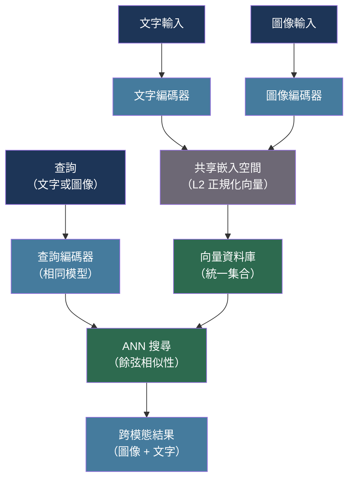

# [BEE-557] 多模態嵌入向量與跨模態檢索

:::info
多模態嵌入模型將圖片、文字和其他模態投影到共享向量空間，實現跨模態檢索：找到符合文字查詢的圖片，或找到與圖片相似的文字文件。關鍵架構挑戰是跨模態對齊嵌入空間，使語義等價的表示落在彼此附近，無論來源模態為何。
:::

## 背景脈絡

單模態嵌入向量（BEE-516）對單一輸入類型操作：文字對文字的相似性需要文字嵌入，圖片對圖片的相似性需要圖片嵌入。跨模態檢索 — 從文字查詢找到圖片，或從圖片找到文字 — 需要一個共享嵌入空間，使不同模態的表示在幾何上對齊。

Radford、Kim、Hallacy、Ramesh、Goh、Agarwal、Sastry、Askell、Mishkin、Clark、Krueger 和 Sutskever（arXiv:2103.00020，「從自然語言監督中學習可遷移視覺模型」，ICML 2021）介紹了 CLIP（對比語言-圖像預訓練）。CLIP 使用對比損失聯合訓練圖像編碼器和文字編碼器：對於一批（圖像，文字）對，模型最大化匹配對之間的餘弦相似性並最小化不匹配對之間的餘弦相似性。在從網路收集的 4 億個（圖像，文字）對上訓練後，CLIP 的共享嵌入空間無需任何任務特定微調即可實現零樣本跨模態檢索。

Zhai、Kolesnikov、Houlsby 和 Beyer（ICCV 2023，「語言圖像預訓練的 Sigmoid 損失」）引入了 SigLIP，用逐對 sigmoid 損失取代 CLIP 的基於 softmax 的對比損失。SigLIP 消除了對大批次大小的依賴（使 CLIP 的對比訓練在小批次大小下不穩定），並在圖像文字對齊基準測試中以每個訓練計算達到更好的準確性。

Girdhar、El-Nouby、Liu、Singh、Alwala、Joulin 和 Misra（arXiv:2305.05665，「ImageBind：一個嵌入空間綁定一切」，CVPR 2023）將 CLIP 範式擴展到六種模態：圖像、文字、音頻、視頻、深度和 IMU 感測器數據。ImageBind 使用圖像作為「綁定」模態 — 它使用成對的（模態，圖像）數據訓練每個非圖像模態與圖像空間的對齊 — 實現從未直接共同訓練的模態對之間的跨模態檢索。

對後端工程師而言，部署多模態檢索需要決定運行哪個嵌入模型、是在本地託管嵌入還是調用 API，以及如何在單一向量數據庫查詢路徑中存儲和索引圖像和文字向量。

## 最佳實踐

### 在相同嵌入空間中編碼圖像和文字

**必須**（MUST）對跨模態檢索任務使用經過跨模態對齊訓練的模型。分別訓練的圖像和文字嵌入器產生不相容的向量空間 — 它們之間的餘弦相似性毫無意義：

```python
from dataclasses import dataclass
import torch
import numpy as np
from PIL import Image

@dataclass
class MultimodalEmbedder:
    """
    包裝 CLIP 系列模型（CLIP、SigLIP、OpenCLIP）以
    在共享向量空間中進行聯合圖像 + 文字嵌入。
    """
    model_name: str = "openai/clip-vit-base-patch32"
    device: str = "cpu"

    def __post_init__(self):
        from transformers import CLIPModel, CLIPProcessor
        self.model = CLIPModel.from_pretrained(self.model_name).to(self.device)
        self.processor = CLIPProcessor.from_pretrained(self.model_name)
        self.model.eval()

    def embed_text(self, texts: list[str]) -> np.ndarray:
        """將文字字串編碼為單位正規化向量。"""
        inputs = self.processor(text=texts, return_tensors="pt", padding=True).to(self.device)
        with torch.no_grad():
            features = self.model.get_text_features(**inputs)
        # L2 正規化使餘弦相似性 == 點積
        features = features / features.norm(dim=-1, keepdim=True)
        return features.cpu().numpy()

    def embed_images(self, images: list[Image.Image]) -> np.ndarray:
        """將 PIL 圖像編碼為單位正規化向量。"""
        inputs = self.processor(images=images, return_tensors="pt").to(self.device)
        with torch.no_grad():
            features = self.model.get_image_features(**inputs)
        features = features / features.norm(dim=-1, keepdim=True)
        return features.cpu().numpy()

    def cross_modal_similarity(
        self,
        query_text: str,
        candidate_images: list[Image.Image],
    ) -> list[float]:
        """返回文字到圖像檢索的餘弦相似性分數。"""
        text_vec = self.embed_text([query_text])          # (1, D)
        image_vecs = self.embed_images(candidate_images)  # (N, D)
        # 單位向量的點積 == 餘弦相似性
        scores = (image_vecs @ text_vec.T).flatten()
        return scores.tolist()
```

**應該**（SHOULD）根據延遲和準確性需求選擇嵌入模型：

| 模型 | 嵌入維度 | 優勢 | 推理方式 |
|---|---|---|---|
| CLIP ViT-B/32 | 512 | 快速，廣泛支援 | 本地或 API |
| CLIP ViT-L/14 | 768 | 更好的準確性 | 本地，建議 GPU |
| SigLIP ViT-B/16 | 768 | 更好的小批次訓練，準確性良好 | 本地 |
| OpenCLIP（大型變體） | 1024+ | 最佳開源準確性 | 需要 GPU |

### 在同一集合中存儲圖像和文字向量

**必須**（MUST）在建立統一檢索索引時將圖像和文字嵌入存儲在同一向量集合中。將它們拆分到不同集合中需要分開查詢和手動合併步驟：

```python
import uuid
from dataclasses import dataclass, field
from enum import Enum

class ModalityType(Enum):
    TEXT = "text"
    IMAGE = "image"

@dataclass
class MultimodalDocument:
    id: str = field(default_factory=lambda: str(uuid.uuid4()))
    modality: ModalityType = ModalityType.TEXT
    content_ref: str = ""    # 文字內容或圖像 URL/路徑
    embedding: list[float] = field(default_factory=list)
    metadata: dict = field(default_factory=dict)

def build_unified_index(
    text_docs: list[str],
    image_paths: list[str],
    embedder: "MultimodalEmbedder",
    vector_store,   # pgvector、Qdrant、Weaviate 等
) -> None:
    """
    嵌入文字和圖像並插入同一集合。
    兩種模態共享嵌入空間，因此跨模態
    餘弦相似性直接有意義。
    """
    from PIL import Image

    # 批次嵌入文字
    text_vecs = embedder.embed_text(text_docs)
    for doc, vec in zip(text_docs, text_vecs):
        vector_store.upsert(MultimodalDocument(
            modality=ModalityType.TEXT,
            content_ref=doc,
            embedding=vec.tolist(),
        ))

    # 批次嵌入圖像
    images = [Image.open(p) for p in image_paths]
    image_vecs = embedder.embed_images(images)
    for path, vec in zip(image_paths, image_vecs):
        vector_store.upsert(MultimodalDocument(
            modality=ModalityType.IMAGE,
            content_ref=path,
            embedding=vec.tolist(),
        ))

def retrieve_cross_modal(
    query: str,
    embedder: "MultimodalEmbedder",
    vector_store,
    top_k: int = 5,
    filter_modality: ModalityType | None = None,
) -> list[MultimodalDocument]:
    """
    嵌入文字查詢並跨模態找到最近鄰。
    設置 filter_modality=IMAGE 只返回圖像結果。
    """
    query_vec = embedder.embed_text([query])[0]
    results = vector_store.search(
        embedding=query_vec.tolist(),
        top_k=top_k,
        filter={"modality": filter_modality.value} if filter_modality else None,
    )
    return results
```

### 應用模態特定的預處理

**必須**（MUST）在嵌入前將圖像調整大小並正規化到模型預期的輸入尺寸。CLIP ViT-B/32 期望 224×224 像素與 ImageNet 正規化；發送不同大小的圖像會產生靜默的錯誤嵌入：

```python
from PIL import Image, ImageOps

def preprocess_image_for_clip(
    image: Image.Image,
    target_size: int = 224,
) -> Image.Image:
    """
    調整大小並中心裁剪到模型預期的解析度。
    CLIPProcessor 處理正規化；此函數處理幾何。
    """
    # 將最短邊調整到 target_size，保持長寬比
    width, height = image.size
    scale = target_size / min(width, height)
    new_width = int(width * scale)
    new_height = int(height * scale)
    image = image.resize((new_width, new_height), Image.BICUBIC)
    # 中心裁剪到 target_size x target_size
    image = ImageOps.fit(image, (target_size, target_size), Image.BICUBIC)
    # 轉換為 RGB（處理 RGBA、灰度、調色板圖像）
    return image.convert("RGB")
```

## 視覺化



## 常見錯誤

**使用分別訓練的圖像和文字嵌入器進行跨模態搜尋。** FAISS 或 pgvector 會很樂意返回來自不同嵌入空間的向量之間的相似性分數，但這些分數在數值上毫無意義。兩種模態必須來自同一次跨模態訓練運行。

**存儲前不 L2 正規化嵌入向量。** 餘弦相似性需要單位正規化向量。存儲原始 CLIP 輸出而不正規化，然後計算點積，會產生不正確的相似性分數。始終在編碼後正規化。

**忽略圖像預處理要求。** 向 CLIP 提供非正方形或非 RGB 圖像而不進行預處理，會產生不符合模型訓練分布的嵌入，在不引發錯誤的情況下降低檢索品質。

**在向量資料庫中存儲圖像。** 向量資料庫存儲嵌入向量，而非圖像。將圖像文件存儲在對象存儲（S3、GCS）中，並將引用 URL 存儲在元數據中。向量記錄保存嵌入和指針；檢索返回指針供應用程式獲取。

**在沒有域偏移分析的情況下在小型任務特定數據集上微調 CLIP。** CLIP 在通用圖像文字檢索上的零樣本性能很強。在少於約 50,000 個配對樣本上進行微調通常會導致模型對狹窄域過擬合，失去通用檢索能力。

## 相關 BEE

- [BEE-516](516.md) -- 嵌入模型與向量表示：單模態嵌入基礎知識
- [BEE-528](528.md) -- 向量資料庫架構：存儲和查詢嵌入索引
- [BEE-521](521.md) -- 多模態 LLM 整合模式：在檢索旁邊使用多模態 LLM

## 參考資料

- [Radford 等人 從自然語言監督中學習可遷移視覺模型（CLIP）— arXiv:2103.00020，ICML 2021](https://arxiv.org/abs/2103.00020)
- [Zhai 等人 語言圖像預訓練的 Sigmoid 損失（SigLIP）— ICCV 2023](https://openreview.net/forum?id=FT1KM1hMbP)
- [Girdhar 等人 ImageBind：一個嵌入空間綁定一切 — arXiv:2305.05665，CVPR 2023](https://arxiv.org/abs/2305.05665)
- [OpenCLIP — github.com/mlfoundations/open_clip](https://github.com/mlfoundations/open_clip)
- [HuggingFace CLIP 文件 — huggingface.co/docs/transformers/model_doc/clip](https://huggingface.co/docs/transformers/model_doc/clip)
